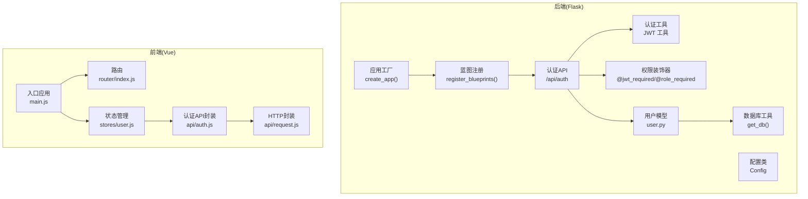
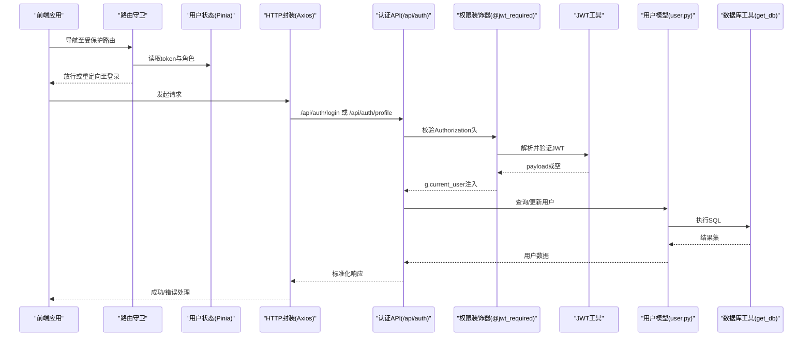
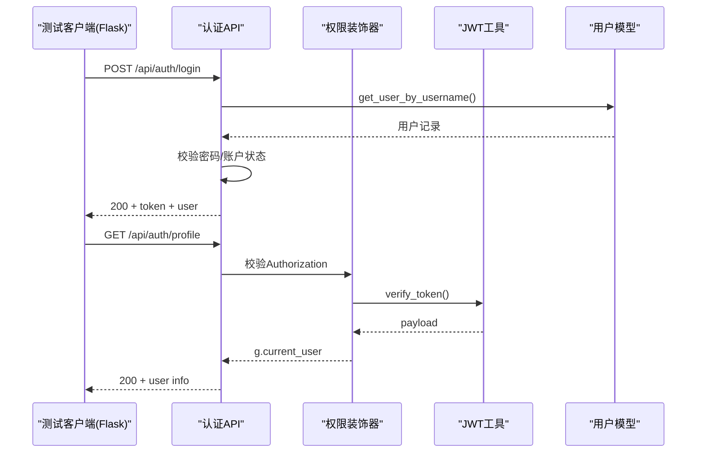
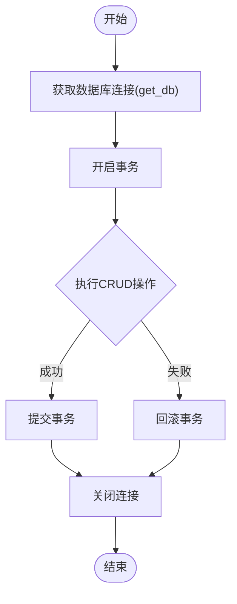
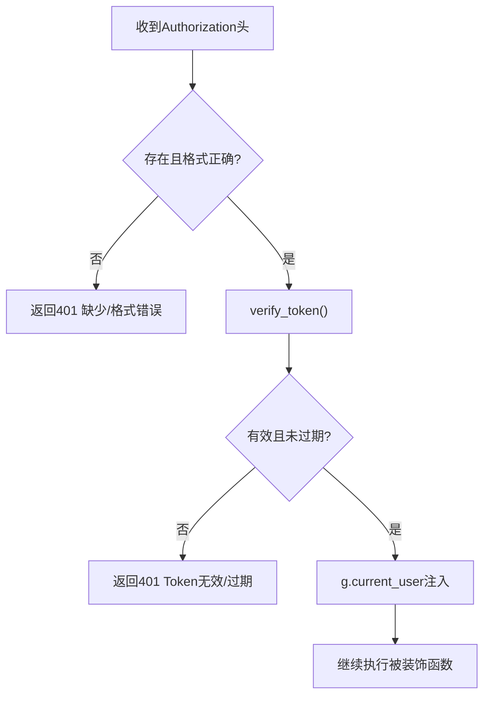
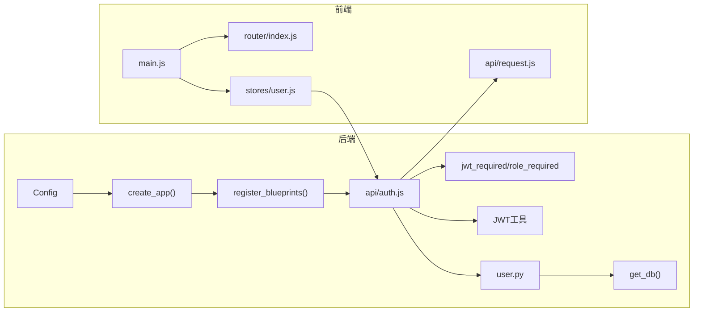

# 测试指南

<cite>
**本文引用的文件**
- [backend/app/__init__.py](file://backend/app/__init__.py)
- [backend/app/config.py](file://backend/app/config.py)
- [backend/app/utils/db.py](file://backend/app/utils/db.py)
- [backend/app/utils/auth.py](file://backend/app/utils/auth.py)
- [backend/app/utils/decorators.py](file://backend/app/utils/decorators.py)
- [backend/app/models/user.py](file://backend/app/models/user.py)
- [backend/app/api/auth.py](file://backend/app/api/auth.py)
- [frontend/src/main.js](file://frontend/src/main.js)
- [frontend/src/router/index.js](file://frontend/src/router/index.js)
- [frontend/src/stores/user.js](file://frontend/src/stores/user.js)
- [frontend/src/api/request.js](file://frontend/src/api/request.js)
- [frontend/src/api/auth.js](file://frontend/src/api/auth.js)
- [frontend/package.json](file://frontend/package.json)
</cite>

## 目录
1. [简介](#简介)
2. [项目结构](#项目结构)
3. [核心组件](#核心组件)
4. [架构总览](#架构总览)
5. [详细组件分析](#详细组件分析)
6. [依赖分析](#依赖分析)
7. [性能考虑](#性能考虑)
8. [故障排查指南](#故障排查指南)
9. [结论](#结论)
10. [附录](#附录)

## 简介
本测试指南面向云运维平台的前后端一体化测试实践，覆盖单元测试、集成测试与端到端测试的完整设计与实施路径。内容包括：
- 后端 Flask API 的测试策略：认证授权、数据库操作、通用装饰器与工具函数
- 前端 Vue 组件、路由守卫与 API 服务层的测试策略
- 集成测试与端到端测试流程、用户工作流测试与 API 接口测试
- 测试工具配置建议（pytest、unittest、Jest）、覆盖率目标与持续集成中的测试自动化

## 项目结构
后端采用 Flask 微服务架构，按功能模块组织蓝图；前端基于 Vue 3 + Pinia + Vue Router，通过 Axios 发起 API 请求。整体结构清晰，便于分层测试。

图表来源
- [backend/app/__init__.py:6-34](file://backend/app/__init__.py#L6-L34)
- [backend/app/__init__.py:37-62](file://backend/app/__init__.py#L37-L62)
- [backend/app/config.py:4-21](file://backend/app/config.py#L4-L21)
- [backend/app/utils/db.py:5-17](file://backend/app/utils/db.py#L5-L17)
- [backend/app/utils/auth.py:11-83](file://backend/app/utils/auth.py#L11-L83)
- [backend/app/utils/decorators.py:9-95](file://backend/app/utils/decorators.py#L9-L95)
- [backend/app/models/user.py:8-183](file://backend/app/models/user.py#L8-L183)
- [frontend/src/main.js:1-23](file://frontend/src/main.js#L1-L23)
- [frontend/src/router/index.js:1-61](file://frontend/src/router/index.js#L1-L61)
- [frontend/src/stores/user.js:1-41](file://frontend/src/stores/user.js#L1-L41)
- [frontend/src/api/request.js:1-54](file://frontend/src/api/request.js#L1-L54)
- [frontend/src/api/auth.js:1-14](file://frontend/src/api/auth.js#L1-L14)

章节来源
- [backend/app/__init__.py:6-62](file://backend/app/__init__.py#L6-L62)
- [backend/app/config.py:4-21](file://backend/app/config.py#L4-L21)
- [frontend/src/main.js:1-23](file://frontend/src/main.js#L1-L23)

## 核心组件
- 应用工厂与蓝图注册：通过工厂函数创建应用并集中注册各模块蓝图，便于测试时按需启用/隔离模块。
- 配置管理：统一读取环境变量，支持开发与生产差异配置。
- 数据库工具：集中化数据库连接获取逻辑，便于在测试中替换为内存数据库或模拟连接。
- 认证与权限：JWT 工具、装饰器与用户模型构成认证授权闭环。
- 前端路由与状态：路由守卫负责鉴权与管理员权限校验；Pinia Store 管理用户态；Axios 封装统一处理请求/响应与错误。

章节来源
- [backend/app/__init__.py:6-62](file://backend/app/__init__.py#L6-L62)
- [backend/app/config.py:4-21](file://backend/app/config.py#L4-L21)
- [backend/app/utils/db.py:5-17](file://backend/app/utils/db.py#L5-L17)
- [backend/app/utils/auth.py:11-83](file://backend/app/utils/auth.py#L11-L83)
- [backend/app/utils/decorators.py:9-95](file://backend/app/utils/decorators.py#L9-L95)
- [backend/app/models/user.py:8-183](file://backend/app/models/user.py#L8-L183)
- [frontend/src/router/index.js:36-58](file://frontend/src/router/index.js#L36-L58)
- [frontend/src/stores/user.js:1-41](file://frontend/src/stores/user.js#L1-L41)
- [frontend/src/api/request.js:1-54](file://frontend/src/api/request.js#L1-L54)

## 架构总览
下图展示测试视角下的关键交互：前端通过 Axios 调用后端 API，后端经装饰器进行 JWT 校验，访问数据库工具与模型层，最终返回标准化响应。

图表来源
- [frontend/src/router/index.js:36-58](file://frontend/src/router/index.js#L36-L58)
- [frontend/src/stores/user.js:1-41](file://frontend/src/stores/user.js#L1-L41)
- [frontend/src/api/request.js:13-51](file://frontend/src/api/request.js#L13-L51)
- [backend/app/api/auth.py:14-184](file://backend/app/api/auth.py#L14-L184)
- [backend/app/utils/decorators.py:9-56](file://backend/app/utils/decorators.py#L9-L56)
- [backend/app/utils/auth.py:38-83](file://backend/app/utils/auth.py#L38-L83)
- [backend/app/models/user.py:39-183](file://backend/app/models/user.py#L39-L183)
- [backend/app/utils/db.py:5-17](file://backend/app/utils/db.py#L5-L17)

## 详细组件分析

### 后端：Flask API 测试（以认证模块为例）
- 测试目标
  - 登录接口：用户名/密码校验、账户状态、令牌签发
  - 个人信息接口：JWT 认证、用户信息返回
  - 修改密码接口：旧密码校验、新密码长度限制、数据库更新
- 关键断言点
  - HTTP 状态码与响应体结构
  - JWT 令牌有效性与过期时间
  - 用户状态与权限控制
- 测试策略
  - 单元测试：对装饰器、JWT 工具、用户模型进行独立验证
  - 集成测试：使用 Flask 测试客户端发起请求，覆盖路由与装饰器链路
  - 数据库测试：使用内存数据库或测试专用数据库，确保事务回滚与隔离

图表来源
- [backend/app/api/auth.py:14-184](file://backend/app/api/auth.py#L14-L184)
- [backend/app/utils/decorators.py:9-56](file://backend/app/utils/decorators.py#L9-L56)
- [backend/app/utils/auth.py:38-83](file://backend/app/utils/auth.py#L38-L83)
- [backend/app/models/user.py:39-81](file://backend/app/models/user.py#L39-L81)

章节来源
- [backend/app/api/auth.py:14-184](file://backend/app/api/auth.py#L14-L184)
- [backend/app/utils/decorators.py:9-95](file://backend/app/utils/decorators.py#L9-L95)
- [backend/app/utils/auth.py:11-83](file://backend/app/utils/auth.py#L11-L83)
- [backend/app/models/user.py:39-183](file://backend/app/models/user.py#L39-L183)

### 后端：数据库操作测试
- 测试目标
  - 用户 CRUD 操作：创建、查询、更新、删除
  - 连接池与事务：连接获取、提交/回滚、异常处理
- 测试策略
  - 使用测试数据库或内存数据库（如 SQLite）替代生产数据库
  - 在每个测试用例前后执行迁移/清理脚本，保证隔离性
  - 对敏感 SQL 参数进行参数化绑定，避免注入风险

图表来源
- [backend/app/utils/db.py:5-17](file://backend/app/utils/db.py#L5-L17)
- [backend/app/models/user.py:8-183](file://backend/app/models/user.py#L8-L183)

章节来源
- [backend/app/utils/db.py:5-17](file://backend/app/utils/db.py#L5-L17)
- [backend/app/models/user.py:8-183](file://backend/app/models/user.py#L8-L183)

### 后端：认证授权测试
- 测试目标
  - JWT 生成与验证：负载结构、签名算法、过期时间
  - 装饰器链路：缺失/错误令牌、过期令牌、权限不足
- 测试策略
  - 单元测试：对 generate_token/verify_token 进行边界与异常输入验证
  - 集成测试：构造不同令牌场景（有效、无效、过期、格式错误），验证装饰器行为

图表来源
- [backend/app/utils/decorators.py:20-56](file://backend/app/utils/decorators.py#L20-L56)
- [backend/app/utils/auth.py:38-56](file://backend/app/utils/auth.py#L38-L56)

章节来源
- [backend/app/utils/auth.py:11-83](file://backend/app/utils/auth.py#L11-L83)
- [backend/app/utils/decorators.py:9-95](file://backend/app/utils/decorators.py#L9-L95)

### 前端：Vue 组件测试策略
- 测试目标
  - 组件渲染与交互：Props、事件、插槽
  - 路由守卫：登录态、管理员权限、页面标题
  - API 服务层：请求拦截、响应拦截、错误处理
- 测试策略
  - 使用测试框架（如 Vitest/Jest）与 DOM 测试库（如 @testing-library/vue）
  - Mock Axios 请求，断言请求参数与错误提示
  - 使用 Memory History 测试路由守卫逻辑

章节来源
- [frontend/src/router/index.js:36-58](file://frontend/src/router/index.js#L36-L58)
- [frontend/src/api/request.js:13-51](file://frontend/src/api/request.js#L13-L51)
- [frontend/src/stores/user.js:1-41](file://frontend/src/stores/user.js#L1-L41)

### 前端：路由守卫测试
- 测试目标
  - 登录页无需认证
  - 已登录用户访问登录页重定向
  - 需要管理员的页面仅管理员可访问
  - 未登录访问受保护路由重定向至登录
- 测试策略
  - 设置 localStorage 中的 token 与 userInfo
  - 使用 Memory History 与 beforeEach 钩子验证 next() 行为

章节来源
- [frontend/src/router/index.js:36-58](file://frontend/src/router/index.js#L36-L58)

### 前端：API 服务层测试
- 测试目标
  - 请求拦截器：自动附加 Bearer Token
  - 响应拦截器：统一错误处理与登出逻辑
  - 业务封装：登录、获取资料、修改密码
- 测试策略
  - Mock Axios 实例，断言请求头与错误分支
  - 断言消息提示与路由跳转行为

章节来源
- [frontend/src/api/request.js:13-51](file://frontend/src/api/request.js#L13-L51)
- [frontend/src/api/auth.js:1-14](file://frontend/src/api/auth.js#L1-L14)

### 集成测试：端到端测试流程
- 测试目标
  - 用户工作流：登录 → 查看仪表盘 → 管理资源 → 修改密码
  - API 接口测试：认证、用户管理、资源管理等
- 测试策略
  - 使用端到端测试框架（如 Playwright/Cypress）
  - 前端：Mock 后端 API，断言 UI 行为与路由跳转
  - 后端：使用测试数据库，断言接口响应与数据库变更

章节来源
- [frontend/src/main.js:1-23](file://frontend/src/main.js#L1-L23)
- [backend/app/api/auth.py:14-184](file://backend/app/api/auth.py#L14-L184)

## 依赖分析
- 后端依赖
  - Flask 应用工厂与蓝图注册
  - 配置类集中管理环境变量
  - 数据库工具与用户模型
  - 认证工具与权限装饰器
- 前端依赖
  - 应用入口挂载路由与状态管理
  - 路由守卫与 Pinia Store
  - Axios 封装与认证 API 封装

图表来源
- [backend/app/__init__.py:6-62](file://backend/app/__init__.py#L6-L62)
- [backend/app/config.py:4-21](file://backend/app/config.py#L4-L21)
- [backend/app/utils/db.py:5-17](file://backend/app/utils/db.py#L5-L17)
- [backend/app/utils/auth.py:11-83](file://backend/app/utils/auth.py#L11-L83)
- [backend/app/utils/decorators.py:9-95](file://backend/app/utils/decorators.py#L9-L95)
- [backend/app/models/user.py:8-183](file://backend/app/models/user.py#L8-L183)
- [frontend/src/main.js:1-23](file://frontend/src/main.js#L1-L23)
- [frontend/src/router/index.js:1-61](file://frontend/src/router/index.js#L1-L61)
- [frontend/src/stores/user.js:1-41](file://frontend/src/stores/user.js#L1-L41)
- [frontend/src/api/request.js:1-54](file://frontend/src/api/request.js#L1-L54)
- [frontend/src/api/auth.js:1-14](file://frontend/src/api/auth.js#L1-L14)

章节来源
- [backend/app/__init__.py:6-62](file://backend/app/__init__.py#L6-L62)
- [backend/app/config.py:4-21](file://backend/app/config.py#L4-L21)
- [frontend/src/main.js:1-23](file://frontend/src/main.js#L1-L23)

## 性能考虑
- 测试数据库选择：优先使用内存数据库或轻量级嵌入式数据库，减少 IO 开销
- 并发与隔离：每个测试用例独立连接与事务，避免共享状态
- Mock 策略：对外部依赖（如 HTTP、数据库）进行合理 Mock，提升测试速度
- 覆盖率：建议后端关键路径覆盖率不低于 80%，前端交互与路由守卫不低于 70%

## 故障排查指南
- 认证相关
  - 401 缺少/格式错误认证信息：检查 Authorization 头是否为 Bearer Token
  - 401 Token 无效或已过期：确认 JWT Secret 与过期时间配置
  - 403 权限不足：确认用户角色与装饰器要求的角色集合
- 数据库相关
  - 连接失败：核对数据库主机、端口、账号与密码
  - 事务未提交：确保在测试中使用回滚或清理脚本
- 前端相关
  - 登录后无法进入受保护页面：检查 localStorage 中 token 与 userInfo 的同步
  - 错误提示未显示：确认响应拦截器对 code 字段的判断与消息提示逻辑

章节来源
- [backend/app/utils/decorators.py:20-56](file://backend/app/utils/decorators.py#L20-L56)
- [backend/app/utils/auth.py:38-56](file://backend/app/utils/auth.py#L38-L56)
- [backend/app/utils/db.py:5-17](file://backend/app/utils/db.py#L5-L17)
- [frontend/src/api/request.js:25-51](file://frontend/src/api/request.js#L25-L51)
- [frontend/src/router/index.js:36-58](file://frontend/src/router/index.js#L36-L58)

## 结论
本测试指南提供了从单元到集成再到端到端的全栈测试方案。通过明确的测试目标、断言点与策略，结合合理的 Mock 与隔离手段，能够有效保障认证授权、数据库操作与前端交互的稳定性与可靠性。建议在持续集成中引入自动化测试流水线，并设定覆盖率门槛，确保质量持续改进。

## 附录
- 测试工具与配置建议
  - 后端
    - pytest：用于 Flask API 与数据库测试，支持夹具与参数化
    - unittest：标准库，适合简单单元测试
    - 覆盖率：pytest-cov 或 coverage.py，建议后端关键路径覆盖率不低于 80%
  - 前端
    - Jest/Vitest：用于组件、路由守卫与 API 层测试
    - 覆盖率：Istanbul/NYC 或 vitest-coverage，建议交互与路由守卫不低于 70%
  - 持续集成
    - 在 CI 中分别执行后端与前端测试，合并覆盖率报告
    - 失败即阻断发布，确保问题在合并前发现

章节来源
- [frontend/package.json:1-24](file://frontend/package.json#L1-L24)