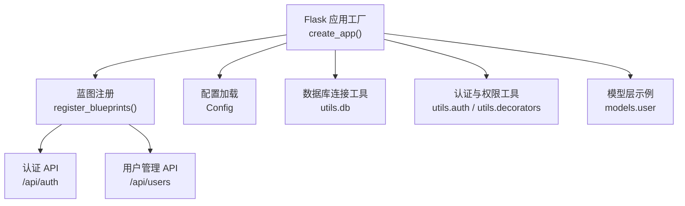
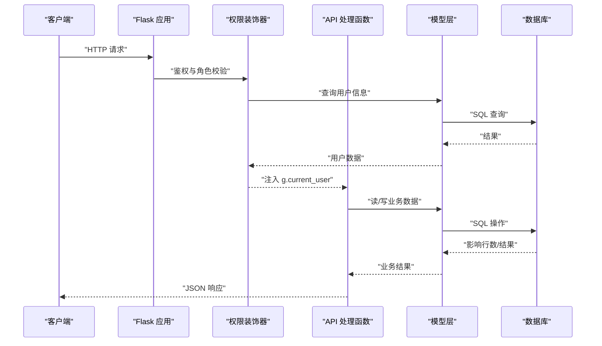
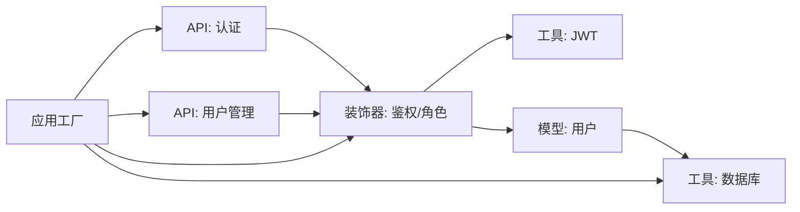

# 测试策略

<cite>
**本文引用的文件**
- [backend/app/__init__.py](file://backend/app/__init__.py)
- [backend/app/config.py](file://backend/app/config.py)
- [backend/app/extensions.py](file://backend/app/extensions.py)
- [backend/requirements.txt](file://backend/requirements.txt)
- [backend/docker-compose.yml](file://backend/docker-compose.yml)
- [backend/app/utils/db.py](file://backend/app/utils/db.py)
- [backend/app/utils/auth.py](file://backend/app/utils/auth.py)
- [backend/app/utils/validators.py](file://backend/app/utils/validators.py)
- [backend/app/utils/decorators.py](file://backend/app/utils/decorators.py)
- [backend/app/models/user.py](file://backend/app/models/user.py)
- [backend/app/api/auth.py](file://backend/app/api/auth.py)
- [backend/app/api/users.py](file://backend/app/api/users.py)
</cite>

## 目录
1. [引言](#引言)
2. [项目结构](#项目结构)
3. [核心组件](#核心组件)
4. [架构总览](#架构总览)
5. [详细组件分析](#详细组件分析)
6. [依赖分析](#依赖分析)
7. [性能考虑](#性能考虑)
8. [故障排查指南](#故障排查指南)
9. [结论](#结论)
10. [附录](#附录)

## 引言
本测试策略文档面向 OPS 项目，围绕测试金字塔（单元测试、集成测试、API 测试、端到端测试）给出覆盖范围与实施方法，明确单元测试编写规范（用例设计原则、Mock 使用、断言策略），提供 API 测试指南（RESTful 接口测试、参数验证、错误场景、性能测试），制定数据库测试策略（测试数据准备、事务回滚、数据清理），并推荐测试工具与环境配置，最后给出测试覆盖率要求与持续集成中的测试流程建议。

## 项目结构
后端采用 Flask 应用，通过工厂函数创建应用实例，并注册多个蓝图提供 REST API。配置由 Config 类统一管理，数据库连接通过工具模块封装，认证与权限控制由工具模块与装饰器协同完成。整体结构清晰，便于按层次开展测试。

图表来源
- [backend/app/__init__.py:28-149](file://backend/app/__init__.py#L28-L149)
- [backend/app/config.py:10-58](file://backend/app/config.py#L10-L58)
- [backend/app/utils/db.py:43-80](file://backend/app/utils/db.py#L43-L80)
- [backend/app/utils/auth.py:9-45](file://backend/app/utils/auth.py#L9-L45)
- [backend/app/utils/decorators.py:26-163](file://backend/app/utils/decorators.py#L26-L163)
- [backend/app/models/user.py:8-162](file://backend/app/models/user.py#L8-L162)

章节来源
- [backend/app/__init__.py:28-149](file://backend/app/__init__.py#L28-L149)
- [backend/app/config.py:10-58](file://backend/app/config.py#L10-L58)

## 核心组件
- 应用工厂与蓝图注册：负责应用初始化、CORS 配置、数据库预检、定时任务初始化以及蓝图注册。
- 配置模块：集中管理密钥、数据库、CORS、上传目录、定时任务表达式等配置项。
- 数据库工具：提供连接获取、关闭、连接参数掩码与日志输出。
- 认证与权限工具：提供 JWT 生成与校验、权限装饰器链（鉴权+角色）。
- 模型层：封装用户表的增删改查与密码更新。
- API 层：提供认证、用户管理等业务接口，包含输入校验、权限控制与操作日志。

章节来源
- [backend/app/__init__.py:28-149](file://backend/app/__init__.py#L28-L149)
- [backend/app/config.py:10-58](file://backend/app/config.py#L10-L58)
- [backend/app/utils/db.py:43-80](file://backend/app/utils/db.py#L43-L80)
- [backend/app/utils/auth.py:9-45](file://backend/app/utils/auth.py#L9-L45)
- [backend/app/utils/decorators.py:26-163](file://backend/app/utils/decorators.py#L26-L163)
- [backend/app/models/user.py:8-162](file://backend/app/models/user.py#L8-L162)
- [backend/app/api/auth.py:15-197](file://backend/app/api/auth.py#L15-L197)
- [backend/app/api/users.py:19-290](file://backend/app/api/users.py#L19-L290)

## 架构总览
下图展示应用启动、请求处理与数据库交互的关键路径，有助于理解测试边界与隔离点。

图表来源
- [backend/app/__init__.py:116-149](file://backend/app/__init__.py#L116-L149)
- [backend/app/utils/decorators.py:26-163](file://backend/app/utils/decorators.py#L26-L163)
- [backend/app/api/auth.py:15-197](file://backend/app/api/auth.py#L15-L197)
- [backend/app/api/users.py:19-290](file://backend/app/api/users.py#L19-L290)
- [backend/app/models/user.py:8-162](file://backend/app/models/user.py#L8-L162)
- [backend/app/utils/db.py:43-80](file://backend/app/utils/db.py#L43-L80)

## 详细组件分析

### 单元测试策略
- 测试范围
  - 工具函数：认证工具（JWT 生成/校验）、参数校验（IP/主机名/URL/端口/域名/密码/用户名/邮箱/整数/正整数/字符串长度）、装饰器（鉴权/角色）。
  - 模型层：用户模型的增删改查与密码更新。
- 编写规范
  - 用例设计原则：覆盖正常路径、边界条件、非法输入、异常分支。
  - Mock 使用：对外部依赖（数据库连接、外部 API、时间）进行 Mock，确保测试稳定与可重复。
  - 断言策略：优先断言返回值与副作用；对异常路径断言抛出的异常类型与消息；对数据库操作断言影响行数或最终状态。
- 示例断言点
  - 认证工具：断言生成 Token 的负载包含预期字段，断言过期/无效 Token 解码失败。
  - 参数校验：断言合法输入返回真，非法输入返回假；对边界长度与格式进行覆盖。
  - 权限装饰器：断言缺失/错误格式 Authorization 返回 401；断言用户不存在/禁用返回 401；断言密码变更后签发时间早于变更时间返回 401；断言角色不足返回 403。
  - 模型层：断言插入/更新/删除影响行数；断言查询返回期望字段集合；断言异常路径抛出数据库异常。

章节来源
- [backend/app/utils/auth.py:9-45](file://backend/app/utils/auth.py#L9-L45)
- [backend/app/utils/validators.py:6-151](file://backend/app/utils/validators.py#L6-L151)
- [backend/app/utils/decorators.py:26-163](file://backend/app/utils/decorators.py#L26-L163)
- [backend/app/models/user.py:8-162](file://backend/app/models/user.py#L8-L162)

### 集成测试策略
- 测试范围
  - 应用启动与数据库预检：断言数据库连接成功、模式初始化、定时任务调度器初始化。
  - 蓝图注册与路由可达性：断言根路由返回服务状态。
  - 权限链路：鉴权装饰器与角色装饰器组合使用，断言中间件拦截与放行逻辑。
- 实施方法
  - 使用 Flask 测试客户端发起请求，构造带有效/无效 Token 的请求头。
  - 通过临时数据库连接或内存数据库进行隔离测试。
  - 对外部依赖（如第三方证书/域名检查）进行 Mock。

章节来源
- [backend/app/__init__.py:88-113](file://backend/app/__init__.py#L88-L113)
- [backend/app/__init__.py:116-149](file://backend/app/__init__.py#L116-L149)
- [backend/app/utils/decorators.py:26-163](file://backend/app/utils/decorators.py#L26-L163)

### API 测试指南
- RESTful 接口测试
  - 认证接口：登录、获取个人资料、修改密码。
  - 用户管理接口：获取用户列表、创建用户、更新用户、删除用户、重置密码。
- 参数验证与错误场景
  - 必填字段缺失、格式不合法、长度超限、角色非法、用户不存在、用户被禁用、权限不足、Token 过期/无效、自身删除等。
- 性能测试
  - 并发请求下的响应时间与吞吐量；数据库连接池压力；鉴权与角色检查开销。
- 测试要点
  - 使用测试客户端模拟请求，构造不同角色与权限的用户上下文。
  - 对每个接口编写正向与负向用例，覆盖 2xx/4xx/5xx 场景。
  - 对需要上传的接口（如证书/导出）准备最小化测试文件。

章节来源
- [backend/app/api/auth.py:15-197](file://backend/app/api/auth.py#L15-L197)
- [backend/app/api/users.py:19-290](file://backend/app/api/users.py#L19-L290)
- [backend/app/utils/validators.py:6-151](file://backend/app/utils/validators.py#L6-L151)

### 数据库测试策略
- 测试数据准备
  - 使用固定种子数据或在测试前执行轻量级初始化脚本。
  - 对敏感字段（密码）使用哈希值而非明文。
- 事务回滚
  - 在单测中使用事务包裹，测试结束后回滚，避免污染数据库。
  - 对集成测试使用独立测试库或临时表空间。
- 数据清理
  - 测试完成后清理新增数据，保持测试环境干净。
  - 对定时任务与外部系统调用进行隔离，避免副作用。

章节来源
- [backend/app/utils/db.py:43-80](file://backend/app/utils/db.py#L43-L80)
- [backend/app/models/user.py:8-162](file://backend/app/models/user.py#L8-L162)

### 测试工具与环境配置
- 推荐工具
  - pytest：功能强大、插件丰富、支持 Fixture 与参数化。
  - unittest：Python 标准库，适合基础断言与简单场景。
  - requests：用于 API 测试的 HTTP 客户端。
  - Flask 测试客户端：无需启动真实服务器即可测试路由与中间件。
  - coverage：覆盖率统计。
- 环境配置
  - 使用 docker-compose 启动 MySQL 与后端服务，确保数据库健康后再运行测试。
  - 通过环境变量切换测试配置（如 SECRET_KEY、JWT_SECRET_KEY、DB_*）。
  - 前端静态资源可挂载只读目录，不影响后端测试。

章节来源
- [backend/requirements.txt:1-17](file://backend/requirements.txt#L1-L17)
- [backend/docker-compose.yml:1-103](file://backend/docker-compose.yml#L1-L103)
- [backend/app/config.py:10-58](file://backend/app/config.py#L10-L58)

## 依赖分析
- 组件耦合
  - API 层依赖装饰器（鉴权/角色）、模型层、工具层（认证、校验、数据库、日志）。
  - 应用工厂负责装配各模块，蓝图注册形成清晰的路由边界。
- 外部依赖
  - 数据库驱动（pymysql）、JWT、CORS、APScheduler、OpenPyXL、Paramiko 等。
- 循环依赖
  - 当前结构未见循环导入；装饰器依赖认证工具，认证工具依赖配置，属于单向依赖。

图表来源
- [backend/app/api/auth.py:15-197](file://backend/app/api/auth.py#L15-L197)
- [backend/app/api/users.py:19-290](file://backend/app/api/users.py#L19-L290)
- [backend/app/utils/decorators.py:26-163](file://backend/app/utils/decorators.py#L26-L163)
- [backend/app/utils/auth.py:9-45](file://backend/app/utils/auth.py#L9-L45)
- [backend/app/models/user.py:8-162](file://backend/app/models/user.py#L8-L162)
- [backend/app/utils/db.py:43-80](file://backend/app/utils/db.py#L43-L80)
- [backend/app/__init__.py:116-149](file://backend/app/__init__.py#L116-L149)

## 性能考虑
- 单元测试：避免真实网络与数据库 IO，使用 Mock 与内存存储。
- 集成测试：关注鉴权中间件与数据库连接池的性能瓶颈；对批量操作进行压力测试。
- API 测试：并发与限流策略；对大对象上传与导出接口进行吞吐量与延迟评估。
- 数据库测试：使用连接池与事务回滚减少开销；对热点查询建立索引并进行 EXPLAIN 分析。

## 故障排查指南
- 数据库连接失败
  - 检查环境变量 DB_HOST/DB_PORT/DB_USER/DB_PASSWORD/DB_NAME。
  - 查看应用日志中的连接参数脱敏输出与异常堆栈。
- JWT 相关问题
  - 确认 SECRET_KEY/JWT_SECRET_KEY/JWT_EXPIRATION_HOURS 设置。
  - 校验 Token 格式与过期时间；检查密码变更后签发时间与用户变更时间的比较逻辑。
- 权限不足
  - 确认用户角色与接口所需角色匹配；检查装饰器顺序（jwt_required 必须在 role_required 之前）。
- API 响应异常
  - 使用测试客户端复现请求路径；检查请求体格式、必填字段与参数校验规则。

章节来源
- [backend/app/utils/db.py:28-80](file://backend/app/utils/db.py#L28-L80)
- [backend/app/utils/auth.py:9-45](file://backend/app/utils/auth.py#L9-L45)
- [backend/app/utils/decorators.py:26-163](file://backend/app/utils/decorators.py#L26-L163)
- [backend/app/config.py:10-58](file://backend/app/config.py#L10-L58)

## 结论
OPS 项目具备清晰的分层结构与完善的配置体系，适合按测试金字塔分层推进测试工作。建议优先补齐单元测试与参数校验测试，再逐步扩展集成与 API 测试，并在 CI 中引入覆盖率与性能回归检查，以保障系统质量与稳定性。

## 附录
- 测试金字塔建议
  - 单元测试：工具函数、模型层、装饰器。
  - 集成测试：应用启动、蓝图注册、数据库预检。
  - API 测试：认证、用户管理等核心接口。
  - 端到端测试：前端交互与后端联调。
- 覆盖率要求建议
  - 关键路径（工具函数、模型层、鉴权/角色装饰器）达到高覆盖率（>80%）。
  - API 层对主流程与错误分支均需覆盖。
- 持续集成流程建议
  - 容器化启动 MySQL 与后端服务，健康检查通过后执行 pytest。
  - 生成覆盖率报告并上传至代码托管平台。
  - 对关键分支与 PR 进行自动化测试与覆盖率阈值校验。