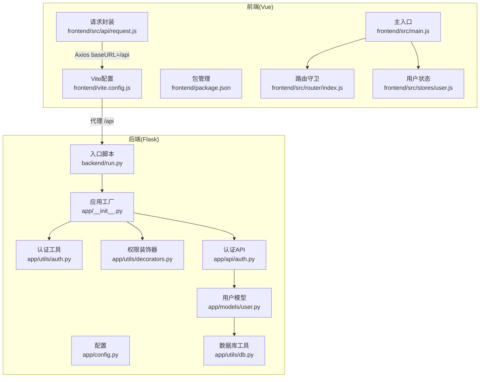
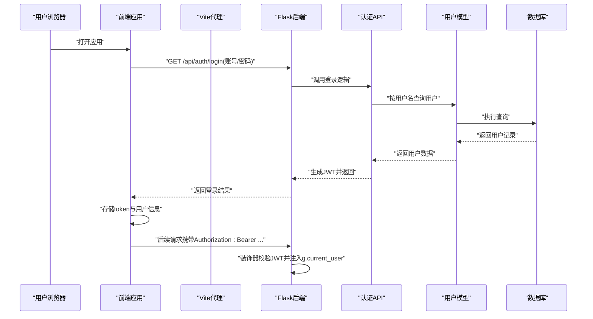
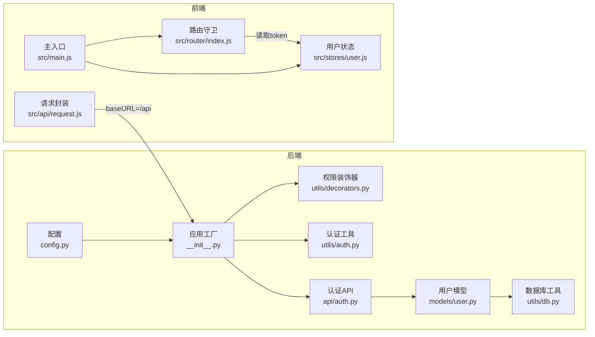
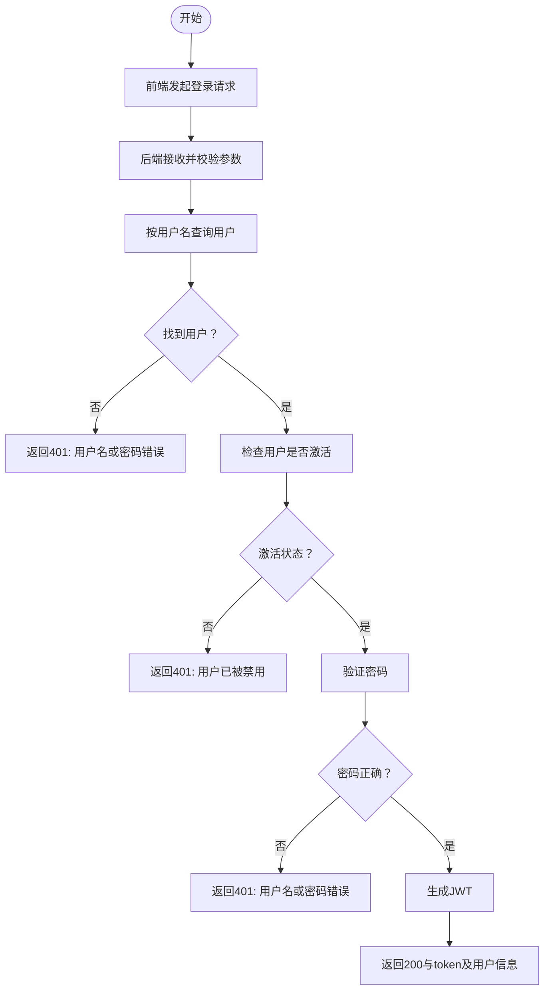

# 调试与故障排除

<cite>
**本文引用的文件**
- [backend/app/__init__.py](file://backend/app/__init__.py)
- [backend/app/config.py](file://backend/app/config.py)
- [backend/run.py](file://backend/run.py)
- [backend/app/utils/db.py](file://backend/app/utils/db.py)
- [backend/app/utils/auth.py](file://backend/app/utils/auth.py)
- [backend/app/utils/decorators.py](file://backend/app/utils/decorators.py)
- [backend/app/models/user.py](file://backend/app/models/user.py)
- [backend/app/api/auth.py](file://backend/app/api/auth.py)
- [frontend/vite.config.js](file://frontend/vite.config.js)
- [frontend/package.json](file://frontend/package.json)
- [frontend/src/api/request.js](file://frontend/src/api/request.js)
- [frontend/src/main.js](file://frontend/src/main.js)
- [frontend/src/stores/user.js](file://frontend/src/stores/user.js)
- [frontend/src/router/index.js](file://frontend/src/router/index.js)
</cite>

## 目录
1. [简介](#简介)
2. [项目结构](#项目结构)
3. [核心组件](#核心组件)
4. [架构总览](#架构总览)
5. [详细组件分析](#详细组件分析)
6. [依赖分析](#依赖分析)
7. [性能考虑](#性能考虑)
8. [故障排除指南](#故障排除指南)
9. [结论](#结论)
10. [附录](#附录)

## 简介
本指南面向云运维平台的开发与运维人员，聚焦于开发环境下的调试与故障排除。内容涵盖：
- Flask 应用调试：启动参数、环境变量、CORS、蓝图注册、认证中间件等。
- Vue 开发服务器调试：Vite 代理、路由守卫、状态管理、请求拦截器。
- 数据库连接调试：连接配置、连接池与超时、SQL 执行与回滚。
- 常见问题诊断：认证失败、数据库连接异常、前端构建问题、API 接口错误。
- 日志分析：后端日志记录、前端错误追踪、网络请求调试。
- 性能排查：数据库查询优化、API 响应时间分析、前端渲染性能优化。
- 工具与最佳实践：调试工具使用、问题定位流程。

## 项目结构
后端采用 Flask 微服务风格，按功能拆分蓝图；前端采用 Vite + Vue 3 + Pinia + Vue Router，通过 Axios 发起 API 请求，并以本地代理对接后端。

图表来源
- [backend/app/__init__.py:1-62](file://backend/app/__init__.py#L1-L62)
- [backend/app/config.py:1-21](file://backend/app/config.py#L1-L21)
- [backend/run.py:1-8](file://backend/run.py#L1-L8)
- [backend/app/utils/db.py:1-17](file://backend/app/utils/db.py#L1-L17)
- [backend/app/utils/auth.py:1-83](file://backend/app/utils/auth.py#L1-L83)
- [backend/app/utils/decorators.py:1-95](file://backend/app/utils/decorators.py#L1-L95)
- [backend/app/models/user.py:1-183](file://backend/app/models/user.py#L1-L183)
- [backend/app/api/auth.py:1-184](file://backend/app/api/auth.py#L1-L184)
- [frontend/vite.config.js:1-17](file://frontend/vite.config.js#L1-L17)
- [frontend/package.json:1-24](file://frontend/package.json#L1-L24)
- [frontend/src/api/request.js:1-54](file://frontend/src/api/request.js#L1-L54)
- [frontend/src/main.js:1-23](file://frontend/src/main.js#L1-L23)
- [frontend/src/router/index.js:1-61](file://frontend/src/router/index.js#L1-L61)
- [frontend/src/stores/user.js:1-41](file://frontend/src/stores/user.js#L1-L41)

章节来源
- [backend/app/__init__.py:1-62](file://backend/app/__init__.py#L1-L62)
- [backend/app/config.py:1-21](file://backend/app/config.py#L1-L21)
- [backend/run.py:1-8](file://backend/run.py#L1-L8)
- [frontend/vite.config.js:1-17](file://frontend/vite.config.js#L1-L17)
- [frontend/package.json:1-24](file://frontend/package.json#L1-L24)

## 核心组件
- 后端应用工厂与蓝图注册：负责应用初始化、CORS、定时任务、蓝图注册。
- 配置中心：集中管理密钥、数据库、Flask 运行参数、上传目录与大小限制。
- 认证与权限：JWT 生成与校验、请求装饰器、角色权限控制。
- 数据访问层：统一数据库连接获取、用户相关 CRUD。
- 前端请求封装：Axios 实例、请求/响应拦截器、统一错误处理。
- 前端路由与状态：路由守卫、Pinia 状态持久化、登录态同步。

章节来源
- [backend/app/__init__.py:6-34](file://backend/app/__init__.py#L6-L34)
- [backend/app/config.py:4-21](file://backend/app/config.py#L4-L21)
- [backend/app/utils/auth.py:11-35](file://backend/app/utils/auth.py#L11-L35)
- [backend/app/utils/decorators.py:9-56](file://backend/app/utils/decorators.py#L9-L56)
- [backend/app/utils/db.py:5-16](file://backend/app/utils/db.py#L5-L16)
- [backend/app/models/user.py:8-36](file://backend/app/models/user.py#L8-L36)
- [frontend/src/api/request.js:5-51](file://frontend/src/api/request.js#L5-L51)
- [frontend/src/router/index.js:36-58](file://frontend/src/router/index.js#L36-L58)
- [frontend/src/stores/user.js:5-39](file://frontend/src/stores/user.js#L5-L39)

## 架构总览
后端通过应用工厂创建 Flask 应用，注册多个业务蓝图；前端通过 Vite 代理将 /api 前缀转发至后端。认证流程基于 JWT，前端在请求头携带 Bearer Token，后端通过装饰器校验并注入用户上下文。

图表来源
- [backend/app/api/auth.py:14-82](file://backend/app/api/auth.py#L14-L82)
- [backend/app/models/user.py:39-58](file://backend/app/models/user.py#L39-L58)
- [backend/app/utils/decorators.py:20-56](file://backend/app/utils/decorators.py#L20-L56)
- [frontend/src/api/request.js:14-23](file://frontend/src/api/request.js#L14-L23)

## 详细组件分析

### Flask 应用与配置调试
- 启动方式：通过入口脚本读取配置并运行应用，支持主机、端口、调试模式。
- 配置项：密钥、JWT 过期时间、数据库连接参数、上传目录与大小限制。
- CORS：对 /api/* 开放跨域并允许凭据。
- 蓝图：集中注册认证、用户、导出、任务、服务器、服务、应用、证书、记录、仪表盘、字典等蓝图。

建议调试步骤
- 设置 FLASK_DEBUG、FLASK_HOST、FLASK_PORT、DB_* 等环境变量进行快速切换。
- 在应用工厂中打印关键配置键值，确认加载顺序与覆盖关系。
- 使用 curl 或 Postman 验证根路径与鉴权接口，观察返回结构。

章节来源
- [backend/run.py:4-7](file://backend/run.py#L4-L7)
- [backend/app/config.py:4-21](file://backend/app/config.py#L4-L21)
- [backend/app/__init__.py:11-34](file://backend/app/__init__.py#L11-L34)
- [backend/app/__init__.py:37-62](file://backend/app/__init__.py#L37-L62)

### Vue 开发服务器与代理调试
- Vite 代理：将 /api 前缀转发到后端地址，便于前后端联调。
- 脚本命令：dev/build/preview，便于本地开发与预览。
- 请求封装：Axios 实例设置 baseURL=/api、超时、JSON 头部；请求拦截器自动附加 Bearer Token；响应拦截器统一错误处理与 401 清理登录态。
- 主入口：安装路由、状态、UI 组件库与图标。
- 路由守卫：根据 token 与 meta 控制访问；管理员页面校验角色。
- Pinia 状态：持久化 token 与用户信息，提供计算属性与异步拉取资料。

建议调试步骤
- 确认 Vite 代理目标地址可达，查看浏览器 Network 面板 /api 请求是否被正确转发。
- 在请求拦截器断点或日志输出 Authorization 头，确保 token 正确携带。
- 在路由守卫断点，检查 token 存取与跳转逻辑。
- 使用浏览器开发者工具的 Console 查看统一错误提示与网络错误。

章节来源
- [frontend/vite.config.js:4-16](file://frontend/vite.config.js#L4-L16)
- [frontend/package.json:6-10](file://frontend/package.json#L6-L10)
- [frontend/src/api/request.js:5-51](file://frontend/src/api/request.js#L5-L51)
- [frontend/src/main.js:10-22](file://frontend/src/main.js#L10-L22)
- [frontend/src/router/index.js:36-58](file://frontend/src/router/index.js#L36-L58)
- [frontend/src/stores/user.js:5-39](file://frontend/src/stores/user.js#L5-L39)

### 认证与权限调试
- JWT 生成：载荷包含用户标识、角色、签发/过期时间，使用配置中的密钥签名。
- JWT 校验：捕获过期与无效令牌异常，返回空负载。
- 权限装饰器：从 Authorization 头解析 Bearer Token，校验失败返回 401；成功则写入 g.current_user。
- 角色装饰器：依赖已认证上下文，校验角色集合，拒绝访问返回 403。
- 登录 API：校验用户名、密码与激活状态，成功后返回 token 与用户信息。

建议调试步骤
- 使用不同密钥或过期时间测试，验证装饰器返回码。
- 在装饰器中断点，检查头部解析与 payload 内容。
- 对需要管理员权限的路由，先以普通用户登录，观察 403 行为。

章节来源
- [backend/app/utils/auth.py:11-55](file://backend/app/utils/auth.py#L11-L55)
- [backend/app/utils/decorators.py:9-56](file://backend/app/utils/decorators.py#L9-L56)
- [backend/app/utils/decorators.py:59-95](file://backend/app/utils/decorators.py#L59-L95)
- [backend/app/api/auth.py:14-82](file://backend/app/api/auth.py#L14-L82)

### 数据库连接与访问调试
- 连接获取：从应用配置读取主机、端口、用户、密码、数据库名与字符集。
- 用户模型：封装用户增删改查，使用 DictCursor 返回字典结果，finally 中关闭连接。
- 建议调试步骤
  - 在 get_db 中断点，确认配置键值正确。
  - 在 SQL 执行前后断点，观察异常堆栈与回滚行为。
  - 使用慢查询日志与 EXPLAIN 分析复杂查询。

章节来源
- [backend/app/utils/db.py:5-16](file://backend/app/utils/db.py#L5-L16)
- [backend/app/models/user.py:8-36](file://backend/app/models/user.py#L8-L36)
- [backend/app/models/user.py:61-80](file://backend/app/models/user.py#L61-L80)
- [backend/app/models/user.py:161-182](file://backend/app/models/user.py#L161-L182)

### 前端请求与错误处理调试
- 请求拦截器：从本地存储读取 token 并附加到 Authorization。
- 响应拦截器：当响应 code 非 200 或状态码为 401 时，清理本地登录态并跳转登录页。
- 统一错误提示：Element Plus 的消息组件展示错误信息。
- 建议调试步骤
  - 在拦截器断点，检查 token 读取与附加。
  - 观察响应拦截器对 401 的处理链路，确认路由跳转与消息提示。
  - 使用浏览器 Network 面板查看请求头与响应体结构。

章节来源
- [frontend/src/api/request.js:14-51](file://frontend/src/api/request.js#L14-L51)

### 路由守卫与状态同步调试
- 路由守卫：根据 meta.requiresAuth 与 requiresAdmin 控制访问；检测 token 与角色。
- Pinia 状态：持久化 token 与用户信息，提供计算属性与异步获取资料。
- 建议调试步骤
  - 在守卫断点，检查 token 读取与 userInfo 角色判断。
  - 在用户 store 异步获取资料处断点，观察错误分支与日志输出。

章节来源
- [frontend/src/router/index.js:36-58](file://frontend/src/router/index.js#L36-L58)
- [frontend/src/stores/user.js:23-30](file://frontend/src/stores/user.js#L23-L30)

## 依赖分析
- 后端
  - 应用工厂依赖配置、CORS、调度器与各蓝图模块。
  - 认证 API 依赖用户模型、认证工具与权限装饰器。
  - 用户模型依赖数据库工具。
- 前端
  - 请求封装依赖路由与 Element Plus。
  - 路由守卫依赖本地存储与路由实例。
  - 状态管理依赖 Pinia 与 API 模块。

图表来源
- [backend/app/__init__.py:19-34](file://backend/app/__init__.py#L19-L34)
- [backend/app/utils/decorators.py:1-95](file://backend/app/utils/decorators.py#L1-L95)
- [backend/app/utils/auth.py:1-83](file://backend/app/utils/auth.py#L1-L83)
- [backend/app/utils/db.py:1-17](file://backend/app/utils/db.py#L1-L17)
- [backend/app/models/user.py:1-183](file://backend/app/models/user.py#L1-L183)
- [backend/app/api/auth.py:1-184](file://backend/app/api/auth.py#L1-L184)
- [frontend/src/api/request.js:1-54](file://frontend/src/api/request.js#L1-L54)
- [frontend/src/router/index.js:1-61](file://frontend/src/router/index.js#L1-L61)
- [frontend/src/stores/user.js:1-41](file://frontend/src/stores/user.js#L1-L41)
- [frontend/src/main.js:1-23](file://frontend/src/main.js#L1-L23)

## 性能考虑
- 数据库查询优化
  - 使用 EXPLAIN 分析慢查询，关注索引缺失与全表扫描。
  - 对高频查询建立合适索引，避免 SELECT *，仅取必要列。
  - 将大事务拆分为小事务，减少锁竞争。
- API 响应时间分析
  - 在应用工厂或装饰器中埋点，记录请求进入/退出时间与关键步骤耗时。
  - 使用指标系统采集响应时间分布，识别异常峰值。
- 前端渲染性能优化
  - 减少不必要的响应式依赖与深层计算属性，使用 computed 缓存。
  - 懒加载组件与路由，拆分大组件，避免一次性渲染大量节点。
  - 使用浏览器性能面板分析长任务与重排重绘。

[本节为通用指导，无需列出章节来源]

## 故障排除指南

### 认证失败
现象
- 登录成功但后续接口返回 401。
- 路由跳转到登录页且提示“登录已过期”。

排查要点
- 检查前端请求拦截器是否正确附加 Authorization 头。
- 检查后端装饰器是否正确解析 Bearer Token。
- 校验 JWT_SECRET_KEY 是否一致，过期时间是否合理。
- 确认用户状态是否正确写入 g.current_user。

建议操作
- 在请求拦截器断点，确认 token 读取与附加。
- 在装饰器断点，确认头部解析与 verify_token 结果。
- 使用不同密钥或过期时间复现，验证 401 流程。

章节来源
- [frontend/src/api/request.js:14-23](file://frontend/src/api/request.js#L14-L23)
- [backend/app/utils/decorators.py:20-56](file://backend/app/utils/decorators.py#L20-L56)
- [backend/app/utils/auth.py:48-55](file://backend/app/utils/auth.py#L48-L55)

### 数据库连接异常
现象
- 应用启动时报连接错误或请求时抛出连接异常。
- 查询超时或长时间无响应。

排查要点
- 检查 DB_HOST、DB_PORT、DB_USER、DB_PASSWORD、DB_NAME 环境变量。
- 确认数据库服务可达，防火墙与网络策略放行。
- 在 get_db 断点，核对连接参数与字符集。

建议操作
- 使用最小化脚本单独测试连接，逐步缩小范围。
- 在 finally 中确保连接关闭，避免连接泄漏。
- 对慢查询加索引，必要时启用只读副本。

章节来源
- [backend/app/config.py:9-13](file://backend/app/config.py#L9-L13)
- [backend/app/utils/db.py:5-16](file://backend/app/utils/db.py#L5-L16)
- [backend/app/models/user.py:23-36](file://backend/app/models/user.py#L23-L36)

### 前端构建问题
现象
- npm run dev 报错或热更新失效。
- 生产构建失败或资源加载 404。

排查要点
- 检查 Vite 代理配置与后端地址连通性。
- 确认 package.json 中依赖版本与 Node 版本兼容。
- 查看浏览器 Network 面板 /api 是否被代理转发。

建议操作
- 先停掉其他占用 3000 端口的进程，再运行 dev。
- 清理 node_modules 与缓存后重装依赖。
- 将 baseURL 固定为绝对地址进行对比测试。

章节来源
- [frontend/vite.config.js:4-16](file://frontend/vite.config.js#L4-L16)
- [frontend/package.json:6-10](file://frontend/package.json#L6-L10)

### API 接口错误
现象
- 接口返回非 200 的 code，前端弹窗报错。
- 401 统一错误处理触发，跳转登录页。

排查要点
- 在响应拦截器断点，观察返回体结构与状态码。
- 核对后端接口文档与请求体字段。
- 检查权限装饰器与角色装饰器的调用顺序。

建议操作
- 使用 curl 或 Postman 直接调用接口，绕过前端拦截器验证后端行为。
- 在装饰器断点，确认 g.current_user 是否注入成功。

章节来源
- [frontend/src/api/request.js:25-51](file://frontend/src/api/request.js#L25-L51)
- [backend/app/utils/decorators.py:59-95](file://backend/app/utils/decorators.py#L59-L95)

### 日志分析方法
- 后端日志记录
  - 使用 Flask 的 logger 输出关键路径日志，结合请求 ID 进行关联。
  - 在装饰器与核心业务处埋点，记录进入/退出时间与参数。
- 前端错误追踪
  - 在请求拦截器与响应拦截器中记录错误上下文。
  - 使用浏览器 Console 与 Network 面板定位失败请求。
- 网络请求调试
  - 使用浏览器开发者工具的 Network 面板，查看请求头、响应体、状态码与耗时。
  - 对比代理转发前后的请求差异，确认 baseURL 与路径拼接。

章节来源
- [frontend/src/api/request.js:25-51](file://frontend/src/api/request.js#L25-L51)
- [backend/app/utils/decorators.py:20-56](file://backend/app/utils/decorators.py#L20-L56)

### 调试工具与最佳实践
- 调试工具
  - Flask：使用内置调试器与断点，结合环境变量切换 DEBUG。
  - Vue：使用 Vue DevTools 检查组件树与 Pinia 状态；Network 面板分析请求。
  - 数据库：使用 EXPLAIN、慢查询日志与性能分析工具。
- 最佳实践
  - 统一错误码与消息结构，便于前端拦截器处理。
  - 在装饰器中尽早失败，减少无效调用。
  - 对外暴露的接口必须具备最小权限原则与输入校验。

章节来源
- [backend/app/config.py:15](file://backend/app/config.py#L15)
- [frontend/src/api/request.js:25-51](file://frontend/src/api/request.js#L25-L51)

## 结论
本指南提供了从应用启动、认证流程、数据库访问到前端请求与路由守卫的完整调试路径。通过统一的日志与错误处理、合理的代理与权限设计，能够快速定位并解决问题。建议在开发环境中开启调试模式与详细日志，在生产环境严格校验配置与权限，持续监控性能指标。

[本节为总结性内容，无需列出章节来源]

## 附录

### 关键流程图：登录与鉴权

图表来源
- [backend/app/api/auth.py:14-82](file://backend/app/api/auth.py#L14-L82)