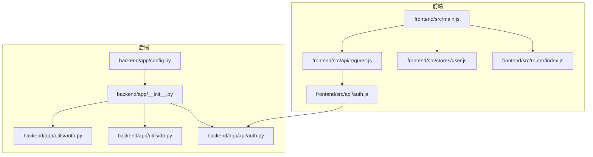
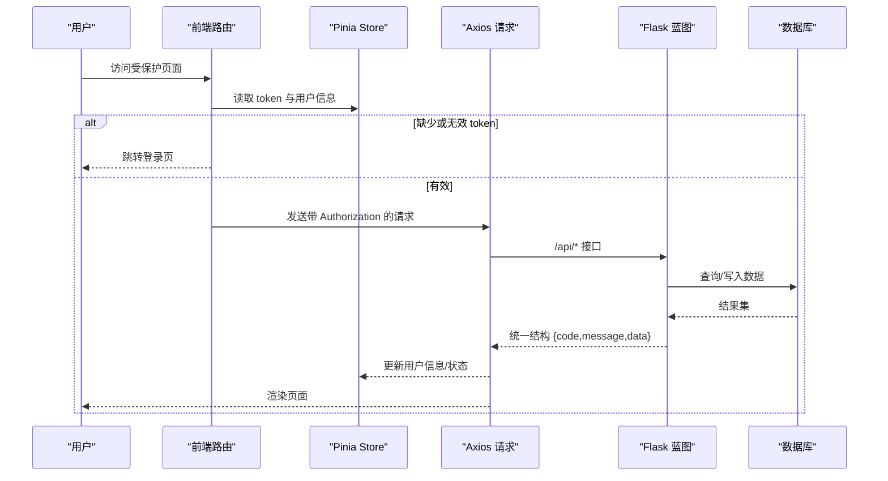
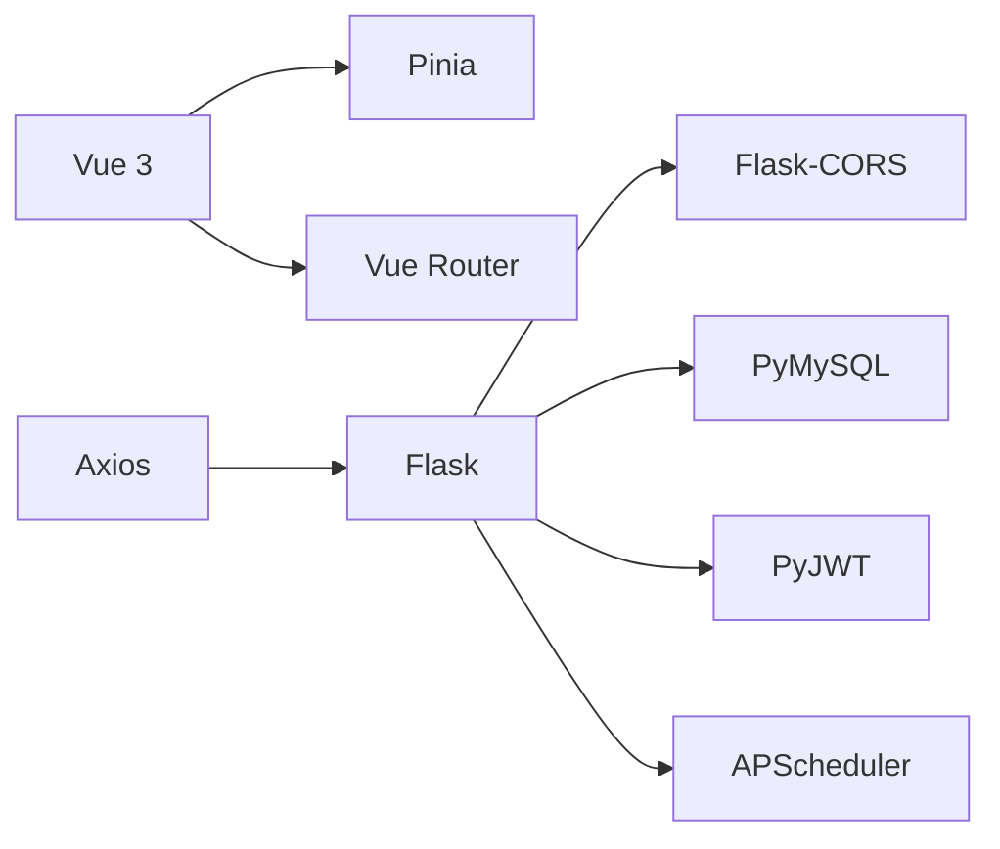

# 调试与测试

<cite>
**本文引用的文件**
- [backend/app/__init__.py](file://backend/app/__init__.py)
- [backend/app/config.py](file://backend/app/config.py)
- [backend/app/utils/db.py](file://backend/app/utils/db.py)
- [backend/app/utils/auth.py](file://backend/app/utils/auth.py)
- [backend/app/api/auth.py](file://backend/app/api/auth.py)
- [backend/requirements.txt](file://backend/requirements.txt)
- [frontend/src/main.js](file://frontend/src/main.js)
- [frontend/src/router/index.js](file://frontend/src/router/index.js)
- [frontend/src/stores/user.js](file://frontend/src/stores/user.js)
- [frontend/src/api/request.js](file://frontend/src/api/request.js)
- [frontend/src/api/auth.js](file://frontend/src/api/auth.js)
- [frontend/package.json](file://frontend/package.json)
</cite>

## 目录
1. [简介](#简介)
2. [项目结构](#项目结构)
3. [核心组件](#核心组件)
4. [架构总览](#架构总览)
5. [详细组件分析](#详细组件分析)
6. [依赖分析](#依赖分析)
7. [性能考虑](#性能考虑)
8. [故障排查指南](#故障排查指南)
9. [结论](#结论)
10. [附录](#附录)

## 简介
本指南面向开发团队，提供前后端一体化的调试与测试实践路径，覆盖浏览器开发者工具、Vue.js/Pinia 调试、Flask 后端调试、数据库查询与 API 接口调试、单元测试与覆盖率建议、常见错误类型与日志解读、性能诊断以及断点调试、网络监控与状态管理调试方法。目标是帮助开发者快速定位问题并建立稳定可靠的测试流程。

## 项目结构
- 前端采用 Vue 3 + Pinia + Vue Router + Element Plus，通过 Vite 构建；Axios 封装统一请求与拦截器。
- 后端基于 Flask，使用蓝图组织 API，CORS 放通 /api/*，JWT 认证，pymysql 连接 MySQL，APScheduler 定时任务。
- 配置集中于 Config 类，支持环境变量注入，便于本地与生产差异化部署。

图表来源
- [frontend/src/main.js:1-23](file://frontend/src/main.js#L1-L23)
- [frontend/src/router/index.js:1-61](file://frontend/src/router/index.js#L1-L61)
- [frontend/src/stores/user.js:1-41](file://frontend/src/stores/user.js#L1-L41)
- [frontend/src/api/request.js:1-54](file://frontend/src/api/request.js#L1-L54)
- [frontend/src/api/auth.js:1-14](file://frontend/src/api/auth.js#L1-L14)
- [backend/app/__init__.py:1-62](file://backend/app/__init__.py#L1-L62)
- [backend/app/config.py:1-21](file://backend/app/config.py#L1-L21)
- [backend/app/utils/db.py:1-17](file://backend/app/utils/db.py#L1-L17)
- [backend/app/api/auth.py:1-184](file://backend/app/api/auth.py#L1-L184)
- [backend/app/utils/auth.py:1-83](file://backend/app/utils/auth.py#L1-L83)

章节来源
- [frontend/src/main.js:1-23](file://frontend/src/main.js#L1-L23)
- [backend/app/__init__.py:1-62](file://backend/app/__init__.py#L1-L62)

## 核心组件
- 前端应用入口与插件注册：初始化 Vue 应用、Pinia、Element Plus、路由，并挂载应用。
- 路由与守卫：定义页面路由、鉴权守卫、管理员权限守卫，结合本地存储 token 与用户信息。
- 状态管理：Pinia Store 管理 token、用户信息、登录态与管理员标识，提供获取资料与登出能力。
- API 层：Axios 实例封装 baseURL、超时、请求头，统一添加 Authorization，响应拦截器统一错误提示与 401 自动跳转。
- 后端应用工厂：创建 Flask 应用、CORS 配置、蓝图注册、定时任务初始化。
- 认证与授权：JWT 工具（生成/校验）、认证装饰器（后续任务引入）、用户模型与密码哈希。
- 数据库连接：从 Flask 应用配置读取数据库参数，返回 DictCursor 的连接对象。

章节来源
- [frontend/src/main.js:1-23](file://frontend/src/main.js#L1-L23)
- [frontend/src/router/index.js:1-61](file://frontend/src/router/index.js#L1-L61)
- [frontend/src/stores/user.js:1-41](file://frontend/src/stores/user.js#L1-L41)
- [frontend/src/api/request.js:1-54](file://frontend/src/api/request.js#L1-L54)
- [backend/app/__init__.py:1-62](file://backend/app/__init__.py#L1-L62)
- [backend/app/utils/auth.py:1-83](file://backend/app/utils/auth.py#L1-L83)
- [backend/app/utils/db.py:1-17](file://backend/app/utils/db.py#L1-L17)

## 架构总览
前后端交互遵循“前端通过 Axios 发起 /api* 请求 -> 后端蓝图处理 -> 数据库访问 -> 返回统一结构”的链路。认证通过 JWT，路由守卫与状态管理共同保障访问控制。

图表来源
- [frontend/src/router/index.js:36-58](file://frontend/src/router/index.js#L36-L58)
- [frontend/src/stores/user.js:23-30](file://frontend/src/stores/user.js#L23-L30)
- [frontend/src/api/request.js:14-51](file://frontend/src/api/request.js#L14-L51)
- [backend/app/api/auth.py:14-82](file://backend/app/api/auth.py#L14-L82)
- [backend/app/utils/db.py:5-17](file://backend/app/utils/db.py#L5-L17)

## 详细组件分析

### 前端调试要点
- 浏览器开发者工具
  - Console：查看请求错误、状态变更、断点输出。
  - Network：过滤 /api*，观察请求头 Authorization、响应状态码与响应体；识别 401 自动跳转逻辑。
  - Application/Storage：检查 localStorage 中 token 与 userInfo 是否正确持久化。
  - Sources：设置断点于请求拦截器、路由守卫、Store 方法，观察调用栈与变量变化。
- Vue.js 调试
  - 使用 Devtools 查看组件层级、Props/State/Computed、事件流。
  - 在组件生命周期钩子与 Store 方法中设置断点，逐步执行。
  - 利用 Vue Router 的导航守卫断点，验证鉴权与重定向分支。
- 状态管理调试（Pinia）
  - 在 Store 的 setToken/setUserInfo/logout 中设置断点，确认本地存储同步。
  - 观察 isLoggedIn/isAdmin/displayName 的计算属性在不同用户下的表现。
- API 调试
  - 在 request.js 的拦截器中设置断点，验证 Authorization 注入与错误分发。
  - 对 auth.js 的 login/getProfile/changePassword 分别断点，核对请求体与响应结构。

章节来源
- [frontend/src/router/index.js:36-58](file://frontend/src/router/index.js#L36-L58)
- [frontend/src/stores/user.js:13-37](file://frontend/src/stores/user.js#L13-L37)
- [frontend/src/api/request.js:14-51](file://frontend/src/api/request.js#L14-L51)
- [frontend/src/api/auth.js:1-14](file://frontend/src/api/auth.js#L1-L14)

### 后端调试要点
- Flask 应用工厂
  - 在 create_app 中设置断点，验证 CORS、蓝图注册、定时任务初始化是否生效。
  - 检查 Config 的环境变量注入是否正确映射到 app.config。
- 认证与授权
  - 在 /api/auth/login/profile/password 设置断点，核对请求体解析、用户查询、密码校验、JWT 生成与返回结构。
  - 使用装饰器（后续任务引入）时，在被装饰函数处断点，验证 g.current_user 注入。
- 数据库连接
  - 在 get_db 中断点，确认 host/port/user/password/database 从配置读取正确。
  - 在 SQL 执行处断点，结合日志观察慢查询与异常。
- 日志与错误
  - 使用 Flask 的 logger 输出上下文信息，结合响应中的 code/message 辅助定位。

章节来源
- [backend/app/__init__.py:6-34](file://backend/app/__init__.py#L6-L34)
- [backend/app/config.py:4-21](file://backend/app/config.py#L4-L21)
- [backend/app/api/auth.py:14-184](file://backend/app/api/auth.py#L14-L184)
- [backend/app/utils/db.py:5-17](file://backend/app/utils/db.py#L5-L17)
- [backend/app/utils/auth.py:11-56](file://backend/app/utils/auth.py#L11-L56)

### 数据库查询调试
- 连接参数核对：确保 DB_HOST/DB_PORT/DB_USER/DB_PASSWORD/DB_NAME 与环境一致。
- 查询执行：在业务层 SQL 执行点断点，打印或记录 SQL 与参数，观察影响行数与异常。
- 性能：使用 EXPLAIN 分析慢查询，关注索引缺失与大表全表扫描。
- 事务：在需要一致性的地方使用事务，捕获异常回滚并记录日志。

章节来源
- [backend/app/utils/db.py:5-17](file://backend/app/utils/db.py#L5-L17)
- [backend/app/config.py:9-13](file://backend/app/config.py#L9-L13)

### API 接口调试技巧
- 统一响应结构：前端以 {code,message,data} 为标准，后端需严格遵守。
- 错误码规范：400/401/404/500 含义明确，前端据此做 UI 提示与路由跳转。
- 身份验证：在请求拦截器中注入 Authorization，后端在受保护接口断点验证 g.current_user。
- 跨域：CORS 对 /api/* 放通，注意凭证支持与预检请求处理。

章节来源
- [frontend/src/api/request.js:25-51](file://frontend/src/api/request.js#L25-L51)
- [backend/app/__init__.py:24-25](file://backend/app/__init__.py#L24-L25)
- [backend/app/api/auth.py:85-115](file://backend/app/api/auth.py#L85-L115)

### 单元测试编写指南
- 前端
  - 使用 Vitest/Jest（建议在现有 Vite 环境中引入）对 Store 方法、路由守卫、API 函数进行单元测试。
  - Mock localStorage、Axios 拦截器与路由，隔离外部依赖。
  - 关键用例：登录成功/失败、密码修改校验、401 自动跳转、管理员权限校验。
- 后端
  - 使用 pytest 或 unittest，针对蓝图函数编写测试用例，Mock get_db 与模型层。
  - 关键用例：登录参数校验、用户不存在、密码错误、JWT 过期、数据库写入失败。
- 覆盖率
  - 建议：函数级覆盖率 ≥ 80%，分支覆盖率 ≥ 60%；对认证、支付等高风险模块提升至 ≥ 90%。

章节来源
- [frontend/package.json:1-24](file://frontend/package.json#L1-L24)
- [backend/requirements.txt:1-9](file://backend/requirements.txt#L1-L9)

### 常见错误类型与日志解读
- 前端
  - 401 未授权：通常因 token 过期或无效，拦截器会清除本地存储并跳转登录页。
  - 网络错误：Axios 拦截器区分响应型错误与网络错误，统一提示。
  - 路由守卫：未登录访问受保护页面会被重定向至登录页。
- 后端
  - 参数缺失/格式错误：返回 400 并携带明确 message。
  - 用户不存在/密码错误：返回 401 并提示。
  - 数据库异常：返回 500 并记录日志。
- 日志
  - 建议在关键路径打印请求参数、响应状态与耗时，便于问题复现与追踪。

章节来源
- [frontend/src/api/request.js:35-50](file://frontend/src/api/request.js#L35-L50)
- [frontend/src/router/index.js:46-57](file://frontend/src/router/index.js#L46-L57)
- [backend/app/api/auth.py:23-61](file://backend/app/api/auth.py#L23-L61)

### 性能问题诊断方法
- 前端
  - 使用 Performance 面板分析首屏渲染、脚本执行时间、内存占用。
  - Network 面板观察接口耗时与并发，识别瓶颈接口。
  - Devtools 的 Lighthouse 报告用于发现可优化项。
- 后端
  - APISpec/日志统计接口耗时，定位慢查询与阻塞点。
  - 使用 Flask Profiler 或 cProfile 分析热点函数。
  - 数据库层面：索引优化、连接池配置、SQL 重写。

章节来源
- [frontend/src/api/request.js:5-11](file://frontend/src/api/request.js#L5-L11)
- [backend/app/__init__.py:30-32](file://backend/app/__init__.py#L30-L32)

### 断点调试、网络监控与状态管理调试
- 断点调试
  - 前端：在 main.js、router/index.js、stores/user.js、api/request.js、api/auth.js 设置断点。
  - 后端：在 app/__init__.py、api/auth.py、utils/db.py、utils/auth.py 设置断点。
- 网络监控
  - 使用浏览器 Network 面板过滤 /api*，观察 Authorization、响应体与错误码。
- 状态管理调试
  - 在 Store 的 setToken/setUserInfo/fetchProfile/logout 中断点，观察本地存储与计算属性变化。

章节来源
- [frontend/src/main.js:10-22](file://frontend/src/main.js#L10-L22)
- [frontend/src/router/index.js:36-58](file://frontend/src/router/index.js#L36-L58)
- [frontend/src/stores/user.js:13-37](file://frontend/src/stores/user.js#L13-L37)
- [frontend/src/api/request.js:14-51](file://frontend/src/api/request.js#L14-L51)
- [backend/app/__init__.py:37-62](file://backend/app/__init__.py#L37-L62)
- [backend/app/api/auth.py:14-184](file://backend/app/api/auth.py#L14-L184)
- [backend/app/utils/db.py:5-17](file://backend/app/utils/db.py#L5-L17)
- [backend/app/utils/auth.py:11-56](file://backend/app/utils/auth.py#L11-L56)

## 依赖分析
- 前端依赖
  - Vue 3、Pinia、Vue Router、Element Plus、Axios、Vite。
- 后端依赖
  - Flask、Flask-CORS、PyMySQL、PyJWT、Werkzeug、APScheduler、OpenPyXL、Cryptography。

图表来源
- [frontend/package.json:11-22](file://frontend/package.json#L11-L22)
- [backend/requirements.txt:1-9](file://backend/requirements.txt#L1-L9)

章节来源
- [frontend/package.json:1-24](file://frontend/package.json#L1-L24)
- [backend/requirements.txt:1-9](file://backend/requirements.txt#L1-L9)

## 性能考虑
- 前端
  - 合理拆分路由组件，利用动态导入减少首包体积。
  - 使用缓存策略与懒加载，避免重复渲染。
- 后端
  - 数据库连接池与查询优化，避免 N+1 查询。
  - 对外接口增加限流与熔断，防止雪崩。
- 全链路
  - 增加埋点与指标上报，持续监控接口耗时与错误率。

## 故障排查指南
- 登录失败
  - 检查用户名/密码非空校验、用户是否存在、是否激活、密码哈希校验。
  - 核对 JWT 生成与返回结构。
- 401 未授权
  - 检查请求拦截器是否注入 Authorization。
  - 核对后端受保护接口是否正确解析 g.current_user。
- 数据库连接失败
  - 核对 DB_HOST/DB_PORT/DB_USER/DB_PASSWORD/DB_NAME。
  - 检查防火墙与网络连通性。
- 路由跳转异常
  - 检查路由守卫逻辑与本地存储 token/userInfo。

章节来源
- [backend/app/api/auth.py:23-82](file://backend/app/api/auth.py#L23-L82)
- [frontend/src/api/request.js:14-23](file://frontend/src/api/request.js#L14-L23)
- [backend/app/utils/auth.py:38-56](file://backend/app/utils/auth.py#L38-L56)
- [frontend/src/router/index.js:36-58](file://frontend/src/router/index.js#L36-L58)
- [backend/app/utils/db.py:7-16](file://backend/app/utils/db.py#L7-L16)

## 结论
通过统一的调试流程与测试策略，可以显著提升问题定位效率与系统稳定性。建议在开发阶段即引入单元测试与覆盖率监控，配合浏览器与后端断点调试、网络监控与状态管理调试，形成闭环的质量保障体系。

## 附录
- 开发环境建议
  - 前端：Vite dev + 浏览器 Devtools + Vue Devtools。
  - 后端：Flask debug + 日志 + PyCharm/VSCode 断点调试。
- 最佳实践
  - 统一错误码与消息格式，前后端一致处理。
  - 对关键路径增加日志与埋点，便于回溯。
  - 定期进行性能回归测试与数据库慢查询审查。