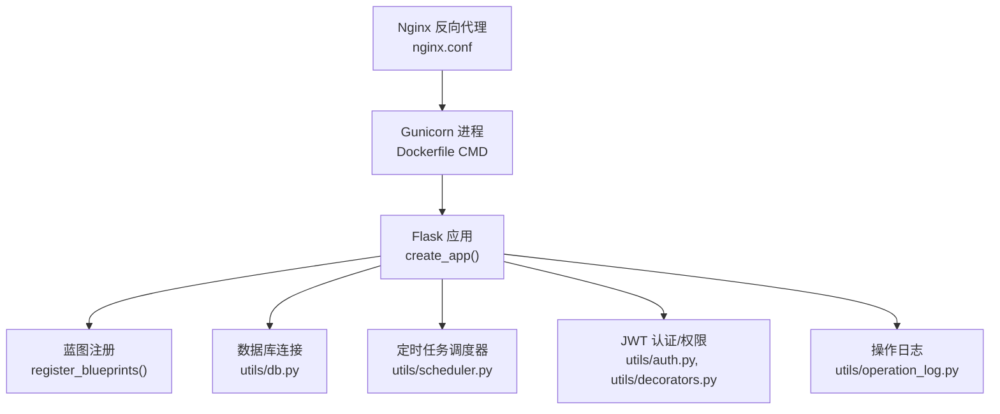
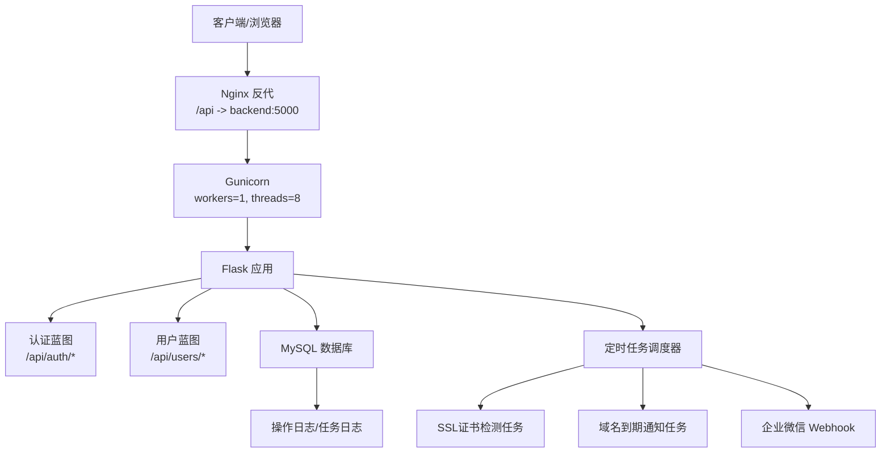
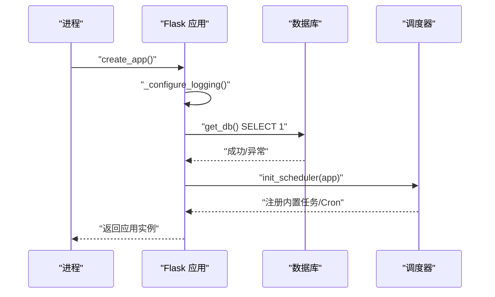
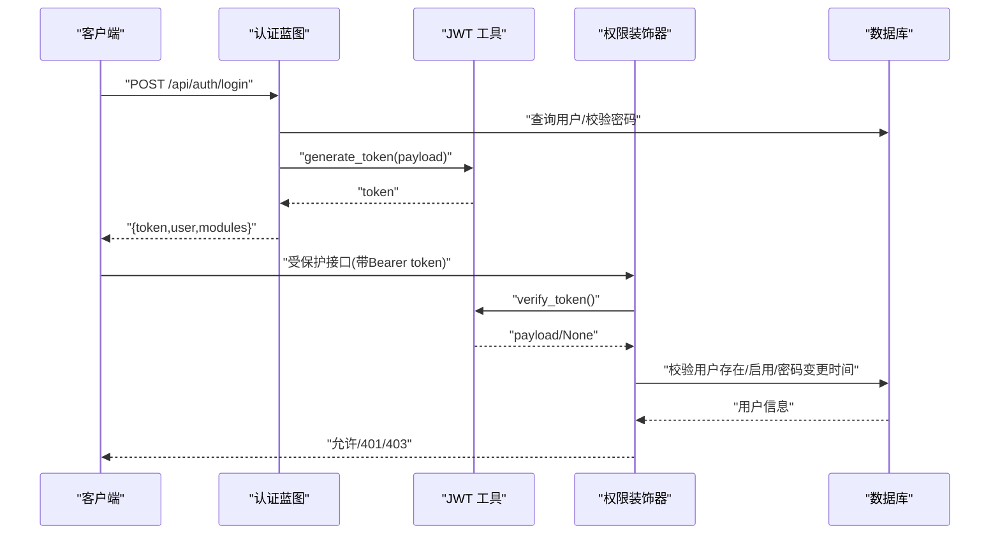
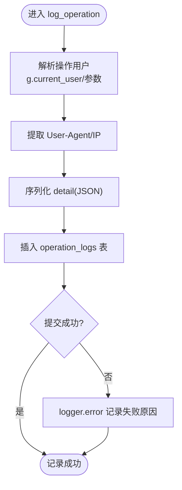
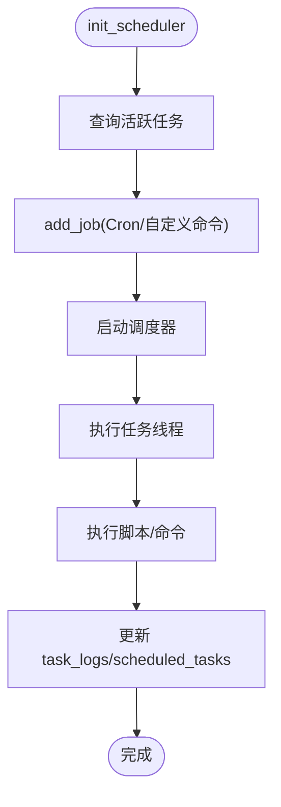
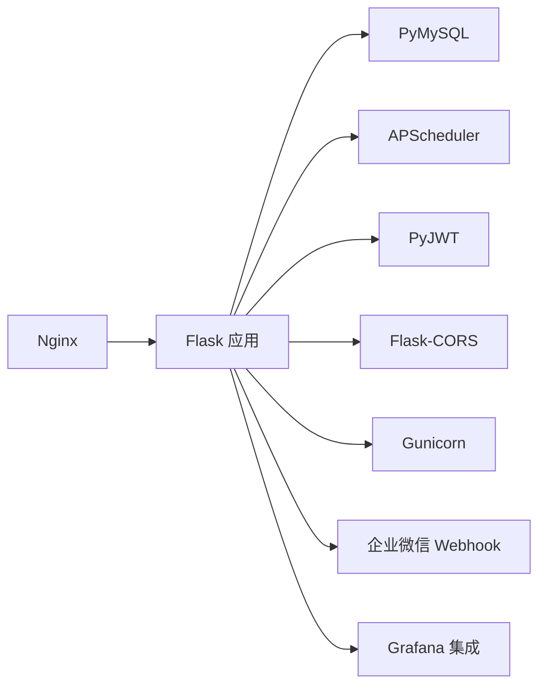

# 调试指南

<cite>
**本文引用的文件**
- [backend/app/__init__.py](file://backend/app/__init__.py)
- [backend/run.py](file://backend/run.py)
- [backend/app/config.py](file://backend/app/config.py)
- [backend/Dockerfile](file://backend/Dockerfile)
- [nginx.conf](file://nginx.conf)
- [backend/app/utils/db.py](file://backend/app/utils/db.py)
- [backend/app/utils/auth.py](file://backend/app/utils/auth.py)
- [backend/app/utils/decorators.py](file://backend/app/utils/decorators.py)
- [backend/app/utils/scheduler.py](file://backend/app/utils/scheduler.py)
- [backend/app/utils/operation_log.py](file://backend/app/utils/operation_log.py)
- [backend/app/api/auth.py](file://backend/app/api/auth.py)
- [backend/app/api/users.py](file://backend/app/api/users.py)
- [backend/init_db.py](file://backend/init_db.py)
- [backend/requirements.txt](file://backend/requirements.txt)
</cite>

## 目录
1. [简介](#简介)
2. [项目结构](#项目结构)
3. [核心组件](#核心组件)
4. [架构总览](#架构总览)
5. [详细组件分析](#详细组件分析)
6. [依赖分析](#依赖分析)
7. [性能考虑](#性能考虑)
8. [故障排查指南](#故障排查指南)
9. [结论](#结论)
10. [附录](#附录)

## 简介
本指南面向OPS项目的开发与运维人员，聚焦于调试工具与技巧、日志分析方法、常见问题诊断流程、性能分析工具使用、开发与生产环境调试配置、错误监控与告警处理，以及调试最佳实践与常见陷阱。文档基于仓库中的真实代码与配置进行梳理，帮助快速定位问题并提升稳定性。

## 项目结构
后端采用Flask应用，通过Gunicorn在容器中运行，Nginx作为反向代理。应用启动流程由工厂函数创建，注册蓝图并初始化数据库与定时任务；日志统一输出至stderr以便容器收集；配置来自环境变量；数据库连接封装在工具模块中；认证与权限控制集中在工具模块与装饰器中；操作日志与定时任务均有完善的日志记录。

图表来源
- [backend/Dockerfile:34-36](file://backend/Dockerfile#L34-L36)
- [backend/app/__init__.py:28-113](file://backend/app/__init__.py#L28-L113)
- [backend/app/utils/db.py:43-79](file://backend/app/utils/db.py#L43-L79)
- [backend/app/utils/scheduler.py:244-384](file://backend/app/utils/scheduler.py#L244-L384)
- [backend/app/utils/auth.py:9-28](file://backend/app/utils/auth.py#L9-L28)
- [backend/app/utils/decorators.py:26-123](file://backend/app/utils/decorators.py#L26-L123)
- [backend/app/utils/operation_log.py:49-119](file://backend/app/utils/operation_log.py#L49-L119)
- [nginx.conf:50-65](file://nginx.conf#L50-L65)

章节来源
- [backend/app/__init__.py:28-113](file://backend/app/__init__.py#L28-L113)
- [backend/run.py:1-8](file://backend/run.py#L1-L8)
- [backend/app/config.py:10-58](file://backend/app/config.py#L10-L58)
- [backend/Dockerfile:1-36](file://backend/Dockerfile#L1-L36)
- [nginx.conf:1-76](file://nginx.conf#L1-L76)

## 核心组件
- 应用工厂与启动
  - 工厂函数负责配置日志、CORS、蓝图注册、数据库预检、模式初始化、定时任务调度器初始化，并在应用上下文内完成数据库连通性检查与模式校验。
- 配置与环境变量
  - 关键配置项包括密钥、数据库参数、调试开关、主机与端口、上传目录、CORS策略、微信Webhook、SSL与域名预警阈值、Grafana集成等。
- 数据库连接与日志
  - 统一封装连接参数、连接建立、异常记录与连接关闭；启动时打印脱敏后的数据库目标，便于核对配置。
- 认证与权限
  - JWT签发与校验、装饰器实现认证与角色/模块权限检查。
- 操作日志
  - 记录模块、动作、目标、详情、IP、UA、UTC时间等，异常时以error级别确保可见。
- 定时任务调度器
  - 从数据库加载活跃任务，支持Cron表达式与自定义命令；内置SSL证书与域名到期通知任务；失败仅记录日志，不影响应用启动。
- 反向代理与运行
  - Nginx将/api前缀反代至后端5000端口，设置连接/发送/读取超时与缓冲区；Dockerfile使用Gunicorn单worker多线程运行。

章节来源
- [backend/app/__init__.py:10-26](file://backend/app/__init__.py#L10-L26)
- [backend/app/__init__.py:88-113](file://backend/app/__init__.py#L88-L113)
- [backend/app/config.py:10-58](file://backend/app/config.py#L10-L58)
- [backend/app/utils/db.py:28-40](file://backend/app/utils/db.py#L28-L40)
- [backend/app/utils/db.py:43-79](file://backend/app/utils/db.py#L43-L79)
- [backend/app/utils/auth.py:9-28](file://backend/app/utils/auth.py#L9-L28)
- [backend/app/utils/decorators.py:26-123](file://backend/app/utils/decorators.py#L26-L123)
- [backend/app/utils/operation_log.py:49-119](file://backend/app/utils/operation_log.py#L49-L119)
- [backend/app/utils/scheduler.py:244-384](file://backend/app/utils/scheduler.py#L244-L384)
- [nginx.conf:50-65](file://nginx.conf#L50-L65)
- [backend/Dockerfile:34-36](file://backend/Dockerfile#L34-L36)

## 架构总览
下图展示从客户端到后端、数据库与外部服务的关键交互路径，以及日志与定时任务的落点。

图表来源
- [nginx.conf:50-65](file://nginx.conf#L50-L65)
- [backend/Dockerfile:34-36](file://backend/Dockerfile#L34-L36)
- [backend/app/__init__.py:116-151](file://backend/app/__init__.py#L116-L151)
- [backend/app/api/auth.py:16-103](file://backend/app/api/auth.py#L16-L103)
- [backend/app/api/users.py:19-32](file://backend/app/api/users.py#L19-L32)
- [backend/app/utils/scheduler.py:391-524](file://backend/app/utils/scheduler.py#L391-L524)
- [backend/app/utils/operation_log.py:49-119](file://backend/app/utils/operation_log.py#L49-L119)

## 详细组件分析

### 组件A：应用工厂与启动流程
- 关键点
  - 日志配置：根据DEBUG动态设置根日志级别，stderr输出，抑制pymysql警告，应用logger级别同步。
  - CORS：支持CORS_ALLOW_ALL与白名单模式，credentials启用，允许的headers包含Content-Type与Authorization。
  - 数据库预检：启动时尝试SELECT 1，失败打印完整异常栈提示核对DB_HOST/PORT/USER/PASSWORD/DB_NAME与网络连通性。
  - 定时任务：独立连接加载活跃任务，失败仅记录日志；内置SSL证书检测与域名到期通知任务按Cron表达式注册。
  - 蓝图注册：集中注册所有API蓝图。
- 调试建议
  - 开启DEBUG观察日志级别变化；若数据库连接失败，优先检查环境变量与容器网络；关注日志中“数据库连接预检失败”提示。

图表来源
- [backend/app/__init__.py:10-26](file://backend/app/__init__.py#L10-L26)
- [backend/app/__init__.py:88-113](file://backend/app/__init__.py#L88-L113)
- [backend/app/utils/db.py:43-79](file://backend/app/utils/db.py#L43-L79)
- [backend/app/utils/scheduler.py:244-384](file://backend/app/utils/scheduler.py#L244-L384)

章节来源
- [backend/app/__init__.py:10-26](file://backend/app/__init__.py#L10-L26)
- [backend/app/__init__.py:88-113](file://backend/app/__init__.py#L88-L113)
- [backend/app/utils/db.py:43-79](file://backend/app/utils/db.py#L43-L79)
- [backend/app/utils/scheduler.py:244-384](file://backend/app/utils/scheduler.py#L244-L384)

### 组件B：认证与权限控制
- 关键点
  - JWT签发：包含user_id、username、role、exp、iat，使用配置的JWT_SECRET_KEY。
  - JWT校验：HS256算法，过期或无效返回None；装饰器链路：jwt_required先校验令牌、用户存在、启用状态、密码变更时间；随后role_required/module_required校验角色与模块权限。
- 调试建议
  - 登录失败时查看“登录失败”操作日志详情；令牌无效或过期时检查JWT_SECRET_KEY与iat/exp一致性；权限不足时确认角色与模块授权。

图表来源
- [backend/app/api/auth.py:16-103](file://backend/app/api/auth.py#L16-L103)
- [backend/app/utils/auth.py:9-28](file://backend/app/utils/auth.py#L9-L28)
- [backend/app/utils/decorators.py:26-123](file://backend/app/utils/decorators.py#L26-L123)

章节来源
- [backend/app/api/auth.py:16-103](file://backend/app/api/auth.py#L16-L103)
- [backend/app/utils/auth.py:9-28](file://backend/app/utils/auth.py#L9-L28)
- [backend/app/utils/decorators.py:26-123](file://backend/app/utils/decorators.py#L26-L123)

### 组件C：操作日志记录
- 关键点
  - 解析操作用户：优先显式参数，其次g.current_user，再g.user_id/username，最终“unknown”。
  - 记录字段：user_id/username、module/action、target_id/name、detail(JSON)、ip(X-Forwarded-For/X-Real-IP)、user_agent、UTC时间。
  - 异常处理：记录失败时以error级别输出，确保可见。
- 调试建议
  - 登录/登出/用户管理等关键动作均会落库；出现异常时优先查看操作日志表记录与对应接口返回码。

图表来源
- [backend/app/utils/operation_log.py:49-119](file://backend/app/utils/operation_log.py#L49-L119)

章节来源
- [backend/app/utils/operation_log.py:49-119](file://backend/app/utils/operation_log.py#L49-L119)

### 组件D：定时任务调度器
- 关键点
  - 从数据库加载活跃任务，支持Cron表达式与自定义命令；独立连接执行，失败仅记录日志。
  - 内置任务：SSL证书自动检测与通知、域名到期自动通知；支持微信Webhook。
  - 超时控制：脚本执行超时（300秒）处理。
- 调试建议
  - 查看任务日志表与scheduled_tasks状态；核对Cron表达式格式；关注调度器日志中的异常与超时。

图表来源
- [backend/app/utils/scheduler.py:244-384](file://backend/app/utils/scheduler.py#L244-L384)
- [backend/app/utils/scheduler.py:39-179](file://backend/app/utils/scheduler.py#L39-L179)

章节来源
- [backend/app/utils/scheduler.py:244-384](file://backend/app/utils/scheduler.py#L244-L384)
- [backend/app/utils/scheduler.py:39-179](file://backend/app/utils/scheduler.py#L39-L179)

### 组件E：数据库连接与初始化
- 关键点
  - 连接参数封装与异常记录；启动时打印脱敏数据库目标；初始化脚本创建表结构与默认数据。
- 调试建议
  - 连接失败时查看日志中“数据库连接预检失败”提示与异常栈；核对DB_HOST/PORT/USER/PASSWORD/DB_NAME与网络连通性。

章节来源
- [backend/app/utils/db.py:28-40](file://backend/app/utils/db.py#L28-L40)
- [backend/app/utils/db.py:43-79](file://backend/app/utils/db.py#L43-L79)
- [backend/init_db.py:24-427](file://backend/init_db.py#L24-L427)

## 依赖分析
- 运行时依赖
  - Flask、Flask-CORS、Gunicorn、PyMySQL、PyJWT、APScheduler、OpenPyXL、cryptography、bcrypt、Paramiko、阿里云SDK等。
- 组件耦合
  - 应用工厂与配置、数据库工具、认证与权限装饰器、操作日志、调度器之间存在清晰的职责边界；API蓝图通过工具模块间接依赖数据库与调度器。
- 外部集成
  - Nginx反代与超时配置；企业微信Webhook用于通知；Grafana集成配置项。

图表来源
- [backend/requirements.txt:1-17](file://backend/requirements.txt#L1-L17)
- [backend/Dockerfile:34-36](file://backend/Dockerfile#L34-L36)
- [nginx.conf:50-65](file://nginx.conf#L50-L65)
- [backend/app/config.py:40-53](file://backend/app/config.py#L40-L53)

章节来源
- [backend/requirements.txt:1-17](file://backend/requirements.txt#L1-L17)
- [backend/Dockerfile:34-36](file://backend/Dockerfile#L34-L36)
- [nginx.conf:50-65](file://nginx.conf#L50-L65)
- [backend/app/config.py:40-53](file://backend/app/config.py#L40-L53)

## 性能考虑
- 日志级别与输出
  - 生产环境建议INFO级别，DEBUG仅限本地调试；stderr输出利于容器日志聚合。
- 数据库连接
  - 单连接复用与异常记录；避免频繁重建连接；关注慢查询与锁等待。
- 定时任务
  - 独立连接与线程池；超时控制与失败回退；Cron表达式合理性评估。
- 反向代理
  - 合理设置proxy_connect/send/read超时与缓冲区，避免上游阻塞。
- 运行时
  - Gunicorn单worker多线程模型，避免多进程重复注册定时任务；线程数与超时需结合业务负载调整。

章节来源
- [backend/app/__init__.py:10-26](file://backend/app/__init__.py#L10-L26)
- [backend/Dockerfile:34-36](file://backend/Dockerfile#L34-L36)
- [nginx.conf:53-59](file://nginx.conf#L53-L59)
- [backend/app/utils/scheduler.py:175-178](file://backend/app/utils/scheduler.py#L175-L178)

## 故障排查指南

### 数据库连接问题
- 现象
  - 启动时报“数据库连接预检失败”，或接口报连接异常。
- 排查步骤
  - 检查环境变量：DB_HOST、DB_PORT、DB_USER、DB_PASSWORD、DB_NAME。
  - 核对MySQL服务状态与网络连通性（容器内服务名通常为mysql）。
  - 查看启动日志中“数据库配置: host/port/user/database/password”脱敏信息，确认配置生效。
  - 关注异常栈中host/port/user/database信息，定位配置错误。
- 相关位置
  - [backend/app/__init__.py:88-104](file://backend/app/__init__.py#L88-L104)
  - [backend/app/utils/db.py:28-40](file://backend/app/utils/db.py#L28-L40)
  - [backend/app/utils/db.py:43-79](file://backend/app/utils/db.py#L43-L79)

章节来源
- [backend/app/__init__.py:88-104](file://backend/app/__init__.py#L88-L104)
- [backend/app/utils/db.py:28-40](file://backend/app/utils/db.py#L28-L40)
- [backend/app/utils/db.py:43-79](file://backend/app/utils/db.py#L43-L79)

### API调用失败
- 现象
  - 接口返回400/401/403/500等错误码。
- 排查步骤
  - 检查请求体格式与必填字段；核对Authorization头格式（Bearer token）。
  - 若401，检查令牌有效性、过期与用户状态；若403，检查角色与模块权限。
  - 查看操作日志表中对应模块/动作记录，结合接口返回码定位问题。
- 相关位置
  - [backend/app/api/auth.py:16-103](file://backend/app/api/auth.py#L16-L103)
  - [backend/app/utils/decorators.py:26-123](file://backend/app/utils/decorators.py#L26-L123)
  - [backend/app/utils/operation_log.py:49-119](file://backend/app/utils/operation_log.py#L49-L119)

章节来源
- [backend/app/api/auth.py:16-103](file://backend/app/api/auth.py#L16-L103)
- [backend/app/utils/decorators.py:26-123](file://backend/app/utils/decorators.py#L26-L123)
- [backend/app/utils/operation_log.py:49-119](file://backend/app/utils/operation_log.py#L49-L119)

### 认证错误
- 现象
  - 登录失败、Token无效或过期、权限不足。
- 排查步骤
  - 确认JWT_SECRET_KEY已设置；检查用户是否启用；核对密码变更时间与iat/exp。
  - 查看“登录失败”操作日志详情（用户不存在/密码错误/禁用）。
- 相关位置
  - [backend/app/utils/auth.py:9-28](file://backend/app/utils/auth.py#L9-L28)
  - [backend/app/utils/decorators.py:26-123](file://backend/app/utils/decorators.py#L26-L123)
  - [backend/app/api/auth.py:48-73](file://backend/app/api/auth.py#L48-L73)
  - [backend/app/utils/operation_log.py:121-131](file://backend/app/utils/operation_log.py#L121-L131)

章节来源
- [backend/app/utils/auth.py:9-28](file://backend/app/utils/auth.py#L9-L28)
- [backend/app/utils/decorators.py:26-123](file://backend/app/utils/decorators.py#L26-L123)
- [backend/app/api/auth.py:48-73](file://backend/app/api/auth.py#L48-L73)
- [backend/app/utils/operation_log.py:121-131](file://backend/app/utils/operation_log.py#L121-L131)

### 权限问题
- 现象
  - 403权限不足。
- 排查步骤
  - 确认用户角色与模块授权；admin角色绕过模块权限检查。
  - 检查role_modules表授权情况。
- 相关位置
  - [backend/app/utils/decorators.py:165-213](file://backend/app/utils/decorators.py#L165-L213)

章节来源
- [backend/app/utils/decorators.py:165-213](file://backend/app/utils/decorators.py#L165-L213)

### 定时任务异常
- 现象
  - 任务未执行、状态异常、超时。
- 排查步骤
  - 查看scheduled_tasks与task_logs表状态与输出；核对Cron表达式格式；关注调度器日志中的异常与超时。
- 相关位置
  - [backend/app/utils/scheduler.py:244-384](file://backend/app/utils/scheduler.py#L244-L384)
  - [backend/app/utils/scheduler.py:39-179](file://backend/app/utils/scheduler.py#L39-L179)

章节来源
- [backend/app/utils/scheduler.py:244-384](file://backend/app/utils/scheduler.py#L244-L384)
- [backend/app/utils/scheduler.py:39-179](file://backend/app/utils/scheduler.py#L39-L179)

### 开发环境调试配置
- Python调试器
  - 本地开发可使用Flask内置调试运行（run.py中根据Config.DEBUG决定debug开关）；也可在IDE中以Flask应用入口启动。
- IDE调试配置要点
  - 设置环境变量：SECRET_KEY、JWT_SECRET_KEY、DB_*、FLASK_DEBUG、FLASK_HOST、FLASK_PORT等。
  - 在IDE中以run.py为入口启动，确保Flask调试模式开启。
- 浏览器开发者工具
  - Network面板观察/api请求的响应码、Headers、Body；Console查看前端错误；Application/Storage查看Cookie/Local Storage。
- 相关位置
  - [backend/run.py:1-8](file://backend/run.py#L1-L8)
  - [backend/app/config.py:10-58](file://backend/app/config.py#L10-L58)

章节来源
- [backend/run.py:1-8](file://backend/run.py#L1-L8)
- [backend/app/config.py:10-58](file://backend/app/config.py#L10-L58)

### 生产环境问题定位
- 日志采集
  - Gunicorn与Flask日志输出至stderr，容器日志收集系统可统一采集；关注“数据库连接预检失败”“记录操作日志失败”等error级别日志。
- 反向代理
  - 核对nginx.conf中的超时与缓冲区配置，避免上游阻塞导致的超时。
- 相关位置
  - [backend/app/__init__.py:10-26](file://backend/app/__init__.py#L10-L26)
  - [nginx.conf:50-65](file://nginx.conf#L50-L65)
  - [backend/Dockerfile:34-36](file://backend/Dockerfile#L34-L36)

章节来源
- [backend/app/__init__.py:10-26](file://backend/app/__init__.py#L10-L26)
- [nginx.conf:50-65](file://nginx.conf#L50-L65)
- [backend/Dockerfile:34-36](file://backend/Dockerfile#L34-L36)

### 错误监控与告警处理
- 操作日志与任务日志
  - 通过operation_logs与task_logs表沉淀审计与执行轨迹，结合日志系统进行聚合与告警。
- 内置通知
  - SSL证书与域名到期通知通过企业微信Webhook推送，需配置WECHAT_WEBHOOK_URL。
- 相关位置
  - [backend/app/utils/operation_log.py:49-119](file://backend/app/utils/operation_log.py#L49-L119)
  - [backend/app/utils/scheduler.py:391-524](file://backend/app/utils/scheduler.py#L391-L524)
  - [backend/app/config.py:40-41](file://backend/app/config.py#L40-L41)

章节来源
- [backend/app/utils/operation_log.py:49-119](file://backend/app/utils/operation_log.py#L49-L119)
- [backend/app/utils/scheduler.py:391-524](file://backend/app/utils/scheduler.py#L391-L524)
- [backend/app/config.py:40-41](file://backend/app/config.py#L40-L41)

### 调试最佳实践与常见陷阱
- 最佳实践
  - 明确日志级别与输出位置；关键路径增加日志点；对异常进行显式记录与返回。
  - 使用装饰器统一认证与权限校验；对敏感信息脱敏输出。
  - 定时任务独立连接与超时控制；失败仅记录日志，不影响主流程。
- 常见陷阱
  - 忘记设置JWT_SECRET_KEY/SECRET_KEY导致启动失败。
  - CORS_ALLOW_ALL=true时credentials不可用，需配合白名单。
  - Cron表达式字段数量不正确导致任务无法注册。
  - 容器内DB_HOST使用服务名而非127.0.0.1。
  - 未配置WECHAT_WEBHOOK_URL导致通知缺失。

章节来源
- [backend/app/__init__.py:36-45](file://backend/app/__init__.py#L36-L45)
- [backend/app/__init__.py:65-80](file://backend/app/__init__.py#L65-L80)
- [backend/app/utils/scheduler.py:194-228](file://backend/app/utils/scheduler.py#L194-L228)
- [backend/app/utils/db.py:28-40](file://backend/app/utils/db.py#L28-L40)

## 结论
本指南围绕OPS项目的调试与排障提供了从架构到细节的系统化方法：明确日志策略、掌握认证与权限链路、理解数据库与定时任务机制、结合Nginx与Gunicorn运行特性进行定位，并给出开发与生产环境的差异化配置建议。遵循最佳实践与避免常见陷阱，可显著提升问题定位效率与系统稳定性。

## 附录
- 关键配置项速查
  - SECRET_KEY/JWT_SECRET_KEY：生产环境必须设置。
  - DB_HOST/DB_PORT/DB_USER/DB_PASSWORD/DB_NAME：数据库连接参数。
  - FLASK_DEBUG/FLASK_HOST/FLASK_PORT：开发调试参数。
  - CORS_ORIGINS/CORS_ALLOW_ALL：跨域配置。
  - WECHAT_WEBHOOK_URL：企业微信通知地址。
  - SSL_CHECK_TIMEOUT/SSL_WARNING_DAYS/DOMAIN_WARNING_DAYS：SSL与域名预警阈值。
  - CERT_AUTO_CHECK_CRON/DOMAIN_AUTO_NOTIFY_CRON：内置任务Cron表达式。
- 相关位置
  - [backend/app/config.py:10-58](file://backend/app/config.py#L10-L58)
  - [backend/app/utils/scheduler.py:47-48](file://backend/app/utils/scheduler.py#L47-L48)
  - [backend/app/utils/scheduler.py:310-366](file://backend/app/utils/scheduler.py#L310-L366)