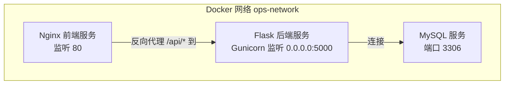
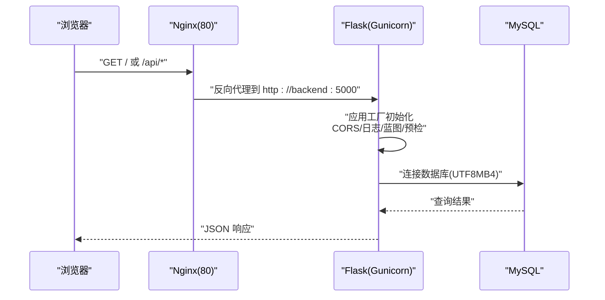
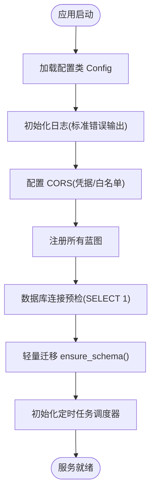
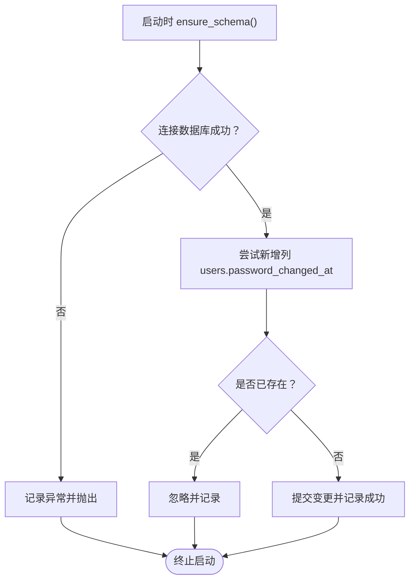
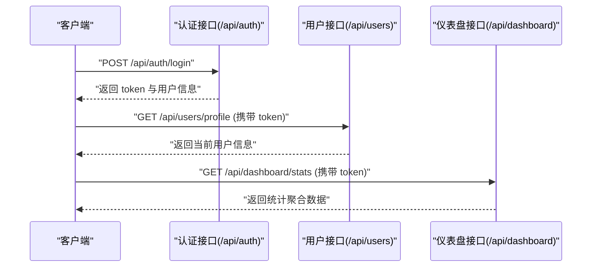
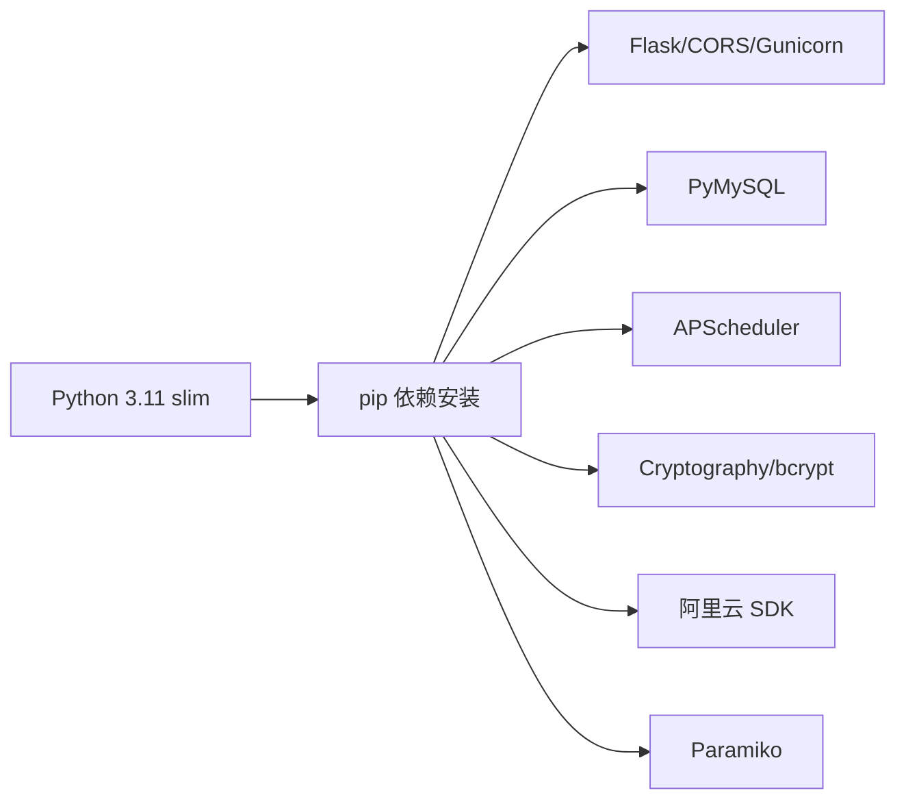

# 快速开始

<cite>
**本文引用的文件**
- [docker-compose.yml](file://docker-compose.yml)
- [Dockerfile](file://backend/Dockerfile)
- [requirements.txt](file://backend/requirements.txt)
- [run.py](file://backend/run.py)
- [app/__init__.py](file://backend/app/__init__.py)
- [app/config.py](file://backend/app/config.py)
- [app/utils/db.py](file://backend/app/utils/db.py)
- [app/utils/schema.py](file://backend/app/utils/schema.py)
- [init_db.py](file://backend/init_db.py)
- [nginx.conf](file://nginx.conf)
- [backend/app/api/auth.py](file://backend/app/api/auth.py)
- [backend/app/api/dashboard.py](file://backend/app/api/dashboard.py)
</cite>

## 目录
1. [简介](#简介)
2. [项目结构](#项目结构)
3. [核心组件](#核心组件)
4. [架构总览](#架构总览)
5. [详细组件分析](#详细组件分析)
6. [依赖分析](#依赖分析)
7. [性能考虑](#性能考虑)
8. [故障排查指南](#故障排查指南)
9. [结论](#结论)
10. [附录](#附录)

## 简介
本指南面向新开发者，帮助你在最短时间内完成 OPS 项目的本地开发环境搭建与首次运行。你将学到：
- 如何准备 Python 3.11+ 环境与依赖
- 如何使用 Docker Compose 搭建开发环境（MySQL、后端、前端 Nginx）
- 如何初始化数据库并完成首次启动
- 如何验证服务可用性与基本功能
- 常见配置问题与调试技巧

## 项目结构
项目采用前后端分离的容器化架构，后端基于 Flask，使用 Gunicorn 提供生产级 WSGI 服务，Nginx 作为反向代理，MySQL 提供持久化存储。

图表来源
- [docker-compose.yml:9-103](file://docker-compose.yml#L9-L103)
- [nginx.conf:32-47](file://nginx.conf#L32-L47)

章节来源
- [docker-compose.yml:1-103](file://docker-compose.yml#L1-L103)
- [Dockerfile:1-36](file://backend/Dockerfile#L1-L36)
- [nginx.conf:1-70](file://nginx.conf#L1-L70)

## 核心组件
- 后端应用入口与配置
  - 应用工厂函数负责初始化 Flask、CORS、日志、蓝图注册、数据库连接预检与轻量迁移、定时任务调度器初始化。
  - 关键配置来自环境变量，支持开发与生产差异化部署。
- 数据库连接与迁移
  - 统一的数据库连接封装，提供连接参数解析、日志脱敏输出、连接生命周期管理。
  - 启动时执行轻量迁移，保证表结构与字段的幂等补齐。
- 数据库初始化脚本
  - 全量建库建表、插入默认字典数据与默认管理员账户，支持后续字段补充。
- 反向代理与静态资源
  - Nginx 将静态页面与 /api/* 请求转发至后端服务，并提供缓存与安全相关配置。

章节来源
- [app/__init__.py:28-114](file://backend/app/__init__.py#L28-L114)
- [app/config.py:10-58](file://backend/app/config.py#L10-L58)
- [app/utils/db.py:18-80](file://backend/app/utils/db.py#L18-L80)
- [app/utils/schema.py:10-42](file://backend/app/utils/schema.py#L10-L42)
- [init_db.py:22-391](file://backend/init_db.py#L22-L391)
- [nginx.conf:32-47](file://nginx.conf#L32-L47)

## 架构总览
下图展示了从浏览器到后端 API 的典型请求链路，以及后端如何访问数据库。

图表来源
- [nginx.conf:32-47](file://nginx.conf#L32-L47)
- [app/__init__.py:88-114](file://backend/app/__init__.py#L88-L114)
- [app/utils/db.py:43-69](file://backend/app/utils/db.py#L43-L69)

## 详细组件分析

### 后端应用工厂与启动流程
- 应用工厂负责：
  - 读取配置类 Config 的环境变量
  - 初始化日志、CORS（支持凭据与白名单）
  - 注册全部蓝图
  - 在应用上下文中进行数据库连接预检与轻量迁移
  - 初始化定时任务调度器
- 开发模式下可通过 run.py 直接启动，生产模式由 Gunicorn 托管。

图表来源
- [app/__init__.py:28-114](file://backend/app/__init__.py#L28-L114)

章节来源
- [app/__init__.py:28-114](file://backend/app/__init__.py#L28-L114)
- [run.py:1-8](file://backend/run.py#L1-L8)

### 数据库连接与迁移
- 连接参数统一从应用配置提取，日志中以脱敏形式输出密码，便于核对配置。
- 轻量迁移仅在首次或字段缺失时执行，避免破坏已有数据。
- 初始化脚本负责全量建库建表与默认数据插入。

图表来源
- [app/utils/schema.py:10-42](file://backend/app/utils/schema.py#L10-L42)
- [app/utils/db.py:43-69](file://backend/app/utils/db.py#L43-L69)

章节来源
- [app/utils/db.py:18-80](file://backend/app/utils/db.py#L18-L80)
- [app/utils/schema.py:10-42](file://backend/app/utils/schema.py#L10-L42)
- [init_db.py:22-391](file://backend/init_db.py#L22-L391)

### 认证与仪表盘 API（示例）
- 认证 API：提供登录、获取当前用户信息、修改密码等接口，均需 JWT 认证。
- 仪表盘 API：提供统计聚合数据，如各表数量、即将过期证书、分布统计等。

图表来源
- [backend/app/api/auth.py:15-96](file://backend/app/api/auth.py#L15-L96)
- [backend/app/api/dashboard.py:22-129](file://backend/app/api/dashboard.py#L22-L129)

章节来源
- [backend/app/api/auth.py:15-96](file://backend/app/api/auth.py#L15-L96)
- [backend/app/api/dashboard.py:22-129](file://backend/app/api/dashboard.py#L22-L129)

## 依赖分析
- 后端运行时依赖
  - Flask、CORS、Gunicorn、PyMySQL、APScheduler、OpenPyXL、Cryptography、bcrypt、阿里云 SDK、Paramiko 等。
- 容器构建依赖
  - 基于 Python 3.11 slim 镜像，安装编译工具与 MySQL 客户端库，复制依赖清单并一次性安装，减少镜像层数。

图表来源
- [Dockerfile:1-36](file://backend/Dockerfile#L1-L36)
- [requirements.txt:1-17](file://backend/requirements.txt#L1-L17)

章节来源
- [requirements.txt:1-17](file://backend/requirements.txt#L1-L17)
- [Dockerfile:14-23](file://backend/Dockerfile#L14-L23)

## 性能考虑
- 生产使用 Gunicorn 单进程多线程模式，避免 APScheduler 在多进程场景重复注册定时任务。
- 后端连接池与超时控制已在数据库连接层配置，建议结合业务并发合理调整线程数与超时参数。
- Nginx 对静态资源启用长缓存与压缩，提升前端加载性能。

章节来源
- [Dockerfile:34-36](file://backend/Dockerfile#L34-L36)
- [nginx.conf:26-30](file://nginx.conf#L26-L30)

## 故障排查指南
- 数据库连接失败
  - 症状：启动时报数据库连接预检失败，提示核对 DB_HOST、DB_PORT、DB_USER、DB_PASSWORD、DB_NAME。
  - 排查要点：确认 MySQL 容器健康、网络连通、Docker 内 DB_HOST 使用服务名（compose 中为 mysql）、字符集与 collation 一致。
  - 参考日志：应用工厂中的数据库预检与异常堆栈输出。
- CORS 无法跨域或凭据无效
  - 症状：浏览器报跨域错误或凭据丢失。
  - 排查要点：核对 CORS_ORIGINS 与 CORS_ALLOW_ALL 的组合；当允许任意源时不得携带凭据。
- 密钥未设置导致启动失败
  - 症状：生产环境缺少 SECRET_KEY 或 JWT_SECRET_KEY。
  - 解决：在环境变量中设置，开发模式下可使用默认开发密钥（仅限开发）。
- Nginx 502 或反向代理异常
  - 症状：访问 /api/* 报 502。
  - 排查要点：确认后端服务健康、proxy_pass 地址正确、后端监听 0.0.0.0:5000、Cloudflare 源站仅开放 80 时需选择“灵活”模式。
- 静态页面 404 或缓存问题
  - 症状：刷新页面空白或资源 404。
  - 排查要点：确认 dist 目录挂载正确、try_files 配置、缓存头设置。

章节来源
- [app/__init__.py:88-104](file://backend/app/__init__.py#L88-L104)
- [app/config.py:33-57](file://backend/app/config.py#L33-L57)
- [app/utils/db.py:59-68](file://backend/app/utils/db.py#L59-L68)
- [nginx.conf:32-47](file://nginx.conf#L32-L47)

## 结论
通过本指南，你可以：
- 在本地快速搭建包含 MySQL、后端、前端的 Docker 开发环境
- 正确配置数据库与密钥等关键环境变量
- 完成数据库初始化与应用启动
- 使用认证与仪表盘 API 验证基本功能
- 遇到常见问题时具备定位与解决能力

## 附录

### 环境准备与依赖安装
- Python 3.11+
- Docker 与 Docker Compose
- 前端静态资源（dist 目录）已就绪（由 docker-compose 映射）

章节来源
- [docker-compose.yml:82-96](file://docker-compose.yml#L82-L96)
- [requirements.txt:1-17](file://backend/requirements.txt#L1-L17)

### Docker 开发环境搭建步骤
- 启动服务
  - 在仓库根目录执行容器编排，等待 MySQL、后端、前端依次健康
- 访问
  - 前端：http://localhost
  - 后端根路径：http://localhost:5000
- 健康检查
  - compose 中包含 MySQL 与后端的健康检查，可在容器日志中查看状态

章节来源
- [docker-compose.yml:9-103](file://docker-compose.yml#L9-L103)

### 本地开发环境配置示例
- 环境变量（示例）
  - FLASK_HOST、FLASK_PORT、FLASK_DEBUG
  - SECRET_KEY、JWT_SECRET_KEY、JWT_EXPIRATION_HOURS
  - DB_HOST、DB_PORT、DB_USER、DB_PASSWORD、DB_NAME
  - CORS_ORIGINS、CORS_ALLOW_ALL
  - DATA_ENCRYPTION_KEY、OPS_DEV_ENCRYPTION_FALLBACK
  - SSL_CHECK_TIMEOUT、SSL_WARNING_DAYS、DOMAIN_WARNING_DAYS
  - CERT_AUTO_CHECK_CRON、DOMAIN_AUTO_NOTIFY_CRON
  - GRAFANA_URL、GRAFANA_DASHBOARDS
- Nginx 配置
  - 反向代理 /api/* 到后端服务
  - 静态资源缓存与 MIME 类型处理
  - Grafana 反代（如需）

章节来源
- [app/config.py:10-58](file://backend/app/config.py#L10-L58)
- [docker-compose.yml:36-60](file://docker-compose.yml#L36-L60)
- [nginx.conf:32-59](file://nginx.conf#L32-L59)

### 数据库初始化
- 方式一：启动后自动初始化（轻量迁移）
  - 应用启动时自动执行 ensure_schema，补齐缺失字段
- 方式二：全量初始化脚本
  - 执行初始化脚本，创建数据库与表结构，插入默认字典与管理员账户

章节来源
- [app/utils/schema.py:10-42](file://backend/app/utils/schema.py#L10-L42)
- [init_db.py:22-391](file://backend/init_db.py#L22-L391)

### 基本启动命令与验证步骤
- 启动
  - 使用 Docker Compose 启动全部服务
- 验证
  - 访问根路径返回服务状态
  - 登录认证接口获取 token
  - 调用仪表盘统计接口验证数据聚合

章节来源
- [run.py:1-8](file://backend/run.py#L1-L8)
- [app/__init__.py:50-57](file://backend/app/__init__.py#L50-L57)
- [backend/app/api/auth.py:15-96](file://backend/app/api/auth.py#L15-L96)
- [backend/app/api/dashboard.py:22-129](file://backend/app/api/dashboard.py#L22-L129)