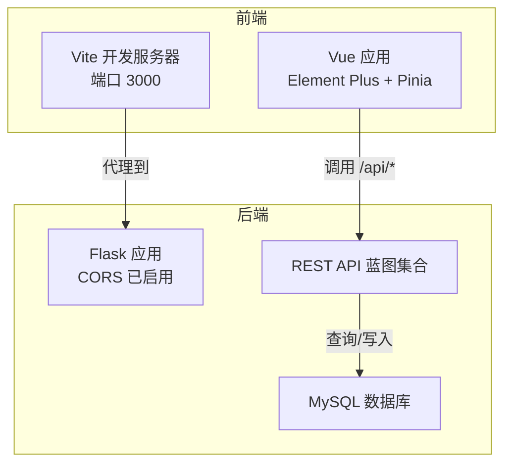
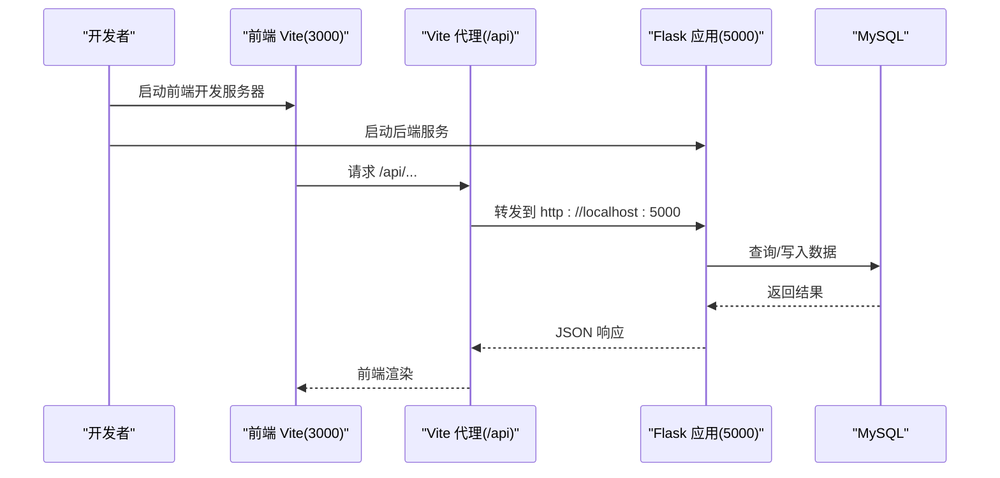
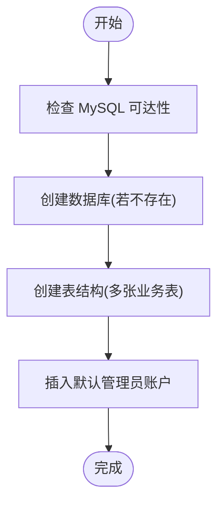
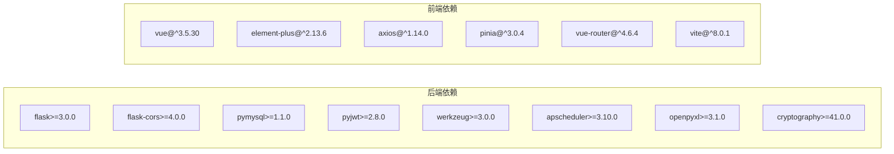

# 快速开始

<cite>
**本文引用的文件**
- [app.py](file://app.py)
- [config.py](file://config.py)
- [backend/app/__init__.py](file://backend/app/__init__.py)
- [backend/app/config.py](file://backend/app/config.py)
- [backend/app/utils/db.py](file://backend/app/utils/db.py)
- [backend/run.py](file://backend/run.py)
- [backend/requirements.txt](file://backend/requirements.txt)
- [backend/init_db.py](file://backend/init_db.py)
- [backend/import_data.py](file://backend/import_data.py)
- [frontend/package.json](file://frontend/package.json)
- [frontend/vite.config.js](file://frontend/vite.config.js)
- [frontend/src/main.js](file://frontend/src/main.js)
- [templates/base.html](file://templates/base.html)
</cite>

## 目录
1. [简介](#简介)
2. [项目结构](#项目结构)
3. [核心组件](#核心组件)
4. [架构总览](#架构总览)
5. [详细组件分析](#详细组件分析)
6. [依赖分析](#依赖分析)
7. [性能考虑](#性能考虑)
8. [故障排查指南](#故障排查指南)
9. [结论](#结论)
10. [附录](#附录)

## 简介
本指南面向首次接触云运维平台的用户，帮助你在约 30 分钟内完成环境准备、依赖安装、数据库初始化与配置，并成功启动后端服务与前端界面。文档覆盖开发环境与生产环境的差异配置要点，并提供常见问题的排查建议与验证步骤。

## 项目结构
该项目采用前后端分离架构：  
- 后端基于 Flask，提供 REST API 与模板渲染；  
- 前端基于 Vue 3 + Vite，通过代理访问后端 API；  
- 数据库使用 MySQL，初始化脚本负责建库建表与默认数据插入；  
- 配置通过环境变量注入，便于在不同环境灵活切换。

图表来源
- [frontend/vite.config.js:1-16](file://frontend/vite.config.js#L1-L16)
- [backend/app/__init__.py:28-53](file://backend/app/__init__.py#L28-L53)
- [backend/app/utils/db.py:1-17](file://backend/app/utils/db.py#L1-L17)

章节来源
- [app.py:1-671](file://app.py#L1-L671)
- [backend/app/__init__.py:1-53](file://backend/app/__init__.py#L1-L53)
- [frontend/vite.config.js:1-16](file://frontend/vite.config.js#L1-L16)

## 核心组件
- 后端 Flask 应用与配置
  - 使用环境变量驱动配置，支持开发与生产环境切换。
  - 提供统一数据库连接工具，集中管理连接参数。
- 数据库初始化
  - 自动创建数据库与表结构，插入默认管理员账户。
- 前端开发服务器
  - 本地开发端口 3000，通过代理转发 /api 到后端 5000 端口。
- 模板与静态资源
  - 使用 Jinja2 模板渲染页面，前端通过静态资源目录提供构建产物。

章节来源
- [config.py:1-17](file://config.py#L1-L17)
- [backend/app/config.py:1-21](file://backend/app/config.py#L1-L21)
- [backend/app/utils/db.py:1-17](file://backend/app/utils/db.py#L1-L17)
- [backend/init_db.py:1-230](file://backend/init_db.py#L1-L230)
- [frontend/vite.config.js:1-16](file://frontend/vite.config.js#L1-L16)
- [templates/base.html:1-169](file://templates/base.html#L1-L169)

## 架构总览
后端通过蓝图组织 API，前端通过 Vite 代理访问后端接口。数据库初始化脚本负责建库建表与默认数据。

图表来源
- [frontend/vite.config.js:6-14](file://frontend/vite.config.js#L6-L14)
- [backend/app/__init__.py:15-16](file://backend/app/__init__.py#L15-L16)
- [backend/app/utils/db.py:5-16](file://backend/app/utils/db.py#L5-L16)

章节来源
- [backend/app/__init__.py:1-53](file://backend/app/__init__.py#L1-L53)
- [frontend/vite.config.js:1-16](file://frontend/vite.config.js#L1-L16)

## 详细组件分析

### 环境与依赖准备
- Python 版本要求
  - 后端依赖中包含 Flask>=3.0.0，建议使用 Python 3.7+。
- Node.js 版本要求
  - 前端使用 Vite，建议使用 Node.js LTS（如 18.x 或 20.x）。
- MySQL
  - 后端通过 pymysql 连接，需提前安装并准备好可访问的 MySQL 实例。

章节来源
- [backend/requirements.txt:1-9](file://backend/requirements.txt#L1-L9)
- [frontend/package.json:1-24](file://frontend/package.json#L1-L24)

### 依赖安装步骤
- 安装后端依赖
  - 在后端根目录执行安装命令以满足后端运行所需依赖。
- 安装前端依赖
  - 在前端目录执行安装命令以满足前端开发所需依赖。

章节来源
- [backend/requirements.txt:1-9](file://backend/requirements.txt#L1-L9)
- [frontend/package.json:1-24](file://frontend/package.json#L1-L24)

### 数据库初始化流程
- 初始化数据库与表结构
  - 执行数据库初始化脚本，自动创建数据库与所有业务表，并插入默认管理员账户。
- 可选：导入演示数据
  - 若存在 Excel 数据源，可执行数据导入脚本将示例数据写入数据库。

图表来源
- [backend/init_db.py:22-226](file://backend/init_db.py#L22-L226)

章节来源
- [backend/init_db.py:1-230](file://backend/init_db.py#L1-L230)
- [backend/import_data.py:1-371](file://backend/import_data.py#L1-L371)

### 配置文件与环境变量
- 后端配置项
  - 数据库连接：主机、端口、用户名、密码、数据库名。
  - Flask 运行：主机绑定、端口、调试模式。
  - JWT 相关：密钥与过期时长（用于后续认证模块）。
- 前端代理配置
  - 本地开发时，将 /api 前缀代理到后端 5000 端口。

章节来源
- [config.py:1-17](file://config.py#L1-L17)
- [backend/app/config.py:1-21](file://backend/app/config.py#L1-L21)
- [frontend/vite.config.js:6-14](file://frontend/vite.config.js#L6-L14)

### 启动后端服务
- 方式一：直接运行
  - 在后端根目录启动 Flask 应用，默认监听 0.0.0.0:5000。
- 方式二：通过工厂函数
  - 使用应用工厂创建实例，便于扩展与测试。

章节来源
- [app.py:669-671](file://app.py#L669-L671)
- [backend/run.py:1-8](file://backend/run.py#L1-L8)
- [backend/app/__init__.py:6-25](file://backend/app/__init__.py#L6-L25)

### 启动前端开发服务器
- 在前端目录启动 Vite 开发服务器，默认监听 3000 端口。
- 通过代理将 /api 请求转发至后端 5000 端口。

章节来源
- [frontend/vite.config.js:6-14](file://frontend/vite.config.js#L6-L14)
- [frontend/src/main.js:1-23](file://frontend/src/main.js#L1-L23)

### 验证步骤
- 后端可用性
  - 访问后端根路径，确认返回仪表盘模板。
- 前端可用性
  - 访问前端开发地址，确认页面正常加载且能发起 /api 请求。
- 数据库可用性
  - 登录数据库，确认已创建数据库与表结构，且默认管理员账户存在。

章节来源
- [app.py:26-78](file://app.py#L26-L78)
- [templates/base.html:1-169](file://templates/base.html#L1-L169)
- [backend/init_db.py:213-226](file://backend/init_db.py#L213-L226)

## 依赖分析
后端依赖集中在 Flask 生态与数据库访问层，前端依赖 Vue 3 生态与构建工具链。

图表来源
- [backend/requirements.txt:1-9](file://backend/requirements.txt#L1-L9)
- [frontend/package.json:11-22](file://frontend/package.json#L11-L22)

章节来源
- [backend/requirements.txt:1-9](file://backend/requirements.txt#L1-L9)
- [frontend/package.json:1-24](file://frontend/package.json#L1-L24)

## 性能考虑
- 数据库连接
  - 使用连接池可提升并发场景下的响应能力（当前实现为每次请求新建连接，适合小规模使用）。
- 前端构建
  - 生产构建建议开启压缩与缓存策略，减少首屏加载时间。
- 调度与任务
  - 后端预留定时任务表与调度器初始化入口，可用于后续异步任务与巡检。

章节来源
- [backend/app/utils/db.py:5-16](file://backend/app/utils/db.py#L5-L16)
- [backend/app/__init__.py:21-23](file://backend/app/__init__.py#L21-L23)

## 故障排查指南
- 无法连接数据库
  - 检查数据库主机、端口、用户名、密码与数据库名是否正确。
  - 确认网络连通性与防火墙策略。
- 前端无法访问后端 API
  - 确认 Vite 代理配置指向后端 5000 端口。
  - 检查后端 CORS 配置是否允许前端来源。
- 默认管理员登录失败
  - 确认数据库初始化已完成，且默认管理员账户存在。
- 端口冲突
  - 修改后端或前端监听端口，避免与系统或其他进程冲突。

章节来源
- [config.py:6-16](file://config.py#L6-L16)
- [backend/app/config.py:9-17](file://backend/app/config.py#L9-L17)
- [frontend/vite.config.js:6-14](file://frontend/vite.config.js#L6-L14)
- [backend/init_db.py:213-226](file://backend/init_db.py#L213-L226)

## 结论
按照本指南，你可以在 30 分钟内完成环境准备、依赖安装、数据库初始化与前后端启动。建议在开发环境中先完成验证，再按生产环境要求调整配置与部署策略。

## 附录

### 开发环境与生产环境配置差异
- 开发环境
  - 后端：开启调试模式，绑定 0.0.0.0:5000，便于本地联调。
  - 前端：Vite 本地开发服务器，代理到后端 5000 端口。
- 生产环境
  - 后端：关闭调试模式，使用稳定密钥与更强的安全配置，结合反向代理对外暴露服务。
  - 前端：构建静态资源并通过 Nginx/Apache 提供服务，后端通过反向代理统一暴露 API。

章节来源
- [config.py:14-16](file://config.py#L14-L16)
- [backend/app/config.py:15-17](file://backend/app/config.py#L15-L17)
- [frontend/vite.config.js:6-14](file://frontend/vite.config.js#L6-L14)