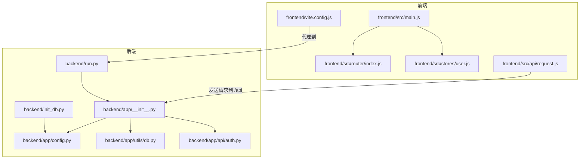
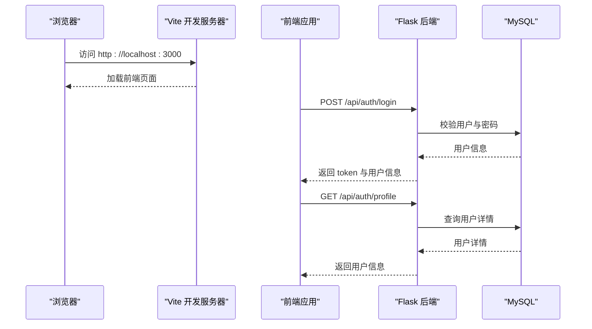
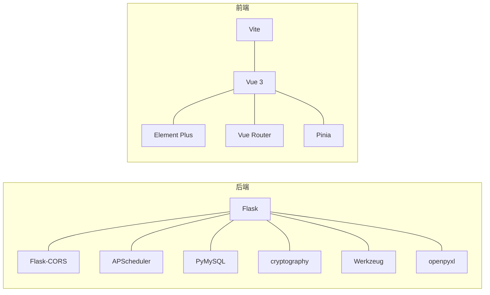

# 快速开始

<cite>
**本文引用的文件**
- [backend/requirements.txt](file://backend/requirements.txt)
- [backend/run.py](file://backend/run.py)
- [backend/app/config.py](file://backend/app/config.py)
- [backend/app/__init__.py](file://backend/app/__init__.py)
- [backend/app/utils/db.py](file://backend/app/utils/db.py)
- [backend/app/utils/auth.py](file://backend/app/utils/auth.py)
- [backend/init_db.py](file://backend/init_db.py)
- [backend/import_data.py](file://backend/import_data.py)
- [backend/app/api/auth.py](file://backend/app/api/auth.py)
- [frontend/package.json](file://frontend/package.json)
- [frontend/vite.config.js](file://frontend/vite.config.js)
- [frontend/src/main.js](file://frontend/src/main.js)
- [frontend/src/router/index.js](file://frontend/src/router/index.js)
- [frontend/src/stores/user.js](file://frontend/src/stores/user.js)
- [frontend/src/api/request.js](file://frontend/src/api/request.js)
</cite>

## 目录
1. [简介](#简介)
2. [项目结构](#项目结构)
3. [核心组件](#核心组件)
4. [架构总览](#架构总览)
5. [详细组件分析](#详细组件分析)
6. [依赖关系分析](#依赖关系分析)
7. [性能注意事项](#性能注意事项)
8. [故障排除指南](#故障排除指南)
9. [结论](#结论)
10. [附录](#附录)

## 简介
本指南面向新加入的开发者，帮助你在最短时间内完成云运维平台的本地环境搭建与首次运行。你将学到：
- Python 后端环境准备与依赖安装
- Node.js 前端环境准备与依赖安装
- MySQL 数据库安装与初始化
- 环境变量配置方法
- 数据库初始化脚本与演示数据导入
- 项目启动流程（后端开发服务器、前端开发环境）
- 前后端联调测试步骤
- 常见安装问题与故障排除

## 项目结构
项目采用前后端分离架构：
- 后端基于 Flask，提供 REST API 服务，支持跨域与定时任务调度
- 前端基于 Vue 3 + Vite，使用 Element Plus 组件库与 Pinia 状态管理
- 数据库使用 MySQL，通过 PyMySQL 连接

图表来源
- [frontend/src/main.js:1-23](file://frontend/src/main.js#L1-L23)
- [frontend/src/router/index.js:1-61](file://frontend/src/router/index.js#L1-L61)
- [frontend/src/stores/user.js:1-41](file://frontend/src/stores/user.js#L1-L41)
- [frontend/src/api/request.js:1-54](file://frontend/src/api/request.js#L1-L54)
- [frontend/vite.config.js:1-17](file://frontend/vite.config.js#L1-L17)
- [backend/run.py:1-8](file://backend/run.py#L1-L8)
- [backend/app/__init__.py:1-62](file://backend/app/__init__.py#L1-L62)
- [backend/app/config.py:1-21](file://backend/app/config.py#L1-L21)
- [backend/app/utils/db.py:1-17](file://backend/app/utils/db.py#L1-L17)
- [backend/app/api/auth.py:1-184](file://backend/app/api/auth.py#L1-L184)
- [backend/init_db.py:1-263](file://backend/init_db.py#L1-L263)

章节来源
- [backend/requirements.txt:1-9](file://backend/requirements.txt#L1-L9)
- [frontend/package.json:1-24](file://frontend/package.json#L1-L24)

## 核心组件
- 后端 Flask 应用入口与配置
  - 应用工厂与蓝图注册：[backend/app/__init__.py:6-34](file://backend/app/__init__.py#L6-L34)
  - 全局配置读取与 CORS 设置：[backend/app/config.py:4-21](file://backend/app/config.py#L4-L21)
  - 开发服务器启动入口：[backend/run.py:1-8](file://backend/run.py#L1-L8)
  - 数据库连接工具：[backend/app/utils/db.py:5-17](file://backend/app/utils/db.py#L5-L17)
  - 认证与令牌工具：[backend/app/utils/auth.py:11-35](file://backend/app/utils/auth.py#L11-L35)

- 前端应用入口与配置
  - 应用初始化与插件注册：[frontend/src/main.js:1-23](file://frontend/src/main.js#L1-L23)
  - 路由与鉴权守卫：[frontend/src/router/index.js:36-58](file://frontend/src/router/index.js#L36-L58)
  - 用户状态与本地存储：[frontend/src/stores/user.js:1-41](file://frontend/src/stores/user.js#L1-L41)
  - Axios 请求封装与拦截器：[frontend/src/api/request.js:1-54](file://frontend/src/api/request.js#L1-L54)
  - Vite 开发服务器与代理配置：[frontend/vite.config.js:4-16](file://frontend/vite.config.js#L4-L16)

- 数据库初始化与演示数据
  - 初始化脚本（建库建表、默认数据）：[backend/init_db.py:22-259](file://backend/init_db.py#L22-L259)
  - 演示数据导入（Excel -> MySQL）：[backend/import_data.py:11-34](file://backend/import_data.py#L11-L34)

章节来源
- [backend/app/__init__.py:6-62](file://backend/app/__init__.py#L6-L62)
- [backend/app/config.py:4-21](file://backend/app/config.py#L4-L21)
- [backend/run.py:1-8](file://backend/run.py#L1-L8)
- [backend/app/utils/db.py:5-17](file://backend/app/utils/db.py#L5-L17)
- [backend/app/utils/auth.py:11-35](file://backend/app/utils/auth.py#L11-L35)
- [frontend/src/main.js:1-23](file://frontend/src/main.js#L1-L23)
- [frontend/src/router/index.js:36-58](file://frontend/src/router/index.js#L36-L58)
- [frontend/src/stores/user.js:1-41](file://frontend/src/stores/user.js#L1-L41)
- [frontend/src/api/request.js:1-54](file://frontend/src/api/request.js#L1-L54)
- [frontend/vite.config.js:4-16](file://frontend/vite.config.js#L4-L16)
- [backend/init_db.py:22-259](file://backend/init_db.py#L22-L259)
- [backend/import_data.py:11-34](file://backend/import_data.py#L11-L34)

## 架构总览
前后端交互通过 Vite 代理转发到 Flask 开发服务器，前端通过 Axios 发送请求到 /api 前缀接口，后端提供认证、用户、服务器、服务、应用、证书、更新记录、定时任务等模块的 REST 接口。

图表来源
- [frontend/vite.config.js:9-14](file://frontend/vite.config.js#L9-L14)
- [frontend/src/api/request.js:5-11](file://frontend/src/api/request.js#L5-L11)
- [frontend/src/router/index.js:36-58](file://frontend/src/router/index.js#L36-L58)
- [backend/app/api/auth.py:14-82](file://backend/app/api/auth.py#L14-L82)
- [backend/app/utils/db.py:5-17](file://backend/app/utils/db.py#L5-L17)

## 详细组件分析

### 后端环境搭建与启动
- Python 版本要求
  - 使用 Python 3.x（建议 3.8+），确保 pip 可用
- 安装依赖
  - 在后端目录安装依赖：[backend/requirements.txt:1-9](file://backend/requirements.txt#L1-L9)
- 环境变量配置
  - 后端配置项均来自环境变量，常用键如下：
    - SECRET_KEY、JWT_SECRET_KEY：用于签名与加密
    - DB_HOST、DB_PORT、DB_USER、DB_PASSWORD、DB_NAME：数据库连接参数
    - FLASK_DEBUG、FLASK_HOST、FLASK_PORT：开发服务器参数
  - 参考配置定义：[backend/app/config.py:4-21](file://backend/app/config.py#L4-L21)
- 启动后端开发服务器
  - 直接运行入口文件：[backend/run.py:1-8](file://backend/run.py#L1-L8)
  - 默认监听地址与端口可由环境变量覆盖

章节来源
- [backend/requirements.txt:1-9](file://backend/requirements.txt#L1-L9)
- [backend/app/config.py:4-21](file://backend/app/config.py#L4-L21)
- [backend/run.py:1-8](file://backend/run.py#L1-L8)

### 前端环境搭建与启动
- Node.js 版本要求
  - 使用 Node.js 16+（推荐 LTS），确保 npm 可用
- 安装依赖
  - 在前端目录安装依赖：[frontend/package.json:6-10](file://frontend/package.json#L6-L10)
- 开发服务器
  - Vite 开发服务器默认监听 3000 端口，代理规则指向后端 5000 端口
  - 参考代理配置：[frontend/vite.config.js:6-16](file://frontend/vite.config.js#L6-L16)
- 应用入口与插件
  - Vue 应用初始化、路由、状态管理与组件库注册：[frontend/src/main.js:1-23](file://frontend/src/main.js#L1-L23)

章节来源
- [frontend/package.json:6-10](file://frontend/package.json#L6-L10)
- [frontend/vite.config.js:6-16](file://frontend/vite.config.js#L6-L16)
- [frontend/src/main.js:1-23](file://frontend/src/main.js#L1-L23)

### MySQL 数据库安装与配置
- 安装 MySQL（5.7+ 或 8.0+）
- 创建数据库与用户（可选，使用后端配置中的凭据即可）
- 后端连接参数来源于配置，参考：
  - [backend/app/config.py:9-13](file://backend/app/config.py#L9-L13)
  - [backend/app/utils/db.py:8-16](file://backend/app/utils/db.py#L8-L16)

章节来源
- [backend/app/config.py:9-13](file://backend/app/config.py#L9-L13)
- [backend/app/utils/db.py:8-16](file://backend/app/utils/db.py#L8-L16)

### 数据库初始化与演示数据
- 初始化数据库与表结构
  - 执行初始化脚本以创建数据库、表与默认数据：
    - [backend/init_db.py:22-259](file://backend/init_db.py#L22-L259)
  - 默认管理员账户：用户名 admin，密码 admin123
- 导入演示数据（可选）
  - 使用 Excel 数据导入脚本，需先准备 info.xlsx：
    - [backend/import_data.py:11-34](file://backend/import_data.py#L11-L34)

章节来源
- [backend/init_db.py:22-259](file://backend/init_db.py#L22-L259)
- [backend/import_data.py:11-34](file://backend/import_data.py#L11-L34)

### 项目启动流程
- 启动后端
  - 在后端目录执行入口文件，监听地址与端口由配置决定：
    - [backend/run.py:1-8](file://backend/run.py#L1-L8)
    - [backend/app/config.py:15-17](file://backend/app/config.py#L15-L17)
- 启动前端
  - 在前端目录启动 Vite 开发服务器：
    - [frontend/vite.config.js:6-16](file://frontend/vite.config.js#L6-L16)
- 前后端联调
  - 前端通过 /api 前缀访问后端接口，代理配置见：
    - [frontend/vite.config.js:9-14](file://frontend/vite.config.js#L9-L14)
  - 前端 Axios 默认基础路径为 /api：
    - [frontend/src/api/request.js:5-11](file://frontend/src/api/request.js#L5-L11)

章节来源
- [backend/run.py:1-8](file://backend/run.py#L1-L8)
- [backend/app/config.py:15-17](file://backend/app/config.py#L15-L17)
- [frontend/vite.config.js:6-16](file://frontend/vite.config.js#L6-L16)
- [frontend/src/api/request.js:5-11](file://frontend/src/api/request.js#L5-L11)

### 前后端联调测试步骤
- 登录接口测试
  - 前端路由守卫与状态管理：
    - [frontend/src/router/index.js:36-58](file://frontend/src/router/index.js#L36-L58)
    - [frontend/src/stores/user.js:1-41](file://frontend/src/stores/user.js#L1-L41)
  - 后端登录接口与认证工具：
    - [backend/app/api/auth.py:14-82](file://backend/app/api/auth.py#L14-L82)
    - [backend/app/utils/auth.py:11-35](file://backend/app/utils/auth.py#L11-L35)
- 获取用户资料
  - 前端请求封装与拦截器：
    - [frontend/src/api/request.js:13-51](file://frontend/src/api/request.js#L13-L51)
  - 后端用户资料接口：
    - [backend/app/api/auth.py:85-115](file://backend/app/api/auth.py#L85-L115)

章节来源
- [frontend/src/router/index.js:36-58](file://frontend/src/router/index.js#L36-L58)
- [frontend/src/stores/user.js:1-41](file://frontend/src/stores/user.js#L1-L41)
- [backend/app/api/auth.py:14-115](file://backend/app/api/auth.py#L14-L115)
- [frontend/src/api/request.js:13-51](file://frontend/src/api/request.js#L13-L51)

## 依赖关系分析
- 后端依赖
  - Web 框架与扩展：Flask、Flask-CORS、APScheduler
  - 数据库与加密：PyMySQL、cryptography
  - 工具库：openpyxl（Excel 导入）、Werkzeug（安全工具）
  - 参考：[backend/requirements.txt:1-9](file://backend/requirements.txt#L1-L9)
- 前端依赖
  - 运行时：Vue 3、Element Plus、Vue Router、Pinia
  - 开发工具：Vite、@vitejs/plugin-vue
  - 参考：[frontend/package.json:11-22](file://frontend/package.json#L11-L22)

图表来源
- [backend/requirements.txt:1-9](file://backend/requirements.txt#L1-L9)
- [frontend/package.json:11-22](file://frontend/package.json#L11-L22)

章节来源
- [backend/requirements.txt:1-9](file://backend/requirements.txt#L1-L9)
- [frontend/package.json:11-22](file://frontend/package.json#L11-L22)

## 性能注意事项
- 后端
  - 使用连接池与合适的超时设置，避免长事务占用连接
  - 定时任务调度器仅在开发环境初始化，生产环境请按需调整
- 前端
  - 开发模式下启用热更新，构建时开启压缩与 Tree Shaking
  - Axios 超时设置合理，避免长时间阻塞请求

## 故障排除指南
- 后端无法启动
  - 检查端口占用与防火墙设置，确认 FLASK_HOST/FLASK_PORT
  - 参考：[backend/app/config.py:15-17](file://backend/app/config.py#L15-L17)，[backend/run.py:6-7](file://backend/run.py#L6-L7)
- 前端无法访问后端接口
  - 确认 Vite 代理配置正确，目标地址与端口匹配
  - 参考：[frontend/vite.config.js:9-14](file://frontend/vite.config.js#L9-L14)
- 登录失败或 401
  - 检查 JWT_SECRET_KEY 与后端配置一致
  - 确认数据库中存在默认管理员账户 admin/admin123
  - 参考：[backend/app/utils/auth.py:33-35](file://backend/app/utils/auth.py#L33-L35)，[backend/init_db.py:228-233](file://backend/init_db.py#L228-L233)
- 数据库连接失败
  - 检查 DB_HOST/DB_PORT/DB_USER/DB_PASSWORD/DB_NAME
  - 参考：[backend/app/config.py:9-13](file://backend/app/config.py#L9-L13)，[backend/app/utils/db.py:8-16](file://backend/app/utils/db.py#L8-L16)
- Excel 导入报错
  - 确保 info.xlsx 存在且结构符合导入脚本预期
  - 参考：[backend/import_data.py:11-34](file://backend/import_data.py#L11-L34)
- 前端刷新后鉴权失效
  - 检查本地存储 token 与 userInfo 的读写逻辑
  - 参考：[frontend/src/stores/user.js:6-21](file://frontend/src/stores/user.js#L6-L21)，[frontend/src/api/request.js:14-23](file://frontend/src/api/request.js#L14-L23)

章节来源
- [backend/app/config.py:9-17](file://backend/app/config.py#L9-L17)
- [backend/run.py:6-7](file://backend/run.py#L6-L7)
- [frontend/vite.config.js:9-14](file://frontend/vite.config.js#L9-L14)
- [backend/app/utils/auth.py:33-35](file://backend/app/utils/auth.py#L33-L35)
- [backend/init_db.py:228-233](file://backend/init_db.py#L228-L233)
- [backend/app/utils/db.py:8-16](file://backend/app/utils/db.py#L8-L16)
- [backend/import_data.py:11-34](file://backend/import_data.py#L11-L34)
- [frontend/src/stores/user.js:6-21](file://frontend/src/stores/user.js#L6-L21)
- [frontend/src/api/request.js:14-23](file://frontend/src/api/request.js#L14-L23)

## 结论
按照本指南完成环境准备、依赖安装、数据库初始化与项目启动后，你将可以成功访问前端页面并通过登录接口完成认证。如遇问题，请根据“故障排除指南”逐项排查。后续开发可围绕后端 API 与前端页面进行扩展。

## 附录
- 环境变量清单（示例）
  - SECRET_KEY、JWT_SECRET_KEY、DB_HOST、DB_PORT、DB_USER、DB_PASSWORD、DB_NAME、FLASK_DEBUG、FLASK_HOST、FLASK_PORT
  - 参考：[backend/app/config.py:4-21](file://backend/app/config.py#L4-L21)
- 默认管理员账户
  - 用户名：admin
  - 密码：admin123
  - 参考：[backend/init_db.py:228-233](file://backend/init_db.py#L228-L233)