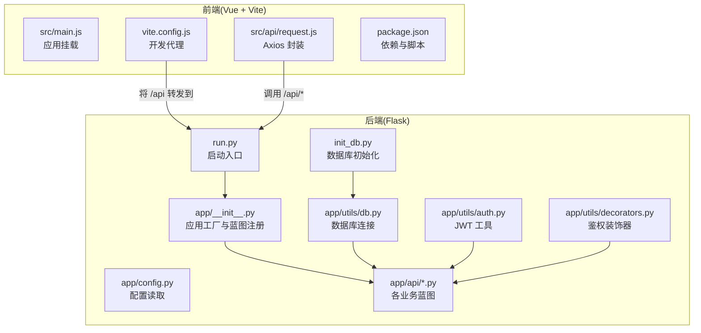
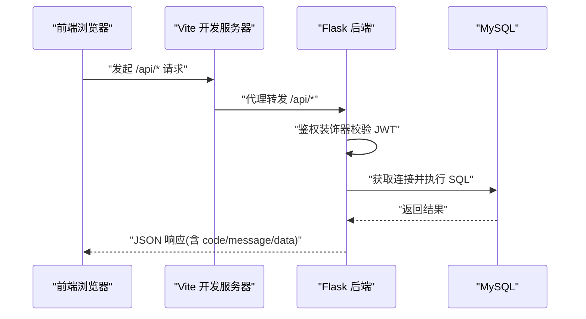
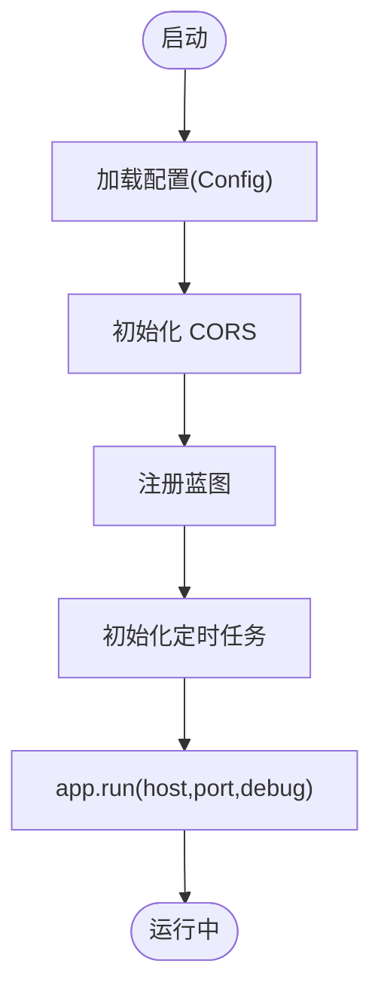
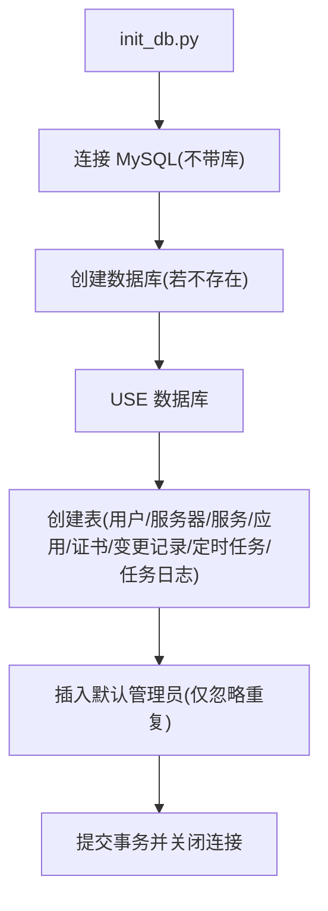
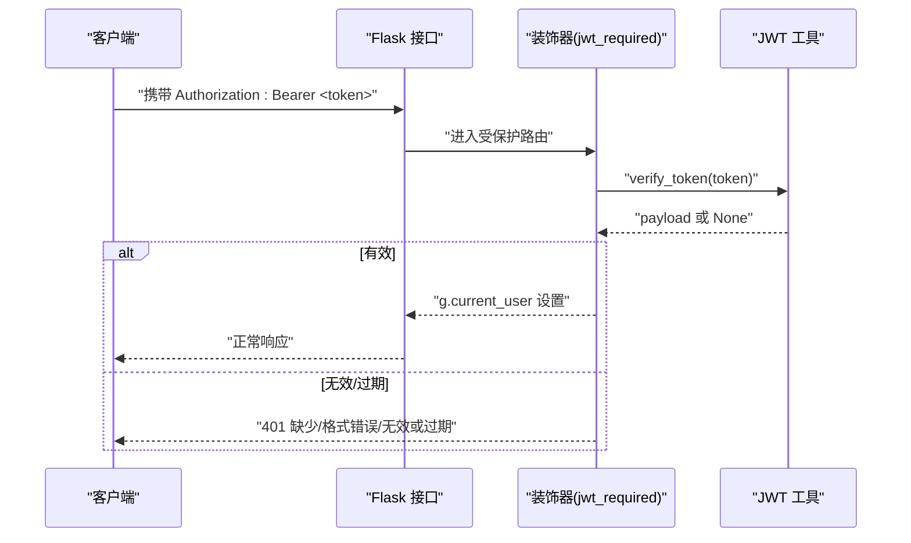
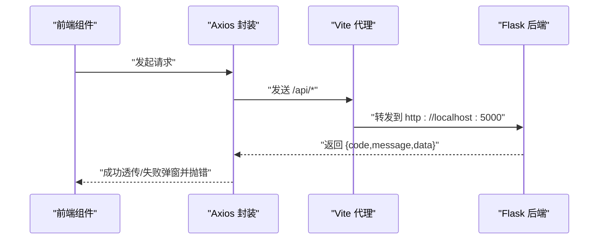
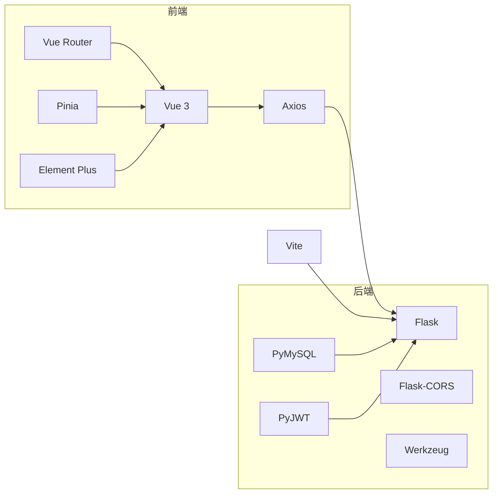

# 故障排除

<cite>
**本文引用的文件**
- [backend/app/__init__.py](file://backend/app/__init__.py)
- [backend/app/config.py](file://backend/app/config.py)
- [backend/run.py](file://backend/run.py)
- [backend/init_db.py](file://backend/init_db.py)
- [backend/app/utils/db.py](file://backend/app/utils/db.py)
- [backend/app/utils/auth.py](file://backend/app/utils/auth.py)
- [backend/app/utils/decorators.py](file://backend/app/utils/decorators.py)
- [backend/app/api/auth.py](file://backend/app/api/auth.py)
- [backend/app/api/users.py](file://backend/app/api/users.py)
- [backend/app/api/servers.py](file://backend/app/api/servers.py)
- [backend/app/api/services.py](file://backend/app/api/services.py)
- [frontend/src/api/request.js](file://frontend/src/api/request.js)
- [frontend/vite.config.js](file://frontend/vite.config.js)
- [frontend/package.json](file://frontend/package.json)
- [frontend/src/main.js](file://frontend/src/main.js)
</cite>

## 目录
1. [简介](#简介)
2. [项目结构](#项目结构)
3. [核心组件](#核心组件)
4. [架构总览](#架构总览)
5. [详细组件分析](#详细组件分析)
6. [依赖分析](#依赖分析)
7. [性能考虑](#性能考虑)
8. [故障排除指南](#故障排除指南)
9. [结论](#结论)
10. [附录](#附录)

## 简介
本指南面向运维与开发人员，聚焦系统启动失败、数据库连接问题、API 调用错误、前端加载异常、权限验证失败、网络代理与跨域、定时任务调度、以及常见性能与并发问题的排查与解决。文档结合后端 Flask 应用、MySQL 数据库、前端 Vue 项目与 Vite 开发服务器的实际实现，提供可操作的诊断步骤、错误代码说明与日志分析方法。

## 项目结构
后端采用 Flask 微服务风格，按功能划分蓝图；前端基于 Vue 3 + Vite，通过本地代理将 /api 前缀转发至后端。数据库初始化脚本负责创建表结构与默认管理员账户。

图表来源
- [backend/app/__init__.py:1-53](file://backend/app/__init__.py#L1-L53)
- [backend/app/config.py:1-21](file://backend/app/config.py#L1-L21)
- [backend/run.py:1-8](file://backend/run.py#L1-L8)
- [backend/app/utils/db.py:1-17](file://backend/app/utils/db.py#L1-L17)
- [backend/app/utils/auth.py:1-83](file://backend/app/utils/auth.py#L1-L83)
- [backend/app/utils/decorators.py:1-95](file://backend/app/utils/decorators.py#L1-L95)
- [backend/init_db.py:1-230](file://backend/init_db.py#L1-L230)
- [frontend/src/api/request.js:1-54](file://frontend/src/api/request.js#L1-L54)
- [frontend/vite.config.js:1-16](file://frontend/vite.config.js#L1-L16)
- [frontend/src/main.js:1-23](file://frontend/src/main.js#L1-L23)

章节来源
- [backend/app/__init__.py:1-53](file://backend/app/__init__.py#L1-L53)
- [backend/app/config.py:1-21](file://backend/app/config.py#L1-L21)
- [backend/run.py:1-8](file://backend/run.py#L1-L8)
- [frontend/vite.config.js:1-16](file://frontend/vite.config.js#L1-L16)

## 核心组件
- 应用工厂与蓝图注册：集中初始化 CORS、定时任务与蓝图注册，便于统一管理与扩展。
- 配置系统：从环境变量读取数据库、JWT、Flask 主机与端口等关键参数。
- 数据库工具：封装连接参数与游标类型，确保一致性。
- 鉴权工具与装饰器：统一生成、校验 JWT，并提供通用的认证/授权装饰器。
- API 层：按资源划分蓝图，统一返回结构与错误码。
- 前端 Axios 封装：自动注入 Bearer Token、统一封装响应错误、处理 401 登录过期跳转。

章节来源
- [backend/app/__init__.py:1-53](file://backend/app/__init__.py#L1-L53)
- [backend/app/config.py:1-21](file://backend/app/config.py#L1-L21)
- [backend/app/utils/db.py:1-17](file://backend/app/utils/db.py#L1-L17)
- [backend/app/utils/auth.py:1-83](file://backend/app/utils/auth.py#L1-L83)
- [backend/app/utils/decorators.py:1-95](file://backend/app/utils/decorators.py#L1-L95)
- [frontend/src/api/request.js:1-54](file://frontend/src/api/request.js#L1-L54)

## 架构总览
后端通过应用工厂创建 Flask 实例，注册多个蓝图提供 REST API；前端通过 Vite 本地代理将 /api 请求转发至后端。数据库连接由工具模块统一管理，认证与权限控制通过装饰器与工具函数实现。

图表来源
- [frontend/vite.config.js:1-16](file://frontend/vite.config.js#L1-L16)
- [backend/app/utils/decorators.py:1-95](file://backend/app/utils/decorators.py#L1-L95)
- [backend/app/utils/db.py:1-17](file://backend/app/utils/db.py#L1-L17)

## 详细组件分析

### 后端应用工厂与启动
- 应用工厂负责加载配置、设置 CORS、注册蓝图、初始化定时任务调度器。
- 启动入口从工厂创建应用实例，并根据配置运行。

图表来源
- [backend/app/__init__.py:1-53](file://backend/app/__init__.py#L1-L53)
- [backend/run.py:1-8](file://backend/run.py#L1-L8)

章节来源
- [backend/app/__init__.py:1-53](file://backend/app/__init__.py#L1-L53)
- [backend/run.py:1-8](file://backend/run.py#L1-L8)

### 数据库连接与初始化
- 连接参数来自配置对象，支持选择是否指定数据库名。
- 初始化脚本创建数据库与多张业务表，插入默认管理员账户。

图表来源
- [backend/init_db.py:1-230](file://backend/init_db.py#L1-L230)
- [backend/app/utils/db.py:1-17](file://backend/app/utils/db.py#L1-L17)
- [backend/app/config.py:1-21](file://backend/app/config.py#L1-L21)

章节来源
- [backend/init_db.py:1-230](file://backend/init_db.py#L1-L230)
- [backend/app/utils/db.py:1-17](file://backend/app/utils/db.py#L1-L17)
- [backend/app/config.py:1-21](file://backend/app/config.py#L1-L21)

### 认证与权限控制
- JWT 工具：生成与校验 token，处理过期与无效 token 场景。
- 鉴权装饰器：从 Authorization 头解析 Bearer token，校验失败返回 401。
- 角色装饰器：在认证基础上进一步校验角色，拒绝则返回 403。

图表来源
- [backend/app/utils/decorators.py:1-95](file://backend/app/utils/decorators.py#L1-L95)
- [backend/app/utils/auth.py:1-83](file://backend/app/utils/auth.py#L1-L83)

章节来源
- [backend/app/utils/auth.py:1-83](file://backend/app/utils/auth.py#L1-L83)
- [backend/app/utils/decorators.py:1-95](file://backend/app/utils/decorators.py#L1-L95)

### API 错误码与返回结构
- 统一返回结构包含 code、message、data。
- 常见错误码：
  - 400：请求参数缺失或格式错误
  - 401：认证失败/登录过期
  - 403：权限不足
  - 404：资源不存在
  - 409：资源冲突（如用户名已存在）
  - 500：服务器内部错误

章节来源
- [backend/app/api/auth.py:14-184](file://backend/app/api/auth.py#L14-L184)
- [backend/app/api/users.py:17-268](file://backend/app/api/users.py#L17-L268)
- [backend/app/api/servers.py:11-203](file://backend/app/api/servers.py#L11-L203)
- [backend/app/api/services.py:11-144](file://backend/app/api/services.py#L11-L144)

### 前端请求封装与代理
- Axios 封装：设置 baseURL 为 /api，自动注入 Bearer Token，统一封装响应错误与 401 登录过期处理。
- Vite 代理：将 /api 前缀转发到后端，默认指向 http://localhost:5000。
- 应用入口：初始化 Pinia、路由、Element Plus 并挂载应用。

图表来源
- [frontend/src/api/request.js:1-54](file://frontend/src/api/request.js#L1-L54)
- [frontend/vite.config.js:1-16](file://frontend/vite.config.js#L1-L16)

章节来源
- [frontend/src/api/request.js:1-54](file://frontend/src/api/request.js#L1-L54)
- [frontend/vite.config.js:1-16](file://frontend/vite.config.js#L1-L16)
- [frontend/src/main.js:1-23](file://frontend/src/main.js#L1-L23)

## 依赖分析
- 后端依赖 Flask、Flask-CORS、PyMySQL、Werkzeug、PyJWT。
- 前端依赖 Vue 3、Vue Router、Pinia、Axios、Element Plus。
- 开发依赖 Vite 与插件。

图表来源
- [frontend/package.json:1-24](file://frontend/package.json#L1-L24)

章节来源
- [frontend/package.json:1-24](file://frontend/package.json#L1-L24)

## 性能考虑
- 数据库连接：每次请求获取连接并在 finally 中关闭，避免连接泄漏；建议在高并发场景引入连接池以减少开销。
- 日志：后端未内置统一日志中间件，建议增加请求级日志与慢查询记录。
- 前端：避免一次性加载过多资源，合理拆分路由与组件；对高频请求进行节流/防抖。
- 定时任务：调度器初始化在应用工厂中，需关注任务执行耗时与异常处理，防止阻塞主线程。

[本节为通用指导，无需列出章节来源]

## 故障排除指南

### 一、系统启动失败
常见症状
- 后端无法启动，端口占用或配置错误导致进程退出。
- 前端开发服务器无法访问或代理转发失败。

排查步骤
- 检查后端配置项是否正确（主机、端口、调试模式），确认环境变量已设置。
- 确认端口未被占用，必要时修改配置或释放端口。
- 查看后端启动入口是否正确加载应用工厂。
- 前端确认 Vite 代理配置是否指向正确的后端地址与端口。
- 若使用 init_db 初始化数据库，确认数据库服务可达且凭据正确。

错误代码与定位
- 启动阶段无特定业务 code，优先检查端口与配置。
- 如出现 404/500，通常为路由未注册或蓝图导入异常（检查应用工厂中的蓝图注册逻辑）。

章节来源
- [backend/app/config.py:1-21](file://backend/app/config.py#L1-L21)
- [backend/run.py:1-8](file://backend/run.py#L1-L8)
- [backend/app/__init__.py:28-53](file://backend/app/__init__.py#L28-L53)
- [frontend/vite.config.js:1-16](file://frontend/vite.config.js#L1-L16)

### 二、数据库连接问题
常见症状
- 后端启动时报连接错误或 API 调用失败。
- 数据库初始化脚本执行失败。

排查步骤
- 核对配置中的主机、端口、用户名、密码、数据库名。
- 使用数据库客户端验证连通性与凭据。
- 在初始化脚本中确认数据库创建与表结构执行成功。
- 检查连接参数与字符集设置是否一致。

错误代码与定位
- API 层数据库操作异常通常返回 500。
- 建议在工具层捕获连接异常并记录堆栈，便于定位。

章节来源
- [backend/app/config.py:9-13](file://backend/app/config.py#L9-L13)
- [backend/app/utils/db.py:5-17](file://backend/app/utils/db.py#L5-L17)
- [backend/init_db.py:9-222](file://backend/init_db.py#L9-L222)

### 三、API 调用错误
常见症状
- 返回 400 参数错误、401 认证失败、403 权限不足、404 资源不存在、409 冲突、500 服务器错误。

排查步骤
- 检查请求头 Authorization 是否为 Bearer token 格式。
- 确认 token 未过期，secret_key 与后端一致。
- 对于受保护接口，确认装饰器顺序（先 @jwt_required，再 @role_required）。
- 校验请求体字段与长度要求（如密码长度）。
- 对于写操作，确认事务回滚与异常捕获逻辑。

错误代码说明
- 400：请求体为空、必填字段缺失、角色非法、密码过短等。
- 401：缺少认证头、认证格式错误、token 无效或过期。
- 403：角色不在允许范围内。
- 404：资源不存在。
- 409：用户名已存在等冲突。
- 500：数据库异常、业务异常等。

章节来源
- [backend/app/api/auth.py:14-184](file://backend/app/api/auth.py#L14-L184)
- [backend/app/api/users.py:17-268](file://backend/app/api/users.py#L17-L268)
- [backend/app/api/servers.py:11-203](file://backend/app/api/servers.py#L11-L203)
- [backend/app/api/services.py:11-144](file://backend/app/api/services.py#L11-L144)
- [backend/app/utils/decorators.py:9-95](file://backend/app/utils/decorators.py#L9-L95)

### 四、前端加载异常与网络问题
常见症状
- 页面空白、静态资源 404、/api 请求失败。
- 401 弹窗并跳转登录页。

排查步骤
- 确认 Vite 开发服务器已启动且端口正确。
- 检查 /api 代理是否生效，目标地址与端口是否匹配后端。
- 检查浏览器控制台网络面板，确认请求是否被代理转发。
- 确认本地存储中存在有效的 token，且未过期。
- 若后端返回 401，前端会清除 token 并跳转登录页，需重新登录。

章节来源
- [frontend/vite.config.js:1-16](file://frontend/vite.config.js#L1-L16)
- [frontend/src/api/request.js:14-51](file://frontend/src/api/request.js#L14-L51)
- [frontend/src/main.js:1-23](file://frontend/src/main.js#L1-L23)

### 五、权限验证失败
常见症状
- 访问受保护接口返回 401 或 403。
- 角色装饰器提示“未进行 JWT 认证”。

排查步骤
- 确保请求头携带 Authorization: Bearer <token>。
- 确认 token 未过期，secret_key 与后端一致。
- 确认装饰器使用顺序：先 @jwt_required，再 @role_required。
- 检查 g.current_user 是否正确注入。

章节来源
- [backend/app/utils/decorators.py:9-95](file://backend/app/utils/decorators.py#L9-L95)
- [backend/app/utils/auth.py:38-56](file://backend/app/utils/auth.py#L38-L56)

### 六、数据同步与并发访问冲突
常见症状
- 写操作失败、事务未提交、并发更新覆盖。
- 定时任务执行异常或阻塞。

排查步骤
- 写操作使用 try/finally 确保连接与游标关闭，异常时回滚。
- 对高并发场景引入连接池与锁机制，避免竞争条件。
- 定时任务执行前记录状态，执行后更新状态与下次执行时间。
- 对大事务拆分，减少锁持有时间。

章节来源
- [backend/app/api/servers.py:108-136](file://backend/app/api/servers.py#L108-L136)
- [backend/app/api/services.py:58-80](file://backend/app/api/services.py#L58-L80)
- [backend/app/__init__.py:22-23](file://backend/app/__init__.py#L22-L23)

### 七、日志分析与调试步骤
- 后端：在关键流程（请求进入、数据库操作、异常捕获）打印日志，区分 info/warn/error 级别。
- 前端：在响应拦截器中记录错误状态与消息，辅助定位问题。
- 数据库：开启慢查询日志，定位耗时 SQL；检查索引与连接数上限。
- 定时任务：记录任务执行时间、状态与错误信息，定期巡检。

[本节为通用指导，无需列出章节来源]

### 八、问题报告模板
- 环境信息：操作系统、Python 版本、Node 版本、数据库版本。
- 复现步骤：最小化复现步骤与预期/实际结果。
- 请求信息：请求 URL、方法、头信息（脱敏 token）、请求体。
- 错误信息：后端错误日志片段、前端控制台截图或文本。
- 截图/附件：页面截图、网络面板截图、数据库表结构快照。

[本节为通用指导，无需列出章节来源]

## 结论
通过规范的配置管理、统一的鉴权与错误处理、完善的日志与监控，以及合理的并发与性能优化策略，可以显著降低系统故障率并提升问题定位效率。建议在生产环境中补充连接池、统一日志、健康检查与告警机制。

[本节为总结性内容，无需列出章节来源]

## 附录

### A. 常见错误码速查
- 400：请求参数缺失/格式错误
- 401：缺少认证/认证格式错误/Token 无效或过期
- 403：权限不足
- 404：资源不存在
- 409：资源冲突（如用户名已存在）
- 500：服务器内部错误

章节来源
- [backend/app/api/auth.py:14-184](file://backend/app/api/auth.py#L14-L184)
- [backend/app/api/users.py:17-268](file://backend/app/api/users.py#L17-L268)
- [backend/app/api/servers.py:11-203](file://backend/app/api/servers.py#L11-L203)
- [backend/app/api/services.py:11-144](file://backend/app/api/services.py#L11-L144)

### B. 关键配置项参考
- Flask 主机与端口、调试模式
- 数据库主机、端口、用户名、密码、数据库名
- JWT 密钥与过期小时数
- 上传目录与最大内容长度

章节来源
- [backend/app/config.py:4-21](file://backend/app/config.py#L4-L21)