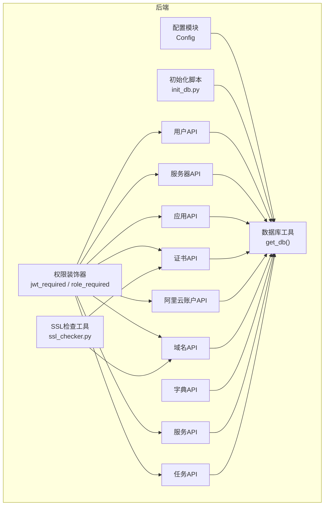
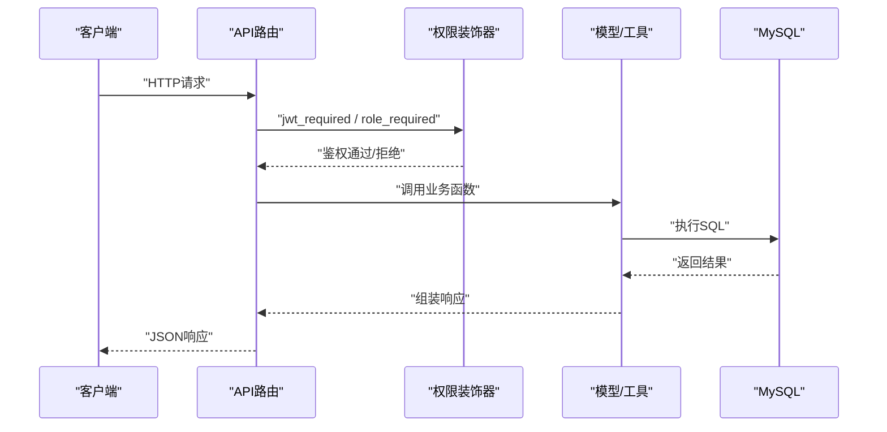
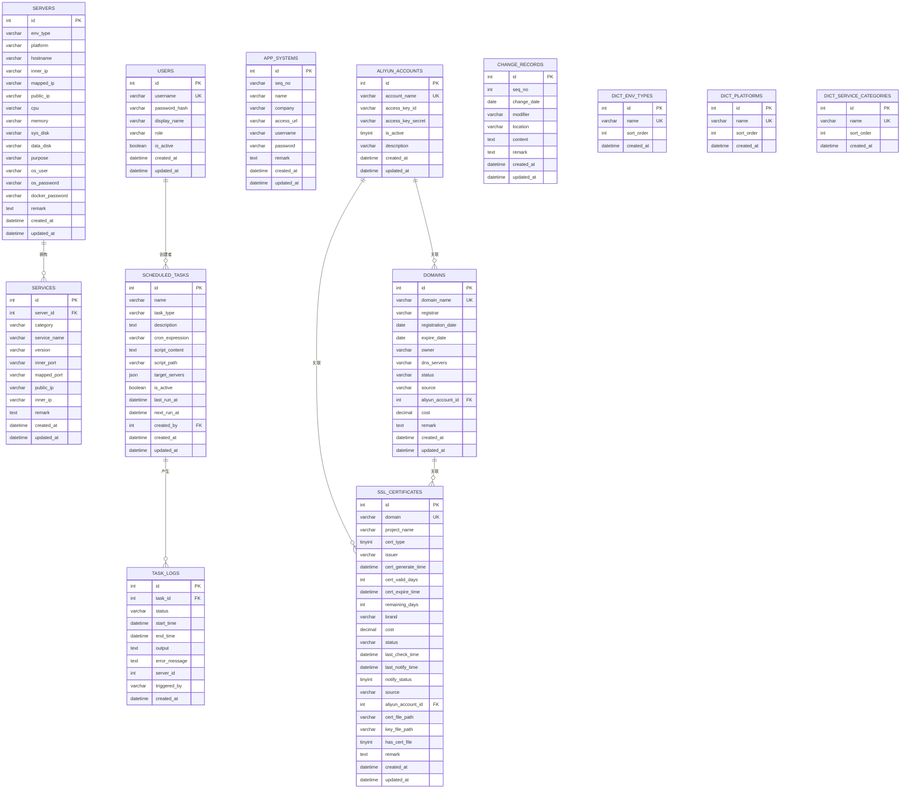
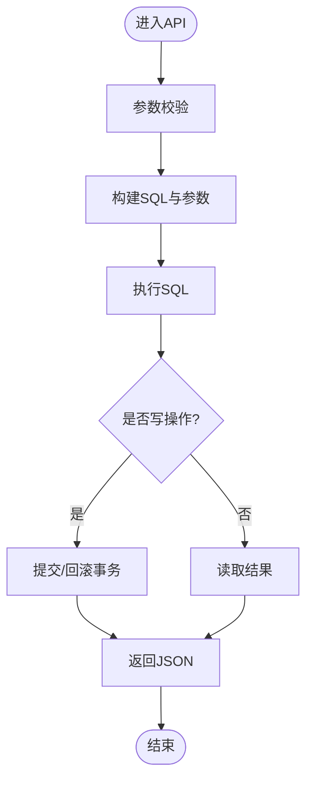
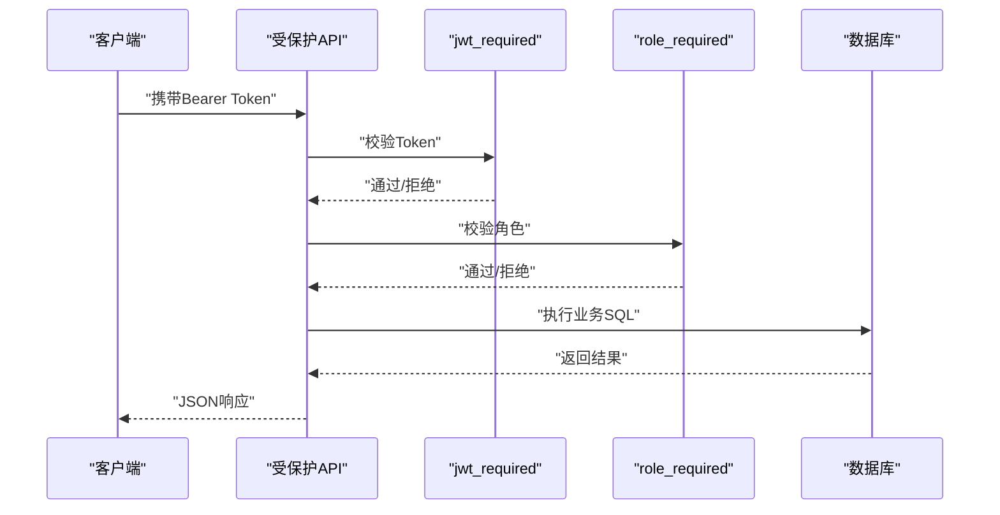
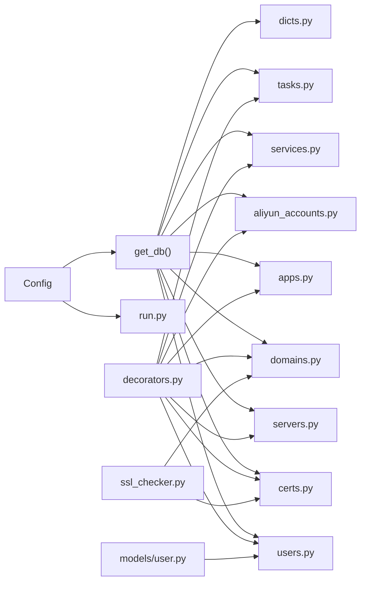

# 数据库设计

<cite>
**本文引用的文件**
- [backend/app/utils/db.py](file://backend/app/utils/db.py)
- [backend/init_db.py](file://backend/init_db.py)
- [backend/app/models/user.py](file://backend/app/models/user.py)
- [backend/app/config.py](file://backend/app/config.py)
- [backend/app/api/users.py](file://backend/app/api/users.py)
- [backend/app/api/servers.py](file://backend/app/api/servers.py)
- [backend/app/api/apps.py](file://backend/app/api/apps.py)
- [backend/app/api/certs.py](file://backend/app/api/certs.py)
- [backend/app/api/aliyun_accounts.py](file://backend/app/api/aliyun_accounts.py)
- [backend/app/api/domains.py](file://backend/app/api/domains.py)
- [backend/app/api/dicts.py](file://backend/app/api/dicts.py)
- [backend/app/api/services.py](file://backend/app/api/services.py)
- [backend/app/api/tasks.py](file://backend/app/api/tasks.py)
- [backend/app/utils/decorators.py](file://backend/app/utils/decorators.py)
- [backend/app/utils/ssl_checker.py](file://backend/app/utils/ssl_checker.py)
- [backend/run.py](file://backend/run.py)
- [ssl_cert_monitor/database.sql](file://ssl_cert_monitor/database.sql)
</cite>

## 目录
1. [简介](#简介)
2. [项目结构](#项目结构)
3. [核心组件](#核心组件)
4. [架构总览](#架构总览)
5. [详细组件分析](#详细组件分析)
6. [依赖分析](#依赖分析)
7. [性能考虑](#性能考虑)
8. [故障排查指南](#故障排查指南)
9. [结论](#结论)
10. [附录](#附录)

## 简介
本文件为云运维平台的数据库设计文档，覆盖数据库架构、表结构、字段定义、索引策略、约束关系、数据访问模式、ORM映射关系、查询优化策略、数据一致性保障、初始化脚本、迁移方案、备份恢复策略、数据安全与访问控制、性能监控方法等内容。文档以仓库中的实际代码为依据，确保设计与实现一致。

**更新** 新增SSL证书管理、阿里云账户管理和域名管理功能，包含完整的证书生命周期管理和云端资源同步能力。

## 项目结构
后端采用Flask微服务风格，数据库连接通过工具模块集中管理；初始化脚本负责创建数据库与表结构，并插入默认数据；各API模块负责对外提供REST接口，内部通过统一的数据库工具获取连接并执行SQL；装饰器模块提供JWT认证与角色权限校验；配置模块集中管理数据库连接参数。

**图表来源**
- [backend/app/config.py:1-21](file://backend/app/config.py#L1-L21)
- [backend/app/utils/db.py:1-17](file://backend/app/utils/db.py#L1-L17)
- [backend/init_db.py:1-313](file://backend/init_db.py#L1-L313)
- [backend/app/api/users.py:1-268](file://backend/app/api/users.py#L1-L268)
- [backend/app/api/servers.py:1-232](file://backend/app/api/servers.py#L1-L232)
- [backend/app/api/apps.py:1-168](file://backend/app/api/apps.py#L1-L168)
- [backend/app/api/certs.py:1-1086](file://backend/app/api/certs.py#L1-L1086)
- [backend/app/api/aliyun_accounts.py:1-257](file://backend/app/api/aliyun_accounts.py#L1-L257)
- [backend/app/api/domains.py:1-620](file://backend/app/api/domains.py#L1-L620)
- [backend/app/api/dicts.py:1-267](file://backend/app/api/dicts.py#L1-L267)
- [backend/app/api/services.py:1-182](file://backend/app/api/services.py#L1-L182)
- [backend/app/api/tasks.py:1-458](file://backend/app/api/tasks.py#L1-L458)
- [backend/app/utils/decorators.py:1-95](file://backend/app/utils/decorators.py#L1-L95)
- [backend/app/utils/ssl_checker.py:1-589](file://backend/app/utils/ssl_checker.py#L1-L589)

**章节来源**
- [backend/app/config.py:1-21](file://backend/app/config.py#L1-L21)
- [backend/app/utils/db.py:1-17](file://backend/app/utils/db.py#L1-L17)
- [backend/init_db.py:1-313](file://backend/init_db.py#L1-L313)
- [backend/app/api/users.py:1-268](file://backend/app/api/users.py#L1-L268)
- [backend/app/api/servers.py:1-232](file://backend/app/api/servers.py#L1-L232)
- [backend/app/api/apps.py:1-168](file://backend/app/api/apps.py#L1-L168)
- [backend/app/api/certs.py:1-1086](file://backend/app/api/certs.py#L1-L1086)
- [backend/app/api/aliyun_accounts.py:1-257](file://backend/app/api/aliyun_accounts.py#L1-L257)
- [backend/app/api/domains.py:1-620](file://backend/app/api/domains.py#L1-L620)
- [backend/app/api/dicts.py:1-267](file://backend/app/api/dicts.py#L1-L267)
- [backend/app/api/services.py:1-182](file://backend/app/api/services.py#L1-L182)
- [backend/app/api/tasks.py:1-458](file://backend/app/api/tasks.py#L1-L458)
- [backend/app/utils/decorators.py:1-95](file://backend/app/utils/decorators.py#L1-L95)

## 核心组件
- 数据库连接工具：集中管理数据库连接参数与连接获取逻辑，避免重复配置。
- 初始化脚本：创建数据库与所有表结构，设置索引与约束，并插入默认数据。
- 权限装饰器：统一处理JWT认证与角色权限校验，保护API路由。
- API层：面向前端的REST接口，封装CRUD与复杂查询，调用数据库工具执行SQL。
- 模型层：用户模型提供用户相关数据库操作函数，便于复用与测试。
- SSL检查工具：提供SSL证书检测、阿里云证书同步、微信预警通知等功能。

**更新** 新增SSL证书管理、阿里云账户管理和域名管理的核心功能模块。

**章节来源**
- [backend/app/utils/db.py:1-17](file://backend/app/utils/db.py#L1-L17)
- [backend/init_db.py:1-313](file://backend/init_db.py#L1-L313)
- [backend/app/utils/decorators.py:1-95](file://backend/app/utils/decorators.py#L1-L95)
- [backend/app/models/user.py:1-183](file://backend/app/models/user.py#L1-L183)
- [backend/app/utils/ssl_checker.py:1-589](file://backend/app/utils/ssl_checker.py#L1-L589)

## 架构总览
数据库层由初始化脚本一次性创建，运行时通过工具模块获取连接；API层负责业务编排与参数校验，模型层提供用户相关操作；装饰器层统一鉴权；配置模块集中管理数据库参数。

**图表来源**
- [backend/app/api/users.py:1-268](file://backend/app/api/users.py#L1-L268)
- [backend/app/utils/decorators.py:1-95](file://backend/app/utils/decorators.py#L1-L95)
- [backend/app/models/user.py:1-183](file://backend/app/models/user.py#L1-L183)
- [backend/app/utils/db.py:1-17](file://backend/app/utils/db.py#L1-L17)

## 详细组件分析

### 数据库架构与表结构设计
- 数据库名称：由配置模块提供，默认值可在部署时通过环境变量覆盖。
- 字符集与排序规则：统一使用utf8mb4与utf8mb4_unicode_ci，支持完整Unicode字符。
- 引擎：全部使用InnoDB，支持事务与外键。
- 时间戳：统一使用DATETIME，自动维护创建与更新时间。

**更新** 新增SSL证书管理、阿里云账户管理和域名管理的完整表结构设计。

**图表来源**
- [backend/init_db.py:33-301](file://backend/init_db.py#L33-L301)
- [backend/app/config.py:9-13](file://backend/app/config.py#L9-L13)

**章节来源**
- [backend/init_db.py:33-301](file://backend/init_db.py#L33-L301)
- [backend/app/config.py:9-13](file://backend/app/config.py#L9-L13)

### 字段定义与数据类型选择
- 主键：统一使用自增INT类型，满足中小型平台的ID需求。
- 字符串：VARCHAR长度根据业务最大长度设定，如用户名、显示名、平台名等；URL与备注使用TEXT。
- 数值：费用使用DECIMAL(10,2)，精确存储金额；天数使用INT类型。
- 日期时间：使用DATE/DATETIME，统一记录创建与更新时间。
- JSON：定时任务的目标服务器ID列表使用JSON类型，便于扩展。
- 枚举：角色、任务类型、状态等使用VARCHAR，配合约束与校验保证取值范围。
- 二进制标志：使用TINYINT(0/1)表示布尔值，如是否启用、是否有文件等。

**更新** 新增SSL证书类型、通知状态、证书文件路径等字段定义。

**章节来源**
- [backend/init_db.py:33-301](file://backend/init_db.py#L33-L301)

### 索引策略
- 单列索引：用户表的username与role，服务器表的env_type与inner_ip，服务表的server_id与service_name，字典表的sort_order，证书表的domain、cert_type、expire_time、status，阿里云账户表的account_name，域名表的domain_name、status，更新记录表的change_date与modifier，定时任务表的task_type与is_active，任务日志表的task_id、status与created_at。
- 复合查询：服务查询支持按分类、名称、环境类型多条件组合，通过WHERE与JOIN实现。
- 唯一约束：用户名、域名、阿里云账户名称唯一，防止重复。

**更新** 新增SSL证书表的证书类型索引、域名表的状态索引等。

**章节来源**
- [backend/init_db.py:44-300](file://backend/init_db.py#L44-L300)

### 约束关系
- 外键：服务表的server_id引用服务器表主键，定时任务表的created_by引用用户表，任务日志表的task_id引用定时任务表，阿里云账户表的id引用账户表，域名表的aliyun_account_id引用阿里云账户表，SSL证书表的aliyun_account_id引用阿里云账户表，均设置级联删除或SET NULL策略，确保数据一致性。
- 默认值：角色默认operator，是否激活默认TRUE，时间戳默认CURRENT_TIMESTAMP。
- 非空：关键字段如用户名、显示名、角色、服务名、任务类型、Cron表达式、域名等均设为NOT NULL。

**更新** 新增SSL证书与阿里云账户的外键关系，域名与阿里云账户的外键关系。

**章节来源**
- [backend/init_db.py:92-301](file://backend/init_db.py#L92-L301)

### 数据访问模式与ORM映射
- 原生SQL：API层直接拼接SQL与参数化查询，减少ORM开销，适合轻量级业务。
- 工具函数：数据库连接通过工具模块集中管理，API与模型共享。
- 模型层：用户模型提供创建、查询、更新、删除等函数，便于复用与单元测试。
- 事务：API层对写操作使用commit/rollback，保证原子性。

**图表来源**
- [backend/app/api/servers.py:130-232](file://backend/app/api/servers.py#L130-L232)
- [backend/app/api/apps.py:71-168](file://backend/app/api/apps.py#L71-L168)
- [backend/app/api/certs.py:46-1086](file://backend/app/api/certs.py#L46-L1086)
- [backend/app/api/aliyun_accounts.py:26-257](file://backend/app/api/aliyun_accounts.py#L26-L257)
- [backend/app/api/domains.py:32-620](file://backend/app/api/domains.py#L32-L620)
- [backend/app/api/services.py:86-182](file://backend/app/api/services.py#L86-L182)
- [backend/app/api/tasks.py:63-306](file://backend/app/api/tasks.py#L63-L306)

**章节来源**
- [backend/app/utils/db.py:5-17](file://backend/app/utils/db.py#L5-L17)
- [backend/app/models/user.py:8-183](file://backend/app/models/user.py#L8-L183)
- [backend/app/api/servers.py:130-232](file://backend/app/api/servers.py#L130-L232)
- [backend/app/api/apps.py:71-168](file://backend/app/api/apps.py#L71-L168)
- [backend/app/api/certs.py:46-1086](file://backend/app/api/certs.py#L46-L1086)
- [backend/app/api/aliyun_accounts.py:26-257](file://backend/app/api/aliyun_accounts.py#L26-L257)
- [backend/app/api/domains.py:32-620](file://backend/app/api/domains.py#L32-L620)
- [backend/app/api/services.py:86-182](file://backend/app/api/services.py#L86-L182)
- [backend/app/api/tasks.py:63-306](file://backend/app/api/tasks.py#L63-L306)

### 查询优化策略
- 参数化查询：所有写操作与查询均使用参数绑定，避免SQL注入并提升缓存命中。
- 索引利用：针对高频过滤字段建立单列索引，如env_type、inner_ip、username、role、domain、cert_type、expire_time、status等。
- 分页与限制：API层统一处理分页参数，限制每页最大数量，避免大结果集。
- 连接查询：服务列表查询通过JOIN服务器表获取环境与IP信息，减少多次往返。
- 统计与排序：先COUNT再LIMIT，保证分页统计准确且性能可控。

**更新** 新增SSL证书按到期时间排序、域名按到期时间预警查询等优化策略。

**章节来源**
- [backend/app/api/servers.py:11-72](file://backend/app/api/servers.py#L11-L72)
- [backend/app/api/services.py:11-84](file://backend/app/api/services.py#L11-L84)
- [backend/app/api/dicts.py:16-120](file://backend/app/api/dicts.py#L16-L120)
- [backend/app/api/certs.py:21-100](file://backend/app/api/certs.py#L21-L100)
- [backend/app/api/domains.py:32-100](file://backend/app/api/domains.py#L32-L100)

### 数据一致性保证
- 外键约束：通过外键与ON DELETE策略保证级联删除与引用完整性。
- 事务边界：写操作包裹在with/finally块中，异常时回滚，成功时提交。
- 唯一约束：用户名、域名、阿里云账户名称唯一，防止重复。
- 默认值与非空：通过DDL约束保证数据质量。

**更新** 新增SSL证书域名唯一性约束，阿里云账户名称唯一性约束。

**章节来源**
- [backend/init_db.py:92-301](file://backend/init_db.py#L92-L301)
- [backend/app/api/servers.py:130-232](file://backend/app/api/servers.py#L130-L232)
- [backend/app/api/services.py:86-182](file://backend/app/api/services.py#L86-L182)
- [backend/app/api/certs.py:103-187](file://backend/app/api/certs.py#L103-L187)
- [backend/app/api/aliyun_accounts.py:60-124](file://backend/app/api/aliyun_accounts.py#L60-L124)
- [backend/app/api/domains.py:102-184](file://backend/app/api/domains.py#L102-L184)

### 数据安全与访问控制
- 认证：JWT令牌通过Authorization头传递，装饰器解析并校验。
- 授权：角色权限装饰器检查用户角色，限制敏感操作。
- 密码：用户密码使用安全散列存储，不保存明文。
- 文件：脚本上传受扩展名白名单限制，路径安全处理。
- 敏感信息脱敏：阿里云密钥等敏感信息在API响应中进行脱敏处理。

**更新** 新增阿里云账户密钥脱敏、SSL证书文件路径管理等安全措施。

**图表来源**
- [backend/app/utils/decorators.py:9-95](file://backend/app/utils/decorators.py#L9-L95)
- [backend/app/api/users.py:17-268](file://backend/app/api/users.py#L17-L268)
- [backend/app/api/servers.py:130-232](file://backend/app/api/servers.py#L130-L232)
- [backend/app/api/services.py:86-182](file://backend/app/api/services.py#L86-L182)
- [backend/app/api/tasks.py:63-306](file://backend/app/api/tasks.py#L63-L306)
- [backend/app/api/aliyun_accounts.py:12-24](file://backend/app/api/aliyun_accounts.py#L12-L24)

**章节来源**
- [backend/app/utils/decorators.py:9-95](file://backend/app/utils/decorators.py#L9-L95)
- [backend/app/api/users.py:17-268](file://backend/app/api/users.py#L17-L268)
- [backend/app/models/user.py:21](file://backend/app/models/user.py#L21)
- [backend/app/api/aliyun_accounts.py:12-24](file://backend/app/api/aliyun_accounts.py#L12-L24)

### 性能监控方法
- 日志：任务执行日志记录状态、开始/结束时间、输出与错误信息，便于追踪与告警。
- 指标：可通过任务日志统计成功率、耗时分布、失败原因等。
- 数据库：结合慢查询日志与EXPLAIN分析热点SQL。
- SSL证书监控：自动检测证书到期风险，支持微信预警通知。

**更新** 新增SSL证书到期监控、域名到期预警等监控功能。

**章节来源**
- [backend/init_db.py:210-226](file://backend/init_db.py#L210-L226)
- [backend/app/api/tasks.py:423-458](file://backend/app/api/tasks.py#L423-L458)
- [backend/app/api/certs.py:731-797](file://backend/app/api/certs.py#L731-L797)
- [backend/app/api/domains.py:551-619](file://backend/app/api/domains.py#L551-L619)

### 数据库初始化脚本说明
- 功能：创建数据库与所有表结构，设置索引与约束，插入默认管理员与字典数据。
- 执行：直接运行脚本，或在部署流程中集成。
- 输出：打印初始化完成与默认管理员账号信息。

**更新** 新增SSL证书管理、阿里云账户管理、域名管理表的初始化脚本。

**章节来源**
- [backend/init_db.py:22-313](file://backend/init_db.py#L22-L313)

### 数据迁移方案
- 结构变更：通过ALTER TABLE增加/删除列、索引或约束，保持向后兼容。
- 数据迁移：编写独立迁移脚本，先备份，再执行，最后验证。
- 版本控制：建议引入迁移框架（如Alembic），记录迁移历史。
- SSL证书升级：向现有ssl_certificates表添加新字段，如cert_type、cert_file_path等。

**更新** 新增SSL证书表结构升级方案。

[本节为通用实践建议，无需特定文件引用]

### 备份恢复策略
- 备份：定期全量备份+增量备份，保留至少7天滚动备份。
- 恢复：制定RPO/RTO目标，演练恢复流程，验证数据完整性。
- 存储：备份文件加密存储，访问权限最小化。
- 证书文件：SSL证书文件单独备份，确保密钥安全。

**更新** 新增SSL证书文件备份策略。

[本节为通用实践建议，无需特定文件引用]

## 依赖分析
- 配置模块被数据库工具与应用入口使用，集中管理数据库参数。
- 数据库工具被所有API与初始化脚本依赖，统一连接管理。
- 权限装饰器被所有受保护API依赖，形成统一鉴权链路。
- 模型层被部分API复用，降低重复代码。
- SSL检查工具被证书API与域名API依赖，提供云端资源同步能力。

**更新** 新增SSL检查工具依赖关系。

**图表来源**
- [backend/app/config.py:1-21](file://backend/app/config.py#L1-L21)
- [backend/app/utils/db.py:1-17](file://backend/app/utils/db.py#L1-L17)
- [backend/run.py:1-8](file://backend/run.py#L1-L8)
- [backend/app/utils/decorators.py:1-95](file://backend/app/utils/decorators.py#L1-L95)
- [backend/app/models/user.py:1-183](file://backend/app/models/user.py#L1-L183)
- [backend/app/api/users.py:1-268](file://backend/app/api/users.py#L1-L268)
- [backend/app/api/servers.py:1-232](file://backend/app/api/servers.py#L1-L232)
- [backend/app/api/apps.py:1-168](file://backend/app/api/apps.py#L1-L168)
- [backend/app/api/certs.py:1-1086](file://backend/app/api/certs.py#L1-L1086)
- [backend/app/api/aliyun_accounts.py:1-257](file://backend/app/api/aliyun_accounts.py#L1-L257)
- [backend/app/api/domains.py:1-620](file://backend/app/api/domains.py#L1-L620)
- [backend/app/api/dicts.py:1-267](file://backend/app/api/dicts.py#L1-L267)
- [backend/app/api/services.py:1-182](file://backend/app/api/services.py#L1-L182)
- [backend/app/api/tasks.py:1-458](file://backend/app/api/tasks.py#L1-L458)
- [backend/app/utils/ssl_checker.py:1-589](file://backend/app/utils/ssl_checker.py#L1-L589)

**章节来源**
- [backend/app/config.py:1-21](file://backend/app/config.py#L1-L21)
- [backend/app/utils/db.py:1-17](file://backend/app/utils/db.py#L1-L17)
- [backend/run.py:1-8](file://backend/run.py#L1-L8)
- [backend/app/utils/decorators.py:1-95](file://backend/app/utils/decorators.py#L1-L95)
- [backend/app/models/user.py:1-183](file://backend/app/models/user.py#L1-L183)
- [backend/app/api/users.py:1-268](file://backend/app/api/users.py#L1-L268)
- [backend/app/api/servers.py:1-232](file://backend/app/api/servers.py#L1-L232)
- [backend/app/api/apps.py:1-168](file://backend/app/api/apps.py#L1-L168)
- [backend/app/api/certs.py:1-1086](file://backend/app/api/certs.py#L1-L1086)
- [backend/app/api/aliyun_accounts.py:1-257](file://backend/app/api/aliyun_accounts.py#L1-L257)
- [backend/app/api/domains.py:1-620](file://backend/app/api/domains.py#L1-L620)
- [backend/app/api/dicts.py:1-267](file://backend/app/api/dicts.py#L1-L267)
- [backend/app/api/services.py:1-182](file://backend/app/api/services.py#L1-L182)
- [backend/app/api/tasks.py:1-458](file://backend/app/api/tasks.py#L1-L458)
- [backend/app/utils/ssl_checker.py:1-589](file://backend/app/utils/ssl_checker.py#L1-L589)

## 性能考虑
- 连接池：建议引入连接池（如pymysql连接池）以减少连接开销。
- SQL优化：对高频查询使用EXPLAIN分析，必要时添加复合索引。
- 缓存：对只读字典与静态配置使用缓存，降低数据库压力。
- 分页：严格限制每页大小，避免超大数据集传输。
- 写入批量化：批量插入/更新时使用事务，减少往返次数。
- SSL证书扫描：合理设置超时时间，避免长时间阻塞。

**更新** 新增SSL证书扫描性能优化建议。

[本节为通用指导，无需特定文件引用]

## 故障排查指南
- 连接问题：检查数据库主机、端口、用户名、密码与数据库名配置。
- 权限问题：确认JWT令牌格式与角色权限，查看装饰器返回的错误码。
- SQL错误：核对参数绑定与字段类型，关注唯一约束冲突与外键约束。
- 任务执行：查看任务日志表的执行状态与错误信息，定位脚本异常。
- SSL证书问题：检查证书文件路径、阿里云SDK依赖、证书下载权限。
- 阿里云同步：确认AccessKey配置正确，网络连通性，API调用频率限制。

**更新** 新增SSL证书、阿里云同步相关的故障排查指南。

**章节来源**
- [backend/app/utils/db.py:5-17](file://backend/app/utils/db.py#L5-L17)
- [backend/app/utils/decorators.py:22-56](file://backend/app/utils/decorators.py#L22-L56)
- [backend/app/api/tasks.py:330-420](file://backend/app/api/tasks.py#L330-L420)
- [backend/app/api/certs.py:617-728](file://backend/app/api/certs.py#L617-L728)
- [backend/app/api/aliyun_accounts.py:327-331](file://backend/app/api/aliyun_accounts.py#L327-L331)
- [backend/app/api/domains.py:327-331](file://backend/app/api/domains.py#L327-L331)

## 结论
本设计以简洁高效为目标，通过统一的数据库工具与初始化脚本，建立了清晰的表结构与约束关系；API层采用参数化SQL与装饰器鉴权，兼顾安全性与性能；索引与查询优化策略覆盖高频场景。新增的SSL证书管理、阿里云账户管理和域名管理功能提供了完整的云端资源监控与管理能力。建议在生产环境中引入连接池、迁移框架与完善的监控告警体系，持续提升稳定性与可维护性。

## 附录
- 默认管理员账号：用户名与初始密码在初始化脚本中固定输出，首次登录需立即修改密码。
- 环境变量：数据库主机、端口、用户、密码、数据库名均可通过环境变量配置。
- SSL证书配置：支持多种证书类型（自动检测、手动录入、阿里云证书），提供证书文件自动下载功能。
- 阿里云集成：支持阿里云账户管理、域名同步、证书同步等云端资源管理功能。

**更新** 新增SSL证书管理、阿里云集成相关的配置说明。

**章节来源**
- [backend/init_db.py:228-313](file://backend/init_db.py#L228-L313)
- [backend/app/config.py:9-13](file://backend/app/config.py#L9-L13)
- [backend/app/api/certs.py:671-704](file://backend/app/api/certs.py#L671-L704)
- [backend/app/api/aliyun_accounts.py:96-104](file://backend/app/api/aliyun_accounts.py#L96-L104)
- [backend/app/api/domains.py:505-527](file://backend/app/api/domains.py#L505-L527)