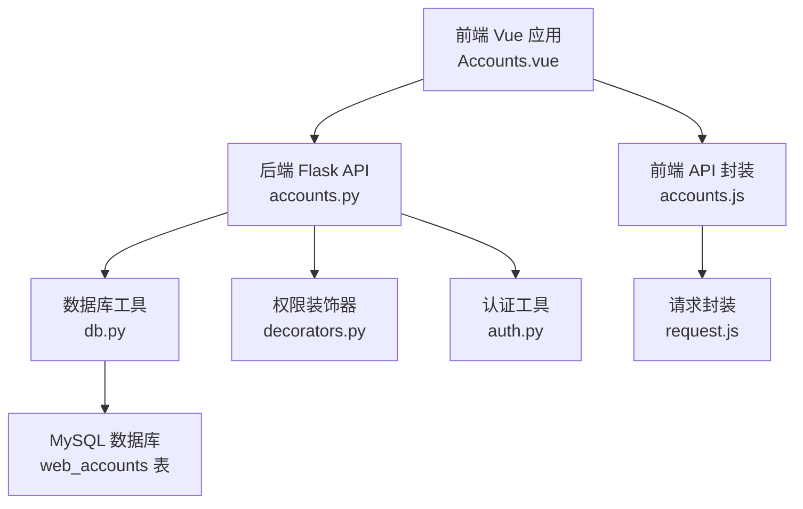
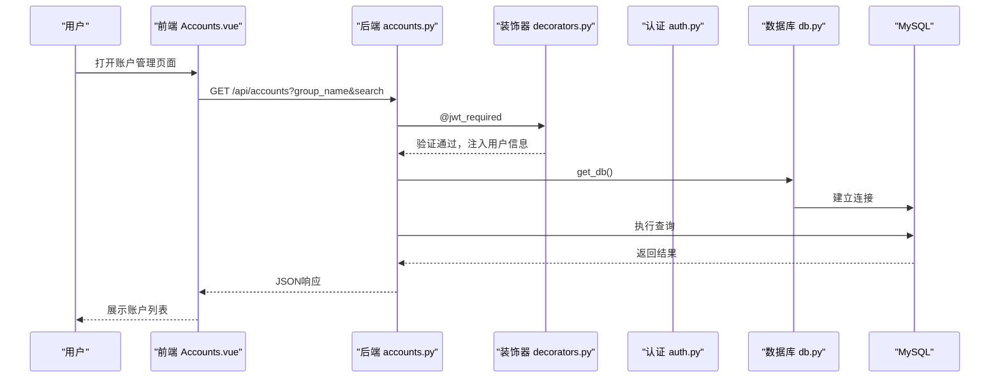
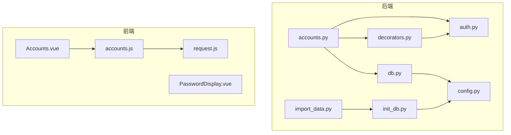

# Web账户表

<cite>
**本文档引用的文件**
- [backend/app/api/accounts.py](file://backend/app/api/accounts.py)
- [backend/app/utils/db.py](file://backend/app/utils/db.py)
- [backend/app/utils/auth.py](file://backend/app/utils/auth.py)
- [backend/app/utils/decorators.py](file://backend/app/utils/decorators.py)
- [backend/app/config.py](file://backend/app/config.py)
- [backend/init_db.py](file://backend/init_db.py)
- [backend/import_data.py](file://backend/import_data.py)
- [frontend/src/views/Accounts.vue](file://frontend/src/views/Accounts.vue)
- [frontend/src/api/accounts.js](file://frontend/src/api/accounts.js)
- [frontend/src/api/request.js](file://frontend/src/api/request.js)
- [frontend/src/components/PasswordDisplay.vue](file://frontend/src/components/PasswordDisplay.vue)
- [backend/app/api/auth.py](file://backend/app/api/auth.py)
</cite>

## 目录
1. [简介](#简介)
2. [项目结构](#项目结构)
3. [核心组件](#核心组件)
4. [架构总览](#架构总览)
5. [详细组件分析](#详细组件分析)
6. [依赖关系分析](#依赖关系分析)
7. [性能考虑](#性能考虑)
8. [故障排除指南](#故障排除指南)
9. [结论](#结论)
10. [附录](#附录)

## 简介
本文件为Web账户表的设计与实现文档，围绕web_accounts表的完整结构、字段定义、安全策略、权限控制、账户管理规范、密码更新流程、安全审计、访问日志与异常检测、以及与应用系统的关联关系与数据同步策略进行全面阐述。文档面向开发与运维人员，既提供技术细节也兼顾非技术读者的理解需求。

## 项目结构
该系统采用前后端分离架构：
- 后端基于Flask，提供REST API接口，负责业务逻辑与数据库交互。
- 前端基于Vue 3 + Element Plus，提供Web账户管理界面与交互。
- 数据库为MySQL，通过pymysql连接，初始化脚本创建web_accounts表及索引。

图表来源
- [backend/app/api/accounts.py:1-141](file://backend/app/api/accounts.py#L1-L141)
- [backend/app/utils/db.py:1-17](file://backend/app/utils/db.py#L1-L17)
- [backend/app/utils/decorators.py:1-95](file://backend/app/utils/decorators.py#L1-L95)
- [backend/app/utils/auth.py:1-83](file://backend/app/utils/auth.py#L1-L83)
- [backend/init_db.py:94-108](file://backend/init_db.py#L94-L108)
- [frontend/src/views/Accounts.vue:1-254](file://frontend/src/views/Accounts.vue#L1-L254)
- [frontend/src/api/accounts.js:1-18](file://frontend/src/api/accounts.js#L1-L18)
- [frontend/src/api/request.js:1-54](file://frontend/src/api/request.js#L1-L54)

章节来源
- [backend/app/api/accounts.py:1-141](file://backend/app/api/accounts.py#L1-L141)
- [backend/init_db.py:94-108](file://backend/init_db.py#L94-L108)
- [frontend/src/views/Accounts.vue:1-254](file://frontend/src/views/Accounts.vue#L1-L254)

## 核心组件
- web_accounts表：存储Web系统账户信息，包含分组、系统名称、访问地址、账号、密码、备注等字段，并带时间戳字段用于审计。
- 账户管理API：提供查询、创建、更新、删除Web账户的REST接口，配合JWT认证与角色权限控制。
- 前端账户管理界面：支持搜索、分组筛选、新增/编辑/删除操作，密码展示组件支持切换显示与复制。
- 数据库初始化与导入：初始化脚本创建web_accounts表及索引；导入脚本支持从Excel批量导入Web账户数据。

章节来源
- [backend/init_db.py:94-108](file://backend/init_db.py#L94-L108)
- [backend/app/api/accounts.py:11-141](file://backend/app/api/accounts.py#L11-L141)
- [frontend/src/views/Accounts.vue:1-254](file://frontend/src/views/Accounts.vue#L1-L254)

## 架构总览
Web账户管理的整体流程如下：
- 前端通过accounts.js调用后端API，请求携带JWT Bearer Token。
- 后端accounts.py路由根据请求执行相应操作，使用db.py建立数据库连接。
- 权限控制由decorators.py中的jwt_required与role_required装饰器保障。
- 密钥与配置由config.py提供，包括JWT密钥、数据库连接参数等。

图表来源
- [backend/app/api/accounts.py:11-43](file://backend/app/api/accounts.py#L11-L43)
- [backend/app/utils/decorators.py:9-56](file://backend/app/utils/decorators.py#L9-L56)
- [backend/app/utils/auth.py:38-56](file://backend/app/utils/auth.py#L38-L56)
- [backend/app/utils/db.py:5-17](file://backend/app/utils/db.py#L5-L17)

## 详细组件分析

### Web账户表结构设计
web_accounts表字段定义与约束：
- id：自增主键，唯一标识每条记录。
- group_name：分组名称，VARCHAR(100)，用于账户分组管理，建有索引以提升查询效率。
- name：系统名称，VARCHAR(200)，NOT NULL，用于标识具体系统或平台。
- url：访问地址，VARCHAR(500)，用于存储登录URL或相关链接。
- username：账号，VARCHAR(200)，存储用户名。
- password：密码，VARCHAR(200)，存储明文密码（见“安全策略”章节）。
- remark：备注，TEXT，用于补充说明。
- created_at：创建时间，默认当前时间。
- updated_at：更新时间，默认当前时间并自动更新。

索引与约束：
- idx_group_name：对group_name建立索引，便于按分组快速检索。
- 字段长度与字符集：采用utf8mb4，满足多语言与表情符号存储需求。

章节来源
- [backend/init_db.py:94-108](file://backend/init_db.py#L94-L108)

### 账户管理API与权限控制
- 查询账户：支持按分组与关键词搜索，返回JSON格式数据。
- 创建账户：需要JWT认证与角色权限（admin/operator），插入一条新记录。
- 更新账户：支持部分字段更新，仅更新传入的字段。
- 删除账户：需要JWT认证与角色权限，删除指定ID的记录。

权限控制策略：
- JWT认证：所有受保护接口均需Authorization: Bearer <token>。
- 角色权限：@role_required装饰器限制为admin或operator。
- 用户信息注入：通过装饰器将用户ID、用户名、角色注入到g对象，供后续逻辑使用。

章节来源
- [backend/app/api/accounts.py:11-141](file://backend/app/api/accounts.py#L11-L141)
- [backend/app/utils/decorators.py:9-95](file://backend/app/utils/decorators.py#L9-L95)

### 前端交互与界面规范
- 搜索与筛选：支持按分组与关键词（名称/地址/用户名）搜索。
- 表格展示：展示分组、名称、地址、用户名、密码、备注等字段。
- 密码展示组件：点击可切换明文/隐藏，支持复制密码到剪贴板。
- 新增/编辑弹窗：必填字段包括分组、名称、用户名，密码为必填项。
- 删除确认：二次确认对话框，防止误删。

章节来源
- [frontend/src/views/Accounts.vue:1-254](file://frontend/src/views/Accounts.vue#L1-L254)
- [frontend/src/components/PasswordDisplay.vue:1-85](file://frontend/src/components/PasswordDisplay.vue#L1-L85)

### 数据库连接与配置
- 数据库连接：通过get_db()从Flask配置读取DB_HOST、DB_PORT、DB_USER、DB_PASSWORD、DB_NAME等参数，使用pymysql建立连接。
- 配置项：JWT_SECRET_KEY、JWT_EXPIRATION_HOURS、DEBUG、HOST、PORT、UPLOAD_FOLDER、MAX_CONTENT_LENGTH等。

章节来源
- [backend/app/utils/db.py:1-17](file://backend/app/utils/db.py#L1-L17)
- [backend/app/config.py:1-21](file://backend/app/config.py#L1-L21)

### 密码存储安全策略
现状与建议：
- 现状：web_accounts表的password字段存储明文密码，未进行加密处理。
- 安全建议：
  - 加密算法：采用高强度哈希算法（如bcrypt、scrypt或Argon2）对密码进行加盐哈希存储。
  - 密钥管理：使用密钥管理系统（KMS）或环境变量管理密钥，避免硬编码在代码中。
  - 传输安全：确保API通信使用HTTPS，防止中间人攻击。
  - 最小暴露：前端仅在必要时短暂显示明文，且提供复制后立即隐藏的机制。
  - 审计日志：记录密码变更、访问尝试等关键事件，便于审计与追踪。

章节来源
- [backend/init_db.py:94-108](file://backend/init_db.py#L94-L108)
- [frontend/src/components/PasswordDisplay.vue:25-45](file://frontend/src/components/PasswordDisplay.vue#L25-L45)

### 账户分组管理机制
- 分组字段：group_name用于账户分组，支持按分组筛选与排序。
- 前端分组列表：从查询结果中提取唯一分组值，动态填充下拉框。
- 导入分组：导入脚本支持从Excel中识别分组行（仅第一列有值），后续账户继承该分组。

章节来源
- [frontend/src/views/Accounts.vue:167-168](file://frontend/src/views/Accounts.vue#L167-L168)
- [backend/import_data.py:83-111](file://backend/import_data.py#L83-L111)

### 账户信息管理规范
- 字段完整性：必填字段为group_name、name、username；url与remark为可选。
- 数据校验：前端对必填字段进行校验，后端接口接受JSON数据并按字段更新。
- 操作规范：仅授权用户可进行创建、更新、删除操作；查询支持模糊匹配关键词。

章节来源
- [frontend/src/views/Accounts.vue:151-155](file://frontend/src/views/Accounts.vue#L151-L155)
- [backend/app/api/accounts.py:56-62](file://backend/app/api/accounts.py#L56-L62)

### 密码更新流程
- 当前实现：后端直接更新password字段为传入值，未进行哈希处理。
- 推荐流程：
  - 前端提交新密码，后端先验证旧密码（若需要）。
  - 对新密码进行加盐哈希处理后再写入数据库。
  - 记录密码变更审计日志，包含操作人、时间、账户信息等。

章节来源
- [backend/app/api/accounts.py:89-100](file://backend/app/api/accounts.py#L89-L100)
- [backend/app/api/auth.py:118-184](file://backend/app/api/auth.py#L118-L184)

### 安全审计要求
- 审计范围：密码变更、账户创建/更新/删除、登录尝试等。
- 审计内容：操作人、操作时间、操作类型、受影响的账户、IP地址、User-Agent等。
- 存储与保留：审计日志建议单独表存储，设置合理的保留周期与归档策略。
- 报警机制：对异常登录（如短时间内多次失败）、高权限操作等触发告警。

章节来源
- [backend/app/api/auth.py:14-82](file://backend/app/api/auth.py#L14-L82)

### 访问日志记录与异常登录检测
- 访问日志：建议在登录接口与敏感操作接口记录访问日志，包含用户、时间、IP、结果等。
- 异常检测：基于IP、用户、时间段统计失败次数，超过阈值触发临时锁定或二次验证。
- 账户锁定：对连续失败达到阈值的账户进行临时锁定，解锁需管理员干预或超时自动解除。

章节来源
- [backend/app/api/auth.py:14-82](file://backend/app/api/auth.py#L14-L82)

### 与应用系统的关联关系与数据同步策略
- 关联关系：web_accounts与app_systems表存在潜在关联（两者均包含账号、密码字段），可用于统一管理不同类型的系统账户。
- 数据同步策略：
  - 批量导入：通过import_data.py从Excel导入web_accounts数据，支持分组识别与去重。
  - 实时同步：建议通过ETL或消息队列实现应用系统台账与Web账户的双向同步，保持一致性。
  - 变更通知：对web_accounts的变更推送至相关应用系统，确保登录信息及时更新。

章节来源
- [backend/import_data.py:83-111](file://backend/import_data.py#L83-L111)
- [backend/init_db.py:110-129](file://backend/init_db.py#L110-L129)

## 依赖关系分析

图表来源
- [backend/app/api/accounts.py:1-141](file://backend/app/api/accounts.py#L1-L141)
- [backend/app/utils/db.py:1-17](file://backend/app/utils/db.py#L1-L17)
- [backend/app/utils/decorators.py:1-95](file://backend/app/utils/decorators.py#L1-L95)
- [backend/app/utils/auth.py:1-83](file://backend/app/utils/auth.py#L1-L83)
- [backend/app/config.py:1-21](file://backend/app/config.py#L1-L21)
- [backend/init_db.py:1-230](file://backend/init_db.py#L1-L230)
- [backend/import_data.py:1-371](file://backend/import_data.py#L1-L371)
- [frontend/src/views/Accounts.vue:1-254](file://frontend/src/views/Accounts.vue#L1-L254)
- [frontend/src/api/accounts.js:1-18](file://frontend/src/api/accounts.js#L1-L18)
- [frontend/src/api/request.js:1-54](file://frontend/src/api/request.js#L1-L54)
- [frontend/src/components/PasswordDisplay.vue:1-85](file://frontend/src/components/PasswordDisplay.vue#L1-L85)

## 性能考虑
- 查询优化：对group_name建立索引，支持按分组快速检索；LIKE模糊查询在大表上需谨慎使用，建议结合全文索引或搜索引擎。
- 连接池：建议引入连接池管理数据库连接，减少频繁建立/关闭连接的开销。
- 缓存策略：对常用分组列表与热点查询结果进行缓存，降低数据库压力。
- 前端渲染：大数据量时采用分页或虚拟滚动，避免一次性渲染过多DOM节点。

## 故障排除指南
- 认证失败：检查Authorization头格式是否为Bearer token，确认JWT_SECRET_KEY配置正确，Token是否过期。
- 权限不足：确认用户角色是否包含admin或operator，装饰器会返回403。
- 数据库连接问题：检查DB_HOST、DB_PORT、DB_USER、DB_PASSWORD、DB_NAME配置，确认MySQL服务可用。
- 密码显示异常：前端PasswordDisplay组件支持点击切换与复制，若复制失败可使用降级方案。
- 导入失败：检查Excel格式与列顺序，确保分组行与账户行格式正确。

章节来源
- [backend/app/utils/decorators.py:20-56](file://backend/app/utils/decorators.py#L20-L56)
- [backend/app/utils/auth.py:38-56](file://backend/app/utils/auth.py#L38-L56)
- [backend/app/utils/db.py:5-17](file://backend/app/utils/db.py#L5-L17)
- [frontend/src/components/PasswordDisplay.vue:29-45](file://frontend/src/components/PasswordDisplay.vue#L29-L45)
- [backend/import_data.py:83-111](file://backend/import_data.py#L83-L111)

## 结论
web_accounts表为Web账户集中管理提供了基础能力，当前实现支持基本的CRUD操作与权限控制。为满足生产环境的安全性与合规性要求，建议对密码存储进行加密处理、完善审计与异常检测机制、并建立与应用系统的数据同步策略。通过以上改进，可显著提升系统的安全性与可维护性。

## 附录
- API接口定义（基于现有实现）
  - GET /api/accounts：查询Web账户，支持group_name与search参数。
  - POST /api/accounts：创建Web账户，需要JWT与角色权限。
  - PUT /api/accounts/<int:account_id>：更新Web账户，需要JWT与角色权限。
  - DELETE /api/accounts/<int:account_id>：删除Web账户，需要JWT与角色权限。

章节来源
- [backend/app/api/accounts.py:11-141](file://backend/app/api/accounts.py#L11-L141)