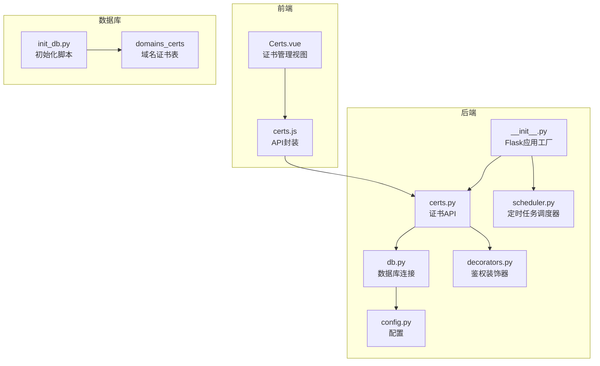
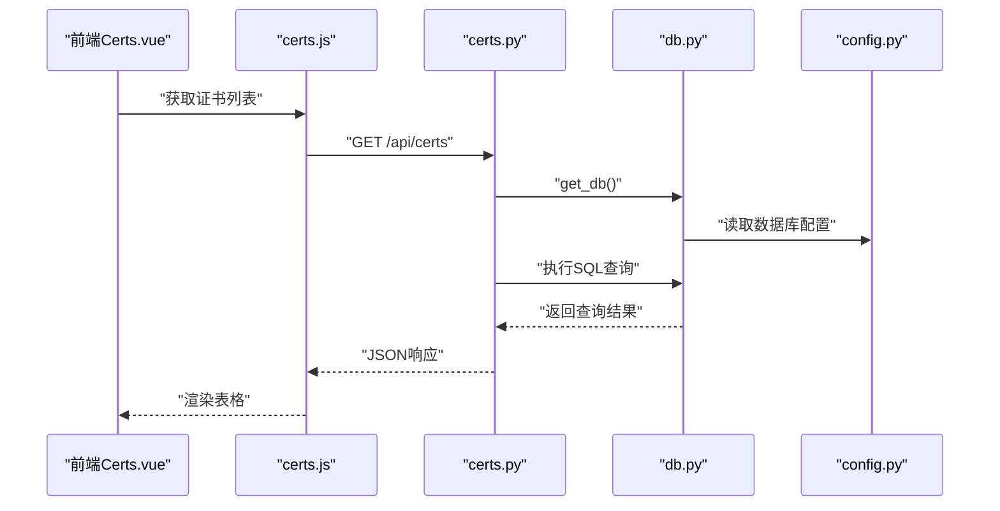
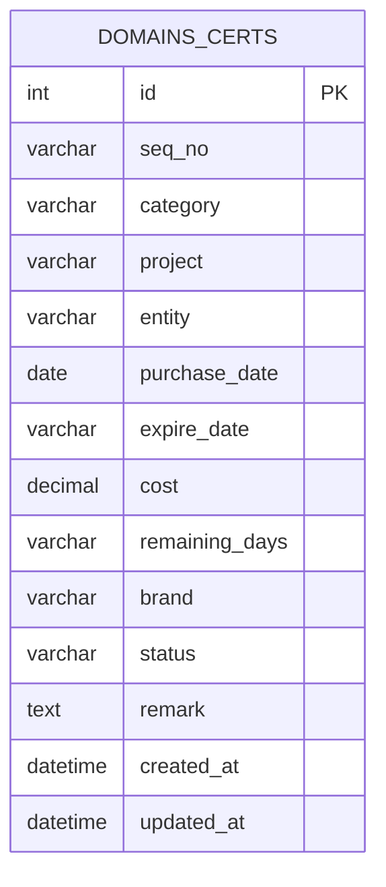
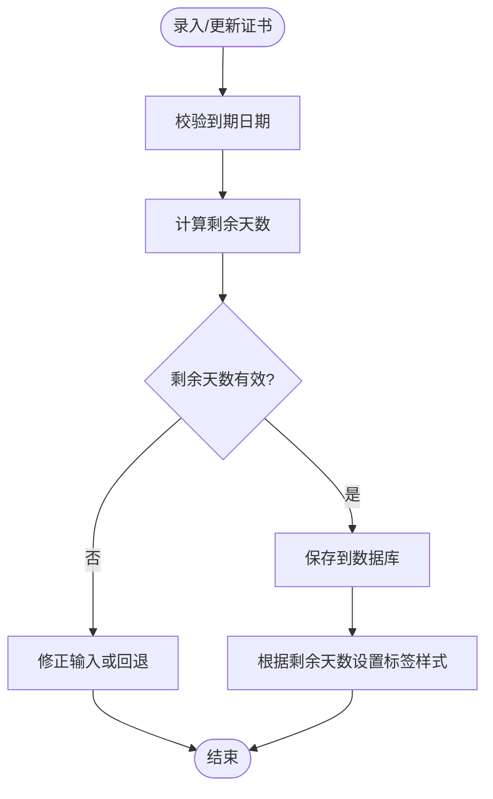
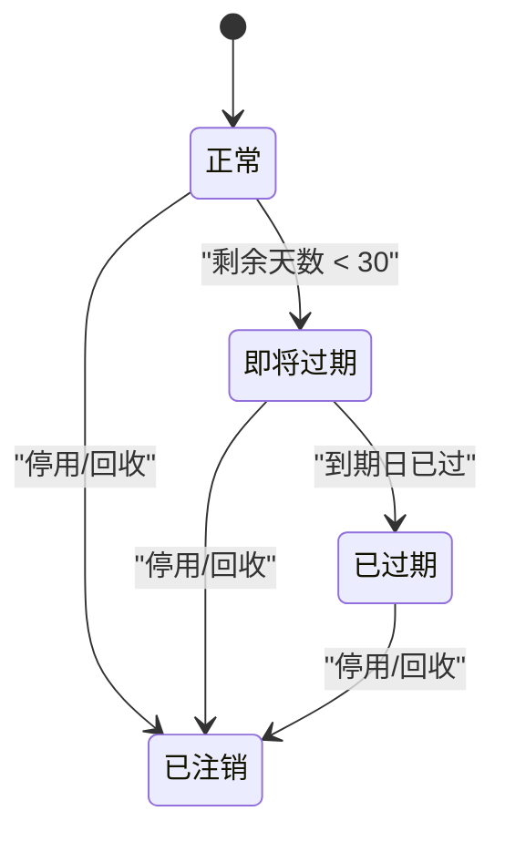
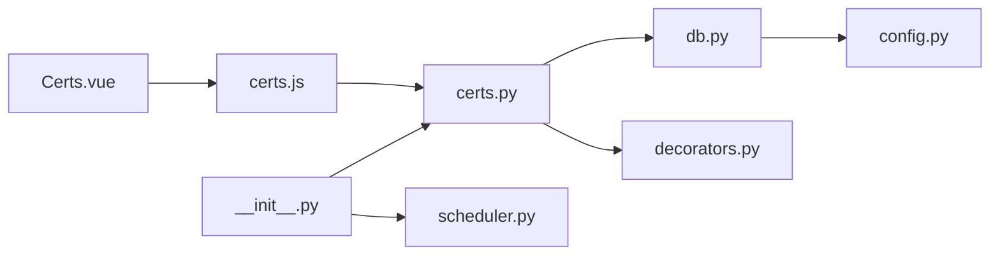

# 域名证书表

<cite>
**本文引用的文件**
- [backend/app/api/certs.py](file://backend/app/api/certs.py)
- [backend/init_db.py](file://backend/init_db.py)
- [frontend/src/views/Certs.vue](file://frontend/src/views/Certs.vue)
- [frontend/src/api/certs.js](file://frontend/src/api/certs.js)
- [backend/app/utils/db.py](file://backend/app/utils/db.py)
- [backend/app/config.py](file://backend/app/config.py)
- [backend/app/__init__.py](file://backend/app/__init__.py)
- [backend/app/utils/scheduler.py](file://backend/app/utils/scheduler.py)
- [backend/app/utils/decorators.py](file://backend/app/utils/decorators.py)
</cite>

## 目录
1. [简介](#简介)
2. [项目结构](#项目结构)
3. [核心组件](#核心组件)
4. [架构总览](#架构总览)
5. [详细组件分析](#详细组件分析)
6. [依赖分析](#依赖分析)
7. [性能考虑](#性能考虑)
8. [故障排查指南](#故障排查指南)
9. [结论](#结论)
10. [附录](#附录)

## 简介
本设计文档围绕“域名证书表”（domains_certs）展开，系统性说明其表结构、字段语义与约束、业务分类体系、时间管理机制、费用成本精度控制、状态字段及流转规则，并给出证书生命周期管理、自动提醒与续费策略建议，以及与服务器与应用系统的关联关系。文档同时结合后端 API、前端界面与数据库初始化脚本，提供可落地的实现与扩展指导。

## 项目结构
- 后端采用 Flask 架构，通过蓝图组织 API；数据库连接通过工具模块统一管理；定时任务调度器负责周期性任务。
- 前端基于 Vue 3 + Element Plus，提供证书管理页面与交互逻辑。
- 数据库初始化脚本集中定义了 domains_certs 表结构及索引。

图表来源
- [backend/app/__init__.py:37-60](file://backend/app/__init__.py#L37-L60)
- [backend/app/api/certs.py:1-145](file://backend/app/api/certs.py#L1-L145)
- [backend/app/utils/db.py:1-17](file://backend/app/utils/db.py#L1-L17)
- [backend/app/config.py:1-21](file://backend/app/config.py#L1-L21)
- [backend/app/utils/decorators.py:1-95](file://backend/app/utils/decorators.py#L1-L95)
- [backend/app/utils/scheduler.py:1-249](file://backend/app/utils/scheduler.py#L1-L249)
- [backend/init_db.py:111-131](file://backend/init_db.py#L111-L131)

章节来源
- [backend/app/__init__.py:37-60](file://backend/app/__init__.py#L37-L60)
- [backend/init_db.py:111-131](file://backend/init_db.py#L111-L131)

## 核心组件
- 表结构与字段
  - 主键：id（自增）
  - 关键字段：seq_no、category、project、entity、purchase_date、expire_date、cost、remaining_days、brand、status、remark
  - 时间戳：created_at、updated_at
  - 索引：category、status
- API 能力
  - 列表查询（支持按分类与关键词过滤）
  - 新增、更新、删除
- 前端能力
  - 分类筛选（公众平台/域名/SSL证书）
  - 表单校验与提交
  - 状态标签样式区分
- 定时任务
  - 提供调度器框架，可用于实现证书到期提醒与续费策略自动化

章节来源
- [backend/init_db.py:111-131](file://backend/init_db.py#L111-L131)
- [backend/app/api/certs.py:11-145](file://backend/app/api/certs.py#L11-L145)
- [frontend/src/views/Certs.vue:1-336](file://frontend/src/views/Certs.vue#L1-L336)

## 架构总览
后端通过 Flask 蓝图暴露证书管理接口，前端通过封装的 API 进行调用。数据库连接由工具模块统一提供，配置来自应用配置对象。认证层使用 JWT 装饰器进行鉴权与角色校验。定时任务调度器提供后台自动化能力。

图表来源
- [frontend/src/views/Certs.vue:214-222](file://frontend/src/views/Certs.vue#L214-L222)
- [frontend/src/api/certs.js:3-5](file://frontend/src/api/certs.js#L3-L5)
- [backend/app/api/certs.py:11-44](file://backend/app/api/certs.py#L11-L44)
- [backend/app/utils/db.py:5-17](file://backend/app/utils/db.py#L5-L17)
- [backend/app/config.py:9-13](file://backend/app/config.py#L9-L13)

## 详细组件分析

### 表结构与字段语义
- 字段说明
  - id：主键
  - seq_no：序号（字符串）
  - category：类别，取值范围为“公众平台/域名/SSL证书”
  - project：项目/子类（字符串）
  - entity：主体（如域名），示例值见前端输入
  - purchase_date：购买时间（DATE）
  - expire_date：到期时间（VARCHAR，建议改为 DATE 以提升一致性）
  - cost：费用（DECIMAL(10,2)，单位元）
  - remaining_days：剩余天数（VARCHAR，建议改为 INT 以利于排序与计算）
  - brand：品牌（字符串）
  - status：状态（字符串，枚举值：正常/即将过期/已过期/已注销）
  - remark：备注（文本）
  - created_at、updated_at：时间戳
- 索引
  - idx_category、idx_status：加速按分类与状态查询

图表来源
- [backend/init_db.py:111-131](file://backend/init_db.py#L111-L131)

章节来源
- [backend/init_db.py:111-131](file://backend/init_db.py#L111-L131)

### 类别字段分类体系
- 取值范围
  - 公众平台
  - 域名
  - SSL证书
- 前端展示与筛选
  - 下拉选项包含上述三类
  - 表格列以标签形式展示分类

章节来源
- [frontend/src/views/Certs.vue:6-12](file://frontend/src/views/Certs.vue#L6-L12)
- [frontend/src/views/Certs.vue:36-39](file://frontend/src/views/Certs.vue#L36-L39)

### 时间管理机制
- 字段
  - purchase_date：购买日期（DATE）
  - expire_date：到期日期（VARCHAR，建议改为 DATE）
  - remaining_days：剩余天数（VARCHAR，建议改为 INT）
- 计算与展示
  - 前端提供到期日期选择器，支持自动计算或手动输入剩余天数
  - 表格列“剩余天数”以标签颜色区分风险等级（危险/警告/正常）

图表来源
- [frontend/src/views/Certs.vue:107-138](file://frontend/src/views/Certs.vue#L107-L138)
- [frontend/src/views/Certs.vue:305-310](file://frontend/src/views/Certs.vue#L305-L310)

章节来源
- [frontend/src/views/Certs.vue:107-138](file://frontend/src/views/Certs.vue#L107-L138)
- [frontend/src/views/Certs.vue:305-310](file://frontend/src/views/Certs.vue#L305-L310)

### 费用成本精度控制
- 数据类型：DECIMAL(10,2)
- 精度：小数点后两位（元）
- 前端输入控件支持精度设置，避免超界

章节来源
- [backend/init_db.py:121](file://backend/init_db.py#L121)
- [frontend/src/views/Certs.vue:131-133](file://frontend/src/views/Certs.vue#L131-L133)

### 状态字段与流转规则
- 状态枚举
  - 正常
  - 即将过期
  - 已过期
  - 已注销
- 前端展示
  - 不同状态对应不同标签颜色
- 建议的状态流转
  - 从“正常”到“即将过期”：当剩余天数低于阈值（例如小于30天）时自动或人工标记
  - 从“即将过期”到“已过期”：到期日过后自动或人工标记
  - 注销：证书停用或回收时标记为“已注销”

图表来源
- [frontend/src/views/Certs.vue:148-155](file://frontend/src/views/Certs.vue#L148-L155)
- [frontend/src/views/Certs.vue:312-320](file://frontend/src/views/Certs.vue#L312-L320)

章节来源
- [frontend/src/views/Certs.vue:148-155](file://frontend/src/views/Certs.vue#L148-L155)
- [frontend/src/views/Certs.vue:312-320](file://frontend/src/views/Certs.vue#L312-L320)

### 生命周期管理与自动提醒
- 生命周期阶段
  - 采购：录入购买日期、到期日期、费用、品牌等
  - 使用：监控剩余天数与状态
  - 续费：临近到期前发起续费流程
  - 注销：停用或回收
- 自动提醒与续费策略
  - 建议使用定时任务调度器定期扫描到期前30天、7天、1天的证书，生成提醒任务或邮件通知
  - 可扩展续费流程：对接第三方证书平台或内部审批流

章节来源
- [backend/app/utils/scheduler.py:1-249](file://backend/app/utils/scheduler.py#L1-L249)

### 与服务器和应用系统的关联
- 服务器台账：证书通常绑定到服务器或域名解析目标
- 应用系统：证书用于应用系统对外提供 HTTPS 服务
- 建议
  - 在证书表中增加与服务器/应用系统的关联字段（如 server_id、app_system_id），便于资产盘点与影响评估
  - 结合服务清单表（services）与服务器表（servers）进行联动展示与审计

章节来源
- [backend/init_db.py:49-92](file://backend/init_db.py#L49-L92)

### 域名解析配置与SSL证书部署
- 域名解析
  - 证书主体（entity）应与域名解析一致
  - 建议在证书表中补充“DNS解析状态”字段，便于跟踪解析有效性
- SSL证书部署
  - 部署到目标服务器或CDN，确保与证书主体匹配
  - 建议补充“部署状态”字段，记录部署时间与服务器标识

章节来源
- [frontend/src/views/Certs.vue:100-102](file://frontend/src/views/Certs.vue#L100-L102)

### 安全扫描要求
- 建议对到期前90天内的证书进行安全扫描，识别弱密钥、过期风险与配置问题
- 扫描结果可作为“状态”的辅助指标，例如“存在风险”

章节来源
- [frontend/src/views/Certs.vue:307-309](file://frontend/src/views/Certs.vue#L307-L309)

## 依赖分析
- 后端依赖
  - Flask 蓝图注册于应用工厂
  - 数据库连接通过工具模块统一获取
  - 配置来自应用配置对象
  - 鉴权装饰器用于保护 API
- 前端依赖
  - 通过封装的 API 模块调用后端接口
  - Element Plus 组件库提供表单与表格能力

图表来源
- [frontend/src/views/Certs.vue:174](file://frontend/src/views/Certs.vue#L174)
- [frontend/src/api/certs.js:1-18](file://frontend/src/api/certs.js#L1-L18)
- [backend/app/api/certs.py:1-145](file://backend/app/api/certs.py#L1-L145)
- [backend/app/utils/db.py:1-17](file://backend/app/utils/db.py#L1-L17)
- [backend/app/config.py:1-21](file://backend/app/config.py#L1-L21)
- [backend/app/utils/decorators.py:1-95](file://backend/app/utils/decorators.py#L1-L95)
- [backend/app/__init__.py:37-60](file://backend/app/__init__.py#L37-L60)
- [backend/app/utils/scheduler.py:1-249](file://backend/app/utils/scheduler.py#L1-L249)

章节来源
- [backend/app/__init__.py:37-60](file://backend/app/__init__.py#L37-L60)
- [backend/app/api/certs.py:1-145](file://backend/app/api/certs.py#L1-L145)
- [frontend/src/api/certs.js:1-18](file://frontend/src/api/certs.js#L1-L18)

## 性能考虑
- 查询优化
  - 对 category 与 status 建立索引，提升筛选效率
  - 列表查询支持关键词模糊匹配，建议限制搜索长度与频率
- 写入优化
  - 批量导入时合并事务，减少往返开销
- 展示优化
  - 剩余天数与状态标签样式在前端计算，降低后端负担

章节来源
- [backend/init_db.py:128-129](file://backend/init_db.py#L128-L129)
- [backend/app/api/certs.py:20-32](file://backend/app/api/certs.py#L20-L32)

## 故障排查指南
- 认证与权限
  - 缺少认证头或 Token 格式不正确会导致 401
  - 角色不在允许范围内会导致 403
- 数据库连接
  - 检查数据库配置项（主机、端口、账号、密码、库名）
  - 确认字符集与游标类型配置一致
- 接口异常
  - 新增/更新失败会回滚并返回错误信息
  - 检查必填字段与数据类型（如日期、数值）

章节来源
- [backend/app/utils/decorators.py:20-56](file://backend/app/utils/decorators.py#L20-L56)
- [backend/app/utils/decorators.py:73-94](file://backend/app/utils/decorators.py#L73-L94)
- [backend/app/utils/db.py:5-17](file://backend/app/utils/db.py#L5-L17)
- [backend/app/config.py:9-13](file://backend/app/config.py#L9-L13)
- [backend/app/api/certs.py:72-77](file://backend/app/api/certs.py#L72-L77)
- [backend/app/api/certs.py:109-114](file://backend/app/api/certs.py#L109-L114)

## 结论
domains_certs 表提供了证书资产管理的基础能力，结合前端交互与后端 API，能够满足证书的全生命周期管理需求。建议在现有基础上完善字段类型与索引、引入自动提醒与续费策略、增强与服务器/应用系统的关联关系，并持续优化查询与写入性能，以支撑更大规模的证书管理场景。

## 附录
- API 路由与权限
  - GET /api/certs：查询证书列表（支持分类与关键词过滤）
  - POST /api/certs：创建证书（需管理员/运营角色）
  - PUT /api/certs/<id>：更新证书（需管理员/运营角色）
  - DELETE /api/certs/<id>：删除证书（需管理员/运营角色）
- 前端交互要点
  - 分类下拉与状态标签样式
  - 日期选择器与费用精度控制
  - 响应式表格与空状态处理

章节来源
- [backend/app/api/certs.py:11-145](file://backend/app/api/certs.py#L11-L145)
- [frontend/src/views/Certs.vue:174-294](file://frontend/src/views/Certs.vue#L174-L294)