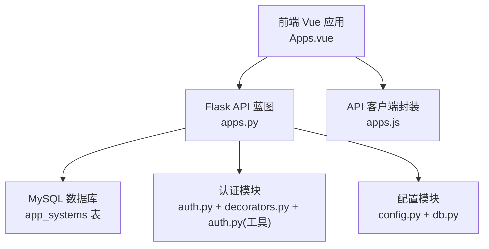
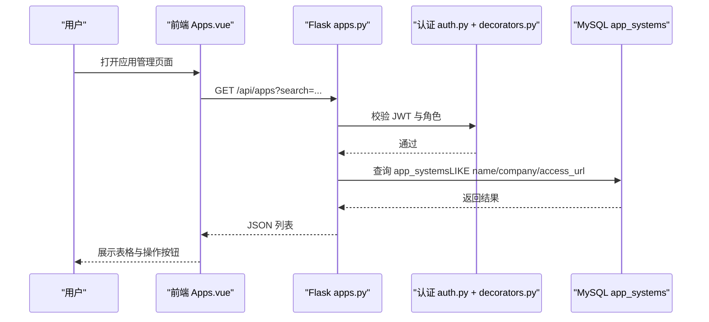
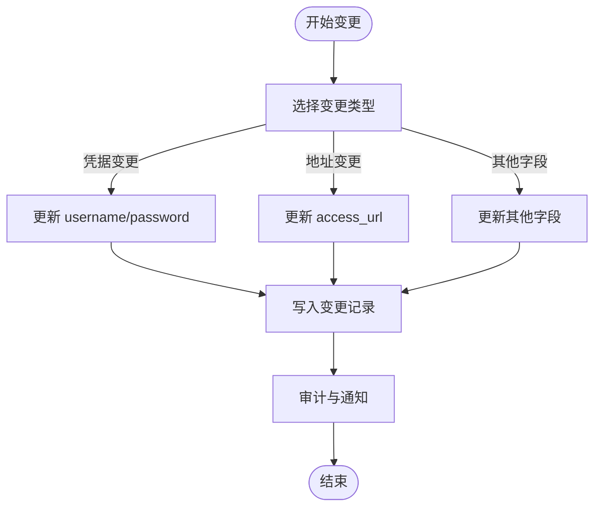
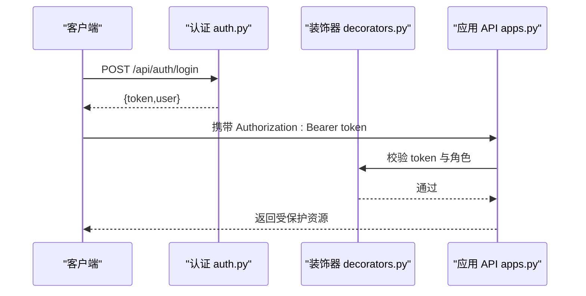
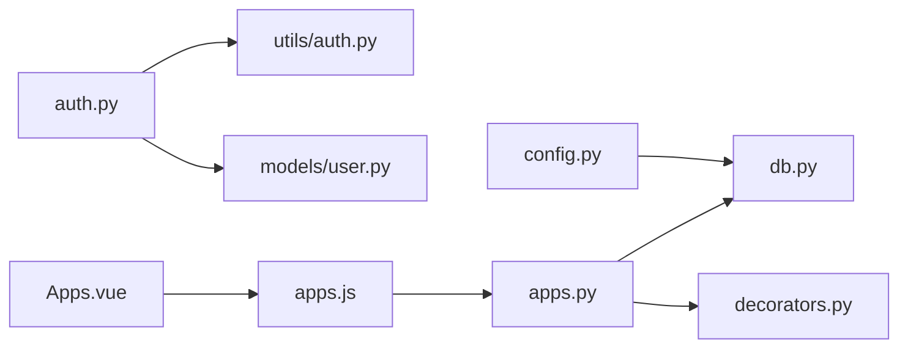

# 应用系统台账表

<cite>
**本文引用的文件**
- [init_db.py](file://backend/init_db.py)
- [apps.py](file://backend/app/api/apps.py)
- [apps.js](file://frontend/src/api/apps.js)
- [Apps.vue](file://frontend/src/views/Apps.vue)
- [auth.py](file://backend/app/api/auth.py)
- [decorators.py](file://backend/app/utils/decorators.py)
- [auth.py（工具）](file://backend/app/utils/auth.py)
- [db.py](file://backend/app/utils/db.py)
- [config.py](file://backend/app/config.py)
- [records.py](file://backend/app/api/records.py)
</cite>

## 目录
1. [简介](#简介)
2. [项目结构](#项目结构)
3. [核心组件](#核心组件)
4. [架构总览](#架构总览)
5. [详细组件分析](#详细组件分析)
6. [依赖分析](#依赖分析)
7. [性能考虑](#性能考虑)
8. [故障排查指南](#故障排查指南)
9. [结论](#结论)
10. [附录](#附录)

## 简介
本设计文档围绕“应用系统台账表”展开，系统化阐述 app_systems 表的结构、字段语义、索引与约束、API 接口、前端展示、统一身份认证集成、生命周期与版本变更记录，以及与 Web 账户的关系。特别地，本文将深入解释 name 字段的唯一性约束与索引优化策略，并给出扩展字段 extra1、extra2 的设计建议与使用场景。

## 项目结构
应用系统台账功能由后端 Flask API、数据库初始化脚本、前端 Vue 组件与 Element Plus UI 组成，整体采用前后端分离架构，通过 JWT 进行统一身份认证。

图表来源
- [apps.py:1-139](file://backend/app/api/apps.py#L1-L139)
- [Apps.vue:1-227](file://frontend/src/views/Apps.vue#L1-L227)
- [apps.js:1-18](file://frontend/src/api/apps.js#L1-L18)
- [auth.py:1-184](file://backend/app/api/auth.py#L1-L184)
- [decorators.py:1-95](file://backend/app/utils/decorators.py#L1-L95)
- [auth.py（工具）:1-83](file://backend/app/utils/auth.py#L1-L83)
- [db.py:1-17](file://backend/app/utils/db.py#L1-L17)
- [config.py:1-21](file://backend/app/config.py#L1-L21)

章节来源
- [apps.py:1-139](file://backend/app/api/apps.py#L1-L139)
- [Apps.vue:1-227](file://frontend/src/views/Apps.vue#L1-L227)
- [apps.js:1-18](file://frontend/src/api/apps.js#L1-L18)
- [auth.py:1-184](file://backend/app/api/auth.py#L1-L184)
- [decorators.py:1-95](file://backend/app/utils/decorators.py#L1-L95)
- [auth.py（工具）:1-83](file://backend/app/utils/auth.py#L1-L83)
- [db.py:1-17](file://backend/app/utils/db.py#L1-L17)
- [config.py:1-21](file://backend/app/config.py#L1-L21)

## 核心组件
- app_systems 表：存储应用系统基本信息与登录凭据，支持按名称、单位、访问地址检索。
- 应用系统 API：提供分页与搜索、创建、更新、删除能力；受 JWT 与角色权限保护。
- 前端应用：提供搜索、新增、编辑、删除与密码安全展示。
- 统一身份认证：基于 JWT 的登录、令牌校验与权限装饰器。
- 变更记录：change_records 表用于记录运维变更，支撑版本跟踪与审计。

章节来源
- [init_db.py:94-109](file://backend/init_db.py#L94-L109)
- [apps.py:11-139](file://backend/app/api/apps.py#L11-L139)
- [Apps.vue:1-227](file://frontend/src/views/Apps.vue#L1-L227)
- [auth.py:14-184](file://backend/app/api/auth.py#L14-L184)
- [decorators.py:9-95](file://backend/app/utils/decorators.py#L9-L95)
- [records.py:20-114](file://backend/app/api/records.py#L20-L114)

## 架构总览
应用系统台账的端到端流程如下：

图表来源
- [apps.py:11-40](file://backend/app/api/apps.py#L11-L40)
- [auth.py:14-82](file://backend/app/api/auth.py#L14-L82)
- [decorators.py:9-56](file://backend/app/utils/decorators.py#L9-L56)
- [Apps.vue:138-150](file://frontend/src/views/Apps.vue#L138-L150)

## 详细组件分析

### 数据表结构：app_systems
- 主键：id（自增）
- 关键字段与约束：
  - seq_no：编号（VARCHAR(50)，可空）
  - name：应用名称（VARCHAR(200)，NOT NULL，见下节唯一性说明）
  - company：所属单位（VARCHAR(200)，可空）
  - access_url：访问地址（VARCHAR(500)，可空）
  - username：用户名（VARCHAR(100)，可空）
  - password：密码（VARCHAR(200)，可空）
  - remark：备注（TEXT，可空）
  - created_at、updated_at：自动时间戳
- 索引：
  - idx_name：对 name 字段建立普通索引，用于精确匹配与排序（见“名称唯一性与索引优化”）

章节来源
- [init_db.py:94-109](file://backend/init_db.py#L94-L109)

### 名称字段的唯一性约束与索引优化
- 当前实现：
  - 表结构中 name 字段为非唯一，仅建立了普通索引 idx_name。
  - API 层未对 name 做唯一性校验，插入时不会阻断重复名称。
- 建议增强方案（可选）：
  - 在数据库层面增加唯一性约束（UNIQUE），以确保业务一致性。
  - 若保留非唯一策略，则应在应用层（API）在创建/更新时进行去重校验，避免重复名称带来的检索歧义。
- 索引优化建议：
  - idx_name 已存在，适合 LIKE 模糊匹配与 ORDER BY id 场景。
  - 如需频繁按 name 精确查找，可在 name 上建立唯一索引或唯一约束，同时保持现有 idx_name 以兼顾模糊查询。
  - 对高频组合查询（如 name+company）可考虑复合索引，但需评估写入成本与实际查询模式。

章节来源
- [init_db.py:94-109](file://backend/init_db.py#L94-L109)
- [apps.py:42-76](file://backend/app/api/apps.py#L42-L76)

### 基本信息字段说明
- 编号 seq_no：便于内部编号与归档。
- 应用名称 name：应用系统标识，建议配合唯一性约束使用。
- 所属单位 company：归属部门或单位，支持检索。
- 访问地址 access_url：系统对外访问链接，前端会识别 http/https 并作为超链接展示。
- 登录信息 username/password：系统登录凭据，前端以密码域展示并支持隐藏。
- 备注 remark：补充说明。

章节来源
- [init_db.py:94-109](file://backend/init_db.py#L94-L109)
- [Apps.vue:28-51](file://frontend/src/views/Apps.vue#L28-L51)
- [apps.py:42-76](file://backend/app/api/apps.py#L42-L76)

### 扩展字段 extra1、extra2 设计建议
- 设计目的：
  - 为未来扩展提供灵活空间，避免频繁修改表结构。
  - 存放临时或非标准化的元数据，如“架构类型”、“访问方式”、“分类标签”等。
- 使用场景：
  - extra1：如“架构类型”，用于区分微服务、单体应用、混合架构等。
  - extra2：如“访问方式”，用于区分 Web、API、桌面客户端等。
- 建议：
  - 在数据库层面保留 extra1、extra2 字段（VARCHAR/JSON），并在应用层定义清晰的枚举与校验规则。
  - 前端提供专门的字段输入与校验，确保数据质量。
  - 与变更记录联动，记录每次扩展字段的变更内容。

章节来源
- [init_db.py:94-109](file://backend/init_db.py#L94-L109)
- [records.py:20-114](file://backend/app/api/records.py#L20-L114)

### 应用系统分类标准、架构类型枚举与访问方式规范
- 分类标准（建议）：
  - 按业务域：研发管理、生产运营、测试支撑、数据分析等。
  - 按技术栈：Java/Spring、Python/Django、.NET、Node.js 等。
  - 按部署形态：容器化、虚拟机、裸金属、云原生等。
- 架构类型枚举（建议）：
  - 单体架构（Monolithic）
  - 微服务（Microservices）
  - 事件驱动（Event-driven）
  - 无服务器（Serverless）
- 访问方式规范（建议）：
  - Web：浏览器访问，需记录 URL 与 Cookie/SSO 集成方式。
  - API：REST/GraphQL，需记录鉴权方式（Token/Bearer）。
  - 桌面客户端：需记录安装包与版本。
  - 移动端：需记录 App 名称与版本。
- 建议将上述枚举固化为前端下拉选项与后端校验规则，并纳入 extra1/extra2 的取值范围。

章节来源
- [apps.py:11-40](file://backend/app/api/apps.py#L11-L40)
- [Apps.vue:68-91](file://frontend/src/views/Apps.vue#L68-L91)

### 生命周期管理、版本跟踪与变更记录
- 生命周期管理：
  - 新建：创建应用系统台账，填写基本信息与登录凭据。
  - 运行：定期巡检访问地址可用性、凭据有效性。
  - 变更：通过变更记录表记录每次重要修改（字段、URL、凭据等）。
  - 下线：清理凭据、停用访问、归档记录。
- 版本跟踪：
  - 建议在变更记录中记录“版本号”字段，结合时间戳形成版本历史。
  - 对关键字段（如 access_url、username、password）变更应强制记录。
- 变更记录表（change_records）：
  - 字段：seq_no、change_date、modifier、location、content、remark。
  - 查询：支持按修改人、地点、内容模糊检索，按日期倒序排列。
  - 权限：受 JWT 与角色控制，仅管理员与运维可创建/删除。

图表来源
- [records.py:20-114](file://backend/app/api/records.py#L20-L114)
- [apps.py:78-112](file://backend/app/api/apps.py#L78-L112)

章节来源
- [records.py:20-114](file://backend/app/api/records.py#L20-L114)
- [apps.py:78-112](file://backend/app/api/apps.py#L78-L112)

### 与 Web 账户的关联关系与统一身份认证集成
- 关联关系：
  - app_systems 与 users 之间无直接外键关联；可通过业务约定（如“责任人”字段）间接关联。
  - 建议在 app_systems 中增加“维护人/责任人”字段，指向 users.id，形成明确的主外键关系。
- 统一身份认证：
  - 登录：POST /api/auth/login，返回 JWT。
  - 保护接口：在 API 路由上使用 @jwt_required 与 @role_required 装饰器。
  - 前端：在请求头携带 Authorization: Bearer <token>。
- 权限控制：
  - 读取：任意登录用户。
  - 写入：admin/operator。
  - 删除：admin/operator。

图表来源
- [auth.py:14-82](file://backend/app/api/auth.py#L14-L82)
- [decorators.py:9-56](file://backend/app/utils/decorators.py#L9-L56)
- [apps.py:11-40](file://backend/app/api/apps.py#L11-L40)

章节来源
- [auth.py:14-184](file://backend/app/api/auth.py#L14-L184)
- [decorators.py:9-95](file://backend/app/utils/decorators.py#L9-L95)
- [apps.py:11-139](file://backend/app/api/apps.py#L11-L139)

## 依赖分析
- 后端依赖链：
  - apps.py 依赖 db.py 获取数据库连接，依赖 decorators.py 进行 JWT 与角色校验。
  - auth.py 依赖 utils/auth.py 生成/校验 JWT，依赖 models.user 查询用户。
  - config.py 提供数据库与 JWT 配置。
- 前端依赖链：
  - Apps.vue 依赖 apps.js 发起请求，依赖 PasswordDisplay 组件展示密码。
- 外部依赖：
  - MySQL（pymysql）、Element Plus（Vue UI）、JWT（PyJWT）。

图表来源
- [apps.py:1-139](file://backend/app/api/apps.py#L1-L139)
- [db.py:1-17](file://backend/app/utils/db.py#L1-L17)
- [decorators.py:1-95](file://backend/app/utils/decorators.py#L1-L95)
- [auth.py:1-184](file://backend/app/api/auth.py#L1-L184)
- [auth.py（工具）:1-83](file://backend/app/utils/auth.py#L1-L83)
- [apps.js:1-18](file://frontend/src/api/apps.js#L1-L18)
- [Apps.vue:1-227](file://frontend/src/views/Apps.vue#L1-L227)
- [config.py:1-21](file://backend/app/config.py#L1-L21)

章节来源
- [apps.py:1-139](file://backend/app/api/apps.py#L1-L139)
- [auth.py:1-184](file://backend/app/api/auth.py#L1-L184)
- [apps.js:1-18](file://frontend/src/api/apps.js#L1-L18)
- [Apps.vue:1-227](file://frontend/src/views/Apps.vue#L1-L227)
- [config.py:1-21](file://backend/app/config.py#L1-L21)

## 性能考虑
- 查询性能：
  - idx_name 适合 name 精确/模糊匹配与排序；若 name 查询占比高，建议评估唯一索引以减少重复数据带来的扫描成本。
  - LIKE '%keyword%' 会跳过索引，建议限制搜索范围或引入全文索引（如需）。
- 写入性能：
  - 批量导入时使用事务（INSERT ... VALUES (...), (...), ...）可显著提升性能。
  - 避免频繁更新 created_at/updated_at 字段（框架默认行为），除非有特殊需求。
- 缓存策略：
  - 对只读列表（GET /api/apps）可考虑短期缓存（如 Redis），降低数据库压力。
- 安全与合规：
  - 密码字段不建议明文存储；建议引入密钥管理与加密存储方案（如 AES 加密 + KMS）。
  - 对敏感字段（password）在前端仅展示掩码，避免泄露。

## 故障排查指南
- 登录失败：
  - 检查用户名是否存在、是否被禁用、密码是否正确。
  - 确认 JWT Secret Key 与过期时间配置一致。
- 接口 401/403：
  - 确认请求头 Authorization: Bearer token 是否正确。
  - 确认用户角色是否满足 @role_required。
- 数据库异常：
  - 检查数据库连接参数（host/port/user/password/name）。
  - 确认 app_systems 表结构与索引是否存在。
- 变更记录无法查询：
  - 确认 seq_no 非空且格式正确；检查按日期倒序排序逻辑。

章节来源
- [auth.py:14-184](file://backend/app/api/auth.py#L14-L184)
- [decorators.py:9-95](file://backend/app/utils/decorators.py#L9-L95)
- [db.py:1-17](file://backend/app/utils/db.py#L1-17)
- [config.py:1-21](file://backend/app/config.py#L1-L21)
- [records.py:20-114](file://backend/app/api/records.py#L20-L114)

## 结论
app_systems 表提供了应用系统的基础台账能力，结合 JWT 认证与前端 UI 实现了完整的 CRUD 与检索体验。当前 name 字段未设置唯一性约束，建议在业务允许的前提下增加唯一性或在应用层做去重校验，并根据查询模式优化索引。通过变更记录表与扩展字段设计，可进一步完善生命周期管理与版本跟踪，满足长期运维与审计需求。

## 附录
- API 定义概览（GET/POST/PUT/DELETE /api/apps）
  - GET /api/apps?search=...：支持按 name/company/access_url 模糊检索
  - POST /api/apps：创建应用系统
  - PUT /api/apps/<id>：更新应用系统
  - DELETE /api/apps/<id>：删除应用系统
- 前端交互要点
  - 搜索关键词：应用名称/单位/用户名
  - 访问地址：自动识别 http/https 并作为超链接
  - 密码展示：前端掩码显示，支持切换可见

章节来源
- [apps.py:11-139](file://backend/app/api/apps.py#L11-L139)
- [Apps.vue:138-211](file://frontend/src/views/Apps.vue#L138-L211)
- [apps.js:1-18](file://frontend/src/api/apps.js#L1-L18)