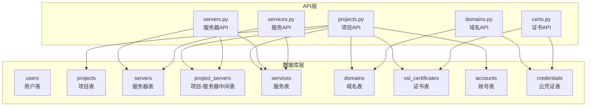
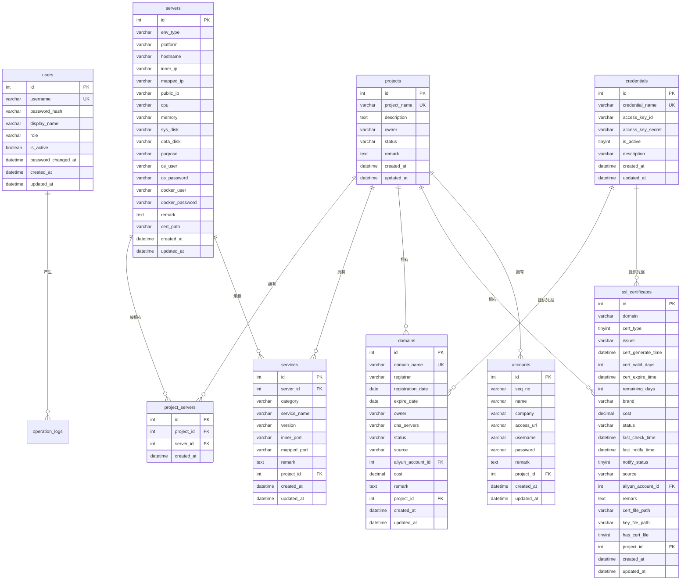
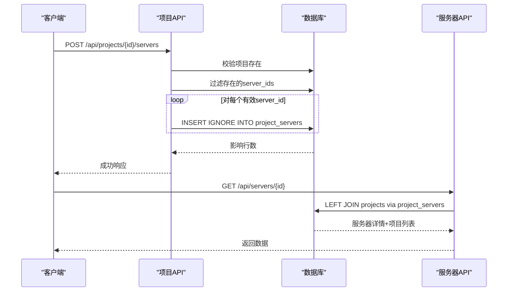
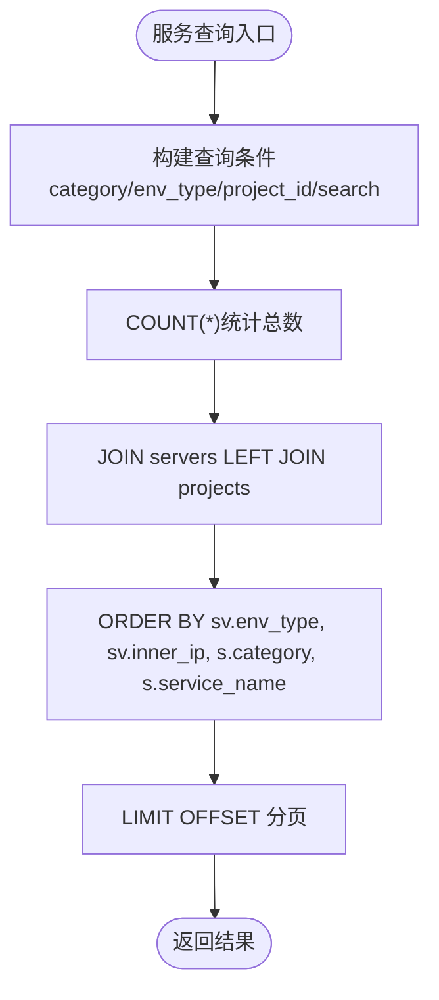
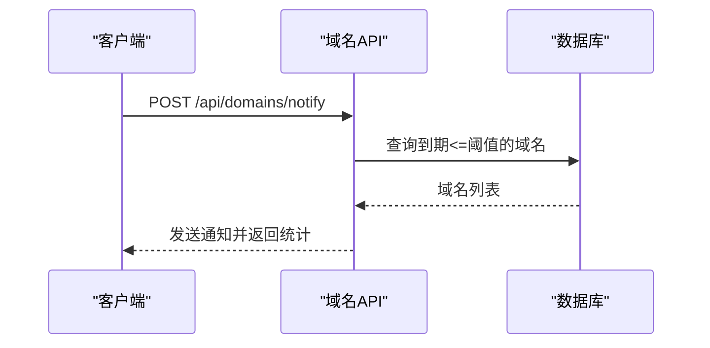
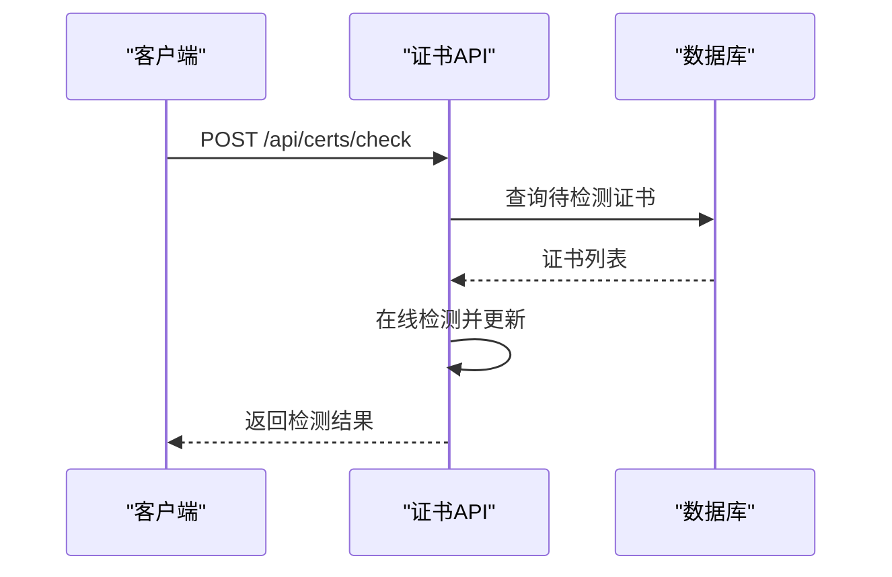
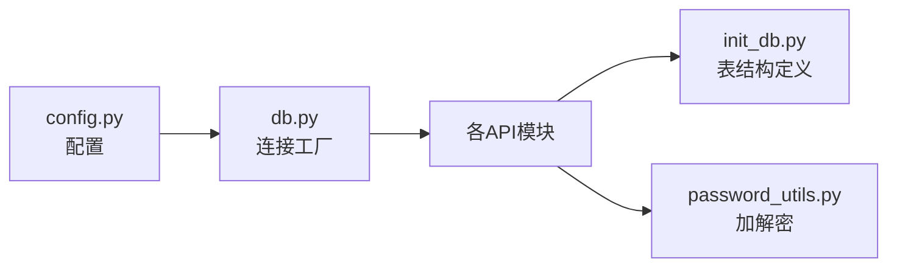

# 数据关系模型

<cite>
**本文档引用的文件**
- [init_db.py](file://backend/init_db.py)
- [db.py](file://backend/app/utils/db.py)
- [projects.py](file://backend/app/api/projects.py)
- [servers.py](file://backend/app/api/servers.py)
- [services.py](file://backend/app/api/services.py)
- [domains.py](file://backend/app/api/domains.py)
- [certs.py](file://backend/app/api/certs.py)
- [password_utils.py](file://backend/app/utils/password_utils.py)
- [config.py](file://backend/app/config.py)
</cite>

## 目录
1. [简介](#简介)
2. [项目结构](#项目结构)
3. [核心组件](#核心组件)
4. [架构概览](#架构概览)
5. [详细组件分析](#详细组件分析)
6. [依赖关系分析](#依赖关系分析)
7. [性能考量](#性能考量)
8. [故障排查指南](#故障排查指南)
9. [结论](#结论)

## 简介
本文件面向OPS项目，系统性梳理数据库实体关系模型，重点阐释以下关系：
- 项目与服务器的多对多关系（通过中间表project_servers实现）
- 项目与服务的一对多关系
- 项目与域名的一对多关系
- 项目与证书的一对多关系
- 项目与账号的一对多关系
- 服务器与服务的一对多关系
- 域名与证书的多对一关系
- 域名与云凭证的多对一关系

同时，文档提供ER关系图、外键约束设计原则与参照完整性保障机制，并总结关系查询最佳实践与性能优化建议。

## 项目结构
后端采用Flask微服务架构，数据库初始化脚本集中定义所有表结构及索引，API层负责业务逻辑与数据访问。

图表来源
- [init_db.py:34-383](file://backend/init_db.py#L34-L383)
- [projects.py:13-521](file://backend/app/api/projects.py#L13-L521)
- [servers.py:14-578](file://backend/app/api/servers.py#L14-L578)
- [services.py:12-206](file://backend/app/api/services.py#L12-L206)
- [domains.py:34-664](file://backend/app/api/domains.py#L34-L664)
- [certs.py:154-800](file://backend/app/api/certs.py#L154-L800)

章节来源
- [init_db.py:34-383](file://backend/init_db.py#L34-L383)
- [db.py:43-80](file://backend/app/utils/db.py#L43-L80)

## 核心组件
- 数据库连接与配置：通过统一的数据库连接工厂与Flask应用上下文缓存，确保连接复用与生命周期管理。
- 初始化脚本：集中定义所有表结构、索引、外键约束与默认数据，支持向后兼容性（动态添加列）。
- API层：围绕实体提供增删改查、关联查询与批量操作接口，遵循REST风格与鉴权要求。

章节来源
- [db.py:43-80](file://backend/app/utils/db.py#L43-L80)
- [init_db.py:22-395](file://backend/init_db.py#L22-L395)
- [config.py:10-58](file://backend/app/config.py#L10-L58)

## 架构概览
数据库层采用InnoDB引擎，统一字符集utf8mb4，通过外键约束保证参照完整性。API层通过蓝图组织各领域模块，按需JOIN关联表，实现复杂查询与聚合统计。

图表来源
- [init_db.py:34-383](file://backend/init_db.py#L34-L383)

## 详细组件分析

### 项目与服务器（多对多）
- 中间表：project_servers
  - 主键：id
  - 外键：project_id → projects(id)（级联删除）
  - 外键：server_id → servers(id)（级联删除）
  - 唯一键：(project_id, server_id)
  - 索引：idx_project_id, idx_server_id
- 关系查询示例
  - 项目详情聚合查询服务器列表（内连接）
  - 服务器详情聚合查询所属项目列表（左连接）
- 关联操作
  - 批量关联服务器：INSERT IGNORE避免重复
  - 单点解除关联：DELETE WHERE (project_id, server_id)

图表来源
- [projects.py:385-466](file://backend/app/api/projects.py#L385-L466)
- [servers.py:116-169](file://backend/app/api/servers.py#L116-L169)
- [init_db.py:94-107](file://backend/init_db.py#L94-L107)

章节来源
- [projects.py:153-258](file://backend/app/api/projects.py#L153-L258)
- [servers.py:116-169](file://backend/app/api/servers.py#L116-L169)
- [init_db.py:94-107](file://backend/init_db.py#L94-L107)

### 项目与服务（一对多）
- 外键：services.server_id → servers(id)（级联删除）
- 外键：services.project_id → projects(id)（级联删除）
- 查询要点
  - 服务列表按环境类型、内网IP、分类、服务名排序
  - 服务详情包含所属服务器与项目名称

图表来源
- [services.py:12-90](file://backend/app/api/services.py#L12-L90)
- [init_db.py:109-126](file://backend/init_db.py#L109-L126)

章节来源
- [services.py:12-90](file://backend/app/api/services.py#L12-L90)
- [init_db.py:109-126](file://backend/init_db.py#L109-L126)

### 项目与域名（一对多）
- 外键：domains.project_id → projects(id)（级联删除）
- 查询要点
  - 支持按项目ID筛选与关键词搜索
  - 域名到期预警通知基于到期日期阈值

图表来源
- [domains.py:596-664](file://backend/app/api/domains.py#L596-L664)

章节来源
- [domains.py:34-112](file://backend/app/api/domains.py#L34-L112)
- [domains.py:596-664](file://backend/app/api/domains.py#L596-L664)
- [init_db.py:305-325](file://backend/init_db.py#L305-L325)

### 项目与证书（一对多）
- 外键：ssl_certificates.project_id → projects(id)（级联删除）
- 查询要点
  - 支持按项目ID、证书类型、关键词搜索
  - 在线批量检测并更新证书状态与剩余天数

图表来源
- [certs.py:585-708](file://backend/app/api/certs.py#L585-L708)

章节来源
- [certs.py:154-242](file://backend/app/api/certs.py#L154-L242)
- [certs.py:585-708](file://backend/app/api/certs.py#L585-L708)
- [init_db.py:327-357](file://backend/init_db.py#L327-L357)

### 项目与账号（一对多）
- 外键：accounts.project_id → projects(id)（级联删除）
- 查询要点
  - 账号列表按名称排序，支持项目筛选

章节来源
- [projects.py:226-237](file://backend/app/api/projects.py#L226-L237)
- [init_db.py:172-187](file://backend/init_db.py#L172-L187)

### 服务器与服务（一对多）
- 外键：services.server_id → servers(id)（级联删除）
- 查询要点
  - 服务列表按环境类型、内网IP、分类、服务名排序

章节来源
- [services.py:66-77](file://backend/app/api/services.py#L66-L77)
- [init_db.py:109-126](file://backend/init_db.py#L109-L126)

### 域名与云凭证（多对一）
- 外键：domains.aliyun_account_id → credentials(id)（级联删除）
- 查询要点
  - 域名列表可关联显示凭证名称

章节来源
- [domains.py:34-112](file://backend/app/api/domains.py#L34-L112)
- [init_db.py:290-303](file://backend/init_db.py#L290-L303)

### 证书与云凭证（多对一）
- 外键：ssl_certificates.aliyun_account_id → credentials(id)（级联删除）
- 查询要点
  - 证书列表可关联显示凭证名称

章节来源
- [certs.py:154-242](file://backend/app/api/certs.py#L154-L242)
- [init_db.py:290-303](file://backend/init_db.py#L290-L303)

## 依赖关系分析
- API层依赖数据库连接工厂，统一获取与关闭连接
- 敏感数据（密码、AccessKey）通过对称加密工具进行加解密
- 配置中心集中管理数据库连接参数与业务开关

图表来源
- [config.py:10-58](file://backend/app/config.py#L10-L58)
- [db.py:43-80](file://backend/app/utils/db.py#L43-L80)
- [password_utils.py:93-130](file://backend/app/utils/password_utils.py#L93-L130)
- [init_db.py:34-383](file://backend/init_db.py#L34-L383)

章节来源
- [config.py:10-58](file://backend/app/config.py#L10-L58)
- [db.py:43-80](file://backend/app/utils/db.py#L43-L80)
- [password_utils.py:93-130](file://backend/app/utils/password_utils.py#L93-L130)

## 性能考量
- 索引策略
  - 项目名称、状态、服务器内网IP、域名、证书到期时间、证书类型、状态等常用过滤字段建立索引
  - 中间表project_servers建立联合唯一索引(uq_project_server)，避免重复关联
- 查询优化
  - 使用JOIN替代子查询，减少嵌套查询层级
  - 分页查询配合LIMIT/OFFSET，避免一次性加载大量数据
  - 聚合查询时仅选择必要字段，避免SELECT *
- 外键与事务
  - 外键约束保证参照完整性，删除项目时通过CASCADE自动清理中间表
  - 批量操作使用事务包裹，失败回滚保证一致性
- 缓存与异步
  - 对热点数据（如字典表）可考虑应用层缓存
  - 异步任务（如证书在线检测、域名到期通知）可引入队列

## 故障排查指南
- 数据库连接失败
  - 检查数据库配置项（主机、端口、用户名、密码、数据库名）
  - 查看连接超时与异常日志
- 外键约束错误
  - 确认被引用实体存在且状态有效
  - 检查中间表重复插入导致的唯一键冲突
- 敏感数据解密失败
  - 确认DATA_ENCRYPTION_KEY环境变量正确配置
  - 开发环境可启用降级密钥，但严禁用于生产
- 权限与鉴权
  - 确认JWT密钥与过期时间配置正确
  - 检查角色权限与路由装饰器

章节来源
- [db.py:28-80](file://backend/app/utils/db.py#L28-L80)
- [password_utils.py:18-30](file://backend/app/utils/password_utils.py#L18-L30)
- [config.py:10-58](file://backend/app/config.py#L10-L58)

## 结论
OPS项目的数据库关系模型以“项目”为核心枢纽，通过project_servers中间表实现项目与服务器的多对多关系，同时为服务、域名、证书、账号提供清晰的一对多关联。外键约束与索引策略共同保障了数据一致性与查询性能。API层围绕这些关系提供了丰富的查询与操作能力，建议在实际部署中结合业务场景进一步完善缓存与异步处理机制，持续优化查询路径与事务边界。