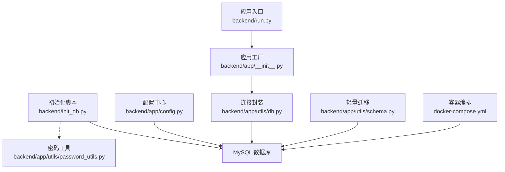
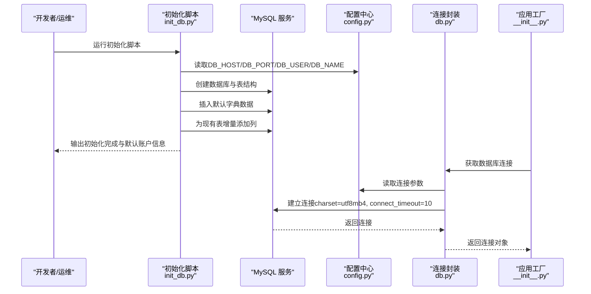
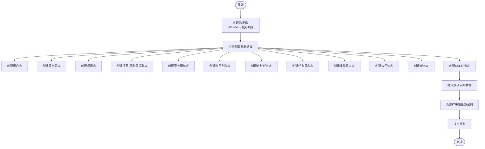
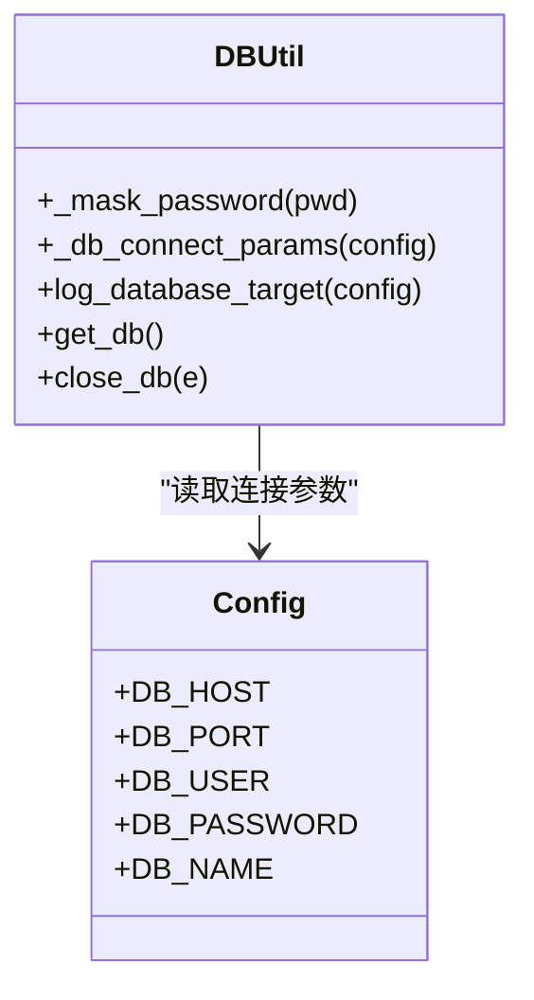
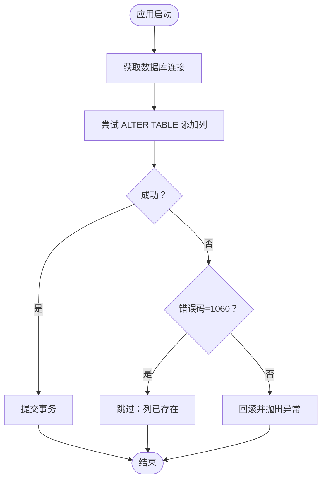
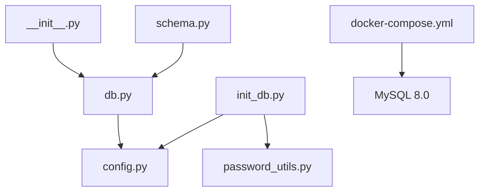

# 数据库初始化与配置

<cite>
**本文引用的文件**
- [init_db.py](file://backend/init_db.py)
- [config.py](file://backend/app/config.py)
- [db.py](file://backend/app/utils/db.py)
- [schema.py](file://backend/app/utils/schema.py)
- [docker-compose.yml](file://docker-compose.yml)
- [run.py](file://backend/run.py)
- [__init__.py](file://backend/app/__init__.py)
- [password_utils.py](file://backend/app/utils/password_utils.py)
</cite>

## 目录
1. [简介](#简介)
2. [项目结构](#项目结构)
3. [核心组件](#核心组件)
4. [架构总览](#架构总览)
5. [详细组件分析](#详细组件分析)
6. [依赖分析](#依赖分析)
7. [性能考虑](#性能考虑)
8. [故障排除指南](#故障排除指南)
9. [结论](#结论)
10. [附录](#附录)

## 简介
本文件面向OPS项目的数据库初始化与配置，系统性说明以下内容：
- 初始化脚本的工作原理：数据库创建、表结构创建、默认数据插入、列增量补齐
- 数据库连接配置参数：连接参数、字符集、超时设置
- 最佳实践：性能调优参数、安全配置建议
- 版本管理机制：全量初始化与轻量迁移的配合
- 备份恢复策略与故障排除指南

## 项目结构
与数据库初始化和配置直接相关的文件与职责如下：
- backend/init_db.py：全量数据库初始化脚本，负责创建数据库、表结构、默认数据与列补齐
- backend/app/config.py：集中式配置读取，包含数据库连接参数
- backend/app/utils/db.py：Flask应用上下文内的数据库连接封装、连接参数构造、连接日志与异常处理
- backend/app/utils/schema.py：应用启动时的轻量迁移（幂等），用于补齐新增字段
- docker-compose.yml：MySQL容器化部署与环境变量配置
- backend/run.py：应用入口，加载配置并启动服务
- backend/app/__init__.py：Flask应用工厂，注册数据库连接生命周期钩子
- backend/app/utils/password_utils.py：密码哈希工具，用于初始化默认管理员账户

**图表来源**
- [init_db.py:1-395](file://backend/init_db.py#L1-L395)
- [config.py:10-21](file://backend/app/config.py#L10-L21)
- [db.py:43-80](file://backend/app/utils/db.py#L43-L80)
- [schema.py:10-42](file://backend/app/utils/schema.py#L10-L42)
- [docker-compose.yml:10-29](file://docker-compose.yml#L10-L29)
- [run.py:1-8](file://backend/run.py#L1-L8)
- [__init__.py:28-96](file://backend/app/__init__.py#L28-L96)
- [password_utils.py:52-62](file://backend/app/utils/password_utils.py#L52-L62)

**章节来源**
- [init_db.py:1-395](file://backend/init_db.py#L1-L395)
- [config.py:10-21](file://backend/app/config.py#L10-L21)
- [db.py:43-80](file://backend/app/utils/db.py#L43-L80)
- [schema.py:10-42](file://backend/app/utils/schema.py#L10-L42)
- [docker-compose.yml:10-29](file://docker-compose.yml#L10-L29)
- [run.py:1-8](file://backend/run.py#L1-L8)
- [__init__.py:28-96](file://backend/app/__init__.py#L28-L96)
- [password_utils.py:52-62](file://backend/app/utils/password_utils.py#L52-L62)

## 核心组件
- 初始化脚本（init_db.py）
  - 功能：创建数据库、创建所有业务表、插入默认字典数据、为现有表增量添加列
  - 关键点：统一字符集为utf8mb4，使用事务保证原子性，失败时回滚并打印错误
- 连接封装（db.py）
  - 功能：基于Flask上下文缓存连接，构造连接参数，记录脱敏日志，捕获连接异常
  - 关键点：charset固定为utf8mb4，connect_timeout设置为10秒
- 配置中心（config.py）
  - 功能：集中读取DB_HOST、DB_PORT、DB_USER、DB_PASSWORD、DB_NAME等环境变量
- 轻量迁移（schema.py）
  - 功能：应用启动时幂等补齐新增字段（如users.password_changed_at）
- 容器编排（docker-compose.yml）
  - 功能：定义MySQL服务、卷、健康检查、环境变量（含数据库口令、字符集、校对规则）

**章节来源**
- [init_db.py:9-395](file://backend/init_db.py#L9-L395)
- [db.py:18-80](file://backend/app/utils/db.py#L18-L80)
- [config.py:16-20](file://backend/app/config.py#L16-L20)
- [schema.py:10-42](file://backend/app/utils/schema.py#L10-L42)
- [docker-compose.yml:14-18](file://docker-compose.yml#L14-L18)

## 架构总览
数据库初始化与连接的整体流程如下：

**图表来源**
- [init_db.py:22-395](file://backend/init_db.py#L22-L395)
- [config.py:16-20](file://backend/app/config.py#L16-L20)
- [db.py:43-80](file://backend/app/utils/db.py#L43-L80)
- [__init__.py:28-96](file://backend/app/__init__.py#L28-L96)

## 详细组件分析

### 初始化脚本（init_db.py）
- 数据库与字符集
  - 使用统一字符集utf8mb4与校对规则utf8mb4_unicode_ci创建数据库
  - 在USE数据库后，所有表均采用utf8mb4引擎与注释
- 表结构与索引
  - 用户表、服务器台账、项目管理、项目-服务器关联、服务清单、账号台账、定时任务、任务日志、操作日志、云凭证、域名、SSL证书等
  - 多处建立单列或联合索引，提升查询效率
- 默认数据
  - 插入默认管理员账户（密码经哈希处理）
  - 插入默认字典：环境类型、平台、服务分类、项目状态
- 列增量补齐
  - 提供通用方法检查列是否存在，不存在则添加，避免重复执行导致失败
  - 为services、domains、ssl_certificates、accounts表补充project_id字段

**图表来源**
- [init_db.py:22-395](file://backend/init_db.py#L22-L395)

**章节来源**
- [init_db.py:22-395](file://backend/init_db.py#L22-L395)
- [password_utils.py:52-62](file://backend/app/utils/password_utils.py#L52-L62)

### 连接封装（db.py）
- 参数构造
  - 从Flask配置读取DB_HOST、DB_PORT、DB_USER、DB_PASSWORD、DB_NAME
  - 固定charset为utf8mb4，游标类型为DictCursor
- 连接与日志
  - 使用Flask应用上下文缓存g.db，避免重复连接
  - 记录脱敏后的数据库目标信息，便于核对配置
- 异常处理
  - 捕获连接异常并记录详细错误，便于定位问题

**图表来源**
- [db.py:18-80](file://backend/app/utils/db.py#L18-L80)
- [config.py:16-20](file://backend/app/config.py#L16-L20)

**章节来源**
- [db.py:18-80](file://backend/app/utils/db.py#L18-L80)
- [__init__.py:28-96](file://backend/app/__init__.py#L28-L96)

### 轻量迁移（schema.py）
- 目的：应用启动时幂等补齐新增字段，避免与全量初始化冲突
- 示例：为users表添加password_changed_at列，若已存在则忽略
- 异常处理：捕获OperationalError并区分“列已存在”与其他错误

**图表来源**
- [schema.py:10-42](file://backend/app/utils/schema.py#L10-L42)

**章节来源**
- [schema.py:10-42](file://backend/app/utils/schema.py#L10-L42)

### 配置中心（config.py）
- 数据库连接参数
  - DB_HOST、DB_PORT、DB_USER、DB_PASSWORD、DB_NAME
- 其他关键参数
  - SECRET_KEY、JWT_SECRET_KEY、JWT_EXPIRATION_HOURS
  - CORS_ORIGINS、CORS_ALLOW_ALL
  - SSL_CHECK_TIMEOUT、SSL_WARNING_DAYS、DOMAIN_WARNING_DAYS
  - CERT_AUTO_CHECK_CRON、DOMAIN_AUTO_NOTIFY_CRON
  - GRAFANA_URL、GRAFANA_DASHBOARDS

**章节来源**
- [config.py:10-58](file://backend/app/config.py#L10-L58)

### 容器编排（docker-compose.yml）
- MySQL服务
  - 镜像：mysql:8.0
  - 环境变量：MYSQL_ROOT_PASSWORD、MYSQL_DATABASE、MYSQL_CHARSET、MYSQL_COLLATION
  - 卷：持久化数据目录
  - 健康检查：mysqladmin ping
- Backend服务
  - 读取DB_HOST、DB_PORT、DB_USER、DB_PASSWORD、DB_NAME等环境变量
  - 依赖MySQL健康状态
- 前端服务
  - Nginx反向代理静态资源

**章节来源**
- [docker-compose.yml:10-29](file://docker-compose.yml#L10-L29)
- [docker-compose.yml:36-59](file://docker-compose.yml#L36-L59)

## 依赖分析
- 组件耦合
  - 初始化脚本依赖配置中心提供的数据库参数，并使用密码工具对默认管理员密码进行哈希
  - 连接封装依赖Flask应用上下文，确保每个请求复用同一连接
  - 轻量迁移在应用启动阶段运行，避免与全量初始化冲突
- 外部依赖
  - MySQL 8.0（容器镜像）
  - PyMySQL（Python MySQL驱动）
  - bcrypt（密码哈希）
  - cryptography.Fernet（对称加密，用于敏感信息存储）

**图表来源**
- [init_db.py:6-7](file://backend/init_db.py#L6-L7)
- [config.py:16-20](file://backend/app/config.py#L16-L20)
- [password_utils.py:52-62](file://backend/app/utils/password_utils.py#L52-L62)
- [db.py:43-80](file://backend/app/utils/db.py#L43-L80)
- [schema.py:10-42](file://backend/app/utils/schema.py#L10-L42)
- [__init__.py:28-96](file://backend/app/__init__.py#L28-L96)
- [docker-compose.yml:10-29](file://docker-compose.yml#L10-L29)

**章节来源**
- [init_db.py:6-7](file://backend/init_db.py#L6-L7)
- [db.py:43-80](file://backend/app/utils/db.py#L43-L80)
- [schema.py:10-42](file://backend/app/utils/schema.py#L10-L42)
- [docker-compose.yml:10-29](file://docker-compose.yml#L10-L29)

## 性能考虑
- 字符集与排序规则
  - 使用utf8mb4与utf8mb4_unicode_ci，兼顾多语言与排序一致性
- 索引设计
  - 在高频过滤字段上建立单列或联合索引，减少全表扫描
- 连接参数
  - 固定charset为utf8mb4，避免编码转换开销
  - connect_timeout设置为10秒，平衡可用性与资源占用
- 迁移策略
  - 全量初始化与轻量迁移分离，避免重复DDL造成锁等待
- 建议优化
  - 对大表定期分析统计信息，保持执行计划稳定
  - 合理拆分热点表，必要时引入只读副本
  - 使用连接池（如在更高层引入）以降低连接建立成本

[本节为通用指导，无需具体文件分析]

## 故障排除指南
- 初始化失败
  - 确认数据库参数正确（主机、端口、用户、密码、数据库名）
  - 检查字符集与校对规则是否匹配
  - 查看初始化脚本输出的错误信息，逐条修复
- 连接失败
  - 检查Flask日志中脱敏后的连接目标信息
  - 确认MySQL服务可达、网络连通、防火墙放行
  - 调整connect_timeout与重试策略
- 权限不足
  - 确保DB_USER具备创建数据库、表与索引的权限
  - 初始化脚本需具备INSERT权限以写入默认数据
- 迁移冲突
  - 轻量迁移仅幂等添加列，若出现错误，先确认列是否已存在
  - 避免手动修改表结构后与迁移逻辑冲突
- 容器环境
  - 确认compose中DB_HOST指向mysql服务名，DB_PORT为3306
  - 等待MySQL健康检查通过后再启动后端服务

**章节来源**
- [db.py:43-80](file://backend/app/utils/db.py#L43-L80)
- [schema.py:10-42](file://backend/app/utils/schema.py#L10-L42)
- [docker-compose.yml:66-79](file://docker-compose.yml#L66-L79)

## 结论
OPS项目的数据库初始化与配置采用“全量初始化+轻量迁移”的双轨策略，既保证首次部署的完整性，又支持后续演进的幂等性。通过统一字符集、严格的索引设计与连接参数配置，系统在功能完备性与可维护性之间取得良好平衡。建议在生产环境中结合备份恢复策略与监控告警，持续优化性能与安全性。

[本节为总结性内容，无需具体文件分析]

## 附录

### 数据库初始化步骤详解
- 步骤一：创建数据库与切换
  - 使用utf8mb4与校对规则创建数据库并切换至目标库
- 步骤二：创建表结构
  - 依次创建用户、服务器、项目、关联、服务、账号、定时任务、日志、操作日志、云凭证、域名、SSL证书等表
  - 为每张表添加必要的索引
- 步骤三：插入默认数据
  - 插入默认管理员账户（密码经哈希处理）
  - 插入环境类型、平台、服务分类、项目状态等字典数据
- 步骤四：列增量补齐
  - 检查列是否存在，不存在则添加（如project_id）
  - 提交事务，失败回滚

**章节来源**
- [init_db.py:22-395](file://backend/init_db.py#L22-L395)
- [password_utils.py:52-62](file://backend/app/utils/password_utils.py#L52-L62)

### 数据库连接配置参数
- 必填参数
  - DB_HOST：数据库主机
  - DB_PORT：数据库端口
  - DB_USER：数据库用户
  - DB_PASSWORD：数据库密码
  - DB_NAME：数据库名
- 连接细节
  - charset：utf8mb4
  - cursorclass：DictCursor
  - connect_timeout：10秒
- 日志与诊断
  - 连接前打印脱敏后的连接目标，便于核对配置

**章节来源**
- [config.py:16-20](file://backend/app/config.py#L16-L20)
- [db.py:43-80](file://backend/app/utils/db.py#L43-L80)

### 版本管理与迁移机制
- 全量初始化（init_db.py）
  - 一次性创建所有表与默认数据，适合全新部署
- 轻量迁移（schema.py）
  - 应用启动时幂等补齐新增字段，适合后续演进
- 协同原则
  - 避免在同一迁移阶段重复DDL
  - 新增字段尽量使用NULL或默认值，减少历史数据回填压力

**章节来源**
- [init_db.py:359-383](file://backend/init_db.py#L359-L383)
- [schema.py:10-42](file://backend/app/utils/schema.py#L10-L42)

### 备份恢复策略
- 备份
  - 使用mysqldump或物理备份工具定期导出数据库
  - 保存初始化脚本与默认字典数据，便于快速重建
- 恢复
  - 在新环境中先执行初始化脚本，再导入备份数据
  - 如需回滚，优先使用时间点恢复（binlog）
- 注意事项
  - 备份前确认字符集与排序规则一致
  - 恢复后验证默认数据与索引完整性

[本节为通用指导，无需具体文件分析]