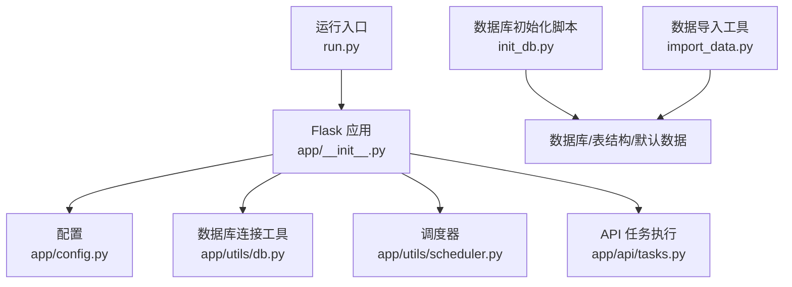
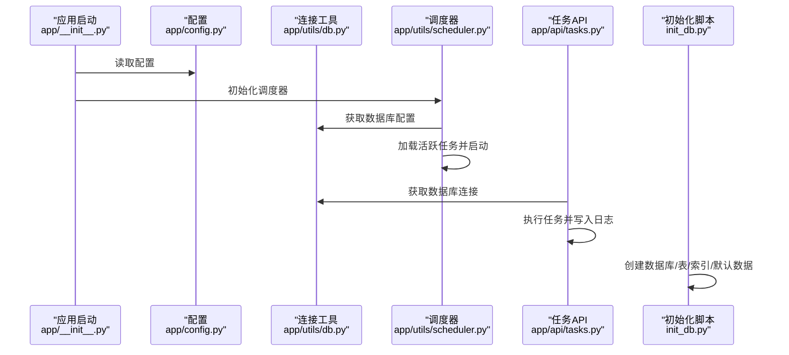
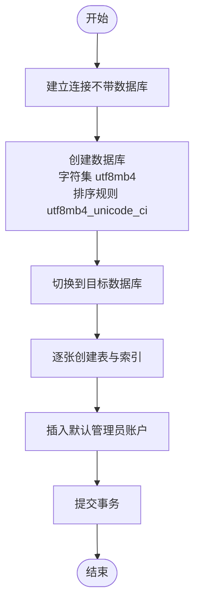
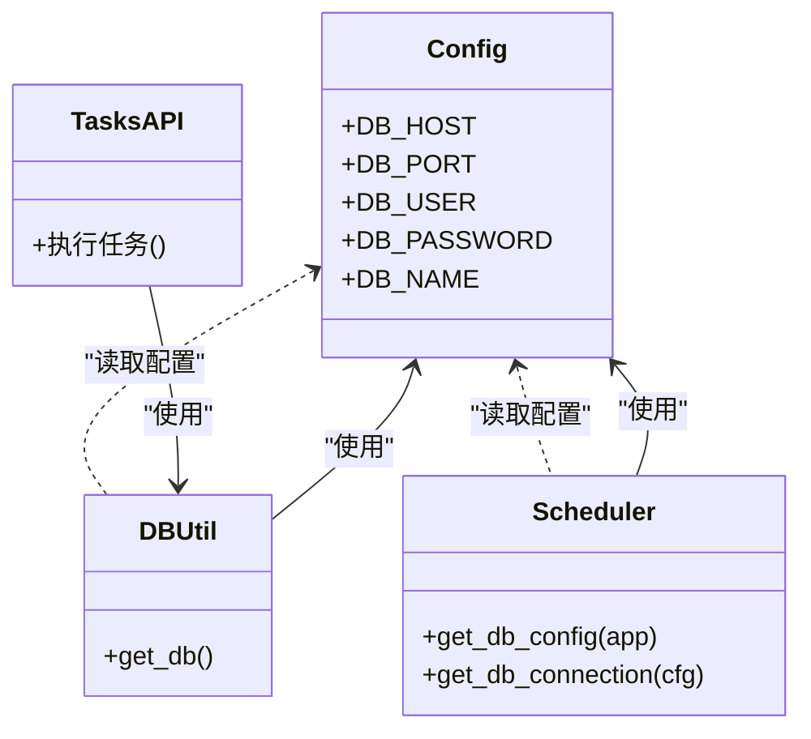
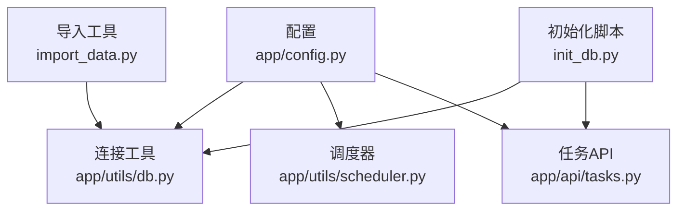

# 数据库概览

<cite>
**本文引用的文件**
- [backend/app/utils/db.py](file://backend/app/utils/db.py)
- [backend/init_db.py](file://backend/init_db.py)
- [backend/app/config.py](file://backend/app/config.py)
- [backend/app/__init__.py](file://backend/app/__init__.py)
- [backend/run.py](file://backend/run.py)
- [backend/app/utils/scheduler.py](file://backend/app/utils/scheduler.py)
- [backend/app/api/tasks.py](file://backend/app/api/tasks.py)
- [backend/import_data.py](file://backend/import_data.py)
</cite>

## 目录
1. [简介](#简介)
2. [项目结构](#项目结构)
3. [核心组件](#核心组件)
4. [架构总览](#架构总览)
5. [详细组件分析](#详细组件分析)
6. [依赖分析](#依赖分析)
7. [性能考虑](#性能考虑)
8. [故障排查指南](#故障排查指南)
9. [结论](#结论)
10. [附录](#附录)

## 简介
本文件面向云运维平台的数据库架构与运维实践，系统化阐述数据库初始化流程、连接配置与连接池管理现状、字符集与排序规则、版本与存储引擎要求、事务特性、连接参数与超时控制、错误重试与恢复策略，并给出备份与性能监控建议。文档以仓库中的实际实现为依据，避免臆测，确保可操作性与可追溯性。

## 项目结构
后端采用 Flask 应用，数据库相关能力主要分布在以下模块：
- 配置层：集中定义数据库连接参数与运行参数
- 工具层：提供数据库连接获取与调度器连接封装
- 初始化脚本：负责数据库与表结构创建、默认数据插入
- API 层：部分定时任务执行涉及数据库写入
- 导入工具：批量导入 Excel 数据至数据库

图表来源
- [backend/app/__init__.py:1-62](file://backend/app/__init__.py#L1-L62)
- [backend/app/config.py:1-21](file://backend/app/config.py#L1-L21)
- [backend/app/utils/db.py:1-17](file://backend/app/utils/db.py#L1-L17)
- [backend/app/utils/scheduler.py:1-249](file://backend/app/utils/scheduler.py#L1-L249)
- [backend/app/api/tasks.py:340-458](file://backend/app/api/tasks.py#L340-L458)
- [backend/init_db.py:1-230](file://backend/init_db.py#L1-L230)
- [backend/import_data.py:1-371](file://backend/import_data.py#L1-L371)
- [backend/run.py:1-8](file://backend/run.py#L1-L8)

章节来源
- [backend/app/__init__.py:1-62](file://backend/app/__init__.py#L1-L62)
- [backend/app/config.py:1-21](file://backend/app/config.py#L1-L21)
- [backend/run.py:1-8](file://backend/run.py#L1-L8)

## 核心组件
- 数据库连接工具：提供基于 Flask 当前应用配置的连接工厂，统一字符集与游标类型
- 初始化脚本：创建数据库、表结构、索引与默认管理员账户
- 调度器：周期性拉取活跃任务，执行外部脚本并将结果写回数据库
- API 任务执行：手动触发任务执行并将结果写回数据库
- 数据导入工具：批量导入 Excel 数据至各业务表
- 配置中心：集中管理数据库与应用运行参数

章节来源
- [backend/app/utils/db.py:1-17](file://backend/app/utils/db.py#L1-L17)
- [backend/init_db.py:1-230](file://backend/init_db.py#L1-L230)
- [backend/app/utils/scheduler.py:1-249](file://backend/app/utils/scheduler.py#L1-L249)
- [backend/app/api/tasks.py:340-458](file://backend/app/api/tasks.py#L340-L458)
- [backend/import_data.py:1-371](file://backend/import_data.py#L1-L371)
- [backend/app/config.py:1-21](file://backend/app/config.py#L1-L21)

## 架构总览
平台数据库采用单体式架构，通过 Python 原生连接库进行交互，未引入 ORM 或连接池中间件。整体流程如下：
- 应用启动时加载配置，注册蓝图并初始化调度器
- 各模块按需获取连接，执行 SQL 并在 finally 中关闭连接
- 调度器与任务 API 在执行外部脚本前后，将执行状态写回数据库
- 初始化脚本一次性创建数据库与表结构，并插入默认数据

图表来源
- [backend/app/__init__.py:1-62](file://backend/app/__init__.py#L1-L62)
- [backend/app/config.py:1-21](file://backend/app/config.py#L1-L21)
- [backend/app/utils/db.py:1-17](file://backend/app/utils/db.py#L1-L17)
- [backend/app/utils/scheduler.py:1-249](file://backend/app/utils/scheduler.py#L1-L249)
- [backend/app/api/tasks.py:340-458](file://backend/app/api/tasks.py#L340-L458)
- [backend/init_db.py:1-230](file://backend/init_db.py#L1-L230)

## 详细组件分析

### 数据库初始化流程
- 连接参数：通过配置对象读取主机、端口、用户、密码、字符集
- 数据库创建：若不存在则创建，指定字符集与排序规则
- 表结构创建：逐张表创建，包含主键、索引、外键约束与注释
- 默认数据：插入默认管理员账户（密码经哈希处理）

图表来源
- [backend/init_db.py:9-31](file://backend/init_db.py#L9-L31)
- [backend/init_db.py:33-218](file://backend/init_db.py#L33-L218)

章节来源
- [backend/init_db.py:1-230](file://backend/init_db.py#L1-L230)

### 连接配置与连接池管理
- 连接配置：统一从应用配置读取，包含主机、端口、用户、密码、数据库名、字符集与游标类型
- 连接池：当前实现未使用连接池，每次使用时创建连接并在 finally 中关闭
- 调度器与任务 API：各自独立创建连接，执行完成后关闭

图表来源
- [backend/app/config.py:1-21](file://backend/app/config.py#L1-L21)
- [backend/app/utils/db.py:1-17](file://backend/app/utils/db.py#L1-L17)
- [backend/app/utils/scheduler.py:14-29](file://backend/app/utils/scheduler.py#L14-L29)
- [backend/app/api/tasks.py:354-381](file://backend/app/api/tasks.py#L354-L381)

章节来源
- [backend/app/utils/db.py:1-17](file://backend/app/utils/db.py#L1-L17)
- [backend/app/utils/scheduler.py:14-29](file://backend/app/utils/scheduler.py#L14-L29)
- [backend/app/api/tasks.py:340-458](file://backend/app/api/tasks.py#L340-L458)

### 字符集、排序规则与编码兼容性
- 字符集：统一使用 utf8mb4，满足四字节表情与多语言字符
- 排序规则：数据库层面使用 utf8mb4_unicode_ci；表级 DEFAULT CHARSET=utf8mb4 已显式声明
- 编码兼容性：客户端连接同样设置 charset='utf8mb4'，避免插入/查询异常

章节来源
- [backend/init_db.py:28-30](file://backend/init_db.py#L28-L30)
- [backend/init_db.py:45-210](file://backend/init_db.py#L45-L210)
- [backend/app/utils/db.py:14](file://backend/app/utils/db.py#L14)
- [backend/app/utils/scheduler.py:22](file://backend/app/utils/scheduler.py#L22)

### 版本要求、存储引擎与事务特性
- 版本要求：代码未显式声明 MySQL 版本，但使用了 JSON 类型字段（定时任务表），通常需要较新版本支持
- 存储引擎：全部表使用 InnoDB，具备事务、外键与崩溃恢复能力
- 事务特性：初始化脚本与导入工具均使用提交/回滚控制；API 任务执行中对异常进行捕获并记录

章节来源
- [backend/init_db.py:170-191](file://backend/init_db.py#L170-L191)
- [backend/import_data.py:16-30](file://backend/import_data.py#L16-L30)
- [backend/app/api/tasks.py:383-402](file://backend/app/api/tasks.py#L383-L402)

### 连接参数、超时与错误重试
- 连接参数：主机、端口、用户、密码、数据库名、字符集、游标类型
- 超时：子进程执行脚本设置了超时阈值；数据库连接未设置超时参数
- 错误重试：当前实现未内置自动重试逻辑，异常时记录错误信息并返回

章节来源
- [backend/app/utils/db.py:8-16](file://backend/app/utils/db.py#L8-L16)
- [backend/app/utils/scheduler.py:64-69](file://backend/app/utils/scheduler.py#L64-L69)
- [backend/app/api/tasks.py:350](file://backend/app/api/tasks.py#L350)

### 备份策略、性能监控与故障恢复
- 备份策略：建议采用“全量+增量”结合的策略，配合 binlog 与归档目录，定期校验备份可用性
- 性能监控：关注慢查询日志、锁等待、连接数峰值、缓冲池命中率与表扫描率
- 故障恢复：建立标准化演练流程，包括快速定位、回滚与数据修复；对关键表开启自动备份与告警

（本节为通用实践建议，不直接对应具体源文件）

## 依赖分析
- 组件耦合：数据库连接工具与调度器、API 任务执行均依赖配置对象；初始化脚本与导入工具依赖配置对象
- 外部依赖：pymysql 作为数据库驱动；apscheduler 用于任务调度；openpyxl 用于 Excel 导入
- 潜在风险：未使用连接池可能导致高并发下的连接抖动；缺少统一连接复用与健康检查

图表来源
- [backend/app/config.py:1-21](file://backend/app/config.py#L1-L21)
- [backend/app/utils/db.py:1-17](file://backend/app/utils/db.py#L1-L17)
- [backend/app/utils/scheduler.py:1-249](file://backend/app/utils/scheduler.py#L1-L249)
- [backend/app/api/tasks.py:340-458](file://backend/app/api/tasks.py#L340-L458)
- [backend/init_db.py:1-230](file://backend/init_db.py#L1-L230)
- [backend/import_data.py:1-371](file://backend/import_data.py#L1-L371)

章节来源
- [backend/app/config.py:1-21](file://backend/app/config.py#L1-L21)
- [backend/app/utils/db.py:1-17](file://backend/app/utils/db.py#L1-L17)
- [backend/app/utils/scheduler.py:1-249](file://backend/app/utils/scheduler.py#L1-L249)
- [backend/app/api/tasks.py:340-458](file://backend/app/api/tasks.py#L340-L458)
- [backend/init_db.py:1-230](file://backend/init_db.py#L1-L230)
- [backend/import_data.py:1-371](file://backend/import_data.py#L1-L371)

## 性能考虑
- 连接管理：建议引入连接池（如 DBUtils、SQLAlchemy pool）以降低连接开销与资源竞争
- 索引优化：根据高频查询字段建立复合索引，避免全表扫描
- 写入批量化：导入与任务写入尽量合并事务，减少往返次数
- 监控与告警：接入慢查询日志与关键指标（QPS、连接数、锁等待、缓冲池命中率）

（本节为通用指导，不直接对应具体源文件）

## 故障排查指南
- 连接失败：核对主机、端口、用户、密码与数据库名；确认网络可达与防火墙放行
- 字符乱码：确保客户端与服务端字符集一致（utf8mb4），并正确设置排序规则
- 任务执行失败：查看任务日志表中的错误信息与输出；检查脚本路径与权限
- 导入异常：确认 Excel 结构与导入逻辑匹配；必要时回滚事务并修正数据

章节来源
- [backend/app/api/tasks.py:383-402](file://backend/app/api/tasks.py#L383-L402)
- [backend/import_data.py:27-30](file://backend/import_data.py#L27-L30)

## 结论
平台数据库架构以简单直接的方式实现了初始化、连接与任务执行，字符集与存储引擎选择符合现代需求。建议在生产环境中引入连接池、完善的监控与备份体系，并补充自动重试与健康检查机制，以提升稳定性与可维护性。

## 附录
- 关键实现路径参考
  - [数据库连接工具:5-16](file://backend/app/utils/db.py#L5-L16)
  - [初始化脚本（创建数据库/表/默认数据）:22-225](file://backend/init_db.py#L22-L225)
  - [调度器（周期任务与日志写入）:201-248](file://backend/app/utils/scheduler.py#L201-L248)
  - [任务 API（手动执行与日志写入）:340-458](file://backend/app/api/tasks.py#L340-L458)
  - [数据导入工具（批量导入）:11-33](file://backend/import_data.py#L11-L33)
  - [应用配置（数据库参数）:9-13](file://backend/app/config.py#L9-L13)
  - [应用启动与调度器初始化:30-32](file://backend/app/__init__.py#L30-L32)
  - [运行入口:1-8](file://backend/run.py#L1-L8)