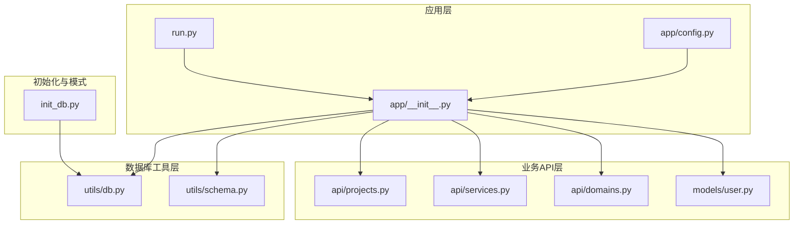
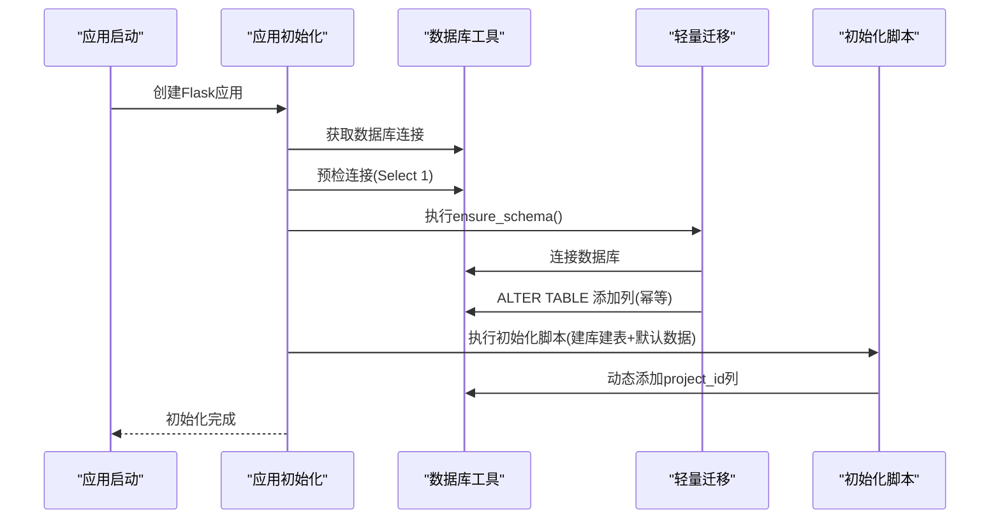
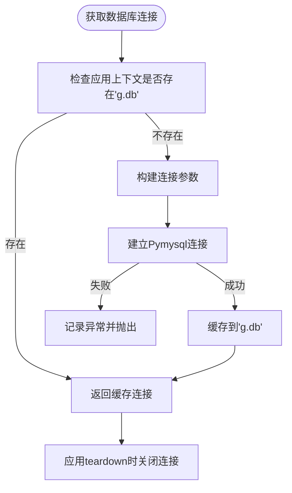
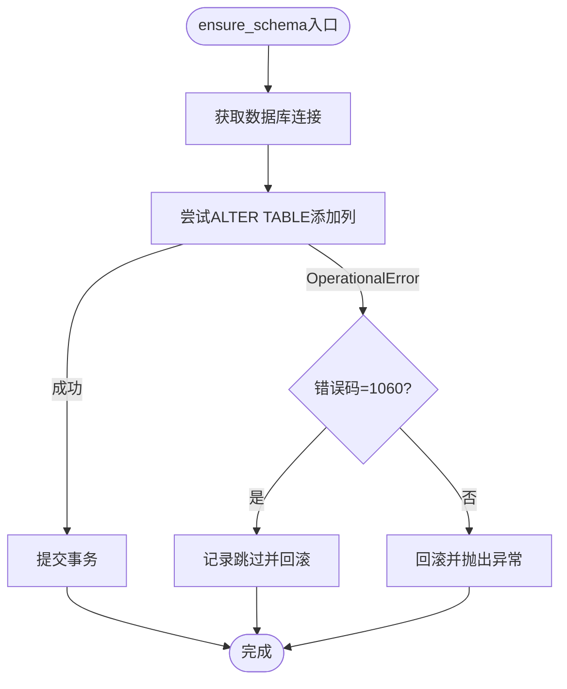
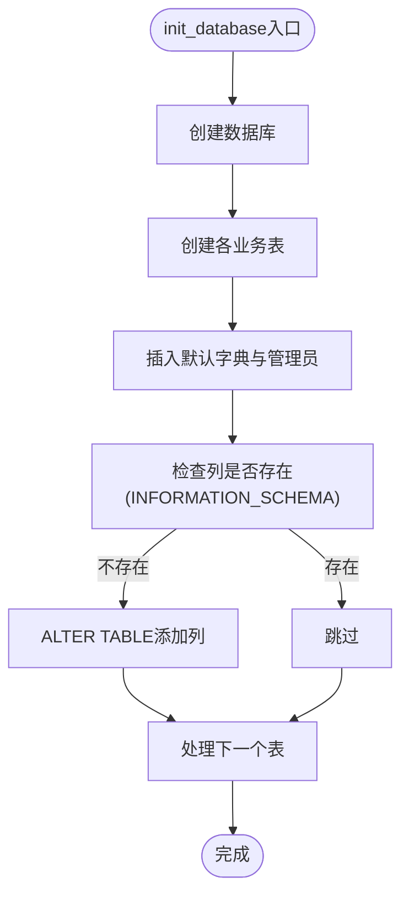
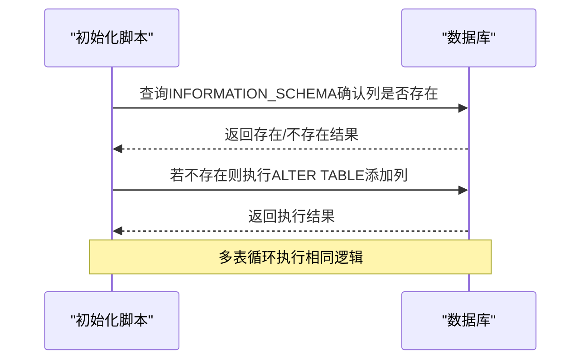
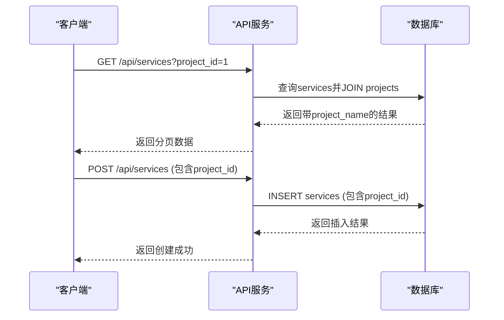
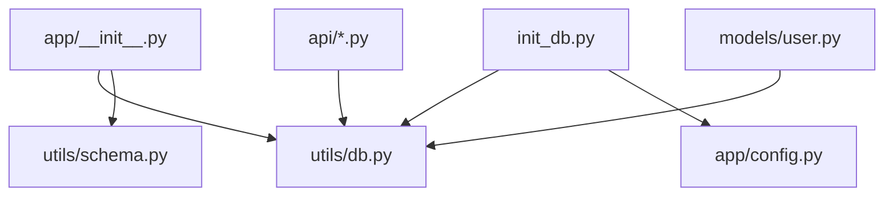

# 数据库模式管理

<cite>
**本文档引用的文件**
- [backend/app/utils/db.py](file://backend/app/utils/db.py)
- [backend/app/utils/schema.py](file://backend/app/utils/schema.py)
- [backend/init_db.py](file://backend/init_db.py)
- [backend/app/__init__.py](file://backend/app/__init__.py)
- [backend/app/config.py](file://backend/app/config.py)
- [backend/app/models/user.py](file://backend/app/models/user.py)
- [backend/app/api/services.py](file://backend/app/api/services.py)
- [backend/app/api/domains.py](file://backend/app/api/domains.py)
- [backend/app/api/projects.py](file://backend/app/api/projects.py)
- [backend/run.py](file://backend/run.py)
</cite>

## 目录
1. [简介](#简介)
2. [项目结构](#项目结构)
3. [核心组件](#核心组件)
4. [架构概览](#架构概览)
5. [详细组件分析](#详细组件分析)
6. [依赖分析](#依赖分析)
7. [性能考虑](#性能考虑)
8. [故障排除指南](#故障排除指南)
9. [结论](#结论)
10. [附录](#附录)

## 简介
本文件面向OPS项目的数据库模式管理，系统性阐述数据库模式的演进与版本控制机制、表结构变更管理策略、动态列添加机制（以project_id字段为例）、数据库迁移最佳实践（向后兼容性、数据完整性检查、回滚策略）、升级过程中的数据转换与验证方法，以及数据库模式变更的自动化脚本与部署流程。

## 项目结构
OPS项目采用Flask微服务架构，数据库层通过工具模块统一管理连接与迁移。核心文件分布如下：
- 数据库连接与工具：backend/app/utils/db.py、backend/app/utils/schema.py
- 初始化脚本：backend/init_db.py
- 应用入口与蓝图注册：backend/app/__init__.py、backend/run.py
- 配置管理：backend/app/config.py
- 模型与API：backend/app/models/user.py、backend/app/api/*.py

**图表来源**
- [backend/app/__init__.py:28-113](file://backend/app/__init__.py#L28-L113)
- [backend/run.py:1-8](file://backend/run.py#L1-L8)
- [backend/app/utils/db.py:43-80](file://backend/app/utils/db.py#L43-L80)
- [backend/app/utils/schema.py:10-42](file://backend/app/utils/schema.py#L10-L42)
- [backend/init_db.py:22-395](file://backend/init_db.py#L22-L395)
- [backend/app/api/projects.py:13-86](file://backend/app/api/projects.py#L13-L86)
- [backend/app/api/services.py:12-90](file://backend/app/api/services.py#L12-L90)
- [backend/app/api/domains.py:34-111](file://backend/app/api/domains.py#L34-L111)
- [backend/app/models/user.py:8-34](file://backend/app/models/user.py#L8-L34)

**章节来源**
- [backend/app/__init__.py:28-113](file://backend/app/__init__.py#L28-L113)
- [backend/run.py:1-8](file://backend/run.py#L1-L8)
- [backend/app/utils/db.py:43-80](file://backend/app/utils/db.py#L43-L80)
- [backend/app/utils/schema.py:10-42](file://backend/app/utils/schema.py#L10-L42)
- [backend/init_db.py:22-395](file://backend/init_db.py#L22-L395)

## 核心组件
- 数据库连接与生命周期管理：提供连接参数构建、连接获取、异常处理与关闭钩子，确保应用上下文内的连接复用与安全释放。
- 轻量迁移（幂等）：在应用启动时执行，确保新增列等结构变更的幂等性，避免重复执行导致的错误。
- 全量初始化脚本：负责数据库与表结构的首次创建，包含默认数据插入与动态列添加逻辑。
- API层对新列的使用：服务、域名、证书等API在查询与写入时已兼容project_id字段，体现渐进式演进策略。

**章节来源**
- [backend/app/utils/db.py:43-80](file://backend/app/utils/db.py#L43-L80)
- [backend/app/utils/schema.py:10-42](file://backend/app/utils/schema.py#L10-L42)
- [backend/init_db.py:359-384](file://backend/init_db.py#L359-L384)
- [backend/app/api/services.py:55-77](file://backend/app/api/services.py#L55-L77)
- [backend/app/api/domains.py:74-95](file://backend/app/api/domains.py#L74-L95)

## 架构概览
数据库模式管理采用“启动时轻量迁移 + 初始化脚本”的双轨策略：
- 启动时迁移：在应用上下文中执行，确保新增列等结构变更的幂等性。
- 初始化脚本：负责首次建库建表与默认数据，同时对现有表进行动态列添加，保证历史数据的平滑演进。

**图表来源**
- [backend/app/__init__.py:88-107](file://backend/app/__init__.py#L88-L107)
- [backend/app/utils/schema.py:10-42](file://backend/app/utils/schema.py#L10-L42)
- [backend/init_db.py:359-384](file://backend/init_db.py#L359-L384)

## 详细组件分析

### 数据库连接与生命周期管理
- 连接参数：基于配置项构建，支持主机、端口、用户、密码、数据库名等。
- 连接获取：使用Flask应用上下文缓存连接，避免重复建立连接。
- 异常处理：捕获连接异常并记录详细信息，便于排查。
- 生命周期：在应用上下文结束时关闭连接，防止连接泄漏。

**图表来源**
- [backend/app/utils/db.py:43-80](file://backend/app/utils/db.py#L43-L80)

**章节来源**
- [backend/app/utils/db.py:43-80](file://backend/app/utils/db.py#L43-L80)

### 轻量迁移（幂等）
- 目标：在应用启动时确保结构变更（如新增列）的幂等性。
- 实现：使用ALTER TABLE添加列，并捕获重复列错误（特定错误码）进行跳过处理。
- 事务：在异常时回滚，保证迁移失败不影响现有结构。

**图表来源**
- [backend/app/utils/schema.py:10-42](file://backend/app/utils/schema.py#L10-L42)

**章节来源**
- [backend/app/utils/schema.py:10-42](file://backend/app/utils/schema.py#L10-L42)

### 初始化脚本与全量建模
- 建库建表：按需创建数据库与各业务表，包含索引与约束。
- 默认数据：插入默认字典项与初始管理员账户。
- 动态列添加：通过检查INFORMATION_SCHEMA确认列是否存在，不存在则添加，避免重复执行导致的错误。

**图表来源**
- [backend/init_db.py:22-395](file://backend/init_db.py#L22-L395)

**章节来源**
- [backend/init_db.py:22-395](file://backend/init_db.py#L22-L395)

### 动态列添加机制（以project_id为例）
- 检查逻辑：通过INFORMATION_SCHEMA查询列是否存在，避免重复添加。
- 添加逻辑：使用ALTER TABLE添加project_id字段，注释说明其含义。
- 影响范围：services、domains、ssl_certificates、accounts等表均新增project_id字段，API层已兼容该字段的查询与写入。

**图表来源**
- [backend/init_db.py:359-384](file://backend/init_db.py#L359-L384)

**章节来源**
- [backend/init_db.py:359-384](file://backend/init_db.py#L359-L384)
- [backend/app/api/services.py:55-77](file://backend/app/api/services.py#L55-L77)
- [backend/app/api/domains.py:74-95](file://backend/app/api/domains.py#L74-L95)

### API层对新列的使用
- 服务管理：查询支持按project_id过滤，写入时可设置project_id。
- 域名管理：查询支持按project_id过滤，创建/更新时可设置project_id。
- 项目管理：在项目详情中聚合展示各资源数量，体现project_id的关联作用。

**图表来源**
- [backend/app/api/services.py:12-90](file://backend/app/api/services.py#L12-L90)
- [backend/app/api/domains.py:34-111](file://backend/app/api/domains.py#L34-L111)

**章节来源**
- [backend/app/api/services.py:12-90](file://backend/app/api/services.py#L12-L90)
- [backend/app/api/domains.py:34-111](file://backend/app/api/domains.py#L34-L111)
- [backend/app/api/projects.py:13-86](file://backend/app/api/projects.py#L13-L86)

## 依赖分析
- 应用初始化依赖数据库工具与轻量迁移模块，确保连接可用与结构幂等。
- 初始化脚本依赖数据库工具与配置模块，负责全量建模与默认数据。
- API层依赖数据库工具，读写数据库并进行事务控制。
- 配置模块提供数据库连接参数，贯穿整个系统。

**图表来源**
- [backend/app/__init__.py:88-107](file://backend/app/__init__.py#L88-L107)
- [backend/app/utils/db.py:43-80](file://backend/app/utils/db.py#L43-L80)
- [backend/app/utils/schema.py:10-42](file://backend/app/utils/schema.py#L10-L42)
- [backend/init_db.py:22-395](file://backend/init_db.py#L22-L395)
- [backend/app/config.py:16-20](file://backend/app/config.py#L16-L20)
- [backend/app/api/services.py:12-90](file://backend/app/api/services.py#L12-L90)
- [backend/app/models/user.py:8-34](file://backend/app/models/user.py#L8-L34)

**章节来源**
- [backend/app/__init__.py:88-107](file://backend/app/__init__.py#L88-L107)
- [backend/app/utils/db.py:43-80](file://backend/app/utils/db.py#L43-L80)
- [backend/app/utils/schema.py:10-42](file://backend/app/utils/schema.py#L10-L42)
- [backend/init_db.py:22-395](file://backend/init_db.py#L22-L395)
- [backend/app/config.py:16-20](file://backend/app/config.py#L16-L20)
- [backend/app/api/services.py:12-90](file://backend/app/api/services.py#L12-L90)
- [backend/app/models/user.py:8-34](file://backend/app/models/user.py#L8-L34)

## 性能考虑
- 连接池与上下文缓存：通过Flask应用上下文缓存连接，减少连接建立开销。
- 幂等迁移：避免重复DDL执行，降低迁移成本与锁竞争风险。
- 索引设计：初始化脚本为常用查询字段建立索引，提升查询性能。
- 事务粒度：API层对单次请求使用事务，保证原子性与一致性。

## 故障排除指南
- 连接失败：检查数据库配置项（主机、端口、用户、密码、数据库名），查看应用日志中的异常堆栈。
- 迁移失败：关注轻量迁移模块对特定错误码的处理，必要时手动回滚并修复问题。
- 初始化异常：检查初始化脚本的建表与默认数据插入逻辑，确认INFORMATION_SCHEMA查询结果与DDL执行结果。

**章节来源**
- [backend/app/__init__.py:88-107](file://backend/app/__init__.py#L88-L107)
- [backend/app/utils/schema.py:32-38](file://backend/app/utils/schema.py#L32-L38)
- [backend/init_db.py:360-372](file://backend/init_db.py#L360-L372)

## 结论
OPS项目的数据库模式管理采用“启动时轻量迁移 + 初始化脚本”的双轨策略，结合INFORMATION_SCHEMA检查与幂等DDL，实现了对历史数据的平滑演进。通过API层对新列的渐进式使用，确保了向后兼容性与数据完整性。建议在后续版本中引入更完善的迁移版本号管理与自动化部署流程，进一步提升可追溯性与安全性。

## 附录
- 部署流程建议
  - 开发环境：直接运行初始化脚本完成建库建表与默认数据插入。
  - 生产环境：在应用启动前执行初始化脚本，随后启动应用，应用启动时执行轻量迁移确保结构幂等。
- 最佳实践
  - 所有DDL变更需具备幂等性，避免重复执行导致的错误。
  - 在执行DDL前备份数据库，确保可回滚。
  - 对大表DDL操作选择低峰时段执行，并评估锁等待与性能影响。
  - 在API层对新字段进行兼容处理，逐步替换旧逻辑，保障向后兼容。