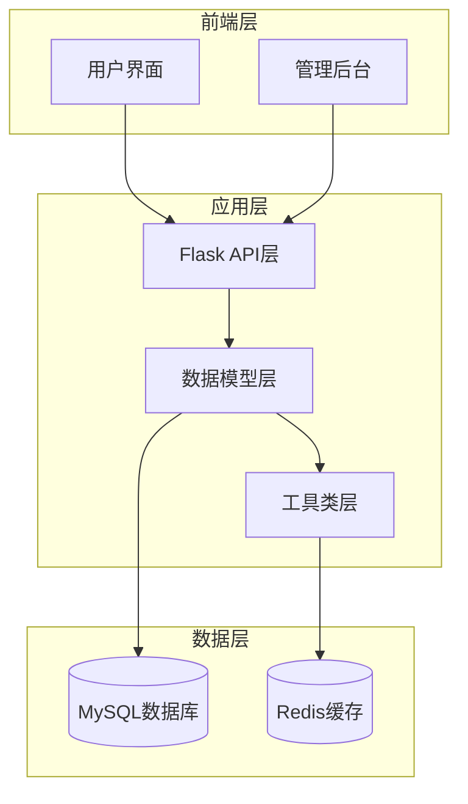
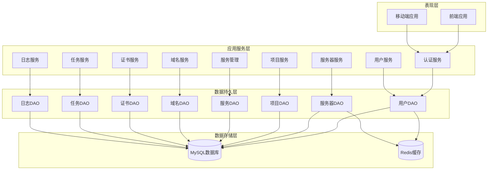
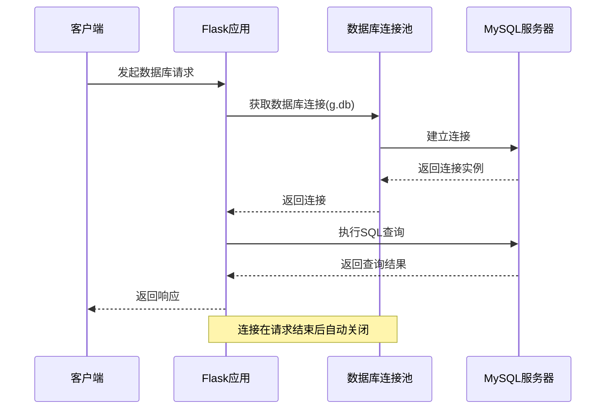
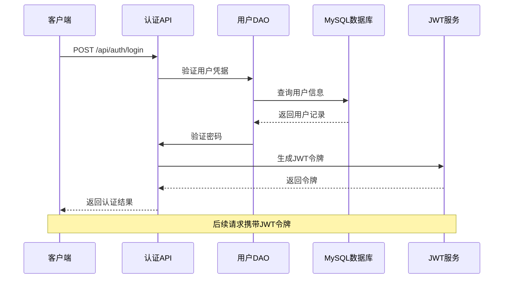
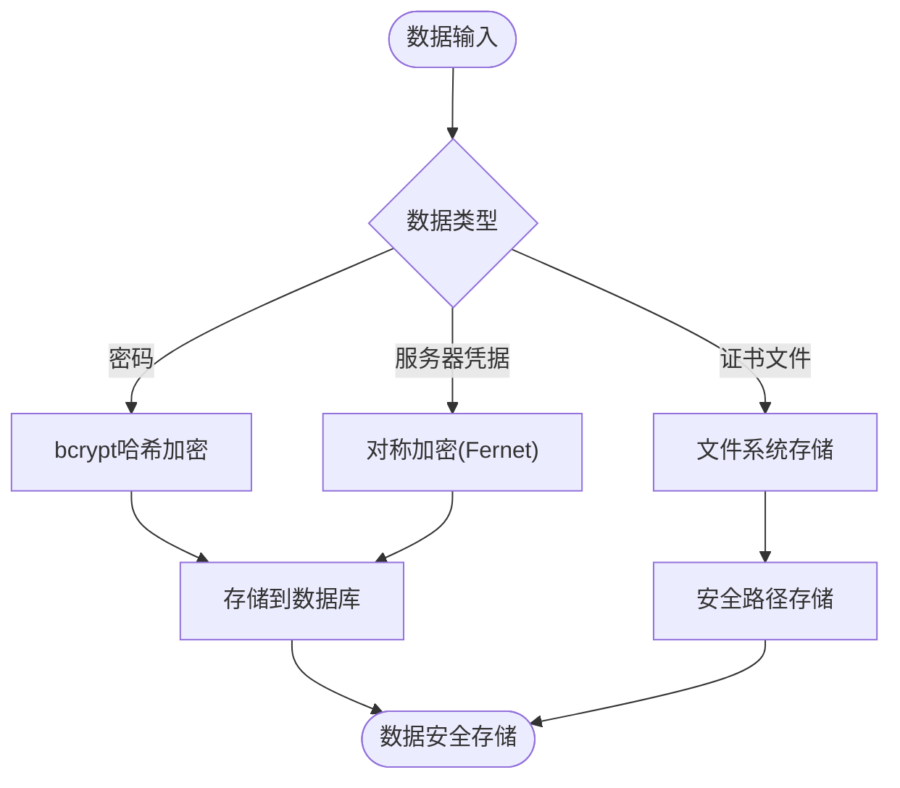
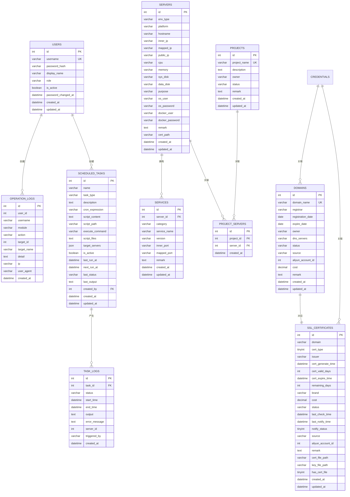
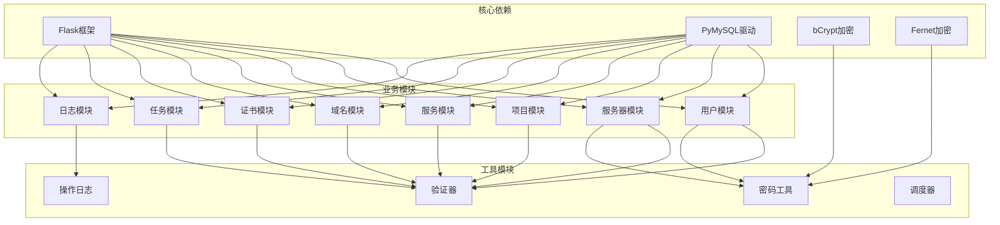

# 数据库表结构设计

<cite>
**本文档引用的文件**
- [init_db.py](file://backend/app/init_db.py)
- [users.py](file://backend/app/models/user.py)
- [db.py](file://backend/app/utils/db.py)
- [users_api.py](file://backend/app/api/users.py)
- [servers_api.py](file://backend/app/api/servers.py)
- [projects_api.py](file://backend/app/api/projects.py)
- [services_api.py](file://backend/app/api/services.py)
- [domains_api.py](file://backend/app/api/domains.py)
- [certs_api.py](file://backend/app/api/certs.py)
- [tasks_api.py](file://backend/app/api/tasks.py)
- [operation_logs_api.py](file://backend/app/api/operation_logs.py)
- [password_utils.py](file://backend/app/utils/password_utils.py)
- [validators.py](file://backend/app/utils/validators.py)
- [config.py](file://backend/app/config.py)
</cite>

## 目录
1. [简介](#简介)
2. [项目结构](#项目结构)
3. [核心数据表设计](#核心数据表设计)
4. [架构概览](#架构概览)
5. [详细组件分析](#详细组件分析)
6. [依赖关系分析](#依赖关系分析)
7. [性能考虑](#性能考虑)
8. [故障排除指南](#故障排除指南)
9. [结论](#结论)

## 简介

OPS项目是一个综合性的运维管理平台，采用Python Flask框架构建，使用MySQL作为主要数据库存储。本项目旨在为企业提供统一的运维管理解决方案，涵盖用户管理、服务器资产管理、项目管理、服务管理、域名证书管理、定时任务调度等多个核心功能模块。

项目采用现代化的数据库设计理念，通过清晰的表结构设计和严格的外键约束，确保数据的一致性和完整性。所有敏感信息都经过加密处理，包括用户密码、服务器凭据等关键数据。

## 项目结构

项目采用典型的三层架构设计：

**图表来源**
- [init_db.py:1-50](file://backend/app/init_db.py#L1-L50)
- [db.py:43-80](file://backend/app/utils/db.py#L43-L80)

**章节来源**
- [init_db.py:1-50](file://backend/app/init_db.py#L1-L50)
- [config.py:10-58](file://backend/app/config.py#L10-L58)

## 核心数据表设计

### 用户表 (users)

用户表是整个系统的身份认证核心，存储所有系统用户的注册信息和权限控制数据。

| 字段名 | 数据类型 | 约束条件 | 索引 | 注释 |
|--------|----------|----------|------|------|
| id | INT | AUTO_INCREMENT, PRIMARY KEY | - | 自增主键 |
| username | VARCHAR(20) | NOT NULL, UNIQUE | idx_username | 用户名，唯一标识 |
| password_hash | VARCHAR(255) | NOT NULL | - | 密码哈希值 |
| display_name | VARCHAR(100) | NOT NULL | - | 显示名称 |
| role | VARCHAR(50) | NOT NULL, DEFAULT 'operator' | idx_role | 角色：admin/operator/viewer |
| is_active | BOOLEAN | DEFAULT TRUE | - | 是否激活状态 |
| password_changed_at | DATETIME | NULL | - | 密码修改时间，用于作废旧令牌 |
| created_at | DATETIME | DEFAULT CURRENT_TIMESTAMP | - | 创建时间 |
| updated_at | DATETIME | DEFAULT CURRENT_TIMESTAMP ON UPDATE CURRENT_TIMESTAMP | - | 更新时间 |

**外键约束**: 无
**业务含义**: 存储用户的基本信息和权限级别，支持三种角色权限体系

**章节来源**
- [init_db.py:34-48](file://backend/app/init_db.py#L34-L48)
- [users.py:8-33](file://backend/app/models/user.py#L8-L33)

### 服务器表 (servers)

服务器台账表用于管理所有物理服务器和虚拟机的硬件配置信息。

| 字段名 | 数据类型 | 约束条件 | 索引 | 注释 |
|--------|----------|----------|------|------|
| id | INT | AUTO_INCREMENT, PRIMARY KEY | - | 自增主键 |
| env_type | VARCHAR(50) | NOT NULL | idx_env_type | 环境类型：测试/生产/智慧环保/水电集团 |
| platform | VARCHAR(100) | - | - | 平台信息 |
| hostname | VARCHAR(255) | - | - | 主机名 |
| inner_ip | VARCHAR(100) | - | idx_inner_ip | 内网IP地址 |
| mapped_ip | VARCHAR(100) | - | - | 云平台映射IP |
| public_ip | VARCHAR(100) | - | - | 公网IP地址 |
| cpu | VARCHAR(50) | - | - | CPU配置信息 |
| memory | VARCHAR(50) | - | - | 内存配置信息 |
| sys_disk | VARCHAR(50) | - | - | 系统盘信息 |
| data_disk | VARCHAR(50) | - | - | 数据盘信息 |
| purpose | VARCHAR(500) | - | - | 用途说明 |
| os_user | VARCHAR(100) | - | - | 系统账户 |
| os_password | VARCHAR(255) | - | - | 系统密码（加密存储） |
| docker_user | VARCHAR(100) | - | - | Docker用户 |
| docker_password | VARCHAR(255) | - | - | Docker密码（加密存储） |
| remark | TEXT | - | - | 备注信息 |
| cert_path | VARCHAR(255) | NULL | - | 证书路径 |
| created_at | DATETIME | DEFAULT CURRENT_TIMESTAMP | - | 创建时间 |
| updated_at | DATETIME | DEFAULT CURRENT_TIMESTAMP ON UPDATE CURRENT_TIMESTAMP | - | 更新时间 |

**外键约束**: 无
**业务含义**: 记录服务器的完整硬件配置和网络信息，支持多环境分类管理

**章节来源**
- [init_db.py:52-76](file://backend/app/init_db.py#L52-L76)
- [servers_api.py:327-336](file://backend/app/api/servers.py#L327-L336)

### 项目管理表 (projects)

项目管理表用于组织和管理业务项目，支持多项目并行管理。

| 字段名 | 数据类型 | 约束条件 | 索引 | 注释 |
|--------|----------|----------|------|------|
| id | INT | AUTO_INCREMENT, PRIMARY KEY | - | 自增主键 |
| project_name | VARCHAR(200) | NOT NULL, UNIQUE | idx_project_name | 项目名称，唯一标识 |
| description | TEXT | - | - | 项目描述 |
| owner | VARCHAR(100) | - | - | 项目负责人 |
| status | VARCHAR(50) | DEFAULT '运行中' | idx_status | 项目状态 |
| remark | TEXT | - | - | 备注信息 |
| created_at | DATETIME | DEFAULT CURRENT_TIMESTAMP | - | 创建时间 |
| updated_at | DATETIME | DEFAULT CURRENT_TIMESTAMP ON UPDATE CURRENT_TIMESTAMP | - | 更新时间 |

**外键约束**: 无
**业务含义**: 存储项目基本信息，支持项目生命周期管理和状态跟踪

**章节来源**
- [init_db.py:80-92](file://backend/app/init_db.py#L80-L92)
- [projects_api.py:119-125](file://backend/app/api/projects.py#L119-L125)

### 项目-服务器关联表 (project_servers)

这是一个多对多关系的中间表，用于建立项目与服务器之间的关联关系。

| 字段名 | 数据类型 | 约束条件 | 索引 | 注释 |
|--------|----------|----------|------|------|
| id | INT | AUTO_INCREMENT, PRIMARY KEY | - | 自增主键 |
| project_id | INT | NOT NULL | idx_project_id | 项目ID，外键 |
| server_id | INT | NOT NULL | idx_server_id | 服务器ID，外键 |
| created_at | DATETIME | DEFAULT CURRENT_TIMESTAMP | - | 关联创建时间 |

**外键约束**: 
- FOREIGN KEY (project_id) REFERENCES projects(id) ON DELETE CASCADE
- FOREIGN KEY (server_id) REFERENCES servers(id) ON DELETE CASCADE
**唯一约束**: uk_project_server (project_id, server_id)
**业务含义**: 实现项目与服务器的多对多关联，支持灵活的资源配置

**章节来源**
- [init_db.py:96-107](file://backend/app/init_db.py#L96-L107)

### 服务清单表 (services)

服务清单表用于管理部署在服务器上的各种应用程序和服务。

| 字段名 | 数据类型 | 约束条件 | 索引 | 注释 |
|--------|----------|----------|------|------|
| id | INT | AUTO_INCREMENT, PRIMARY KEY | - | 自增主键 |
| server_id | INT | NOT NULL | idx_server_id | 所属服务器ID，外键 |
| category | VARCHAR(100) | - | - | 服务分类 |
| service_name | VARCHAR(200) | NOT NULL | idx_service_name | 服务名称 |
| version | VARCHAR(100) | - | - | 版本信息 |
| inner_port | VARCHAR(200) | - | - | 内网端口 |
| mapped_port | VARCHAR(200) | - | - | 外网映射端口 |
| remark | TEXT | - | - | 备注信息 |
| created_at | DATETIME | DEFAULT CURRENT_TIMESTAMP | - | 创建时间 |
| updated_at | DATETIME | DEFAULT CURRENT_TIMESTAMP ON UPDATE CURRENT_TIMESTAMP | - | 更新时间 |

**外键约束**: 
- FOREIGN KEY (server_id) REFERENCES servers(id) ON DELETE CASCADE
**业务含义**: 记录服务的部署信息和网络配置，支持服务发现和管理

**章节来源**
- [init_db.py:111-126](file://backend/app/init_db.py#L111-L126)
- [services_api.py:103-108](file://backend/app/api/services.py#L103-L108)

### 域名管理表 (domains)

域名管理表用于跟踪和管理企业的域名资产。

| 字段名 | 数据类型 | 约束条件 | 索引 | 注释 |
|--------|----------|----------|------|------|
| id | INT | AUTO_INCREMENT, PRIMARY KEY | - | 自增主键 |
| domain_name | VARCHAR(255) | NOT NULL, UNIQUE | idx_domain_name | 域名 |
| registrar | VARCHAR(200) | - | - | 注册商 |
| registration_date | DATE | - | - | 注册日期 |
| expire_date | DATE | - | - | 到期日期 |
| owner | VARCHAR(200) | - | - | 持有者 |
| dns_servers | VARCHAR(500) | - | - | DNS服务器 |
| status | VARCHAR(50) | DEFAULT '正常' | idx_status | 状态 |
| source | VARCHAR(20) | DEFAULT 'manual' | - | 来源：manual/aliyun |
| aliyun_account_id | INT | - | - | 阿里云账户ID |
| cost | DECIMAL(10,2) | - | - | 费用 |
| remark | TEXT | - | - | 备注信息 |
| created_at | DATETIME | DEFAULT CURRENT_TIMESTAMP | - | 创建时间 |
| updated_at | DATETIME | DEFAULT CURRENT_TIMESTAMP ON UPDATE CURRENT_TIMESTAMP | - | 更新时间 |

**外键约束**: 无
**业务含义**: 统一管理域名资产，支持到期提醒和费用跟踪

**章节来源**
- [init_db.py:307-325](file://backend/app/init_db.py#L307-L325)
- [domains_api.py:162-178](file://backend/app/api/domains.py#L162-L178)

### SSL证书管理表 (ssl_certificates)

SSL证书管理表用于跟踪和管理各种SSL/TLS证书。

| 字段名 | 数据类型 | 约束条件 | 索引 | 注释 |
|--------|----------|----------|------|------|
| id | INT | AUTO_INCREMENT, PRIMARY KEY | - | 自增主键 |
| domain | VARCHAR(255) | NOT NULL | idx_domain | 域名 |
| cert_type | TINYINT | DEFAULT 0 | idx_cert_type | 证书类型：0自动检测/1手动录入/2阿里云证书 |
| issuer | VARCHAR(200) | - | - | 颁发机构 |
| cert_generate_time | DATETIME | - | - | 证书生成时间 |
| cert_valid_days | INT | - | - | 有效期天数 |
| cert_expire_time | DATETIME | - | idx_expire_time | 证书到期时间 |
| remaining_days | INT | - | - | 剩余天数 |
| brand | VARCHAR(100) | - | - | 品牌 |
| cost | DECIMAL(10,2) | - | - | 费用 |
| status | VARCHAR(50) | DEFAULT '正常' | idx_status | 状态 |
| last_check_time | DATETIME | - | - | 最后检测时间 |
| last_notify_time | DATETIME | - | - | 最后通知时间 |
| notify_status | TINYINT | DEFAULT 0 | - | 通知状态：0未通知/1已通知 |
| source | VARCHAR(20) | DEFAULT 'manual' | - | 来源：manual/auto/aliyun |
| aliyun_account_id | INT | - | - | 阿里云账户ID |
| remark | TEXT | - | - | 备注信息 |
| cert_file_path | VARCHAR(500) | - | - | 证书文件存储路径 |
| key_file_path | VARCHAR(500) | - | - | 私钥文件存储路径 |
| has_cert_file | TINYINT | DEFAULT 0 | - | 是否有证书文件：0无/1有 |
| created_at | DATETIME | DEFAULT CURRENT_TIMESTAMP | - | 创建时间 |
| updated_at | DATETIME | DEFAULT CURRENT_TIMESTAMP ON UPDATE CURRENT_TIMESTAMP | - | 更新时间 |

**外键约束**: 无
**业务含义**: 完整跟踪证书生命周期，支持自动检测和到期提醒

**章节来源**
- [init_db.py:329-357](file://backend/app/init_db.py#L329-L357)
- [certs_api.py:293-303](file://backend/app/api/certs.py#L293-L303)

### 定时任务表 (scheduled_tasks)

定时任务表用于管理系统中的计划任务和自动化作业。

| 字段名 | 数据类型 | 约束条件 | 索引 | 注释 |
|--------|----------|----------|------|------|
| id | INT | AUTO_INCREMENT, PRIMARY KEY | - | 自增主键 |
| name | VARCHAR(200) | NOT NULL | - | 任务名称 |
| task_type | VARCHAR(50) | NOT NULL | idx_task_type | 任务类型：script/sql/backup |
| description | TEXT | - | - | 任务描述 |
| cron_expression | VARCHAR(100) | NOT NULL | - | Cron表达式 |
| script_content | TEXT | - | - | 脚本内容或SQL语句 |
| script_path | VARCHAR(500) | - | - | 脚本路径（如果是文件） |
| execute_command | VARCHAR(500) | - | - | 自定义执行命令 |
| script_files | TEXT | - | - | JSON数组，存储多个脚本的相对路径 |
| target_servers | JSON | - | - | 目标服务器ID列表 |
| is_active | BOOLEAN | DEFAULT TRUE | idx_is_active | 是否启用 |
| last_run_at | DATETIME | - | - | 上次执行时间 |
| next_run_at | DATETIME | - | - | 下次执行时间 |
| last_status | VARCHAR(50) | - | - | 上次执行状态 |
| last_output | TEXT | - | - | 上次执行输出 |
| created_by | INT | - | - | 创建人ID |
| created_at | DATETIME | DEFAULT CURRENT_TIMESTAMP | - | 创建时间 |
| updated_at | DATETIME | DEFAULT CURRENT_TIMESTAMP ON UPDATE CURRENT_TIMESTAMP | - | 更新时间 |

**外键约束**: 
- FOREIGN KEY (created_by) REFERENCES users(id) ON DELETE SET NULL
**业务含义**: 提供强大的任务调度能力，支持多种任务类型和执行模式

**章节来源**
- [init_db.py:193-216](file://backend/app/init_db.py#L193-L216)
- [tasks_api.py:178-192](file://backend/app/api/tasks.py#L178-L192)

### 任务执行日志表 (task_logs)

任务执行日志表用于记录定时任务的执行历史和结果。

| 字段名 | 数据类型 | 约束条件 | 索引 | 注释 |
|--------|----------|----------|------|------|
| id | INT | AUTO_INCREMENT, PRIMARY KEY | - | 自增主键 |
| task_id | INT | NOT NULL | idx_task_id | 任务ID，外键 |
| status | VARCHAR(50) | NOT NULL | idx_status | 执行状态：pending/running/success/failed |
| start_time | DATETIME | - | - | 开始时间 |
| end_time | DATETIME | - | - | 结束时间 |
| output | TEXT | - | - | 执行输出 |
| error_message | TEXT | - | - | 错误信息 |
| server_id | INT | - | - | 执行服务器ID |
| triggered_by | VARCHAR(50) | - | - | 触发方式：schedule/manual |
| created_at | DATETIME | DEFAULT CURRENT_TIMESTAMP | idx_created_at | 记录创建时间 |

**外键约束**: 
- FOREIGN KEY (task_id) REFERENCES scheduled_tasks(id) ON DELETE CASCADE
**业务含义**: 完整记录任务执行过程，便于问题排查和审计

**章节来源**
- [init_db.py:220-236](file://backend/app/init_db.py#L220-L236)

### 操作日志表 (operation_logs)

操作日志表用于记录用户的所有关键操作，提供完整的审计追踪。

| 字段名 | 数据类型 | 约束条件 | 索引 | 注释 |
|--------|----------|----------|------|------|
| id | INT | AUTO_INCREMENT, PRIMARY KEY | - | 自增主键 |
| user_id | INT | - | idx_user_id | 操作用户ID |
| username | VARCHAR(100) | - | - | 操作用户名 |
| module | VARCHAR(100) | NOT NULL | idx_module | 操作模块：服务器/服务/应用/域名/证书/用户等 |
| action | VARCHAR(50) | NOT NULL | idx_action | 操作类型：create/update/delete/login等 |
| target_id | INT | - | - | 操作对象ID |
| target_name | VARCHAR(300) | - | - | 操作对象名称 |
| detail | TEXT | - | - | 操作详情(JSON) |
| ip | VARCHAR(50) | - | - | 操作IP |
| user_agent | VARCHAR(500) | - | - | 浏览器User-Agent |
| created_at | DATETIME | DEFAULT CURRENT_TIMESTAMP | idx_created_at | 操作时间 |

**外键约束**: 无
**业务含义**: 提供完整的操作审计功能，支持合规性要求和安全追踪

**章节来源**
- [init_db.py:240-257](file://backend/app/init_db.py#L240-L257)
- [operation_logs_api.py:68-76](file://backend/app/api/operation_logs.py#L68-L76)

### 字典表设计

项目还包含多个字典表，用于维护静态数据和枚举值：

#### 环境类型字典表 (dict_env_types)
- id: 主键
- name: 环境类型名称（唯一）
- sort_order: 排序号
- created_at: 创建时间

#### 平台字典表 (dict_platforms)
- id: 主键
- name: 平台名称（唯一）
- sort_order: 排序号
- created_at: 创建时间

#### 服务分类字典表 (dict_service_categories)
- id: 主键
- name: 服务分类名称（唯一）
- sort_order: 排序号
- created_at: 创建时间

#### 项目状态字典表 (dict_project_statuses)
- id: 主键
- name: 项目状态名称（唯一）
- sort_order: 排序号
- created_at: 创建时间

**章节来源**
- [init_db.py:130-170](file://backend/app/init_db.py#L130-L170)

## 架构概览

系统采用分层架构设计，各层职责明确，耦合度低：

**图表来源**
- [init_db.py:34-357](file://backend/app/init_db.py#L34-L357)
- [db.py:43-80](file://backend/app/utils/db.py#L43-L80)

## 详细组件分析

### 数据库连接管理

系统使用Flask应用上下文缓存数据库连接，确保连接的复用和高效管理：

**图表来源**
- [db.py:43-80](file://backend/app/utils/db.py#L43-L80)

**章节来源**
- [db.py:43-80](file://backend/app/utils/db.py#L43-L80)

### 用户认证流程

用户认证采用JWT令牌机制，结合密码哈希和会话管理：

**图表来源**
- [users_api.py:95-105](file://backend/app/api/users.py#L95-L105)
- [password_utils.py:52-91](file://backend/app/utils/password_utils.py#L52-L91)

**章节来源**
- [users_api.py:95-105](file://backend/app/api/users.py#L95-L105)
- [password_utils.py:52-91](file://backend/app/utils/password_utils.py#L52-L91)

### 数据加密策略

系统采用多层次的数据加密策略保护敏感信息：

**图表来源**
- [password_utils.py:52-130](file://backend/app/utils/password_utils.py#L52-L130)

**章节来源**
- [password_utils.py:52-130](file://backend/app/utils/password_utils.py#L52-L130)

### 外键约束和关系设计

系统通过严格的外键约束确保数据一致性：

**图表来源**
- [init_db.py:34-357](file://backend/app/init_db.py#L34-L357)

**章节来源**
- [init_db.py:34-357](file://backend/app/init_db.py#L34-L357)

## 依赖关系分析

系统各组件之间的依赖关系清晰明确：

**图表来源**
- [db.py:3-6](file://backend/app/utils/db.py#L3-L6)
- [password_utils.py:6-11](file://backend/app/utils/password_utils.py#L6-L11)

**章节来源**
- [db.py:3-6](file://backend/app/utils/db.py#L3-L6)
- [password_utils.py:6-11](file://backend/app/utils/password_utils.py#L6-L11)

## 性能考虑

### 索引优化策略

系统在关键查询字段上建立了适当的索引以提升查询性能：

- 用户表：username、role索引
- 服务器表：env_type、inner_ip索引  
- 项目表：project_name、status索引
- 关联表：多字段组合索引
- 服务表：server_id、service_name索引
- 域名表：domain_name、status索引
- 证书表：domain、cert_type、expire_time、status索引
- 任务表：task_type、is_active索引
- 日志表：user_id、module、action、created_at索引

### 查询优化建议

1. **分页查询**：所有列表查询都支持分页，避免一次性加载大量数据
2. **条件过滤**：提供多维度查询参数，减少不必要的数据传输
3. **连接优化**：使用LEFT JOIN和INNER JOIN结合，确保查询效率
4. **缓存策略**：敏感数据采用连接池缓存，减少连接开销

### 安全性考虑

1. **SQL注入防护**：所有数据库操作使用参数化查询
2. **数据加密**：敏感信息采用多层加密策略
3. **权限控制**：基于角色的访问控制机制
4. **审计追踪**：完整操作日志记录

## 故障排除指南

### 常见数据库问题

**连接失败**
- 检查数据库配置参数
- 验证网络连通性
- 确认数据库服务状态

**查询超时**
- 检查索引是否合理
- 优化复杂查询语句
- 调整数据库连接池配置

**数据不一致**
- 检查外键约束
- 验证事务处理
- 确认数据同步机制

### 性能调优

**慢查询诊断**
- 使用EXPLAIN分析查询计划
- 检查索引使用情况
- 优化WHERE条件和JOIN顺序

**内存优化**
- 调整连接池大小
- 优化查询结果集
- 合理使用LIMIT

**章节来源**
- [db.py:58-68](file://backend/app/utils/db.py#L58-L68)
- [validators.py:6-38](file://backend/app/utils/validators.py#L6-L38)

## 结论

OPS项目的数据库表结构设计体现了现代企业级应用的最佳实践。通过清晰的表结构设计、严格的外键约束、完善的索引策略和多层次的安全保护，系统能够稳定可靠地支撑各类运维管理场景。

关键设计亮点包括：
- **模块化设计**：每个业务模块都有独立的数据表，职责清晰
- **强一致性**：通过外键约束确保数据完整性
- **安全性**：多层加密策略保护敏感数据
- **可扩展性**：合理的索引设计支持未来业务增长
- **可观测性**：完整的操作日志提供审计追踪

该数据库设计方案为OPS项目的长期发展奠定了坚实的基础，能够满足企业级运维管理的各种需求，并为后续的功能扩展提供了良好的架构支撑。