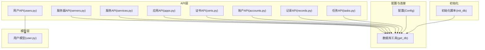
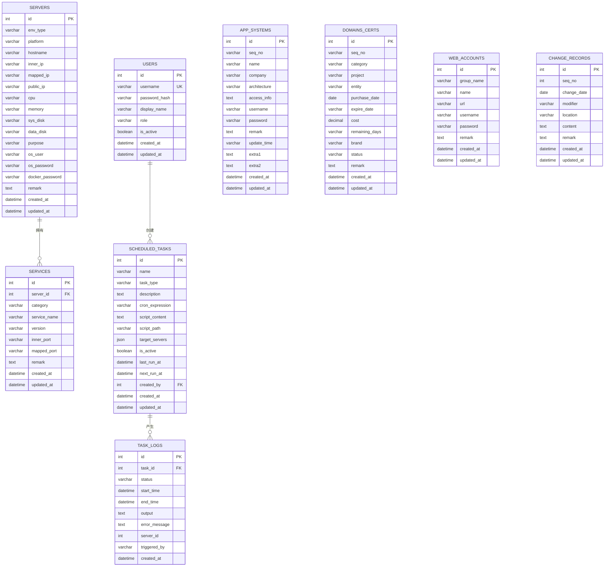
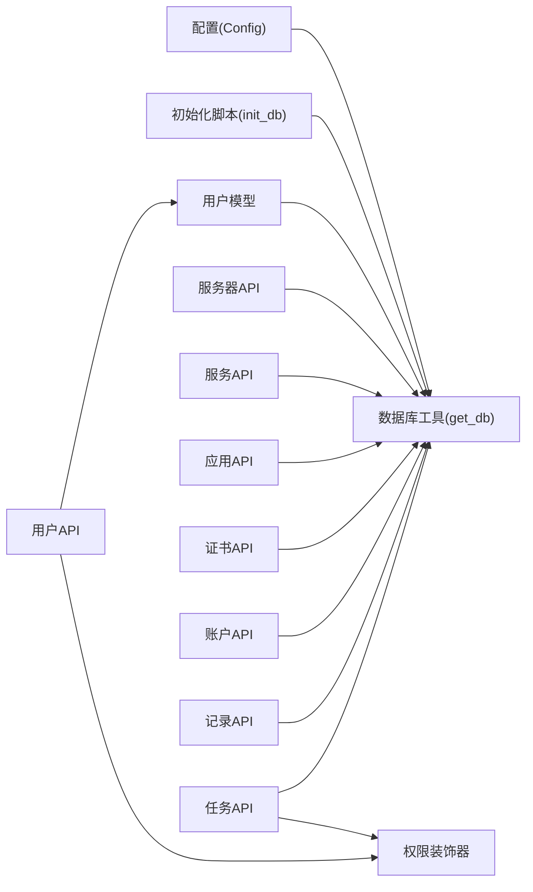
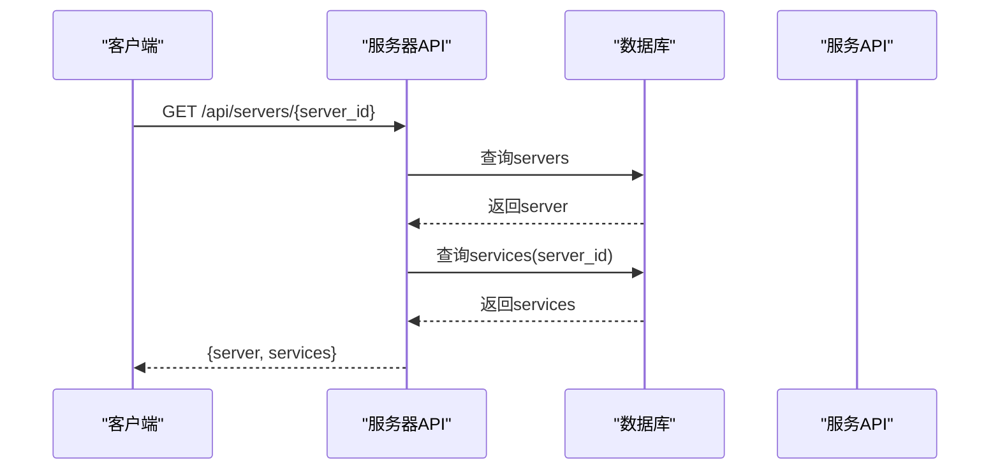
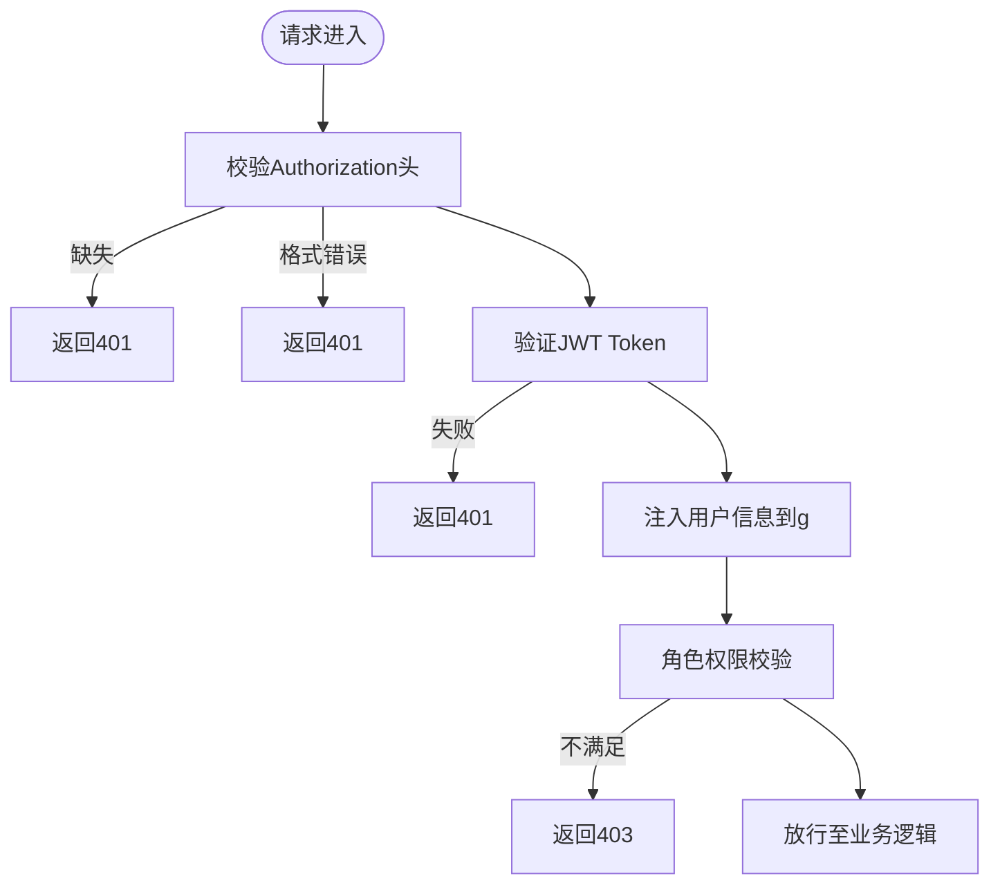

# 数据库设计

<cite>
**本文引用的文件**
- [backend/init_db.py](file://backend/init_db.py)
- [backend/app/utils/db.py](file://backend/app/utils/db.py)
- [backend/app/config.py](file://backend/app/config.py)
- [backend/app/models/user.py](file://backend/app/models/user.py)
- [backend/app/api/users.py](file://backend/app/api/users.py)
- [backend/app/api/servers.py](file://backend/app/api/servers.py)
- [backend/app/api/services.py](file://backend/app/api/services.py)
- [backend/app/api/accounts.py](file://backend/app/api/accounts.py)
- [backend/app/api/apps.py](file://backend/app/api/apps.py)
- [backend/app/api/certs.py](file://backend/app/api/certs.py)
- [backend/app/api/records.py](file://backend/app/api/records.py)
- [backend/app/api/tasks.py](file://backend/app/api/tasks.py)
- [backend/app/utils/decorators.py](file://backend/app/utils/decorators.py)
</cite>

## 目录
1. [简介](#简介)
2. [项目结构](#项目结构)
3. [核心组件](#核心组件)
4. [架构总览](#架构总览)
5. [详细组件分析](#详细组件分析)
6. [依赖分析](#依赖分析)
7. [性能考虑](#性能考虑)
8. [故障排查指南](#故障排查指南)
9. [结论](#结论)
10. [附录](#附录)

## 简介
本文件为云运维平台的数据库设计文档，基于后端初始化脚本与API实现，系统性梳理数据库表结构、字段定义、索引与约束、表间关系、业务规则、查询优化与数据完整性保障，并给出迁移与版本管理建议、安全与备份恢复思路以及性能监控指标。

## 项目结构
后端采用Flask微服务风格，数据库初始化由独立脚本完成，各功能模块通过统一的数据库工具获取连接，API层负责业务逻辑与权限控制，模型层封装用户相关数据库操作。

**图表来源**
- [backend/app/config.py:1-21](file://backend/app/config.py#L1-L21)
- [backend/app/utils/db.py:1-17](file://backend/app/utils/db.py#L1-L17)
- [backend/init_db.py:1-230](file://backend/init_db.py#L1-L230)
- [backend/app/api/users.py:1-268](file://backend/app/api/users.py#L1-L268)
- [backend/app/api/servers.py:1-203](file://backend/app/api/servers.py#L1-L203)
- [backend/app/api/services.py:1-144](file://backend/app/api/services.py#L1-L144)
- [backend/app/api/apps.py:1-141](file://backend/app/api/apps.py#L1-L141)
- [backend/app/api/certs.py:1-145](file://backend/app/api/certs.py#L1-L145)
- [backend/app/api/accounts.py:1-141](file://backend/app/api/accounts.py#L1-L141)
- [backend/app/api/records.py:1-114](file://backend/app/api/records.py#L1-L114)
- [backend/app/api/tasks.py:1-458](file://backend/app/api/tasks.py#L1-L458)
- [backend/app/models/user.py:1-183](file://backend/app/models/user.py#L1-L183)

**章节来源**
- [backend/app/config.py:1-21](file://backend/app/config.py#L1-L21)
- [backend/app/utils/db.py:1-17](file://backend/app/utils/db.py#L1-L17)
- [backend/init_db.py:1-230](file://backend/init_db.py#L1-L230)

## 核心组件
- 数据库连接与配置：通过配置类读取环境变量，数据库工具按需建立连接。
- 初始化脚本：集中创建数据库与全部表结构，设置索引与外键约束，插入默认管理员账户。
- 权限装饰器：统一鉴权与角色校验，确保API访问安全。
- 模型与API：用户模型封装数据库操作；各API模块负责查询、过滤、分页与事务控制。

**章节来源**
- [backend/app/config.py:1-21](file://backend/app/config.py#L1-L21)
- [backend/app/utils/db.py:1-17](file://backend/app/utils/db.py#L1-L17)
- [backend/app/utils/decorators.py:1-95](file://backend/app/utils/decorators.py#L1-L95)
- [backend/app/models/user.py:1-183](file://backend/app/models/user.py#L1-L183)

## 架构总览
数据库层由初始化脚本一次性构建，表之间通过主外键形成清晰的层次关系：用户表支撑权限体系；服务器与服务表构成基础设施与应用服务的两级关联；应用系统、域名证书、Web账户与更新记录分别承载业务资产与变更追踪；定时任务与任务日志支撑自动化运维闭环。

**图表来源**
- [backend/init_db.py:33-211](file://backend/init_db.py#L33-L211)

## 详细组件分析

### 用户表 users
- 字段与约束
  - 主键自增id
  - 唯一索引username
  - 角色role默认operator，支持admin/operator/viewer
  - is_active布尔开关
  - 自动时间戳created_at/updated_at
- 用途与业务规则
  - 存储平台用户身份、角色与状态
  - 定时任务创建者外键引用
- 查询与索引
  - idx_username用于登录与唯一性校验
  - idx_role用于按角色筛选
- 安全要点
  - 密码以哈希形式存储
  - API层对角色与权限严格校验

**章节来源**
- [backend/init_db.py:34-46](file://backend/init_db.py#L34-L46)
- [backend/app/models/user.py:8-37](file://backend/app/models/user.py#L8-L37)
- [backend/app/api/users.py:17-96](file://backend/app/api/users.py#L17-L96)

### 服务器台账表 servers
- 字段与约束
  - 主键自增id
  - 多字段描述服务器硬件与网络信息
  - 环境类型env_type与内网IP内网IP建立索引
- 用途与业务规则
  - 统一登记服务器资源，支持按环境与检索条件查询
- 查询与索引
  - idx_env_type用于按环境筛选
  - idx_inner_ip用于快速定位内网IP

**章节来源**
- [backend/init_db.py:50-72](file://backend/init_db.py#L50-L72)
- [backend/app/api/servers.py:11-43](file://backend/app/api/servers.py#L11-L43)

### 服务清单表 services
- 字段与约束
  - 主键自增id
  - 外键server_id指向servers(id)，级联删除
  - 服务名称与分类等字段
  - 索引idx_server_id、idx_service_name
- 用途与业务规则
  - 记录运行在服务器上的具体服务及其端口映射
- 查询与索引
  - idx_server_id用于按服务器聚合查询
  - idx_service_name用于模糊搜索

**章节来源**
- [backend/init_db.py:76-91](file://backend/init_db.py#L76-L91)
- [backend/app/api/services.py:11-46](file://backend/app/api/services.py#L11-L46)

### 应用系统台账表 app_systems
- 字段与约束
  - 主键自增id
  - name建立前缀索引以支持全文检索
  - 包含架构、访问信息、账号密码等
- 用途与业务规则
  - 登记应用系统基础信息与凭证
- 查询与索引
  - idx_name用于按名称检索

**章节来源**
- [backend/init_db.py:110-129](file://backend/init_db.py#L110-L129)
- [backend/app/api/apps.py:11-39](file://backend/app/api/apps.py#L11-L39)

### 域名与证书表 domains_certs
- 字段与约束
  - 主键自增id
  - 分类category与状态status建立索引
- 用途与业务规则
  - 记录域名、证书相关信息与有效期
- 查询与索引
  - idx_category与idx_status用于分类与状态筛选

**章节来源**
- [backend/init_db.py:131-151](file://backend/init_db.py#L131-L151)
- [backend/app/api/certs.py:11-43](file://backend/app/api/certs.py#L11-L43)

### Web账户表 web_accounts
- 字段与约束
  - 主键自增id
  - group_name建立索引
- 用途与业务规则
  - 统一管理各类Web系统的账号与密码
- 查询与索引
  - idx_group_name用于按分组检索

**章节来源**
- [backend/init_db.py:94-108](file://backend/init_db.py#L94-L108)
- [backend/app/api/accounts.py:11-43](file://backend/app/api/accounts.py#L11-L43)

### 更新记录表 change_records
- 字段与约束
  - 主键自增id
  - seq_no、change_date、modifier建立索引
- 用途与业务规则
  - 记录运维变更流水，支持按日期倒序查看
- 查询与索引
  - idx_change_date与idx_modifier用于高效检索

**章节来源**
- [backend/init_db.py:153-168](file://backend/init_db.py#L153-L168)
- [backend/app/api/records.py:20-52](file://backend/app/api/records.py#L20-L52)

### 定时任务表 scheduled_tasks
- 字段与约束
  - 主键自增id
  - 外键created_by引用users(id)，删除设空
  - JSON字段target_servers存储目标服务器列表
  - 索引idx_task_type、idx_is_active
- 用途与业务规则
  - 定义可调度的脚本/SQL任务，支持启停与手动执行
- 查询与索引
  - idx_task_type与idx_is_active用于任务筛选与调度

**章节来源**
- [backend/init_db.py:170-191](file://backend/init_db.py#L170-L191)
- [backend/app/api/tasks.py:33-60](file://backend/app/api/tasks.py#L33-L60)

### 任务执行日志表 task_logs
- 字段与约束
  - 主键自增id
  - 外键task_id指向scheduled_tasks(id)，级联删除
  - 索引idx_task_id、idx_status、idx_created_at
- 用途与业务规则
  - 记录每次任务执行的开始、结束、状态与输出
- 查询与索引
  - idx_task_id用于按任务聚合日志
  - idx_status与idx_created_at用于状态统计与时间序列分析

**章节来源**
- [backend/init_db.py:193-211](file://backend/init_db.py#L193-L211)
- [backend/app/api/tasks.py:423-457](file://backend/app/api/tasks.py#L423-L457)

## 依赖分析
- 连接与配置
  - 配置类提供数据库连接参数，数据库工具按需建立连接，避免全局状态污染。
- 初始化与运行时
  - 初始化脚本集中创建数据库与表结构，运行时API通过统一工具获取连接。
- 权限与安全
  - 权限装饰器在API层统一拦截，结合角色校验确保最小权限访问。
- 外键与一致性
  - 服务器-服务、用户-任务、任务-日志的外键关系保证级联删除与引用完整性。

**图表来源**
- [backend/app/config.py:1-21](file://backend/app/config.py#L1-L21)
- [backend/app/utils/db.py:1-17](file://backend/app/utils/db.py#L1-L17)
- [backend/init_db.py:1-230](file://backend/init_db.py#L1-L230)
- [backend/app/api/users.py:1-268](file://backend/app/api/users.py#L1-L268)
- [backend/app/api/tasks.py:1-458](file://backend/app/api/tasks.py#L1-L458)
- [backend/app/utils/decorators.py:1-95](file://backend/app/utils/decorators.py#L1-L95)
- [backend/app/models/user.py:1-183](file://backend/app/models/user.py#L1-L183)

**章节来源**
- [backend/app/config.py:1-21](file://backend/app/config.py#L1-L21)
- [backend/app/utils/db.py:1-17](file://backend/app/utils/db.py#L1-L17)
- [backend/app/utils/decorators.py:1-95](file://backend/app/utils/decorators.py#L1-L95)

## 性能考虑
- 索引策略
  - 高频过滤字段建立单列索引：users(idx_username, idx_role)、servers(idx_env_type, idx_inner_ip)、services(idx_server_id, idx_service_name)、domains_certs(idx_category, idx_status)、web_accounts(idx_group_name)、change_records(idx_change_date, idx_modifier)、scheduled_tasks(idx_task_type, idx_is_active)、task_logs(idx_task_id, idx_status, idx_created_at)。
  - 对长文本字段进行前缀索引（如app_systems.idx_name），平衡索引大小与查询效率。
- 查询优化
  - API层广泛使用参数化查询，避免SQL注入；对模糊匹配使用LIKE与通配符，必要时配合全文索引或搜索引擎。
  - 关联查询尽量限定字段，减少JOIN开销；对大结果集分页与排序。
- 事务与并发
  - 写操作使用显式事务，异常时回滚；批量导入使用批量插入提升吞吐。
- 缓存与异步
  - 对热点读取（如服务器列表、任务状态）引入缓存；耗时任务采用异步执行与日志追踪。
- 监控指标
  - QPS、慢查询、连接数、锁等待、磁盘IO、缓冲池命中率、索引选择性与碎片率。

[本节为通用指导，无需特定文件来源]

## 故障排查指南
- 连接问题
  - 检查配置项DB_HOST/DB_PORT/DB_USER/DB_PASSWORD/DB_NAME是否正确；确认数据库服务可达。
- 权限与认证
  - 确认请求头携带有效的Bearer Token；核对角色权限；避免越权访问。
- 外键约束
  - 删除父表记录前先清理子表关联；检查外键引用是否被其他表使用。
- 事务与回滚
  - 写操作异常时检查rollback调用；关注并发写冲突导致的死锁。
- 日志与追踪
  - 查看任务日志表task_logs的状态与错误信息；定位执行失败原因。

**章节来源**
- [backend/app/utils/db.py:5-17](file://backend/app/utils/db.py#L5-L17)
- [backend/app/utils/decorators.py:9-57](file://backend/app/utils/decorators.py#L9-L57)
- [backend/app/api/tasks.py:309-420](file://backend/app/api/tasks.py#L309-L420)

## 结论
该数据库设计围绕“基础设施—应用服务—运维资产—自动化执行”的主线，通过明确的主外键关系与索引策略，满足多维度查询与高并发场景需求。配合完善的权限控制、事务处理与日志追踪，能够有效保障数据完整性与系统稳定性。建议在生产环境中进一步引入备份策略、容量规划与性能基线监控。

[本节为总结性内容，无需特定文件来源]

## 附录

### 表结构与字段说明（摘要）
- users：用户身份、角色与状态；索引username、role。
- servers：服务器资源与网络信息；索引env_type、inner_ip。
- services：服务清单；索引server_id、service_name；外键server_id。
- app_systems：应用系统信息；索引name。
- domains_certs：域名与证书；索引category、status。
- web_accounts：Web账户；索引group_name。
- change_records：更新记录；索引change_date、modifier。
- scheduled_tasks：定时任务；索引task_type、is_active；外键created_by。
- task_logs：任务日志；索引task_id、status、created_at；外键task_id。

**章节来源**
- [backend/init_db.py:33-211](file://backend/init_db.py#L33-L211)

### 查询流程示例（服务器详情）

**图表来源**
- [backend/app/api/servers.py:46-78](file://backend/app/api/servers.py#L46-L78)

### 权限控制流程

**图表来源**
- [backend/app/utils/decorators.py:9-57](file://backend/app/utils/decorators.py#L9-L57)

### 数据迁移与版本管理建议
- 版本化迁移
  - 以增量SQL脚本维护schema演进，命名规范如v1.0.0.sql、v1.0.1.sql，记录变更说明。
- 回滚策略
  - 为破坏性变更准备逆向SQL；对重要变更先在测试环境验证。
- 数据一致性
  - 迁移前后对比主键与关键字段；导出/导入时锁定表或使用只读快照。
- 自动化
  - 将迁移脚本集成到部署流程，记录执行时间与结果。

[本节为通用指导，无需特定文件来源]

### 数据安全与备份恢复
- 安全
  - 最小权限原则；敏感字段（密码、口令）仅在传输与存储时加密；定期轮换密钥。
- 备份
  - 全量+增量备份策略；定期校验恢复演练；异地容灾。
- 监控
  - 异常登录、频繁失败、慢查询、连接数峰值等告警。

[本节为通用指导，无需特定文件来源]