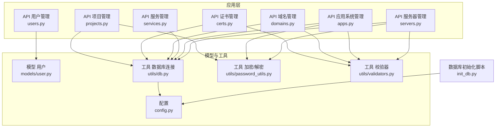
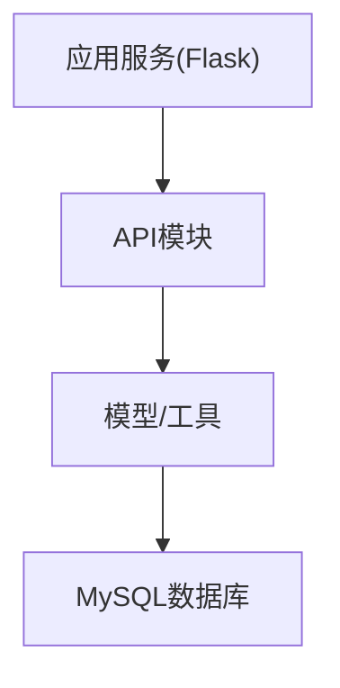
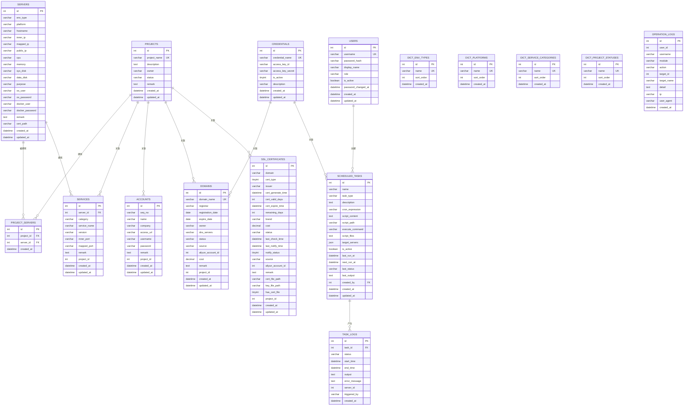
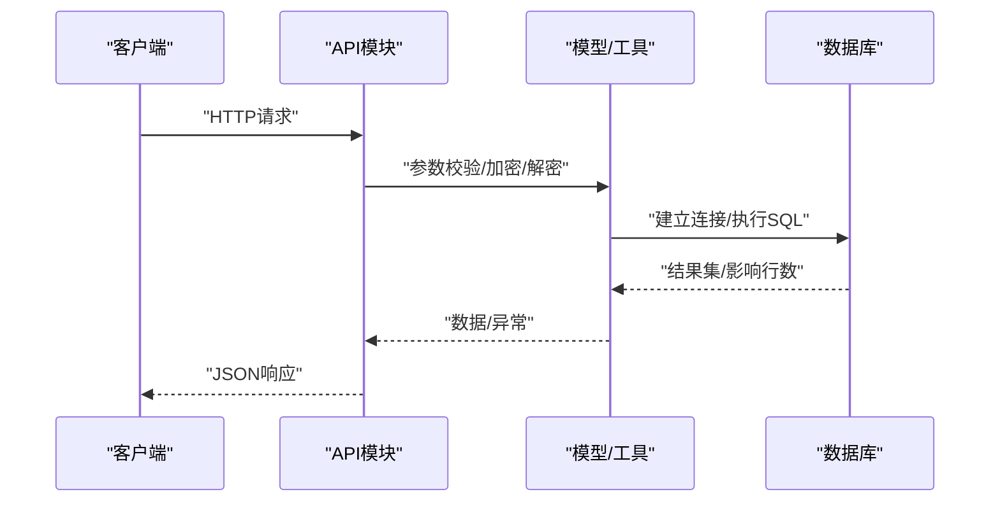
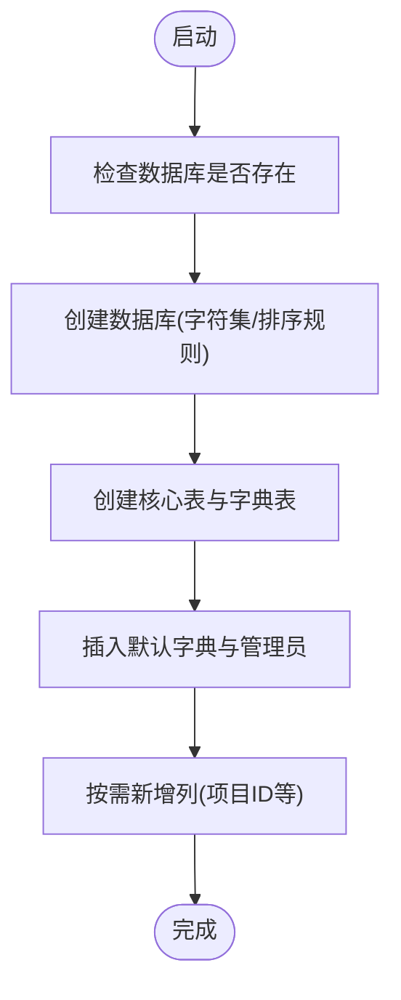
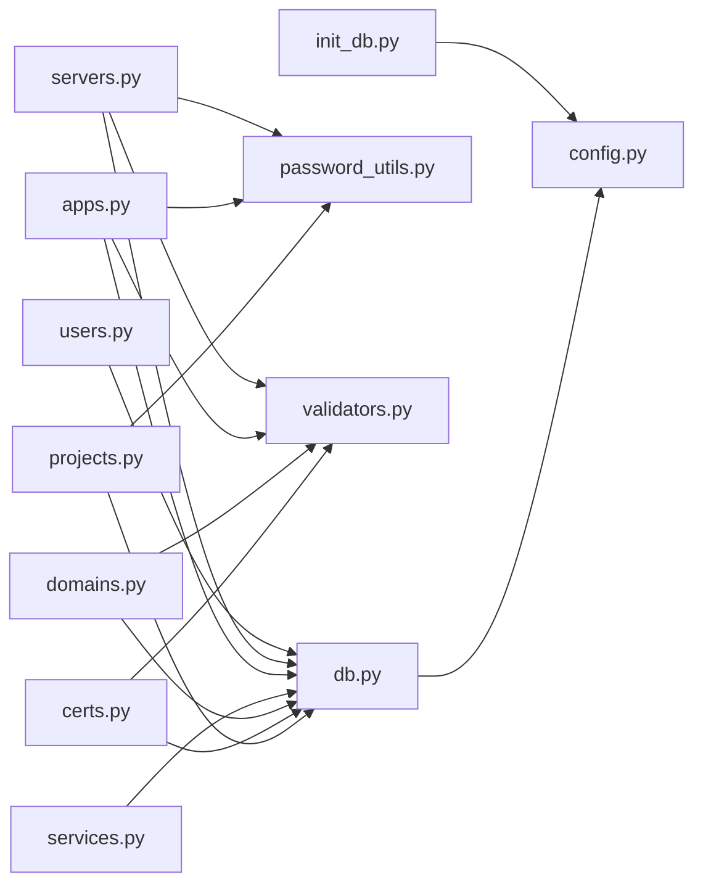

# 数据库设计

<cite>
**本文引用的文件**
- [init_db.py](file://backend/init_db.py)
- [db.py](file://backend/app/utils/db.py)
- [config.py](file://backend/app/config.py)
- [user.py](file://backend/app/models/user.py)
- [users.py](file://backend/app/api/users.py)
- [servers.py](file://backend/app/api/servers.py)
- [apps.py](file://backend/app/api/apps.py)
- [services.py](file://backend/app/api/services.py)
- [domains.py](file://backend/app/api/domains.py)
- [certs.py](file://backend/app/api/certs.py)
- [projects.py](file://backend/app/api/projects.py)
- [password_utils.py](file://backend/app/utils/password_utils.py)
- [validators.py](file://backend/app/utils/validators.py)
</cite>

## 目录
1. [简介](#简介)
2. [项目结构](#项目结构)
3. [核心组件](#核心组件)
4. [架构总览](#架构总览)
5. [详细组件分析](#详细组件分析)
6. [依赖分析](#依赖分析)
7. [性能考虑](#性能考虑)
8. [故障排查指南](#故障排查指南)
9. [结论](#结论)
10. [附录](#附录)

## 简介
本文件面向OPS项目，提供数据库设计的完整说明，覆盖用户、服务器、应用、服务、证书、域名、项目及字典表等核心数据模型。文档包含ER关系图、字段定义、索引与约束、模式管理机制（初始化与扩展）、数据访问模式、性能优化策略、数据安全与备份恢复建议，以及数据库配置参数与调优建议。

## 项目结构
后端采用Flask微服务风格，数据库初始化脚本集中于统一入口，各API模块负责业务逻辑与数据访问，工具模块提供加密、校验与数据库连接封装。

图表来源
- [init_db.py:1-395](file://backend/init_db.py#L1-L395)
- [db.py:1-80](file://backend/app/utils/db.py#L1-L80)
- [config.py:1-58](file://backend/app/config.py#L1-L58)
- [user.py:1-162](file://backend/app/models/user.py#L1-L162)
- [users.py:1-290](file://backend/app/api/users.py#L1-L290)
- [servers.py:1-578](file://backend/app/api/servers.py#L1-L578)
- [apps.py:1-343](file://backend/app/api/apps.py#L1-L343)
- [services.py:1-206](file://backend/app/api/services.py#L1-L206)
- [domains.py:1-664](file://backend/app/api/domains.py#L1-L664)
- [certs.py:1-800](file://backend/app/api/certs.py#L1-L800)
- [projects.py:1-521](file://backend/app/api/projects.py#L1-L521)
- [password_utils.py:1-130](file://backend/app/utils/password_utils.py#L1-L130)
- [validators.py:1-151](file://backend/app/utils/validators.py#L1-L151)

章节来源
- [init_db.py:1-395](file://backend/init_db.py#L1-L395)
- [db.py:1-80](file://backend/app/utils/db.py#L1-L80)
- [config.py:1-58](file://backend/app/config.py#L1-L58)

## 核心组件
- 数据库初始化与模式定义：由初始化脚本集中创建核心表、字典表、索引与约束，并在运行时按需为既有表新增字段。
- 数据访问层：API模块通过工具模块获取数据库连接，执行SQL；敏感字段采用对称加密存储并在返回时解密。
- 安全与合规：用户密码采用bcrypt哈希；敏感配置与数据采用Fernet对称加密；输入参数严格校验。
- 模式演进：初始化脚本提供“按需新增列”的能力，避免破坏性变更。

章节来源
- [init_db.py:33-384](file://backend/init_db.py#L33-L384)
- [db.py:43-80](file://backend/app/utils/db.py#L43-L80)
- [password_utils.py:52-130](file://backend/app/utils/password_utils.py#L52-L130)
- [validators.py:1-151](file://backend/app/utils/validators.py#L1-L151)

## 架构总览
数据库层采用MySQL（通过pymysql驱动），初始化脚本一次性创建所有表结构；应用层通过API模块访问数据库，工具模块提供连接、加密与校验能力。

图表来源
- [db.py:43-80](file://backend/app/utils/db.py#L43-L80)
- [init_db.py:22-384](file://backend/init_db.py#L22-L384)

## 详细组件分析

### ER关系图与实体说明
以下ER图基于初始化脚本中的建表DDL整理，展示核心实体与外键关系。

图表来源
- [init_db.py:33-357](file://backend/init_db.py#L33-L357)

章节来源
- [init_db.py:33-357](file://backend/init_db.py#L33-L357)

### 字段定义、索引与约束
- 用户表(users)
  - 字段：主键、唯一用户名、密码哈希、显示名、角色、激活状态、密码修改时间、创建/更新时间。
  - 索引：用户名、角色。
  - 约束：用户名唯一；角色枚举值限定；激活状态默认启用。
- 服务器表(servers)
  - 字段：环境类型、平台、主机名、内外网IP、CPU/内存/磁盘、用途、系统/普通用户及密码、备注、证书路径。
  - 索引：环境类型、内网IP。
  - 约束：敏感字段加密存储；证书路径非空时要求绝对路径。
- 项目表(projects)
  - 字段：项目名唯一、描述、负责人、状态、备注。
  - 索引：项目名、状态。
  - 约束：项目名唯一。
- 项目-服务器关联表(project_servers)
  - 字段：联合主键、项目ID、服务器ID。
  - 索引：项目ID、服务器ID。
  - 约束：唯一组合；级联删除。
- 服务表(services)
  - 字段：所属服务器、分类、服务名、版本、端口、备注、所属项目。
  - 索引：服务器ID、服务名。
  - 约束：外键到服务器；新增项目ID列。
- 应用表(accounts)
  - 字段：编号、应用名、单位、访问URL、用户名、密码、备注、所属项目。
  - 索引：应用名。
  - 约束：密码加密存储；可选项目关联。
- 域名表(domains)
  - 字段：域名唯一、注册商、注册/到期日期、持有者、DNS服务器、状态、来源、阿里云账户ID、费用、备注、所属项目。
  - 索引：域名、状态。
  - 约束：域名唯一；来源枚举；到期日期计算剩余天数。
- 证书表(ssl_certificates)
  - 字段：域名、证书类型、颁发机构、生成/有效期/到期时间、剩余天数、品牌、费用、状态、最近检测/通知时间、通知状态、来源、阿里云账户ID、备注、证书/私钥文件路径、是否含文件、所属项目。
  - 索引：域名、证书类型、到期时间、状态。
  - 约束：域名唯一；来源枚举；文件路径与标志位联动。
- 凭证表(credentials)
  - 字段：凭证名唯一、AK ID/Secret、启用状态、描述。
  - 索引：凭证名。
  - 约束：凭证名唯一；启用状态。
- 字典表
  - 环境类型、平台、服务分类、项目状态：名称唯一、排序号、创建时间。
- 定时任务表(scheduled_tasks)
  - 字段：名称、类型、描述、Cron表达式、脚本内容/路径、执行命令、脚本文件列表、目标服务器、启用状态、上次/下次执行时间、状态、输出、创建人。
  - 索引：任务类型、启用状态。
  - 约束：创建人外键可为空（删除用户不影响历史任务）。
- 任务日志表(task_logs)
  - 字段：任务ID、状态、开始/结束时间、输出、错误、执行服务器、触发方式。
  - 索引：任务ID、状态、创建时间。
  - 约束：外键级联删除。
- 操作日志表(operation_logs)
  - 字段：用户ID/名、模块、动作、目标ID/名、详情、IP、UA、创建时间。
  - 索引：用户ID、模块、动作、创建时间。

章节来源
- [init_db.py:33-357](file://backend/init_db.py#L33-L357)

### 数据访问模式与流程
- 用户管理
  - API接收请求，校验JWT与角色，调用模型层执行增删改查。
  - 模型层通过工具模块获取连接，执行SQL并提交事务。
  - 操作日志记录关键动作。
- 服务器管理
  - API对主机名/IP/URL等进行严格校验；敏感字段加密存储；返回时解密。
  - 支持分页、多条件查询、项目关联查询。
- 应用系统管理
  - API对URL/长度等进行校验；密码加密存储；支持分页与项目筛选。
- 服务管理
  - API支持按分类/环境/项目筛选；支持关联服务器与项目信息查询。
- 域名管理
  - 支持手动录入与阿里云同步；支持到期预警通知；支持项目筛选。
- 证书管理
  - 支持手动录入、文件上传解析、在线检测、阿里云同步；支持文件存储与路径管理。
- 项目管理
  - API聚合返回项目关联资源（服务器、服务、域名、证书、账号）；支持项目-服务器批量关联与解除。

图表来源
- [users.py:19-110](file://backend/app/api/users.py#L19-L110)
- [servers.py:189-354](file://backend/app/api/servers.py#L189-L354)
- [apps.py:119-214](file://backend/app/api/apps.py#L119-L214)
- [services.py:12-89](file://backend/app/api/services.py#L12-L89)
- [domains.py:34-111](file://backend/app/api/domains.py#L34-L111)
- [certs.py:154-241](file://backend/app/api/certs.py#L154-L241)
- [projects.py:13-86](file://backend/app/api/projects.py#L13-L86)
- [db.py:43-80](file://backend/app/utils/db.py#L43-L80)

章节来源
- [users.py:1-290](file://backend/app/api/users.py#L1-L290)
- [servers.py:1-578](file://backend/app/api/servers.py#L1-L578)
- [apps.py:1-343](file://backend/app/api/apps.py#L1-L343)
- [services.py:1-206](file://backend/app/api/services.py#L1-L206)
- [domains.py:1-664](file://backend/app/api/domains.py#L1-L664)
- [certs.py:1-800](file://backend/app/api/certs.py#L1-L800)
- [projects.py:1-521](file://backend/app/api/projects.py#L1-L521)
- [db.py:1-80](file://backend/app/utils/db.py#L1-L80)

### 模式管理机制（初始化、扩展与默认数据）
- 初始化脚本一次性创建数据库与所有表结构，包含索引与约束。
- 默认数据：管理员账户、环境类型、平台、服务分类、项目状态等字典项。
- 模式扩展：提供“若不存在则新增列”的能力，避免破坏性迁移；例如为多个表追加项目ID字段。

图表来源
- [init_db.py:22-391](file://backend/init_db.py#L22-L391)

章节来源
- [init_db.py:22-391](file://backend/init_db.py#L22-L391)

### 数据安全与隐私保护
- 密码与敏感数据
  - 用户密码采用bcrypt哈希存储；模型层提供哈希与校验工具。
  - 服务器密码、应用密码、阿里云密钥等采用对称加密存储；返回时解密。
- 配置密钥
  - 使用环境变量DATA_ENCRYPTION_KEY；开发环境可启用回退密钥（仅限开发）。
- 访问控制
  - API层通过装饰器实现JWT鉴权与角色校验（admin/operator/viewer）。
- 日志审计
  - 操作日志记录关键动作与详情，便于审计与追踪。

章节来源
- [password_utils.py:52-130](file://backend/app/utils/password_utils.py#L52-L130)
- [users.py:35-110](file://backend/app/api/users.py#L35-L110)
- [servers.py:323-336](file://backend/app/api/servers.py#L323-L336)
- [apps.py:185-194](file://backend/app/api/apps.py#L185-L194)
- [domains.py:335-398](file://backend/app/api/domains.py#L335-L398)
- [certs.py:323-465](file://backend/app/api/certs.py#L323-L465)

### 性能优化策略
- 索引设计
  - 在高频过滤字段上建立单列索引（如用户名、角色、环境类型、内网IP、项目名、状态、域名、到期时间等）。
  - 在多表关联查询中确保外键字段建立索引（如服务器ID、项目ID）。
- 查询优化
  - 分页查询限制每页最大条数，避免超大偏移。
  - 使用EXPLAIN分析慢查询，必要时增加复合索引。
- 缓存与异步
  - 对热点字典数据（环境类型、平台、分类、项目状态）可引入应用层缓存。
  - 定时任务与通知采用后台异步执行，避免阻塞主请求。
- 存储与IO
  - 证书文件独立存储于文件系统，数据库仅存路径；注意文件系统IO与磁盘空间监控。

章节来源
- [init_db.py:45-46, 73-74, 89-90, 135, 146, 168, 212-213, 232-233, 252-255, 301, 322-323, 352-355:45-46](file://backend/init_db.py#L45-L46)
- [servers.py:14-114](file://backend/app/api/servers.py#L14-L114)
- [apps.py:47-117](file://backend/app/api/apps.py#L47-L117)
- [services.py:12-89](file://backend/app/api/services.py#L12-L89)
- [domains.py:34-111](file://backend/app/api/domains.py#L34-L111)
- [certs.py:154-241](file://backend/app/api/certs.py#L154-L241)
- [projects.py:13-86](file://backend/app/api/projects.py#L13-L86)

### 备份与恢复方案
- 结构与数据备份
  - 使用mysqldump导出结构与数据，定期归档至安全位置。
  - 对证书文件单独备份，确保路径与权限一致。
- 恢复策略
  - 小范围故障：基于时间点恢复（binlog）或全量+增量备份。
  - 大范围故障：在隔离环境中重建数据库，导入备份后验证完整性。
- 验证与演练
  - 定期进行备份恢复演练，验证数据一致性与可用性。
- 运维自动化
  - 将备份与恢复脚本纳入CI/CD，结合监控告警。

[本节为通用运维建议，无需特定文件引用]

## 依赖分析
- API模块依赖工具模块提供的数据库连接、加密/解密与参数校验能力。
- 模型层依赖工具模块的数据库连接与密码工具。
- 初始化脚本依赖配置模块的数据库连接参数。

图表来源
- [users.py:1-290](file://backend/app/api/users.py#L1-L290)
- [servers.py:1-578](file://backend/app/api/servers.py#L1-L578)
- [apps.py:1-343](file://backend/app/api/apps.py#L1-L343)
- [services.py:1-206](file://backend/app/api/services.py#L1-L206)
- [domains.py:1-664](file://backend/app/api/domains.py#L1-L664)
- [certs.py:1-800](file://backend/app/api/certs.py#L1-L800)
- [projects.py:1-521](file://backend/app/api/projects.py#L1-L521)
- [db.py:1-80](file://backend/app/utils/db.py#L1-L80)
- [password_utils.py:1-130](file://backend/app/utils/password_utils.py#L1-L130)
- [validators.py:1-151](file://backend/app/utils/validators.py#L1-L151)
- [init_db.py:1-395](file://backend/init_db.py#L1-L395)
- [config.py:1-58](file://backend/app/config.py#L1-L58)

章节来源
- [users.py:1-290](file://backend/app/api/users.py#L1-L290)
- [servers.py:1-578](file://backend/app/api/servers.py#L1-L578)
- [apps.py:1-343](file://backend/app/api/apps.py#L1-L343)
- [services.py:1-206](file://backend/app/api/services.py#L1-L206)
- [domains.py:1-664](file://backend/app/api/domains.py#L1-L664)
- [certs.py:1-800](file://backend/app/api/certs.py#L1-L800)
- [projects.py:1-521](file://backend/app/api/projects.py#L1-L521)
- [db.py:1-80](file://backend/app/utils/db.py#L1-L80)
- [password_utils.py:1-130](file://backend/app/utils/password_utils.py#L1-L130)
- [validators.py:1-151](file://backend/app/utils/validators.py#L1-L151)
- [init_db.py:1-395](file://backend/init_db.py#L1-L395)
- [config.py:1-58](file://backend/app/config.py#L1-L58)

## 性能考虑
- 索引与查询
  - 针对高频过滤字段建立索引；避免在索引列上使用函数或隐式转换。
  - 对多表JOIN查询，确保连接字段建立索引。
- 分页与排序
  - 限制每页最大记录数；对排序字段建立索引，避免大偏移分页。
- 缓存策略
  - 对静态字典表（环境类型、平台、分类、项目状态）进行应用层缓存。
- IO与文件
  - 证书文件独立存储，定期清理无用文件，监控磁盘空间。
- 连接池与超时
  - 工具模块已设置连接超时；生产环境建议引入连接池与健康检查。

[本节为通用指导，无需特定文件引用]

## 故障排查指南
- 数据库连接失败
  - 检查配置项DB_HOST/DB_PORT/DB_USER/DB_PASSWORD/DB_NAME是否正确；查看日志中的脱敏连接信息。
- 密码/加密异常
  - 确认DATA_ENCRYPTION_KEY已正确设置；开发环境仅在允许时使用回退密钥。
- 参数校验失败
  - 检查输入格式（主机名、IP、URL、端口、域名、用户名、邮箱等）。
- 外键/唯一约束冲突
  - 查看初始化脚本中的唯一索引与外键定义；确认关联数据存在且唯一。
- 操作日志缺失
  - 确认API调用是否触发记录；检查operation_logs表索引与写入权限。

章节来源
- [db.py:28-80](file://backend/app/utils/db.py#L28-L80)
- [password_utils.py:18-29](file://backend/app/utils/password_utils.py#L18-L29)
- [validators.py:1-151](file://backend/app/utils/validators.py#L1-L151)
- [init_db.py:33-357](file://backend/init_db.py#L33-L357)

## 结论
OPS项目的数据库设计围绕用户、服务器、应用、服务、证书、域名与项目等核心实体展开，采用统一初始化脚本创建表结构与默认数据，并通过工具模块提供安全的连接、加密与校验能力。通过合理的索引、分页与缓存策略，可满足日常运营与审计需求；配合完善的备份与恢复方案，保障数据安全与业务连续性。

## 附录
- 数据库配置参数
  - DB_HOST/DB_PORT/DB_USER/DB_PASSWORD/DB_NAME：数据库连接参数，来自环境变量。
  - SECRET_KEY/JWT_SECRET_KEY/JWT_EXPIRATION_HOURS：JWT相关配置。
  - CORS_ORIGINS/CORS_ALLOW_ALL：跨域配置。
  - WECHAT_WEBHOOK_URL：企业微信通知URL。
  - SSL_CHECK_TIMEOUT/SSL_WARNING_DAYS/DOMAIN_WARNING_DAYS：SSL与域名预警配置。
  - CERT_AUTO_CHECK_CRON/DOMAIN_AUTO_NOTIFY_CRON：定时任务表达式。
  - CERT_FILES_DIR：证书文件存储目录。
  - GRAFANA_URL/GRAFANA_DASHBOARDS：可视化集成配置。
- 调优建议
  - 根据实际负载调整连接池大小与超时参数。
  - 对高频查询字段补充复合索引。
  - 对大文本字段（备注、描述、日志输出）评估分表或归档策略。
  - 定期分析慢查询日志，优化SQL与索引。

章节来源
- [config.py:10-58](file://backend/app/config.py#L10-L58)