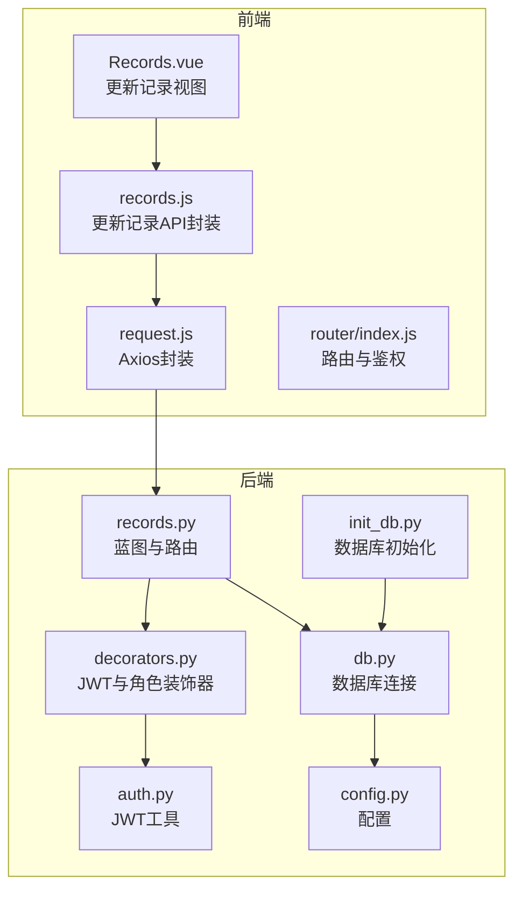
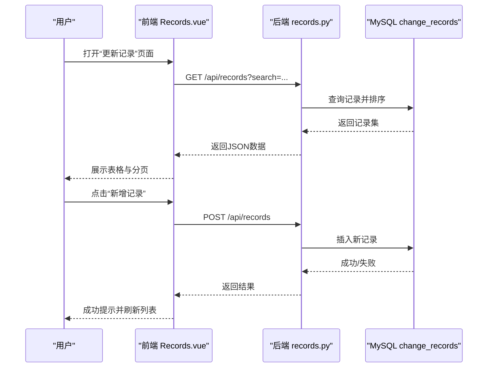
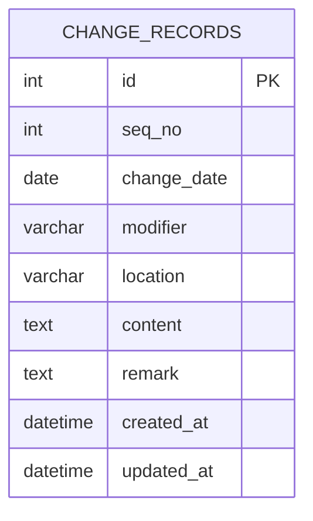
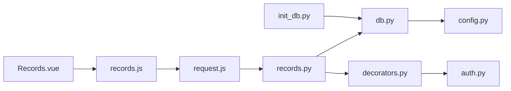

# 更新记录表

<cite>
**本文引用的文件**
- [backend/app/api/records.py](file://backend/app/api/records.py)
- [backend/init_db.py](file://backend/init_db.py)
- [backend/app/utils/db.py](file://backend/app/utils/db.py)
- [backend/app/utils/decorators.py](file://backend/app/utils/decorators.py)
- [backend/app/utils/auth.py](file://backend/app/utils/auth.py)
- [backend/app/config.py](file://backend/app/config.py)
- [frontend/src/views/Records.vue](file://frontend/src/views/Records.vue)
- [frontend/src/api/records.js](file://frontend/src/api/records.js)
- [frontend/src/api/request.js](file://frontend/src/api/request.js)
- [frontend/src/router/index.js](file://frontend/src/router/index.js)
- [backend/app/api/dashboard.py](file://backend/app/api/dashboard.py)
- [frontend/src/views/Dashboard.vue](file://frontend/src/views/Dashboard.vue)
</cite>

## 目录
1. [简介](#简介)
2. [项目结构](#项目结构)
3. [核心组件](#核心组件)
4. [架构总览](#架构总览)
5. [详细组件分析](#详细组件分析)
6. [依赖分析](#依赖分析)
7. [性能考虑](#性能考虑)
8. [故障排查指南](#故障排查指南)
9. [结论](#结论)
10. [附录](#附录)

## 简介
本设计文档围绕“更新记录表”展开，系统化阐述 change_records 表的完整结构、字段语义与约束、序列号 seq_no 的生成与编号体系、修改日期 change_date 与修改人 modifier 的追踪机制、修改位置 location 的定义与使用、修改内容 content 的格式规范与版本控制策略、以及与各业务表的关联关系与变更通知机制。同时给出变更审计流程、审批机制与责任追溯、变更影响评估、回滚策略与数据一致性保障、变更报告生成与统计分析、合规性检查等实践建议。

## 项目结构
后端采用 Flask 蓝图组织 API，数据库初始化脚本集中创建 change_records 表；前端使用 Vue + Element Plus 构建界面，通过统一的 axios 封装请求并携带 JWT Token。路由层对页面访问进行鉴权与角色校验，仪表盘集成最近更新记录展示。

图表来源
- [backend/app/api/records.py:1-114](file://backend/app/api/records.py#L1-L114)
- [backend/app/utils/db.py:1-17](file://backend/app/utils/db.py#L1-L17)
- [backend/app/utils/decorators.py:1-95](file://backend/app/utils/decorators.py#L1-L95)
- [backend/app/utils/auth.py:1-83](file://backend/app/utils/auth.py#L1-L83)
- [backend/app/config.py:1-21](file://backend/app/config.py#L1-L21)
- [backend/init_db.py:133-148](file://backend/init_db.py#L133-L148)
- [frontend/src/views/Records.vue:1-199](file://frontend/src/views/Records.vue#L1-L199)
- [frontend/src/api/records.js:1-14](file://frontend/src/api/records.js#L1-L14)
- [frontend/src/api/request.js:1-54](file://frontend/src/api/request.js#L1-L54)
- [frontend/src/router/index.js:1-61](file://frontend/src/router/index.js#L1-L61)

章节来源
- [backend/app/api/records.py:1-114](file://backend/app/api/records.py#L1-L114)
- [backend/init_db.py:133-148](file://backend/init_db.py#L133-L148)
- [frontend/src/views/Records.vue:1-199](file://frontend/src/views/Records.vue#L1-L199)
- [frontend/src/api/records.js:1-14](file://frontend/src/api/records.js#L1-L14)
- [frontend/src/api/request.js:1-54](file://frontend/src/api/request.js#L1-L54)
- [frontend/src/router/index.js:1-61](file://frontend/src/router/index.js#L1-L61)

## 核心组件
- 更新记录 API 蓝图：提供查询、创建、删除接口，支持按关键词检索，按变更日期与序号倒序排列。
- 数据库初始化：创建 change_records 表，包含主键、索引与时间戳字段。
- 权限与认证：JWT 认证与角色校验装饰器，限制创建与删除操作的角色范围。
- 前端视图与交互：提供搜索、新增、删除、表单校验与加载态。
- 统计与仪表盘：仪表盘统计接口返回最近更新记录用于首页展示。

章节来源
- [backend/app/api/records.py:20-114](file://backend/app/api/records.py#L20-L114)
- [backend/init_db.py:133-148](file://backend/init_db.py#L133-L148)
- [backend/app/utils/decorators.py:9-95](file://backend/app/utils/decorators.py#L9-L95)
- [frontend/src/views/Records.vue:84-199](file://frontend/src/views/Records.vue#L84-L199)
- [backend/app/api/dashboard.py:20-44](file://backend/app/api/dashboard.py#L20-L44)

## 架构总览
更新记录模块遵循前后端分离架构：
- 前端负责用户交互与数据展示，调用统一 API 封装发起请求。
- 后端提供 RESTful 接口，使用装饰器进行认证与授权，访问 MySQL 数据库。
- 数据库初始化脚本集中定义 change_records 表结构与索引。
- 仪表盘集成最近更新记录，便于运营人员快速掌握变更动态。

图表来源
- [backend/app/api/records.py:20-86](file://backend/app/api/records.py#L20-L86)
- [frontend/src/views/Records.vue:121-183](file://frontend/src/views/Records.vue#L121-L183)
- [frontend/src/api/records.js:3-13](file://frontend/src/api/records.js#L3-L13)

## 详细组件分析

### 数据表结构与字段语义
- 表名：change_records
- 主键：id（自增）
- 关键字段：
  - seq_no：整型序号，用于唯一标识每条记录（注意：初始化脚本中定义为 INT，但前端表单输入为字符串）。该字段是后续编号体系的关键。
  - change_date：日期，记录变更发生的日期。
  - modifier：修改人，记录变更责任人。
  - location：修改位置，记录变更发生的具体位置或模块。
  - content：修改内容，记录变更的详细描述。
  - remark：备注，可选补充说明。
  - created_at / updated_at：自动维护的时间戳。
- 索引：
  - idx_change_date：按变更日期倒序查询优化。
  - idx_modifier：按修改人检索优化。

图表来源
- [backend/init_db.py:135-147](file://backend/init_db.py#L135-L147)

章节来源
- [backend/init_db.py:133-148](file://backend/init_db.py#L133-L148)
- [backend/app/api/records.py:33-38](file://backend/app/api/records.py#L33-L38)

### 修改日期 change_date 的追踪机制
- 存储格式：DATE 类型，后端在查询时将 datetime 对象序列化为字符串，确保前端展示一致。
- 排序规则：按 change_date 降序，再按 seq_no 降序，保证最新记录优先显示。
- 前端默认值：新增记录时默认设置为当天日期，便于快速录入。

章节来源
- [backend/app/api/records.py:12-17](file://backend/app/api/records.py#L12-L17)
- [backend/app/api/records.py:38](file://backend/app/api/records.py#L38)
- [frontend/src/views/Records.vue:153-155](file://frontend/src/views/Records.vue#L153-L155)

### 修改人 modifier 的追踪机制
- 字段类型：VARCHAR(100)，用于记录变更责任人。
- 前端必填校验：新增表单要求填写修改人，确保责任到人。
- 查询条件：支持按修改人关键词检索，便于审计与追溯。

章节来源
- [backend/init_db.py:139](file://backend/init_db.py#L139)
- [backend/app/api/records.py:36](file://backend/app/api/records.py#L36)
- [frontend/src/views/Records.vue:113](file://frontend/src/views/Records.vue#L113)

### 修改位置 location 的追踪机制
- 字段类型：VARCHAR(300)，用于描述变更发生的模块或位置。
- 前端示例：提供“服务器管理-生产环境”等示例，便于标准化填写。
- 查询条件：支持按位置关键词检索，便于定位变更范围。

章节来源
- [backend/init_db.py:140](file://backend/init_db.py#L140)
- [backend/app/api/records.py:36](file://backend/app/api/records.py#L36)
- [frontend/src/views/Records.vue:62](file://frontend/src/views/Records.vue#L62)

### 修改内容 content 的格式规范与版本控制策略
- 字段类型：TEXT，支持长文本描述。
- 建议格式规范：
  - 结构化描述：变更类型（新增/调整/删除）、涉及对象、变更前/后对比、影响范围、风险等级、验证结果。
  - 版本控制：建议在 content 中明确版本号、生效时间、回滚方案等关键信息，便于后续审计与回溯。
- 前端 textarea 输入，支持多行编辑，便于撰写详细说明。

章节来源
- [backend/init_db.py:141](file://backend/init_db.py#L141)
- [frontend/src/views/Records.vue:64-71](file://frontend/src/views/Records.vue#L64-L71)

### 序列号 seq_no 的自动生成规则与编号体系
- 当前实现：
  - 初始化脚本中定义为 INT 类型，但前端表单输入为字符串。
  - API 创建接口直接写入传入的 seq_no 值。
- 建议的编号体系（扩展建议）：
  - 编码规则：前缀 + 年份 + 月日 + 序号（如 REC241201001），便于快速识别日期与顺序。
  - 自动增长：可引入序列号表或应用层生成器，避免重复与冲突。
  - 冲突处理：若 seq_no 已存在，返回错误并提示用户修正。
- 当前版本：seq_no 由人工维护，需在前端增加必填与去重校验，后端增加重复性检查。

章节来源
- [backend/init_db.py:137](file://backend/init_db.py#L137)
- [backend/app/api/records.py:67-71](file://backend/app/api/records.py#L67-L71)
- [frontend/src/views/Records.vue:46-48](file://frontend/src/views/Records.vue#L46-L48)

### 变更审计流程、审批机制与责任追溯
- 审计流程：
  - 记录创建：由具备权限的用户（admin/operator）创建，填写完整字段。
  - 审批机制：当前 API 未内置审批流，可在 content 中注明审批状态与审批人，或扩展审批表与工作流。
  - 责任追溯：通过 modifier、location、change_date、seq_no 实现多维索引，支持快速定位责任人与变更范围。
- 权限控制：
  - JWT 认证：所有接口均需携带 Bearer Token。
  - 角色限制：创建与删除仅允许 admin/operator。

章节来源
- [backend/app/api/records.py:55-92](file://backend/app/api/records.py#L55-L92)
- [backend/app/utils/decorators.py:9-95](file://backend/app/utils/decorators.py#L9-L95)
- [backend/app/utils/auth.py:38-56](file://backend/app/utils/auth.py#L38-L56)

### 变更影响评估、回滚策略与数据一致性保证
- 影响评估：
  - 在 content 中明确变更影响范围（业务系统、服务、服务器等），并标注风险等级。
  - 建议在变更前进行影响评估与测试验证，变更后进行效果确认。
- 回滚策略：
  - 若变更导致问题，依据 content 中的回滚方案进行恢复。
  - 建议建立“变更-回滚”对照表，记录可逆操作步骤。
- 数据一致性：
  - API 使用事务（commit/rollback）保证插入与删除的一致性。
  - 建议在 content 中记录变更前后的快照或差异，便于一致性核对。

章节来源
- [backend/app/api/records.py:78-83](file://backend/app/api/records.py#L78-L83)
- [backend/app/api/records.py:98-110](file://backend/app/api/records.py#L98-L110)

### 与各业务表的关联关系与变更通知机制
- 关联关系：
  - change_records 与业务表（如 servers、services、app_systems、domains_certs）之间无直接外键关联，但可通过 content 或 location 字段描述具体业务对象。
  - 建议在 content 中引用业务对象的编号或名称，形成逻辑关联。
- 变更通知：
  - 当前未实现自动通知机制，可在创建记录时触发消息推送或邮件提醒（扩展建议）。
  - 仪表盘最近更新记录展示，便于运营人员关注。

章节来源
- [backend/init_db.py:49-131](file://backend/init_db.py#L49-L131)
- [frontend/src/views/Dashboard.vue:108-125](file://frontend/src/views/Dashboard.vue#L108-L125)

### 变更报告生成、统计分析与合规性检查
- 报告生成：
  - 可基于 change_records 的查询结果导出 Excel/PDF 报告，按日期、修改人、位置、内容维度汇总。
- 统计分析：
  - 仪表盘统计接口返回最近更新记录，可用于趋势分析与热点区域识别。
- 合规性检查：
  - 建议在 content 中强制包含合规性声明（如审批状态、安全评估、备份策略）。
  - 定期审计变更记录，确保符合内部流程与外部监管要求。

章节来源
- [backend/app/api/dashboard.py:20-44](file://backend/app/api/dashboard.py#L20-L44)
- [frontend/src/views/Dashboard.vue:108-125](file://frontend/src/views/Dashboard.vue#L108-L125)

## 依赖分析
- 前端依赖：
  - Axios 封装统一请求与错误处理，自动注入 JWT Token。
  - Element Plus 提供表单、表格、对话框等 UI 组件。
  - Vue Router 进行页面路由与鉴权守卫。
- 后端依赖：
  - PyMySQL 连接数据库，DictCursor 返回字典结构。
  - JWT 工具与装饰器实现认证与授权。
  - 初始化脚本集中创建表结构与索引。

图表来源
- [frontend/src/api/request.js:1-54](file://frontend/src/api/request.js#L1-L54)
- [frontend/src/api/records.js:1-14](file://frontend/src/api/records.js#L1-L14)
- [frontend/src/views/Records.vue:84-199](file://frontend/src/views/Records.vue#L84-L199)
- [backend/app/api/records.py:1-114](file://backend/app/api/records.py#L1-L114)
- [backend/app/utils/db.py:1-17](file://backend/app/utils/db.py#L1-L17)
- [backend/app/utils/decorators.py:1-95](file://backend/app/utils/decorators.py#L1-L95)
- [backend/app/utils/auth.py:1-83](file://backend/app/utils/auth.py#L1-L83)
- [backend/app/config.py:1-21](file://backend/app/config.py#L1-L21)
- [backend/init_db.py:133-148](file://backend/init_db.py#L133-L148)

章节来源
- [frontend/src/api/request.js:1-54](file://frontend/src/api/request.js#L1-L54)
- [frontend/src/api/records.js:1-14](file://frontend/src/api/records.js#L1-L14)
- [frontend/src/views/Records.vue:84-199](file://frontend/src/views/Records.vue#L84-L199)
- [backend/app/api/records.py:1-114](file://backend/app/api/records.py#L1-L114)
- [backend/app/utils/db.py:1-17](file://backend/app/utils/db.py#L1-L17)
- [backend/app/utils/decorators.py:1-95](file://backend/app/utils/decorators.py#L1-L95)
- [backend/app/utils/auth.py:1-83](file://backend/app/utils/auth.py#L1-L83)
- [backend/app/config.py:1-21](file://backend/app/config.py#L1-L21)
- [backend/init_db.py:133-148](file://backend/init_db.py#L133-L148)

## 性能考虑
- 查询性能：
  - change_date 与 modifier 建有索引，支持高频检索与排序。
  - 建议在 content 上建立全文索引（如 MySQL 全文搜索）以提升关键词检索效率。
- 写入性能：
  - 单条记录插入与删除均为 O(1)，批量操作建议使用事务合并提交。
- 前端体验：
  - 表格分页与加载态优化，避免大数据量时渲染阻塞。
  - 搜索建议使用防抖，减少频繁请求。

## 故障排查指南
- 认证失败：
  - 检查请求头是否包含正确的 Bearer Token。
  - 确认 JWT Secret 与过期时间配置正确。
- 权限不足：
  - 确认用户角色为 admin 或 operator。
- 数据库连接异常：
  - 检查 DB_HOST/PORT/USER/PASSWORD/NAME 配置。
- 重复编号：
  - 前端增加必填与去重校验，后端抛出重复错误并提示修正。
- 删除失败：
  - 检查是否存在外键约束或业务依赖，必要时先清理依赖再删除。

章节来源
- [backend/app/utils/decorators.py:20-56](file://backend/app/utils/decorators.py#L20-L56)
- [backend/app/utils/auth.py:38-56](file://backend/app/utils/auth.py#L38-L56)
- [backend/app/utils/db.py:5-17](file://backend/app/utils/db.py#L5-L17)
- [backend/app/api/records.py:78-83](file://backend/app/api/records.py#L78-L83)

## 结论
当前系统已具备完整的更新记录表结构与基础 CRUD 能力，支持按日期与关键字检索，并通过 JWT 与角色控制保障安全性。建议在现有基础上完善编号体系、审批流程、通知机制与合规性检查，以满足更高标准的运维审计与合规需求。

## 附录
- 前端路由与页面：
  - “更新记录”页面位于 /records，路由守卫确保登录后访问。
- 仪表盘集成：
  - 仪表盘统计接口返回最近更新记录，便于首页展示。

章节来源
- [frontend/src/router/index.js:22](file://frontend/src/router/index.js#L22)
- [frontend/src/views/Dashboard.vue:108-125](file://frontend/src/views/Dashboard.vue#L108-L125)