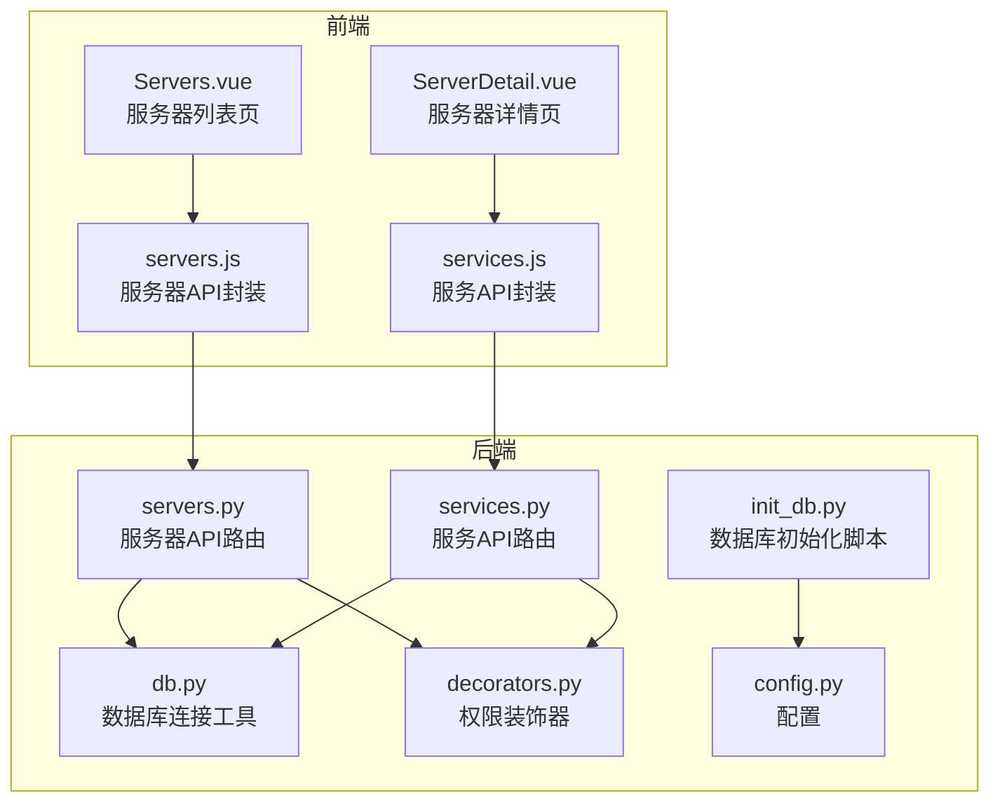
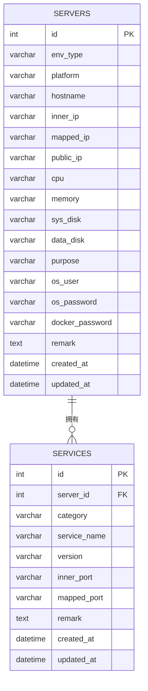
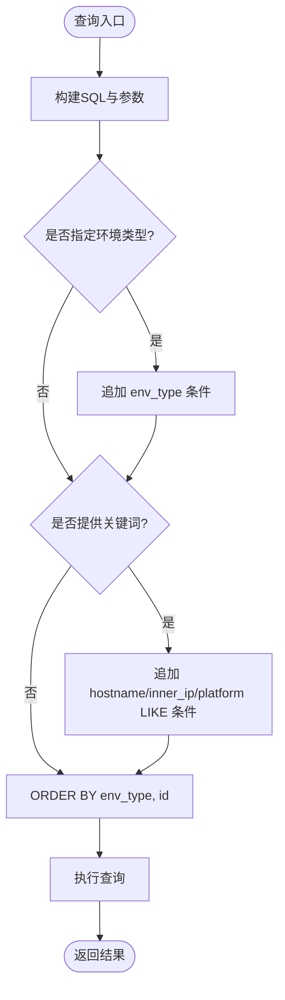
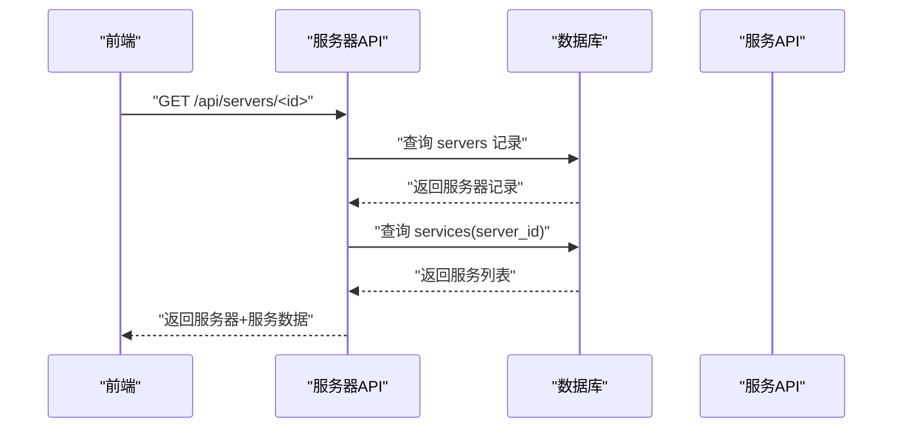
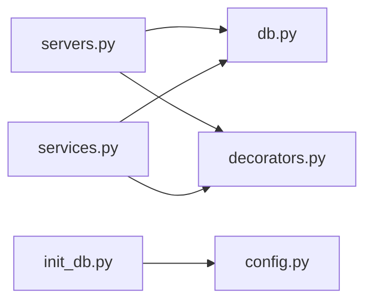

# 服务器台账表

<cite>
**本文引用的文件**
- [servers.py](file://backend/app/api/servers.py)
- [services.py](file://backend/app/api/services.py)
- [init_db.py](file://backend/init_db.py)
- [db.py](file://backend/app/utils/db.py)
- [decorators.py](file://backend/app/utils/decorators.py)
- [Servers.vue](file://frontend/src/views/Servers.vue)
- [ServerDetail.vue](file://frontend/src/views/ServerDetail.vue)
- [servers.js](file://frontend/src/api/servers.js)
- [services.js](file://frontend/src/api/services.js)
- [config.py](file://backend/app/config.py)
</cite>

## 目录
1. [简介](#简介)
2. [项目结构](#项目结构)
3. [核心组件](#核心组件)
4. [架构总览](#架构总览)
5. [详细组件分析](#详细组件分析)
6. [依赖关系分析](#依赖关系分析)
7. [性能考虑](#性能考虑)
8. [故障排查指南](#故障排查指南)
9. [结论](#结论)
10. [附录](#附录)

## 简介
本设计文档围绕“服务器台账表”展开，系统性阐述表结构、字段定义、索引策略、查询优化、服务器分类与环境类型枚举、平台标识、数据录入规范、字段校验规则，以及服务器与服务表之间的外键关联与级联删除策略。文档同时结合前后端实现，给出可操作的运维与开发实践建议。

## 项目结构
服务器台账表位于后端数据库初始化脚本中，前端通过 Vue 组件展示与交互，API 层负责数据读写与权限控制。

图表来源
- [servers.py:1-203](file://backend/app/api/servers.py#L1-L203)
- [services.py:1-144](file://backend/app/api/services.py#L1-L144)
- [init_db.py:1-230](file://backend/init_db.py#L1-L230)
- [db.py:1-17](file://backend/app/utils/db.py#L1-L17)
- [decorators.py:1-95](file://backend/app/utils/decorators.py#L1-L95)
- [Servers.vue:1-306](file://frontend/src/views/Servers.vue#L1-L306)
- [ServerDetail.vue:1-156](file://frontend/src/views/ServerDetail.vue#L1-L156)
- [servers.js:1-26](file://frontend/src/api/servers.js#L1-L26)
- [services.js:1-18](file://frontend/src/api/services.js#L1-L18)
- [config.py:1-21](file://backend/app/config.py#L1-L21)

章节来源
- [servers.py:1-203](file://backend/app/api/servers.py#L1-L203)
- [services.py:1-144](file://backend/app/api/services.py#L1-L144)
- [init_db.py:1-230](file://backend/init_db.py#L1-L230)
- [db.py:1-17](file://backend/app/utils/db.py#L1-L17)
- [decorators.py:1-95](file://backend/app/utils/decorators.py#L1-L95)
- [Servers.vue:1-306](file://frontend/src/views/Servers.vue#L1-L306)
- [ServerDetail.vue:1-156](file://frontend/src/views/ServerDetail.vue#L1-L156)
- [servers.js:1-26](file://frontend/src/api/servers.js#L1-L26)
- [services.js:1-18](file://frontend/src/api/services.js#L1-L18)
- [config.py:1-21](file://backend/app/config.py#L1-L21)

## 核心组件
- 服务器台账表（servers）
  - 主键：id（自增整数）
  - 环境类型：env_type（字符串，长度上限见表结构）
  - 平台：platform（字符串，长度上限见表结构）
  - 主机名：hostname（字符串，长度上限见表结构）
  - 内网IP：inner_ip（字符串，长度上限见表结构）
  - 映射IP：mapped_ip（字符串，长度上限见表结构）
  - 公网IP：public_ip（字符串，长度上限见表结构）
  - CPU：cpu（字符串，长度上限见表结构）
  - 内存：memory（字符串，长度上限见表结构）
  - 系统盘：sys_disk（字符串，长度上限见表结构）
  - 数据盘：data_disk（字符串，长度上限见表结构）
  - 用途：purpose（字符串，长度上限见表结构）
  - 系统账户：os_user（字符串，长度上限见表结构）
  - 系统密码：os_password（字符串，长度上限见表结构）
  - Docker密码：docker_password（字符串，长度上限见表结构）
  - 备注：remark（文本）
  - 时间戳：created_at、updated_at（自动维护）

- 服务清单表（services）
  - 主键：id（自增整数）
  - 外键：server_id（指向 servers.id）
  - 分类：category（字符串，长度上限见表结构）
  - 服务名：service_name（字符串，长度上限见表结构）
  - 版本：version（字符串，长度上限见表结构）
  - 内部端口：inner_port（字符串，长度上限见表结构）
  - 映射端口：mapped_port（字符串，长度上限见表结构）
  - 备注：remark（文本）
  - 时间戳：created_at、updated_at（自动维护）

章节来源
- [init_db.py:49-92](file://backend/init_db.py#L49-L92)
- [servers.py:101-136](file://backend/app/api/servers.py#L101-L136)
- [services.py:49-80](file://backend/app/api/services.py#L49-L80)

## 架构总览
服务器与服务的关联采用外键约束，删除服务器时会级联删除其关联的服务；前端通过 API 对服务器与服务进行 CRUD 操作，并支持按环境类型与关键词检索。

图表来源
- [init_db.py:49-92](file://backend/init_db.py#L49-L92)

章节来源
- [init_db.py:49-92](file://backend/init_db.py#L49-L92)
- [servers.py:46-78](file://backend/app/api/servers.py#L46-L78)
- [services.py:11-46](file://backend/app/api/services.py#L11-L46)

## 详细组件分析

### 表结构与字段定义
- 主键 id：自增整数，唯一标识每条服务器记录
- 环境类型 env_type：用于区分测试、生产、智慧环保、水电集团等环境
- 平台 platform：服务器所在平台标识（如阿里云、VMware 等）
- 主机名 hostname：服务器主机名
- 内网IP inner_ip：服务器内网IP地址
- 映射IP mapped_ip：云平台映射的公网IP
- 公网IP public_ip：互联网可访问的公网IP
- CPU、内存、系统盘、数据盘：资源配置描述
- 用途 purpose：服务器用途说明
- 系统账户 os_user、系统密码 os_password、Docker密码 docker_password：运维凭据
- 备注 remark：补充说明
- 时间戳 created_at、updated_at：自动维护

章节来源
- [init_db.py:49-92](file://backend/init_db.py#L49-L92)

### 索引设计策略
- 环境类型索引 idx_env_type：加速按环境类型过滤
- 内网IP索引 idx_inner_ip：加速按内网IP过滤
- 服务表索引 idx_server_id：加速按服务器ID关联查询
- 服务表外键约束：server_id -> servers.id（删除级联）

图表来源
- [servers.py:20-32](file://backend/app/api/servers.py#L20-L32)

章节来源
- [init_db.py:70-71](file://backend/init_db.py#L70-L71)
- [servers.py:20-32](file://backend/app/api/servers.py#L20-L32)

### 查询优化方案
- 使用环境类型与关键词组合查询，避免全表扫描
- 通过内网IP索引快速定位服务器
- 服务查询时先按环境类型排序，再按内网IP排序，最后按服务分类与名称排序，提升前端展示效率

章节来源
- [servers.py:20-32](file://backend/app/api/servers.py#L20-L32)
- [services.py:24-35](file://backend/app/api/services.py#L24-L35)

### 服务器分类标准与环境类型枚举
- 环境类型枚举值：测试、生产、智慧环保、水电集团
- 前端页面与服务器列表页均使用上述枚举值作为选择项

章节来源
- [Servers.vue:6-12](file://frontend/src/views/Servers.vue#L6-L12)
- [servers.py:21-31](file://backend/app/api/servers.py#L21-L31)

### 平台标识
- platform 字段用于标识服务器所在平台，前端表单允许输入平台名称（如阿里云、VMware）

章节来源
- [Servers.vue:74-76](file://frontend/src/views/Servers.vue#L74-L76)
- [init_db.py:54](file://backend/init_db.py#L54)

### 服务器信息录入规范与字段校验规则
- 必填字段：环境类型、主机名、内网IP
- 建议字段：平台、映射IP、公网IP、用途、系统账户、系统密码、Docker密码
- 前端校验：必填字段在提交前进行校验，确保数据完整性
- 后端校验：API 层接收 JSON 参数并插入数据库，异常时回滚并返回错误信息

章节来源
- [Servers.vue:196-200](file://frontend/src/views/Servers.vue#L196-L200)
- [servers.py:101-136](file://backend/app/api/servers.py#L101-L136)

### 服务器与服务表的外键关联与级联删除策略
- 服务表的 server_id 外键引用 servers.id
- 删除服务器时，会级联删除该服务器下的所有服务
- 服务查询时通过 JOIN 关联服务器信息，便于展示与排序

图表来源
- [servers.py:46-78](file://backend/app/api/servers.py#L46-L78)
- [services.py:24-35](file://backend/app/api/services.py#L24-L35)

章节来源
- [init_db.py:90](file://backend/init_db.py#L90)
- [servers.py:63-67](file://backend/app/api/servers.py#L63-L67)
- [services.py:24-35](file://backend/app/api/services.py#L24-L35)

### 权限控制与安全
- 所有服务器与服务相关接口均需 JWT 认证
- 写操作（新增、更新、删除）需具备管理员或操作员角色
- 数据库连接通过工具函数统一获取，使用 UTF8MB4 字符集

章节来源
- [decorators.py:9-56](file://backend/app/utils/decorators.py#L9-L56)
- [decorators.py:59-95](file://backend/app/utils/decorators.py#L59-L95)
- [servers.py:101-136](file://backend/app/api/servers.py#L101-L136)
- [services.py:49-80](file://backend/app/api/services.py#L49-L80)
- [db.py:5-16](file://backend/app/utils/db.py#L5-L16)

## 依赖关系分析
- 服务器 API 依赖数据库工具与权限装饰器
- 服务 API 依赖数据库工具与权限装饰器
- 服务器详情接口会联查服务表，形成“服务器—服务”的一对多关系
- 数据库初始化脚本统一创建表结构、索引与外键约束

图表来源
- [servers.py:1-8](file://backend/app/api/servers.py#L1-L8)
- [services.py:1-8](file://backend/app/api/services.py#L1-L8)
- [db.py:1-17](file://backend/app/utils/db.py#L1-L17)
- [decorators.py:1-95](file://backend/app/utils/decorators.py#L1-L95)
- [init_db.py:1-230](file://backend/init_db.py#L1-L230)
- [config.py:1-21](file://backend/app/config.py#L1-L21)

章节来源
- [servers.py:1-8](file://backend/app/api/servers.py#L1-L8)
- [services.py:1-8](file://backend/app/api/services.py#L1-L8)
- [db.py:1-17](file://backend/app/utils/db.py#L1-L17)
- [decorators.py:1-95](file://backend/app/utils/decorators.py#L1-L95)
- [init_db.py:1-230](file://backend/init_db.py#L1-L230)
- [config.py:1-21](file://backend/app/config.py#L1-L21)

## 性能考虑
- 为 env_type 与 inner_ip 建立索引，可显著提升按环境类型与内网IP的查询性能
- 服务查询时按服务器环境类型与内网IP排序，有利于前端分组展示
- 使用 UTF8MB4 字符集支持更广泛的字符，避免存储问题
- 建议对高频查询字段（如 hostname、platform）建立合适索引以进一步优化

## 故障排查指南
- 无法连接数据库：检查数据库连接参数与网络连通性
- 权限不足：确认 JWT Token 是否有效、角色是否满足要求
- 查询无结果：确认环境类型与关键词是否正确，索引是否生效
- 删除服务器失败：检查是否存在外键约束导致的级联删除问题

章节来源
- [db.py:5-16](file://backend/app/utils/db.py#L5-L16)
- [decorators.py:20-56](file://backend/app/utils/decorators.py#L20-L56)
- [servers.py:178-202](file://backend/app/api/servers.py#L178-L202)
- [services.py:119-143](file://backend/app/api/services.py#L119-L143)

## 结论
服务器台账表的设计遵循了清晰的字段划分、合理的索引策略与严格的外键约束，配合前端直观的录入与展示界面，能够高效支撑服务器与服务的全生命周期管理。通过环境类型与内网IP的索引优化，以及按环境与内网IP的排序策略，系统在查询与展示方面具备良好的性能表现。

## 附录
- 环境类型枚举值：测试、生产、智慧环保、水电集团
- 前端表单字段与校验规则：必填字段包括环境类型、主机名、内网IP
- 数据库初始化脚本：统一创建表结构、索引与外键约束