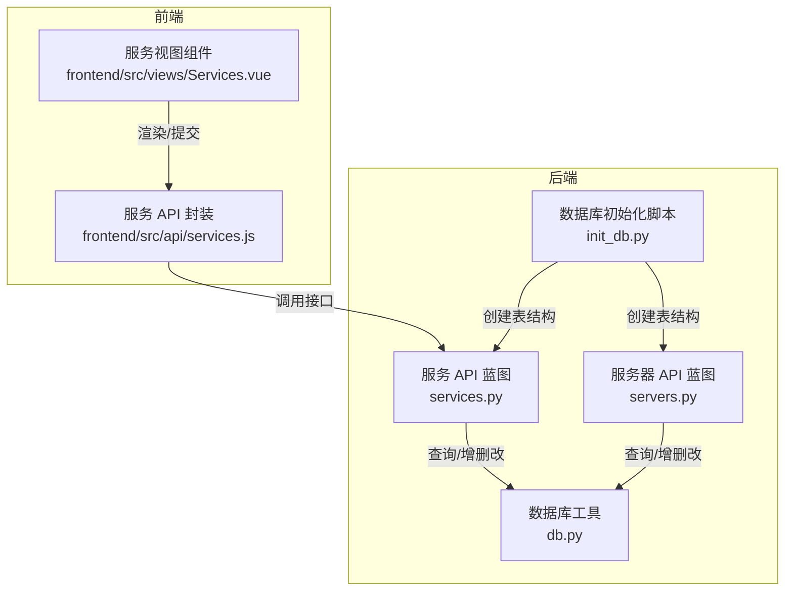
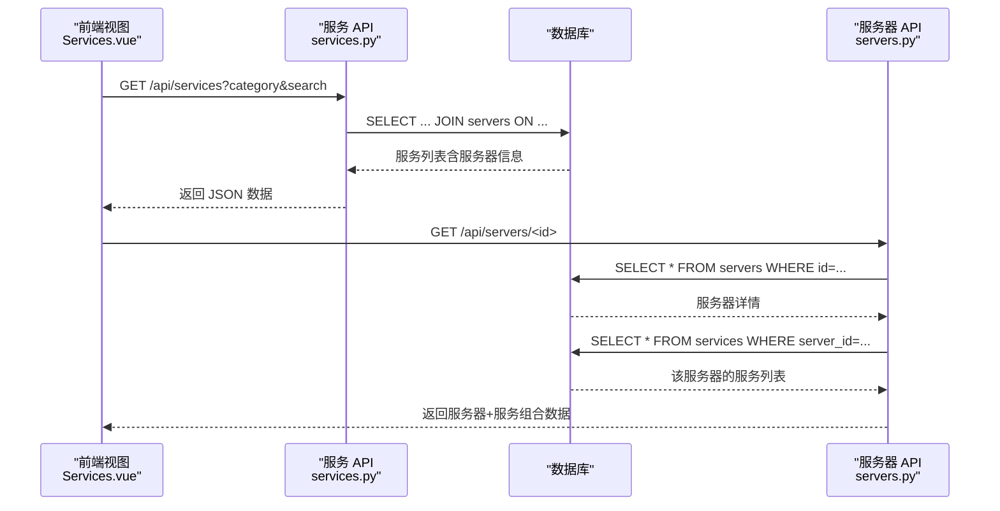
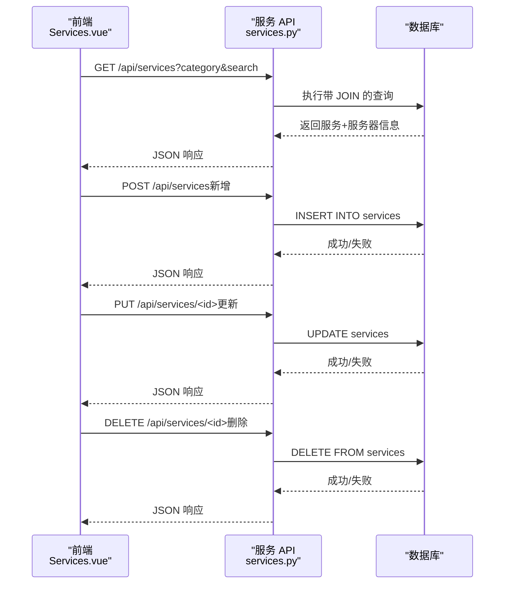
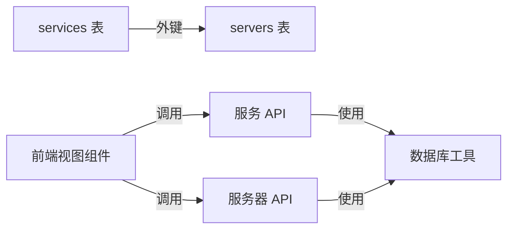

# 服务清单表

<cite>
**本文引用的文件**
- [services.py](file://backend/app/api/services.py)
- [servers.py](file://backend/app/api/servers.py)
- [init_db.py](file://backend/init_db.py)
- [db.py](file://backend/app/utils/db.py)
- [services.js](file://frontend/src/api/services.js)
- [Services.vue](file://frontend/src/views/Services.vue)
</cite>

## 目录
1. [简介](#简介)
2. [项目结构](#项目结构)
3. [核心组件](#核心组件)
4. [架构总览](#架构总览)
5. [详细组件分析](#详细组件分析)
6. [依赖分析](#依赖分析)
7. [性能考虑](#性能考虑)
8. [故障排查指南](#故障排查指南)
9. [结论](#结论)
10. [附录](#附录)

## 简介
本设计文档围绕“服务清单表”展开，系统性阐述其表结构、字段业务含义、与服务器表的外键关联关系、端口映射机制、服务与服务器的一对多关系及级联删除约束，并补充服务发现策略、端口冲突检测、负载均衡配置建议、健康检查机制与监控指标建议。文档同时结合后端 API 实现与前端界面交互，帮助读者从数据层到应用层全面理解服务清单表的设计与使用。

## 项目结构
服务清单表位于后端数据库初始化脚本中，通过 Flask Blueprint 提供 REST API，前端 Vue 组件负责展示与交互。整体结构如下：

图表来源
- [init_db.py:75-92](file://backend/init_db.py#L75-L92)
- [services.py:11-144](file://backend/app/api/services.py#L11-L144)
- [servers.py:11-203](file://backend/app/api/servers.py#L11-L203)
- [db.py:5-17](file://backend/app/utils/db.py#L5-L17)
- [services.js:1-18](file://frontend/src/api/services.js#L1-L18)
- [Services.vue:114-261](file://frontend/src/views/Services.vue#L114-L261)

章节来源
- [init_db.py:75-92](file://backend/init_db.py#L75-L92)
- [services.py:11-144](file://backend/app/api/services.py#L11-L144)
- [servers.py:11-203](file://backend/app/api/servers.py#L11-L203)
- [db.py:5-17](file://backend/app/utils/db.py#L5-L17)
- [services.js:1-18](file://frontend/src/api/services.js#L1-L18)
- [Services.vue:114-261](file://frontend/src/views/Services.vue#L114-L261)

## 核心组件
- 服务清单表（services）
  - 主键：id
  - 外键：server_id 引用 servers.id
  - 关键字段：category（服务分类）、service_name（服务名称）、version（版本）、inner_port（内网端口）、mapped_port（外网映射端口）、remark（备注）
  - 索引：idx_server_id、idx_service_name
  - 级联删除：ON DELETE CASCADE（当服务器被删除时，其关联的所有服务自动删除）

- 服务器表（servers）
  - 主键：id
  - 用于承载服务运行的物理或虚拟主机信息，提供环境类型、内网 IP、公网 IP 等上下文信息

- 服务 API（services.py）
  - 提供服务列表查询、创建、更新、删除接口
  - 查询支持按分类与关键词过滤，并关联返回服务器的主机名、内网 IP、环境类型

- 服务器 API（servers.py）
  - 提供服务器列表查询、详情查询（含关联服务列表）
  - 详情接口会返回该服务器下的所有服务

- 数据库工具（db.py）
  - 统一获取数据库连接，供各 API 使用

- 前端服务封装与视图（services.js、Services.vue）
  - 前端封装了服务 CRUD 请求方法
  - 视图组件负责展示服务列表、筛选、新增/编辑弹窗、服务器选择下拉框等

章节来源
- [init_db.py:75-92](file://backend/init_db.py#L75-L92)
- [services.py:11-144](file://backend/app/api/services.py#L11-L144)
- [servers.py:46-78](file://backend/app/api/servers.py#L46-L78)
- [db.py:5-17](file://backend/app/utils/db.py#L5-L17)
- [services.js:1-18](file://frontend/src/api/services.js#L1-L18)
- [Services.vue:114-261](file://frontend/src/views/Services.vue#L114-L261)

## 架构总览
服务清单表在系统中的作用是将“服务”与“服务器”进行解耦关联，通过外键 server_id 实现一对多关系。后端 API 在查询服务时，通过 JOIN 服务器表返回更丰富的上下文信息；前端视图组件基于 API 展示与编辑服务数据。

图表来源
- [services.py:11-46](file://backend/app/api/services.py#L11-L46)
- [servers.py:46-78](file://backend/app/api/servers.py#L46-L78)
- [init_db.py:75-92](file://backend/init_db.py#L75-L92)

## 详细组件分析

### 表结构与字段业务含义
- 字段说明
  - id：自增主键
  - server_id：外键，指向 servers.id，标识服务所属服务器
  - category：服务分类，如“数据库”、“中间件”、“Web服务”、“缓存”、“消息队列”、“其他”
  - service_name：服务名称，如“MySQL”、“Redis”、“Nginx”
  - version：服务版本，如“8.0”、“6.2”
  - inner_port：服务在容器或主机内的监听端口（字符串类型）
  - mapped_port：对外暴露的映射端口（字符串类型），用于网络访问
  - remark：备注
  - created_at / updated_at：记录创建与更新时间戳

- 约束与索引
  - idx_server_id：加速按服务器维度查询
  - idx_service_name：加速按服务名查询
  - FOREIGN KEY (server_id) REFERENCES servers(id) ON DELETE CASCADE：级联删除

- 业务意义
  - 通过 category 与 service_name 组合，可快速定位服务类型与实例
  - version 字段便于版本追踪与升级管理
  - inner_port 与 mapped_port 的分离，体现容器化/虚拟化场景下的网络隔离与外部访问需求

章节来源
- [init_db.py:75-92](file://backend/init_db.py#L75-L92)

### 服务与服务器的关联关系
- 关系模型
  - 服务器（1）———（n）服务：一个服务器可承载多个服务实例
  - 外键约束：services.server_id -> servers.id
  - 级联删除：删除服务器时，其关联的所有服务将被自动删除

- 查询行为
  - 服务列表查询时，JOIN 服务器表返回服务器的 hostname、inner_ip、env_type 等信息，便于在前端展示“所属服务器”“服务器 IP”“环境类型”等字段
  - 服务器详情查询时，返回该服务器下的所有服务列表

章节来源
- [services.py:24-35](file://backend/app/api/services.py#L24-L35)
- [servers.py:63-67](file://backend/app/api/servers.py#L63-L67)
- [init_db.py:90](file://backend/init_db.py#L90)

### 端口映射机制
- 字段映射
  - inner_port：服务在容器/主机内的实际监听端口（字符串）
  - mapped_port：对外暴露的映射端口（字符串），用于访问该服务

- 映射关系
  - 通常情况下，mapped_port 由运维统一规划，与内网端口存在一一对应或一对多映射关系
  - 建议在业务层面约定映射规则，例如：同一服务的不同实例映射到不同的 mapped_port，避免冲突

- 前端展示
  - 前端视图组件包含“内部端口”“映射端口”两列，便于直观查看与核对

章节来源
- [init_db.py:83-84](file://backend/init_db.py#L83-L84)
- [Services.vue:48-49](file://frontend/src/views/Services.vue#L48-L49)

### 服务发现策略（建议）
- 基于服务名与版本
  - 通过 service_name 与 version 进行服务识别，结合服务器内网 IP 与 mapped_port 进行访问
- 基于分类聚合
  - 通过 category 对服务进行分组，便于按类型进行统一管理与发现
- 动态配置中心
  - 可将服务注册到配置中心或服务注册表，统一维护服务地址与端口映射

（本节为概念性建议，不直接对应具体源码）

### 端口冲突检测（建议）
- 冲突检测逻辑
  - 在插入或更新服务时，校验同一服务器下 mapped_port 是否重复
  - 若存在重复，拒绝写入并提示冲突
- 批量导入校验
  - 导入前对数据进行去重与冲突扫描，保证入库一致性

（本节为概念性建议，不直接对应具体源码）

### 负载均衡配置（建议）
- 基于 mapped_port 的反向代理
  - 将多个服务实例的 mapped_port 汇聚到统一入口，实现流量分发
- 健康检查与权重
  - 结合健康检查结果动态调整权重或摘除异常节点
- 会话保持
  - 对有状态服务开启会话保持，确保请求粘性

（本节为概念性建议，不直接对应具体源码）

### 健康检查机制与监控指标（建议）
- 健康检查
  - 定期探测服务的 mapped_port 可达性与响应时间
  - 对关键服务设置告警阈值
- 监控指标
  - 连接数、吞吐量、错误率、响应延迟
  - 服务可用性与变更记录（可复用现有变更记录表）

（本节为概念性建议，不直接对应具体源码）

### API 工作流与数据流
- 服务列表查询
  - 前端调用 GET /api/services，后端拼接 SQL 并 JOIN 服务器表，返回包含服务器信息的服务列表
- 服务 CRUD
  - 前端通过封装的 API 方法调用后端接口，完成创建、更新、删除操作
- 服务器详情与关联服务
  - 前端调用 GET /api/servers/<id>，后端返回服务器详情与该服务器下的服务列表

图表来源
- [services.py:11-144](file://backend/app/api/services.py#L11-L144)
- [services.js:3-17](file://frontend/src/api/services.js#L3-L17)
- [Services.vue:156-235](file://frontend/src/views/Services.vue#L156-L235)

## 依赖分析
- 服务清单表依赖服务器表
  - 外键 server_id 引用 servers.id，并启用 ON DELETE CASCADE
- API 依赖数据库工具
  - 服务与服务器 API 均通过 db.py 获取数据库连接
- 前端依赖后端 API
  - 视图组件通过封装的 services.js 调用后端接口

图表来源
- [init_db.py:90](file://backend/init_db.py#L90)
- [services.py:18-46](file://backend/app/api/services.py#L18-L46)
- [servers.py:52-78](file://backend/app/api/servers.py#L52-L78)
- [db.py:5-17](file://backend/app/utils/db.py#L5-L17)
- [services.js:1-18](file://frontend/src/api/services.js#L1-L18)
- [Services.vue:118-173](file://frontend/src/views/Services.vue#L118-L173)

章节来源
- [init_db.py:90](file://backend/init_db.py#L90)
- [services.py:18-46](file://backend/app/api/services.py#L18-L46)
- [servers.py:52-78](file://backend/app/api/servers.py#L52-L78)
- [db.py:5-17](file://backend/app/utils/db.py#L5-L17)
- [services.js:1-18](file://frontend/src/api/services.js#L1-L18)
- [Services.vue:118-173](file://frontend/src/views/Services.vue#L118-L173)

## 性能考虑
- 索引优化
  - idx_server_id：按服务器维度查询服务时提升性能
  - idx_service_name：按服务名检索时提升性能
- 查询排序
  - 服务列表按 env_type、inner_ip、category、service_name 排序，有利于前端分组展示与快速定位
- 连接池与事务
  - 建议在生产环境中引入连接池与合理的事务边界，减少长事务占用
- 前端分页与懒加载
  - 当服务规模扩大时，建议在前端增加分页与懒加载，降低一次性渲染压力

（本节提供通用建议，不直接对应具体源码）

## 故障排查指南
- 无法查询服务列表
  - 检查服务 API 的数据库连接配置与权限
  - 确认服务器表与服务表是否存在且数据完整
- 删除服务器后服务未同步删除
  - 检查外键约束是否正确创建（ON DELETE CASCADE）
- 端口映射异常
  - 核对 mapped_port 是否与其他服务重复
  - 确认服务器防火墙与安全组策略允许该端口访问
- 前端无法提交新增/编辑
  - 检查必填字段（server_id、category、service_name）是否填写
  - 查看后端返回的错误信息，确认数据库约束是否被违反

章节来源
- [services.py:72-78](file://backend/app/api/services.py#L72-L78)
- [services.py:108-114](file://backend/app/api/services.py#L108-L114)
- [services.py:135-141](file://backend/app/api/services.py#L135-L141)
- [init_db.py:90](file://backend/init_db.py#L90)
- [Services.vue:145-149](file://frontend/src/views/Services.vue#L145-L149)

## 结论
服务清单表以清晰的字段语义与严格的外键约束，实现了服务与服务器的稳定关联。通过 API 的 JOIN 查询与前端的直观展示，用户可以高效地管理与查看服务信息。建议在实际落地中完善端口冲突检测、服务发现与负载均衡策略，并建立健康检查与监控体系，以保障服务的高可用与可观测性。

## 附录
- 快速参考
  - 表名：services（服务清单表）、servers（服务器表）
  - 关键字段：server_id、category、service_name、version、inner_port、mapped_port
  - 关系：1（服务器）———（n）服务，级联删除
  - 前端展示：服务列表、筛选、新增/编辑弹窗、服务器选择下拉框