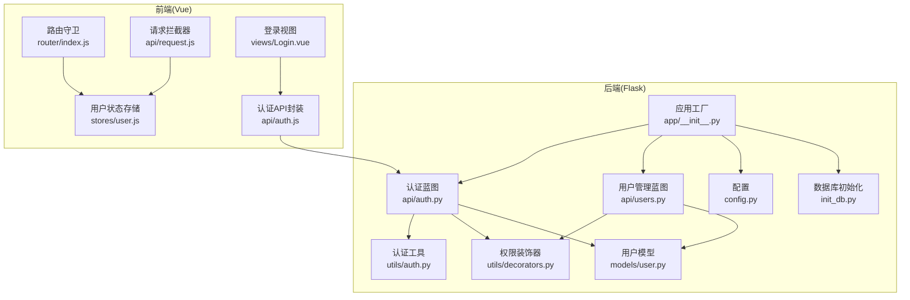
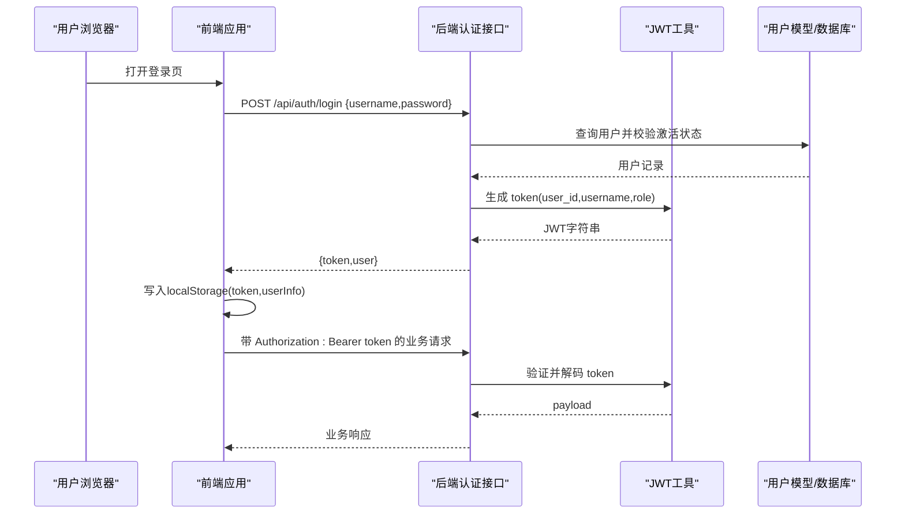
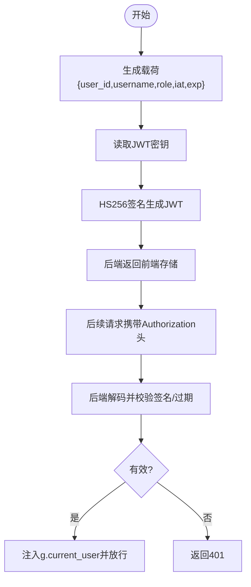
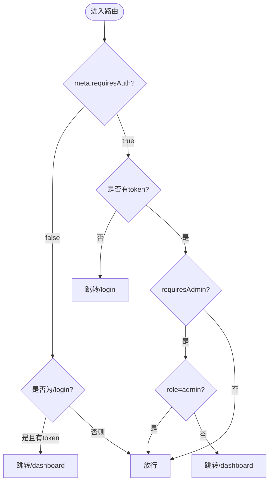
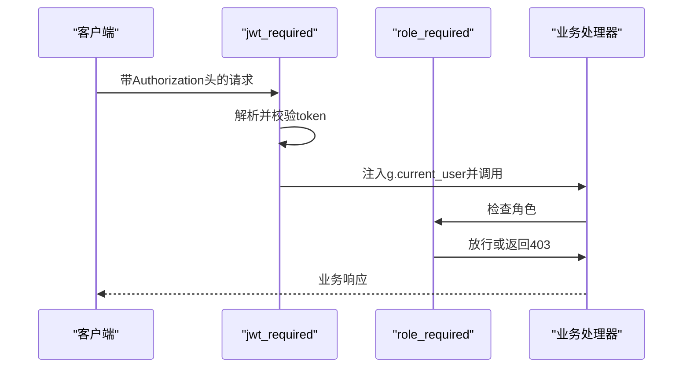
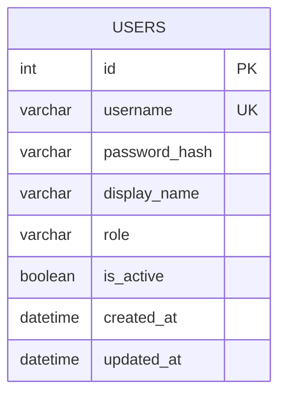
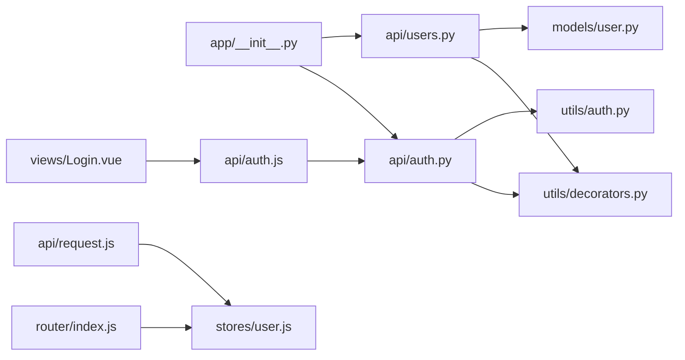

# 权限控制

<cite>
**本文引用的文件**
- [backend/app/api/auth.py](file://backend/app/api/auth.py)
- [backend/app/utils/auth.py](file://backend/app/utils/auth.py)
- [backend/app/utils/decorators.py](file://backend/app/utils/decorators.py)
- [backend/app/models/user.py](file://backend/app/models/user.py)
- [backend/app/config.py](file://backend/app/config.py)
- [backend/app/__init__.py](file://backend/app/__init__.py)
- [backend/init_db.py](file://backend/init_db.py)
- [frontend/src/api/auth.js](file://frontend/src/api/auth.js)
- [frontend/src/api/request.js](file://frontend/src/api/request.js)
- [frontend/src/stores/user.js](file://frontend/src/stores/user.js)
- [frontend/src/router/index.js](file://frontend/src/router/index.js)
- [frontend/src/views/Login.vue](file://frontend/src/views/Login.vue)
- [backend/app/api/users.py](file://backend/app/api/users.py)
</cite>

## 目录
1. [简介](#简介)
2. [项目结构](#项目结构)
3. [核心组件](#核心组件)
4. [架构总览](#架构总览)
5. [详细组件分析](#详细组件分析)
6. [依赖关系分析](#依赖关系分析)
7. [性能考虑](#性能考虑)
8. [故障排除指南](#故障排除指南)
9. [结论](#结论)
10. [附录](#附录)

## 简介
本文件面向云运维平台的权限控制体系，系统性阐述认证与授权机制，包括：
- JWT 认证工作原理、令牌生成与验证流程
- 基于角色的访问控制（RBAC）设计、用户角色与权限分配
- 动态权限检查、路由守卫与 API 权限控制
- 前端权限验证与会话管理
- 安全最佳实践、会话与安全漏洞防护
- 权限调试工具与故障排除指南

## 项目结构
后端采用 Flask 微服务风格，按功能模块划分蓝图；前端使用 Vue + Pinia + Element Plus，通过 Axios 统一请求拦截与错误处理。数据库初始化脚本负责创建用户表及索引，内置默认管理员账户。

图表来源
- [backend/app/__init__.py:28-53](file://backend/app/__init__.py#L28-L53)
- [backend/app/api/auth.py:11](file://backend/app/api/auth.py#L11)
- [backend/app/api/users.py:14](file://backend/app/api/users.py#L14)
- [backend/app/utils/auth.py:11](file://backend/app/utils/auth.py#L11)
- [backend/app/utils/decorators.py:9](file://backend/app/utils/decorators.py#L9)
- [backend/app/models/user.py:8](file://backend/app/models/user.py#L8)
- [backend/app/config.py:4](file://backend/app/config.py#L4)
- [backend/init_db.py:33-47](file://backend/init_db.py#L33-L47)
- [frontend/src/router/index.js:35](file://frontend/src/router/index.js#L35)
- [frontend/src/api/request.js:13](file://frontend/src/api/request.js#L13)
- [frontend/src/stores/user.js:5](file://frontend/src/stores/user.js#L5)
- [frontend/src/views/Login.vue:50](file://frontend/src/views/Login.vue#L50)
- [frontend/src/api/auth.js:3](file://frontend/src/api/auth.js#L3)

章节来源
- [backend/app/__init__.py:28-53](file://backend/app/__init__.py#L28-L53)
- [backend/init_db.py:33-47](file://backend/init_db.py#L33-L47)

## 核心组件
- 后端认证与权限
  - JWT 工具：生成与验证令牌、密码哈希与校验
  - 权限装饰器：JWT 必需与角色必需
  - 用户模型：用户增删改查、密码更新
  - 认证蓝图：登录、获取个人信息、修改密码
  - 用户管理蓝图：管理员用户 CRUD 与密码重置
- 前端认证与权限
  - 路由守卫：全局前置守卫，区分普通用户与管理员页面
  - 请求拦截器：自动注入 Authorization 头，统一错误处理
  - 用户状态存储：token、用户信息持久化与计算属性
  - 登录视图：调用认证 API 并写入本地存储

章节来源
- [backend/app/utils/auth.py:11](file://backend/app/utils/auth.py#L11-L36)
- [backend/app/utils/decorators.py:9](file://backend/app/utils/decorators.py#L9-L57)
- [backend/app/models/user.py:8](file://backend/app/models/user.py#L8-L183)
- [backend/app/api/auth.py:14](file://backend/app/api/auth.py#L14-L184)
- [backend/app/api/users.py:17](file://backend/app/api/users.py#L17-L268)
- [frontend/src/router/index.js:35](file://frontend/src/router/index.js#L35-L58)
- [frontend/src/api/request.js:13](file://frontend/src/api/request.js#L13-L51)
- [frontend/src/stores/user.js:5](file://frontend/src/stores/user.js#L5-L40)
- [frontend/src/views/Login.vue:50](file://frontend/src/views/Login.vue#L50-L66)

## 架构总览
整体认证与授权流程如下：
- 用户登录：前端提交用户名/密码至后端认证接口
- 令牌签发：后端验证用户并生成 JWT，包含用户 ID、用户名、角色与过期时间
- 前端存储：前端将 token 与用户信息写入本地存储
- 请求携带：前端请求拦截器自动附加 Authorization: Bearer token
- 后端校验：后端装饰器解析并验证 token，将用户信息注入上下文
- 权限控制：根据角色决定是否放行或返回 403

图表来源
- [frontend/src/views/Login.vue:50](file://frontend/src/views/Login.vue#L50-L66)
- [frontend/src/api/auth.js:3](file://frontend/src/api/auth.js#L3-L5)
- [backend/app/api/auth.py:14](file://backend/app/api/auth.py#L14-L82)
- [backend/app/utils/auth.py:11](file://backend/app/utils/auth.py#L11-L36)
- [frontend/src/api/request.js:13](file://frontend/src/api/request.js#L13-L23)
- [backend/app/utils/decorators.py:38](file://backend/app/utils/decorators.py#L38-L56)

## 详细组件分析

### JWT 认证与令牌管理
- 令牌生成
  - 载荷包含 user_id、username、role、iat、exp
  - exp 默认 24 小时，可通过配置项调整
  - 使用 HS256 算法签名，密钥来自配置
- 令牌验证
  - 解析并校验签名与过期时间
  - 过期或无效返回空，装饰器据此返回 401
- 密码处理
  - 登录前使用哈希校验，存储使用哈希
  - 修改密码时重新生成哈希并更新

图表来源
- [backend/app/utils/auth.py:11](file://backend/app/utils/auth.py#L11-L36)
- [backend/app/utils/auth.py:38](file://backend/app/utils/auth.py#L38-L56)
- [backend/app/utils/decorators.py:38](file://backend/app/utils/decorators.py#L38-L56)

章节来源
- [backend/app/utils/auth.py:11](file://backend/app/utils/auth.py#L11-L36)
- [backend/app/utils/auth.py:38](file://backend/app/utils/auth.py#L38-L56)
- [backend/app/config.py:4](file://backend/app/config.py#L4-L7)

### RBAC 设计与权限分配
- 角色定义
  - admin：超级管理员，拥有最高权限
  - operator：运维操作员，可执行日常运维任务
  - viewer：只读查看者，仅能浏览数据
- 权限矩阵
  - 登录与个人信息：任意已认证用户
  - 用户管理：仅 admin
  - 修改密码：任意已认证用户
- 访问控制列表
  - /api/users：仅 admin
  - /api/auth/profile：已认证用户
  - /api/auth/password：已认证用户
  - /api/auth/login：无需认证

章节来源
- [backend/app/api/users.py:17](file://backend/app/api/users.py#L17-L31)
- [backend/app/api/auth.py:85](file://backend/app/api/auth.py#L85-L115)
- [backend/app/api/auth.py:118](file://backend/app/api/auth.py#L118-L184)
- [frontend/src/router/index.js:24](file://frontend/src/router/index.js#L24)

### 路由守卫与前端权限验证
- 全局前置守卫
  - requiresAuth=false：登录页无需认证
  - 无 token：跳转登录
  - requiresAdmin=true：仅 admin 可访问
  - 正常路由：放行
- 请求拦截器
  - 自动附加 Authorization: Bearer token
  - 统一错误处理：401 清理本地存储并跳转登录
- 用户状态存储
  - token、userInfo 持久化
  - 计算属性：isLoggedIn、isAdmin、displayName

图表来源
- [frontend/src/router/index.js:35](file://frontend/src/router/index.js#L35-L58)
- [frontend/src/stores/user.js:9](file://frontend/src/stores/user.js#L9-L11)
- [frontend/src/api/request.js:36](file://frontend/src/api/request.js#L36-L42)

章节来源
- [frontend/src/router/index.js:35](file://frontend/src/router/index.js#L35-L58)
- [frontend/src/api/request.js:13](file://frontend/src/api/request.js#L13-L51)
- [frontend/src/stores/user.js:5](file://frontend/src/stores/user.js#L5-L40)

### API 权限控制
- 认证装饰器
  - 从 Authorization 头提取 Bearer token
  - 调用 verify_token 验证并注入 g.current_user
- 角色装饰器
  - 在 @jwt_required 之后使用
  - 检查 g.current_user['role'] 是否在允许列表中
- 用户管理 API
  - GET /api/users：admin
  - POST /api/users：admin
  - PUT /api/users/<id>：admin
  - DELETE /api/users/<id>：admin，禁止删除自身
  - PUT /api/users/<id>/reset-password：admin

图表来源
- [backend/app/utils/decorators.py:9](file://backend/app/utils/decorators.py#L9-L57)
- [backend/app/utils/decorators.py:59](file://backend/app/utils/decorators.py#L59-L95)
- [backend/app/api/users.py:17](file://backend/app/api/users.py#L17-L31)

章节来源
- [backend/app/utils/decorators.py:9](file://backend/app/utils/decorators.py#L9-L57)
- [backend/app/utils/decorators.py:59](file://backend/app/utils/decorators.py#L59-L95)
- [backend/app/api/users.py:17](file://backend/app/api/users.py#L17-L268)

### 数据模型与数据库初始化
- 用户表结构
  - 主键自增 id
  - 唯一用户名 username
  - 密码哈希 password_hash
  - 显示名称 display_name
  - 角色 role：admin/operator/viewer
  - 激活状态 is_active
  - 时间戳 created_at/updated_at
  - 索引 idx_username、idx_role
- 默认管理员
  - 初始化脚本插入默认管理员账户 admin/admin123

图表来源
- [backend/init_db.py:33-47](file://backend/init_db.py#L33-L47)

章节来源
- [backend/init_db.py:33-47](file://backend/init_db.py#L33-L47)
- [backend/init_db.py:213-219](file://backend/init_db.py#L213-L219)

## 依赖关系分析
- 后端
  - app/__init__.py 注册所有蓝图，统一 CORS 配置
  - 认证与用户管理依赖装饰器与模型
  - 装饰器依赖 JWT 工具进行 token 验证
- 前端
  - 路由守卫依赖用户状态存储中的角色判断
  - 请求拦截器依赖本地存储中的 token
  - 登录视图依赖认证 API 封装

图表来源
- [backend/app/__init__.py:28-53](file://backend/app/__init__.py#L28-L53)
- [backend/app/api/auth.py:11](file://backend/app/api/auth.py#L11)
- [backend/app/api/users.py:14](file://backend/app/api/users.py#L14)
- [backend/app/utils/decorators.py:9](file://backend/app/utils/decorators.py#L9)
- [backend/app/utils/auth.py:11](file://backend/app/utils/auth.py#L11)
- [frontend/src/router/index.js:35](file://frontend/src/router/index.js#L35)
- [frontend/src/stores/user.js:5](file://frontend/src/stores/user.js#L5)
- [frontend/src/api/request.js:13](file://frontend/src/api/request.js#L13)
- [frontend/src/views/Login.vue:50](file://frontend/src/views/Login.vue#L50)
- [frontend/src/api/auth.js:3](file://frontend/src/api/auth.js#L3)

章节来源
- [backend/app/__init__.py:28-53](file://backend/app/__init__.py#L28-L53)
- [frontend/src/router/index.js:35](file://frontend/src/router/index.js#L35-L58)

## 性能考虑
- 令牌有效期
  - 默认 24 小时，建议在生产环境根据业务场景调整
- 密钥管理
  - JWT 密钥与应用密钥均来自配置，务必在生产环境设置强密钥
- 数据库索引
  - 用户表对 username 与 role 建立索引，有利于查询与权限过滤
- 请求拦截器
  - 统一注入 Authorization 头，避免重复逻辑，减少出错概率

[本节为通用指导，不直接分析具体文件]

## 故障排除指南
- 登录失败
  - 检查用户名/密码是否正确，用户是否激活
  - 查看后端返回的错误码与消息
- 401 未授权
  - 前端：确认本地存储中 token 是否存在
  - 后端：确认 Authorization 头格式是否为 Bearer token
  - 令牌过期：刷新 token 或重新登录
- 403 权限不足
  - 确认当前用户角色是否满足 requiresAdmin 或装饰器要求
  - 检查路由 meta.requiresAdmin 配置
- 密码修改失败
  - 确认旧密码正确，新密码长度符合要求
- 用户管理异常
  - 确认当前用户为 admin
  - 禁止删除自身，检查业务逻辑

章节来源
- [backend/app/api/auth.py:14](file://backend/app/api/auth.py#L14-L82)
- [backend/app/utils/decorators.py:38](file://backend/app/utils/decorators.py#L38-L56)
- [frontend/src/api/request.js:36](file://frontend/src/api/request.js#L36-L42)
- [frontend/src/router/index.js:48](file://frontend/src/router/index.js#L48-L54)
- [backend/app/api/users.py:175](file://backend/app/api/users.py#L175-L182)

## 结论
该权限控制系统以 JWT 为核心，结合 Flask 装饰器实现 RBAC，前后端协同完成认证与授权闭环。通过路由守卫与请求拦截器，确保用户在前端层面即具备基础权限控制；后端装饰器与模型层进一步强化了 API 层的安全性。建议在生产环境中加强密钥管理、缩短令牌有效期并完善审计日志。

[本节为总结性内容，不直接分析具体文件]

## 附录

### 安全最佳实践
- 强制 HTTPS 传输，防止中间人攻击
- 生产环境设置强 JWT 密钥与应用密钥
- 限制令牌有效期，定期轮换密钥
- 对敏感操作增加二次确认与审计日志
- 输入校验与最小权限原则

[本节为通用指导，不直接分析具体文件]

### 会话管理与安全防护
- 前端：localStorage 存储 token 与用户信息，注意 XSS 防护
- 后端：装饰器统一校验 token，避免硬编码密钥
- 错误处理：401 自动清理本地存储并跳转登录

章节来源
- [frontend/src/api/request.js:36](file://frontend/src/api/request.js#L36-L42)
- [backend/app/utils/auth.py:38](file://backend/app/utils/auth.py#L38-L56)