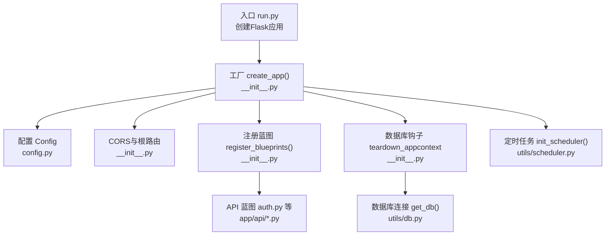
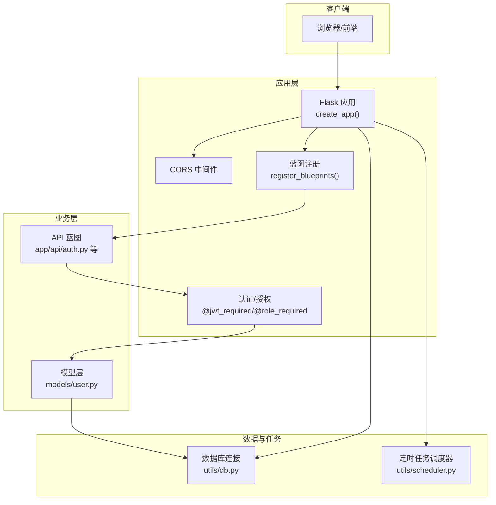
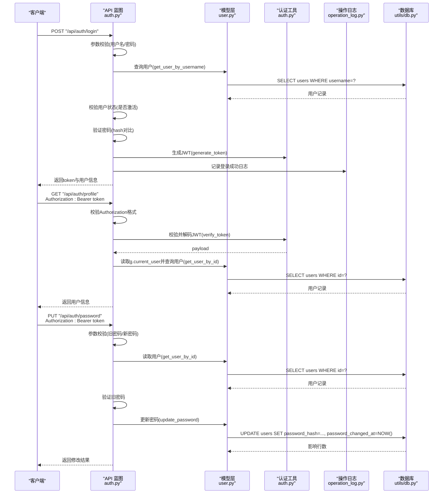
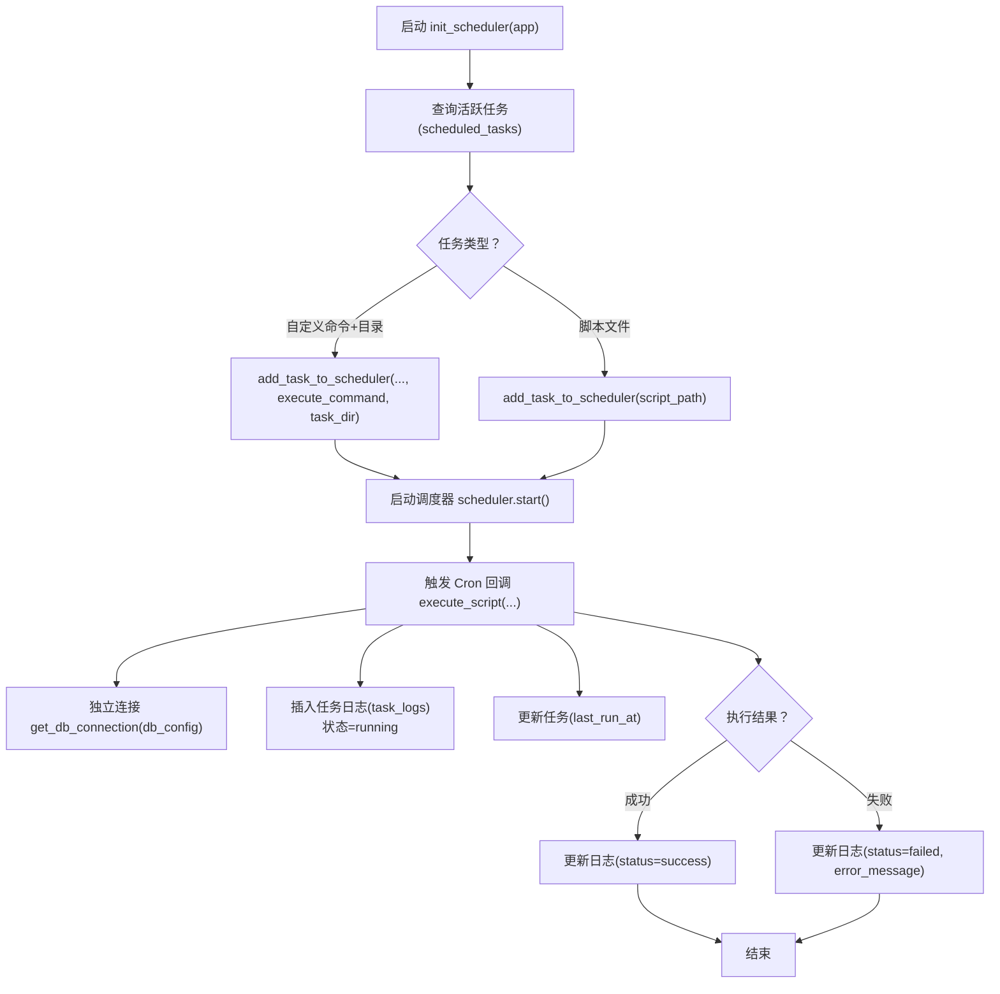
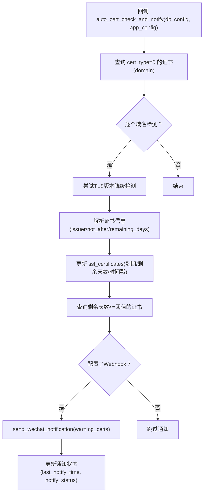
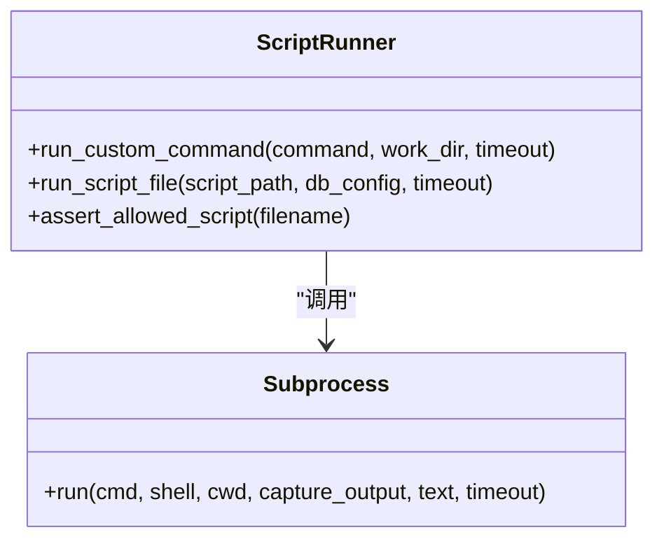
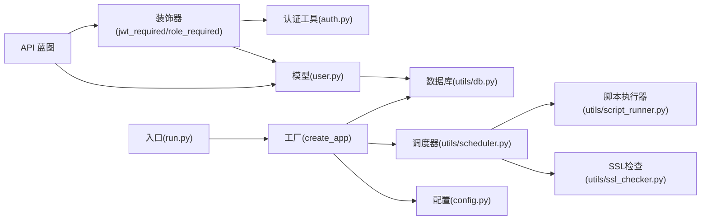

# 数据流与控制流

<cite>
**本文引用的文件**
- [backend/app/__init__.py](file://backend/app/__init__.py)
- [backend/app/config.py](file://backend/app/config.py)
- [backend/app/run.py](file://backend/app/run.py)
- [backend/init_db.py](file://backend/init_db.py)
- [backend/app/utils/db.py](file://backend/app/utils/db.py)
- [backend/app/utils/auth.py](file://backend/app/utils/auth.py)
- [backend/app/utils/decorators.py](file://backend/app/utils/decorators.py)
- [backend/app/utils/scheduler.py](file://backend/app/utils/scheduler.py)
- [backend/app/utils/password_utils.py](file://backend/app/utils/password_utils.py)
- [backend/app/utils/validators.py](file://backend/app/utils/validators.py)
- [backend/app/utils/ssl_checker.py](file://backend/app/utils/ssl_checker.py)
- [backend/app/utils/script_runner.py](file://backend/app/utils/script_runner.py)
- [backend/app/api/auth.py](file://backend/app/api/auth.py)
- [backend/app/models/user.py](file://backend/app/models/user.py)
</cite>

## 目录
1. [引言](#引言)
2. [项目结构](#项目结构)
3. [核心组件](#核心组件)
4. [架构总览](#架构总览)
5. [详细组件分析](#详细组件分析)
6. [依赖分析](#依赖分析)
7. [性能考虑](#性能考虑)
8. [故障排查指南](#故障排查指南)
9. [结论](#结论)
10. [附录](#附录)

## 引言
本设计文档聚焦于OPS项目的“数据流与控制流”，围绕从HTTP请求到数据库响应的完整链路，系统性阐述以下方面：
- 数据流路径：请求接收、参数校验、业务逻辑处理、数据持久化、响应返回
- 控制流设计：路由分发、中间件（认证/授权）执行、异常处理与错误传播
- 异步与并发：数据库连接管理、定时任务调度、并发访问控制
- 缓存与性能：查询优化、连接复用、响应缓存策略建议
- 监控与调试：日志记录、性能追踪、错误诊断工具

## 项目结构
后端采用Flask应用，入口位于run.py，工厂函数create_app在__init__.py中创建并配置应用，注册蓝图形成API模块化组织，工具模块集中在utils，数据模型集中在models。

**图表来源**
- [backend/app/run.py:1-8](file://backend/app/run.py#L1-L8)
- [backend/app/__init__.py:28-113](file://backend/app/__init__.py#L28-L113)
- [backend/app/config.py:10-57](file://backend/app/config.py#L10-L57)
- [backend/app/utils/db.py:43-79](file://backend/app/utils/db.py#L43-L79)
- [backend/app/utils/scheduler.py:244-384](file://backend/app/utils/scheduler.py#L244-L384)

**章节来源**
- [backend/app/run.py:1-8](file://backend/app/run.py#L1-L8)
- [backend/app/__init__.py:28-149](file://backend/app/__init__.py#L28-L149)
- [backend/app/config.py:10-57](file://backend/app/config.py#L10-L57)

## 核心组件
- 应用工厂与生命周期
  - create_app负责配置日志、CORS、蓝图注册、数据库预检、模式初始化、定时任务调度器初始化与启动。
- 数据库连接与上下文
  - get_db基于Flask g对象缓存连接，teardown_appcontext统一关闭连接，减少连接开销。
- 认证与授权
  - JWT生成与校验、基于装饰器的认证/授权流程，结合用户模型查询与状态校验。
- 定时任务调度
  - APScheduler后台调度器，支持Cron表达式、自定义命令与脚本文件执行，独立连接写入任务日志。
- 工具与校验
  - 密码工具（bcrypt、Fernet）、参数校验（IP/URL/端口/域名/用户名/邮箱等）、SSL证书检测与微信通知、脚本执行器。

**章节来源**
- [backend/app/__init__.py:28-113](file://backend/app/__init__.py#L28-L113)
- [backend/app/utils/db.py:43-79](file://backend/app/utils/db.py#L43-L79)
- [backend/app/utils/auth.py:9-45](file://backend/app/utils/auth.py#L9-L45)
- [backend/app/utils/decorators.py:26-163](file://backend/app/utils/decorators.py#L26-L163)
- [backend/app/utils/scheduler.py:244-384](file://backend/app/utils/scheduler.py#L244-L384)
- [backend/app/utils/password_utils.py:52-130](file://backend/app/utils/password_utils.py#L52-L130)
- [backend/app/utils/validators.py:6-151](file://backend/app/utils/validators.py#L6-L151)
- [backend/app/utils/ssl_checker.py:48-166](file://backend/app/utils/ssl_checker.py#L48-L166)
- [backend/app/utils/script_runner.py:19-126](file://backend/app/utils/script_runner.py#L19-L126)

## 架构总览
下图展示从HTTP请求到数据库响应的关键交互，以及认证、授权、定时任务等横切关注点。

**图表来源**
- [backend/app/__init__.py:116-149](file://backend/app/__init__.py#L116-L149)
- [backend/app/api/auth.py:15-197](file://backend/app/api/auth.py#L15-L197)
- [backend/app/models/user.py:36-162](file://backend/app/models/user.py#L36-L162)
- [backend/app/utils/db.py:43-79](file://backend/app/utils/db.py#L43-L79)
- [backend/app/utils/scheduler.py:244-384](file://backend/app/utils/scheduler.py#L244-L384)

## 详细组件分析

### 组件A：认证与授权流程（序列图）
该序列图展示登录、获取用户资料、修改密码的完整控制流，包括参数校验、JWT签发、权限校验与操作日志记录。

**图表来源**
- [backend/app/api/auth.py:15-197](file://backend/app/api/auth.py#L15-L197)
- [backend/app/models/user.py:36-162](file://backend/app/models/user.py#L36-L162)
- [backend/app/utils/auth.py:9-45](file://backend/app/utils/auth.py#L9-L45)
- [backend/app/utils/decorators.py:26-163](file://backend/app/utils/decorators.py#L26-L163)

**章节来源**
- [backend/app/api/auth.py:15-197](file://backend/app/api/auth.py#L15-L197)
- [backend/app/utils/decorators.py:26-163](file://backend/app/utils/decorators.py#L26-L163)
- [backend/app/utils/auth.py:9-45](file://backend/app/utils/auth.py#L9-L45)
- [backend/app/models/user.py:36-162](file://backend/app/models/user.py#L36-L162)

### 组件B：定时任务调度（流程图）
该流程图展示调度器初始化、任务加载、执行与日志记录的控制流，强调独立连接与线程隔离。

**图表来源**
- [backend/app/utils/scheduler.py:244-384](file://backend/app/utils/scheduler.py#L244-L384)
- [backend/app/utils/scheduler.py:39-179](file://backend/app/utils/scheduler.py#L39-L179)

**章节来源**
- [backend/app/utils/scheduler.py:244-384](file://backend/app/utils/scheduler.py#L244-L384)
- [backend/app/utils/scheduler.py:39-179](file://backend/app/utils/scheduler.py#L39-L179)

### 组件C：SSL证书自动检测与通知（流程图）
该流程图展示调度器回调中对证书在线检测、阈值判断与微信通知的控制流。

**图表来源**
- [backend/app/utils/scheduler.py:391-533](file://backend/app/utils/scheduler.py#L391-L533)
- [backend/app/utils/ssl_checker.py:304-396](file://backend/app/utils/ssl_checker.py#L304-L396)

**章节来源**
- [backend/app/utils/scheduler.py:391-533](file://backend/app/utils/scheduler.py#L391-L533)
- [backend/app/utils/ssl_checker.py:304-396](file://backend/app/utils/ssl_checker.py#L304-L396)

### 组件D：脚本执行器（类图）
脚本执行器根据扩展名选择执行器，支持Python、Shell与MySQL脚本，具备超时控制与错误处理。

**图表来源**
- [backend/app/utils/script_runner.py:19-126](file://backend/app/utils/script_runner.py#L19-L126)

**章节来源**
- [backend/app/utils/script_runner.py:19-126](file://backend/app/utils/script_runner.py#L19-L126)

## 依赖分析
- 组件耦合
  - API蓝图依赖模型层与工具层；模型层依赖数据库工具；调度器依赖脚本执行器与SSL检查工具。
- 外部依赖
  - Flask、PyMySQL、APScheduler、bcrypt、cryptography、requests、阿里云CAS SDK（可选）。
- 循环依赖
  - 当前结构未见直接循环依赖；装饰器依赖模型层查询用户，但通过字符串导入避免循环。

**图表来源**
- [backend/app/api/auth.py:15-197](file://backend/app/api/auth.py#L15-L197)
- [backend/app/utils/decorators.py:26-163](file://backend/app/utils/decorators.py#L26-L163)
- [backend/app/utils/auth.py:9-45](file://backend/app/utils/auth.py#L9-L45)
- [backend/app/models/user.py:36-162](file://backend/app/models/user.py#L36-L162)
- [backend/app/utils/db.py:43-79](file://backend/app/utils/db.py#L43-L79)
- [backend/app/utils/scheduler.py:244-384](file://backend/app/utils/scheduler.py#L244-L384)
- [backend/app/utils/script_runner.py:19-126](file://backend/app/utils/script_runner.py#L19-L126)
- [backend/app/utils/ssl_checker.py:48-166](file://backend/app/utils/ssl_checker.py#L48-L166)
- [backend/app/run.py:1-8](file://backend/app/run.py#L1-L8)
- [backend/app/__init__.py:28-113](file://backend/app/__init__.py#L28-L113)
- [backend/app/config.py:10-57](file://backend/app/config.py#L10-L57)

**章节来源**
- [backend/app/api/auth.py:15-197](file://backend/app/api/auth.py#L15-L197)
- [backend/app/utils/decorators.py:26-163](file://backend/app/utils/decorators.py#L26-L163)
- [backend/app/utils/auth.py:9-45](file://backend/app/utils/auth.py#L9-L45)
- [backend/app/models/user.py:36-162](file://backend/app/models/user.py#L36-L162)
- [backend/app/utils/db.py:43-79](file://backend/app/utils/db.py#L43-L79)
- [backend/app/utils/scheduler.py:244-384](file://backend/app/utils/scheduler.py#L244-L384)
- [backend/app/utils/script_runner.py:19-126](file://backend/app/utils/script_runner.py#L19-L126)
- [backend/app/utils/ssl_checker.py:48-166](file://backend/app/utils/ssl_checker.py#L48-L166)
- [backend/app/run.py:1-8](file://backend/app/run.py#L1-L8)
- [backend/app/__init__.py:28-113](file://backend/app/__init__.py#L28-L113)
- [backend/app/config.py:10-57](file://backend/app/config.py#L10-L57)

## 性能考虑
- 连接管理
  - 使用Flask g缓存数据库连接，避免重复建立连接；在应用上下文结束时统一关闭，降低连接开销。
- 查询优化
  - 表上已建立索引（如users.username、servers.inner_ip、dict_*等），建议在高频查询字段上保持索引策略。
- 并发与异步
  - 定时任务在独立线程中执行，避免阻塞主请求；脚本执行设置超时，防止长时间阻塞。
- 缓存策略
  - 当前未实现应用层缓存；可在热点查询（如字典表）引入进程内缓存或Redis缓存，注意失效与一致性。
- 响应缓存
  - 可针对只读接口（如字典查询）增加ETag/Cache-Control，减少重复传输。
- 日志与追踪
  - 标准输出日志便于容器收集；建议引入结构化日志与请求ID，便于跨服务追踪。

[本节为通用性能建议，无需特定文件引用]

## 故障排查指南
- 数据库连接失败
  - 现象：应用启动时报数据库连接预检失败。
  - 排查：核对DB_HOST/DB_PORT/DB_USER/DB_PASSWORD/DB_NAME；确认MySQL已启动、网络互通。
  - 参考：[backend/app/__init__.py:88-104](file://backend/app/__init__.py#L88-L104)、[backend/app/utils/db.py:43-79](file://backend/app/utils/db.py#L43-L79)
- JWT认证失败
  - 现象：401缺少认证信息/认证格式错误/Token无效或已过期/用户不存在/用户被禁用/密码变更导致Token失效。
  - 排查：确认Authorization头格式、JWT_SECRET_KEY配置、用户状态与密码变更时间。
  - 参考：[backend/app/utils/decorators.py:26-163](file://backend/app/utils/decorators.py#L26-L163)、[backend/app/utils/auth.py:9-45](file://backend/app/utils/auth.py#L9-L45)
- 定时任务执行异常
  - 现象：任务日志状态为failed，输出错误信息。
  - 排查：检查脚本路径/命令、工作目录、脚本类型白名单、超时设置；查看独立连接与日志写入。
  - 参考：[backend/app/utils/scheduler.py:39-179](file://backend/app/utils/scheduler.py#L39-L179)
- SSL证书检测失败
  - 现象：证书剩余天数未更新或通知未发送。
  - 排查：确认域名可达、TLS版本降级、Webhook URL配置、通知阈值。
  - 参考：[backend/app/utils/ssl_checker.py:48-166](file://backend/app/utils/ssl_checker.py#L48-L166)、[backend/app/utils/scheduler.py:391-533](file://backend/app/utils/scheduler.py#L391-L533)

**章节来源**
- [backend/app/__init__.py:88-104](file://backend/app/__init__.py#L88-L104)
- [backend/app/utils/db.py:43-79](file://backend/app/utils/db.py#L43-L79)
- [backend/app/utils/decorators.py:26-163](file://backend/app/utils/decorators.py#L26-L163)
- [backend/app/utils/auth.py:9-45](file://backend/app/utils/auth.py#L9-L45)
- [backend/app/utils/scheduler.py:39-179](file://backend/app/utils/scheduler.py#L39-L179)
- [backend/app/utils/ssl_checker.py:48-166](file://backend/app/utils/ssl_checker.py#L48-L166)
- [backend/app/utils/scheduler.py:391-533](file://backend/app/utils/scheduler.py#L391-L533)

## 结论
OPS项目通过Flask蓝图实现清晰的API分层，配合装饰器完成认证与授权，数据库连接在应用上下文中复用，定时任务采用独立线程与连接保障稳定性。整体控制流简洁明确，具备良好的可维护性与扩展性。建议后续引入应用层缓存与结构化日志，进一步提升性能与可观测性。

[本节为总结性内容，无需特定文件引用]

## 附录
- 数据库初始化
  - 初始化脚本创建核心表与默认数据，包含用户、服务器、项目、服务、字典、账号、定时任务、任务日志、操作日志、云凭证、域名、证书等。
  - 参考：[backend/init_db.py:22-391](file://backend/init_db.py#L22-L391)
- 配置项
  - 关键配置包括数据库连接、JWT密钥与过期时间、CORS、上传目录、SSL检测与通知阈值、Grafana集成等。
  - 参考：[backend/app/config.py:10-57](file://backend/app/config.py#L10-L57)
- 入口与运行
  - run.py通过create_app创建应用，支持本地开发与生产部署。
  - 参考：[backend/app/run.py:1-8](file://backend/app/run.py#L1-L8)、[backend/app/__init__.py:28-113](file://backend/app/__init__.py#L28-L113)

**章节来源**
- [backend/init_db.py:22-391](file://backend/init_db.py#L22-L391)
- [backend/app/config.py:10-57](file://backend/app/config.py#L10-L57)
- [backend/app/run.py:1-8](file://backend/app/run.py#L1-L8)
- [backend/app/__init__.py:28-113](file://backend/app/__init__.py#L28-L113)