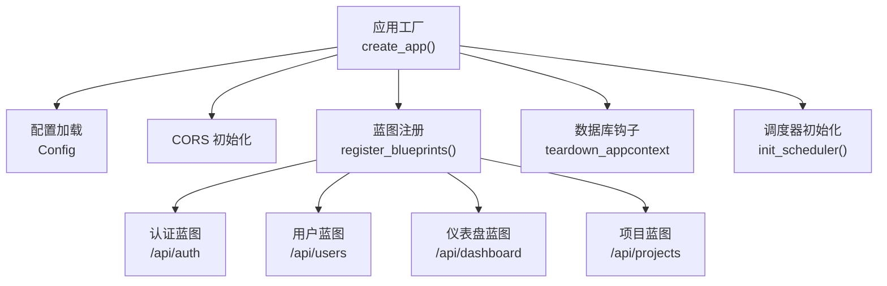
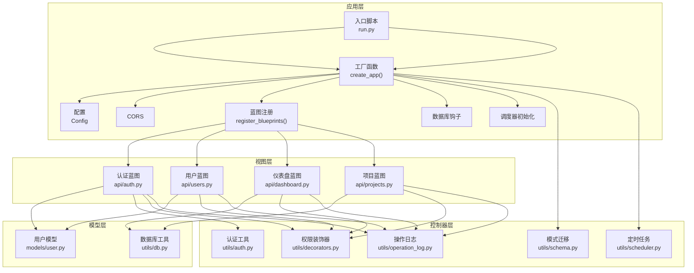
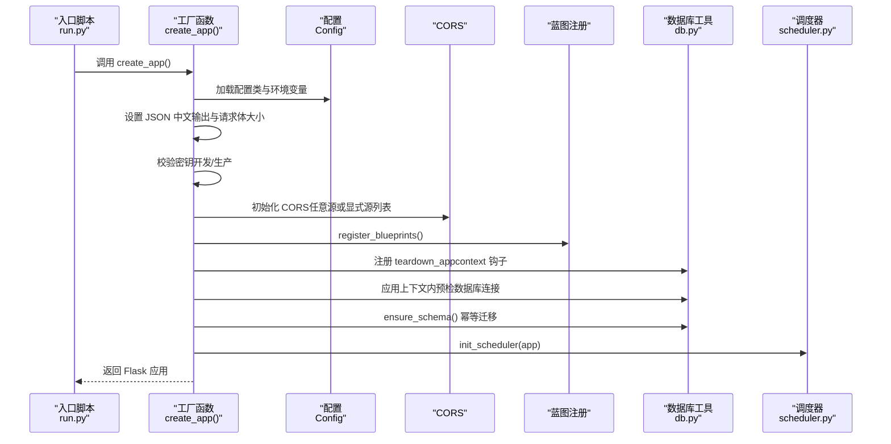
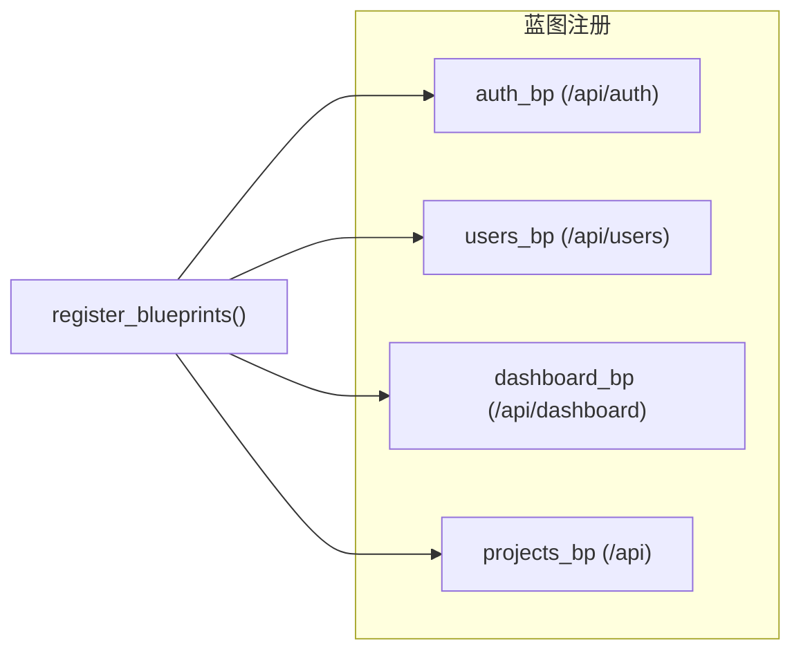
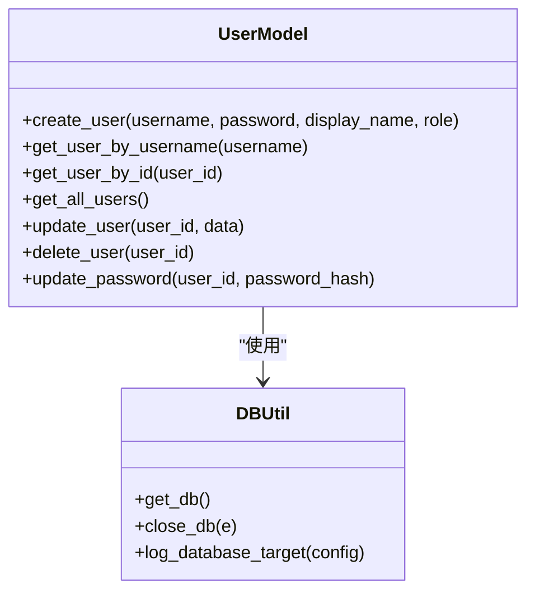
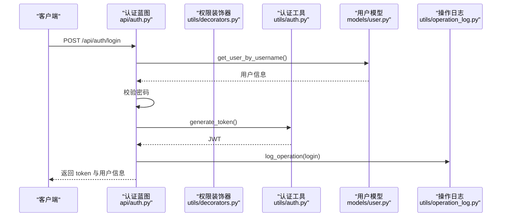
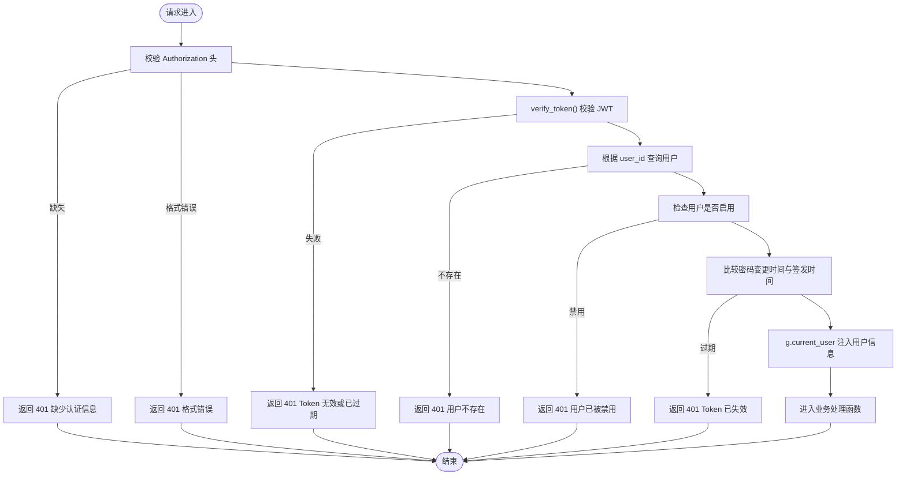
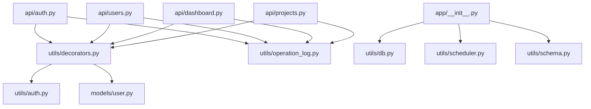

# 整体架构模式

<cite>
**本文引用的文件**
- [backend/app/__init__.py](file://backend/app/__init__.py)
- [backend/app/config.py](file://backend/app/config.py)
- [backend/run.py](file://backend/run.py)
- [backend/app/models/user.py](file://backend/app/models/user.py)
- [backend/app/utils/db.py](file://backend/app/utils/db.py)
- [backend/app/utils/auth.py](file://backend/app/utils/auth.py)
- [backend/app/utils/decorators.py](file://backend/app/utils/decorators.py)
- [backend/app/utils/operation_log.py](file://backend/app/utils/operation_log.py)
- [backend/app/utils/schema.py](file://backend/app/utils/schema.py)
- [backend/app/utils/scheduler.py](file://backend/app/utils/scheduler.py)
- [backend/app/api/auth.py](file://backend/app/api/auth.py)
- [backend/app/api/users.py](file://backend/app/api/users.py)
- [backend/app/api/dashboard.py](file://backend/app/api/dashboard.py)
- [backend/app/api/projects.py](file://backend/app/api/projects.py)
</cite>

## 目录
1. [引言](#引言)
2. [项目结构](#项目结构)
3. [核心组件](#核心组件)
4. [架构总览](#架构总览)
5. [详细组件分析](#详细组件分析)
6. [依赖分析](#依赖分析)
7. [性能考虑](#性能考虑)
8. [故障排查指南](#故障排查指南)
9. [结论](#结论)
10. [附录](#附录)

## 引言
本文件系统性梳理 OPS 项目的整体架构模式，重点围绕基于 Flask 的 MVC 设计模式实现，涵盖模型层的数据模型、视图层的蓝图路由与响应封装、控制器层的路由处理与中间件（装饰器）机制。同时阐述蓝图架构模式在模块化路由组织与 API 版本管理上的应用，解析工厂模式在应用创建、配置管理与扩展初始化中的作用，并总结中间件模式（认证、日志、CORS）的实现方式与技术权衡。

## 项目结构
项目采用“应用工厂 + 蓝图 + 工具模块”的分层组织方式：
- 应用工厂与入口：通过工厂函数创建 Flask 应用，集中初始化配置、CORS、数据库钩子、蓝图注册与调度器。
- 蓝图模块：按功能域划分 API 蓝图（如认证、用户、仪表盘、项目等），统一前缀与权限控制。
- 工具模块：数据库连接、认证、装饰器、操作日志、定时任务、模式迁移等通用能力。
- 配置中心：集中管理运行时配置，支持环境变量注入与默认值策略。

图表来源
- [backend/app/__init__.py:28-113](file://backend/app/__init__.py#L28-L113)
- [backend/app/config.py:10-57](file://backend/app/config.py#L10-L57)
- [backend/run.py:1-8](file://backend/run.py#L1-L8)

章节来源
- [backend/app/__init__.py:28-113](file://backend/app/__init__.py#L28-L113)
- [backend/app/config.py:10-57](file://backend/app/config.py#L10-L57)
- [backend/run.py:1-8](file://backend/run.py#L1-L8)

## 核心组件
- 应用工厂与入口
  - 工厂函数负责创建 Flask 实例、加载配置、设置 JSON 中文输出、校验密钥、CORS、注册蓝图、数据库钩子与调度器初始化。
  - 入口脚本通过工厂函数创建应用并按配置启动。
- 配置中心
  - 统一从环境变量读取配置，提供默认值与 CORS 源列表解析方法。
- 蓝图与路由
  - 每个功能域一个蓝图，统一前缀，结合装饰器实现认证与权限控制。
- 工具模块
  - 数据库连接池与上下文缓存、JWT 生成与校验、权限装饰器、操作日志、模式迁移、定时任务调度器。

章节来源
- [backend/app/__init__.py:28-113](file://backend/app/__init__.py#L28-L113)
- [backend/app/config.py:10-57](file://backend/app/config.py#L10-L57)
- [backend/run.py:1-8](file://backend/run.py#L1-L8)

## 架构总览
OPS 采用“工厂 + 蓝图 + 工具模块”的分层架构，遵循 MVC 思想：
- 模型层：用户模型与数据库交互封装，提供 CRUD 与密码处理。
- 视图层：蓝图路由定义与响应封装，统一返回结构。
- 控制器层：路由处理函数与装饰器组合，实现认证、权限与日志。

图表来源
- [backend/app/__init__.py:28-113](file://backend/app/__init__.py#L28-L113)
- [backend/app/api/auth.py:12-96](file://backend/app/api/auth.py#L12-L96)
- [backend/app/api/users.py:16-109](file://backend/app/api/users.py#L16-L109)
- [backend/app/api/dashboard.py:9-128](file://backend/app/api/dashboard.py#L9-L128)
- [backend/app/api/projects.py:10-520](file://backend/app/api/projects.py#L10-L520)
- [backend/app/models/user.py:1-162](file://backend/app/models/user.py#L1-L162)
- [backend/app/utils/db.py:43-79](file://backend/app/utils/db.py#L43-L79)
- [backend/app/utils/auth.py:9-44](file://backend/app/utils/auth.py#L9-L44)
- [backend/app/utils/decorators.py:26-162](file://backend/app/utils/decorators.py#L26-L162)
- [backend/app/utils/operation_log.py:49-118](file://backend/app/utils/operation_log.py#L49-L118)
- [backend/app/utils/schema.py:10-41](file://backend/app/utils/schema.py#L10-L41)
- [backend/app/utils/scheduler.py:244-383](file://backend/app/utils/scheduler.py#L244-L383)

## 详细组件分析

### 工厂模式与应用创建
- 工厂函数职责
  - 创建 Flask 实例，加载配置类与环境变量，设置 JSON 输出中文、请求体大小限制。
  - 校验密钥（开发/生产环境策略不同），初始化 CORS（支持任意源与显式源列表）。
  - 注册蓝图、注册数据库钩子、应用上下文内进行数据库预检与模式迁移。
  - 初始化定时任务调度器（独立连接，失败不影响应用启动）。
- 入口脚本
  - 通过工厂函数创建应用，按配置启动开发服务器。

图表来源
- [backend/run.py:1-8](file://backend/run.py#L1-L8)
- [backend/app/__init__.py:28-113](file://backend/app/__init__.py#L28-L113)
- [backend/app/utils/db.py:43-79](file://backend/app/utils/db.py#L43-L79)
- [backend/app/utils/schema.py:10-41](file://backend/app/utils/schema.py#L10-L41)
- [backend/app/utils/scheduler.py:244-383](file://backend/app/utils/scheduler.py#L244-L383)

章节来源
- [backend/app/__init__.py:28-113](file://backend/app/__init__.py#L28-L113)
- [backend/run.py:1-8](file://backend/run.py#L1-L8)

### 蓝图架构模式与模块化路由
- 蓝图注册机制
  - 工厂函数集中注册所有业务蓝图，统一前缀与路由组织。
- 模块化路由组织
  - 认证、用户、仪表盘、项目等模块各自独立蓝图，避免路由耦合。
- API 版本管理
  - 当前蓝图前缀为 /api，可通过调整前缀实现版本化（如 /api/v1）。
  - 建议在工厂层引入版本化蓝图注册策略，以支持多版本并行与平滑迁移。

图表来源
- [backend/app/__init__.py:116-149](file://backend/app/__init__.py#L116-L149)
- [backend/app/api/auth.py:12-12](file://backend/app/api/auth.py#L12-L12)
- [backend/app/api/users.py:16-16](file://backend/app/api/users.py#L16-L16)
- [backend/app/api/dashboard.py:9-9](file://backend/app/api/dashboard.py#L9-L9)
- [backend/app/api/projects.py:10-10](file://backend/app/api/projects.py#L10-L10)

章节来源
- [backend/app/__init__.py:116-149](file://backend/app/__init__.py#L116-L149)

### MVC 设计模式实现

#### 模型层（Model）
- 用户模型
  - 提供用户创建、查询、更新、删除与密码更新等操作，封装 SQL 与事务提交。
- 数据库工具
  - 基于 Flask 应用上下文缓存连接，提供连接参数构建、连接日志与关闭钩子。

图表来源
- [backend/app/models/user.py:8-162](file://backend/app/models/user.py#L8-L162)
- [backend/app/utils/db.py:43-79](file://backend/app/utils/db.py#L43-L79)

章节来源
- [backend/app/models/user.py:1-162](file://backend/app/models/user.py#L1-L162)
- [backend/app/utils/db.py:1-80](file://backend/app/utils/db.py#L1-L80)

#### 视图层（View）
- 蓝图路由
  - 认证、用户、仪表盘、项目等蓝图定义路由与响应结构，统一返回 code/message/data。
- 模板渲染
  - 当前项目为纯 API 服务，不涉及模板渲染；若需前端页面，可在蓝图中增加模板渲染或通过静态文件服务。

章节来源
- [backend/app/api/auth.py:15-96](file://backend/app/api/auth.py#L15-L96)
- [backend/app/api/users.py:19-109](file://backend/app/api/users.py#L19-L109)
- [backend/app/api/dashboard.py:22-128](file://backend/app/api/dashboard.py#L22-L128)
- [backend/app/api/projects.py:13-86](file://backend/app/api/projects.py#L13-L86)

#### 控制器层（Controller）
- 路由处理函数
  - 登录、获取资料、修改密码、获取用户列表、创建/更新/删除用户、仪表盘统计、项目 CRUD 等。
- 权限与认证
  - JWT 生成与校验、权限装饰器、登录/操作日志记录。

图表来源
- [backend/app/api/auth.py:15-96](file://backend/app/api/auth.py#L15-L96)
- [backend/app/utils/decorators.py:26-123](file://backend/app/utils/decorators.py#L26-L123)
- [backend/app/utils/auth.py:9-28](file://backend/app/utils/auth.py#L9-L28)
- [backend/app/models/user.py:36-52](file://backend/app/models/user.py#L36-L52)
- [backend/app/utils/operation_log.py:121-131](file://backend/app/utils/operation_log.py#L121-L131)

章节来源
- [backend/app/api/auth.py:1-197](file://backend/app/api/auth.py#L1-L197)
- [backend/app/utils/decorators.py:1-163](file://backend/app/utils/decorators.py#L1-L163)
- [backend/app/utils/auth.py:1-45](file://backend/app/utils/auth.py#L1-L45)
- [backend/app/utils/operation_log.py:1-172](file://backend/app/utils/operation_log.py#L1-L172)

### 中间件模式实现
- CORS 配置
  - 支持任意源与显式源列表，credentials 开关与允许头配置。
- 认证中间件
  - JWT 装饰器链路：校验 Authorization 头、解码 JWT、用户存在与启用状态、密码变更后令牌失效。
- 日志中间件
  - 操作日志记录，包含模块、动作、目标、详情、IP、UA、UTC 时间戳。

图表来源
- [backend/app/utils/decorators.py:26-123](file://backend/app/utils/decorators.py#L26-L123)
- [backend/app/utils/auth.py:31-44](file://backend/app/utils/auth.py#L31-L44)

章节来源
- [backend/app/__init__.py:64-80](file://backend/app/__init__.py#L64-L80)
- [backend/app/utils/decorators.py:1-163](file://backend/app/utils/decorators.py#L1-L163)
- [backend/app/utils/operation_log.py:1-172](file://backend/app/utils/operation_log.py#L1-L172)

### 定时任务与调度器
- 调度器初始化
  - 从数据库加载活跃任务，支持脚本文件与自定义命令两种执行模式。
- 内置任务
  - SSL 证书自动检测与通知、域名到期自动通知。
- 独立连接与线程执行
  - 回调函数使用独立数据库连接，任务在子线程中执行，避免阻塞主应用。

章节来源
- [backend/app/utils/scheduler.py:244-383](file://backend/app/utils/scheduler.py#L244-L383)

## 依赖分析
- 组件耦合
  - 蓝图依赖装饰器与工具模块；装饰器依赖认证工具与用户模型；认证工具依赖配置。
  - 数据库工具贯穿模型与调度器回调，形成核心依赖链。
- 外部依赖
  - Flask、Flask-CORS、PyMySQL、APScheduler、PyJWT、cryptography 等。
- 循环依赖
  - 代码层面未见循环导入；装饰器在运行时动态导入模型，避免编译期循环。

图表来源
- [backend/app/__init__.py:28-113](file://backend/app/__init__.py#L28-L113)
- [backend/app/api/auth.py:12-96](file://backend/app/api/auth.py#L12-L96)
- [backend/app/api/users.py:16-109](file://backend/app/api/users.py#L16-L109)
- [backend/app/api/dashboard.py:9-128](file://backend/app/api/dashboard.py#L9-L128)
- [backend/app/api/projects.py:10-520](file://backend/app/api/projects.py#L10-L520)
- [backend/app/utils/decorators.py:26-123](file://backend/app/utils/decorators.py#L26-L123)
- [backend/app/utils/auth.py:9-28](file://backend/app/utils/auth.py#L9-L28)
- [backend/app/models/user.py:1-162](file://backend/app/models/user.py#L1-L162)
- [backend/app/utils/operation_log.py:49-118](file://backend/app/utils/operation_log.py#L49-L118)
- [backend/app/utils/db.py:43-79](file://backend/app/utils/db.py#L43-L79)
- [backend/app/utils/schema.py:10-41](file://backend/app/utils/schema.py#L10-L41)
- [backend/app/utils/scheduler.py:244-383](file://backend/app/utils/scheduler.py#L244-L383)

章节来源
- [backend/app/__init__.py:28-113](file://backend/app/__init__.py#L28-L113)

## 性能考虑
- 数据库连接
  - 使用 Flask 应用上下文缓存连接，减少连接开销；独立调度器使用独立连接，避免竞争。
- 调度器并发
  - 任务在子线程执行，避免阻塞主事件循环；建议根据任务复杂度配置线程池与超时。
- CORS 与请求体大小
  - 显式源列表与 credentials 开启提升安全性；合理设置请求体大小限制防止内存压力。
- 日志与异常
  - 操作日志与异常栈记录有助于定位性能瓶颈；建议引入采样与异步日志。

## 故障排查指南
- 数据库连接失败
  - 查看应用上下文内的数据库预检日志，核对环境变量 DB_HOST/DB_PORT/DB_USER/DB_PASSWORD/DB_NAME。
- JWT 无效或过期
  - 检查 JWT_SECRET_KEY 配置与签发时间；确认用户密码变更导致令牌失效的逻辑。
- CORS 问题
  - 核对 CORS_ALLOW_ALL 与 CORS_ORIGINS 配置，确保 credentials 与允许头设置正确。
- 定时任务异常
  - 查看调度器日志，确认任务脚本/命令存在与可执行；关注超时与回滚逻辑。

章节来源
- [backend/app/__init__.py:88-104](file://backend/app/__init__.py#L88-L104)
- [backend/app/utils/auth.py:24-28](file://backend/app/utils/auth.py#L24-L28)
- [backend/app/utils/scheduler.py:376-383](file://backend/app/utils/scheduler.py#L376-L383)

## 结论
OPS 项目通过工厂模式统一应用创建与初始化，借助蓝图实现模块化路由与清晰的 API 组织；在控制器层以装饰器串联认证与权限校验，结合操作日志与数据库工具形成完整的数据访问与安全体系。整体架构具备良好的可扩展性与可维护性，适合在生产环境中持续演进与迭代。

## 附录
- 配置项概览
  - 密钥与 JWT：SECRET_KEY、JWT_SECRET_KEY、JWT_EXPIRATION_HOURS
  - 数据库：DB_HOST、DB_PORT、DB_USER、DB_PASSWORD、DB_NAME
  - 运行：FLASK_DEBUG、FLASK_HOST、FLASK_PORT、MAX_CONTENT_LENGTH
  - CORS：CORS_ORIGINS、CORS_ALLOW_ALL
  - 安全与监控：SSL_CHECK_TIMEOUT、SSL_WARNING_DAYS、DOMAIN_WARNING_DAYS、CERT_AUTO_CHECK_CRON、DOMAIN_AUTO_NOTIFY_CRON、GRAFANA_URL、GRAFANA_DASHBOARDS
- 建议
  - 引入 API 版本前缀与版本化蓝图注册策略。
  - 对高并发场景引入连接池与异步任务队列。
  - 增强健康检查与指标采集，完善可观测性。

章节来源
- [backend/app/config.py:10-57](file://backend/app/config.py#L10-L57)