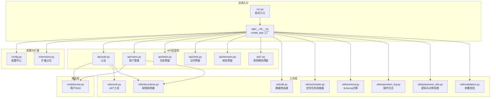
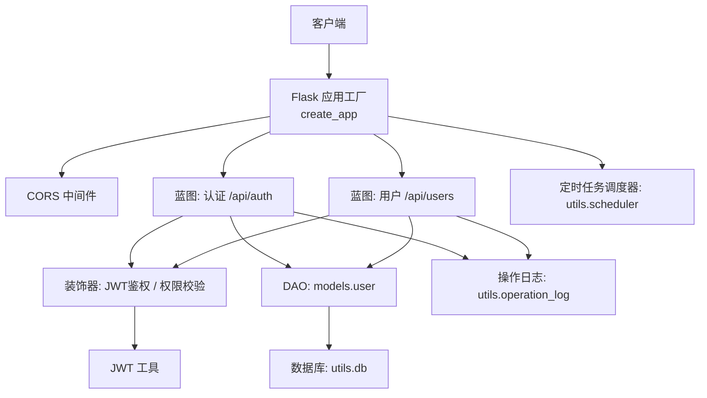
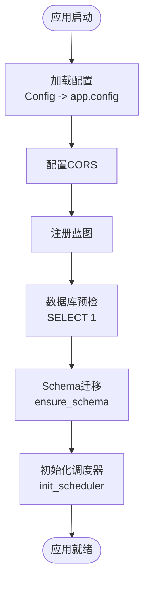
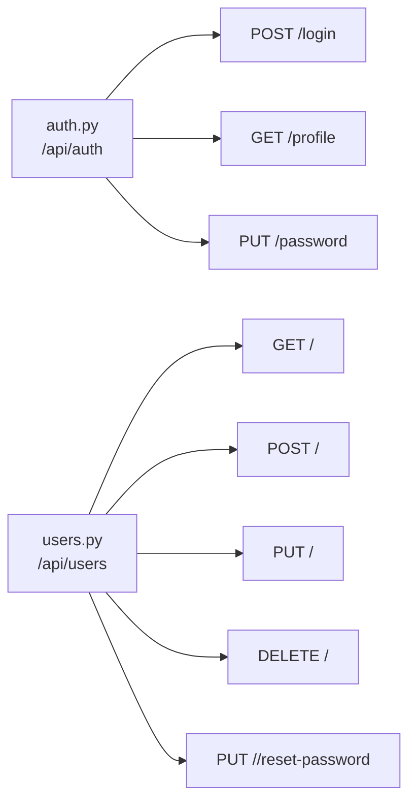
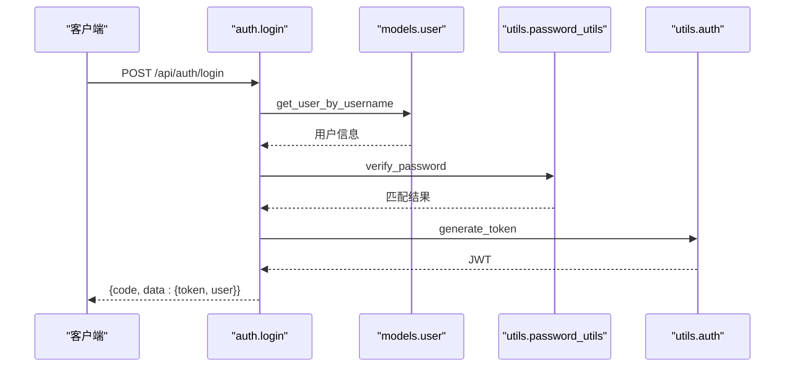
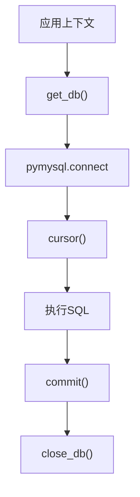
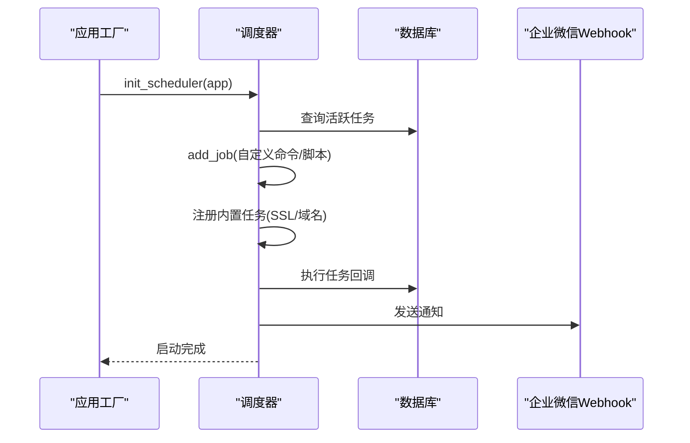
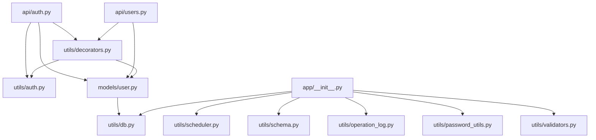

# 架构设计

<cite>
**本文引用的文件**
- [backend/app/__init__.py](file://backend/app/__init__.py)
- [backend/app/config.py](file://backend/app/config.py)
- [backend/app/extensions.py](file://backend/app/extensions.py)
- [backend/run.py](file://backend/run.py)
- [backend/app/api/auth.py](file://backend/app/api/auth.py)
- [backend/app/api/users.py](file://backend/app/api/users.py)
- [backend/app/utils/db.py](file://backend/app/utils/db.py)
- [backend/app/utils/auth.py](file://backend/app/utils/auth.py)
- [backend/app/utils/decorators.py](file://backend/app/utils/decorators.py)
- [backend/app/utils/schema.py](file://backend/app/utils/schema.py)
- [backend/app/utils/scheduler.py](file://backend/app/utils/scheduler.py)
- [backend/app/utils/password_utils.py](file://backend/app/utils/password_utils.py)
- [backend/app/utils/validators.py](file://backend/app/utils/validators.py)
- [backend/app/utils/operation_log.py](file://backend/app/utils/operation_log.py)
- [backend/app/models/user.py](file://backend/app/models/user.py)
- [backend/init_db.py](file://backend/init_db.py)
</cite>

## 目录
1. [引言](#引言)
2. [项目结构](#项目结构)
3. [核心组件](#核心组件)
4. [架构总览](#架构总览)
5. [详细组件分析](#详细组件分析)
6. [依赖分析](#依赖分析)
7. [性能考虑](#性能考虑)
8. [故障排查指南](#故障排查指南)
9. [结论](#结论)
10. [附录](#附录)

## 引言
本文件面向OPS项目，系统性阐述基于Flask的后端架构设计与实现要点，重点覆盖以下方面：
- 整体架构模式：MVC思想下的蓝图架构与工厂模式
- 应用工厂模式：配置管理、扩展初始化、蓝图注册、数据库预检与Schema迁移、定时任务调度器初始化
- 模块化设计：API模块、工具类模块、数据模型的组织方式
- 数据流与控制流：从请求进入、鉴权、业务处理到数据库操作的完整链路
- 系统边界与组件交互：前后端、API层、工具层、数据层的职责划分
- 技术决策与约束：JWT鉴权、CORS策略、数据库连接与事务、加密与安全
- 架构演进与未来规划：从单体蓝图到微服务化、可观测性增强、自动化运维

## 项目结构
项目采用“应用工厂 + 蓝图 + 工具与模型分离”的分层组织方式：
- 应用入口与工厂：run.py负责启动，app/__init__.py提供create_app工厂函数
- 配置中心：app/config.py集中管理环境变量与默认值
- 扩展占位：app/extensions.py预留扩展初始化位置
- API层：按功能域拆分为多个Blueprint，如认证、用户、任务、证书、域名等
- 工具层：通用能力封装，如数据库连接、JWT、装饰器、调度器、密码与校验、操作日志
- 模型层：数据访问函数（DAO风格），封装SQL细节
- 初始化脚本：init_db.py负责全量建表与默认数据

图表来源
- [backend/run.py:1-8](file://backend/run.py#L1-L8)
- [backend/app/__init__.py:28-149](file://backend/app/__init__.py#L28-L149)
- [backend/app/config.py:10-58](file://backend/app/config.py#L10-L58)
- [backend/app/extensions.py:1-2](file://backend/app/extensions.py#L1-L2)
- [backend/app/api/auth.py:12-197](file://backend/app/api/auth.py#L12-L197)
- [backend/app/api/users.py:16-290](file://backend/app/api/users.py#L16-L290)
- [backend/app/utils/db.py:43-80](file://backend/app/utils/db.py#L43-L80)
- [backend/app/utils/auth.py:9-45](file://backend/app/utils/auth.py#L9-L45)
- [backend/app/utils/decorators.py:26-163](file://backend/app/utils/decorators.py#L26-L163)
- [backend/app/utils/scheduler.py:244-384](file://backend/app/utils/scheduler.py#L244-L384)
- [backend/app/utils/password_utils.py:52-130](file://backend/app/utils/password_utils.py#L52-L130)
- [backend/app/utils/validators.py:1-151](file://backend/app/utils/validators.py#L1-L151)
- [backend/app/utils/operation_log.py:49-172](file://backend/app/utils/operation_log.py#L49-L172)
- [backend/app/utils/schema.py:10-42](file://backend/app/utils/schema.py#L10-L42)
- [backend/app/models/user.py:8-162](file://backend/app/models/user.py#L8-L162)

章节来源
- [backend/run.py:1-8](file://backend/run.py#L1-L8)
- [backend/app/__init__.py:28-149](file://backend/app/__init__.py#L28-L149)
- [backend/app/config.py:10-58](file://backend/app/config.py#L10-L58)

## 核心组件
- 应用工厂与生命周期
  - create_app：集中配置、CORS、蓝图注册、数据库预检、Schema迁移、定时任务调度器初始化
  - register_blueprints：统一注册所有API蓝图
- 配置中心
  - 通过环境变量驱动，集中管理密钥、数据库、CORS、定时任务计划、Grafana集成等
- 权限与认证
  - JWT签发与校验、Bearer Token解析、用户存在性与启用状态校验、密码变更后Token失效机制
- 数据访问与Schema
  - DAO风格的数据访问函数，统一通过get_db获取连接；启动时进行Schema迁移
- 工具与调度
  - 定时任务调度器，支持Cron表达式、自定义命令与脚本文件执行、任务日志记录
- 安全与合规
  - 密码加密（bcrypt）、敏感数据对称加密（Fernet/PBKDF2派生）、参数校验、操作日志

章节来源
- [backend/app/__init__.py:28-149](file://backend/app/__init__.py#L28-L149)
- [backend/app/config.py:10-58](file://backend/app/config.py#L10-L58)
- [backend/app/utils/auth.py:9-45](file://backend/app/utils/auth.py#L9-L45)
- [backend/app/utils/decorators.py:26-163](file://backend/app/utils/decorators.py#L26-L163)
- [backend/app/utils/db.py:43-80](file://backend/app/utils/db.py#L43-L80)
- [backend/app/utils/schema.py:10-42](file://backend/app/utils/schema.py#L10-L42)
- [backend/app/utils/scheduler.py:244-384](file://backend/app/utils/scheduler.py#L244-L384)
- [backend/app/utils/password_utils.py:52-130](file://backend/app/utils/password_utils.py#L52-L130)
- [backend/app/utils/validators.py:1-151](file://backend/app/utils/validators.py#L1-L151)
- [backend/app/utils/operation_log.py:49-172](file://backend/app/utils/operation_log.py#L49-L172)

## 架构总览
OPS后端采用“应用工厂 + 蓝图 + 工具/模型分离”的MVC思想实现：
- 控制器（Controller）：Blueprint路由与视图函数
- 模型（Model）：DAO风格的数据访问函数
- 视图（View）：由蓝图返回JSON响应
- 工具（Utils）：认证、鉴权、数据库、调度、加密、校验、日志等横切能力

图表来源
- [backend/app/__init__.py:28-149](file://backend/app/__init__.py#L28-L149)
- [backend/app/api/auth.py:12-197](file://backend/app/api/auth.py#L12-L197)
- [backend/app/api/users.py:16-290](file://backend/app/api/users.py#L16-L290)
- [backend/app/utils/decorators.py:26-163](file://backend/app/utils/decorators.py#L26-L163)
- [backend/app/utils/auth.py:9-45](file://backend/app/utils/auth.py#L9-L45)
- [backend/app/models/user.py:8-162](file://backend/app/models/user.py#L8-L162)
- [backend/app/utils/db.py:43-80](file://backend/app/utils/db.py#L43-L80)
- [backend/app/utils/operation_log.py:49-172](file://backend/app/utils/operation_log.py#L49-L172)
- [backend/app/utils/scheduler.py:244-384](file://backend/app/utils/scheduler.py#L244-L384)

## 详细组件分析

### 应用工厂与生命周期（工厂模式）
- 关键职责
  - 统一配置加载（Config类属性注入app.config）
  - CORS策略配置（支持任意源与凭据）
  - 蓝图注册（register_blueprints）
  - 数据库预检（连接测试、日志脱敏）
  - Schema迁移（ensure_schema）
  - 定时任务调度器初始化（init_scheduler）
  - 请求体大小限制、中文Unicode保留、根路由健康检查
- 设计要点
  - 工厂函数集中初始化，避免全局副作用
  - app_context内执行数据库预检与Schema迁移，保证应用可用性
  - 调度器独立连接，失败不影响主应用启动

图表来源
- [backend/app/__init__.py:28-149](file://backend/app/__init__.py#L28-L149)
- [backend/app/utils/schema.py:10-42](file://backend/app/utils/schema.py#L10-L42)
- [backend/app/utils/scheduler.py:244-384](file://backend/app/utils/scheduler.py#L244-L384)

章节来源
- [backend/app/__init__.py:28-149](file://backend/app/__init__.py#L28-L149)
- [backend/app/config.py:10-58](file://backend/app/config.py#L10-L58)

### 配置管理（Config）
- 环境变量驱动：密钥、数据库、调试、监听、上传目录、CORS、定时任务计划、Grafana集成
- 默认值与校验：通过环境变量覆盖，避免硬编码
- CORS工具方法：将逗号分隔字符串转为列表

章节来源
- [backend/app/config.py:10-58](file://backend/app/config.py#L10-L58)

### 蓝图架构（MVC中的控制器）
- 认证蓝图：登录、获取当前用户资料、修改密码
- 用户管理蓝图：管理员权限下的用户增删改查、重置密码
- 其他蓝图：任务、证书、域名、仪表盘、字典、凭证等预留模块

图表来源
- [backend/app/api/auth.py:12-197](file://backend/app/api/auth.py#L12-L197)
- [backend/app/api/users.py:16-290](file://backend/app/api/users.py#L16-L290)

章节来源
- [backend/app/api/auth.py:12-197](file://backend/app/api/auth.py#L12-L197)
- [backend/app/api/users.py:16-290](file://backend/app/api/users.py#L16-L290)

### 权限与认证（JWT与装饰器）
- JWT签发：包含用户ID、用户名、角色、签发/过期时间，使用配置的密钥签名
- JWT校验：支持过期与非法Token处理
- 权限装饰器：校验Authorization头、用户存在与启用、密码变更后Token失效、角色白名单

图表来源
- [backend/app/api/auth.py:15-96](file://backend/app/api/auth.py#L15-L96)
- [backend/app/models/user.py:36-52](file://backend/app/models/user.py#L36-L52)
- [backend/app/utils/password_utils.py:64-90](file://backend/app/utils/password_utils.py#L64-L90)
- [backend/app/utils/auth.py:9-28](file://backend/app/utils/auth.py#L9-L28)

章节来源
- [backend/app/utils/auth.py:9-45](file://backend/app/utils/auth.py#L9-L45)
- [backend/app/utils/decorators.py:26-163](file://backend/app/utils/decorators.py#L26-L163)
- [backend/app/utils/password_utils.py:52-130](file://backend/app/utils/password_utils.py#L52-L130)
- [backend/app/models/user.py:8-162](file://backend/app/models/user.py#L8-L162)

### 数据访问与Schema迁移（DAO与启动迁移）
- 数据库连接：Flask g上下文缓存连接，关闭钩子释放
- DAO函数：用户相关CRUD、密码更新等
- Schema迁移：启动时幂等添加缺失列（如password_changed_at）

图表来源
- [backend/app/utils/db.py:43-80](file://backend/app/utils/db.py#L43-L80)
- [backend/app/utils/schema.py:10-42](file://backend/app/utils/schema.py#L10-L42)
- [backend/app/models/user.py:8-162](file://backend/app/models/user.py#L8-L162)

章节来源
- [backend/app/utils/db.py:43-80](file://backend/app/utils/db.py#L43-L80)
- [backend/app/utils/schema.py:10-42](file://backend/app/utils/schema.py#L10-L42)
- [backend/app/models/user.py:8-162](file://backend/app/models/user.py#L8-L162)

### 定时任务调度器（后台任务与内置任务）
- 独立连接：避免与Web请求共享连接
- Cron调度：解析表达式、替换同名任务、启动调度器
- 任务执行：记录任务日志、更新任务状态、超时处理
- 内置任务：SSL证书自动检测与通知、域名到期通知

图表来源
- [backend/app/utils/scheduler.py:244-384](file://backend/app/utils/scheduler.py#L244-L384)
- [backend/app/utils/scheduler.py:391-580](file://backend/app/utils/scheduler.py#L391-L580)

章节来源
- [backend/app/utils/scheduler.py:244-384](file://backend/app/utils/scheduler.py#L244-L384)
- [backend/app/utils/scheduler.py:391-580](file://backend/app/utils/scheduler.py#L391-L580)

### 安全与合规（密码与对称加密、参数校验、操作日志）
- 密码加密：bcrypt哈希，兼容Werkzeug scrypt格式
- 对称加密：Fernet密钥或PBKDF2派生，支持敏感信息存储
- 参数校验：IP/主机名/URL/端口/域名/邮箱/整数/字符串长度等
- 操作日志：记录模块、动作、目标、详情、IP、UA、UTC时间

章节来源
- [backend/app/utils/password_utils.py:52-130](file://backend/app/utils/password_utils.py#L52-L130)
- [backend/app/utils/validators.py:1-151](file://backend/app/utils/validators.py#L1-L151)
- [backend/app/utils/operation_log.py:49-172](file://backend/app/utils/operation_log.py#L49-L172)

### 数据库初始化与默认数据
- 全量建表：init_db脚本创建用户、服务器、项目、服务、字典、凭证、域名、证书、定时任务、任务日志、操作日志等表
- 默认数据：插入默认管理员、字典项等
- 兼容性：为既有表添加project_id等字段

章节来源
- [backend/init_db.py:22-395](file://backend/init_db.py#L22-L395)

## 依赖分析
- 组件耦合
  - API蓝图依赖装饰器与工具模块（JWT、校验、日志）
  - DAO依赖数据库工具
  - 调度器依赖数据库工具与脚本执行工具
- 外部依赖
  - Flask、Flask-CORS、PyMySQL、APScheduler、bcrypt、cryptography、PyJWT
- 循环依赖
  - 当前结构未见循环导入；蓝图注册集中在工厂函数，避免相互引用

图表来源
- [backend/app/api/auth.py:12-197](file://backend/app/api/auth.py#L12-L197)
- [backend/app/api/users.py:16-290](file://backend/app/api/users.py#L16-L290)
- [backend/app/utils/decorators.py:26-163](file://backend/app/utils/decorators.py#L26-L163)
- [backend/app/utils/auth.py:9-45](file://backend/app/utils/auth.py#L9-L45)
- [backend/app/models/user.py:8-162](file://backend/app/models/user.py#L8-L162)
- [backend/app/utils/db.py:43-80](file://backend/app/utils/db.py#L43-L80)
- [backend/app/utils/scheduler.py:244-384](file://backend/app/utils/scheduler.py#L244-L384)
- [backend/app/utils/schema.py:10-42](file://backend/app/utils/schema.py#L10-L42)
- [backend/app/utils/operation_log.py:49-172](file://backend/app/utils/operation_log.py#L49-L172)
- [backend/app/utils/password_utils.py:52-130](file://backend/app/utils/password_utils.py#L52-L130)
- [backend/app/utils/validators.py:1-151](file://backend/app/utils/validators.py#L1-L151)

章节来源
- [backend/app/__init__.py:116-149](file://backend/app/__init__.py#L116-L149)

## 性能考虑
- 数据库连接
  - 使用Flask g缓存连接，减少重复建立连接的开销
  - 连接超时与异常日志，便于定位网络问题
- 调度器
  - 独立连接与线程池，避免阻塞Web请求
  - Cron触发粒度与任务超时控制
- 缓存与索引
  - 建议在高频查询字段上增加索引（如用户表username、项目表name等）
- 日志与监控
  - 统一日志级别与格式，结合外部日志收集系统
  - Grafana集成配置项可用于可视化监控

## 故障排查指南
- 启动阶段
  - 数据库预检失败：检查DB_HOST/DB_PORT/DB_USER/DB_PASSWORD/DB_NAME与网络连通性
  - Schema迁移异常：确认MySQL权限与表结构兼容性
- 认证与鉴权
  - JWT密钥未配置：生产环境必须设置JWT_SECRET_KEY
  - Token无效或过期：检查签发时间与密码变更时间
- 调度器
  - 任务未执行：检查Cron表达式、脚本路径或自定义命令
  - 通知未发送：检查企业微信Webhook URL配置
- 日志
  - 操作日志写入失败：关注错误级别日志，确保数据库可用

章节来源
- [backend/app/__init__.py:88-113](file://backend/app/__init__.py#L88-L113)
- [backend/app/utils/auth.py:24-28](file://backend/app/utils/auth.py#L24-L28)
- [backend/app/utils/scheduler.py:376-383](file://backend/app/utils/scheduler.py#L376-L383)
- [backend/app/utils/operation_log.py:113-115](file://backend/app/utils/operation_log.py#L113-L115)

## 结论
OPS项目遵循Flask应用工厂与蓝图架构，结合DAO风格的数据访问与工具层横切能力，形成清晰的MVC分层与模块化设计。通过JWT认证、CORS策略、Schema迁移与定时任务调度器等关键组件，实现了认证授权、数据管理与自动化运维的核心能力。建议后续在微服务化、可观测性与自动化运维方面持续演进。

## 附录
- 架构演进与未来规划
  - 模块拆分：将大型蓝图拆分为独立子应用或微服务模块
  - 可观测性：引入指标采集、分布式追踪与告警
  - 自动化：CI/CD流水线、基础设施即代码（IaC）、蓝绿发布
  - 安全加固：OAuth2/OpenID Connect、审计日志增强、敏感数据脱敏
  - 性能优化：连接池、缓存策略、异步任务与队列