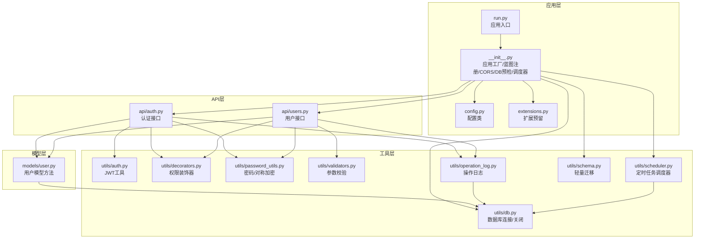
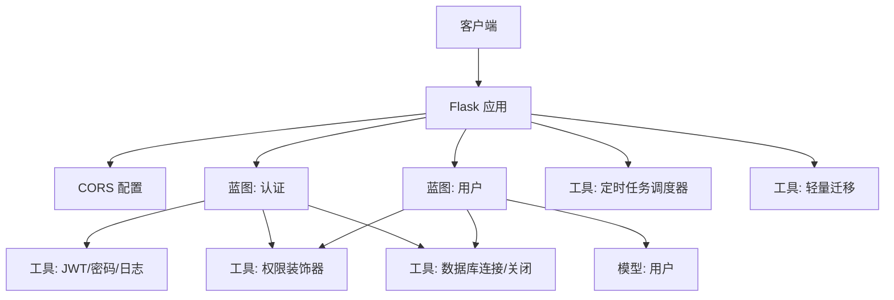
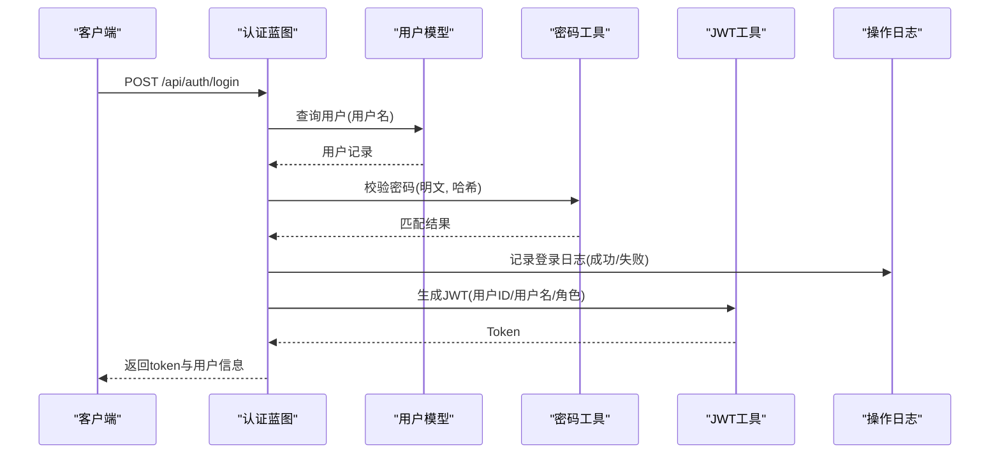
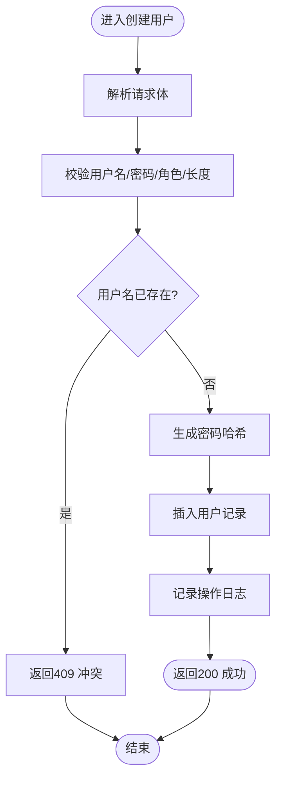
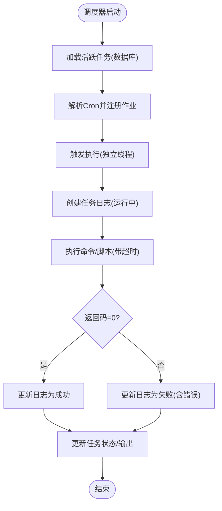
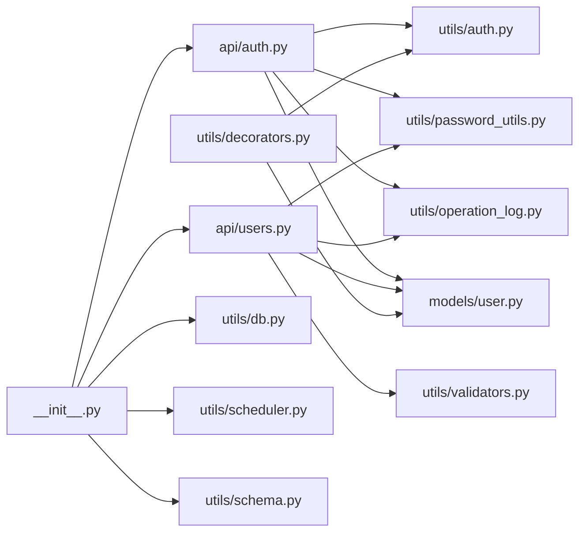

# 模块化设计

<cite>
**本文引用的文件**
- [backend/app/__init__.py](file://backend/app/__init__.py)
- [backend/app/config.py](file://backend/app/config.py)
- [backend/app/extensions.py](file://backend/app/extensions.py)
- [backend/app/models/user.py](file://backend/app/models/user.py)
- [backend/app/utils/auth.py](file://backend/app/utils/auth.py)
- [backend/app/api/users.py](file://backend/app/api/users.py)
- [backend/app/api/auth.py](file://backend/app/api/auth.py)
- [backend/app/utils/db.py](file://backend/app/utils/db.py)
- [backend/app/utils/decorators.py](file://backend/app/utils/decorators.py)
- [backend/app/utils/schema.py](file://backend/app/utils/schema.py)
- [backend/app/utils/password_utils.py](file://backend/app/utils/password_utils.py)
- [backend/app/utils/validators.py](file://backend/app/utils/validators.py)
- [backend/app/utils/scheduler.py](file://backend/app/utils/scheduler.py)
- [backend/app/utils/operation_log.py](file://backend/app/utils/operation_log.py)
- [backend/run.py](file://backend/run.py)
</cite>

## 目录
1. [引言](#引言)
2. [项目结构](#项目结构)
3. [核心组件](#核心组件)
4. [架构总览](#架构总览)
5. [详细组件分析](#详细组件分析)
6. [依赖分析](#依赖分析)
7. [性能考量](#性能考量)
8. [故障排查指南](#故障排查指南)
9. [结论](#结论)
10. [附录](#附录)

## 引言
本文件面向OPS项目的模块化设计，系统性阐述API模块、工具类模块、数据模型模块的职责划分与协作方式，解释模块间依赖关系与通信机制，总结模块化带来的好处，并给出扩展新模块的流程、接口规范与命名约定，以及最佳实践建议（单一职责、接口稳定性、向后兼容）。

## 项目结构
项目采用“按职责分层 + 功能模块聚合”的组织方式：
- 应用入口与装配：通过应用工厂函数创建Flask应用，集中注册蓝图、配置CORS、数据库连接钩子与定时任务调度器。
- API模块：以蓝图形式组织各业务域的REST接口，如用户、认证、服务器、服务、应用、证书、仪表盘、字典、阿里云凭证、域名、操作日志、监控、项目等。
- 工具类模块：提供认证、数据库连接、装饰器、密码处理、参数校验、定时任务、操作日志、模式迁移等通用能力。
- 数据模型模块：封装与数据库交互的领域模型方法，如用户增删改查、密码更新等。
- 配置与扩展：集中管理运行时配置与扩展点预留。

图表来源
- [backend/run.py:1-8](file://backend/run.py#L1-L8)
- [backend/app/__init__.py:28-149](file://backend/app/__init__.py#L28-L149)
- [backend/app/config.py:10-58](file://backend/app/config.py#L10-L58)
- [backend/app/extensions.py:1-2](file://backend/app/extensions.py#L1-L2)
- [backend/app/api/auth.py:1-197](file://backend/app/api/auth.py#L1-L197)
- [backend/app/api/users.py:1-290](file://backend/app/api/users.py#L1-L290)
- [backend/app/utils/auth.py:1-45](file://backend/app/utils/auth.py#L1-L45)
- [backend/app/utils/decorators.py:1-163](file://backend/app/utils/decorators.py#L1-L163)
- [backend/app/utils/db.py:1-80](file://backend/app/utils/db.py#L1-L80)
- [backend/app/utils/password_utils.py:1-130](file://backend/app/utils/password_utils.py#L1-L130)
- [backend/app/utils/validators.py:1-151](file://backend/app/utils/validators.py#L1-L151)
- [backend/app/utils/operation_log.py:1-172](file://backend/app/utils/operation_log.py#L1-L172)
- [backend/app/utils/scheduler.py:1-580](file://backend/app/utils/scheduler.py#L1-L580)
- [backend/app/utils/schema.py:1-42](file://backend/app/utils/schema.py#L1-L42)
- [backend/app/models/user.py:1-162](file://backend/app/models/user.py#L1-L162)

章节来源
- [backend/app/__init__.py:28-149](file://backend/app/__init__.py#L28-L149)
- [backend/app/config.py:10-58](file://backend/app/config.py#L10-L58)
- [backend/run.py:1-8](file://backend/run.py#L1-L8)

## 核心组件
- 应用工厂与装配
  - 应用工厂负责配置日志、JSON编码、密钥、CORS、蓝图注册、数据库预检、模式迁移与调度器初始化。
  - 蓝图注册集中于一个函数，便于统一管理与扩展。
- 配置中心
  - 集中管理密钥、数据库、上传目录、CORS、定时任务计划、第三方服务地址等。
- 数据模型
  - 用户模型封装数据库访问与业务方法，如创建、查询、更新、删除、密码更新。
- 工具类
  - 认证：JWT生成与校验。
  - 权限：基于JWT的认证与角色装饰器。
  - 数据库：Flask上下文缓存的连接与关闭钩子。
  - 密码：bcrypt哈希与对称加密（Fernet/PBKDF2）。
  - 校验：IP、主机名、URL、端口、域名、密码、用户名、邮箱、整数、字符串长度等。
  - 定时任务：APScheduler封装，支持Cron触发、任务日志、超时控制、内置任务。
  - 操作日志：统一记录模块、动作、目标、详情、IP、UA等。
  - 模式迁移：轻量幂等迁移，补充缺失列。

章节来源
- [backend/app/__init__.py:28-149](file://backend/app/__init__.py#L28-L149)
- [backend/app/config.py:10-58](file://backend/app/config.py#L10-L58)
- [backend/app/models/user.py:1-162](file://backend/app/models/user.py#L1-L162)
- [backend/app/utils/auth.py:1-45](file://backend/app/utils/auth.py#L1-L45)
- [backend/app/utils/decorators.py:1-163](file://backend/app/utils/decorators.py#L1-L163)
- [backend/app/utils/db.py:1-80](file://backend/app/utils/db.py#L1-L80)
- [backend/app/utils/password_utils.py:1-130](file://backend/app/utils/password_utils.py#L1-L130)
- [backend/app/utils/validators.py:1-151](file://backend/app/utils/validators.py#L1-L151)
- [backend/app/utils/scheduler.py:1-580](file://backend/app/utils/scheduler.py#L1-L580)
- [backend/app/utils/operation_log.py:1-172](file://backend/app/utils/operation_log.py#L1-L172)
- [backend/app/utils/schema.py:1-42](file://backend/app/utils/schema.py#L1-L42)

## 架构总览
应用采用“工厂函数 + 蓝图 + 工具/模型分层”的结构，API层通过装饰器实现认证与授权，工具层提供横切关注点（认证、权限、日志、定时任务、数据库、校验、密码），模型层聚焦数据访问与简单业务逻辑。

图表来源
- [backend/app/__init__.py:28-149](file://backend/app/__init__.py#L28-L149)
- [backend/app/api/auth.py:1-197](file://backend/app/api/auth.py#L1-L197)
- [backend/app/api/users.py:1-290](file://backend/app/api/users.py#L1-L290)
- [backend/app/utils/decorators.py:1-163](file://backend/app/utils/decorators.py#L1-L163)
- [backend/app/utils/db.py:1-80](file://backend/app/utils/db.py#L1-L80)
- [backend/app/utils/scheduler.py:1-580](file://backend/app/utils/scheduler.py#L1-L580)
- [backend/app/utils/schema.py:1-42](file://backend/app/utils/schema.py#L1-L42)

## 详细组件分析

### 组件A：认证与用户管理模块
- 职责划分
  - 认证API：登录、获取个人资料、修改密码。
  - 用户API：管理员视角的用户增删改查、重置密码。
  - 工具支撑：JWT生成/校验、密码哈希/校验、权限装饰器、操作日志。
  - 模型支撑：用户数据访问与更新。
- 通信机制
  - API通过蓝图暴露HTTP接口，内部调用工具与模型方法，装饰器在进入业务逻辑前完成鉴权与权限校验。
- 关键流程（登录序列）

图表来源
- [backend/app/api/auth.py:15-95](file://backend/app/api/auth.py#L15-L95)
- [backend/app/models/user.py:36-52](file://backend/app/models/user.py#L36-L52)
- [backend/app/utils/password_utils.py:64-91](file://backend/app/utils/password_utils.py#L64-L91)
- [backend/app/utils/auth.py:9-28](file://backend/app/utils/auth.py#L9-L28)
- [backend/app/utils/operation_log.py:121-131](file://backend/app/utils/operation_log.py#L121-L131)

- 关键流程（用户创建流程）

图表来源
- [backend/app/api/users.py:35-110](file://backend/app/api/users.py#L35-L110)
- [backend/app/utils/password_utils.py:52-62](file://backend/app/utils/password_utils.py#L52-L62)
- [backend/app/utils/operation_log.py:49-119](file://backend/app/utils/operation_log.py#L49-L119)

章节来源
- [backend/app/api/auth.py:1-197](file://backend/app/api/auth.py#L1-L197)
- [backend/app/api/users.py:1-290](file://backend/app/api/users.py#L1-L290)
- [backend/app/utils/auth.py:1-45](file://backend/app/utils/auth.py#L1-L45)
- [backend/app/utils/decorators.py:1-163](file://backend/app/utils/decorators.py#L1-L163)
- [backend/app/utils/password_utils.py:1-130](file://backend/app/utils/password_utils.py#L1-L130)
- [backend/app/utils/operation_log.py:1-172](file://backend/app/utils/operation_log.py#L1-L172)
- [backend/app/models/user.py:1-162](file://backend/app/models/user.py#L1-L162)

### 组件B：数据库与定时任务模块
- 数据库模块
  - 提供Flask上下文缓存的连接获取与关闭钩子，连接参数来自配置，日志中脱敏密码，异常时记录详细信息。
- 定时任务模块
  - 基于APScheduler，支持Cron触发、任务日志、超时控制、并发线程执行、内置SSL证书检测与域名到期通知任务。
  - 从数据库加载活跃任务，支持新旧两种执行路径（自定义命令+目录与单文件脚本）。
- 关键流程（定时任务执行）

图表来源
- [backend/app/utils/scheduler.py:244-384](file://backend/app/utils/scheduler.py#L244-L384)
- [backend/app/utils/scheduler.py:39-179](file://backend/app/utils/scheduler.py#L39-L179)

章节来源
- [backend/app/utils/db.py:1-80](file://backend/app/utils/db.py#L1-L80)
- [backend/app/utils/scheduler.py:1-580](file://backend/app/utils/scheduler.py#L1-L580)
- [backend/app/utils/schema.py:1-42](file://backend/app/utils/schema.py#L1-L42)

### 组件C：权限与操作日志模块
- 权限装饰器
  - 校验Authorization头格式、JWT有效性、用户存在与启用状态、密码修改时间与签发时间比较，注入g.current_user。
  - 角色装饰器基于g.current_user.role进行授权判断。
- 操作日志
  - 统一记录模块、动作、目标、详情、IP、UA、UTC时间，支持登录/登出/业务操作等场景。

章节来源
- [backend/app/utils/decorators.py:1-163](file://backend/app/utils/decorators.py#L1-L163)
- [backend/app/utils/operation_log.py:1-172](file://backend/app/utils/operation_log.py#L1-L172)

## 依赖分析
- 模块内聚与耦合
  - API层高内聚：同一业务域的接口集中在对应蓝图，依赖工具与模型方法。
  - 工具层低耦合：认证、权限、数据库、密码、校验、日志、调度器相互独立，便于复用与替换。
  - 模型层专注数据访问：与工具层弱耦合，仅依赖数据库工具。
- 直接与间接依赖
  - API → 工具/模型：直接依赖。
  - 工具/模型 → 数据库工具：直接依赖。
  - 应用工厂 → 所有工具/模型/蓝图：集中装配。
- 循环依赖
  - 当前结构未见循环依赖，装饰器与模型通过字符串导入避免循环。

图表来源
- [backend/app/api/auth.py:1-197](file://backend/app/api/auth.py#L1-L197)
- [backend/app/api/users.py:1-290](file://backend/app/api/users.py#L1-L290)
- [backend/app/utils/auth.py:1-45](file://backend/app/utils/auth.py#L1-L45)
- [backend/app/utils/password_utils.py:1-130](file://backend/app/utils/password_utils.py#L1-L130)
- [backend/app/utils/validators.py:1-151](file://backend/app/utils/validators.py#L1-L151)
- [backend/app/utils/operation_log.py:1-172](file://backend/app/utils/operation_log.py#L1-L172)
- [backend/app/models/user.py:1-162](file://backend/app/models/user.py#L1-L162)
- [backend/app/utils/decorators.py:1-163](file://backend/app/utils/decorators.py#L1-L163)
- [backend/app/utils/db.py:1-80](file://backend/app/utils/db.py#L1-L80)
- [backend/app/utils/scheduler.py:1-580](file://backend/app/utils/scheduler.py#L1-L580)
- [backend/app/utils/schema.py:1-42](file://backend/app/utils/schema.py#L1-L42)
- [backend/app/__init__.py:116-149](file://backend/app/__init__.py#L116-L149)

## 性能考量
- 数据库连接
  - 使用Flask应用上下文缓存连接，减少重复建立连接的开销；异常时记录详细参数，便于定位网络/凭据问题。
- 定时任务
  - 独立线程执行，避免阻塞主进程；超时控制防止长时间卡死；Cron解析失败时记录异常，不影响其他任务。
- 认证与权限
  - JWT校验与用户存在性检查在装饰器中完成，避免重复查询；密码校验支持多种格式，兼顾历史兼容。
- 日志与迁移
  - 操作日志与模式迁移均在异常时记录详细信息，便于排障；迁移幂等，避免重复ALTER。

## 故障排查指南
- 数据库连接失败
  - 现象：应用启动阶段连接预检失败。
  - 排查：检查DB_HOST/DB_PORT/DB_USER/DB_PASSWORD/DB_NAME与MySQL可达性；查看日志中脱敏后的连接参数。
  - 参考
    - [backend/app/__init__.py:88-104](file://backend/app/__init__.py#L88-L104)
    - [backend/app/utils/db.py:28-69](file://backend/app/utils/db.py#L28-L69)
- JWT签发失败
  - 现象：登录成功但无法签发token。
  - 排查：确认JWT_SECRET_KEY已配置；检查密钥长度与格式。
  - 参考
    - [backend/app/utils/auth.py:24-28](file://backend/app/utils/auth.py#L24-L28)
    - [backend/app/__init__.py:41-45](file://backend/app/__init__.py#L41-L45)
- 权限不足
  - 现象：返回403权限不足。
  - 排查：确认用户角色满足接口要求；检查装饰器顺序（jwt_required需在role_required外层）。
  - 参考
    - [backend/app/utils/decorators.py:126-162](file://backend/app/utils/decorators.py#L126-L162)
- 定时任务未执行
  - 现象：任务未触发或报错。
  - 排查：检查Cron表达式格式；确认脚本路径或自定义命令可用；查看任务日志与错误信息。
  - 参考
    - [backend/app/utils/scheduler.py:194-228](file://backend/app/utils/scheduler.py#L194-L228)
    - [backend/app/utils/scheduler.py:39-179](file://backend/app/utils/scheduler.py#L39-L179)

章节来源
- [backend/app/__init__.py:88-104](file://backend/app/__init__.py#L88-L104)
- [backend/app/utils/db.py:28-69](file://backend/app/utils/db.py#L28-L69)
- [backend/app/utils/auth.py:24-28](file://backend/app/utils/auth.py#L24-L28)
- [backend/app/__init__.py:41-45](file://backend/app/__init__.py#L41-L45)
- [backend/app/utils/decorators.py:126-162](file://backend/app/utils/decorators.py#L126-L162)
- [backend/app/utils/scheduler.py:194-228](file://backend/app/utils/scheduler.py#L194-L228)
- [backend/app/utils/scheduler.py:39-179](file://backend/app/utils/scheduler.py#L39-L179)

## 结论
OPS项目通过清晰的模块化设计实现了职责分离与高内聚低耦合：API层专注于接口契约与业务编排，工具层提供横切能力，模型层聚焦数据访问。模块间通过蓝图、装饰器、工具函数与配置中心进行松耦合协作。模块化带来了更好的代码复用、可维护性与测试便利性，同时为后续扩展提供了稳定接口与清晰边界。

## 附录

### 模块扩展机制与最佳实践
- 新模块添加流程
  - 在API目录新增蓝图文件，定义路由与业务逻辑。
  - 在应用工厂的蓝图注册函数中导入并注册蓝图。
  - 如需通用能力，优先在工具层扩展；如涉及数据访问，优先在模型层封装。
  - 在配置中增加必要环境变量与默认值。
- 接口规范
  - 统一响应结构：包含状态码与消息；数据字段统一在data中返回。
  - 统一鉴权：在蓝图上使用@jwt_required与@role_required装饰器。
  - 统一日志：对关键操作调用操作日志工具记录。
- 命名约定
  - 蓝图：小写模块名（如users、auth）。
  - 工具函数：语义明确、动宾结构（如generate_token、verify_token）。
  - 模型方法：动词+名词（如create_user、get_user_by_id）。
- 最佳实践
  - 单一职责：每个模块只负责一个领域或能力。
  - 接口稳定性：对外接口保持向后兼容，新增字段以可选方式呈现。
  - 向后兼容：密码格式、配置项变更时提供兼容逻辑与迁移步骤。
  - 错误处理：异常时记录详细上下文，返回标准化错误码与消息。