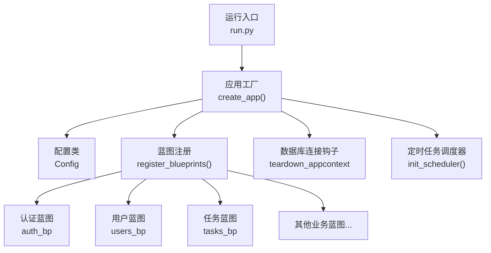
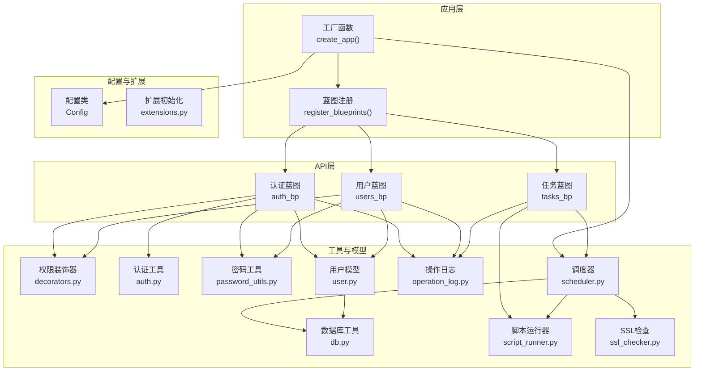
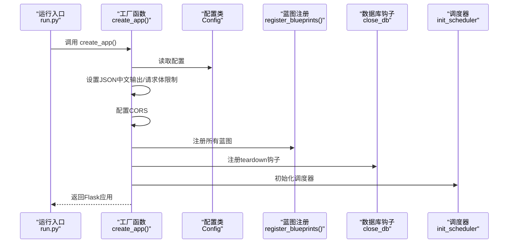
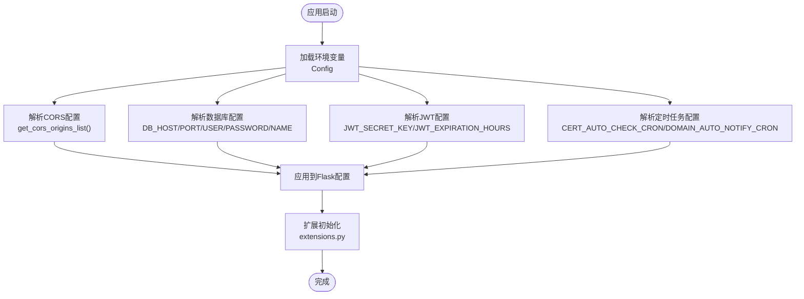
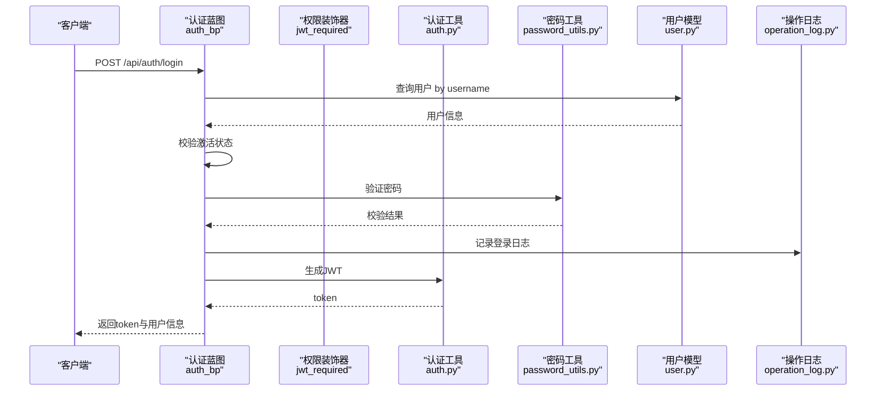
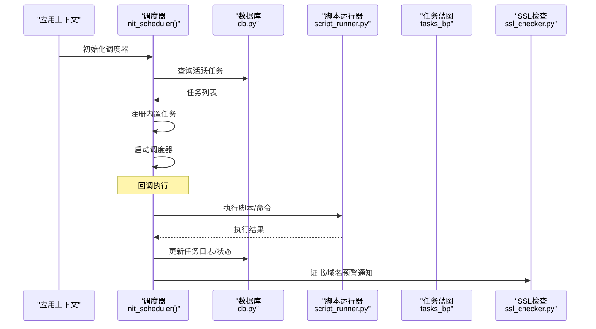
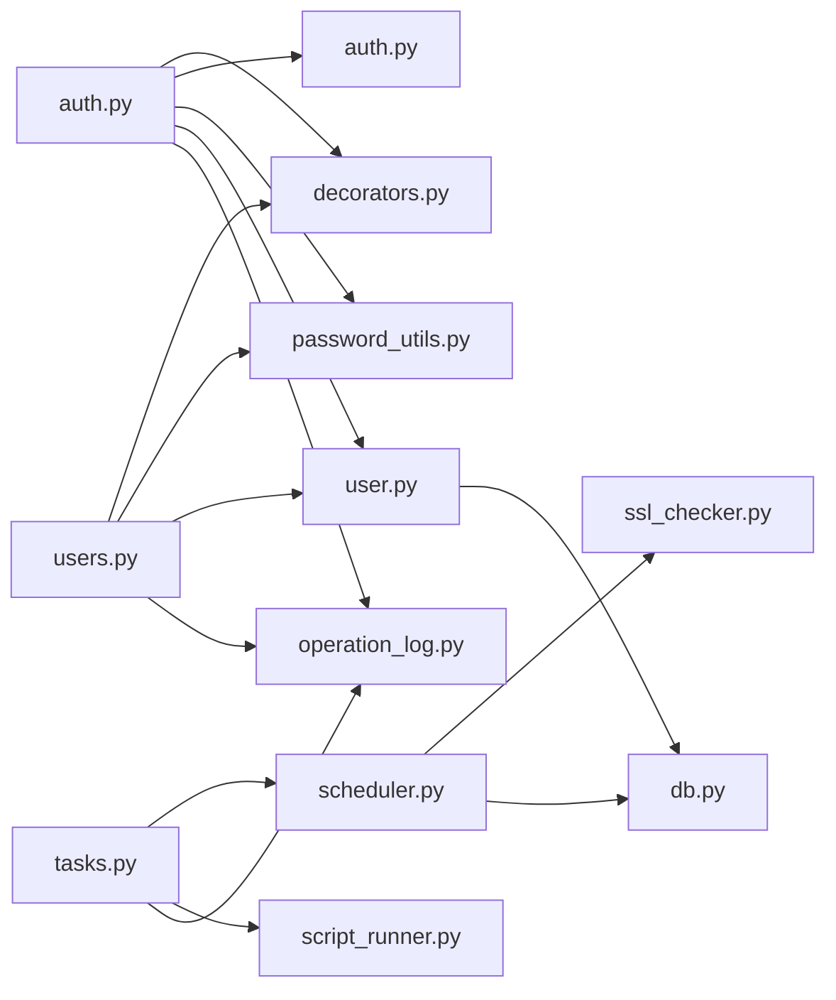

# 组件交互关系

<cite>
**本文引用的文件**
- [backend/app/__init__.py](file://backend/app/__init__.py)
- [backend/app/config.py](file://backend/app/config.py)
- [backend/app/extensions.py](file://backend/app/extensions.py)
- [backend/run.py](file://backend/run.py)
- [backend/app/api/auth.py](file://backend/app/api/auth.py)
- [backend/app/utils/db.py](file://backend/app/utils/db.py)
- [backend/app/utils/scheduler.py](file://backend/app/utils/scheduler.py)
- [backend/app/utils/decorators.py](file://backend/app/utils/decorators.py)
- [backend/app/utils/auth.py](file://backend/app/utils/auth.py)
- [backend/app/models/user.py](file://backend/app/models/user.py)
- [backend/app/utils/password_utils.py](file://backend/app/utils/password_utils.py)
- [backend/app/utils/script_runner.py](file://backend/app/utils/script_runner.py)
- [backend/app/api/users.py](file://backend/app/api/users.py)
- [backend/app/api/tasks.py](file://backend/app/api/tasks.py)
- [backend/app/utils/operation_log.py](file://backend/app/utils/operation_log.py)
- [backend/app/utils/ssl_checker.py](file://backend/app/utils/ssl_checker.py)
</cite>

## 目录
1. [引言](#引言)
2. [项目结构](#项目结构)
3. [核心组件](#核心组件)
4. [架构总览](#架构总览)
5. [详细组件分析](#详细组件分析)
6. [依赖分析](#依赖分析)
7. [性能考虑](#性能考虑)
8. [故障排查指南](#故障排查指南)
9. [结论](#结论)
10. [附录](#附录)

## 引言
本文件面向OPS项目的组件交互关系，系统性梳理应用工厂与蓝图注册、配置管理与扩展初始化、API模块与工具类的调用关系，解释事件驱动、回调函数、消息传递与状态共享机制，阐述生命周期管理（初始化顺序、依赖注入、资源清理），并给出解耦策略与扩展替换指导。

## 项目结构
后端采用Flask应用工厂模式，核心入口通过工厂函数创建应用实例，集中配置日志、CORS、蓝图注册、数据库连接钩子以及定时任务调度器。各API蓝图位于api目录，工具类位于utils目录，模型位于models目录，配置由config模块提供，扩展初始化预留于extensions模块。

图表来源
- [backend/app/__init__.py:28-113](file://backend/app/__init__.py#L28-L113)
- [backend/app/config.py:10-57](file://backend/app/config.py#L10-L57)
- [backend/run.py:1-8](file://backend/run.py#L1-L8)

章节来源
- [backend/app/__init__.py:28-149](file://backend/app/__init__.py#L28-L149)
- [backend/app/config.py:10-57](file://backend/app/config.py#L10-L57)
- [backend/run.py:1-8](file://backend/run.py#L1-L8)

## 核心组件
- 应用工厂与蓝图注册
  - 工厂函数负责加载配置、设置日志、CORS、根路由、蓝图注册、数据库钩子与调度器初始化。
  - 蓝图注册集中在一个函数中，便于统一管理与扩展。
- 配置管理
  - 配置类从环境变量读取参数，提供CORS、数据库、JWT、定时任务等配置项。
- 工具类与模型
  - 数据库工具封装连接、关闭与日志；认证工具提供JWT生成与校验；密码工具提供哈希与对称加密；调度器封装APScheduler与脚本执行；脚本运行器支持.py/.sh/.sql；操作日志工具记录审计；SSL检查工具提供证书检测与企业微信通知。
- API模块
  - 认证API、用户管理API、任务管理API等，均通过装饰器实现JWT鉴权与角色控制，并调用模型与工具类完成业务逻辑。

章节来源
- [backend/app/__init__.py:28-149](file://backend/app/__init__.py#L28-L149)
- [backend/app/config.py:10-57](file://backend/app/config.py#L10-L57)
- [backend/app/utils/db.py:43-80](file://backend/app/utils/db.py#L43-L80)
- [backend/app/utils/auth.py:9-45](file://backend/app/utils/auth.py#L9-L45)
- [backend/app/utils/password_utils.py:52-130](file://backend/app/utils/password_utils.py#L52-L130)
- [backend/app/utils/scheduler.py:244-384](file://backend/app/utils/scheduler.py#L244-L384)
- [backend/app/utils/script_runner.py:19-126](file://backend/app/utils/script_runner.py#L19-L126)
- [backend/app/utils/operation_log.py:49-172](file://backend/app/utils/operation_log.py#L49-L172)
- [backend/app/utils/ssl_checker.py:48-166](file://backend/app/utils/ssl_checker.py#L48-L166)

## 架构总览
应用采用“工厂函数 + 蓝图 + 工具类 + 模型”的分层架构。工厂函数作为控制中心，负责装配配置、CORS、数据库钩子与调度器；API蓝图承载业务接口；工具类提供横切能力（认证、密码、调度、脚本执行、日志、SSL检查）；模型封装数据库访问。

图表来源
- [backend/app/__init__.py:28-149](file://backend/app/__init__.py#L28-L149)
- [backend/app/config.py:10-57](file://backend/app/config.py#L10-L57)
- [backend/app/extensions.py:1-2](file://backend/app/extensions.py#L1-L2)
- [backend/app/api/auth.py:12-197](file://backend/app/api/auth.py#L12-L197)
- [backend/app/api/users.py:16-290](file://backend/app/api/users.py#L16-L290)
- [backend/app/api/tasks.py:18-667](file://backend/app/api/tasks.py#L18-L667)
- [backend/app/utils/db.py:43-80](file://backend/app/utils/db.py#L43-L80)
- [backend/app/utils/decorators.py:26-163](file://backend/app/utils/decorators.py#L26-L163)
- [backend/app/utils/auth.py:9-45](file://backend/app/utils/auth.py#L9-L45)
- [backend/app/utils/password_utils.py:52-130](file://backend/app/utils/password_utils.py#L52-L130)
- [backend/app/utils/scheduler.py:244-384](file://backend/app/utils/scheduler.py#L244-L384)
- [backend/app/utils/script_runner.py:19-126](file://backend/app/utils/script_runner.py#L19-L126)
- [backend/app/utils/operation_log.py:49-172](file://backend/app/utils/operation_log.py#L49-L172)
- [backend/app/utils/ssl_checker.py:48-166](file://backend/app/utils/ssl_checker.py#L48-L166)
- [backend/app/models/user.py:8-162](file://backend/app/models/user.py#L8-L162)

## 详细组件分析

### 应用工厂与蓝图注册
- 工厂函数职责
  - 从配置类加载配置，设置JSON中文输出、请求体大小限制、根路由。
  - 配置CORS，支持白名单与credentials。
  - 注册全部蓝图。
  - 注册数据库连接关闭钩子。
  - 应用上下文中进行数据库预检、模式校验与调度器初始化。
- 蓝图注册
  - 统一在register_blueprints中注册，便于扩展与维护。

图表来源
- [backend/run.py:1-8](file://backend/run.py#L1-L8)
- [backend/app/__init__.py:28-113](file://backend/app/__init__.py#L28-L113)
- [backend/app/__init__.py:116-149](file://backend/app/__init__.py#L116-L149)

章节来源
- [backend/app/__init__.py:28-149](file://backend/app/__init__.py#L28-L149)
- [backend/run.py:1-8](file://backend/run.py#L1-L8)

### 配置管理与扩展初始化
- 配置类
  - 从环境变量读取SECRET_KEY、JWT_SECRET_KEY、JWT_EXPIRATION_HOURS、数据库连接参数、CORS、上传目录、定时任务表达式、SSL与域名告警阈值、Grafana集成等。
  - 提供CORS来源解析方法。
- 扩展初始化
  - 当前为空文件，预留后续添加扩展（如数据库ORM、缓存、消息队列等）。

图表来源
- [backend/app/config.py:10-57](file://backend/app/config.py#L10-L57)
- [backend/app/extensions.py:1-2](file://backend/app/extensions.py#L1-L2)

章节来源
- [backend/app/config.py:10-57](file://backend/app/config.py#L10-L57)
- [backend/app/extensions.py:1-2](file://backend/app/extensions.py#L1-L2)

### API模块与工具类的调用关系
- 认证API
  - 登录流程：接收用户名/密码 → 查询用户 → 校验激活状态 → 验证密码 → 记录操作日志 → 生成JWT → 返回token与用户信息。
  - 装饰器：@jwt_required在蓝图上使用，校验令牌、用户存在与启用状态、密码变更后令牌失效。
  - 工具类：密码工具、认证工具、操作日志工具、用户模型。
- 用户管理API
  - 管理员权限：@role_required(['admin'])。
  - 调用用户模型进行增删改查与密码更新，使用密码工具进行哈希，使用操作日志记录。
- 任务管理API
  - 任务创建/更新/删除/启停/手动执行，涉及调度器、脚本运行器、数据库。
  - 调度器回调：独立数据库连接、线程执行、超时处理、日志落库。

图表来源
- [backend/app/api/auth.py:15-96](file://backend/app/api/auth.py#L15-L96)
- [backend/app/utils/decorators.py:26-123](file://backend/app/utils/decorators.py#L26-L123)
- [backend/app/utils/auth.py:9-45](file://backend/app/utils/auth.py#L9-L45)
- [backend/app/utils/password_utils.py:64-91](file://backend/app/utils/password_utils.py#L64-L91)
- [backend/app/models/user.py:36-52](file://backend/app/models/user.py#L36-L52)
- [backend/app/utils/operation_log.py:121-131](file://backend/app/utils/operation_log.py#L121-L131)

章节来源
- [backend/app/api/auth.py:15-197](file://backend/app/api/auth.py#L15-L197)
- [backend/app/utils/decorators.py:26-163](file://backend/app/utils/decorators.py#L26-L163)
- [backend/app/utils/auth.py:9-45](file://backend/app/utils/auth.py#L9-L45)
- [backend/app/utils/password_utils.py:52-130](file://backend/app/utils/password_utils.py#L52-L130)
- [backend/app/models/user.py:36-162](file://backend/app/models/user.py#L36-L162)
- [backend/app/utils/operation_log.py:49-172](file://backend/app/utils/operation_log.py#L49-L172)

### 定时任务调度与脚本执行
- 调度器初始化
  - 从数据库加载活跃任务，支持新旧两种执行模式：自定义命令+任务目录 或 单文件路径。
  - 注册内置任务：SSL证书自动检测+通知、域名到期自动通知。
  - 独立数据库连接与线程执行，失败仅记录日志不阻塞应用启动。
- 脚本执行
  - 支持.py/.sh/.sql三种类型，分别调用Python解释器、shell或mysql客户端。
  - 超时控制、输出/错误回写数据库、任务状态更新。

图表来源
- [backend/app/utils/scheduler.py:244-384](file://backend/app/utils/scheduler.py#L244-L384)
- [backend/app/utils/script_runner.py:19-126](file://backend/app/utils/script_runner.py#L19-L126)
- [backend/app/api/tasks.py:144-254](file://backend/app/api/tasks.py#L144-L254)
- [backend/app/utils/ssl_checker.py:304-395](file://backend/app/utils/ssl_checker.py#L304-L395)

章节来源
- [backend/app/utils/scheduler.py:244-580](file://backend/app/utils/scheduler.py#L244-L580)
- [backend/app/utils/script_runner.py:19-126](file://backend/app/utils/script_runner.py#L19-L126)
- [backend/app/api/tasks.py:144-667](file://backend/app/api/tasks.py#L144-L667)
- [backend/app/utils/ssl_checker.py:304-491](file://backend/app/utils/ssl_checker.py#L304-L491)

### 组件间通信机制
- 事件驱动
  - 调度器基于APScheduler触发任务回调，独立线程执行，避免阻塞主应用。
- 回调函数
  - 内置任务回调函数（SSL检测、域名通知）与任务执行回调函数（手动执行、脚本执行）。
- 消息传递
  - 通过数据库表（scheduled_tasks、task_logs）持久化任务状态与日志，实现跨进程/线程的消息与状态共享。
- 状态共享
  - 调度器全局实例持有数据库配置，供回调使用；Flask g对象传递当前用户上下文给受保护接口。

章节来源
- [backend/app/utils/scheduler.py:18-384](file://backend/app/utils/scheduler.py#L18-L384)
- [backend/app/utils/decorators.py:115-121](file://backend/app/utils/decorators.py#L115-L121)
- [backend/app/api/tasks.py:498-631](file://backend/app/api/tasks.py#L498-L631)

### 生命周期管理
- 初始化顺序
  - 配置加载 → 日志配置 → CORS → 蓝图注册 → 数据库钩子 → 数据库预检与模式校验 → 调度器初始化。
- 依赖注入
  - 工具类通过Flask current_app/current_app.config获取配置；模型通过工具类获取数据库连接。
- 资源清理
  - teardown_appcontext钩子关闭数据库连接；调度器在应用退出时停止（可通过扩展增加优雅关闭）。

章节来源
- [backend/app/__init__.py:28-113](file://backend/app/__init__.py#L28-L113)
- [backend/app/utils/db.py:72-80](file://backend/app/utils/db.py#L72-L80)
- [backend/app/utils/scheduler.py:369-371](file://backend/app/utils/scheduler.py#L369-L371)

### 组件解耦策略
- 接口抽象
  - 工具类以函数形式暴露能力（如get_db、generate_token、run_script_file），API蓝图通过蓝图注册集中调用。
- 依赖反转
  - 调度器通过独立数据库连接与配置字典解耦Flask上下文；SSL检查工具通过current_app.config读取配置。
- 配置驱动
  - 大量行为由环境变量与配置类决定（CORS、JWT、定时任务、通知阈值等），便于在不同环境快速切换。

章节来源
- [backend/app/utils/db.py:21-31](file://backend/app/utils/db.py#L21-L31)
- [backend/app/utils/scheduler.py:21-31](file://backend/app/utils/scheduler.py#L21-L31)
- [backend/app/utils/ssl_checker.py:77-82](file://backend/app/utils/ssl_checker.py#L77-L82)

### 组件扩展与替换指导
- 扩展点
  - 扩展初始化预留：在extensions.py中添加ORM、缓存、消息队列等扩展。
  - 蓝图注册：在register_blueprints中添加新的蓝图，遵循统一前缀与权限装饰器规范。
- 替换策略
  - 认证：可替换为OAuth/OpenID Connect，只需替换认证工具与装饰器。
  - 通知：可替换企业微信为钉钉、飞书等，调整通知工具函数与配置。
  - 调度：可替换APScheduler为Celery/RQ，保持回调签名与数据库交互不变。

章节来源
- [backend/app/extensions.py:1-2](file://backend/app/extensions.py#L1-L2)
- [backend/app/__init__.py:116-149](file://backend/app/__init__.py#L116-L149)
- [backend/app/utils/ssl_checker.py:304-491](file://backend/app/utils/ssl_checker.py#L304-L491)

## 依赖分析
- 组件耦合与内聚
  - API蓝图与工具类之间为弱耦合（通过函数调用），内聚于各自职责域。
  - 调度器与脚本运行器、SSL检查工具形成松耦合的事件链。
- 直接与间接依赖
  - API蓝图直接依赖装饰器、工具类与模型；工具类依赖配置与数据库工具；调度器依赖脚本运行器与SSL检查工具。
- 循环依赖
  - 未发现循环依赖迹象，模块间为单向调用关系。
- 外部依赖与集成点
  - Flask、APScheduler、PyMySQL、bcrypt、cryptography、requests、阿里云CAS SDK等。

图表来源
- [backend/app/api/auth.py:4-10](file://backend/app/api/auth.py#L4-L10)
- [backend/app/api/users.py:5-14](file://backend/app/api/users.py#L5-L14)
- [backend/app/api/tasks.py:11-16](file://backend/app/api/tasks.py#L11-L16)
- [backend/app/utils/decorators.py:6-7](file://backend/app/utils/decorators.py#L6-L7)
- [backend/app/utils/auth.py:4-6](file://backend/app/utils/auth.py#L4-L6)
- [backend/app/utils/password_utils.py:6-11](file://backend/app/utils/password_utils.py#L6-L11)
- [backend/app/models/user.py:4-5](file://backend/app/models/user.py#L4-L5)
- [backend/app/utils/scheduler.py:2-13](file://backend/app/utils/scheduler.py#L2-L13)
- [backend/app/utils/script_runner.py:4-8](file://backend/app/utils/script_runner.py#L4-L8)
- [backend/app/utils/ssl_checker.py:6-17](file://backend/app/utils/ssl_checker.py#L6-L17)
- [backend/app/utils/db.py:3-4](file://backend/app/utils/db.py#L3-L4)
- [backend/app/utils/operation_log.py:4-8](file://backend/app/utils/operation_log.py#L4-L8)

章节来源
- [backend/app/api/auth.py:4-10](file://backend/app/api/auth.py#L4-L10)
- [backend/app/api/users.py:5-14](file://backend/app/api/users.py#L5-L14)
- [backend/app/api/tasks.py:11-16](file://backend/app/api/tasks.py#L11-L16)
- [backend/app/utils/decorators.py:6-7](file://backend/app/utils/decorators.py#L6-L7)
- [backend/app/utils/auth.py:4-6](file://backend/app/utils/auth.py#L4-L6)
- [backend/app/utils/password_utils.py:6-11](file://backend/app/utils/password_utils.py#L6-L11)
- [backend/app/models/user.py:4-5](file://backend/app/models/user.py#L4-L5)
- [backend/app/utils/scheduler.py:2-13](file://backend/app/utils/scheduler.py#L2-L13)
- [backend/app/utils/script_runner.py:4-8](file://backend/app/utils/script_runner.py#L4-L8)
- [backend/app/utils/ssl_checker.py:6-17](file://backend/app/utils/ssl_checker.py#L6-L17)
- [backend/app/utils/db.py:3-4](file://backend/app/utils/db.py#L3-L4)
- [backend/app/utils/operation_log.py:4-8](file://backend/app/utils/operation_log.py#L4-L8)

## 性能考虑
- 数据库连接
  - 使用Flask g缓存连接，减少重复建立连接的开销；在teardown关闭连接，避免泄漏。
- 调度器并发
  - 回调在独立线程执行，避免阻塞调度器；超时控制防止长时间占用。
- 日志与通知
  - 操作日志与通知采用异步/独立连接策略，降低对主流程影响。
- 配置与CORS
  - 配置集中加载，CORS在工厂阶段一次性配置，避免每次请求重复计算。

章节来源
- [backend/app/utils/db.py:43-80](file://backend/app/utils/db.py#L43-L80)
- [backend/app/utils/scheduler.py:175-178](file://backend/app/utils/scheduler.py#L175-L178)
- [backend/app/utils/operation_log.py:66-118](file://backend/app/utils/operation_log.py#L66-L118)
- [backend/app/__init__.py:65-80](file://backend/app/__init__.py#L65-L80)

## 故障排查指南
- 数据库连接失败
  - 工厂函数在应用上下文中进行预检，失败时打印详细异常栈，便于核对DB_HOST/DB_PORT/DB_USER/DB_PASSWORD/DB_NAME与网络连通性。
- 调度器初始化失败
  - 调度器初始化失败仅记录日志，不影响应用启动；检查数据库连接与Cron表达式格式。
- 任务执行失败
  - 查看task_logs表状态与错误信息；确认脚本路径/命令、工作目录、超时设置与权限。
- 认证失败
  - 检查JWT_SECRET_KEY配置、令牌格式与过期时间；确认用户状态与密码变更后令牌失效逻辑。

章节来源
- [backend/app/__init__.py:88-104](file://backend/app/__init__.py#L88-L104)
- [backend/app/utils/scheduler.py:376-383](file://backend/app/utils/scheduler.py#L376-L383)
- [backend/app/api/tasks.py:526-536](file://backend/app/api/tasks.py#L526-L536)
- [backend/app/utils/decorators.py:35-113](file://backend/app/utils/decorators.py#L35-L113)

## 结论
OPS项目通过应用工厂集中装配配置与组件，采用蓝图划分业务边界，工具类提供横切能力，模型封装数据访问。调度器与脚本运行器构成事件驱动的后台执行体系，装饰器与操作日志保障安全与审计。整体架构具备良好的扩展性与解耦性，便于在不破坏现有契约的前提下替换与增强组件。

## 附录
- 关键配置项
  - SECRET_KEY、JWT_SECRET_KEY、JWT_EXPIRATION_HOURS、DB_*、CORS_*、SSL_*、DOMAIN_*、CERT_*、GRAFANA_*、WECHAT_WEBHOOK_URL等。
- 常用环境变量
  - FLASK_DEBUG、FLASK_HOST、FLASK_PORT、DATA_ENCRYPTION_KEY、OPS_DEV_ENCRYPTION_FALLBACK等。

章节来源
- [backend/app/config.py:12-57](file://backend/app/config.py#L12-L57)