# SSL证书管理系统

<cite>
**本文档引用的文件**
- [backend/app/__init__.py](file://backend/app/__init__.py)
- [backend/app/config.py](file://backend/app/config.py)
- [backend/run.py](file://backend/run.py)
- [backend/app/api/certs.py](file://backend/app/api/certs.py)
- [backend/app/utils/ssl_checker.py](file://backend/app/utils/ssl_checker.py)
- [backend/app/utils/db.py](file://backend/app/utils/db.py)
- [backend/app/utils/decorators.py](file://backend/app/utils/decorators.py)
- [backend/app/utils/scheduler.py](file://backend/app/utils/scheduler.py)
- [docker-compose.yml](file://docker-compose.yml)
- [frontend/src/main.js](file://frontend/src/main.js)
- [frontend/src/views/Certs.vue](file://frontend/src/views/Certs.vue)
- [frontend/src/api/certs.js](file://frontend/src/api/certs.js)
</cite>

## 更新摘要
**变更内容**
- 移除了独立的ssl_cert_monitor模块，监控功能已完全整合到主API服务中
- 新增了完整的SSL证书上传和自动解析功能，支持PEM格式证书解析
- 增强了域名提取、颁发者信息、有效期管理、SAN列表处理等功能
- 改进了证书文件组织结构，支持更好的目录管理
- 增加了对不同阿里云SDK版本的兼容性支持
- 优化了证书文件同步和下载的可靠性
- 新增了内置的定时任务调度器，支持自动证书检测和预警通知

## 目录
1. [简介](#简介)
2. [项目结构](#项目结构)
3. [核心组件](#核心组件)
4. [架构概览](#架构概览)
5. [详细组件分析](#详细组件分析)
6. [依赖关系分析](#依赖关系分析)
7. [性能考虑](#性能考虑)
8. [故障排除指南](#故障排除指南)
9. [结论](#结论)

## 简介

SSL证书管理系统是一个基于Python Flask框架开发的企业级SSL证书管理解决方案。该系统提供了完整的SSL证书生命周期管理功能，包括证书监控、预警通知、阿里云证书同步、手动证书管理等核心功能。

系统采用前后端分离架构，后端使用Flask提供RESTful API服务，前端使用Vue.js构建用户界面。监控功能已完全整合到主API服务中，不再需要独立的监控脚本，支持多种证书来源的统一管理。

**更新** 新版本移除了独立的ssl_cert_monitor模块，监控功能已完全整合到主API服务中。新增了完整的SSL证书上传和自动解析功能，用户可以直接上传PEM格式的证书文件，系统会自动解析域名、颁发者、有效期等关键信息，并创建相应的证书记录。同时增强了证书文件同步和下载功能，改进了错误处理机制，优化了证书文件组织结构，并增加了对不同阿里云SDK版本的兼容性支持。

## 项目结构

该项目采用模块化的组织结构，主要分为以下几个部分：

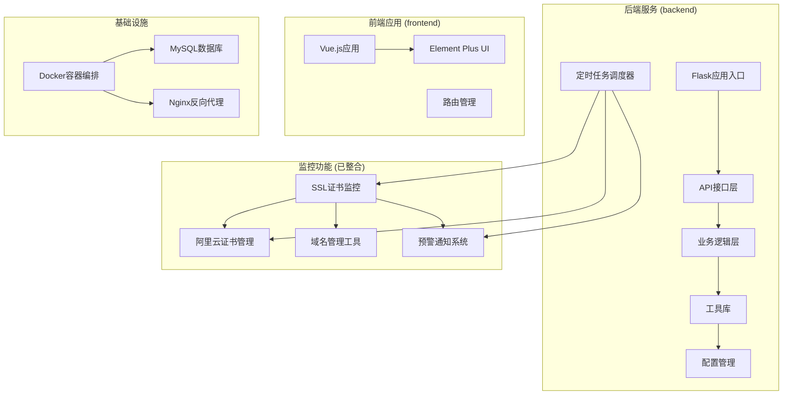

**图表来源**
- [backend/app/__init__.py:1-66](file://backend/app/__init__.py#L1-L66)
- [backend/app/utils/scheduler.py:1-512](file://backend/app/utils/scheduler.py#L1-L512)
- [docker-compose.yml:1-75](file://docker-compose.yml#L1-75)

**章节来源**
- [backend/app/__init__.py:1-66](file://backend/app/__init__.py#L1-L66)
- [backend/app/utils/scheduler.py:1-512](file://backend/app/utils/scheduler.py#L1-L512)
- [docker-compose.yml:1-75](file://docker-compose.yml#L1-75)

## 核心组件

### 后端API服务

系统的核心是基于Flask构建的RESTful API服务，提供完整的SSL证书管理功能：

- **认证授权系统**：基于JWT的用户认证和角色权限控制
- **证书管理API**：支持证书的增删改查、批量检测、同步等功能
- **阿里云集成**：自动同步阿里云证书并下载证书文件
- **预警通知**：通过企业微信机器人发送证书到期预警
- **证书上传解析**：支持PEM格式证书文件上传和自动解析
- **内置监控系统**：集成SSL证书监控和自动检测功能

### 内置监控系统

监控功能已完全整合到主API服务中，提供实时的SSL证书状态监控：

- **多协议支持**：支持HTTP、HTTPS、FTP等多种协议的证书检查
- **智能降级**：自动尝试不同的TLS版本以确保连接稳定性
- **本地证书扫描**：支持从本地文件系统扫描各种格式的证书文件
- **阿里云证书同步**：定期从阿里云API获取证书信息
- **定时任务调度**：基于APScheduler的定时任务执行器

### 前端管理界面

基于Vue.js构建的现代化管理界面：

- **响应式设计**：适配各种设备和屏幕尺寸
- **组件化架构**：使用Element Plus作为UI框架
- **状态管理**：基于Pinia进行全局状态管理
- **路由导航**：支持多页面应用的路由管理
- **证书上传界面**：提供直观的证书上传和解析界面

**更新** 监控功能已完全整合到主API服务中，不再需要独立的ssl_cert_monitor模块。新增了内置的定时任务调度器，支持自动证书检测和预警通知。

**章节来源**
- [backend/app/api/certs.py:1-800](file://backend/app/api/certs.py#L1-800)
- [backend/app/utils/scheduler.py:1-512](file://backend/app/utils/scheduler.py#L1-L512)
- [frontend/src/main.js:1-23](file://frontend/src/main.js#L1-23)

## 架构概览

系统采用分层架构设计，确保各组件之间的松耦合和高内聚：

```mermaid
graph TB
subgraph "表现层"
UI[前端Vue.js应用]
API[后端Flask API]
end
subgraph "业务逻辑层"
AUTH[认证授权模块]
CERT[证书管理模块]
MONITOR[监控调度模块]
ALIYUN[阿里云集成模块]
PARSE[证书解析模块]
SCHEDULER[定时任务调度器]
END
subgraph "数据访问层"
DB[(MySQL数据库)]
FS[(文件系统)]
end
subgraph "外部服务"
WX[企业微信机器人]
ALI[阿里云CAS服务]
WEB[Web服务器]
end
UI --> API
API --> AUTH
API --> CERT
API --> MONITOR
API --> ALIYUN
API --> PARSE
API --> SCHEDULER
CERT --> DB
MONITOR --> DB
ALIYUN --> DB
PARSE --> DB
SCHEDULER --> DB
CERT --> FS
AUTH --> WX
MONITOR --> WX
ALIYUN --> ALI
PARSE --> FS
SCHEDULER --> WX
API --> WEB
```

**图表来源**
- [backend/app/__init__.py:1-66](file://backend/app/__init__.py#L1-L66)
- [backend/app/utils/ssl_checker.py:1-614](file://backend/app/utils/ssl_checker.py#L1-614)
- [backend/app/utils/scheduler.py:1-512](file://backend/app/utils/scheduler.py#L1-512)

### 数据流图

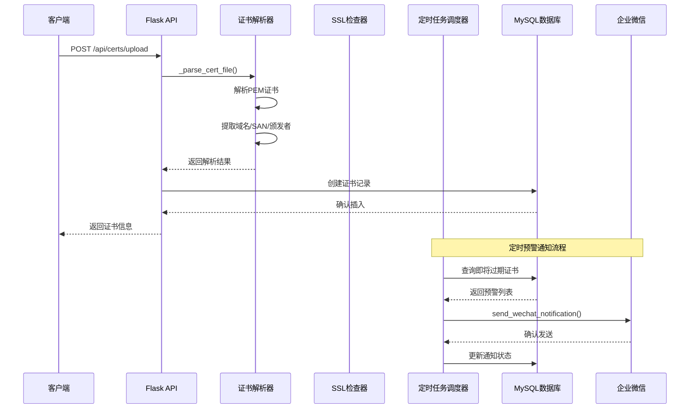

**图表来源**
- [backend/app/api/certs.py:284-404](file://backend/app/api/certs.py#L284-404)
- [backend/app/utils/ssl_checker.py:48-166](file://backend/app/utils/ssl_checker.py#L48-166)
- [backend/app/utils/scheduler.py:322-465](file://backend/app/utils/scheduler.py#L322-465)

## 详细组件分析

### 证书管理API模块

证书管理API是系统的核心功能模块，提供了完整的证书生命周期管理：

#### 主要功能特性

- **多源证书支持**：支持自动获取、手动录入、本地证书、阿里云证书四种类型
- **批量操作**：支持批量证书检测和同步操作
- **状态跟踪**：实时跟踪证书的有效期、状态变化和通知历史
- **文件管理**：自动下载和管理证书文件
- **证书上传解析**：支持PEM格式证书文件上传和自动解析
- **内置监控**：集成SSL证书监控和自动检测功能

#### API接口设计

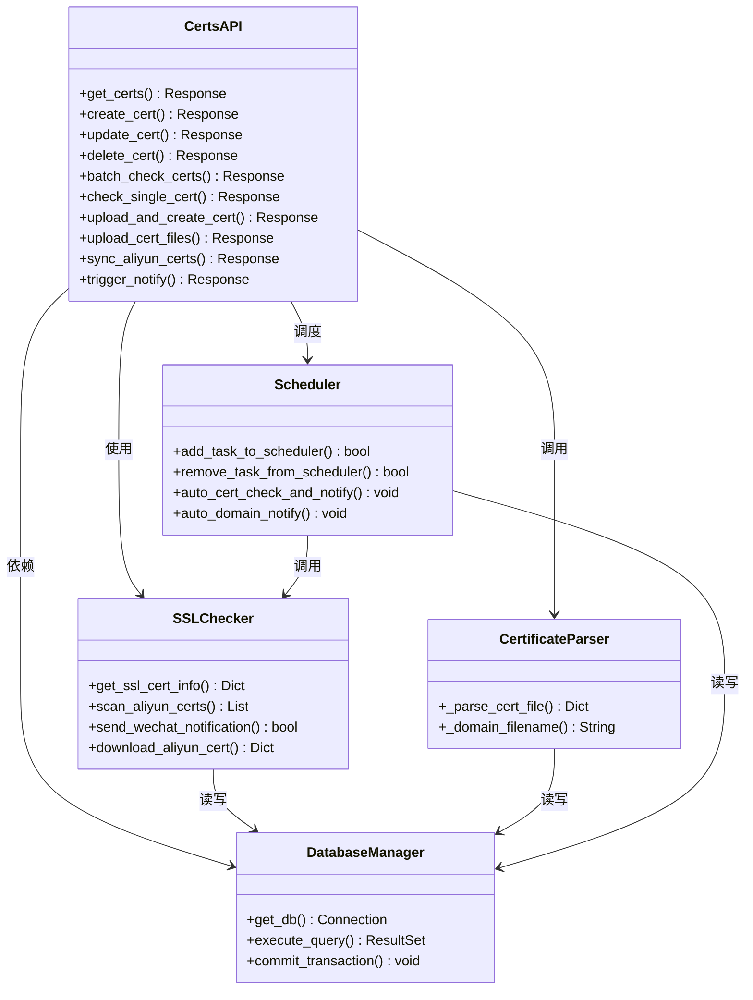

**图表来源**
- [backend/app/api/certs.py:1-800](file://backend/app/api/certs.py#L1-800)
- [backend/app/utils/ssl_checker.py:1-614](file://backend/app/utils/ssl_checker.py#L1-614)
- [backend/app/utils/scheduler.py:1-512](file://backend/app/utils/scheduler.py#L1-512)

**章节来源**
- [backend/app/api/certs.py:1-800](file://backend/app/api/certs.py#L1-800)
- [backend/app/utils/ssl_checker.py:1-614](file://backend/app/utils/ssl_checker.py#L1-614)
- [backend/app/utils/scheduler.py:1-512](file://backend/app/utils/scheduler.py#L1-512)

### SSL证书解析器

SSL证书解析器是系统的关键组件，负责解析上传的证书文件并提取关键信息：

#### 核心解析功能

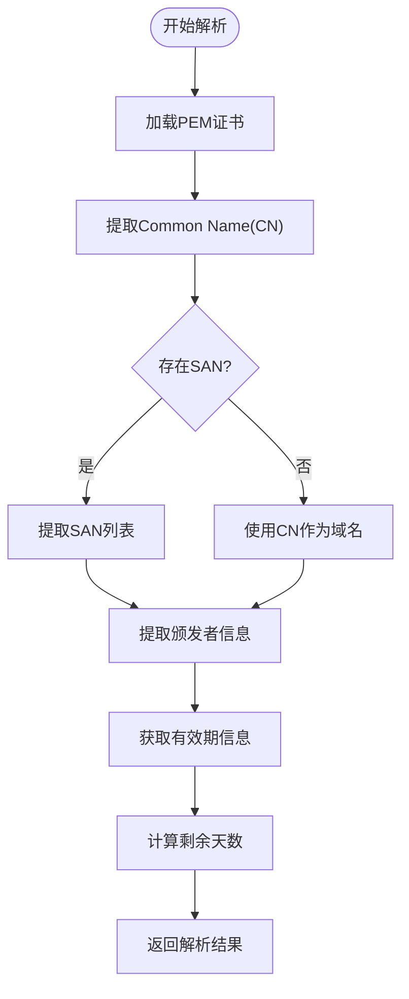

**图表来源**
- [backend/app/api/certs.py:49-112](file://backend/app/api/certs.py#L49-112)

#### 支持的证书格式

系统支持多种证书格式的读取和解析：

| 证书格式 | 文件扩展名 | 用途 | 支持状态 |
|---------|-----------|------|----------|
| PEM格式 | .crt, .pem, .cer | 标准X.509证书 | ✅ 完全支持 |
| PKCS#12 | .pfx, .p12 | 带私钥的证书包 | ⚠️ 需要密码 |
| DER格式 | .der | 二进制证书 | ✅ 自动识别 |
| 本地证书 | 目录扫描 | 本地文件系统 | ✅ 支持 |

#### 自动解析功能

新版本的证书解析功能具有以下特性：

- **域名提取**：自动从Common Name和Subject Alternative Names中提取域名
- **SAN列表处理**：支持多域名证书的SAN列表解析
- **颁发者信息**：提取颁发机构的组织名称
- **有效期管理**：计算证书的有效期和剩余天数
- **错误处理**：提供详细的解析错误信息和回退机制

**章节来源**
- [backend/app/api/certs.py:49-112](file://backend/app/api/certs.py#L49-112)

### 证书上传功能

系统新增了完整的证书上传和自动解析功能：

#### 上传流程设计

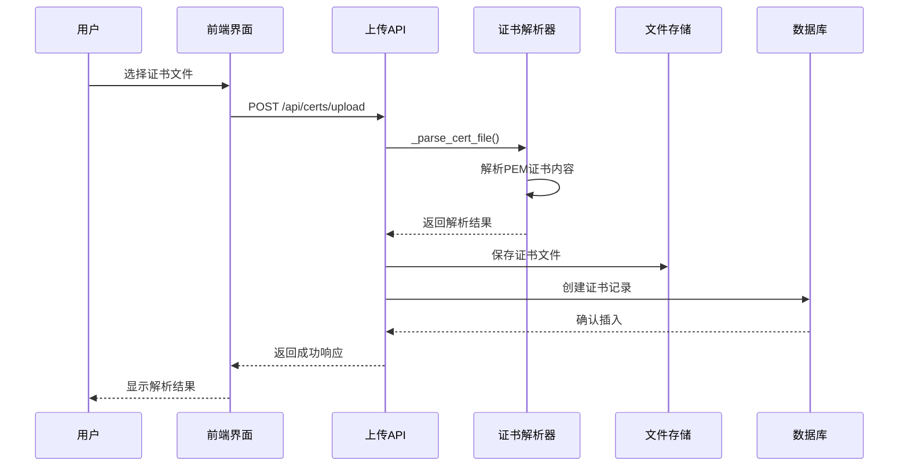

**图表来源**
- [backend/app/api/certs.py:284-404](file://backend/app/api/certs.py#L284-404)

#### 上传接口特性

- **多文件支持**：支持同时上传证书文件和私钥文件
- **自动解析**：自动提取域名、颁发者、有效期等关键信息
- **文件验证**：验证证书格式和内容的有效性
- **数据库集成**：自动创建对应的数据库记录
- **文件存储**：按证书ID创建独立的存储目录

#### 前端上传界面

前端提供了直观的证书上传界面：

- **文件选择器**：支持.pem、.crt、.cer格式的证书文件
- **进度显示**：显示上传和解析的进度
- **结果展示**：展示解析出的证书信息
- **错误处理**：友好的错误提示和重试机制

**章节来源**
- [backend/app/api/certs.py:284-404](file://backend/app/api/certs.py#L284-404)
- [frontend/src/views/Certs.vue:234-283](file://frontend/src/views/Certs.vue#L234-283)
- [frontend/src/api/certs.js:13-18](file://frontend/src/api/certs.js#L13-L18)

### SSL证书检查器

SSL证书检查器是系统的关键组件，负责实际的证书状态检测和信息提取：

#### 核心算法实现

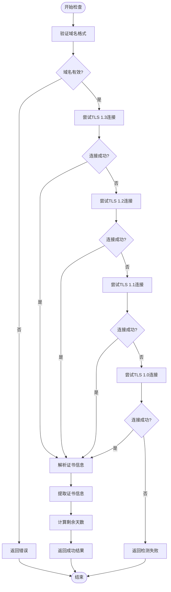

**图表来源**
- [backend/app/utils/ssl_checker.py:48-166](file://backend/app/utils/ssl_checker.py#L48-166)

#### 支持的证书格式

系统支持多种证书格式的读取和解析：

| 证书格式 | 文件扩展名 | 用途 | 支持状态 |
|---------|-----------|------|----------|
| PEM格式 | .crt, .pem, .cer | 标准X.509证书 | ✅ 完全支持 |
| PKCS#12 | .pfx, .p12 | 带私钥的证书包 | ⚠️ 需要密码 |
| DER格式 | .der | 二进制证书 | ✅ 自动识别 |
| 本地证书 | 目录扫描 | 本地文件系统 | ✅ 支持 |

**更新** 新版本增强了阿里云证书下载功能，改进了错误处理机制，支持更好的证书文件组织。

**章节来源**
- [backend/app/utils/ssl_checker.py:1-614](file://backend/app/utils/ssl_checker.py#L1-614)

### 定时任务调度器

系统新增了内置的定时任务调度器，提供自动化的证书监控和预警功能：

#### 调度器架构

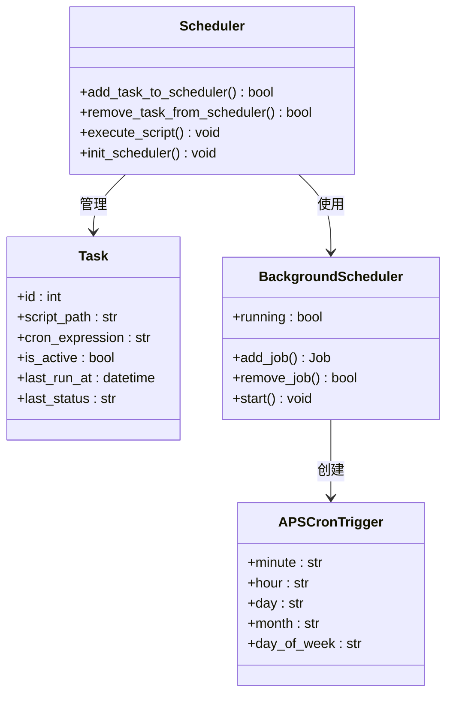

**图表来源**
- [backend/app/utils/scheduler.py:1-512](file://backend/app/utils/scheduler.py#L1-512)

#### 自动检测功能

定时任务调度器提供了以下自动功能：

- **SSL证书自动检测**：每天定时检测所有自动检测类型的证书
- **域名到期预警**：自动检测即将过期的域名并发送预警通知
- **任务管理**：支持动态添加、移除和修改定时任务
- **日志记录**：详细记录任务执行状态和结果
- **错误处理**：自动处理任务执行过程中的异常情况

#### 配置管理

定时任务调度器支持灵活的配置：

| 配置项 | 默认值 | 说明 |
|--------|--------|------|
| CERT_AUTO_CHECK_CRON | 0 8 * * * | SSL证书自动检测的Cron表达式 |
| DOMAIN_AUTO_NOTIFY_CRON | 0 8 * * * | 域名到期自动通知的Cron表达式 |
| SSL_CHECK_TIMEOUT | 10 | SSL检测超时时间(秒) |
| SSL_WARNING_DAYS | 30 | SSL证书预警天数 |
| DOMAIN_WARNING_DAYS | 30 | 域名到期预警天数 |

**更新** 新版本增加了内置的定时任务调度器，支持自动证书检测和预警通知功能。

#### 自动证书检测流程

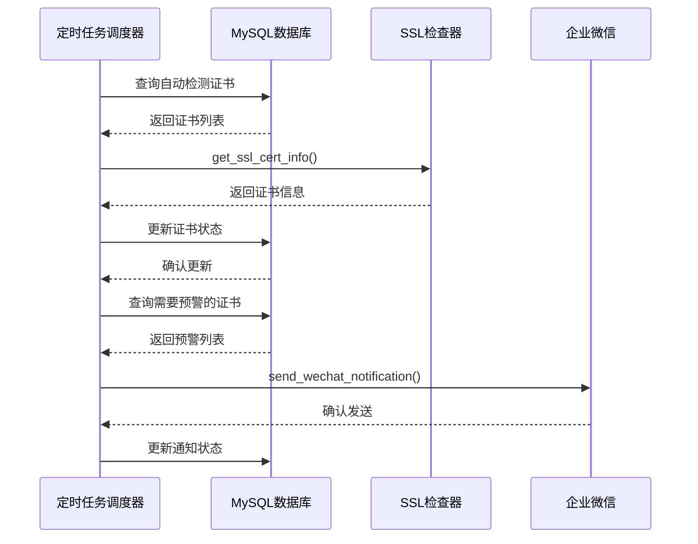

**图表来源**
- [backend/app/utils/scheduler.py:322-465](file://backend/app/utils/scheduler.py#L322-465)

**章节来源**
- [backend/app/utils/scheduler.py:1-512](file://backend/app/utils/scheduler.py#L1-512)

### 阿里云证书集成

系统提供了完整的阿里云证书管理功能：

#### 阿里云SDK集成

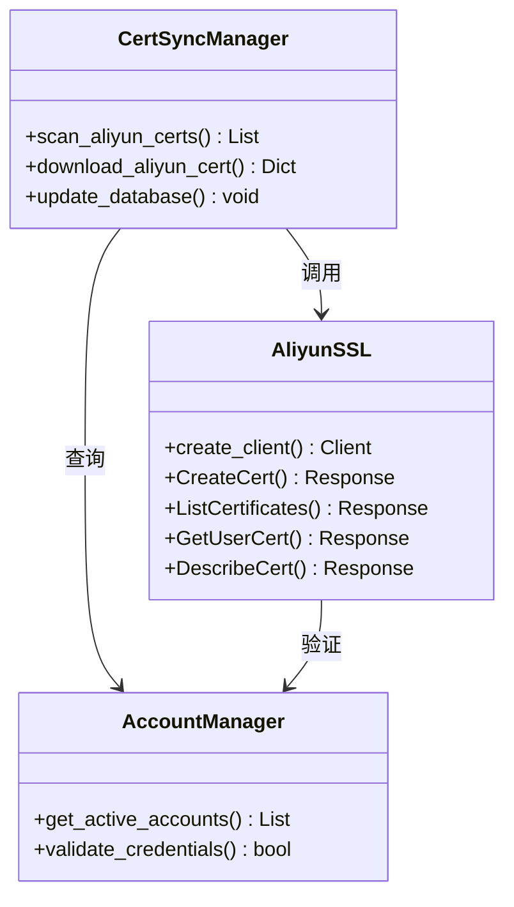

**图表来源**
- [backend/app/utils/ssl_checker.py:169-303](file://backend/app/utils/ssl_checker.py#L169-303)

#### 配置管理

阿里云证书管理需要正确的配置信息：

| 配置项 | 环境变量 | 默认值 | 说明 |
|--------|----------|--------|------|
| AccessKey ID | ALIYUN_ACCESS_KEY_ID | 未设置 | 阿里云访问密钥ID |
| AccessKey Secret | ALIYUN_ACCESS_KEY_SECRET | 未设置 | 阿里云访问密钥Secret |
| Endpoint | ALIYUN_ENDPOINT | cas.aliyuncs.com | 阿里云CAS服务端点 |
| 超时时间 | ALIYUN_TIMEOUT | 30 | API调用超时时间(秒) |

**更新** 新版本增加了对不同阿里云SDK版本的兼容性支持，改进了证书下载的错误处理机制。

#### 增强的证书下载功能

新版本的阿里云证书下载功能具有以下改进：

- **多版本SDK兼容**：支持不同的阿里云SDK版本，自动适配参数名差异
- **增强的错误处理**：提供详细的错误信息和重试机制
- **灵活的证书文件组织**：支持动态创建证书目录和文件命名
- **改进的证书内容解析**：兼容snake_case和PascalCase属性名

**章节来源**
- [backend/app/utils/ssl_checker.py:1-614](file://backend/app/utils/ssl_checker.py#L1-614)

### 前端管理界面

前端应用基于Vue.js构建，提供了直观的用户界面：

#### 组件架构

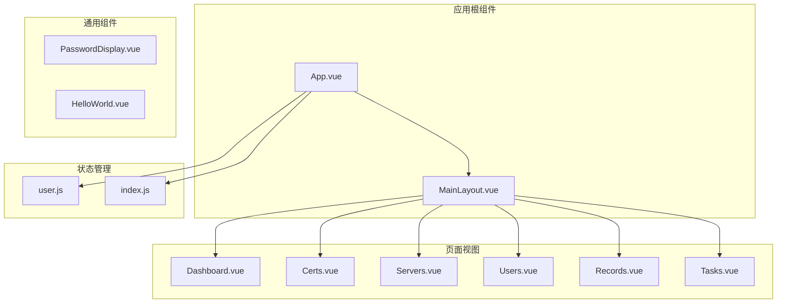

**图表来源**
- [frontend/src/main.js:1-23](file://frontend/src/main.js#L1-23)

#### API通信流程

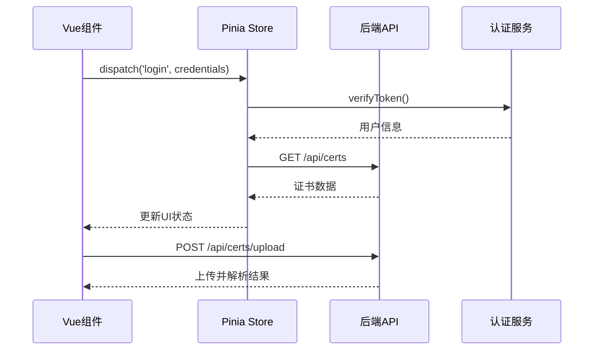

**图表来源**
- [frontend/src/main.js:1-23](file://frontend/src/main.js#L1-23)

#### 证书上传界面

前端提供了专门的证书上传界面：

- **文件拖拽上传**：支持拖拽选择证书文件
- **实时解析预览**：上传后立即显示解析结果
- **批量操作**：支持批量上传和解析多个证书
- **进度指示**：显示上传和解析的实时进度

**章节来源**
- [frontend/src/main.js:1-23](file://frontend/src/main.js#L1-23)
- [frontend/src/views/Certs.vue:234-283](file://frontend/src/views/Certs.vue#L234-283)

## 依赖关系分析

系统采用了模块化的依赖管理策略，确保各组件之间的清晰边界：

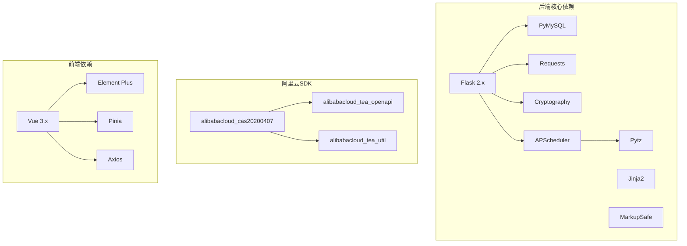

**图表来源**
- [backend/app/utils/ssl_checker.py:14-17](file://backend/app/utils/ssl_checker.py#L14-17)
- [backend/app/utils/scheduler.py:1-16](file://backend/app/utils/scheduler.py#L1-16)

### 外部服务集成

系统集成了多个外部服务以提供完整的功能：

| 服务类型 | 服务名称 | 用途 | 集成方式 |
|----------|----------|------|----------|
| 企业微信 | 企业微信机器人 | 证书预警通知 | Webhook API |
| 阿里云 | CAS服务 | 证书管理 | SDK集成 |
| MySQL | 数据库存储 | 数据持久化 | PyMySQL驱动 |
| Nginx | 反向代理 | HTTP服务 | Docker容器 |
| Docker | 容器编排 | 应用部署 | Compose配置 |

**更新** 新版本增加了APScheduler定时任务调度器，支持自动化的证书监控和预警功能。

**章节来源**
- [backend/app/utils/ssl_checker.py:305-396](file://backend/app/utils/ssl_checker.py#L305-396)

## 性能考虑

系统在设计时充分考虑了性能优化和可扩展性：

### 并发处理

- **异步操作**：阿里云API调用支持异步处理，提高并发性能
- **连接池管理**：数据库连接采用连接池技术，减少连接开销
- **缓存机制**：阿里云证书信息采用内存缓存，降低重复查询成本
- **定时任务并发**：APScheduler支持多任务并发执行

### 内存优化

- **分页查询**：大量数据采用分页查询，避免内存溢出
- **生成器模式**：大数据量处理使用生成器，逐批处理数据
- **及时释放**：确保数据库连接和文件句柄及时关闭
- **任务资源管理**：定时任务执行后及时释放资源

### 网络优化

- **超时控制**：SSL连接设置合理的超时时间，避免长时间阻塞
- **重试机制**：网络异常时自动重试，提高成功率
- **TLS降级**：支持多种TLS版本，确保连接稳定性
- **任务超时**：定时任务执行设置超时保护，防止长时间阻塞

**更新** 新版本引入了APScheduler定时任务调度器，支持更高效的并发处理和资源管理。

## 故障排除指南

### 常见问题及解决方案

#### 1. SSL证书检测失败

**问题症状**：证书检测返回失败或超时

**可能原因**：
- 网络连接问题
- 服务器不支持TLS版本
- 防火墙阻止连接
- 域名解析失败

**解决方案**：
- 检查网络连通性和防火墙设置
- 验证服务器支持的TLS版本
- 使用`openssl s_client`测试连接
- 检查DNS解析配置

#### 2. 阿里云API调用失败

**问题症状**：阿里云证书同步失败

**可能原因**：
- 凭据配置错误
- 网络连接问题
- API权限不足
- 配额限制

**解决方案**：
- 验证AccessKey配置
- 检查网络连通性
- 确认API权限设置
- 查看阿里云控制台配额

#### 3. 证书文件下载失败

**问题症状**：阿里云证书文件下载失败

**可能原因**：
- SDK版本不兼容
- 证书ID无效
- 权限不足
- 网络超时

**解决方案**：
- 检查阿里云SDK版本兼容性
- 验证证书ID格式和有效性
- 确认阿里云账户权限
- 增加超时时间和重试次数

#### 4. 证书文件组织问题

**问题症状**：证书文件存储路径错误或文件命名不规范

**可能原因**：
- 目录权限不足
- 文件名包含特殊字符
- 路径遍历攻击防护

**解决方案**：
- 检查CERT_FILES_DIR目录权限
- 验证文件名安全性
- 使用安全的文件命名规则

#### 5. 证书上传解析失败

**问题症状**：上传的证书文件无法解析

**可能原因**：
- 证书格式不正确
- 证书内容损坏
- 缺少必要的扩展信息

**解决方案**：
- 确保证书文件为有效的PEM格式
- 验证证书内容的完整性
- 检查证书是否包含必要的扩展信息

#### 6. 定时任务执行失败

**问题症状**：定时任务无法正常执行

**可能原因**：
- Cron表达式格式错误
- 脚本文件不存在
- 数据库连接失败
- 任务超时

**解决方案**：
- 验证Cron表达式的正确性
- 检查脚本文件路径和权限
- 确认数据库连接配置
- 调整任务超时设置

### 调试工具和方法

#### 后端调试

```bash
# 启用调试模式
export FLASK_DEBUG=true
export FLASK_ENV=development

# 设置详细日志级别
export LOG_LEVEL=DEBUG

# 启动应用
python run.py
```

#### 前端调试

```bash
# 开发环境启动
npm run dev

# 生产环境构建
npm run build

# 代码检查
npm run lint
```

**更新** 新版本增加了定时任务调度器的日志记录功能，便于问题诊断和解决。

**章节来源**
- [backend/app/config.py:15-17](file://backend/app/config.py#L15-L17)

## 结论

SSL证书管理系统是一个功能完整、架构清晰的企业级解决方案。系统通过模块化设计实现了高度的可维护性和可扩展性，同时提供了丰富的功能特性和良好的用户体验。

### 主要优势

1. **功能完整性**：涵盖了SSL证书管理的各个方面，从监控到预警通知
2. **多源支持**：支持多种证书来源的统一管理
3. **自动化程度高**：通过内置定时任务实现自动化管理
4. **用户友好**：提供直观的Web界面和完善的权限控制
5. **可扩展性强**：模块化架构便于功能扩展和定制
6. **智能解析**：新增的证书上传解析功能，大幅提升了用户体验
7. **监控整合**：监控功能已完全整合到主API服务中，无需独立脚本

### 技术亮点

- **一体化架构**：后端API服务和监控功能完全整合
- **智能降级机制**：确保在各种网络环境下都能稳定运行
- **企业级集成**：与阿里云、企业微信等主流服务深度集成
- **容器化部署**：Docker化部署简化了部署和运维
- **增强的证书管理**：新版本提供了更好的证书文件同步和下载功能
- **智能证书解析**：新增的证书上传解析功能，支持PEM格式证书的自动解析
- **定时任务调度**：内置APScheduler支持自动化的证书监控和预警

### 未来发展方向

1. **增强监控能力**：增加更多监控指标和告警规则
2. **扩展支持范围**：支持更多证书提供商和服务商
3. **优化用户体验**：持续改进前端界面和交互体验
4. **提升性能表现**：进一步优化大规模部署的性能表现
5. **加强安全性**：持续改进证书文件的安全存储和传输机制
6. **智能证书管理**：开发更多智能化的证书管理功能

该系统为企业提供了可靠的SSL证书管理解决方案，有助于提升整体网络安全水平和运维效率。

**更新** 新版本显著增强了证书文件同步和下载功能，改进了错误处理机制，提供了更好的用户体验和系统稳定性。新增的证书上传和自动解析功能使得用户可以更加便捷地管理各种来源的SSL证书。监控功能已完全整合到主API服务中，无需再维护独立的ssl_cert_monitor模块，简化了系统的复杂性和维护成本。