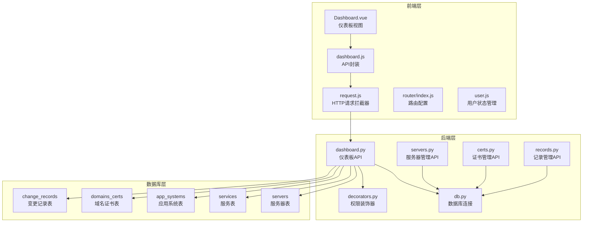
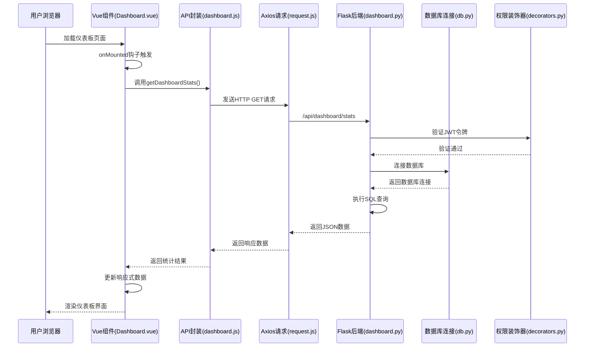
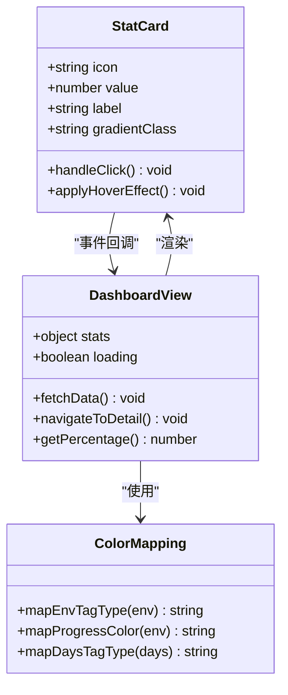
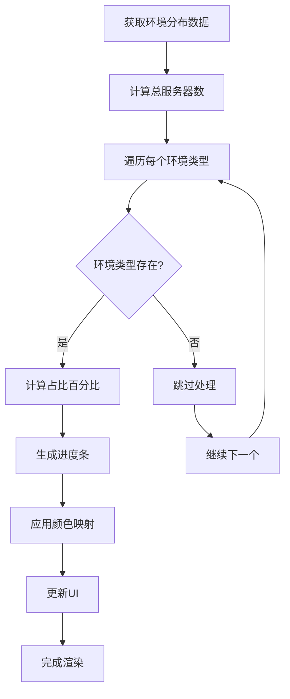
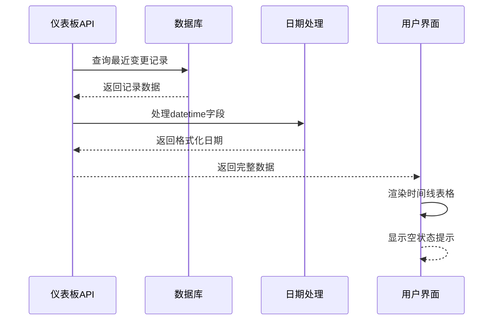
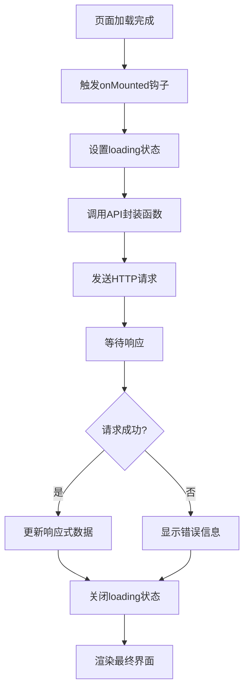
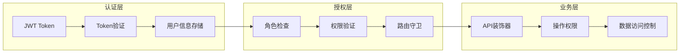
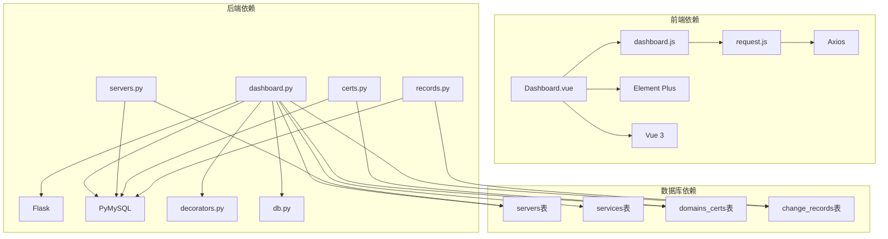

# 仪表板模块

<cite>
**本文档引用的文件**
- [backend/app/api/dashboard.py](file://backend/app/api/dashboard.py)
- [frontend/src/views/Dashboard.vue](file://frontend/src/views/Dashboard.vue)
- [frontend/src/api/dashboard.js](file://frontend/src/api/dashboard.js)
- [frontend/src/api/request.js](file://frontend/src/api/request.js)
- [backend/app/utils/decorators.py](file://backend/app/utils/decorators.py)
- [backend/app/utils/db.py](file://backend/app/utils/db.py)
- [backend/app/api/servers.py](file://backend/app/api/servers.py)
- [backend/app/api/certs.py](file://backend/app/api/certs.py)
- [backend/app/api/records.py](file://backend/app/api/records.py)
- [frontend/src/router/index.js](file://frontend/src/router/index.js)
- [frontend/src/stores/user.js](file://frontend/src/stores/user.js)
- [backend/app/config.py](file://backend/app/config.py)
</cite>

## 目录
1. [简介](#简介)
2. [项目结构](#项目结构)
3. [核心组件](#核心组件)
4. [架构概览](#架构概览)
5. [详细组件分析](#详细组件分析)
6. [依赖关系分析](#依赖关系分析)
7. [性能考虑](#性能考虑)
8. [故障排除指南](#故障排除指南)
9. [结论](#结论)

## 简介

云运维平台仪表板模块是一个集成了多种运维监控功能的综合管理界面。该模块通过实时统计分析、可视化展示和智能提醒功能，为运维人员提供全面的系统运行状态概览。仪表板主要包含五大核心功能区域：统计卡片展示、服务器环境分布可视化、域名证书到期提醒、最近更新记录时间线，以及完整的权限控制体系。

该模块采用前后端分离架构，前端使用Vue.js + Element Plus构建响应式界面，后端基于Flask框架提供RESTful API服务。通过JWT认证机制确保系统安全性，支持多角色权限管理，为不同层级的运维人员提供相应的访问权限。

## 项目结构

仪表板模块在整体项目架构中占据核心地位，负责整合各个子系统的数据并提供统一的可视化界面。



**图表来源**
- [frontend/src/views/Dashboard.vue:1-312](file://frontend/src/views/Dashboard.vue#L1-L312)
- [backend/app/api/dashboard.py:1-91](file://backend/app/api/dashboard.py#L1-L91)
- [backend/app/utils/decorators.py:1-95](file://backend/app/utils/decorators.py#L1-L95)

**章节来源**
- [frontend/src/views/Dashboard.vue:1-312](file://frontend/src/views/Dashboard.vue#L1-L312)
- [backend/app/api/dashboard.py:1-91](file://backend/app/api/dashboard.py#L1-L91)

## 核心组件

仪表板模块由多个相互协作的组件构成，每个组件都有明确的职责分工：

### 统计卡片组件
统计卡片是仪表板的视觉焦点，采用响应式设计，支持移动端和桌面端的自适应布局。每个卡片都代表一个关键的业务指标，点击后可跳转到对应的详细页面。

### 服务器环境分布可视化
通过表格和进度条的组合展示，直观呈现不同环境类型的服务器分布情况。支持按环境类型进行颜色编码和占比计算。

### 域名证书到期提醒
智能算法自动计算证书剩余有效期，通过颜色标签区分紧急程度，帮助运维人员及时处理即将到期的证书。

### 最近更新记录时间线
以时间轴的形式展示最近的系统变更记录，包含详细的变更信息和责任人追踪。

**章节来源**
- [frontend/src/views/Dashboard.vue:1-312](file://frontend/src/views/Dashboard.vue#L1-L312)
- [backend/app/api/dashboard.py:20-91](file://backend/app/api/dashboard.py#L20-L91)

## 架构概览

仪表板模块采用分层架构设计，确保各层之间的职责清晰分离，便于维护和扩展。



**图表来源**
- [frontend/src/views/Dashboard.vue:146-158](file://frontend/src/views/Dashboard.vue#L146-L158)
- [frontend/src/api/dashboard.js:1-6](file://frontend/src/api/dashboard.js#L1-L6)
- [frontend/src/api/request.js:1-54](file://frontend/src/api/request.js#L1-L54)
- [backend/app/api/dashboard.py:20-91](file://backend/app/api/dashboard.py#L20-L91)
- [backend/app/utils/decorators.py:9-56](file://backend/app/utils/decorators.py#L9-L56)

## 详细组件分析

### 统计卡片设计与交互实现

统计卡片采用卡片式设计，每个卡片都包含图标、数值和标签信息。通过CSS渐变背景和悬停动画增强用户体验。



**图表来源**
- [frontend/src/views/Dashboard.vue:4-50](file://frontend/src/views/Dashboard.vue#L4-L50)
- [frontend/src/views/Dashboard.vue:160-189](file://frontend/src/views/Dashboard.vue#L160-L189)

统计卡片的核心特性包括：
- **响应式布局**：使用Element UI的栅格系统，支持不同屏幕尺寸的自适应
- **交互反馈**：悬停效果和点击导航功能
- **视觉层次**：通过渐变背景和图标增强视觉吸引力
- **数据绑定**：使用Vue的响应式系统实时更新数据

**章节来源**
- [frontend/src/views/Dashboard.vue:4-50](file://frontend/src/views/Dashboard.vue#L4-L50)
- [frontend/src/views/Dashboard.vue:160-189](file://frontend/src/views/Dashboard.vue#L160-L189)

### 服务器环境分布可视化

服务器环境分布通过表格和进度条的组合实现，提供直观的数据可视化效果。



**图表来源**
- [frontend/src/views/Dashboard.vue:52-82](file://frontend/src/views/Dashboard.vue#L52-L82)
- [frontend/src/views/Dashboard.vue:180-183](file://frontend/src/views/Dashboard.vue#L180-L183)

环境分布可视化的关键实现：
- **进度条显示**：使用Element UI的进度条组件，支持自定义颜色和样式
- **标签颜色映射**：根据环境类型动态分配颜色，提高可读性
- **响应式适配**：支持移动端和桌面端的不同显示效果

**章节来源**
- [frontend/src/views/Dashboard.vue:52-82](file://frontend/src/views/Dashboard.vue#L52-L82)
- [frontend/src/views/Dashboard.vue:180-183](file://frontend/src/views/Dashboard.vue#L180-L183)

### 域名证书到期提醒智能算法

证书到期提醒功能实现了智能的剩余天数计算和风险等级评估。

```mermaid
flowchart TD
A[查询证书数据] --> B[计算剩余天数]
B --> C{剩余天数有效?}
C --> |是| D[格式化日期字段]
C --> |否| E[跳过处理]
D --> F[设置剩余天数字段]
F --> G[应用颜色标签]
G --> H{天数范围判断}
H --> |<30天| I[红色标签(紧急)]
H --> |<90天| J[橙色标签(警告)]
H --> |>=90天| K[绿色标签(正常)]
I --> L[添加到提醒列表]
J --> L
K --> L
E --> M[继续处理下一个]
L --> N[完成渲染]
M --> A
```

**图表来源**
- [backend/app/api/dashboard.py:58-72](file://backend/app/api/dashboard.py#L58-L72)
- [frontend/src/views/Dashboard.vue:83-105](file://frontend/src/views/Dashboard.vue#L83-L105)
- [frontend/src/views/Dashboard.vue:185-189](file://frontend/src/views/Dashboard.vue#L185-L189)

证书到期提醒算法特点：
- **动态计算**：使用MySQL的DATEDIFF函数实时计算剩余天数
- **智能分类**：根据剩余天数自动分配风险等级
- **时间格式化**：统一处理日期字段的显示格式

**章节来源**
- [backend/app/api/dashboard.py:58-72](file://backend/app/api/dashboard.py#L58-L72)
- [frontend/src/views/Dashboard.vue:83-105](file://frontend/src/views/Dashboard.vue#L83-L105)
- [frontend/src/views/Dashboard.vue:185-189](file://frontend/src/views/Dashboard.vue#L185-L189)

### 最近更新记录时间线展示

更新记录采用时间轴形式展示，提供完整的变更历史追踪。



**图表来源**
- [backend/app/api/dashboard.py:50-56](file://backend/app/api/dashboard.py#L50-L56)
- [backend/app/api/records.py:12-17](file://backend/app/api/records.py#L12-L17)
- [frontend/src/views/Dashboard.vue:108-126](file://frontend/src/views/Dashboard.vue#L108-L126)

时间线展示功能：
- **完整字段展示**：包含编号、日期、修改人、位置、内容等完整信息
- **溢出文本处理**：使用Element UI的tooltip组件处理长文本
- **空状态处理**：当没有数据时显示友好的提示信息

**章节来源**
- [backend/app/api/dashboard.py:50-56](file://backend/app/api/dashboard.py#L50-L56)
- [backend/app/api/records.py:12-17](file://backend/app/api/records.py#L12-L17)
- [frontend/src/views/Dashboard.vue:108-126](file://frontend/src/views/Dashboard.vue#L108-L126)

### 数据获取流程

仪表板的数据获取采用异步加载模式，确保用户体验的流畅性。



**图表来源**
- [frontend/src/views/Dashboard.vue:146-158](file://frontend/src/views/Dashboard.vue#L146-L158)
- [frontend/src/api/dashboard.js:3-5](file://frontend/src/api/dashboard.js#L3-L5)
- [frontend/src/api/request.js:25-34](file://frontend/src/api/request.js#L25-L34)

数据获取流程特点：
- **状态管理**：使用Vue的ref和reactive进行状态管理
- **错误处理**：统一的错误处理机制和用户反馈
- **加载指示**：提供视觉反馈确保用户感知系统状态

**章节来源**
- [frontend/src/views/Dashboard.vue:146-158](file://frontend/src/views/Dashboard.vue#L146-L158)
- [frontend/src/api/dashboard.js:3-5](file://frontend/src/api/dashboard.js#L3-L5)
- [frontend/src/api/request.js:25-34](file://frontend/src/api/request.js#L25-L34)

### 权限控制机制

系统采用多层权限控制确保数据安全和操作合规。



**图表来源**
- [backend/app/utils/decorators.py:9-56](file://backend/app/utils/decorators.py#L9-L56)
- [frontend/src/router/index.js:35-58](file://frontend/src/router/index.js#L35-L58)

权限控制实现：
- **JWT认证**：使用Bearer Token进行身份验证
- **角色权限**：支持admin和operator两种角色
- **路由保护**：防止未授权访问敏感页面
- **API保护**：每个API端点都有相应的权限检查

**章节来源**
- [backend/app/utils/decorators.py:9-56](file://backend/app/utils/decorators.py#L9-L56)
- [frontend/src/router/index.js:35-58](file://frontend/src/router/index.js#L35-L58)

## 依赖关系分析

仪表板模块的依赖关系体现了清晰的分层架构设计。



**图表来源**
- [frontend/src/views/Dashboard.vue:1-312](file://frontend/src/views/Dashboard.vue#L1-L312)
- [backend/app/api/dashboard.py:1-91](file://backend/app/api/dashboard.py#L1-L91)
- [backend/app/utils/decorators.py:1-95](file://backend/app/utils/decorators.py#L1-L95)

依赖关系特点：
- **前端轻量级**：仅依赖必要的UI库和HTTP客户端
- **后端模块化**：API模块独立，便于维护和测试
- **数据库解耦**：通过统一的数据库连接工具类管理连接

**章节来源**
- [frontend/src/views/Dashboard.vue:1-312](file://frontend/src/views/Dashboard.vue#L1-L312)
- [backend/app/api/dashboard.py:1-91](file://backend/app/api/dashboard.py#L1-L91)
- [backend/app/utils/decorators.py:1-95](file://backend/app/utils/decorators.py#L1-L95)

## 性能考虑

仪表板模块在设计时充分考虑了性能优化，确保在大数据量场景下的流畅运行。

### 前端性能优化

- **懒加载策略**：路由组件采用动态导入，减少初始包体积
- **虚拟滚动**：对于大量数据的表格，可考虑实现虚拟滚动
- **缓存机制**：合理利用浏览器缓存和组件缓存
- **资源压缩**：生产环境启用代码压缩和图片优化

### 后端性能优化

- **数据库索引**：为常用查询字段建立适当的索引
- **查询优化**：使用LIMIT限制返回数据量
- **连接池管理**：合理配置数据库连接池参数
- **缓存策略**：对静态数据实现Redis缓存

### 网络性能优化

- **请求合并**：将多个小请求合并为批量请求
- **CDN加速**：静态资源使用CDN分发
- **HTTP缓存**：合理设置缓存头信息
- **压缩传输**：启用Gzip压缩

## 故障排除指南

### 常见问题及解决方案

#### 1. 数据加载失败
**症状**：仪表板显示空白或加载指示器持续显示
**可能原因**：
- 网络连接异常
- API接口不可用
- 认证信息过期

**解决步骤**：
1. 检查网络连接状态
2. 验证API接口可用性
3. 重新登录系统获取新令牌
4. 查看浏览器开发者工具的网络面板

#### 2. 权限访问受限
**症状**：无法访问某些功能或页面
**可能原因**：
- 用户角色权限不足
- 会话过期
- 路由配置错误

**解决步骤**：
1. 确认当前用户的角色权限
2. 检查localStorage中的token状态
3. 重新登录系统
4. 联系管理员确认权限配置

#### 3. 数据显示异常
**症状**：数据显示不正确或格式错误
**可能原因**：
- 数据库连接问题
- SQL查询错误
- 日期格式处理异常

**解决步骤**：
1. 检查数据库连接配置
2. 验证SQL查询语句
3. 确认日期字段的处理逻辑
4. 查看后端日志获取详细错误信息

### 调试技巧

#### 前端调试
- 使用Vue DevTools检查组件状态
- 在浏览器控制台查看API响应
- 监控网络请求的性能指标

#### 后端调试
- 启用Flask调试模式
- 查看数据库查询日志
- 使用Postman测试API端点

**章节来源**
- [frontend/src/api/request.js:35-50](file://frontend/src/api/request.js#L35-L50)
- [backend/app/utils/decorators.py:22-54](file://backend/app/utils/decorators.py#L22-L54)

## 结论

云运维平台仪表板模块通过精心设计的架构和丰富的功能特性，为运维团队提供了全面的系统监控和管理能力。模块采用现代化的技术栈，实现了良好的用户体验和高效的性能表现。

### 主要优势

1. **功能完整性**：涵盖了运维管理的核心需求，包括统计分析、可视化展示、智能提醒等
2. **用户体验优秀**：响应式设计、流畅的交互体验和直观的界面布局
3. **安全性可靠**：完善的权限控制和认证机制，确保系统安全
4. **可扩展性强**：模块化设计便于功能扩展和维护

### 技术亮点

- **智能算法**：证书到期提醒的动态计算和风险评估
- **可视化设计**：进度条、标签颜色映射等直观的数据展示
- **权限体系**：多层权限控制确保数据安全
- **性能优化**：前后端协同的性能优化策略

### 改进建议

1. **实时数据更新**：可考虑实现WebSocket实现实时数据推送
2. **个性化配置**：允许用户自定义仪表板布局和显示内容
3. **移动端优化**：进一步优化移动端的用户体验
4. **监控告警**：集成系统性能监控和告警功能

该仪表板模块为云运维平台提供了坚实的基础，通过持续的优化和改进，将成为运维管理的重要工具。