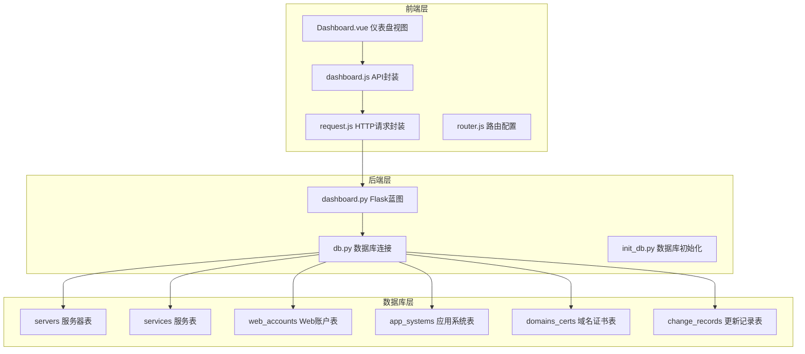
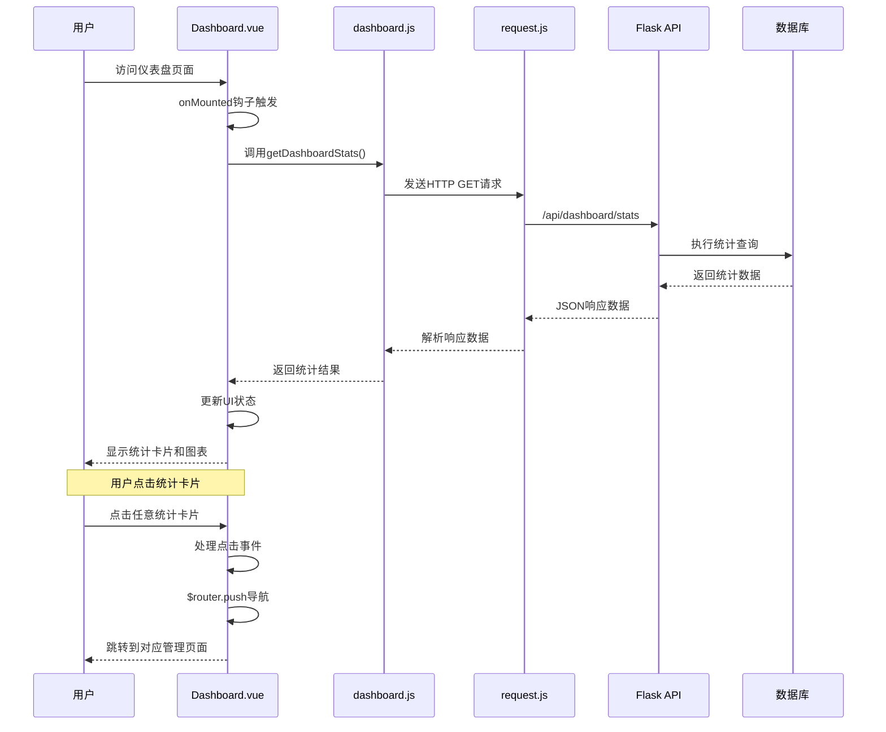
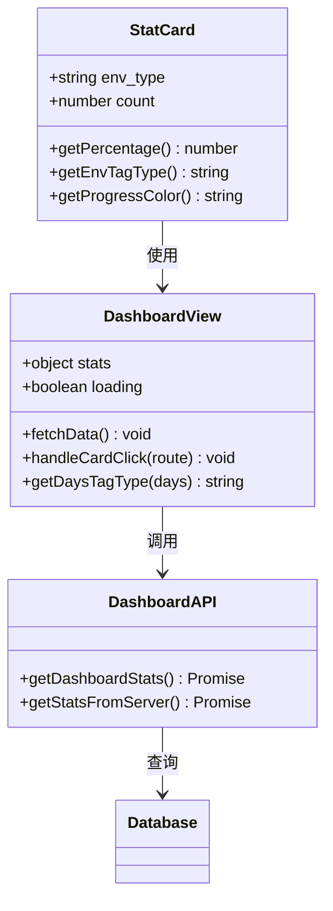
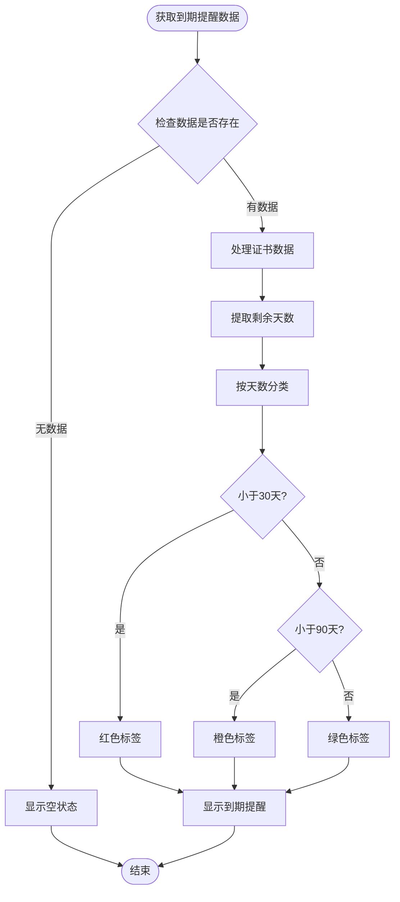
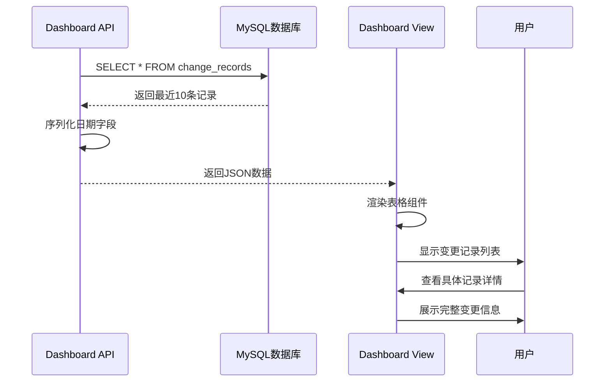
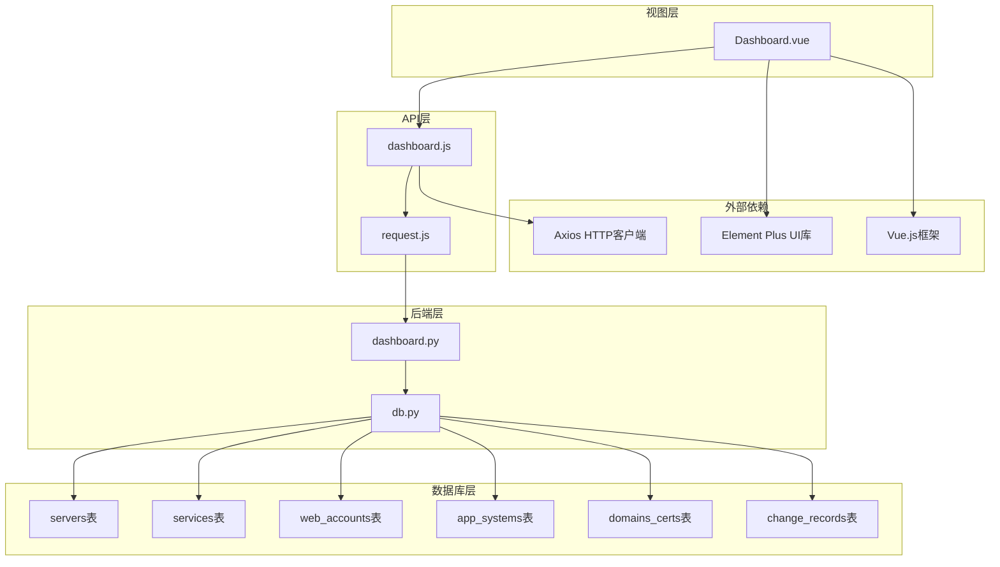

# 仪表盘统计模块

<cite>
**本文档引用的文件**
- [backend/app/api/dashboard.py](file://backend/app/api/dashboard.py)
- [frontend/src/views/Dashboard.vue](file://frontend/src/views/Dashboard.vue)
- [frontend/src/api/dashboard.js](file://frontend/src/api/dashboard.js)
- [frontend/src/api/request.js](file://frontend/src/api/request.js)
- [frontend/src/router/index.js](file://frontend/src/router/index.js)
- [backend/app/utils/db.py](file://backend/app/utils/db.py)
- [backend/init_db.py](file://backend/init_db.py)
- [frontend/src/main.js](file://frontend/src/main.js)
</cite>

## 目录
1. [简介](#简介)
2. [项目结构](#项目结构)
3. [核心组件](#核心组件)
4. [架构概览](#架构概览)
5. [详细组件分析](#详细组件分析)
6. [依赖关系分析](#依赖关系分析)
7. [性能考虑](#性能考虑)
8. [故障排除指南](#故障排除指南)
9. [结论](#结论)

## 简介

仪表盘统计模块是运维管理平台的核心界面组件，负责展示系统的整体运行状态和关键指标。该模块提供了四个主要功能区域：统计卡片展示、环境分布图表、到期提醒列表和最近更新记录。通过直观的数据可视化和实时状态监控，帮助运维人员快速掌握系统健康状况和关键业务指标。

## 项目结构

仪表盘统计模块采用前后端分离架构，后端使用Flask框架提供RESTful API，前端使用Vue.js配合Element Plus构建响应式界面。

**图表来源**
- [frontend/src/views/Dashboard.vue:1-307](file://frontend/src/views/Dashboard.vue#L1-L307)
- [backend/app/api/dashboard.py:1-86](file://backend/app/api/dashboard.py#L1-L86)
- [backend/app/utils/db.py:1-17](file://backend/app/utils/db.py#L1-L17)

**章节来源**
- [frontend/src/views/Dashboard.vue:1-307](file://frontend/src/views/Dashboard.vue#L1-L307)
- [backend/app/api/dashboard.py:1-86](file://backend/app/api/dashboard.py#L1-L86)

## 核心组件

仪表盘统计模块包含以下核心组件：

### 1. 统计卡片组件
- **服务器卡片**：显示服务器总数，点击跳转到服务器管理页面
- **服务卡片**：显示服务总数，点击跳转到服务管理页面
- **Web账户卡片**：显示Web账户总数，点击跳转到账户管理页面
- **应用系统卡片**：显示应用系统总数，点击跳转到应用管理页面
- **域名证书卡片**：显示域名证书总数，点击跳转到证书管理页面
- **更新记录卡片**：显示更新记录总数，点击跳转到记录管理页面

### 2. 环境分布图表
- **服务器环境类型统计**：按生产、测试、智慧环保、水电集团等环境类型分组显示
- **进度条可视化**：使用Element Plus的进度条组件展示各环境类型的占比情况
- **颜色编码系统**：不同环境类型对应不同的颜色主题

### 3. 到期提醒列表
- **域名证书到期提醒**：显示即将到期的域名证书信息
- **剩余天数分级**：根据剩余天数自动分配颜色标签（红色：30天内，橙色：30-90天，绿色：90天以上）
- **项目主体信息**：显示证书对应的项目和主体信息

### 4. 最近更新记录
- **更新历史追踪**：显示最近的系统变更记录
- **详细变更信息**：包括变更编号、日期、修改人、修改位置和内容
- **实时状态监控**：展示系统的最新动态

**章节来源**
- [frontend/src/views/Dashboard.vue:4-135](file://frontend/src/views/Dashboard.vue#L4-L135)
- [frontend/src/views/Dashboard.vue:169-198](file://frontend/src/views/Dashboard.vue#L169-L198)

## 架构概览

仪表盘统计模块采用经典的三层架构设计，实现了清晰的职责分离和良好的可维护性。

**图表来源**
- [frontend/src/views/Dashboard.vue:155-167](file://frontend/src/views/Dashboard.vue#L155-L167)
- [frontend/src/api/dashboard.js:3-5](file://frontend/src/api/dashboard.js#L3-L5)
- [frontend/src/api/request.js:14-23](file://frontend/src/api/request.js#L14-L23)
- [backend/app/api/dashboard.py:20-85](file://backend/app/api/dashboard.py#L20-L85)

## 详细组件分析

### 统计卡片组件分析

统计卡片组件是仪表盘的核心交互元素，每个卡片都具有相同的结构但代表不同的业务领域。

**图表来源**
- [frontend/src/views/Dashboard.vue:138-199](file://frontend/src/views/Dashboard.vue#L138-L199)
- [frontend/src/api/dashboard.js:3-5](file://frontend/src/api/dashboard.js#L3-L5)

#### 统计卡片点击跳转机制

统计卡片采用统一的点击处理机制，通过路由导航实现页面跳转：

1. **事件绑定**：每个统计卡片都绑定了点击事件处理器
2. **路由导航**：点击后调用`$router.push()`方法进行页面跳转
3. **目标页面**：根据卡片类型跳转到对应的管理页面
4. **用户体验**：提供平滑的页面过渡效果

#### 环境分布进度条显示

环境分布图表使用Element Plus的进度条组件实现数据可视化：

1. **数据计算**：通过`getPercentage()`函数计算各环境类型的占比
2. **颜色映射**：使用`getProgressColor()`函数为不同环境类型分配颜色
3. **标签分类**：使用`getEnvTagType()`函数为环境类型添加标签样式
4. **实时更新**：当统计数据变化时，进度条自动重新计算百分比

**章节来源**
- [frontend/src/views/Dashboard.vue:6-58](file://frontend/src/views/Dashboard.vue#L6-L58)
- [frontend/src/views/Dashboard.vue:169-198](file://frontend/src/views/Dashboard.vue#L169-L198)

### 到期提醒列表分析

到期提醒列表专门用于展示即将到期的域名证书，提供重要的安全预警功能。

**图表来源**
- [frontend/src/views/Dashboard.vue:92-114](file://frontend/src/views/Dashboard.vue#L92-L114)
- [frontend/src/views/Dashboard.vue:194-198](file://frontend/src/views/Dashboard.vue#L194-L198)

#### 到期提醒颜色分级逻辑

到期提醒采用三层颜色分级系统，直观反映证书的紧急程度：

1. **红色级别（30天内）**：高优先级，需要立即处理
2. **橙色级别（30-90天）**：中等优先级，建议尽快处理
3. **绿色级别（90天以上）**：低优先级，状态良好

这种分级逻辑基于运维最佳实践，确保最重要的安全风险得到及时关注。

**章节来源**
- [frontend/src/views/Dashboard.vue:92-114](file://frontend/src/views/Dashboard.vue#L92-L114)
- [frontend/src/views/Dashboard.vue:194-198](file://frontend/src/views/Dashboard.vue#L194-L198)

### 最近更新记录分析

最近更新记录功能提供系统变更的历史追踪能力，帮助运维团队了解系统的发展轨迹。

**图表来源**
- [backend/app/api/dashboard.py:53-65](file://backend/app/api/dashboard.py#L53-L65)
- [backend/init_db.py:153-168](file://backend/init_db.py#L153-L168)

**章节来源**
- [backend/app/api/dashboard.py:53-65](file://backend/app/api/dashboard.py#L53-L65)
- [frontend/src/views/Dashboard.vue:117-134](file://frontend/src/views/Dashboard.vue#L117-L134)

## 依赖关系分析

仪表盘统计模块的依赖关系体现了清晰的分层架构设计。

**图表来源**
- [frontend/src/views/Dashboard.vue:138-141](file://frontend/src/views/Dashboard.vue#L138-L141)
- [frontend/src/api/dashboard.js:1](file://frontend/src/api/dashboard.js#L1)
- [frontend/src/api/request.js:1](file://frontend/src/api/request.js#L1)
- [backend/app/api/dashboard.py:4](file://backend/app/api/dashboard.py#L4)

### 数据流分析

仪表盘模块的数据流遵循标准的前后端交互模式：

1. **前端请求**：Dashboard.vue组件在挂载时发起数据请求
2. **API封装**：dashboard.js提供简化的API调用接口
3. **HTTP通信**：request.js处理HTTP请求和响应拦截
4. **后端处理**：Flask蓝图处理请求并执行数据库查询
5. **数据序列化**：后端将查询结果转换为JSON格式
6. **前端渲染**：Vue组件接收数据并更新UI状态

**章节来源**
- [frontend/src/views/Dashboard.vue:155-167](file://frontend/src/views/Dashboard.vue#L155-L167)
- [frontend/src/api/dashboard.js:3-5](file://frontend/src/api/dashboard.js#L3-L5)
- [frontend/src/api/request.js:14-51](file://frontend/src/api/request.js#L14-L51)
- [backend/app/api/dashboard.py:20-85](file://backend/app/api/dashboard.py#L20-L85)

## 性能考虑

### 数据加载优化

仪表盘统计模块在性能方面采用了多项优化策略：

1. **懒加载机制**：统计卡片采用渐进式加载，避免一次性渲染大量数据
2. **缓存策略**：合理利用浏览器缓存减少重复请求
3. **虚拟滚动**：对于大量数据的表格组件，考虑使用虚拟滚动技术
4. **防抖处理**：对频繁的用户操作进行防抖处理，减少不必要的请求

### 响应式设计

模块采用Element Plus的响应式栅格系统，确保在不同设备上的良好显示效果：

1. **移动端适配**：统计卡片在小屏幕设备上自动调整布局
2. **自适应表格**：表格组件能够根据容器宽度自动调整列宽
3. **触摸友好**：按钮和链接的尺寸适合触摸操作

### 错误处理机制

系统实现了完善的错误处理和用户反馈机制：

1. **网络错误处理**：统一处理网络请求失败的情况
2. **认证失效处理**：自动检测JWT令牌过期并引导用户重新登录
3. **数据异常处理**：对异常数据进行容错处理，避免页面崩溃
4. **用户提示**：通过消息提示框向用户提供清晰的操作反馈

## 故障排除指南

### 常见问题及解决方案

#### 1. 数据加载失败
**症状**：统计卡片显示空白或加载指示器持续显示
**可能原因**：
- 后端API服务不可用
- 数据库连接异常
- 网络连接问题

**解决步骤**：
1. 检查后端服务状态
2. 验证数据库连接配置
3. 确认网络连接正常
4. 查看浏览器开发者工具的网络面板

#### 2. 认证失败
**症状**：访问仪表盘时被重定向到登录页面
**可能原因**：
- JWT令牌过期
- 本地存储的令牌损坏
- 用户权限不足

**解决步骤**：
1. 重新登录系统
2. 清除浏览器本地存储
3. 检查用户角色权限
4. 验证服务器时间同步

#### 3. 图表显示异常
**症状**：环境分布图表显示不正确或进度条异常
**可能原因**：
- 数据计算错误
- 颜色映射配置问题
- 前端组件渲染问题

**解决步骤**：
1. 检查后端统计数据
2. 验证颜色映射逻辑
3. 刷新页面重新加载数据
4. 检查浏览器兼容性

**章节来源**
- [frontend/src/api/request.js:25-51](file://frontend/src/api/request.js#L25-L51)
- [frontend/src/views/Dashboard.vue:159-167](file://frontend/src/views/Dashboard.vue#L159-L167)

## 结论

仪表盘统计模块作为运维管理平台的核心界面组件，成功实现了以下目标：

### 技术成就
- **模块化设计**：清晰的组件分离和职责划分
- **响应式架构**：前后端分离，易于维护和扩展
- **用户体验优化**：直观的数据可视化和流畅的交互体验
- **安全性保障**：完整的认证授权和错误处理机制

### 功能特性
- **全面的统计覆盖**：涵盖服务器、服务、账户、应用、证书、记录等核心业务指标
- **智能的数据展示**：通过颜色分级和进度条实现直观的状态监控
- **实时状态更新**：支持动态数据刷新和状态变更追踪
- **多维度分析**：提供环境分布、到期提醒、更新记录等多角度的系统洞察

### 可扩展性
模块设计充分考虑了未来的功能扩展需求，包括：
- 新增统计指标的便捷集成
- 自定义图表组件的支持
- 多租户和权限控制的扩展
- 与其他系统集成的能力

该模块为运维管理工作提供了强有力的技术支撑，显著提升了系统的可观测性和管理效率。