# 应用系统管理模块

<cite>
**本文档引用的文件**
- [apps.py](file://backend/app/api/apps.py)
- [services.py](file://backend/app/api/services.py)
- [servers.py](file://backend/app/api/servers.py)
- [tasks.py](file://backend/app/api/tasks.py)
- [Apps.vue](file://frontend/src/views/Apps.vue)
- [Services.vue](file://frontend/src/views/Services.vue)
- [apps.js](file://frontend/src/api/apps.js)
- [services.js](file://frontend/src/api/services.js)
- [request.js](file://frontend/src/api/request.js)
- [decorators.py](file://backend/app/utils/decorators.py)
- [db.py](file://backend/app/utils/db.py)
- [auth.py](file://backend/app/utils/auth.py)
- [scheduler.py](file://backend/app/utils/scheduler.py)
- [config.py](file://backend/app/config.py)
- [init_db.py](file://backend/init_db.py)
</cite>

## 目录
1. [简介](#简介)
2. [项目结构](#项目结构)
3. [核心组件](#核心组件)
4. [架构概览](#架构概览)
5. [详细组件分析](#详细组件分析)
6. [依赖关系分析](#依赖关系分析)
7. [性能考虑](#性能考虑)
8. [故障排除指南](#故障排除指南)
9. [结论](#结论)

## 简介

应用系统管理模块是云运维平台的核心功能模块之一，负责应用系统的全生命周期管理。该模块提供了完整的应用部署、配置管理、版本控制、回滚策略等功能，同时集成了服务监控、性能指标采集和异常告警通知机制。

模块采用前后端分离架构，后端基于Flask框架构建RESTful API，前端使用Vue.js开发响应式用户界面。通过JWT认证机制确保系统安全性，支持多角色权限控制和细粒度的访问管理。

## 项目结构

应用系统管理模块遵循清晰的分层架构设计：

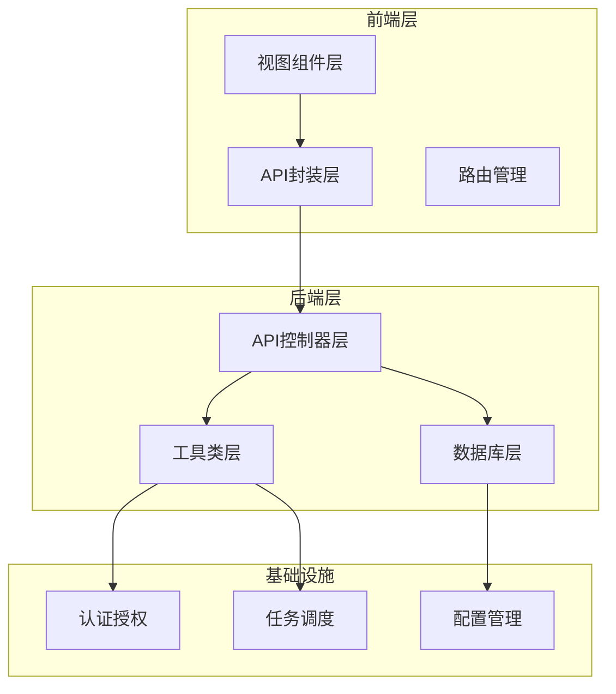

**图表来源**
- [apps.py:1-168](file://backend/app/api/apps.py#L1-L168)
- [services.py:1-182](file://backend/app/api/services.py#L1-L182)
- [servers.py:1-232](file://backend/app/api/servers.py#L1-L232)

**章节来源**
- [apps.py:1-168](file://backend/app/api/apps.py#L1-L168)
- [services.py:1-182](file://backend/app/api/services.py#L1-L182)
- [servers.py:1-232](file://backend/app/api/servers.py#L1-L232)

## 核心组件

### 应用管理系统

应用管理系统提供完整的应用生命周期管理功能：

- **应用注册与维护**：支持应用基本信息的增删改查操作
- **配置文件管理**：集中存储和管理应用配置信息
- **版本控制机制**：跟踪应用版本变更历史
- **回滚策略**：支持快速回滚到指定版本

### 服务监控系统

服务监控系统实现全面的服务状态检测和性能监控：

- **服务状态检测**：实时监控服务运行状态
- **健康检查机制**：定期执行健康检查
- **性能指标采集**：收集CPU、内存、磁盘等关键指标
- **异常告警通知**：及时发现和通知系统异常

### 服务器关联管理

应用与服务器的关联关系管理：

- **部署拓扑**：可视化展示应用部署结构
- **资源分配**：合理分配计算资源
- **负载均衡**：实现流量分发和负载均衡
- **故障转移**：自动故障检测和转移

**章节来源**
- [apps.py:11-168](file://backend/app/api/apps.py#L11-L168)
- [services.py:11-182](file://backend/app/api/services.py#L11-L182)
- [servers.py:11-232](file://backend/app/api/servers.py#L11-L232)

## 架构概览

应用系统管理模块采用现代化的微服务架构设计：

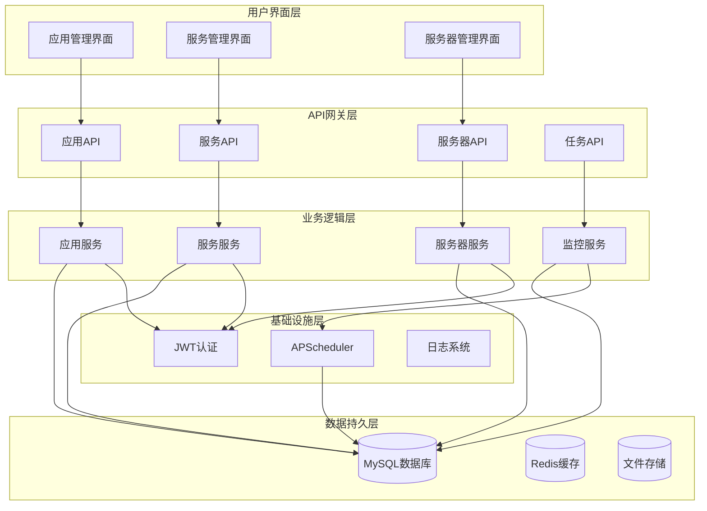

**图表来源**
- [apps.py:8-8](file://backend/app/api/apps.py#L8-L8)
- [services.py:8-8](file://backend/app/api/services.py#L8-L8)
- [servers.py:8-8](file://backend/app/api/servers.py#L8-L8)
- [tasks.py:15-15](file://backend/app/api/tasks.py#L15-L15)

## 详细组件分析

### 应用管理系统

#### 数据模型设计

应用系统采用标准化的数据模型设计：

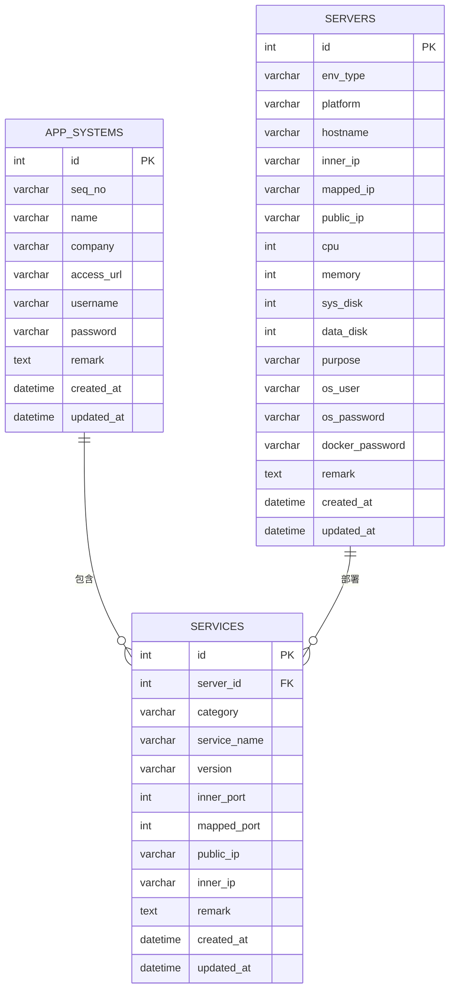

**图表来源**
- [init_db.py:129-144](file://backend/init_db.py#L129-L144)
- [init_db.py:185-226](file://backend/init_db.py#L185-L226)

#### API接口设计

应用管理API提供完整的CRUD操作：

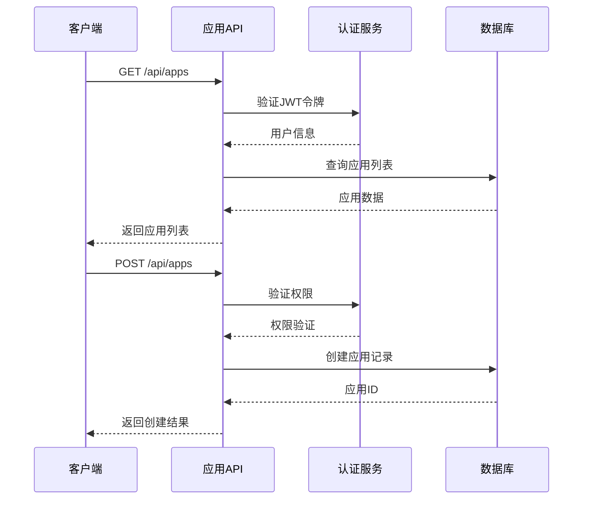

**图表来源**
- [apps.py:11-104](file://backend/app/api/apps.py#L11-L104)
- [decorators.py:9-56](file://backend/app/utils/decorators.py#L9-L56)

**章节来源**
- [apps.py:11-168](file://backend/app/api/apps.py#L11-L168)
- [Apps.vue:1-246](file://frontend/src/views/Apps.vue#L1-L246)

### 服务管理系统

#### 服务监控架构

服务监控系统采用分布式架构设计：

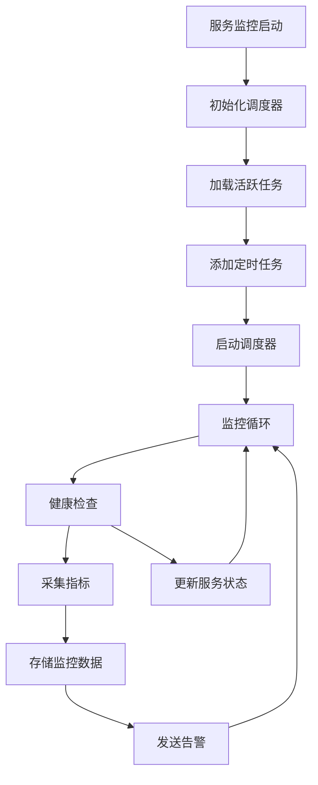

**图表来源**
- [scheduler.py:201-244](file://backend/app/utils/scheduler.py#L201-L244)

#### 服务管理功能

服务管理提供以下核心功能：

- **服务注册**：支持多种服务类型的注册和管理
- **端口映射**：灵活的端口映射和转发机制
- **环境隔离**：支持多环境类型的服务管理
- **版本控制**：服务版本的统一管理和控制

**章节来源**
- [services.py:11-182](file://backend/app/api/services.py#L11-L182)
- [Services.vue:1-296](file://frontend/src/views/Services.vue#L1-L296)

### 服务器管理系统

#### 服务器资源管理

服务器管理系统提供全面的资源管理功能：

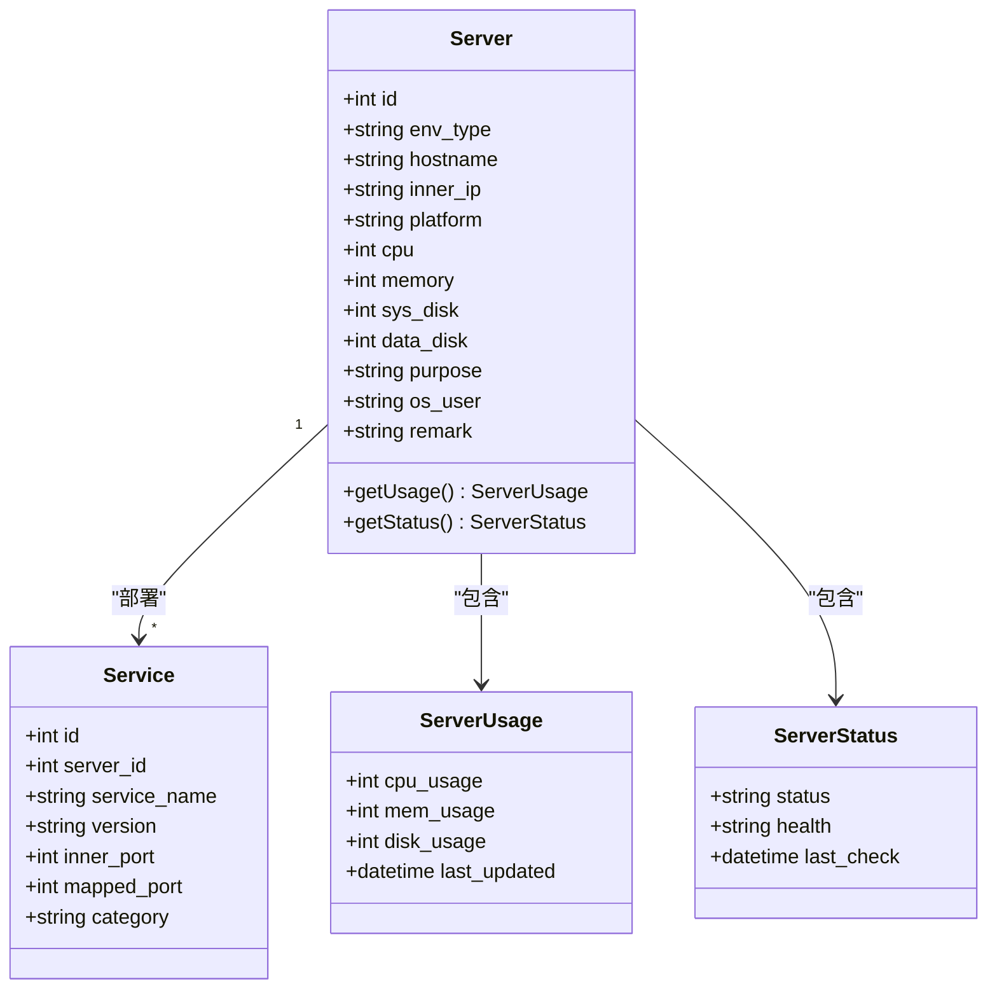

**图表来源**
- [servers.py:1-232](file://backend/app/api/servers.py#L1-L232)

**章节来源**
- [servers.py:11-232](file://backend/app/api/servers.py#L11-L232)

### 定时任务系统

#### 任务调度机制

定时任务系统采用APScheduler实现：

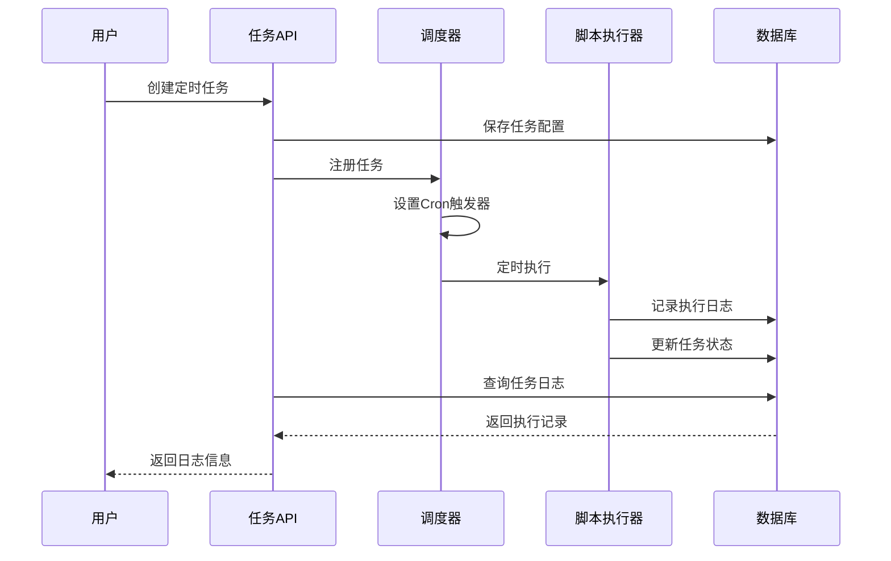

**图表来源**
- [tasks.py:63-136](file://backend/app/api/tasks.py#L63-L136)
- [scheduler.py:146-185](file://backend/app/utils/scheduler.py#L146-L185)

**章节来源**
- [tasks.py:1-458](file://backend/app/api/tasks.py#L1-L458)
- [scheduler.py:1-249](file://backend/app/utils/scheduler.py#L1-L249)

## 依赖关系分析

### 技术栈依赖

应用系统管理模块采用成熟稳定的技术栈：

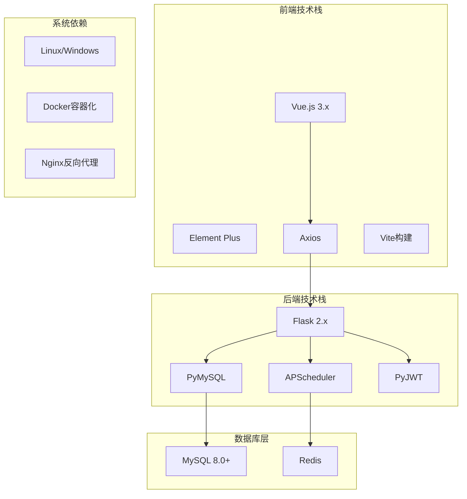

**图表来源**
- [config.py:1-21](file://backend/app/config.py#L1-L21)
- [requirements.txt](file://backend/requirements.txt)

### 模块间依赖关系

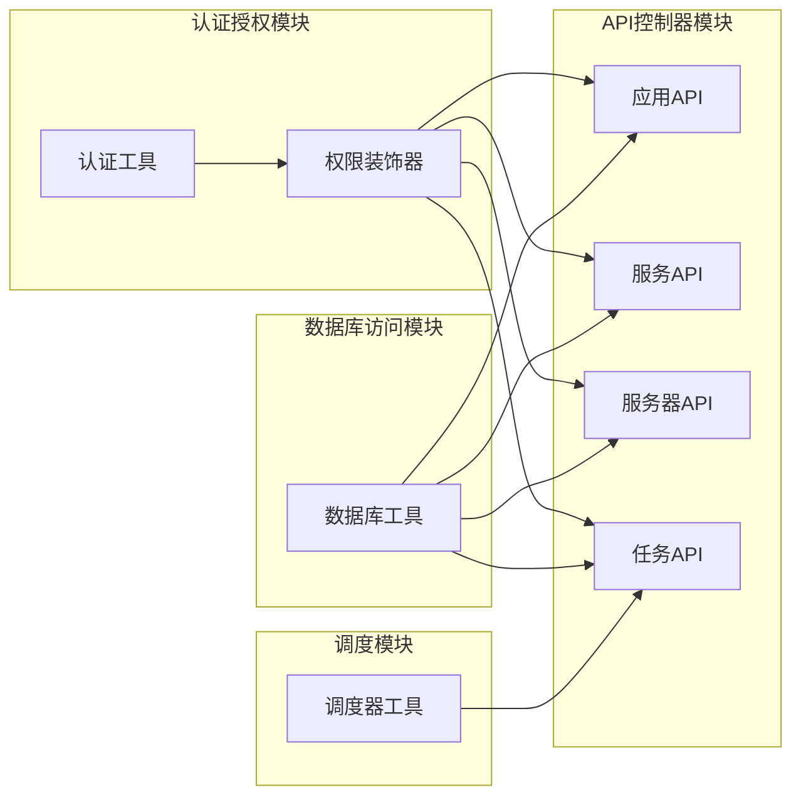

**图表来源**
- [decorators.py:1-95](file://backend/app/utils/decorators.py#L1-L95)
- [db.py:1-17](file://backend/app/utils/db.py#L1-L17)
- [scheduler.py:1-249](file://backend/app/utils/scheduler.py#L1-L249)

**章节来源**
- [decorators.py:1-95](file://backend/app/utils/decorators.py#L1-L95)
- [db.py:1-17](file://backend/app/utils/db.py#L1-L17)
- [scheduler.py:1-249](file://backend/app/utils/scheduler.py#L1-L249)

## 性能考虑

### 数据库性能优化

应用系统管理模块在数据库层面采用了多项性能优化措施：

- **索引优化**：为常用查询字段建立适当索引
- **查询优化**：使用参数化查询防止SQL注入
- **连接池管理**：合理管理数据库连接资源
- **分页查询**：支持大数据量的分页显示

### 缓存策略

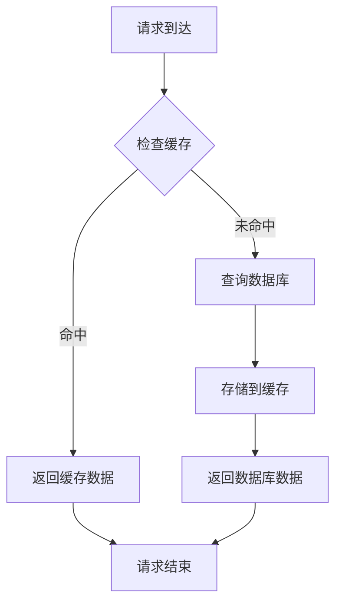

**图表来源**
- [db.py:5-16](file://backend/app/utils/db.py#L5-L16)

### 并发处理

系统采用异步处理机制应对高并发场景：

- **线程池管理**：合理配置线程池大小
- **任务队列**：使用消息队列处理异步任务
- **锁机制**：避免竞态条件和数据不一致
- **超时控制**：设置合理的超时时间

## 故障排除指南

### 常见问题诊断

#### 认证相关问题

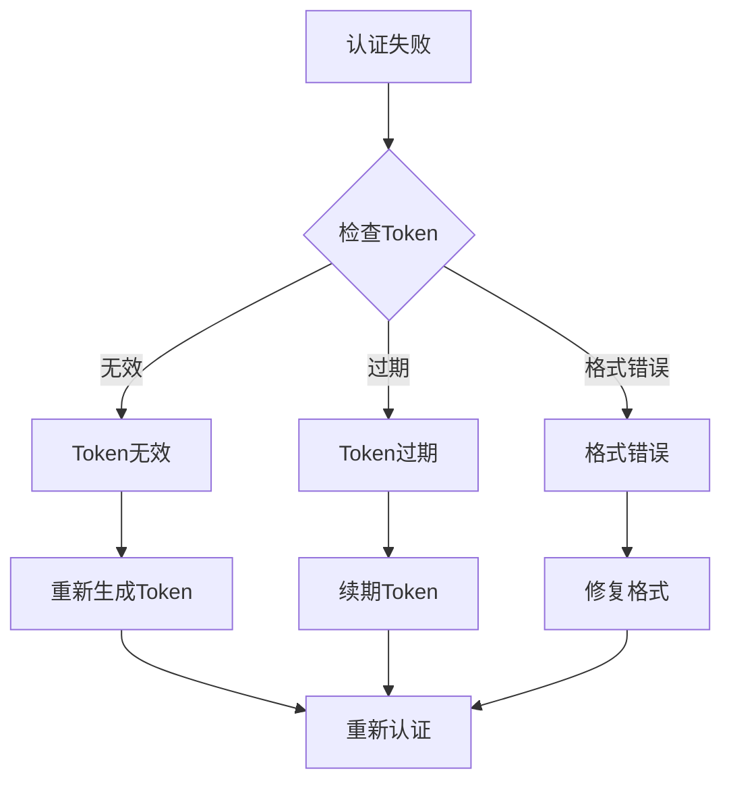

**图表来源**
- [decorators.py:22-54](file://backend/app/utils/decorators.py#L22-L54)

#### 数据库连接问题

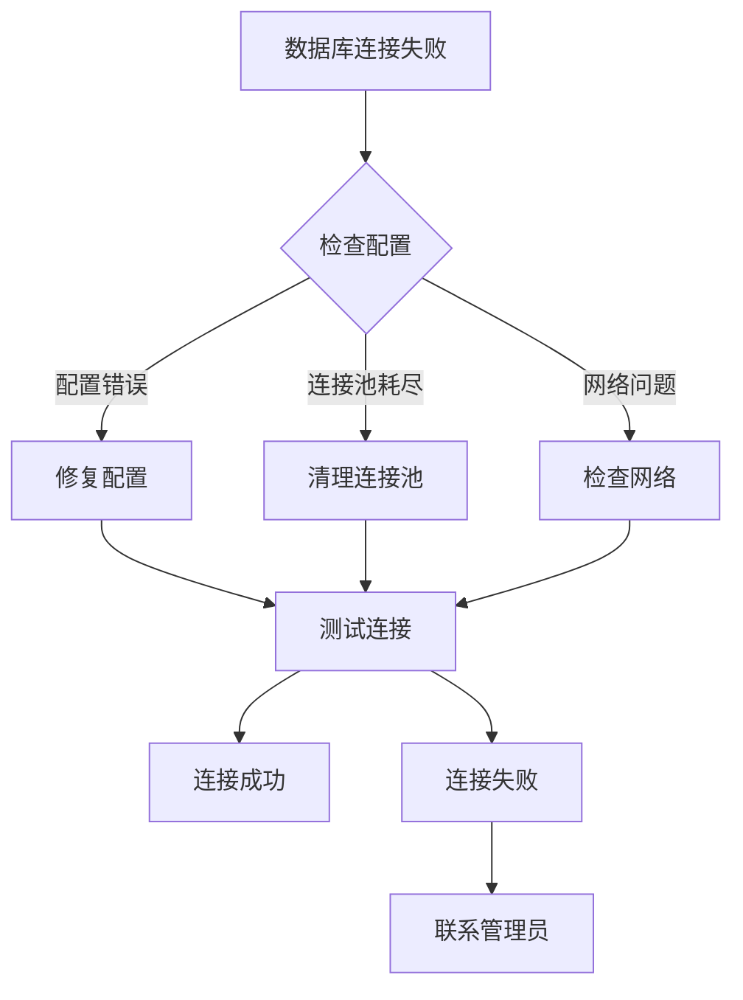

**图表来源**
- [db.py:5-16](file://backend/app/utils/db.py#L5-L16)

### 日志分析

系统提供完善的日志记录和分析功能：

- **访问日志**：记录所有API访问信息
- **错误日志**：详细记录错误信息和堆栈跟踪
- **性能日志**：监控系统性能指标
- **审计日志**：记录重要操作的审计信息

**章节来源**
- [tasks.py:423-457](file://backend/app/api/tasks.py#L423-L457)
- [scheduler.py:32-143](file://backend/app/utils/scheduler.py#L32-L143)

## 结论

应用系统管理模块为云运维平台提供了完整的企业级应用管理解决方案。模块设计遵循现代软件工程最佳实践，具有以下特点：

### 核心优势

- **功能完整性**：覆盖应用生命周期的各个环节
- **架构先进性**：采用微服务和分布式架构设计
- **安全性保障**：完善的认证授权和数据保护机制
- **可扩展性**：模块化设计便于功能扩展和维护

### 技术特色

- **前后端分离**：现代化的开发模式提升开发效率
- **异步处理**：高效的并发处理能力
- **监控完善**：全面的性能监控和告警机制
- **配置灵活**：支持多环境和多租户配置

### 发展方向

未来可以在以下方面进一步完善：

- **容器化支持**：集成Docker和Kubernetes管理
- **自动化部署**：实现CI/CD流水线集成
- **智能监控**：引入AI驱动的异常检测
- **多云管理**：支持多云环境的统一管理

该模块为企业数字化转型提供了坚实的技术基础，能够有效提升应用管理效率和运维水平。