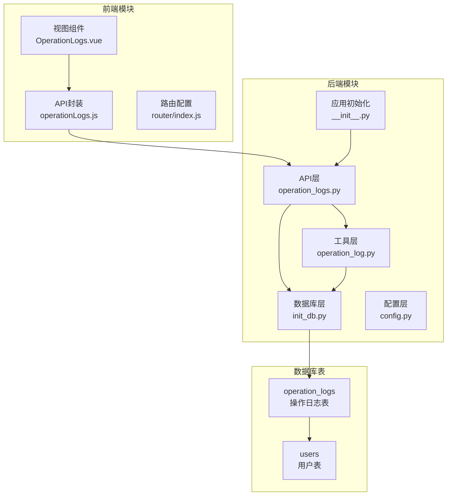
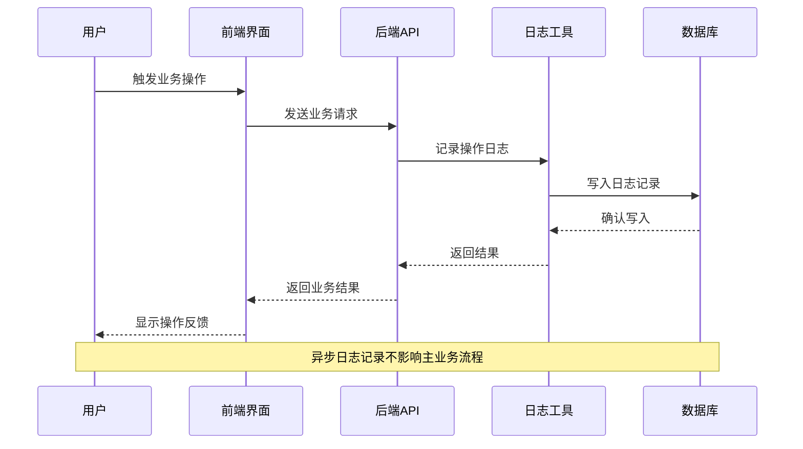
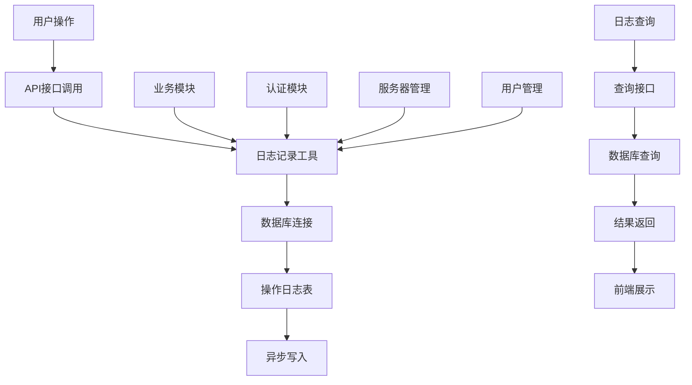
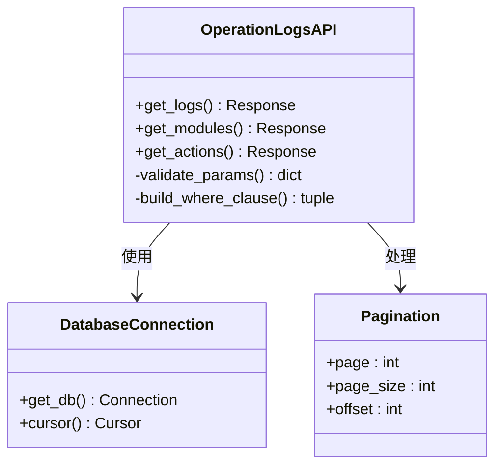
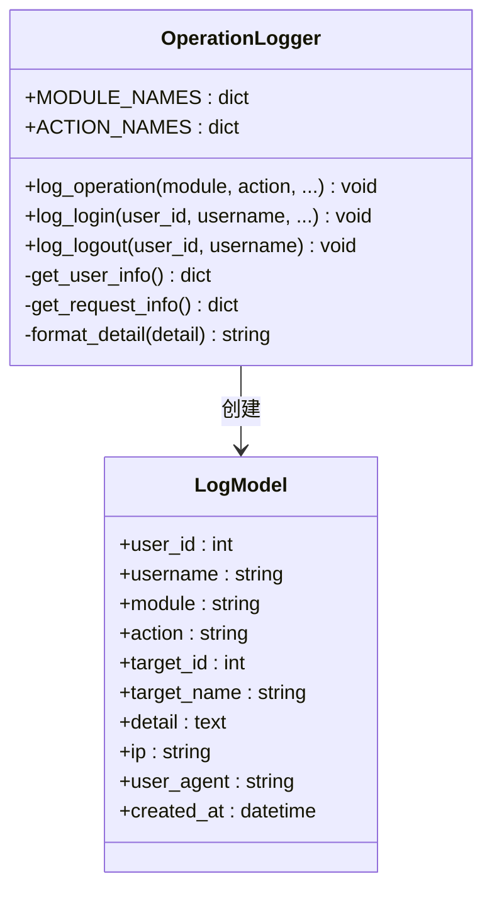
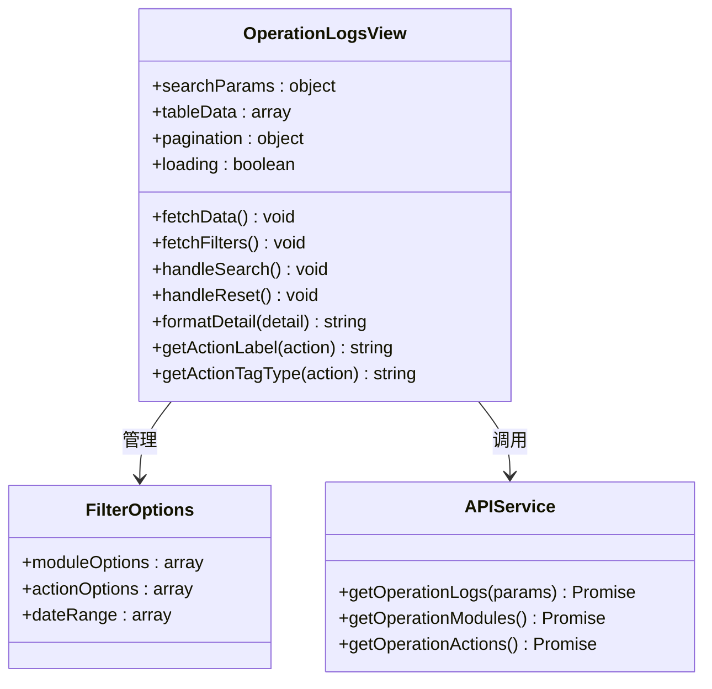
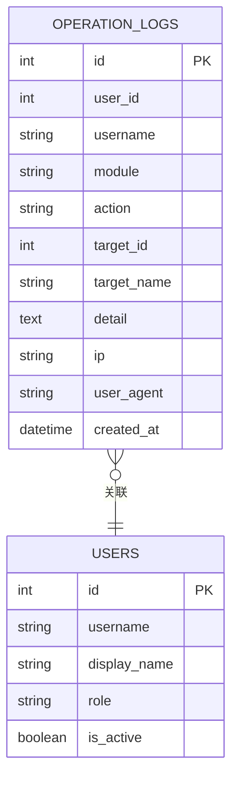
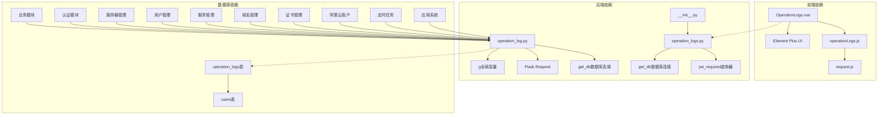
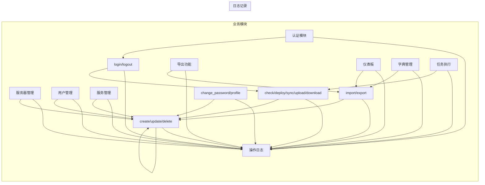

# 操作日志管理模块

<cite>
**本文档引用的文件**
- [backend/app/api/operation_logs.py](file://backend/app/api/operation_logs.py)
- [backend/app/utils/operation_log.py](file://backend/app/utils/operation_log.py)
- [frontend/src/views/OperationLogs.vue](file://frontend/src/views/OperationLogs.vue)
- [frontend/src/api/operationLogs.js](file://frontend/src/api/operationLogs.js)
- [backend/init_db.py](file://backend/init_db.py)
- [backend/app/api/auth.py](file://backend/app/api/auth.py)
- [backend/app/api/servers.py](file://backend/app/api/servers.py)
- [backend/app/api/users.py](file://backend/app/api/users.py)
- [backend/app/api/services.py](file://backend/app/api/services.py)
- [frontend/src/router/index.js](file://frontend/src/router/index.js)
- [backend/app/utils/db.py](file://backend/app/utils/db.py)
- [backend/app/config.py](file://backend/app/config.py)
- [backend/app/__init__.py](file://backend/app/__init__.py)
</cite>

## 更新摘要
**变更内容**
- 新增统一的日志记录工具类，提供标准化的日志记录机制
- 扩展了API集成范围，所有业务模块均集成了日志记录功能
- 增强了审计功能，支持更详细的日志记录和查询
- 完善了日志记录机制，包括模块映射和操作类型映射
- 优化了日志查询接口，支持更灵活的过滤和分页功能

## 目录
1. [简介](#简介)
2. [项目结构](#项目结构)
3. [核心组件](#核心组件)
4. [架构概览](#架构概览)
5. [详细组件分析](#详细组件分析)
6. [依赖关系分析](#依赖关系分析)
7. [性能考虑](#性能考虑)
8. [故障排除指南](#故障排除指南)
9. [结论](#结论)

## 简介

操作日志管理模块是运维平台的重要组成部分，负责记录和展示用户在系统中的所有关键操作行为。该模块提供了完整的操作审计功能，包括日志记录、查询、筛选和统计分析能力，为系统的安全监控、合规审计和问题追踪提供了重要支撑。

该模块采用前后端分离架构，后端使用Flask框架提供RESTful API接口，前端使用Vue.js构建用户界面，实现了完整的操作日志管理功能。经过重大增强后，系统现在具备了统一的日志记录工具、扩展的API集成和增强的审计功能。

## 项目结构

操作日志管理模块在项目中的组织结构如下：

**图表来源**
- [backend/app/api/operation_logs.py:1-128](file://backend/app/api/operation_logs.py#L1-L128)
- [backend/app/utils/operation_log.py:1-113](file://backend/app/utils/operation_log.py#L1-L113)
- [backend/init_db.py:190-209](file://backend/init_db.py#L190-L209)
- [backend/app/__init__.py:68](file://backend/app/__init__.py#L68)

**章节来源**
- [backend/app/api/operation_logs.py:1-128](file://backend/app/api/operation_logs.py#L1-L128)
- [backend/app/utils/operation_log.py:1-113](file://backend/app/utils/operation_log.py#L1-L113)
- [frontend/src/views/OperationLogs.vue:1-223](file://frontend/src/views/OperationLogs.vue#L1-L223)

## 核心组件

### 后端核心组件

#### 操作日志API控制器
- 提供操作日志的查询、筛选和分页功能
- 支持按模块、操作类型、用户、日期范围进行多维度过滤
- 实现了完整的CRUD操作支持

#### 统一日志记录工具类
- **新增** 提供统一的日志记录机制，封装了完整的日志记录逻辑
- 自动收集用户信息、IP地址、User-Agent等上下文信息
- 提供了预定义的操作类型和模块映射，支持国际化显示
- 包含专门的登录登出日志记录函数

#### 模块化日志记录集成
- **扩展** 所有业务模块均集成了日志记录功能
- 支持服务器管理、用户管理、认证模块、服务管理等多个模块的日志记录
- 提供了详细的操作详情记录，包括环境类型、IP地址等关键信息

### 前端核心组件

#### 操作日志视图组件
- 提供直观的日志查询界面
- 支持实时筛选和分页浏览
- 展示详细的操作日志信息和状态标识
- **增强** 支持操作详情的JSON格式解析和友好展示

#### API封装层
- 统一的HTTP请求处理
- 错误处理和响应数据格式化
- 与后端API的标准化对接

**章节来源**
- [backend/app/api/operation_logs.py:12-128](file://backend/app/api/operation_logs.py#L12-L128)
- [backend/app/utils/operation_log.py:13-113](file://backend/app/utils/operation_log.py#L13-L113)
- [frontend/src/views/OperationLogs.vue:79-223](file://frontend/src/views/OperationLogs.vue#L79-L223)

## 架构概览

操作日志管理模块采用了清晰的分层架构设计，经过增强后更加完善：

**图表来源**
- [backend/app/utils/operation_log.py:26-61](file://backend/app/utils/operation_log.py#L26-L61)
- [backend/app/api/operation_logs.py:14-91](file://backend/app/api/operation_logs.py#L14-L91)

### 数据流架构

**图表来源**
- [backend/app/utils/operation_log.py:26-58](file://backend/app/utils/operation_log.py#L26-L58)
- [backend/app/api/operation_logs.py:54-91](file://backend/app/api/operation_logs.py#L54-L91)

## 详细组件分析

### 后端API组件

#### 操作日志查询接口

操作日志查询接口提供了灵活的过滤和分页功能，经过增强后支持更多查询条件：

**图表来源**
- [backend/app/api/operation_logs.py:12-128](file://backend/app/api/operation_logs.py#L12-L128)
- [backend/app/utils/db.py:5-17](file://backend/app/utils/db.py#L5-L17)

#### 统一日志记录工具类

**新增** 日志记录工具类实现了统一的日志管理机制，提供了完整的日志记录功能：

**图表来源**
- [backend/app/utils/operation_log.py:13-113](file://backend/app/utils/operation_log.py#L13-L113)

**章节来源**
- [backend/app/api/operation_logs.py:12-128](file://backend/app/api/operation_logs.py#L12-L128)
- [backend/app/utils/operation_log.py:13-113](file://backend/app/utils/operation_log.py#L13-L113)

### 前端组件分析

#### 操作日志视图组件

前端视图组件提供了完整的用户交互界面，增强了日志详情的展示功能：

**图表来源**
- [frontend/src/views/OperationLogs.vue:79-223](file://frontend/src/views/OperationLogs.vue#L79-L223)
- [frontend/src/api/operationLogs.js:1-17](file://frontend/src/api/operationLogs.js#L1-L17)

**章节来源**
- [frontend/src/views/OperationLogs.vue:1-223](file://frontend/src/views/OperationLogs.vue#L1-L223)
- [frontend/src/api/operationLogs.js:1-17](file://frontend/src/api/operationLogs.js#L1-L17)

### 数据库设计

#### 操作日志表结构

**增强** 操作日志表结构支持更详细的日志记录：

**图表来源**
- [backend/init_db.py:190-209](file://backend/init_db.py#L190-L209)

**章节来源**
- [backend/init_db.py:190-209](file://backend/init_db.py#L190-L209)

## 依赖关系分析

### 组件间依赖关系

**图表来源**
- [frontend/src/views/OperationLogs.vue](file://frontend/src/views/OperationLogs.vue#L81)
- [backend/app/api/operation_logs.py:4-8](file://backend/app/api/operation_logs.py#L4-L8)
- [backend/app/utils/operation_log.py:7-8](file://backend/app/utils/operation_log.py#L7-L8)
- [backend/app/__init__.py:68](file://backend/app/__init__.py#L68)

### 使用场景依赖

**扩展** 操作日志模块在各个业务模块中的使用情况：

**图表来源**
- [backend/app/api/servers.py:159](file://backend/app/api/servers.py#L159)
- [backend/app/api/auth.py:68-69](file://backend/app/api/auth.py#L68-L69)
- [backend/app/api/users.py:192-207](file://backend/app/api/users.py#L192-L207)
- [backend/app/api/services.py:167-178](file://backend/app/api/services.py#L167-L178)

**章节来源**
- [backend/app/api/servers.py:159](file://backend/app/api/servers.py#L159)
- [backend/app/api/auth.py:68-69](file://backend/app/api/auth.py#L68-L69)
- [backend/app/api/users.py:192-207](file://backend/app/api/users.py#L192-L207)
- [backend/app/api/services.py:167-178](file://backend/app/api/services.py#L167-L178)

## 性能考虑

### 查询性能优化

1. **索引策略**
   - 在`created_at`字段上建立索引，优化时间范围查询
   - 在`module`和`action`字段上建立索引，支持快速过滤
   - 在`user_id`字段上建立索引，支持用户相关查询

2. **分页优化**
   - 使用LIMIT和OFFSET实现高效分页
   - 避免一次性加载大量数据
   - 提供合理的默认分页大小

3. **查询优化**
   - 使用参数化查询防止SQL注入
   - 动态构建WHERE子句减少不必要的查询
   - 批量查询减少数据库连接开销

### 存储性能优化

1. **日志表设计**
   - 使用TEXT类型存储JSON详情，支持灵活的数据结构
   - 合理的数据类型选择，平衡存储空间和查询性能
   - 适当的字符集选择确保中文字符正确存储

2. **连接池管理**
   - 合理配置数据库连接参数
   - 及时关闭数据库连接释放资源
   - 避免连接泄漏影响系统性能

3. **异步日志记录**
   - **新增** 日志记录采用异步方式，不影响主业务流程
   - 减少数据库写入对系统性能的影响
   - 提高系统的整体响应速度

## 故障排除指南

### 常见问题及解决方案

#### 日志记录失败

**问题症状**
- 操作执行成功但日志未记录
- 数据库连接异常导致日志丢失

**排查步骤**
1. 检查数据库连接配置是否正确
2. 验证operation_logs表是否存在且可写
3. 查看后端日志中的错误信息
4. 确认数据库用户权限设置

**解决方案**
- 验证数据库连接字符串配置
- 检查防火墙和网络连接
- 确认数据库服务正常运行
- 检查磁盘空间和权限设置

#### 查询性能问题

**问题症状**
- 日志查询响应缓慢
- 大数据量查询超时

**排查步骤**
1. 检查数据库索引是否完整
2. 分析慢查询日志
3. 优化查询条件和分页参数
4. 考虑添加复合索引

**解决方案**
- 为常用查询字段添加索引
- 限制查询时间范围
- 优化分页查询逻辑
- 考虑数据归档策略

#### 前端显示异常

**问题症状**
- 日志列表无法显示
- 筛选功能失效
- 分页功能异常

**排查步骤**
1. 检查API接口是否正常响应
2. 验证前端网络请求状态
3. 检查浏览器控制台错误信息
4. 确认路由配置正确性

**解决方案**
- 检查后端API状态
- 验证前端依赖包版本
- 确认跨域配置正确
- 检查前端缓存和本地存储

#### 日志详情显示问题

**新增** **问题症状**
- 日志详情无法正确解析显示
- JSON格式的日志详情显示不友好

**排查步骤**
1. 检查后端日志详情的JSON格式是否正确
2. 验证前端JSON解析逻辑
3. 确认日志详情字段的数据完整性

**解决方案**
- 修复后端日志详情的JSON序列化
- 优化前端JSON解析和格式化逻辑
- 添加日志详情的错误处理机制

**章节来源**
- [backend/app/utils/db.py:5-17](file://backend/app/utils/db.py#L5-L17)
- [backend/app/config.py:9-13](file://backend/app/config.py#L9-L13)

## 结论

操作日志管理模块作为运维平台的核心审计组件，经过重大增强后实现了以下关键功能：

### 主要成就

1. **统一的日志记录体系**
   - 新增了统一的日志记录工具类，提供标准化的日志记录机制
   - 所有业务模块均集成了日志记录功能，实现了全面的审计覆盖
   - 支持详细的日志详情记录，包括操作对象的完整信息

2. **增强的查询能力**
   - 多维度过滤和搜索功能更加完善
   - 支持按模块、操作类型、用户、日期范围的灵活查询
   - 提供友好的用户界面和实时筛选功能

3. **可靠的系统集成**
   - 与各业务模块无缝集成，支持服务器管理、用户管理、认证模块、服务管理等多个模块
   - 异步日志记录不影响主业务流程
   - 统一的日志格式和标准，便于后续扩展

4. **完善的模块化设计**
   - 清晰的分层架构便于维护和扩展
   - 合理的索引策略和查询优化
   - 完善的异常处理和故障恢复机制

### 技术优势

- **模块化设计**：清晰的分层架构便于维护和扩展
- **性能优化**：合理的索引策略和查询优化
- **错误处理**：完善的异常处理和故障恢复机制
- **安全性**：基于JWT的身份验证和授权控制
- **异步处理**：日志记录采用异步方式，不影响系统性能

### 改进建议

1. **日志归档**：考虑实现日志自动归档和清理机制
2. **实时监控**：增加日志实时监控和告警功能
3. **数据分析**：提供日志数据分析和报表生成功能
4. **权限控制**：细化日志查看和操作权限管理
5. **日志详情增强**：支持更多类型的日志详情记录和展示

该模块为运维平台提供了坚实的安全审计基础，为系统的稳定运行和合规管理提供了重要保障。经过本次重大增强，系统现在具备了更加完善的操作审计能力和更好的用户体验。