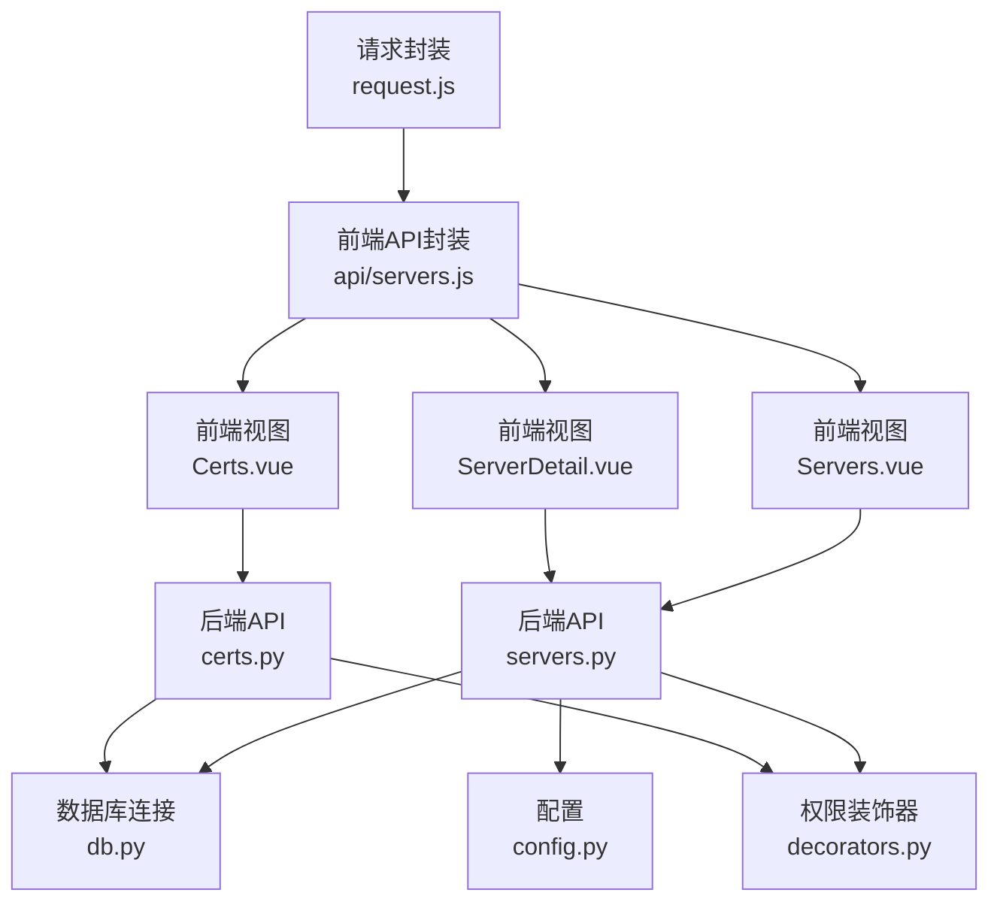
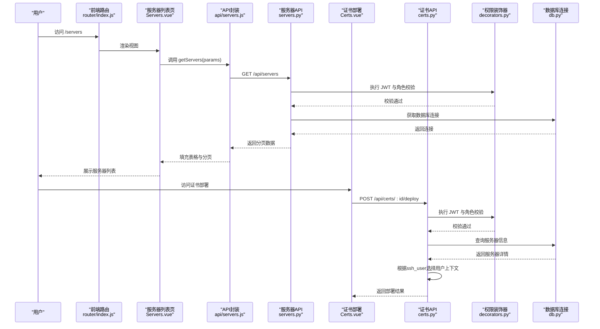
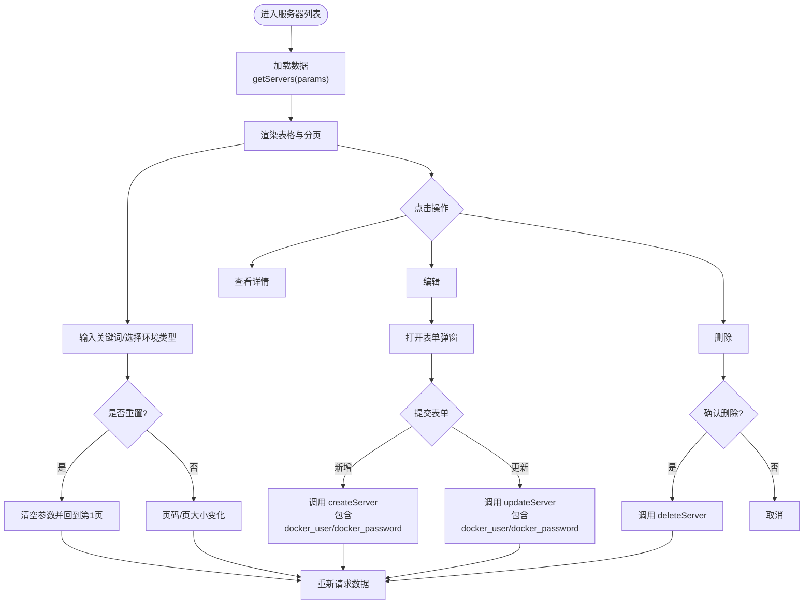
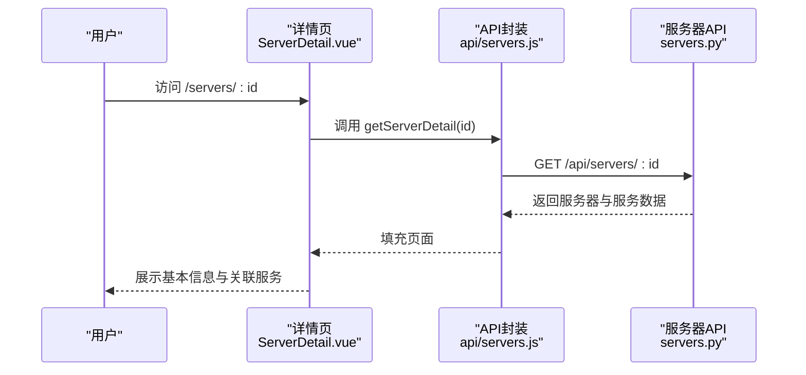
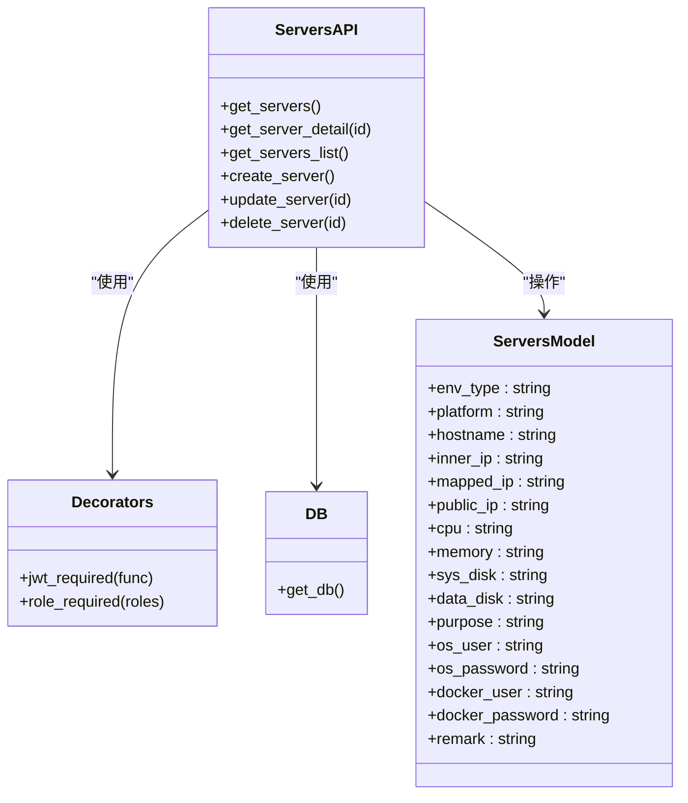
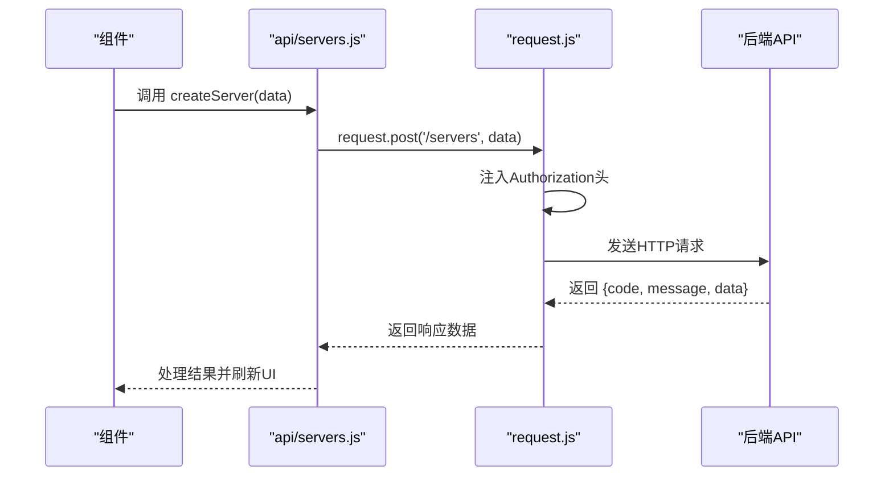
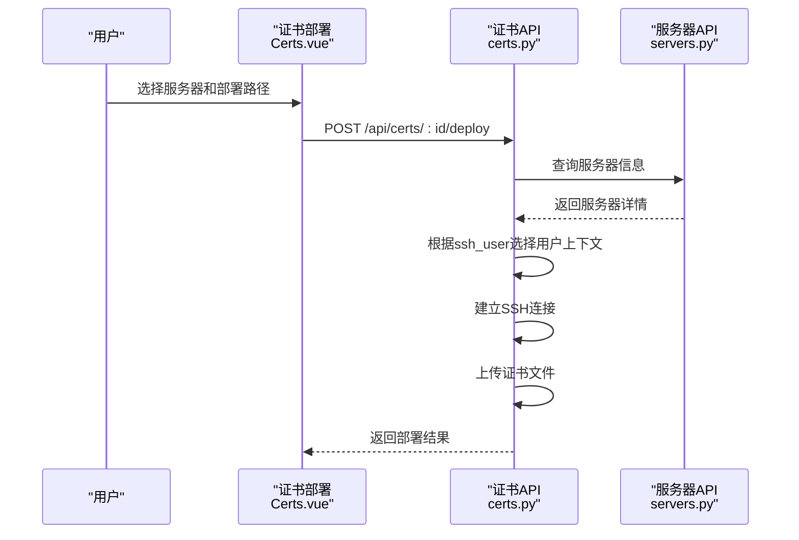
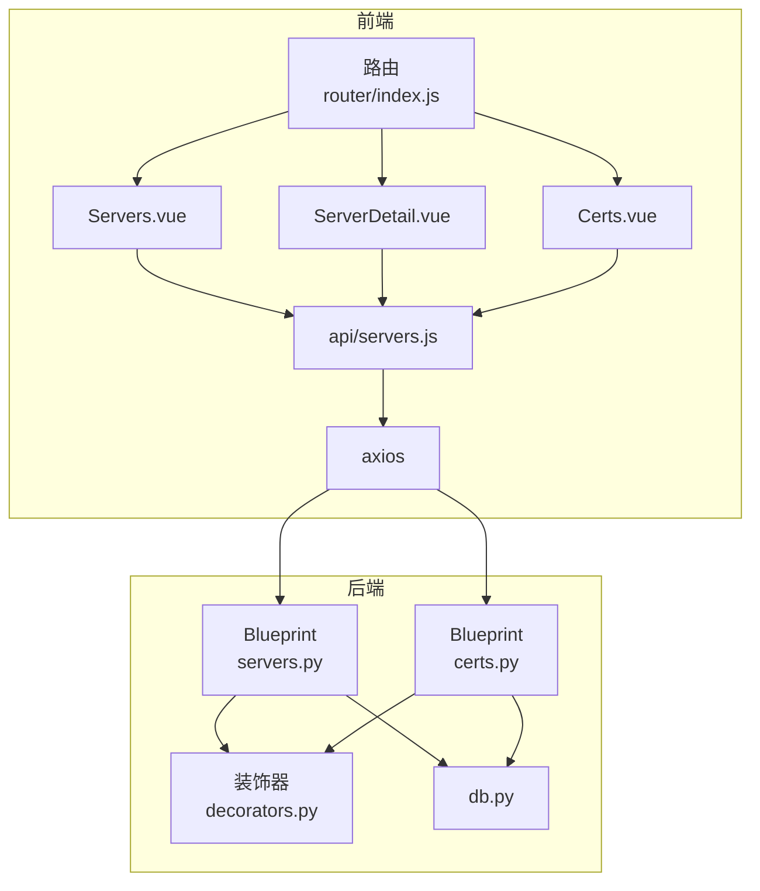

# 服务器管理模块

<cite>
**本文引用的文件**
- [backend/app/api/servers.py](file://backend/app/api/servers.py)
- [frontend/src/views/Servers.vue](file://frontend/src/views/Servers.vue)
- [frontend/src/views/ServerDetail.vue](file://frontend/src/views/ServerDetail.vue)
- [frontend/src/views/Certs.vue](file://frontend/src/views/Certs.vue)
- [frontend/src/api/servers.js](file://frontend/src/api/servers.js)
- [frontend/src/api/request.js](file://frontend/src/api/request.js)
- [backend/init_db.py](file://backend/init_db.py)
- [backend/app/utils/db.py](file://backend/app/utils/db.py)
- [backend/app/utils/decorators.py](file://backend/app/utils/decorators.py)
- [backend/app/config.py](file://backend/app/config.py)
- [frontend/src/router/index.js](file://frontend/src/router/index.js)
- [frontend/src/components/PasswordDisplay.vue](file://frontend/src/components/PasswordDisplay.vue)
- [backend/app/api/services.py](file://backend/app/api/services.py)
- [backend/app/api/certs.py](file://backend/app/api/certs.py)
</cite>

## 更新摘要
**变更内容**
- 增强服务器部署功能，支持root用户和docker用户两种上下文
- 新增ssh_user参数和docker_user/docker_password字段
- 更新服务器表结构以支持普通用户配置
- 完善证书部署的用户上下文选择机制

## 目录
1. [简介](#简介)
2. [项目结构](#项目结构)
3. [核心组件](#核心组件)
4. [架构总览](#架构总览)
5. [详细组件分析](#详细组件分析)
6. [依赖分析](#依赖分析)
7. [性能考虑](#性能考虑)
8. [故障排查指南](#故障排查指南)
9. [结论](#结论)
10. [附录](#附录)

## 简介
本文件面向云运维平台的"服务器管理模块"，围绕服务器列表的增删改查（CRUD）、搜索过滤、分页机制、详情页面设计、关联服务展示、以及权限控制与前后端交互进行系统化说明。同时提供最佳实践建议与常见问题排查指引，帮助运维人员高效、安全地完成服务器全生命周期管理。

**更新** 本次更新增强了服务器部署功能，支持root用户和docker用户两种上下文，新增ssh_user参数和docker_user/docker_password字段，为服务器管理提供了更灵活的部署方式。

## 项目结构
服务器管理模块由前端 Vue 单页应用与后端 Flask API 两部分组成，采用前后端分离架构：
- 前端负责用户界面、表单校验、分页与交互逻辑，并通过统一请求封装调用后端接口。
- 后端提供 RESTful API，实现服务器与服务的 CRUD、权限校验与数据库访问。



**图表来源**
- [frontend/src/views/Servers.vue:1-335](file://frontend/src/views/Servers.vue#L1-L335)
- [frontend/src/views/ServerDetail.vue:1-157](file://frontend/src/views/ServerDetail.vue#L1-L157)
- [frontend/src/views/Certs.vue:320-519](file://frontend/src/views/Certs.vue#L320-L519)
- [frontend/src/api/servers.js:1-26](file://frontend/src/api/servers.js#L1-L26)
- [backend/app/api/servers.py:1-232](file://backend/app/api/servers.py#L1-L232)
- [backend/app/api/certs.py:1195-1322](file://backend/app/api/certs.py#L1195-L1322)
- [backend/app/utils/db.py:1-17](file://backend/app/utils/db.py#L1-L17)
- [backend/app/utils/decorators.py:1-95](file://backend/app/utils/decorators.py#L1-L95)
- [backend/app/config.py:1-21](file://backend/app/config.py#L1-L21)
- [frontend/src/api/request.js:1-54](file://frontend/src/api/request.js#L1-L54)

**章节来源**
- [frontend/src/router/index.js:1-61](file://frontend/src/router/index.js#L1-L61)
- [backend/app/config.py:1-21](file://backend/app/config.py#L1-L21)

## 核心组件
- 服务器列表页（Servers.vue）
  - 实现环境类型筛选、关键词搜索（主机名/IP/用途）、分页与 CRUD 操作入口。
  - 表格列包含环境类型（带标签样式）、平台、主机名、内网/映射/公网 IP、CPU/内存、用途等。
  - 支持新增、编辑、删除服务器，删除前二次确认。
  - **新增** 支持普通用户和普通用户密码字段配置。
- 服务器详情页（ServerDetail.vue）
  - 展示服务器基本信息与关联服务列表；支持返回列表页与面包屑导航。
  - 密码字段通过专用组件展示与复制，避免明文泄露。
  - **新增** 展示普通用户和普通用户密码信息。
- 服务器 API（servers.py）
  - 提供服务器列表、详情、简要列表、创建、更新、删除接口。
  - 支持环境类型过滤与关键词模糊搜索；分页参数安全处理。
  - **更新** 支持docker_user和docker_password字段的创建和更新。
- 前端 API 封装（api/servers.js）
  - 对 GET/POST/PUT/DELETE 等请求进行统一封装，便于复用。
- 权限与认证（decorators.py、request.js）
  - JWT 认证与角色权限控制；请求自动附加 Authorization 头；响应统一错误处理。
- 数据库连接（db.py）
  - 基于配置读取数据库连接参数，提供统一连接工厂。
- **新增** 证书部署功能（Certs.vue、certs.py）
  - 支持通过ssh_user参数选择root或docker用户进行证书部署。
  - 自动检测服务器是否配置普通用户，提供相应的部署选项。

**章节来源**
- [frontend/src/views/Servers.vue:1-335](file://frontend/src/views/Servers.vue#L1-L335)
- [frontend/src/views/ServerDetail.vue:1-157](file://frontend/src/views/ServerDetail.vue#L1-L157)
- [frontend/src/views/Certs.vue:320-519](file://frontend/src/views/Certs.vue#L320-L519)
- [frontend/src/api/servers.js:1-26](file://frontend/src/api/servers.js#L1-L26)
- [backend/app/api/servers.py:1-232](file://backend/app/api/servers.py#L1-L232)
- [backend/app/api/certs.py:1195-1322](file://backend/app/api/certs.py#L1195-L1322)
- [backend/app/utils/decorators.py:1-95](file://backend/app/utils/decorators.py#L1-L95)
- [frontend/src/api/request.js:1-54](file://frontend/src/api/request.js#L1-L54)
- [backend/app/utils/db.py:1-17](file://backend/app/utils/db.py#L1-L17)

## 架构总览
服务器管理模块遵循"前端路由 -> 前端API -> 后端蓝图 -> 权限装饰器 -> 数据库"的调用链路。前端通过 Element Plus 组件构建 UI，后端通过 Blueprint 定义路由，装饰器统一处理认证与授权，数据库连接通过工厂函数集中管理。



**图表来源**
- [frontend/src/router/index.js:1-61](file://frontend/src/router/index.js#L1-L61)
- [frontend/src/views/Servers.vue:1-335](file://frontend/src/views/Servers.vue#L1-L335)
- [frontend/src/views/Certs.vue:320-519](file://frontend/src/views/Certs.vue#L320-L519)
- [frontend/src/api/servers.js:1-26](file://frontend/src/api/servers.js#L1-L26)
- [backend/app/api/servers.py:1-232](file://backend/app/api/servers.py#L1-L232)
- [backend/app/api/certs.py:1195-1322](file://backend/app/api/certs.py#L1195-L1322)
- [backend/app/utils/decorators.py:1-95](file://backend/app/utils/decorators.py#L1-L95)
- [backend/app/utils/db.py:1-17](file://backend/app/utils/db.py#L1-L17)

## 详细组件分析

### 服务器列表页（Servers.vue）
- 功能要点
  - 搜索区：环境类型下拉筛选、关键词输入框（支持回车触发），重置与新增按钮。
  - 数据表格：展示环境类型（带标签样式）、平台、主机名、内网/映射/公网 IP、CPU/内存、用途；右侧操作列提供查看、编辑、删除。
  - 分页：支持页大小切换与页码跳转，数据加载使用 v-loading。
  - 弹窗表单：新增/编辑统一表单，包含环境类型、平台、主机名、内网/映射/公网 IP、CPU/内存、系统盘/数据盘、用途、系统用户/密码、**普通用户/普通用户密码**、备注等字段；必填项包含环境类型、主机名、内网 IP。
  - **更新** 新增普通用户和普通用户密码字段，支持可选配置。
- 交互流程
  - 初始化加载：mounted 时调用获取服务器列表。
  - 搜索与重置：变更搜索参数后重置页码并刷新数据。
  - 新增/编辑：打开弹窗，表单校验通过后调用创建或更新接口。
  - 删除：二次确认后调用删除接口并刷新列表。



**图表来源**
- [frontend/src/views/Servers.vue:1-335](file://frontend/src/views/Servers.vue#L1-L335)
- [frontend/src/api/servers.js:1-26](file://frontend/src/api/servers.js#L1-L26)

**章节来源**
- [frontend/src/views/Servers.vue:1-335](file://frontend/src/views/Servers.vue#L1-L335)

### 服务器详情页（ServerDetail.vue）
- 功能要点
  - 面包屑导航与返回按钮，提升页面连贯性。
  - 基本信息卡片：展示环境类型（带标签样式）、平台、主机名、内网/映射/公网 IP、CPU/内存、系统盘/数据盘、用途、系统用户、密码（通过组件展示与复制）、**普通用户**、**普通用户密码**、备注等。
  - 关联服务列表：展示服务分类、名称、版本、内部/映射端口、备注等。
  - **更新** 展示普通用户和普通用户密码信息，支持密码安全显示。
- 交互流程
  - mounted 时根据路由参数获取服务器详情，填充基本信息与服务列表。
  - 点击返回按钮回到服务器列表页。



**图表来源**
- [frontend/src/views/ServerDetail.vue:1-157](file://frontend/src/views/ServerDetail.vue#L1-L157)
- [frontend/src/api/servers.js:1-26](file://frontend/src/api/servers.js#L1-L26)
- [backend/app/api/servers.py:75-107](file://backend/app/api/servers.py#L75-L107)

**章节来源**
- [frontend/src/views/ServerDetail.vue:1-157](file://frontend/src/views/ServerDetail.vue#L1-L157)

### 服务器 API（servers.py）
- 接口能力
  - GET /api/servers：分页获取服务器列表，支持环境类型过滤与关键词模糊搜索（主机名/内网 IP/平台）。
  - GET /api/servers/:id：获取服务器详情及关联服务列表。
  - GET /api/servers/list：获取所有服务器简要信息（用于下拉框）。
  - POST /api/servers：创建服务器。
  - PUT /api/servers/:id：更新服务器（按需字段更新）。
  - DELETE /api/servers/:id：删除服务器。
- 安全与健壮性
  - 分页参数容错处理，限制最大页大小。
  - SQL 参数化查询，避免注入风险。
  - 事务回滚与异常捕获，保证一致性。
- 权限控制
  - 所有写操作均要求 JWT 认证与角色（admin/operator）校验。
- **更新** 支持docker_user和docker_password字段的创建和更新，默认普通用户为'docker'。



**图表来源**
- [backend/app/api/servers.py:1-232](file://backend/app/api/servers.py#L1-L232)
- [backend/app/utils/decorators.py:1-95](file://backend/app/utils/decorators.py#L1-L95)
- [backend/app/utils/db.py:1-17](file://backend/app/utils/db.py#L1-L17)
- [backend/init_db.py:49-74](file://backend/init_db.py#L49-L74)

**章节来源**
- [backend/app/api/servers.py:1-232](file://backend/app/api/servers.py#L1-L232)

### 前端 API 封装与请求拦截（api/servers.js、request.js）
- 统一封装
  - 提供 getServers、getServerDetail、getServerList、createServer、updateServer、deleteServer 方法。
- 请求拦截
  - 自动在请求头添加 Authorization: Bearer token。
  - 统一响应错误处理，401 自动登出并跳转登录页。
- 错误提示
  - 后端返回非 200 状态码时统一弹出错误消息。



**图表来源**
- [frontend/src/api/servers.js:1-26](file://frontend/src/api/servers.js#L1-L26)
- [frontend/src/api/request.js:1-54](file://frontend/src/api/request.js#L1-L54)

**章节来源**
- [frontend/src/api/servers.js:1-26](file://frontend/src/api/servers.js#L1-L26)
- [frontend/src/api/request.js:1-54](file://frontend/src/api/request.js#L1-L54)

### 权限与认证（decorators.py、request.js）
- JWT 认证
  - 从 Authorization 头解析 Bearer token，验证失败返回 401。
  - 成功后将用户信息注入 flask.g.current_user。
- 角色权限
  - 写操作需具备 admin/operator 角色，否则返回 403。
- 前端拦截
  - 401 时清除本地 token 与用户信息并跳转登录页。

**章节来源**
- [backend/app/utils/decorators.py:1-95](file://backend/app/utils/decorators.py#L1-L95)
- [frontend/src/api/request.js:1-54](file://frontend/src/api/request.js#L1-L54)

### 数据库连接与配置（db.py、config.py）
- 数据库连接
  - 通过工厂函数统一获取连接，支持主机、端口、用户名、密码、数据库名、字符集等配置。
- 应用配置
  - 包含密钥、JWT 配置、数据库配置、调试模式、监听地址与端口、上传目录与大小限制等。

**章节来源**
- [backend/app/utils/db.py:1-17](file://backend/app/utils/db.py#L1-L17)
- [backend/app/config.py:1-21](file://backend/app/config.py#L1-L21)

### 关联服务展示（ServerDetail.vue 与 services API）
- 详情页展示
  - 服务器详情页会加载并展示该服务器上的所有服务，包括分类、名称、版本、端口映射与备注。
- 服务 API
  - 支持按分类、关键词、环境类型过滤与分页查询，便于跨服务器的服务聚合视图。

**章节来源**
- [frontend/src/views/ServerDetail.vue:52-70](file://frontend/src/views/ServerDetail.vue#L52-L70)
- [backend/app/api/services.py:11-83](file://backend/app/api/services.py#L11-L83)

### **新增** 证书部署功能（Certs.vue、certs.py）
- 功能要点
  - 支持通过ssh_user参数选择root或docker用户进行证书部署。
  - 自动检测服务器是否配置普通用户，提供相应的部署选项。
  - 根据用户类型选择对应的用户名和密码进行SSH连接。
- 交互流程
  - 用户选择服务器和部署路径。
  - 系统根据服务器配置自动选择SSH用户类型。
  - 执行证书文件上传到远程服务器。
- **更新** 增强了服务器部署的灵活性，支持不同用户上下文的部署需求。



**图表来源**
- [frontend/src/views/Certs.vue:320-519](file://frontend/src/views/Certs.vue#L320-L519)
- [backend/app/api/certs.py:1195-1322](file://backend/app/api/certs.py#L1195-L1322)
- [backend/app/api/servers.py:75-107](file://backend/app/api/servers.py#L75-L107)

**章节来源**
- [frontend/src/views/Certs.vue:320-519](file://frontend/src/views/Certs.vue#L320-L519)
- [backend/app/api/certs.py:1195-1322](file://backend/app/api/certs.py#L1195-L1322)

## 依赖分析
- 前端依赖
  - Vue 生态（Composition API、路由、状态管理）、Element Plus UI 组件库、Axios HTTP 客户端。
- 后端依赖
  - Flask 蓝图组织路由、PyMySQL 连接数据库、自定义装饰器实现认证与授权。
- 路由与权限
  - 前端路由守卫控制访问权限；后端装饰器控制接口访问权限。



**图表来源**
- [frontend/src/router/index.js:1-61](file://frontend/src/router/index.js#L1-L61)
- [frontend/src/views/Servers.vue:1-335](file://frontend/src/views/Servers.vue#L1-L335)
- [frontend/src/views/ServerDetail.vue:1-157](file://frontend/src/views/ServerDetail.vue#L1-L157)
- [frontend/src/views/Certs.vue:320-519](file://frontend/src/views/Certs.vue#L320-L519)
- [frontend/src/api/servers.js:1-26](file://frontend/src/api/servers.js#L1-L26)
- [backend/app/api/servers.py:1-232](file://backend/app/api/servers.py#L1-L232)
- [backend/app/api/certs.py:1195-1322](file://backend/app/api/certs.py#L1195-L1322)
- [backend/app/utils/decorators.py:1-95](file://backend/app/utils/decorators.py#L1-L95)
- [backend/app/utils/db.py:1-17](file://backend/app/utils/db.py#L1-L17)

**章节来源**
- [frontend/src/router/index.js:1-61](file://frontend/src/router/index.js#L1-L61)
- [backend/app/api/servers.py:1-232](file://backend/app/api/servers.py#L1-L232)

## 性能考虑
- 分页与查询优化
  - 后端对分页参数进行边界约束，避免超大页大小导致资源浪费。
  - 模糊搜索仅针对必要字段，减少全表扫描压力。
- 数据库连接
  - 使用连接池与 DictCursor，减少连接开销与数据转换成本。
- 前端渲染
  - 表格列使用省略号与固定宽度，避免长文本影响渲染性能。
- 缓存与并发
  - 可在前端对常用下拉数据（如服务器列表）做缓存，减少重复请求。
- **新增** 证书部署优化
  - SSH连接超时设置为30秒，避免长时间阻塞。
  - 支持目录自动创建，减少手动干预。

## 故障排查指南
- 401 未认证/Token 失效
  - 现象：接口返回 401，前端弹出"登录已过期，请重新登录"并跳转登录页。
  - 处理：重新登录获取新 Token 并确保请求头携带 Bearer token。
- 403 权限不足
  - 现象：写操作返回 403。
  - 处理：确认当前用户角色是否具备 admin/operator。
- 500 服务器内部错误
  - 现象：创建/更新/删除失败。
  - 处理：检查必填字段、唯一性约束、数据库连接与权限配置。
- 搜索/分页异常
  - 现象：关键词搜索无结果或分页数据异常。
  - 处理：确认查询参数类型与范围，检查后端分页参数容错逻辑。
- **新增** 证书部署失败
  - 现象：SSH连接失败或文件上传失败。
  - 处理：确认服务器配置的用户名和密码正确，检查网络连通性和防火墙设置。
- **新增** 普通用户部署不可用
  - 现象：普通用户部署选项被禁用。
  - 处理：确认服务器已配置普通用户和普通用户密码，检查字段是否正确保存。

**章节来源**
- [frontend/src/api/request.js:25-51](file://frontend/src/api/request.js#L25-L51)
- [backend/app/utils/decorators.py:20-56](file://backend/app/utils/decorators.py#L20-L56)
- [backend/app/api/servers.py:157-201](file://backend/app/api/servers.py#L157-L201)
- [backend/app/api/certs.py:1266-1270](file://backend/app/api/certs.py#L1266-L1270)

## 结论
服务器管理模块以清晰的前后端职责划分实现了完整的 CRUD 与搜索过滤能力，配合统一的权限控制与错误处理，满足日常运维场景需求。**更新** 增强的服务器部署功能支持root用户和docker用户两种上下文，为不同部署场景提供了更大的灵活性。建议在生产环境中进一步完善监控告警、审计日志与配置模板管理，以提升安全性与可维护性。

## 附录

### 最佳实践建议
- 命名规范
  - 主机名建议采用"业务域-环境-编号"格式，便于检索与自动化识别。
- 环境分类标准
  - 明确"测试/生产/智慧环保/水电集团"等分类用途，避免混用。
- 配置模板管理
  - 建议沉淀常用 CPU/内存/磁盘/用途模板，减少重复录入。
- 安全加固
  - 密码字段仅在详情页可查看与复制；定期轮换系统与 Docker 密码。
  - **新增** 建议为不同环境配置不同的普通用户，避免权限过度集中。
- 批量操作
  - 建议在前端扩展多选与批量删除/导出功能，提升效率。
- **新增** 部署策略
  - 生产环境建议使用root用户进行部署，测试环境可使用普通用户。
  - 建立完善的SSH密钥管理机制，减少密码依赖。

### 高级功能使用指南
- 服务器迁移
  - 建议先在目标服务器创建相同配置，再迁移服务与数据，最后在源服务器执行下线与清理。
- 备份恢复
  - 对关键系统盘与数据盘制定快照策略；恢复时优先恢复数据盘，再启动服务。
- 异常告警
  - 建议接入平台监控体系，结合服务端口与进程状态进行告警联动。
- **新增** 证书部署
  - 根据服务器环境选择合适的SSH用户进行部署。
  - 部署前检查远程目录权限，确保部署用户具有写入权限。
  - 建立部署日志记录，便于问题追踪和审计。

### 数据库表结构说明
**更新** 服务器表结构已增强，支持普通用户配置：

```sql
CREATE TABLE IF NOT EXISTS `servers` (
    `id` INT AUTO_INCREMENT PRIMARY KEY,
    `env_type` VARCHAR(50) NOT NULL COMMENT '环境类型: 测试/生产/智慧环保/水电集团',
    `platform` VARCHAR(100) COMMENT '平台',
    `hostname` VARCHAR(200) COMMENT '主机名',
    `inner_ip` VARCHAR(100) COMMENT '内网IP',
    `mapped_ip` VARCHAR(100) COMMENT '云平台映射IP',
    `public_ip` VARCHAR(100) COMMENT '互联网IP',
    `cpu` VARCHAR(50) COMMENT 'CPU',
    `memory` VARCHAR(50) COMMENT '内存',
    `sys_disk` VARCHAR(50) COMMENT '系统盘',
    `data_disk` VARCHAR(50) COMMENT '数据盘',
    `purpose` VARCHAR(500) COMMENT '用途',
    `os_user` VARCHAR(100) COMMENT '系统账户',
    `os_password` VARCHAR(200) COMMENT '系统密码',
    `docker_user` VARCHAR(100) COMMENT '普通用户名',
    `docker_password` VARCHAR(200) COMMENT '普通用户密码',
    `remark` TEXT COMMENT '备注',
    `created_at` DATETIME DEFAULT CURRENT_TIMESTAMP,
    `updated_at` DATETIME DEFAULT CURRENT_TIMESTAMP ON UPDATE CURRENT_TIMESTAMP,
    INDEX `idx_env_type` (`env_type`),
    INDEX `idx_inner_ip` (`inner_ip`)
) ENGINE=InnoDB DEFAULT CHARSET=utf8mb4 COMMENT='服务器台账表';
```