# 核心功能模块

<cite>
**本文引用的文件**
- [backend/app/__init__.py](file://backend/app/__init__.py)
- [backend/app/config.py](file://backend/app/config.py)
- [backend/app/extensions.py](file://backend/app/extensions.py)
- [backend/app/utils/db.py](file://backend/app/utils/db.py)
- [backend/app/utils/decorators.py](file://backend/app/utils/decorators.py)
- [backend/app/api/dashboard.py](file://backend/app/api/dashboard.py)
- [backend/app/api/servers.py](file://backend/app/api/servers.py)
- [backend/app/api/services.py](file://backend/app/api/services.py)
- [backend/app/api/accounts.py](file://backend/app/api/accounts.py)
- [backend/app/api/apps.py](file://backend/app/api/apps.py)
- [backend/app/api/certs.py](file://backend/app/api/certs.py)
- [backend/app/api/records.py](file://backend/app/api/records.py)
- [backend/app/api/users.py](file://backend/app/api/users.py)
- [frontend/src/main.js](file://frontend/src/main.js)
- [frontend/src/router/index.js](file://frontend/src/router/index.js)
- [frontend/src/stores/user.js](file://frontend/src/stores/user.js)
- [frontend/src/views/Dashboard.vue](file://frontend/src/views/Dashboard.vue)
- [frontend/src/views/Servers.vue](file://frontend/src/views/Servers.vue)
- [frontend/src/views/ServerDetail.vue](file://frontend/src/views/ServerDetail.vue)
- [frontend/src/views/Services.vue](file://frontend/src/views/Services.vue)
- [frontend/src/views/Accounts.vue](file://frontend/src/views/Accounts.vue)
- [frontend/src/views/Apps.vue](file://frontend/src/views/Apps.vue)
- [frontend/src/views/Certs.vue](file://frontend/src/views/Certs.vue)
- [frontend/src/views/Records.vue](file://frontend/src/views/Records.vue)
- [frontend/src/views/Users.vue](file://frontend/src/views/Users.vue)
- [frontend/src/views/Login.vue](file://frontend/src/views/Login.vue)
- [frontend/src/views/ChangePassword.vue](file://frontend/src/views/ChangePassword.vue)
- [frontend/src/layouts/MainLayout.vue](file://frontend/src/layouts/MainLayout.vue)
- [frontend/src/components/PasswordDisplay.vue](file://frontend/src/components/PasswordDisplay.vue)
- [frontend/src/api/dashboard.js](file://frontend/src/api/dashboard.js)
- [frontend/src/api/servers.js](file://frontend/src/api/servers.js)
- [frontend/src/api/services.js](file://frontend/src/api/services.js)
- [frontend/src/api/accounts.js](file://frontend/src/api/accounts.js)
- [frontend/src/api/apps.js](file://frontend/src/api/apps.js)
- [frontend/src/api/certs.js](file://frontend/src/api/certs.js)
- [frontend/src/api/records.js](file://frontend/src/api/records.js)
- [frontend/src/api/users.js](file://frontend/src/api/users.js)
- [frontend/src/api/auth.js](file://frontend/src/api/auth.js)
- [frontend/src/api/request.js](file://frontend/src/api/request.js)
</cite>

## 目录
1. [简介](#简介)
2. [项目结构](#项目结构)
3. [核心组件](#核心组件)
4. [架构总览](#架构总览)
5. [详细组件分析](#详细组件分析)
6. [依赖分析](#依赖分析)
7. [性能考虑](#性能考虑)
8. [故障排查指南](#故障排查指南)
9. [结论](#结论)
10. [附录](#附录)

## 简介
本文件面向云运维平台的核心功能模块，系统性梳理仪表盘统计、服务器管理、服务管理、Web账户管理、应用系统管理、域名证书管理、更新记录管理和用户管理等模块。文档覆盖：
- 用户界面与操作流程
- 业务逻辑与数据处理流程
- 模块间关联关系与数据流转
- 权限控制与安全机制
- 性能与可扩展性建议
- 故障排查与最佳实践

平台采用前后端分离架构：后端基于 Flask 提供 RESTful API，前端基于 Vue 3 + Element Plus 构建，通过统一的请求封装与路由管理实现各功能页面。

## 项目结构
- 后端
  - 应用工厂与蓝图注册：在应用工厂中集中注册所有 API 蓝图，便于扩展与维护。
  - 配置中心：集中管理数据库、密钥、上传目录等配置项。
  - 工具层：数据库连接、JWT 认证与权限装饰器、定时任务调度器初始化。
  - API 层：按功能域划分蓝图，分别处理仪表盘、服务器、服务、Web 账户、应用系统、域名证书、更新记录、用户等业务。
- 前端
  - 应用入口：初始化 Pinia、路由、Element Plus 国际化与全局图标注册。
  - 页面视图：对应各功能模块的页面组件。
  - API 封装：对后端接口进行统一调用封装，支持拦截器与错误处理。
  - 状态管理：用户登录态与权限状态管理。

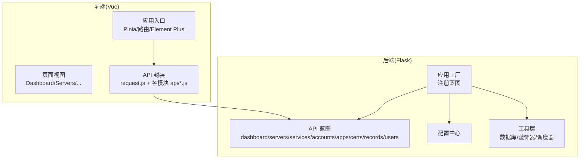

图表来源
- [backend/app/__init__.py:1-53](file://backend/app/__init__.py#L1-L53)
- [backend/app/config.py:1-21](file://backend/app/config.py#L1-L21)
- [backend/app/utils/db.py:1-17](file://backend/app/utils/db.py#L1-L17)
- [backend/app/utils/decorators.py:1-95](file://backend/app/utils/decorators.py#L1-L95)
- [frontend/src/main.js:1-23](file://frontend/src/main.js#L1-L23)

章节来源
- [backend/app/__init__.py:1-53](file://backend/app/__init__.py#L1-L53)
- [backend/app/config.py:1-21](file://backend/app/config.py#L1-L21)
- [frontend/src/main.js:1-23](file://frontend/src/main.js#L1-L23)

## 核心组件
- 应用工厂与蓝图注册
  - 在应用工厂中集中注册 dashboard、servers、services、accounts、apps、certs、records、users 等蓝图，确保路由前缀与命名空间清晰。
- 配置中心
  - 统一管理数据库连接参数、JWT 密钥、调试模式、主机与端口、上传目录与最大文件大小等。
- 数据库工具
  - 提供统一的数据库连接获取方法，使用 DictCursor 以字典形式返回查询结果。
- 权限装饰器
  - JWT 认证装饰器从 Authorization 头提取 Bearer Token 并校验有效性，将用户信息注入 g。
  - 角色权限装饰器在 JWT 校验后检查用户角色是否满足要求。
- 前端应用入口
  - 初始化 Pinia 状态管理、路由、Element Plus 国际化与图标，挂载应用实例。

章节来源
- [backend/app/__init__.py:28-53](file://backend/app/__init__.py#L28-L53)
- [backend/app/config.py:4-21](file://backend/app/config.py#L4-L21)
- [backend/app/utils/db.py:5-17](file://backend/app/utils/db.py#L5-L17)
- [backend/app/utils/decorators.py:9-95](file://backend/app/utils/decorators.py#L9-L95)
- [frontend/src/main.js:10-23](file://frontend/src/main.js#L10-L23)

## 架构总览
后端通过蓝图组织 API，统一使用 JWT 认证与角色权限控制；前端通过统一的请求封装调用后端接口，页面组件负责展示与交互。模块间通过 API 进行解耦，数据流以 JSON 形式在前后端传递。

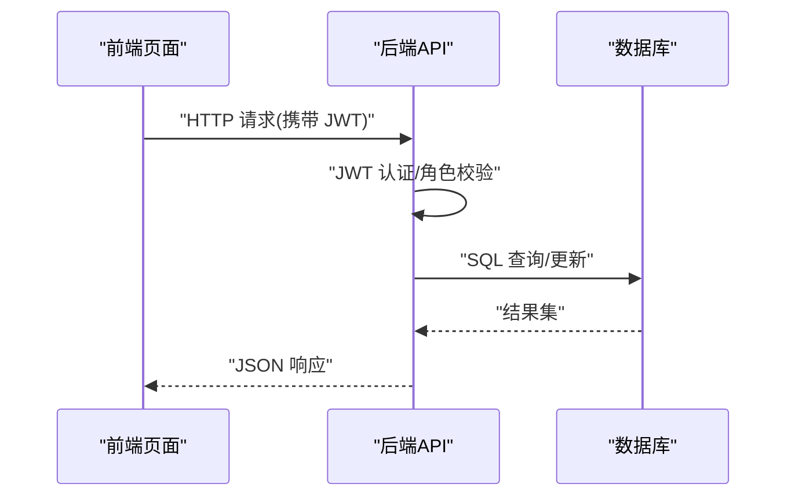

图表来源
- [backend/app/utils/decorators.py:9-95](file://backend/app/utils/decorators.py#L9-L95)
- [backend/app/utils/db.py:5-17](file://backend/app/utils/db.py#L5-L17)

## 详细组件分析

### 仪表盘统计模块
- 功能概述
  - 提供平台核心数据概览：服务器、服务、Web 账户、应用系统、域名证书、变更记录的数量统计。
  - 按环境类型统计服务器分布。
  - 展示最近更新记录与最近使用的域名证书。
- 用户界面
  - 登录后进入仪表盘页面，自动加载统计数据并渲染卡片与列表。
- 业务逻辑
  - 统计各表数量与环境分布。
  - 查询最近更新记录与“使用中”域名证书。
  - 对日期字段进行序列化处理，保证前端正确展示。
- 数据处理流程
  - 读取数据库连接 → 执行多条统计 SQL → 组装响应数据 → 返回 JSON。

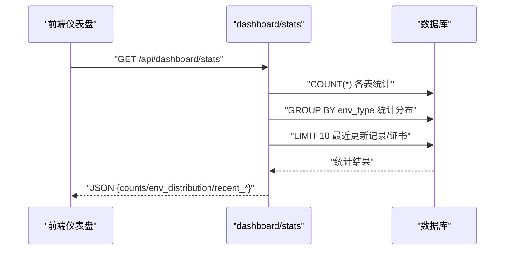

图表来源
- [backend/app/api/dashboard.py:20-86](file://backend/app/api/dashboard.py#L20-L86)

章节来源
- [backend/app/api/dashboard.py:12-86](file://backend/app/api/dashboard.py#L12-L86)
- [frontend/src/views/Dashboard.vue](file://frontend/src/views/Dashboard.vue)

### 服务器管理模块
- 功能概述
  - 支持查询、新增、修改、删除服务器，以及按环境类型与关键字搜索。
  - 提供服务器详情页，展示关联的服务列表。
- 用户界面
  - 列表页：分页/筛选/搜索；详情页：展示服务器信息与服务列表。
- 业务逻辑
  - 查询支持 env_type 与 hostname/inner_ip/platform 组合过滤。
  - 新增/更新/删除均受角色权限控制。
  - 详情页联表查询关联服务，按分类与服务名排序。
- 数据处理流程
  - 参数校验 → 组装 SQL 与参数 → 执行 CRUD → 提交事务 → 返回结果。

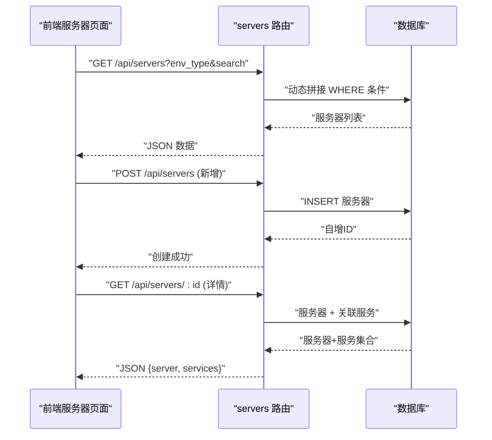

图表来源
- [backend/app/api/servers.py:11-203](file://backend/app/api/servers.py#L11-L203)

章节来源
- [backend/app/api/servers.py:11-203](file://backend/app/api/servers.py#L11-L203)
- [frontend/src/views/Servers.vue](file://frontend/src/views/Servers.vue)
- [frontend/src/views/ServerDetail.vue](file://frontend/src/views/ServerDetail.vue)

### 服务管理模块
- 功能概述
  - 支持查询、新增、修改、删除服务，按分类与关键字搜索。
  - 服务与服务器通过 server_id 关联。
- 用户界面
  - 列表页：按环境/内网 IP/分类/服务名排序；详情页展示服务器信息。
- 业务逻辑
  - 查询支持 category 与 service_name/version 组合过滤。
  - 新增/更新/删除受角色权限控制。
- 数据处理流程
  - 参数校验 → 组装 SQL 与参数 → 执行 CRUD → 提交事务 → 返回结果。

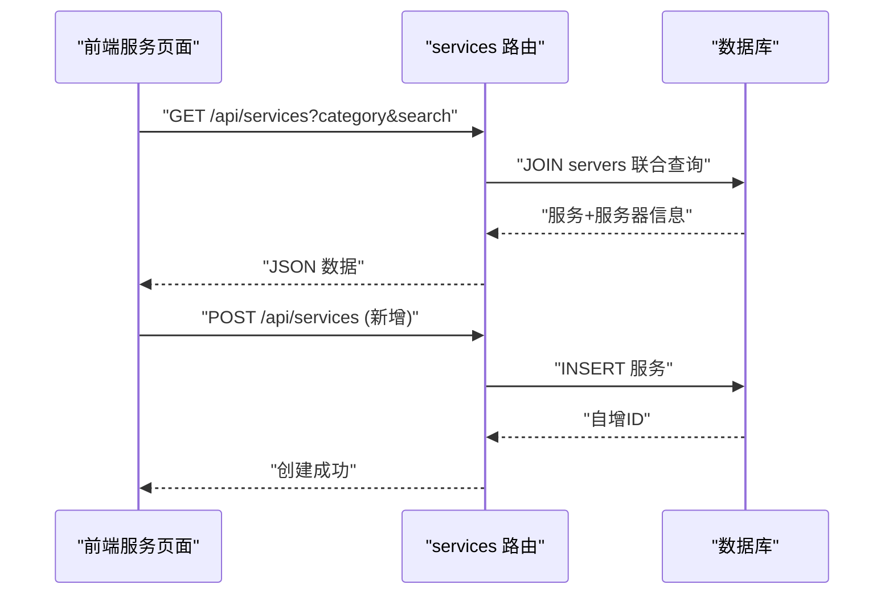

图表来源
- [backend/app/api/services.py:11-144](file://backend/app/api/services.py#L11-L144)

章节来源
- [backend/app/api/services.py:11-144](file://backend/app/api/services.py#L11-L144)
- [frontend/src/views/Services.vue](file://frontend/src/views/Services.vue)

### Web账户管理模块
- 功能概述
  - 支持查询、新增、修改、删除 Web 账户，按组名与关键字搜索。
- 用户界面
  - 列表页：按组名与名称排序；编辑时可查看/修改账号与密码字段。
- 业务逻辑
  - 查询支持 group_name 与 name/url/username 组合过滤。
  - 新增/更新/删除受角色权限控制。
- 数据处理流程
  - 参数校验 → 组装 SQL 与参数 → 执行 CRUD → 提交事务 → 返回结果。

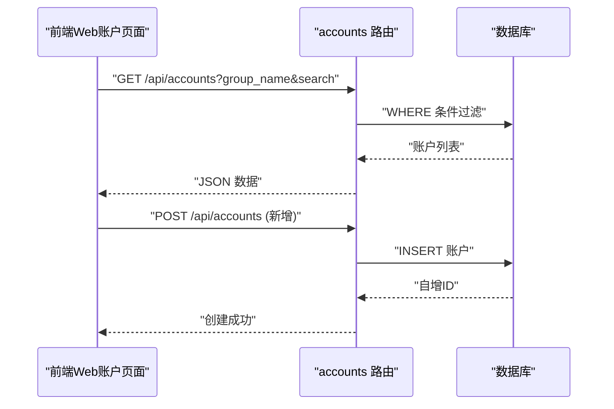

图表来源
- [backend/app/api/accounts.py:11-141](file://backend/app/api/accounts.py#L11-L141)

章节来源
- [backend/app/api/accounts.py:11-141](file://backend/app/api/accounts.py#L11-L141)
- [frontend/src/views/Accounts.vue](file://frontend/src/views/Accounts.vue)

### 应用系统管理模块
- 功能概述
  - 支持查询、新增、修改、删除应用系统，按关键字搜索。
- 用户界面
  - 列表页：按 ID 排序；详情页展示架构、访问信息、凭证与备注。
- 业务逻辑
  - 查询支持 name/company/access_info 组合过滤。
  - 新增/更新/删除受角色权限控制。
- 数据处理流程
  - 参数校验 → 组装 SQL 与参数 → 执行 CRUD → 提交事务 → 返回结果。

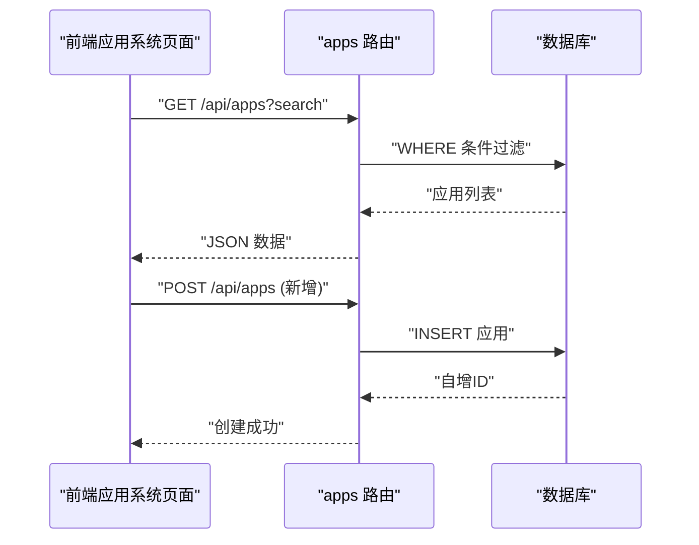

图表来源
- [backend/app/api/apps.py:11-141](file://backend/app/api/apps.py#L11-L141)

章节来源
- [backend/app/api/apps.py:11-141](file://backend/app/api/apps.py#L11-L141)
- [frontend/src/views/Apps.vue](file://frontend/src/views/Apps.vue)

### 域名证书管理模块
- 功能概述
  - 支持查询、新增、修改、删除域名证书，按分类与关键字搜索。
- 用户界面
  - 列表页：按分类与 ID 排序；详情页展示采购/到期时间、剩余天数、品牌与状态。
- 业务逻辑
  - 查询支持 category 与 project/entity 组合过滤。
  - 新增/更新/删除受角色权限控制。
- 数据处理流程
  - 参数校验 → 组装 SQL 与参数 → 执行 CRUD → 提交事务 → 返回结果。

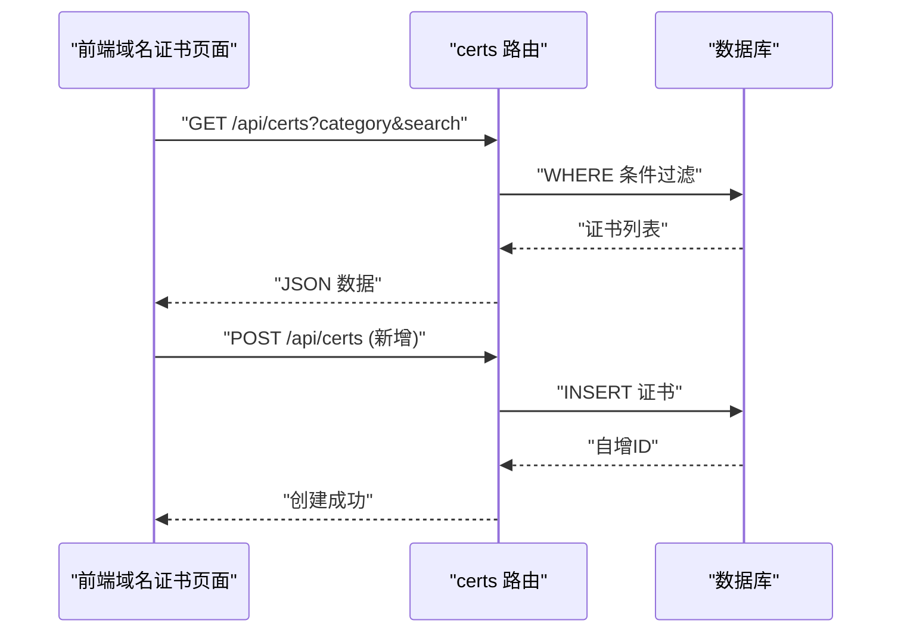

图表来源
- [backend/app/api/certs.py:11-145](file://backend/app/api/certs.py#L11-L145)

章节来源
- [backend/app/api/certs.py:11-145](file://backend/app/api/certs.py#L11-L145)
- [frontend/src/views/Certs.vue](file://frontend/src/views/Certs.vue)

### 更新记录管理模块
- 功能概述
  - 支持查询、新增、删除更新记录，按关键字搜索；按变更日期倒序排列。
- 用户界面
  - 列表页：展示修改人、地点、内容摘要与变更日期；支持删除。
- 业务逻辑
  - 查询支持 modifier/location/content 组合过滤。
  - 新增/删除受角色权限控制。
  - 日期字段在返回前进行序列化处理。
- 数据处理流程
  - 参数校验 → 组装 SQL 与参数 → 执行 CRUD → 提交事务 → 返回结果。

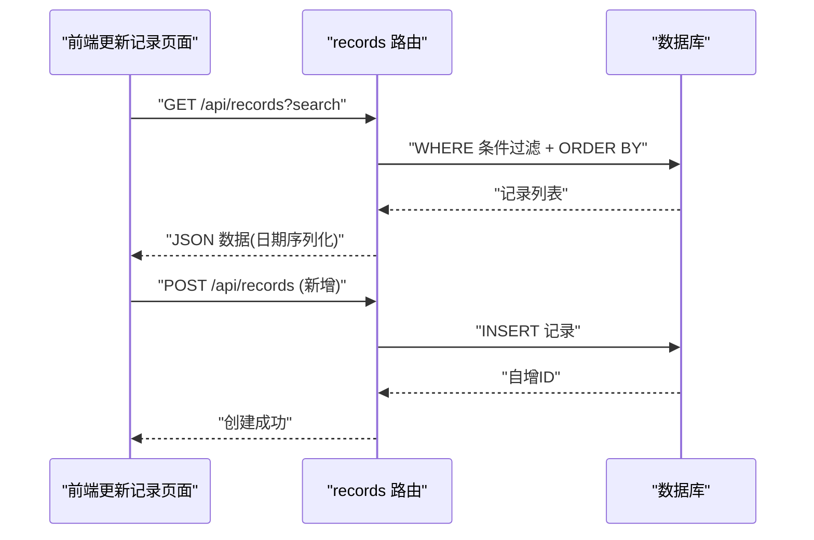

图表来源
- [backend/app/api/records.py:20-114](file://backend/app/api/records.py#L20-L114)

章节来源
- [backend/app/api/records.py:12-114](file://backend/app/api/records.py#L12-L114)
- [frontend/src/views/Records.vue](file://frontend/src/views/Records.vue)

### 用户管理模块
- 功能概述
  - 仅管理员可访问；支持查询、新增、修改、删除用户，以及重置密码。
- 用户界面
  - 列表页：展示用户名、显示名、角色与激活状态；支持编辑与重置密码。
- 业务逻辑
  - 新增：校验必填字段、角色合法性、密码长度；检查用户名唯一性。
  - 修改：校验角色范围；构建更新字段集合。
  - 删除：禁止删除当前登录用户；检查用户存在性。
  - 重置密码：校验新密码长度；更新密码哈希。
- 数据处理流程
  - 参数校验 → 调用模型层执行 CRUD → 返回结果。

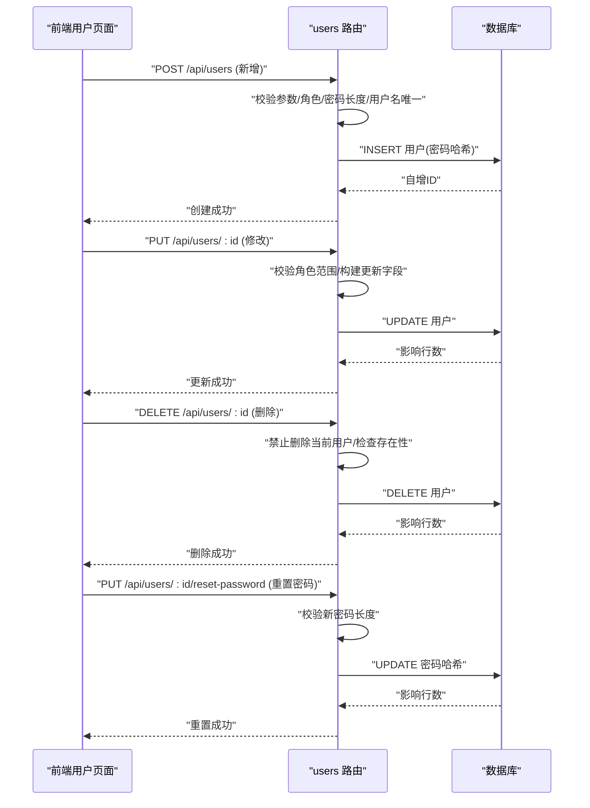

图表来源
- [backend/app/api/users.py:17-268](file://backend/app/api/users.py#L17-L268)

章节来源
- [backend/app/api/users.py:17-268](file://backend/app/api/users.py#L17-L268)
- [frontend/src/views/Users.vue](file://frontend/src/views/Users.vue)

## 依赖分析
- 后端依赖
  - Flask 应用工厂与蓝图注册，集中管理 API 路由。
  - 配置中心集中管理数据库与密钥。
  - 工具层提供数据库连接与权限装饰器。
  - API 蓝图按功能域划分，职责清晰。
- 前端依赖
  - 应用入口统一初始化状态管理、路由与 UI 组件库。
  - 页面组件通过 API 封装调用后端接口。
- 模块耦合
  - 前后端通过 RESTful 接口耦合，数据以 JSON 传输。
  - 权限控制集中在后端装饰器，前端仅负责展示与交互。

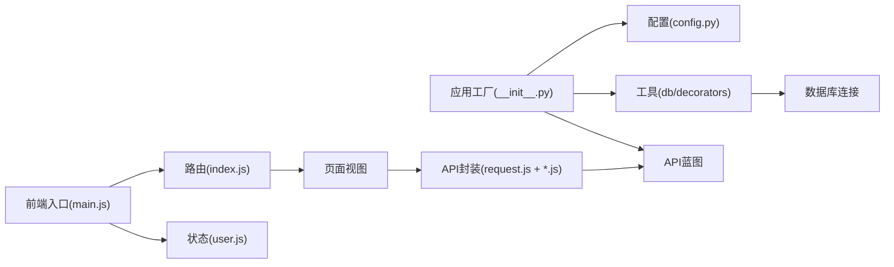

图表来源
- [frontend/src/main.js:1-23](file://frontend/src/main.js#L1-L23)
- [frontend/src/router/index.js](file://frontend/src/router/index.js)
- [frontend/src/stores/user.js](file://frontend/src/stores/user.js)
- [backend/app/__init__.py:28-53](file://backend/app/__init__.py#L28-L53)
- [backend/app/config.py:4-21](file://backend/app/config.py#L4-L21)
- [backend/app/utils/db.py:5-17](file://backend/app/utils/db.py#L5-L17)
- [backend/app/utils/decorators.py:9-95](file://backend/app/utils/decorators.py#L9-L95)

章节来源
- [backend/app/__init__.py:28-53](file://backend/app/__init__.py#L28-L53)
- [frontend/src/main.js:10-23](file://frontend/src/main.js#L10-L23)

## 性能考虑
- 数据库连接
  - 使用统一连接池与 DictCursor，减少重复连接开销；避免在循环中频繁创建连接。
- 查询优化
  - 对高频查询建立必要索引（如服务器 env_type、服务 server_id、Web 账户 group_name 等）。
  - 控制返回字段数量，避免 SELECT *。
- 前端缓存
  - 对静态列表数据进行本地缓存，减少重复请求。
- 分页与分批
  - 大列表采用分页或虚拟滚动，降低一次性渲染压力。
- 安全与鉴权
  - JWT 令牌有效期合理设置；对敏感字段（密码）仅在必要时传输与更新。

## 故障排查指南
- 认证失败
  - 确认请求头包含有效的 Bearer 令牌；检查令牌是否过期。
- 权限不足
  - 确认用户角色满足接口所需角色；检查装饰器顺序（JWT 必须在角色校验之前）。
- 数据库连接异常
  - 检查数据库主机、端口、用户名与密码配置；确认网络连通性。
- 参数校验错误
  - 新增/更新接口需满足字段完整性与格式要求；关注必填字段与长度限制。
- 事务回滚
  - 发生异常时数据库会自动回滚；检查日志定位具体错误点。

章节来源
- [backend/app/utils/decorators.py:22-56](file://backend/app/utils/decorators.py#L22-L56)
- [backend/app/utils/decorators.py:75-90](file://backend/app/utils/decorators.py#L75-L90)
- [backend/app/utils/db.py:8-16](file://backend/app/utils/db.py#L8-L16)
- [backend/app/api/users.py:56-96](file://backend/app/api/users.py#L56-L96)

## 结论
该云运维平台通过清晰的模块划分与统一的权限控制，实现了仪表盘、服务器、服务、Web 账户、应用系统、域名证书、更新记录与用户管理等核心功能。前后端分离架构提升了可维护性与扩展性，配合统一的请求封装与状态管理，为后续功能扩展与性能优化奠定了良好基础。

## 附录
- 功能扩展指南
  - 新增模块：在后端新增蓝图并在应用工厂中注册；在前端新增页面与 API 封装；完善路由与权限配置。
  - 自定义配置：通过配置中心集中管理数据库、密钥与行为参数；避免硬编码。
  - 安全加固：启用 HTTPS、限制请求频率、对敏感字段加密存储、定期轮换密钥。
- 使用示例
  - 登录后访问仪表盘，查看服务器与证书统计；在服务器列表中筛选目标服务器并查看详情；在服务列表中新增服务并绑定到指定服务器；在用户管理中为团队成员分配角色与重置密码。