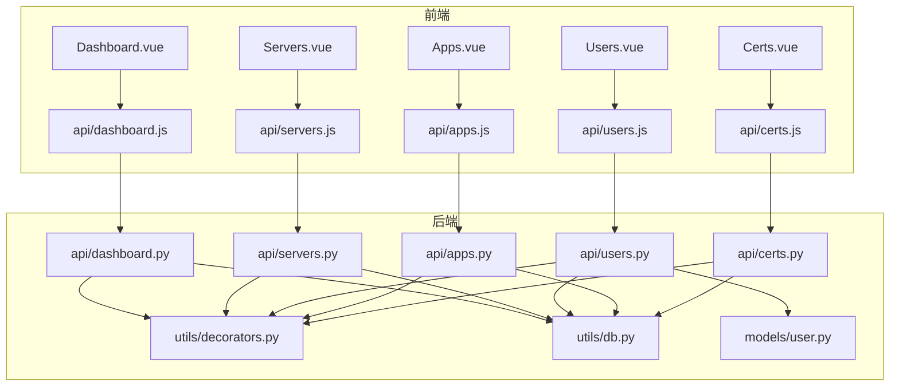
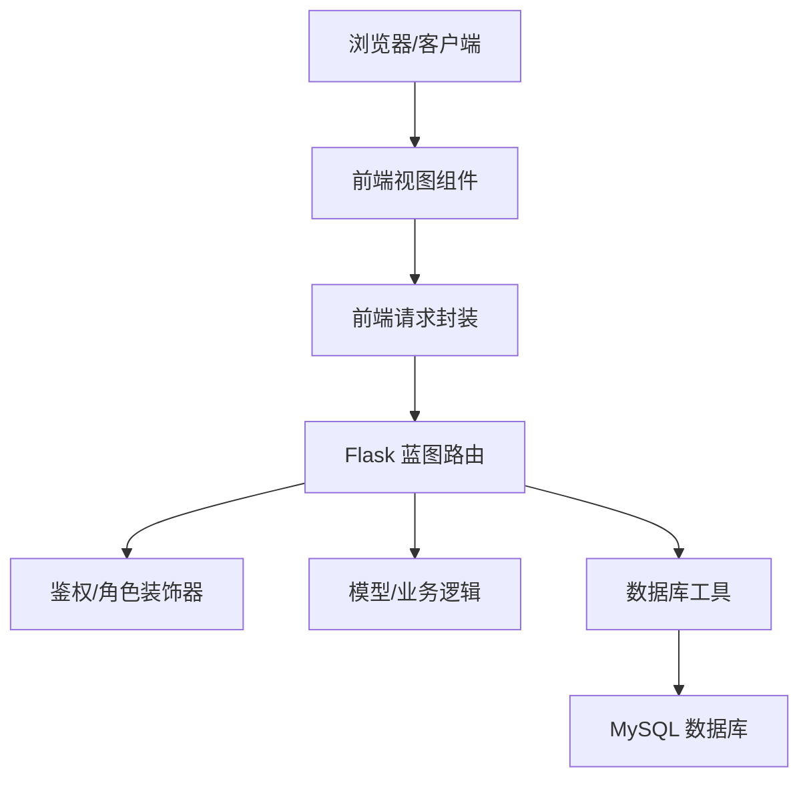
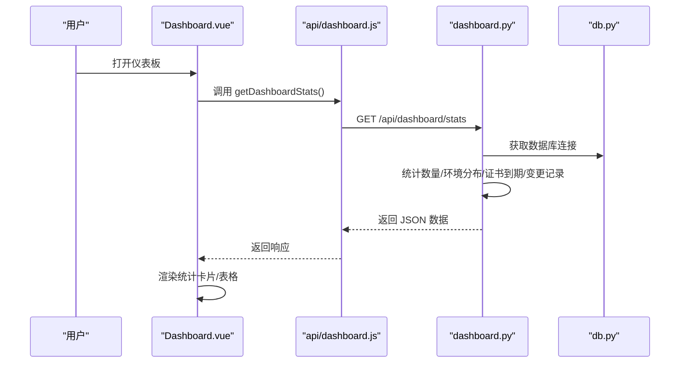
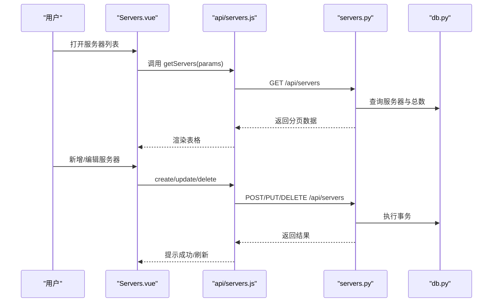
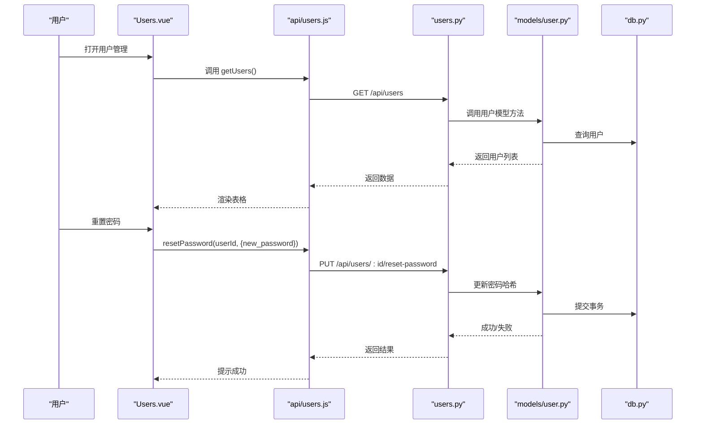
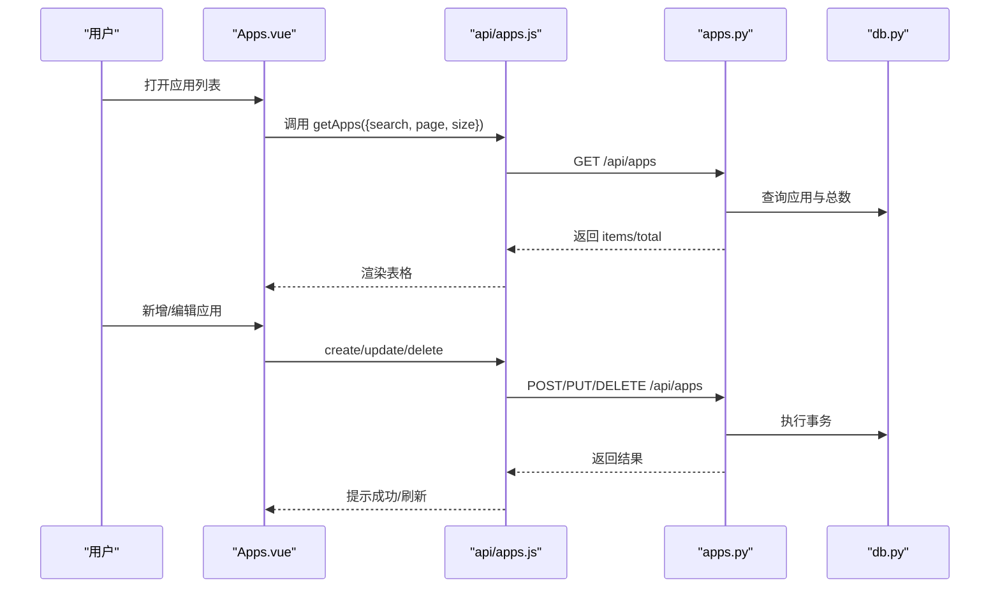
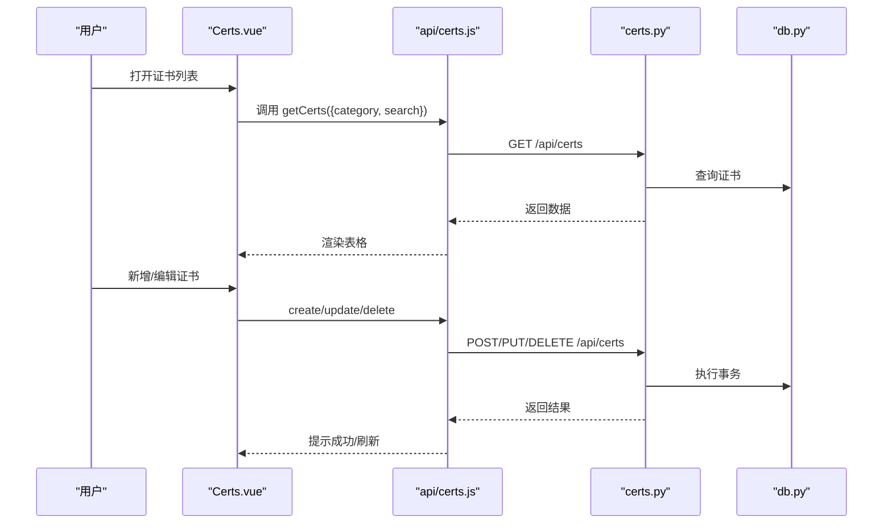
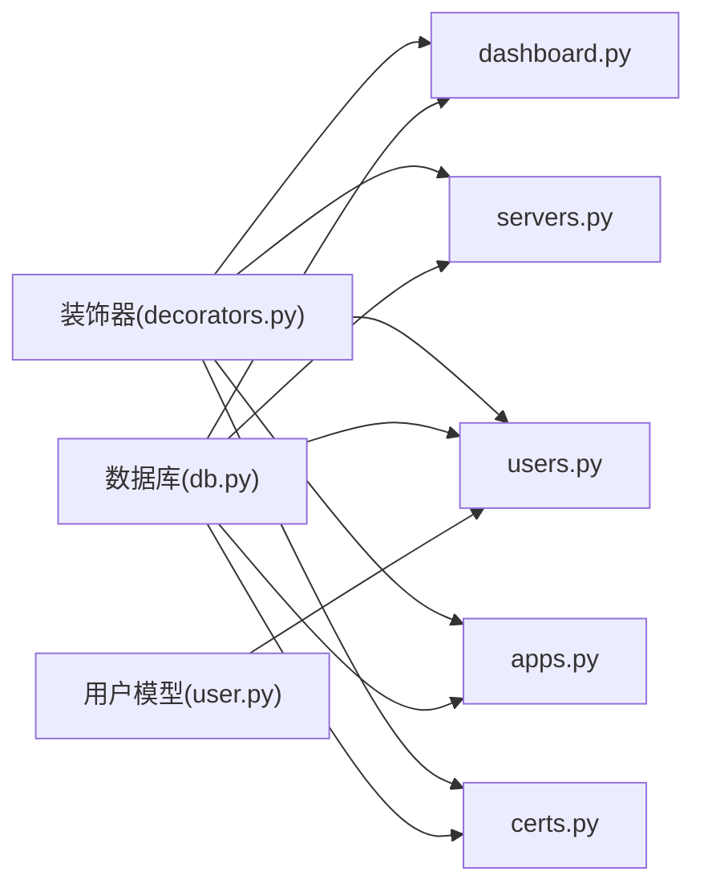

# 核心功能模块

<cite>
**本文引用的文件**
- [backend/app/api/dashboard.py](file://backend/app/api/dashboard.py)
- [backend/app/api/servers.py](file://backend/app/api/servers.py)
- [backend/app/api/users.py](file://backend/app/api/users.py)
- [backend/app/api/apps.py](file://backend/app/api/apps.py)
- [backend/app/api/certs.py](file://backend/app/api/certs.py)
- [backend/app/utils/decorators.py](file://backend/app/utils/decorators.py)
- [backend/app/utils/db.py](file://backend/app/utils/db.py)
- [backend/app/models/user.py](file://backend/app/models/user.py)
- [frontend/src/views/Dashboard.vue](file://frontend/src/views/Dashboard.vue)
- [frontend/src/views/Servers.vue](file://frontend/src/views/Servers.vue)
- [frontend/src/views/Users.vue](file://frontend/src/views/Users.vue)
- [frontend/src/views/Apps.vue](file://frontend/src/views/Apps.vue)
- [frontend/src/views/Certs.vue](file://frontend/src/views/Certs.vue)
- [frontend/src/api/dashboard.js](file://frontend/src/api/dashboard.js)
- [frontend/src/api/servers.js](file://frontend/src/api/servers.js)
- [frontend/src/api/users.js](file://frontend/src/api/users.js)
- [frontend/src/api/apps.js](file://frontend/src/api/apps.js)
- [frontend/src/api/certs.js](file://frontend/src/api/certs.js)
</cite>

## 目录
1. [简介](#简介)
2. [项目结构](#项目结构)
3. [核心组件](#核心组件)
4. [架构总览](#架构总览)
5. [详细组件分析](#详细组件分析)
6. [依赖分析](#依赖分析)
7. [性能考虑](#性能考虑)
8. [故障排查指南](#故障排查指南)
9. [结论](#结论)
10. [附录](#附录)

## 简介
本文件面向云运维平台的核心功能模块，围绕以下主题提供系统化文档：
- 仪表板统计：数据可视化与到期提醒
- 服务器管理：CRUD 操作与状态监控入口
- 用户管理：角色权限控制与安全策略
- 应用系统：部署管理与访问控制
- 证书管理：到期提醒与状态跟踪

文档从架构、组件、数据流、交互流程、错误处理与性能优化等维度进行深入解析，并给出使用指南、最佳实践与常见问题解答。

## 项目结构
后端采用 Flask 蓝图组织 API，前端基于 Vue3 + Element Plus 构建页面与交互。API 层通过装饰器实现鉴权与角色校验，视图层通过统一的请求封装调用后端接口。

图表来源
- [frontend/src/views/Dashboard.vue](file://frontend/src/views/Dashboard.vue)
- [frontend/src/views/Servers.vue](file://frontend/src/views/Servers.vue)
- [frontend/src/views/Users.vue](file://frontend/src/views/Users.vue)
- [frontend/src/views/Apps.vue](file://frontend/src/views/Apps.vue)
- [frontend/src/views/Certs.vue](file://frontend/src/views/Certs.vue)
- [frontend/src/api/dashboard.js](file://frontend/src/api/dashboard.js)
- [frontend/src/api/servers.js](file://frontend/src/api/servers.js)
- [frontend/src/api/users.js](file://frontend/src/api/users.js)
- [frontend/src/api/apps.js](file://frontend/src/api/apps.js)
- [frontend/src/api/certs.js](file://frontend/src/api/certs.js)
- [backend/app/api/dashboard.py](file://backend/app/api/dashboard.py)
- [backend/app/api/servers.py](file://backend/app/api/servers.py)
- [backend/app/api/users.py](file://backend/app/api/users.py)
- [backend/app/api/apps.py](file://backend/app/api/apps.py)
- [backend/app/api/certs.py](file://backend/app/api/certs.py)
- [backend/app/utils/decorators.py](file://backend/app/utils/decorators.py)
- [backend/app/utils/db.py](file://backend/app/utils/db.py)
- [backend/app/models/user.py](file://backend/app/models/user.py)

章节来源
- [backend/app/api/dashboard.py](file://backend/app/api/dashboard.py)
- [backend/app/api/servers.py](file://backend/app/api/servers.py)
- [backend/app/api/users.py](file://backend/app/api/users.py)
- [backend/app/api/apps.py](file://backend/app/api/apps.py)
- [backend/app/api/certs.py](file://backend/app/api/certs.py)
- [frontend/src/views/Dashboard.vue](file://frontend/src/views/Dashboard.vue)
- [frontend/src/views/Servers.vue](file://frontend/src/views/Servers.vue)
- [frontend/src/views/Users.vue](file://frontend/src/views/Users.vue)
- [frontend/src/views/Apps.vue](file://frontend/src/views/Apps.vue)
- [frontend/src/views/Certs.vue](file://frontend/src/views/Certs.vue)

## 核心组件
- 仪表板统计：聚合服务器、服务、应用、证书、变更记录数量，展示环境分布与证书到期提醒。
- 服务器管理：支持分页检索、模糊搜索、CRUD 操作；提供详情页关联服务列表。
- 用户管理：管理员可创建/编辑/删除用户，重置密码；限制自我删除与角色篡改。
- 应用系统：应用清单管理，支持访问链接跳转与凭据展示。
- 证书管理：证书生命周期管理，到期天数与状态联动展示。

章节来源
- [backend/app/api/dashboard.py](file://backend/app/api/dashboard.py)
- [backend/app/api/servers.py](file://backend/app/api/servers.py)
- [backend/app/api/users.py](file://backend/app/api/users.py)
- [backend/app/api/apps.py](file://backend/app/api/apps.py)
- [backend/app/api/certs.py](file://backend/app/api/certs.py)
- [frontend/src/views/Dashboard.vue](file://frontend/src/views/Dashboard.vue)
- [frontend/src/views/Servers.vue](file://frontend/src/views/Servers.vue)
- [frontend/src/views/Users.vue](file://frontend/src/views/Users.vue)
- [frontend/src/views/Apps.vue](file://frontend/src/views/Apps.vue)
- [frontend/src/views/Certs.vue](file://frontend/src/views/Certs.vue)

## 架构总览
前后端通过统一的请求适配层对接，后端 API 使用蓝图划分功能域，装饰器负责鉴权与角色校验，数据库连接由工具模块统一封装。

图表来源
- [backend/app/utils/decorators.py](file://backend/app/utils/decorators.py)
- [backend/app/utils/db.py](file://backend/app/utils/db.py)
- [backend/app/api/dashboard.py](file://backend/app/api/dashboard.py)
- [backend/app/api/servers.py](file://backend/app/api/servers.py)
- [backend/app/api/users.py](file://backend/app/api/users.py)
- [backend/app/api/apps.py](file://backend/app/api/apps.py)
- [backend/app/api/certs.py](file://backend/app/api/certs.py)
- [frontend/src/api/dashboard.js](file://frontend/src/api/dashboard.js)
- [frontend/src/api/servers.js](file://frontend/src/api/servers.js)
- [frontend/src/api/users.js](file://frontend/src/api/users.js)
- [frontend/src/api/apps.js](file://frontend/src/api/apps.js)
- [frontend/src/api/certs.js](file://frontend/src/api/certs.js)

## 详细组件分析

### 仪表板统计模块
- 功能要点
  - 统计各实体数量（服务器、服务、应用、证书、变更记录）
  - 环境分布饼状占比（基于环境类型统计）
  - 证书到期提醒（按到期日排序，动态计算剩余天数）
  - 最近变更记录（带序列号过滤）

- 前端展示
  - 统计卡片点击跳转对应列表页
  - 环境分布使用进度条展示占比
  - 证书到期按剩余天数分级标签
  - 变更记录表格展示关键字段

- 关键流程（序列图）

图表来源
- [frontend/src/views/Dashboard.vue](file://frontend/src/views/Dashboard.vue)
- [frontend/src/api/dashboard.js](file://frontend/src/api/dashboard.js)
- [backend/app/api/dashboard.py](file://backend/app/api/dashboard.py)
- [backend/app/utils/db.py](file://backend/app/utils/db.py)

- 复杂度与性能
  - SQL 查询均为简单聚合与有限结果集，复杂度低
  - 建议：对环境分布与证书到期增加索引以提升分组与排序性能

章节来源
- [backend/app/api/dashboard.py](file://backend/app/api/dashboard.py)
- [frontend/src/views/Dashboard.vue](file://frontend/src/views/Dashboard.vue)
- [frontend/src/api/dashboard.js](file://frontend/src/api/dashboard.js)

### 服务器管理模块
- 功能要点
  - 列表：支持环境类型筛选、关键词搜索、分页
  - 详情：返回服务器信息及关联服务列表
  - CRUD：仅管理员与操作员可执行
  - 下拉列表：供其他模块选择服务器

- 前端交互
  - 搜索区支持环境类型与关键词
  - 表格列包含平台、主机名、IP、用途等
  - 弹窗表单覆盖硬件配置与凭据字段
  - 分页组件与批量加载

- 关键流程（序列图）

图表来源
- [frontend/src/views/Servers.vue](file://frontend/src/views/Servers.vue)
- [frontend/src/api/servers.js](file://frontend/src/api/servers.js)
- [backend/app/api/servers.py](file://backend/app/api/servers.py)
- [backend/app/utils/db.py](file://backend/app/utils/db.py)

- 错误处理
  - 未找到服务器时返回 404
  - 数据库异常回滚并返回 500
  - 参数非法时返回 400

章节来源
- [backend/app/api/servers.py](file://backend/app/api/servers.py)
- [frontend/src/views/Servers.vue](file://frontend/src/views/Servers.vue)
- [frontend/src/api/servers.js](file://frontend/src/api/servers.js)

### 用户管理模块
- 功能要点
  - 管理员可查看/创建/更新/删除用户
  - 重置密码（管理员权限）
  - 自身不可删除
  - 角色字段校验与状态开关

- 前端交互
  - 角色标签与状态标签分级展示
  - 当前登录用户不可修改自身角色
  - 重置密码弹窗与表单校验

- 关键流程（序列图）

图表来源
- [frontend/src/views/Users.vue](file://frontend/src/views/Users.vue)
- [frontend/src/api/users.js](file://frontend/src/api/users.js)
- [backend/app/api/users.py](file://backend/app/api/users.py)
- [backend/app/models/user.py](file://backend/app/models/user.py)
- [backend/app/utils/db.py](file://backend/app/utils/db.py)

- 安全策略
  - 密码使用哈希存储
  - 重置密码需管理员权限
  - 自身不可删除与角色篡改

章节来源
- [backend/app/api/users.py](file://backend/app/api/users.py)
- [frontend/src/views/Users.vue](file://frontend/src/views/Users.vue)
- [frontend/src/api/users.js](file://frontend/src/api/users.js)
- [backend/app/models/user.py](file://backend/app/models/user.py)

### 应用系统模块
- 功能要点
  - 列表：支持名称/单位/访问地址模糊搜索
  - 凭据展示：密码字段使用专用组件隐藏显示
  - 访问地址支持 http(s) 链接直链打开

- 前端交互
  - 表格列包含编号、名称、单位、访问地址、用户名、备注
  - 凭据列使用密码遮罩组件
  - 分页与批量加载

- 关键流程（序列图）

图表来源
- [frontend/src/views/Apps.vue](file://frontend/src/views/Apps.vue)
- [frontend/src/api/apps.js](file://frontend/src/api/apps.js)
- [backend/app/api/apps.py](file://backend/app/api/apps.py)
- [backend/app/utils/db.py](file://backend/app/utils/db.py)

章节来源
- [backend/app/api/apps.py](file://backend/app/api/apps.py)
- [frontend/src/views/Apps.vue](file://frontend/src/views/Apps.vue)
- [frontend/src/api/apps.js](file://frontend/src/api/apps.js)

### 证书管理模块
- 功能要点
  - 列表：支持分类筛选与关键词搜索
  - 证书状态与到期天数联动展示
  - 日期字段统一格式化

- 前端交互
  - 分类标签与状态标签分级展示
  - 到期天数按阈值分级
  - 日期选择器与数值输入

- 关键流程（序列图）

图表来源
- [frontend/src/views/Certs.vue](file://frontend/src/views/Certs.vue)
- [frontend/src/api/certs.js](file://frontend/src/api/certs.js)
- [backend/app/api/certs.py](file://backend/app/api/certs.py)
- [backend/app/utils/db.py](file://backend/app/utils/db.py)

章节来源
- [backend/app/api/certs.py](file://backend/app/api/certs.py)
- [frontend/src/views/Certs.vue](file://frontend/src/views/Certs.vue)
- [frontend/src/api/certs.js](file://frontend/src/api/certs.js)

## 依赖分析
- 组件耦合
  - API 层与视图层通过请求封装解耦
  - 蓝图内部职责清晰，跨模块依赖较少
- 外部依赖
  - Flask 蓝图、Element Plus UI、Vue3 生态
  - MySQL 数据库与连接池工具
- 装饰器与模型
  - 鉴权与角色装饰器集中管理
  - 用户模型封装数据库操作

图表来源
- [backend/app/utils/decorators.py](file://backend/app/utils/decorators.py)
- [backend/app/utils/db.py](file://backend/app/utils/db.py)
- [backend/app/models/user.py](file://backend/app/models/user.py)
- [backend/app/api/dashboard.py](file://backend/app/api/dashboard.py)
- [backend/app/api/servers.py](file://backend/app/api/servers.py)
- [backend/app/api/users.py](file://backend/app/api/users.py)
- [backend/app/api/apps.py](file://backend/app/api/apps.py)
- [backend/app/api/certs.py](file://backend/app/api/certs.py)

章节来源
- [backend/app/utils/decorators.py](file://backend/app/utils/decorators.py)
- [backend/app/utils/db.py](file://backend/app/utils/db.py)
- [backend/app/models/user.py](file://backend/app/models/user.py)
- [backend/app/api/dashboard.py](file://backend/app/api/dashboard.py)
- [backend/app/api/servers.py](file://backend/app/api/servers.py)
- [backend/app/api/users.py](file://backend/app/api/users.py)
- [backend/app/api/apps.py](file://backend/app/api/apps.py)
- [backend/app/api/certs.py](file://backend/app/api/certs.py)

## 性能考虑
- 查询优化
  - 对常用筛选字段（环境类型、搜索词）建立索引
  - 限制分页最大条数，避免超大结果集
- 缓存策略
  - 仪表板高频统计可引入短期缓存（如 5 分钟）
- 连接管理
  - 统一数据库连接与关闭，避免连接泄漏
- 前端渲染
  - 大表格使用虚拟滚动与懒加载
  - 图标与样式尽量复用，减少重复渲染

## 故障排查指南
- 仪表板无数据
  - 检查数据库连接与表是否存在
  - 查看装饰器是否正确注入用户上下文
- 服务器 CRUD 失败
  - 检查角色权限与 JWT 有效性
  - 关注数据库异常回滚日志
- 用户管理报错
  - 确认管理员身份与当前用户非自身
  - 校验密码长度与角色枚举
- 应用/证书列表为空
  - 检查搜索参数与分页参数
  - 确认字段命名与后端一致

章节来源
- [backend/app/api/dashboard.py](file://backend/app/api/dashboard.py)
- [backend/app/api/servers.py](file://backend/app/api/servers.py)
- [backend/app/api/users.py](file://backend/app/api/users.py)
- [backend/app/api/apps.py](file://backend/app/api/apps.py)
- [backend/app/api/certs.py](file://backend/app/api/certs.py)

## 结论
该核心功能模块在前后端分离架构下实现了清晰的职责划分与良好的扩展性。通过统一的鉴权与角色装饰器、规范的 CRUD 接口与直观的前端交互，平台能够稳定支撑运维日常管理工作。建议持续完善索引与缓存策略，强化异常监控与日志审计，确保系统在高并发场景下的可靠性与可观测性。

## 附录
- 使用指南
  - 登录后首先进入仪表板概览，快速了解资产规模与风险点
  - 在服务器/应用/证书页面进行日常维护与巡检
  - 用户管理仅管理员可见，注意最小权限原则
- 最佳实践
  - 严格区分管理员、操作员与只读用户三类角色
  - 对敏感凭据进行最小暴露与定期轮换
  - 建立定期巡检机制，关注即将到期的证书与异常变更
- 常见问题
  - 无法删除当前用户：系统限制自我删除
  - 重置密码失败：确认新密码长度与用户存在性
  - 服务器详情为空：确认服务器 ID 正确与关联服务存在