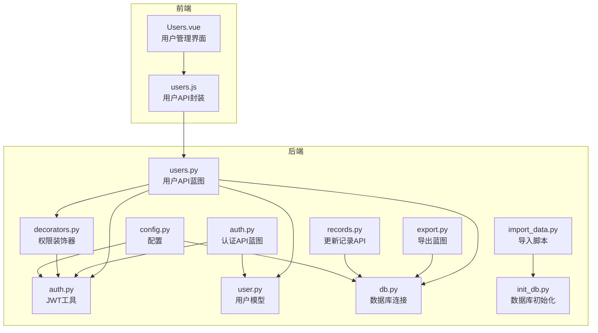
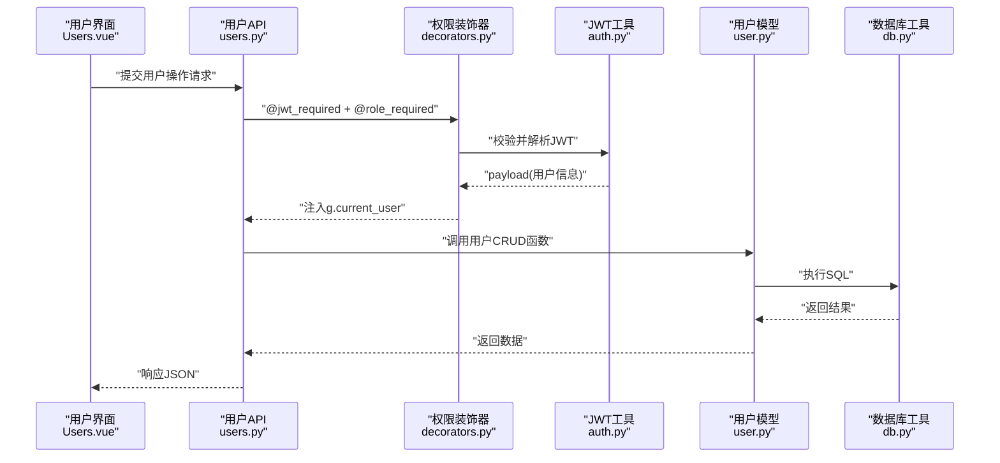
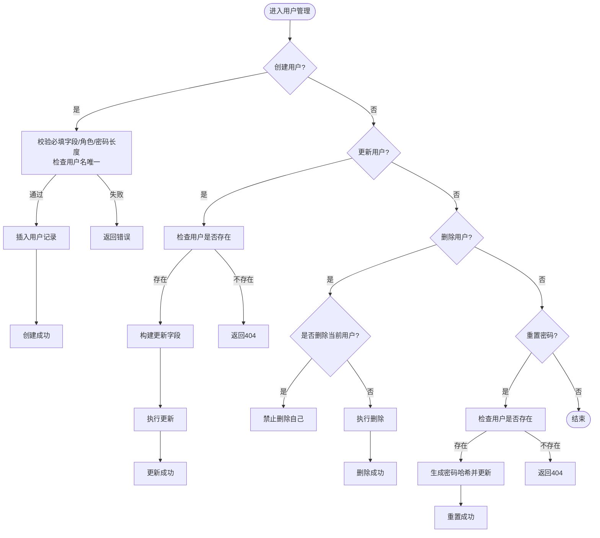
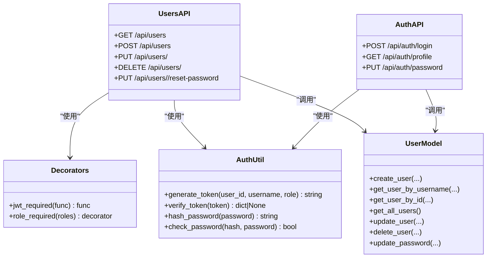
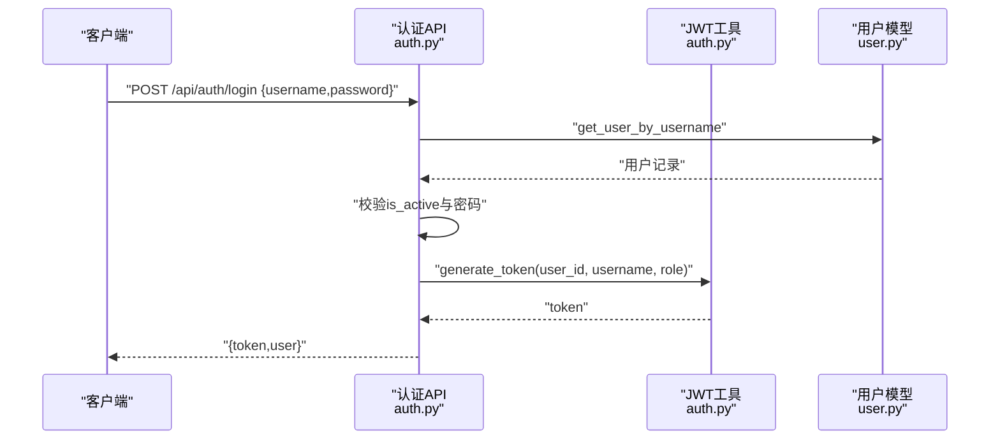
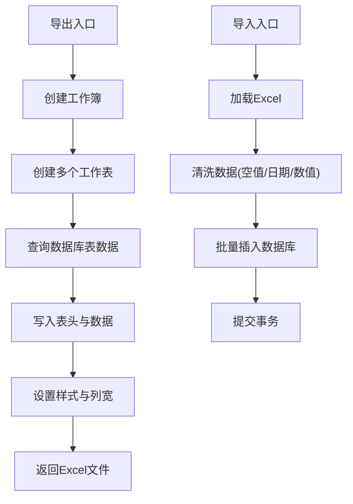
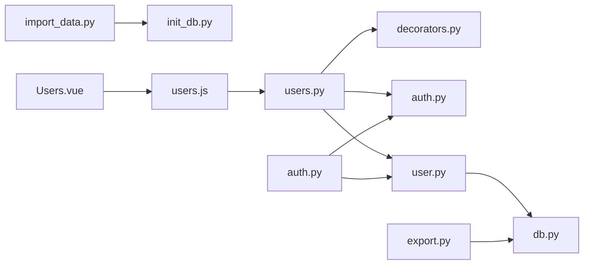

# 用户管理模块

<cite>
**本文引用的文件**
- [backend/app/api/users.py](file://backend/app/api/users.py)
- [backend/app/models/user.py](file://backend/app/models/user.py)
- [backend/app/utils/auth.py](file://backend/app/utils/auth.py)
- [backend/app/utils/decorators.py](file://backend/app/utils/decorators.py)
- [backend/app/api/auth.py](file://backend/app/api/auth.py)
- [backend/app/utils/db.py](file://backend/app/utils/db.py)
- [backend/app/config.py](file://backend/app/config.py)
- [frontend/src/views/Users.vue](file://frontend/src/views/Users.vue)
- [frontend/src/api/users.js](file://frontend/src/api/users.js)
- [backend/app/api/export.py](file://backend/app/api/export.py)
- [backend/import_data.py](file://backend/import_data.py)
- [backend/app/api/records.py](file://backend/app/api/records.py)
- [backend/init_db.py](file://backend/init_db.py)
</cite>

## 目录
1. [简介](#简介)
2. [项目结构](#项目结构)
3. [核心组件](#核心组件)
4. [架构总览](#架构总览)
5. [详细组件分析](#详细组件分析)
6. [依赖分析](#依赖分析)
7. [性能考虑](#性能考虑)
8. [故障排查指南](#故障排查指南)
9. [结论](#结论)
10. [附录](#附录)

## 简介
本文件面向云运维平台的用户管理模块，聚焦权限控制与用户生命周期管理。内容涵盖：
- 用户信息的 CRUD 实现：注册、信息修改、状态管理、密码重置
- 角色权限体系：角色定义、权限分配、访问控制列表、动态权限验证
- 认证流程：登录验证、密码策略、会话管理、多设备登录控制
- 安全最佳实践：密码强度、账户锁定、审计日志
- 高级能力：用户权限审计、批量导入导出、用户行为监控

## 项目结构
后端采用 Flask 蓝图组织 API，前端基于 Vue 组件化开发，数据库通过独立工具模块连接。

图表来源
- [frontend/src/views/Users.vue:1-297](file://frontend/src/views/Users.vue#L1-L297)
- [frontend/src/api/users.js:1-22](file://frontend/src/api/users.js#L1-L22)
- [backend/app/api/users.py:1-268](file://backend/app/api/users.py#L1-L268)
- [backend/app/api/auth.py:1-184](file://backend/app/api/auth.py#L1-L184)
- [backend/app/utils/decorators.py:1-95](file://backend/app/utils/decorators.py#L1-L95)
- [backend/app/utils/auth.py:1-83](file://backend/app/utils/auth.py#L1-L83)
- [backend/app/models/user.py:1-183](file://backend/app/models/user.py#L1-L183)
- [backend/app/utils/db.py:1-17](file://backend/app/utils/db.py#L1-L17)
- [backend/app/config.py:1-21](file://backend/app/config.py#L1-L21)
- [backend/app/api/export.py:1-263](file://backend/app/api/export.py#L1-L263)
- [backend/import_data.py:1-431](file://backend/import_data.py#L1-L431)
- [backend/app/api/records.py:1-114](file://backend/app/api/records.py#L1-L114)
- [backend/init_db.py:1-263](file://backend/init_db.py#L1-L263)

章节来源
- [backend/app/api/users.py:1-268](file://backend/app/api/users.py#L1-L268)
- [backend/app/models/user.py:1-183](file://backend/app/models/user.py#L1-L183)
- [backend/app/utils/auth.py:1-83](file://backend/app/utils/auth.py#L1-L83)
- [backend/app/utils/decorators.py:1-95](file://backend/app/utils/decorators.py#L1-L95)
- [backend/app/api/auth.py:1-184](file://backend/app/api/auth.py#L1-L184)
- [backend/app/utils/db.py:1-17](file://backend/app/utils/db.py#L1-L17)
- [backend/app/config.py:1-21](file://backend/app/config.py#L1-L21)
- [frontend/src/views/Users.vue:1-297](file://frontend/src/views/Users.vue#L1-L297)
- [frontend/src/api/users.js:1-22](file://frontend/src/api/users.js#L1-L22)
- [backend/app/api/export.py:1-263](file://backend/app/api/export.py#L1-L263)
- [backend/import_data.py:1-431](file://backend/import_data.py#L1-L431)
- [backend/app/api/records.py:1-114](file://backend/app/api/records.py#L1-L114)
- [backend/init_db.py:1-263](file://backend/init_db.py#L1-L263)

## 核心组件
- 用户API蓝图：提供用户列表、创建、更新、删除、重置密码等接口，并统一要求管理员权限
- 认证API蓝图：提供登录、获取当前用户资料、修改密码
- 权限装饰器：JWT 认证与角色校验，确保接口访问受控
- 用户模型：封装数据库层的用户 CRUD 操作
- JWT 工具：签发与验证令牌，密码哈希与校验
- 数据库工具：集中管理数据库连接
- 配置：集中管理密钥、数据库连接参数、JWT 过期时间等
- 前端用户视图：提供用户管理界面，调用用户API完成增删改查与密码重置
- 导出与导入：支持将平台数据导出为Excel，支持从Excel批量导入数据
- 更新记录：提供变更记录的增删查能力，便于审计

章节来源
- [backend/app/api/users.py:17-268](file://backend/app/api/users.py#L17-L268)
- [backend/app/api/auth.py:14-184](file://backend/app/api/auth.py#L14-L184)
- [backend/app/utils/decorators.py:9-95](file://backend/app/utils/decorators.py#L9-L95)
- [backend/app/models/user.py:8-183](file://backend/app/models/user.py#L8-L183)
- [backend/app/utils/auth.py:11-83](file://backend/app/utils/auth.py#L11-L83)
- [backend/app/utils/db.py:5-17](file://backend/app/utils/db.py#L5-L17)
- [backend/app/config.py:4-21](file://backend/app/config.py#L4-L21)
- [frontend/src/views/Users.vue:109-297](file://frontend/src/views/Users.vue#L109-L297)
- [frontend/src/api/users.js:3-22](file://frontend/src/api/users.js#L3-L22)
- [backend/app/api/export.py:64-263](file://backend/app/api/export.py#L64-L263)
- [backend/import_data.py:11-431](file://backend/import_data.py#L11-L431)
- [backend/app/api/records.py:20-114](file://backend/app/api/records.py#L20-L114)
- [backend/init_db.py:33-47](file://backend/init_db.py#L33-L47)

## 架构总览
用户管理模块遵循“前端界面 -> API 蓝图 -> 权限装饰器 -> 模型层 -> 数据库”的分层设计。认证采用 JWT，权限通过角色装饰器控制；前端通过封装的API与后端交互。

图表来源
- [frontend/src/views/Users.vue:164-263](file://frontend/src/views/Users.vue#L164-L263)
- [backend/app/api/users.py:17-268](file://backend/app/api/users.py#L17-L268)
- [backend/app/utils/decorators.py:9-95](file://backend/app/utils/decorators.py#L9-L95)
- [backend/app/utils/auth.py:38-83](file://backend/app/utils/auth.py#L38-L83)
- [backend/app/models/user.py:8-183](file://backend/app/models/user.py#L8-L183)
- [backend/app/utils/db.py:5-17](file://backend/app/utils/db.py#L5-L17)

## 详细组件分析

### 用户CRUD与状态管理
- 注册：仅管理员可创建用户，校验必填字段与角色合法性，密码长度不小于6位，用户名唯一
- 信息修改：支持更新显示名、角色、状态；禁止修改当前登录用户的角色
- 状态管理：支持启用/禁用用户；登录时需检查 is_active
- 删除：禁止删除当前登录用户；删除后不可恢复
- 密码重置：仅管理员可重置指定用户的密码，强制新密码长度≥6位

图表来源
- [backend/app/api/users.py:33-268](file://backend/app/api/users.py#L33-L268)
- [backend/app/models/user.py:8-183](file://backend/app/models/user.py#L8-L183)

章节来源
- [backend/app/api/users.py:17-268](file://backend/app/api/users.py#L17-L268)
- [backend/app/models/user.py:8-183](file://backend/app/models/user.py#L8-L183)

### 角色权限体系与动态权限验证
- 角色定义：admin（管理员）、operator（操作员）、viewer（只读用户）
- 权限分配：通过装饰器 @role_required 控制接口访问；@jwt_required 注入当前用户信息
- 动态权限验证：在接口处理函数中读取 g.current_user 的 role，与允许角色集合比对
- 访问控制列表：各蓝图路由均绑定相应角色白名单，如用户管理仅 admin

图表来源
- [backend/app/utils/decorators.py:9-95](file://backend/app/utils/decorators.py#L9-L95)
- [backend/app/utils/auth.py:11-83](file://backend/app/utils/auth.py#L11-L83)
- [backend/app/api/users.py:17-268](file://backend/app/api/users.py#L17-L268)
- [backend/app/api/auth.py:14-184](file://backend/app/api/auth.py#L14-L184)
- [backend/app/models/user.py:8-183](file://backend/app/models/user.py#L8-L183)

章节来源
- [backend/app/utils/decorators.py:59-95](file://backend/app/utils/decorators.py#L59-L95)
- [backend/app/api/users.py:18-20](file://backend/app/api/users.py#L18-L20)
- [backend/app/api/auth.py:85-116](file://backend/app/api/auth.py#L85-L116)

### 认证流程与会话管理
- 登录：校验用户名、密码与状态，成功后签发含 exp 的JWT
- 会话：前端存储token，后续请求在Header携带 Bearer token
- 过期与失效：服务端按配置的JWT_SECRET_KEY与过期时间验证，过期或无效返回401
- 多设备登录：当前实现未限制同用户多设备登录，建议结合会话管理增强

图表来源
- [backend/app/api/auth.py:14-82](file://backend/app/api/auth.py#L14-L82)
- [backend/app/utils/auth.py:11-35](file://backend/app/utils/auth.py#L11-L35)
- [backend/app/models/user.py:39-58](file://backend/app/models/user.py#L39-L58)

章节来源
- [backend/app/api/auth.py:14-184](file://backend/app/api/auth.py#L14-L184)
- [backend/app/utils/auth.py:38-83](file://backend/app/utils/auth.py#L38-L83)
- [backend/app/config.py:4-7](file://backend/app/config.py#L4-L7)

### 密码策略与安全
- 注册/重置密码：新密码长度不得少于6位
- 登录密码：使用哈希校验，避免明文存储
- 默认管理员：初始化脚本中插入默认管理员账户，建议上线后立即修改密码

章节来源
- [backend/app/api/users.py:70-75](file://backend/app/api/users.py#L70-L75)
- [backend/app/api/users.py:236-240](file://backend/app/api/users.py#L236-L240)
- [backend/app/api/auth.py:145-149](file://backend/app/api/auth.py#L145-L149)
- [backend/init_db.py:228-233](file://backend/init_db.py#L228-L233)

### 批量导入与导出
- 导出：支持将服务器、服务、应用系统、域名证书等数据导出为Excel，包含样式与列宽优化
- 导入：从 info.xlsx 中解析多工作表，清洗数据后批量写入对应表，支持多种日期/数值格式处理

图表来源
- [backend/app/api/export.py:64-263](file://backend/app/api/export.py#L64-L263)
- [backend/import_data.py:11-431](file://backend/import_data.py#L11-L431)

章节来源
- [backend/app/api/export.py:64-263](file://backend/app/api/export.py#L64-L263)
- [backend/import_data.py:11-431](file://backend/import_data.py#L11-L431)

### 用户权限审计与行为监控
- 审计：通过更新记录API维护变更历史，支持查询、创建、删除
- 行为监控：前端界面展示用户状态与创建时间，便于管理员监督

章节来源
- [backend/app/api/records.py:20-114](file://backend/app/api/records.py#L20-L114)
- [frontend/src/views/Users.vue:25-57](file://frontend/src/views/Users.vue#L25-L57)

## 依赖分析
- 组件耦合：用户API依赖权限装饰器与JWT工具；模型层依赖数据库工具；认证API依赖JWT工具与用户模型
- 外部依赖：Flask、PyMySQL、openpyxl、Werkzeug
- 配置集中：JWT密钥、数据库连接参数、JWT过期时间集中于配置文件

图表来源
- [backend/app/api/users.py:1-268](file://backend/app/api/users.py#L1-L268)
- [backend/app/utils/decorators.py:1-95](file://backend/app/utils/decorators.py#L1-L95)
- [backend/app/utils/auth.py:1-83](file://backend/app/utils/auth.py#L1-L83)
- [backend/app/models/user.py:1-183](file://backend/app/models/user.py#L1-L183)
- [backend/app/utils/db.py:1-17](file://backend/app/utils/db.py#L1-L17)
- [backend/app/api/auth.py:1-184](file://backend/app/api/auth.py#L1-L184)
- [backend/app/api/export.py:1-263](file://backend/app/api/export.py#L1-L263)
- [backend/import_data.py:1-431](file://backend/import_data.py#L1-L431)
- [backend/init_db.py:1-263](file://backend/init_db.py#L1-L263)
- [frontend/src/views/Users.vue:1-297](file://frontend/src/views/Users.vue#L1-L297)
- [frontend/src/api/users.js:1-22](file://frontend/src/api/users.js#L1-L22)

章节来源
- [backend/app/config.py:4-21](file://backend/app/config.py#L4-L21)

## 性能考虑
- 数据库索引：用户表对 username 与 role 建有索引，有助于登录与权限查询
- SQL 批量：导入脚本使用批量插入减少往返开销
- 导出优化：使用 openpyxl 写入内存流，避免磁盘I/O
- 建议：对高频查询增加复合索引；对大表分页查询；对导出功能增加异步任务与进度反馈

## 故障排查指南
- 认证失败
  - 缺少或格式错误的 Authorization 头：确认携带 Bearer token
  - Token 过期或无效：重新登录获取新token
- 权限不足
  - 检查当前用户角色是否满足接口要求
- 用户操作异常
  - 用户名冲突：确保用户名唯一
  - 密码长度不足：至少6位
  - 自身删除：禁止删除当前登录用户
- 导入/导出问题
  - Excel格式异常：检查工作表与列顺序
  - 数据库连接失败：核对配置项与网络连通性

章节来源
- [backend/app/utils/decorators.py:20-56](file://backend/app/utils/decorators.py#L20-L56)
- [backend/app/api/users.py:45-96](file://backend/app/api/users.py#L45-L96)
- [backend/app/api/users.py:175-181](file://backend/app/api/users.py#L175-L181)
- [backend/app/api/export.py:258-260](file://backend/app/api/export.py#L258-L260)
- [backend/app/utils/db.py:5-17](file://backend/app/utils/db.py#L5-L17)

## 结论
用户管理模块以JWT与角色装饰器为核心，实现了严格的权限控制与安全的用户生命周期管理。配合导出/导入与更新记录能力，满足日常运维场景下的用户管理与审计需求。建议在生产环境中强化会话管理、引入账户锁定与更细粒度的权限控制，并持续优化数据库索引与查询性能。

## 附录
- 默认管理员账户：admin / admin123（初始化脚本中创建）
- JWT 过期时间：默认24小时（可在配置中调整）

章节来源
- [backend/init_db.py:228-233](file://backend/init_db.py#L228-L233)
- [backend/app/config.py:6](file://backend/app/config.py#L6)