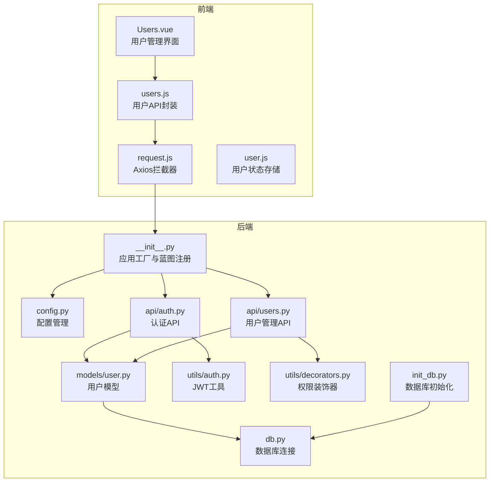
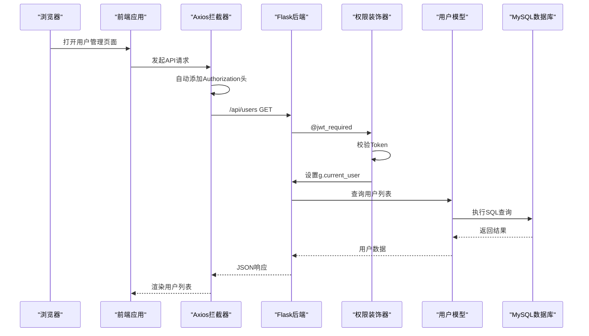
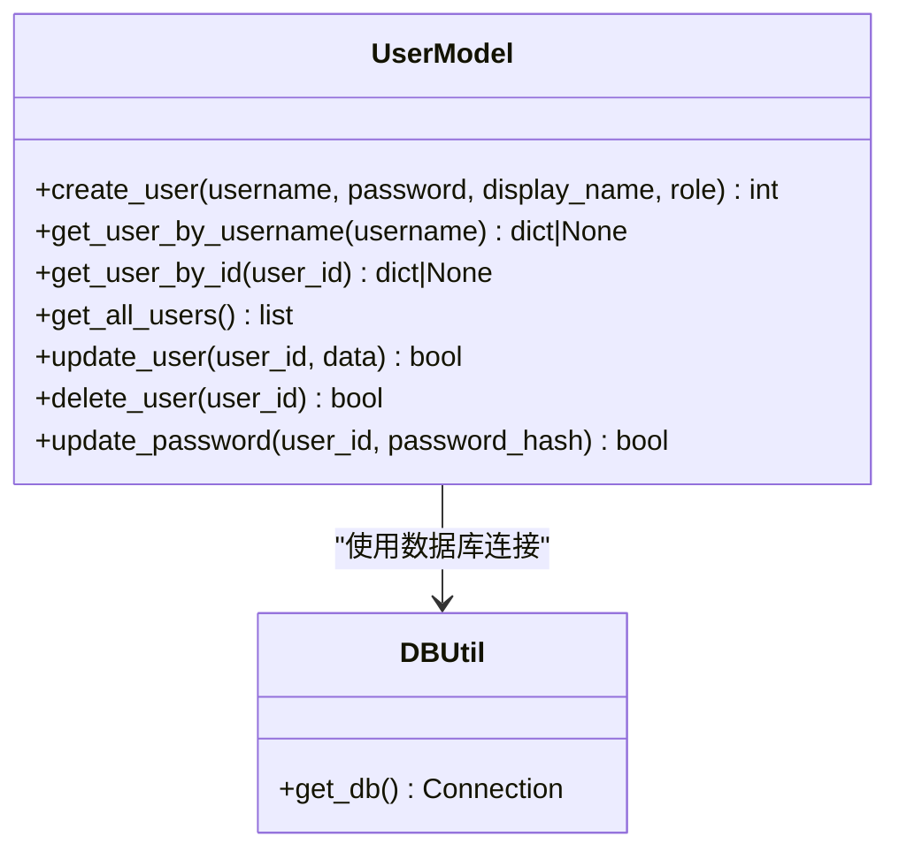
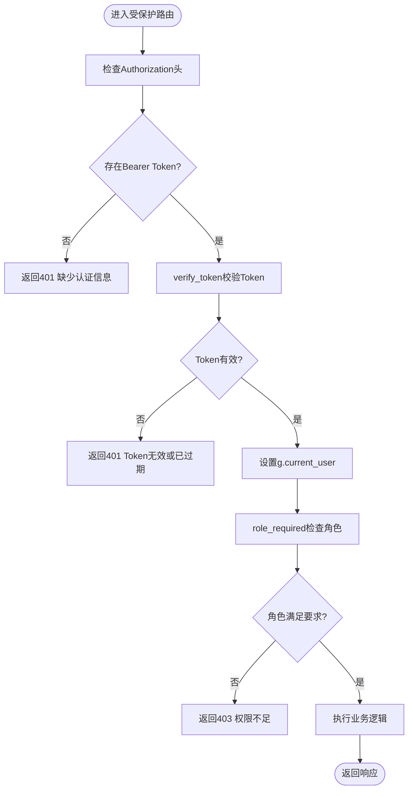
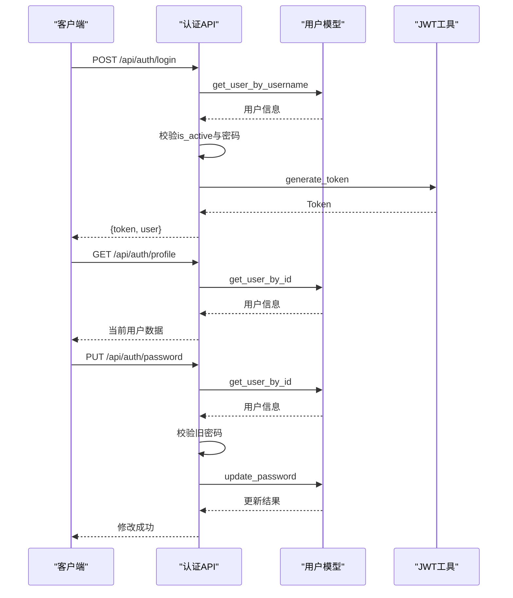
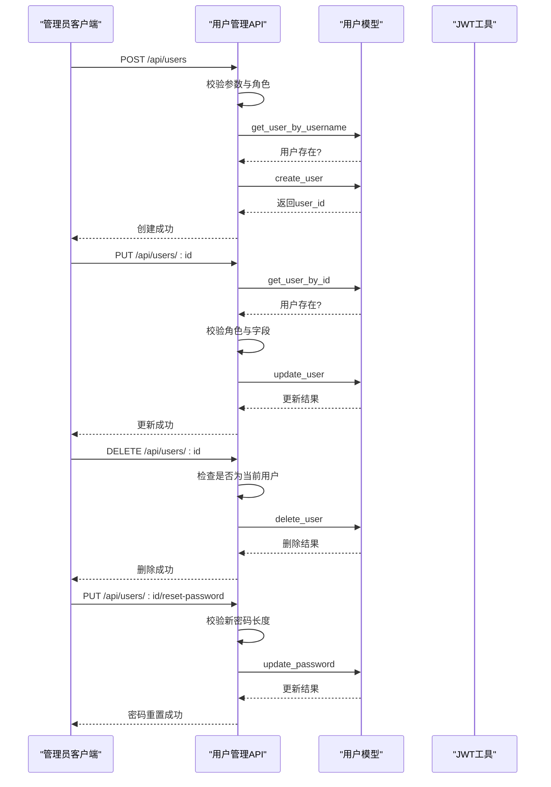
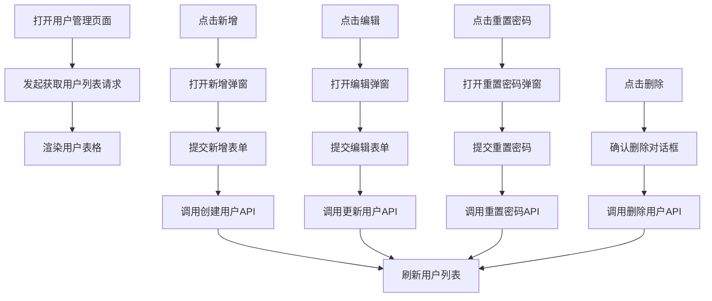
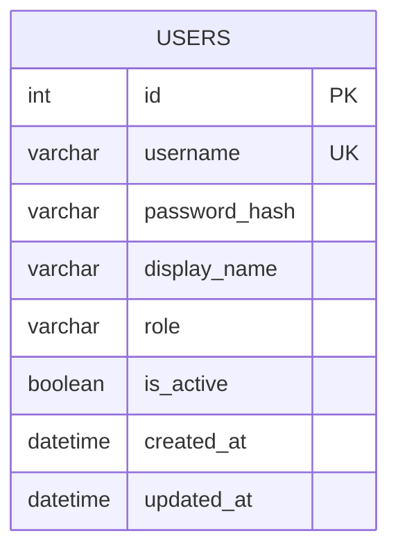
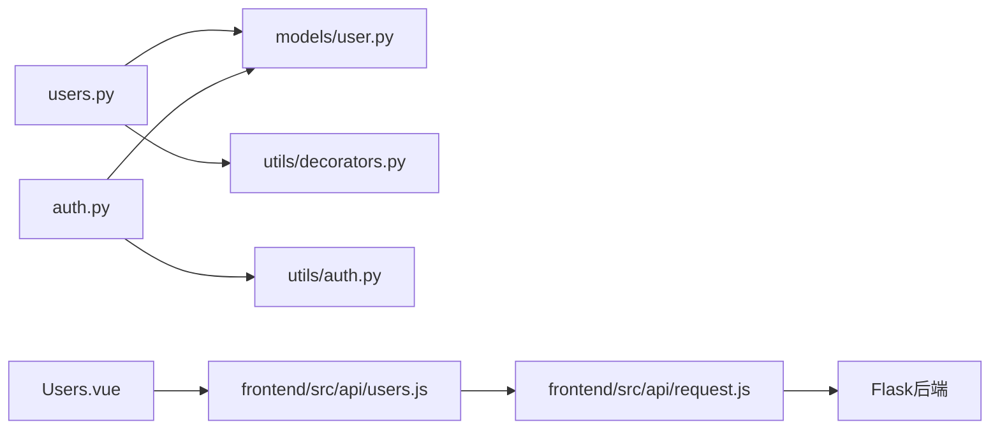

# 用户管理模块

<cite>
**本文档引用的文件**
- [backend/app/models/user.py](file://backend/app/models/user.py)
- [backend/app/api/users.py](file://backend/app/api/users.py)
- [backend/app/api/auth.py](file://backend/app/api/auth.py)
- [backend/app/utils/auth.py](file://backend/app/utils/auth.py)
- [backend/app/utils/decorators.py](file://backend/app/utils/decorators.py)
- [backend/app/utils/db.py](file://backend/app/utils/db.py)
- [backend/app/config.py](file://backend/app/config.py)
- [backend/app/__init__.py](file://backend/app/__init__.py)
- [backend/init_db.py](file://backend/init_db.py)
- [frontend/src/views/Users.vue](file://frontend/src/views/Users.vue)
- [frontend/src/api/users.js](file://frontend/src/api/users.js)
- [frontend/src/api/request.js](file://frontend/src/api/request.js)
- [frontend/src/stores/user.js](file://frontend/src/stores/user.js)
</cite>

## 目录
1. [简介](#简介)
2. [项目结构](#项目结构)
3. [核心组件](#核心组件)
4. [架构总览](#架构总览)
5. [详细组件分析](#详细组件分析)
6. [依赖关系分析](#依赖关系分析)
7. [性能考虑](#性能考虑)
8. [故障排除指南](#故障排除指南)
9. [结论](#结论)
10. [附录](#附录)

## 简介
本文件为用户管理模块的详细技术文档，涵盖用户管理、登录认证与密码管理功能。文档深入说明了用户的角色权限体系、用户信息的增删改查操作、用户状态管理与批量操作能力；解释了基于JWT的登录流程、会话管理与安全防护措施；提供了密码重置、密码强度验证与安全策略配置；包含权限控制、操作日志与审计跟踪建议；并给出最佳实践与安全建议。

## 项目结构
用户管理模块由前后端协同实现：
- 后端采用Flask框架，使用Blueprint组织API，通过装饰器实现JWT认证与角色权限控制，数据库操作封装在模型层。
- 前端采用Vue 3 + Element Plus，通过Axios统一请求，Pinia管理用户状态，提供用户列表、新增/编辑、重置密码、删除等界面交互。

图表来源
- [backend/app/__init__.py:37-62](file://backend/app/__init__.py#L37-L62)
- [backend/app/api/auth.py:14-82](file://backend/app/api/auth.py#L14-L82)
- [backend/app/api/users.py:17-268](file://backend/app/api/users.py#L17-L268)
- [backend/app/models/user.py:8-183](file://backend/app/models/user.py#L8-L183)
- [backend/app/utils/auth.py:11-83](file://backend/app/utils/auth.py#L11-L83)
- [backend/app/utils/decorators.py:9-95](file://backend/app/utils/decorators.py#L9-L95)
- [backend/app/utils/db.py:5-17](file://backend/app/utils/db.py#L5-L17)
- [backend/app/config.py:4-21](file://backend/app/config.py#L4-L21)
- [backend/init_db.py:33-47](file://backend/init_db.py#L33-L47)
- [frontend/src/views/Users.vue:109-297](file://frontend/src/views/Users.vue#L109-L297)
- [frontend/src/api/users.js:3-22](file://frontend/src/api/users.js#L3-L22)
- [frontend/src/api/request.js:13-51](file://frontend/src/api/request.js#L13-L51)
- [frontend/src/stores/user.js:5-41](file://frontend/src/stores/user.js#L5-L41)

章节来源
- [backend/app/__init__.py:37-62](file://backend/app/__init__.py#L37-L62)
- [frontend/src/views/Users.vue:109-297](file://frontend/src/views/Users.vue#L109-L297)

## 核心组件
- 用户模型层：封装用户创建、查询、更新、删除、密码更新等数据库操作，确保密码以哈希形式存储。
- 认证与授权：提供JWT生成与校验、用户登录、个人资料查询、修改密码；通过装饰器实现JWT认证与角色权限控制。
- API层：用户管理API（列表、新增、更新、删除、重置密码）与认证API（登录、获取个人资料、修改密码）。
- 前端界面：用户管理页面、用户API封装、Axios拦截器自动注入JWT、Pinia用户状态管理。
- 数据库：用户表结构定义，包含索引优化与字段约束。

章节来源
- [backend/app/models/user.py:8-183](file://backend/app/models/user.py#L8-L183)
- [backend/app/api/auth.py:14-184](file://backend/app/api/auth.py#L14-L184)
- [backend/app/api/users.py:17-268](file://backend/app/api/users.py#L17-L268)
- [backend/app/utils/auth.py:11-83](file://backend/app/utils/auth.py#L11-L83)
- [backend/app/utils/decorators.py:9-95](file://backend/app/utils/decorators.py#L9-L95)
- [backend/app/utils/db.py:5-17](file://backend/app/utils/db.py#L5-L17)
- [backend/init_db.py:33-47](file://backend/init_db.py#L33-L47)
- [frontend/src/views/Users.vue:109-297](file://frontend/src/views/Users.vue#L109-L297)
- [frontend/src/api/users.js:3-22](file://frontend/src/api/users.js#L3-L22)
- [frontend/src/api/request.js:13-51](file://frontend/src/api/request.js#L13-L51)
- [frontend/src/stores/user.js:5-41](file://frontend/src/stores/user.js#L5-L41)

## 架构总览
用户管理模块采用前后端分离架构，后端提供RESTful API，前端通过Axios统一请求并自动携带JWT Token。权限控制通过装饰器实现，用户状态与会话通过本地存储维护。

图表来源
- [frontend/src/api/request.js:13-23](file://frontend/src/api/request.js#L13-L23)
- [backend/app/utils/decorators.py:9-56](file://backend/app/utils/decorators.py#L9-L56)
- [backend/app/api/users.py:17-31](file://backend/app/api/users.py#L17-L31)
- [backend/app/models/user.py:83-102](file://backend/app/models/user.py#L83-L102)
- [backend/app/utils/db.py:5-17](file://backend/app/utils/db.py#L5-L17)

## 详细组件分析

### 用户模型层（models/user.py）
- 负责用户数据的持久化操作，包括创建、按用户名/ID查询、获取全部用户、更新用户信息、删除用户、更新密码。
- 密码以哈希形式存储，避免明文保存。
- 支持用户状态（is_active）控制，用于启用/禁用用户。

图表来源
- [backend/app/models/user.py:8-183](file://backend/app/models/user.py#L8-L183)
- [backend/app/utils/db.py:5-17](file://backend/app/utils/db.py#L5-L17)

章节来源
- [backend/app/models/user.py:8-183](file://backend/app/models/user.py#L8-L183)

### 认证与授权（utils/auth.py, utils/decorators.py）
- JWT工具：生成与验证JWT Token，设置过期时间与密钥；提供密码哈希与校验。
- 权限装饰器：@jwt_required从Authorization头提取Bearer Token并验证，将用户信息注入flask.g；@role_required检查角色权限。

图表来源
- [backend/app/utils/decorators.py:9-95](file://backend/app/utils/decorators.py#L9-L95)
- [backend/app/utils/auth.py:38-56](file://backend/app/utils/auth.py#L38-L56)

章节来源
- [backend/app/utils/auth.py:11-83](file://backend/app/utils/auth.py#L11-L83)
- [backend/app/utils/decorators.py:9-95](file://backend/app/utils/decorators.py#L9-L95)

### 认证API（api/auth.py）
- 登录：接收用户名/密码，校验用户是否存在且激活，验证密码后生成JWT Token返回。
- 获取个人资料：需要JWT认证，返回当前用户信息。
- 修改密码：需要JWT认证，校验旧密码正确后更新为新密码哈希。

图表来源
- [backend/app/api/auth.py:14-184](file://backend/app/api/auth.py#L14-L184)
- [backend/app/models/user.py:39-58](file://backend/app/models/user.py#L39-L58)
- [backend/app/utils/auth.py:11-35](file://backend/app/utils/auth.py#L11-L35)

章节来源
- [backend/app/api/auth.py:14-184](file://backend/app/api/auth.py#L14-L184)

### 用户管理API（api/users.py）
- 获取用户列表：管理员权限，返回所有用户信息。
- 创建用户：管理员权限，校验必填字段、角色合法性与密码长度，检查用户名唯一性，创建用户并返回ID。
- 更新用户：管理员权限，支持更新显示名、角色、状态，禁止更新当前登录用户的角色。
- 删除用户：管理员权限，禁止删除当前登录用户，返回删除结果。
- 重置密码：管理员权限，校验新密码长度，更新目标用户的密码哈希。

图表来源
- [backend/app/api/users.py:17-268](file://backend/app/api/users.py#L17-L268)
- [backend/app/models/user.py:8-183](file://backend/app/models/user.py#L8-L183)
- [backend/app/utils/auth.py:11-35](file://backend/app/utils/auth.py#L11-L35)

章节来源
- [backend/app/api/users.py:17-268](file://backend/app/api/users.py#L17-L268)

### 前端用户管理界面（Users.vue）
- 提供用户搜索、新增、编辑、重置密码、删除等操作。
- 表单校验：用户名、密码（最少6位）、角色必填；编辑时禁用用户名与当前用户角色修改。
- 弹窗交互：新增/编辑弹窗、重置密码弹窗、删除确认框。
- 与后端API对接：调用users.js封装的API，统一处理响应与错误。

图表来源
- [frontend/src/views/Users.vue:164-263](file://frontend/src/views/Users.vue#L164-L263)
- [frontend/src/api/users.js:3-22](file://frontend/src/api/users.js#L3-L22)

章节来源
- [frontend/src/views/Users.vue:109-297](file://frontend/src/views/Users.vue#L109-L297)
- [frontend/src/api/users.js:3-22](file://frontend/src/api/users.js#L3-L22)

### 数据库设计（init_db.py）
- 用户表包含主键、用户名唯一索引、角色索引、状态字段、时间戳等。
- 初始化脚本负责创建数据库与表结构，确保部署一致性。

图表来源
- [backend/init_db.py:33-47](file://backend/init_db.py#L33-L47)

章节来源
- [backend/init_db.py:33-47](file://backend/init_db.py#L33-L47)

## 依赖关系分析
- 后端应用工厂注册多个蓝图，用户管理与认证API均通过蓝图暴露。
- 用户管理API依赖用户模型与权限装饰器；认证API依赖用户模型与JWT工具。
- 前端通过Axios拦截器统一注入Authorization头，自动处理401错误并跳转登录页。

图表来源
- [backend/app/api/users.py:8-12](file://backend/app/api/users.py#L8-L12)
- [backend/app/api/auth.py:7-9](file://backend/app/api/auth.py#L7-L9)
- [backend/app/utils/decorators.py:6](file://backend/app/utils/decorators.py#L6)
- [backend/app/utils/auth.py:4](file://backend/app/utils/auth.py#L4)
- [frontend/src/api/users.js:1](file://frontend/src/api/users.js#L1)
- [frontend/src/api/request.js:13-23](file://frontend/src/api/request.js#L13-L23)
- [backend/app/__init__.py:37-62](file://backend/app/__init__.py#L37-L62)

章节来源
- [backend/app/__init__.py:37-62](file://backend/app/__init__.py#L37-L62)
- [frontend/src/api/request.js:13-51](file://frontend/src/api/request.js#L13-L51)

## 性能考虑
- 数据库查询：用户表已建立用户名与角色索引，有助于高频查询与过滤。
- 密码哈希：使用Werkzeug的generate_password_hash，保证密码安全性。
- JWT过期：默认24小时过期，可根据业务调整配置项。
- 前端请求：Axios统一拦截器减少重复代码，提升开发效率。

[本节为通用指导，不直接分析具体文件]

## 故障排除指南
- 登录失败：检查用户名/密码是否正确，确认用户状态为启用；查看后端返回的401错误信息。
- Token无效：确认Authorization头格式为Bearer Token，检查JWT密钥与过期时间配置。
- 权限不足：确认当前用户角色是否满足接口所需角色；检查装饰器顺序（先@jwt_required再@role_required）。
- 数据库连接：检查DB_HOST/DB_PORT/DB_USER/DB_PASSWORD/DB_NAME配置是否正确。
- 前端401自动跳转：Axios响应拦截器会在401时清除本地token并跳转登录页，需重新登录。

章节来源
- [backend/app/api/auth.py:40-61](file://backend/app/api/auth.py#L40-L61)
- [backend/app/utils/decorators.py:22-45](file://backend/app/utils/decorators.py#L22-L45)
- [backend/app/config.py:9-13](file://backend/app/config.py#L9-L13)
- [frontend/src/api/request.js:35-50](file://frontend/src/api/request.js#L35-L50)

## 结论
用户管理模块通过清晰的分层设计实现了完整的用户生命周期管理与安全认证。后端提供完善的权限控制与数据校验，前端提供直观的操作界面与一致的交互体验。结合数据库索引与JWT安全机制，系统具备良好的可维护性与安全性。

[本节为总结性内容，不直接分析具体文件]

## 附录

### 角色权限体系
- admin：管理员，拥有最高权限，可进行用户管理与系统配置。
- operator：操作员，可执行日常运维操作。
- viewer：只读用户，仅可查看信息。

章节来源
- [backend/app/api/users.py:64-68](file://backend/app/api/users.py#L64-L68)
- [backend/app/api/users.py:126-130](file://backend/app/api/users.py#L126-L130)

### 安全策略配置
- JWT密钥与过期时间：通过配置类管理，生产环境务必替换默认密钥。
- 密码强度：后端强制密码长度不少于6位，前端亦进行相同校验。
- 用户状态：通过is_active字段实现启用/禁用控制。

章节来源
- [backend/app/config.py:4-7](file://backend/app/config.py#L4-L7)
- [backend/app/api/users.py:70-75](file://backend/app/api/users.py#L70-L75)
- [backend/app/api/auth.py:145-149](file://backend/app/api/auth.py#L145-L149)

### 最佳实践与安全建议
- 生产环境必须使用HTTPS与强密钥，定期轮换JWT密钥。
- 对敏感操作（删除、重置密码）增加二次确认与审计日志。
- 前端保持最小权限原则，避免在UI中泄露不必要的角色信息。
- 定期审查用户角色分配，遵循最小权限原则。

[本节为通用指导，不直接分析具体文件]