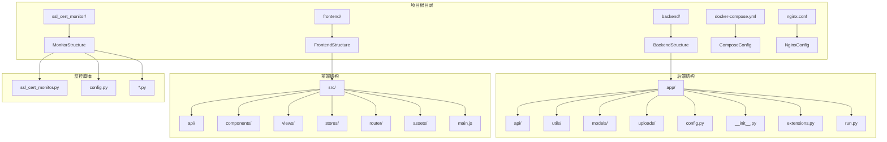
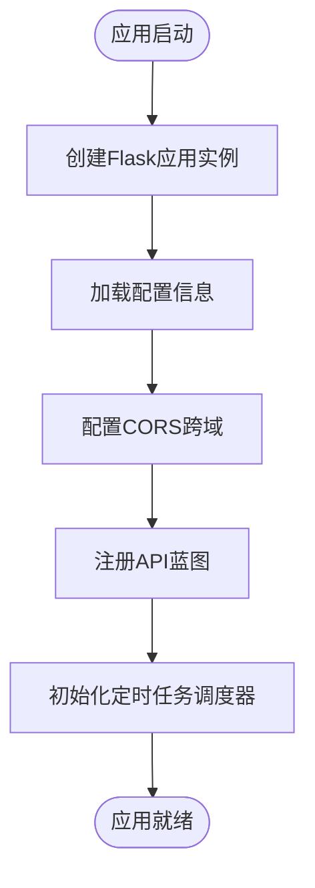
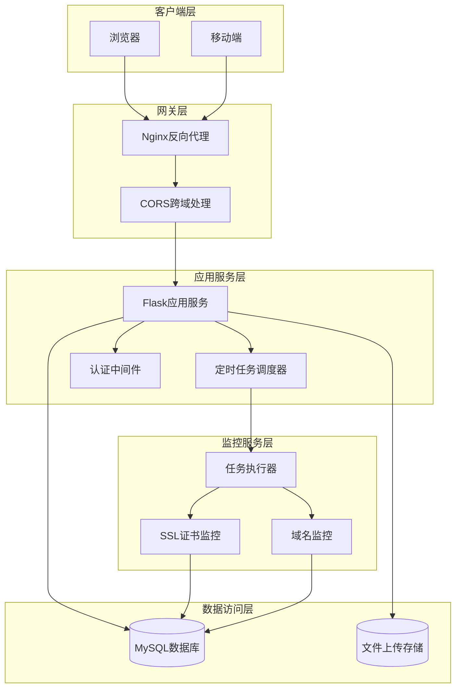
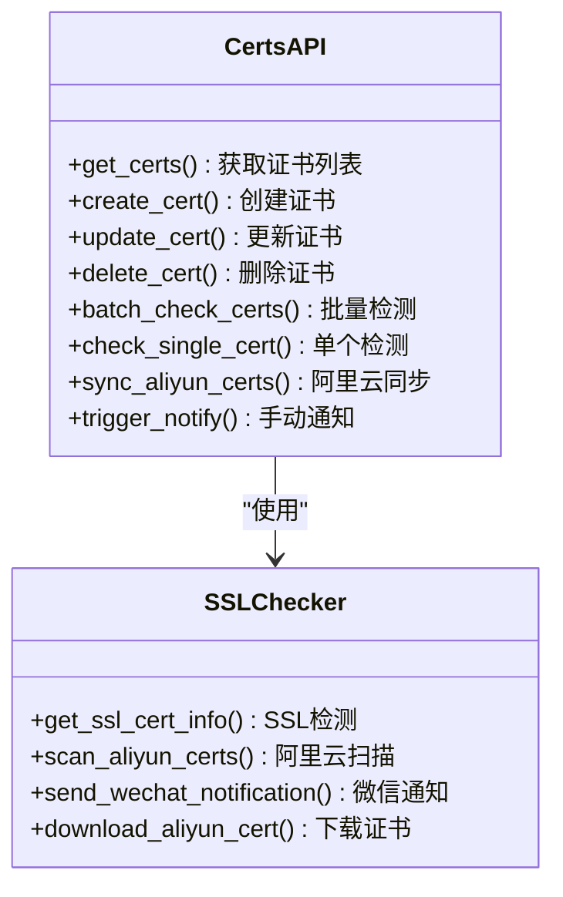
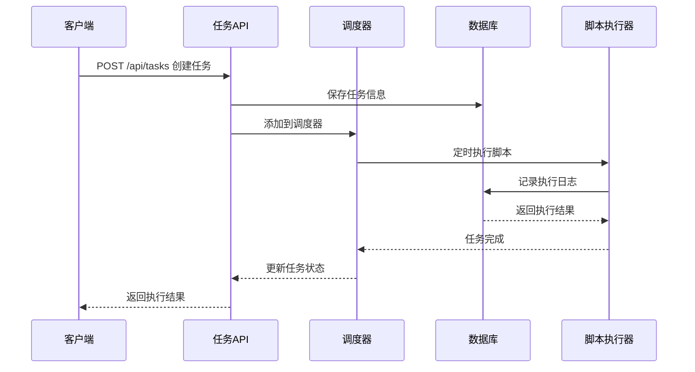
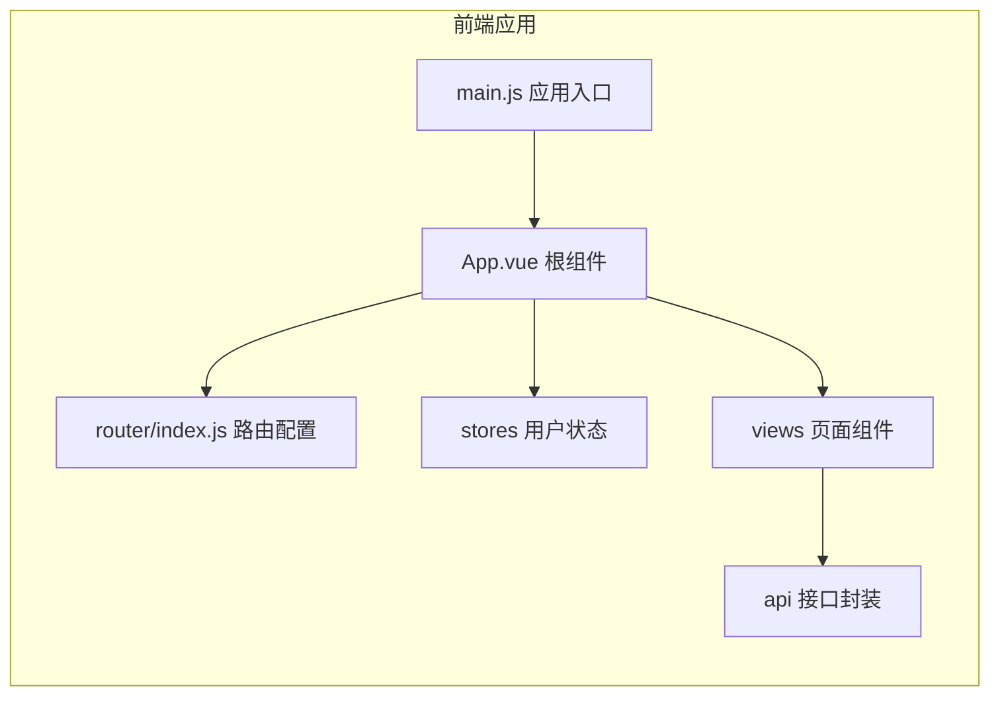
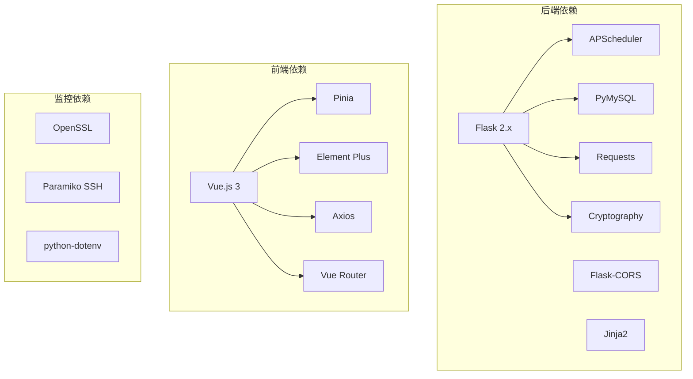
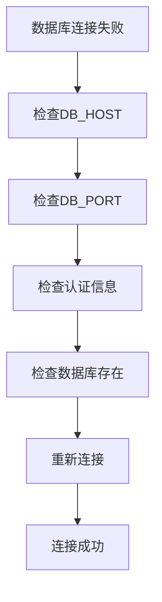

# 监控调度系统

<cite>
**本文档引用的文件**
- [backend/app/__init__.py](file://backend/app/__init__.py)
- [backend/app/config.py](file://backend/app/config.py)
- [backend/run.py](file://backend/run.py)
- [backend/app/utils/scheduler.py](file://backend/app/utils/scheduler.py)
- [backend/app/utils/db.py](file://backend/app/utils/db.py)
- [backend/app/utils/decorators.py](file://backend/app/utils/decorators.py)
- [backend/app/utils/ssl_checker.py](file://backend/app/utils/ssl_checker.py)
- [backend/app/api/tasks.py](file://backend/app/api/tasks.py)
- [backend/app/api/servers.py](file://backend/app/api/servers.py)
- [backend/app/api/certs.py](file://backend/app/api/certs.py)
- [ssl_cert_monitor/ssl_cert_monitor.py](file://ssl_cert_monitor/ssl_cert_monitor.py)
- [ssl_cert_monitor/config.py](file://ssl_cert_monitor/config.py)
- [frontend/src/main.js](file://frontend/src/main.js)
- [docker-compose.yml](file://docker-compose.yml)
</cite>

## 目录
1. [项目概述](#项目概述)
2. [项目结构](#项目结构)
3. [核心组件](#核心组件)
4. [架构概览](#架构概览)
5. [详细组件分析](#详细组件分析)
6. [依赖关系分析](#依赖关系分析)
7. [性能考虑](#性能考虑)
8. [故障排除指南](#故障排除指南)
9. [结论](#结论)

## 项目概述

监控调度系统是一个基于Python Flask框架开发的企业级运维管理平台，主要提供以下核心功能：

- **SSL证书监控与管理**：实时监控SSL证书有效期，支持自动检测和预警通知
- **定时任务调度**：支持Cron表达式的定时任务管理和执行
- **服务器资产管理**：统一管理服务器资源和相关信息
- **域名到期监控**：监控域名到期时间并提供预警通知
- **多环境部署**：支持Docker容器化部署，包含前后端分离架构

系统采用前后端分离的设计模式，后端使用Flask提供RESTful API服务，前端使用Vue.js构建用户界面，通过Docker进行容器化部署。

## 项目结构

**图表来源**
- [backend/app/__init__.py:1-66](file://backend/app/__init__.py#L1-L66)
- [frontend/src/main.js:1-23](file://frontend/src/main.js#L1-L23)
- [ssl_cert_monitor/ssl_cert_monitor.py:1-800](file://ssl_cert_monitor/ssl_cert_monitor.py#L1-L800)

**章节来源**
- [backend/app/__init__.py:1-66](file://backend/app/__init__.py#L1-L66)
- [backend/app/config.py:1-38](file://backend/app/config.py#L1-L38)
- [frontend/src/main.js:1-23](file://frontend/src/main.js#L1-L23)

## 核心组件

### 应用程序入口

应用程序通过工厂模式创建Flask应用实例，支持动态配置和蓝图注册：

**图表来源**
- [backend/app/__init__.py:6-34](file://backend/app/__init__.py#L6-L34)

### 配置管理系统

系统采用集中式配置管理，支持环境变量和默认值：

| 配置类别 | 关键配置项 | 默认值 | 用途 |
|---------|-----------|--------|------|
| 数据库配置 | DB_HOST, DB_PORT, DB_USER, DB_PASSWORD, DB_NAME | 本地MySQL | 数据持久化 |
| 应用配置 | SECRET_KEY, JWT_SECRET_KEY, JWT_EXPIRATION_HOURS | 开发默认值 | 安全认证 |
| 调试配置 | DEBUG, HOST, PORT | 调试模式 | 开发环境 |
| 上传配置 | UPLOAD_FOLDER, MAX_CONTENT_LENGTH | 16MB | 文件上传 |
| 通知配置 | WECHAT_WEBHOOK_URL | 空 | 企业微信通知 |

**章节来源**
- [backend/app/config.py:4-38](file://backend/app/config.py#L4-L38)

### 定时任务调度器

系统集成了APScheduler作为核心调度器，支持：

- **Cron表达式调度**：精确的时间调度控制
- **任务生命周期管理**：创建、更新、删除、启用/禁用
- **手动执行**：支持即时任务执行
- **日志记录**：完整的执行历史追踪

**章节来源**
- [backend/app/utils/scheduler.py:1-512](file://backend/app/utils/scheduler.py#L1-L512)

## 架构概览

**图表来源**
- [docker-compose.yml:1-75](file://docker-compose.yml#L1-L75)
- [backend/app/__init__.py:24-32](file://backend/app/__init__.py#L24-L32)

## 详细组件分析

### API接口层

系统提供了完整的RESTful API接口，涵盖以下主要模块：

#### 证书管理API

**图表来源**
- [backend/app/api/certs.py:1-800](file://backend/app/api/certs.py#L1-L800)
- [backend/app/utils/ssl_checker.py:1-589](file://backend/app/utils/ssl_checker.py#L1-L589)

#### 任务管理API

**图表来源**
- [backend/app/api/tasks.py:63-136](file://backend/app/api/tasks.py#L63-L136)
- [backend/app/utils/scheduler.py:37-148](file://backend/app/utils/scheduler.py#L37-L148)

**章节来源**
- [backend/app/api/tasks.py:1-458](file://backend/app/api/tasks.py#L1-L458)

### 数据库设计

系统采用MySQL作为数据存储，核心表结构包括：

#### 证书表结构
| 字段名 | 类型 | 约束 | 描述 |
|--------|------|------|------|
| id | INT | PRIMARY KEY, AUTO_INCREMENT | 主键ID |
| domain | VARCHAR(255) | NOT NULL | 域名 |
| project_name | VARCHAR(255) | NOT NULL | 项目名称 |
| cert_type | TINYINT | DEFAULT 1 | 证书类型 |
| issuer | VARCHAR(255) | | 颁发机构 |
| cert_expire_time | DATETIME | | 到期时间 |
| remaining_days | INT | | 剩余天数 |
| status | TINYINT | DEFAULT 1 | 状态 |
| created_at | TIMESTAMP | DEFAULT CURRENT_TIMESTAMP | 创建时间 |
| updated_at | TIMESTAMP | DEFAULT CURRENT_TIMESTAMP ON UPDATE CURRENT_TIMESTAMP | 更新时间 |

**章节来源**
- [backend/app/api/certs.py:36-100](file://backend/app/api/certs.py#L36-L100)

### 前端架构

前端采用Vue.js 3 + TypeScript + Element Plus技术栈：

**图表来源**
- [frontend/src/main.js:1-23](file://frontend/src/main.js#L1-L23)

**章节来源**
- [frontend/src/main.js:1-23](file://frontend/src/main.js#L1-L23)

## 依赖关系分析

**图表来源**
- [backend/app/utils/ssl_checker.py:14-17](file://backend/app/utils/ssl_checker.py#L14-L17)
- [frontend/package.json](file://frontend/package.json)

### 外部集成

系统支持多种外部服务集成：

| 集成服务 | 用途 | 实现方式 |
|---------|------|----------|
| 阿里云证书 | 证书管理 | CAS API SDK |
| 企业微信 | 预警通知 | Webhook API |
| MySQL | 数据存储 | PyMySQL驱动 |
| Docker | 容器化部署 | Compose编排 |
| Nginx | 反向代理 | 静态资源服务 |

**章节来源**
- [backend/app/utils/ssl_checker.py:21-34](file://backend/app/utils/ssl_checker.py#L21-L34)
- [docker-compose.yml:1-75](file://docker-compose.yml#L1-L75)

## 性能考虑

### 并发处理
- **线程池管理**：定时任务使用独立线程执行，避免阻塞主进程
- **连接池优化**：数据库连接采用连接池管理，减少连接开销
- **异步处理**：支持异步任务执行，提高响应速度

### 缓存策略
- **阿里云证书缓存**：5分钟TTL缓存机制，减少API调用频率
- **配置缓存**：应用配置在内存中缓存，避免重复读取
- **会话缓存**：JWT令牌验证结果缓存，提升认证效率

### 监控指标
- **任务执行时间**：记录每个任务的执行耗时
- **数据库连接数**：监控数据库连接使用情况
- **内存使用率**：跟踪应用内存占用情况
- **API响应时间**：统计各接口的响应延迟

## 故障排除指南

### 常见问题诊断

#### 数据库连接问题

#### 定时任务执行失败
- **检查Cron表达式格式**：确保符合"分 时 日 月 周"格式
- **验证脚本文件权限**：确认脚本具有执行权限
- **查看任务日志**：检查task_logs表中的错误信息
- **监控任务状态**：确认scheduled_tasks表中的状态字段

#### SSL证书检测失败
- **网络连通性测试**：验证域名可达性和端口开放
- **TLS版本兼容性**：检查服务器支持的TLS版本
- **证书链完整性**：确认证书链完整性和有效性
- **超时设置调整**：适当增加SSL检测超时时间

**章节来源**
- [backend/app/utils/scheduler.py:104-138](file://backend/app/utils/scheduler.py#L104-L138)
- [backend/app/utils/ssl_checker.py:48-166](file://backend/app/utils/ssl_checker.py#L48-L166)

### 日志分析

系统采用结构化日志记录，建议重点关注：

- **错误级别日志**：ERROR级别的异常信息
- **调试级别日志**：DEBUG级别的详细执行过程
- **性能日志**：记录关键操作的执行时间和资源消耗
- **安全日志**：认证失败和权限相关的日志信息

## 结论

监控调度系统是一个功能完整、架构清晰的企业级运维管理平台。系统的主要优势包括：

### 技术优势
- **模块化设计**：清晰的组件划分和职责分离
- **可扩展性**：支持插件化扩展和自定义任务
- **可靠性**：完善的错误处理和重试机制
- **可观测性**：全面的日志记录和监控指标

### 应用价值
- **自动化运维**：减少人工干预，提高运维效率
- **风险控制**：及时发现和预警潜在的安全风险
- **成本优化**：通过自动化降低运维成本
- **合规保障**：满足企业级安全和合规要求

### 发展建议
- **微服务化改造**：将核心功能拆分为独立的服务
- **云原生优化**：增强Kubernetes部署和管理能力
- **AI智能分析**：引入机器学习进行异常检测和预测
- **多租户支持**：扩展支持多组织和多项目的管理需求

该系统为企业数字化转型提供了坚实的基础设施支撑，能够有效提升运维管理水平和安全保障能力。