# 证书管理模块

<cite>
**本文档引用的文件**
- [backend/app/api/certs.py](file://backend/app/api/certs.py)
- [backend/frontend/src/api/certs.js](file://backend/frontend/src/api/certs.js)
- [backend/frontend/src/views/Certs.vue](file://backend/frontend/src/views/Certs.vue)
- [backend/app/utils/ssl_checker.py](file://backend/app/utils/ssl_checker.py)
- [backend/init_db.py](file://backend/init_db.py)
- [backend/app/config.py](file://backend/app/config.py)
- [backend/app/__init__.py](file://backend/app/__init__.py)
- [backend/app/utils/scheduler.py](file://backend/app/utils/scheduler.py)
- [backend/app/api/tasks.py](file://backend/app/api/tasks.py)
</cite>

## 更新摘要
**所做更改**
- 增强了证书文件同步功能，新增下载计数器统计
- 改进了证书文件状态跟踪机制，完善has_cert_file字段使用
- 优化了阿里云证书同步的错误处理和状态反馈
- 增强了证书文件下载的条件判断和异常处理

## 目录
1. [简介](#简介)
2. [项目结构](#项目结构)
3. [核心组件](#核心组件)
4. [架构总览](#架构总览)
5. [详细组件分析](#详细组件分析)
6. [依赖分析](#依赖分析)
7. [性能考虑](#性能考虑)
8. [故障排查指南](#故障排查指南)
9. [结论](#结论)
10. [附录](#附录)

## 简介
本文档面向云运维平台的"证书管理模块"，系统化阐述数字证书全生命周期管理能力与实现方案。经过最新的SSL证书管理系统升级，模块现已提供完整的证书管理功能，包括：

- **证书全生命周期管理**：支持手动录入、自动检测、阿里云同步等多种证书获取方式
- **智能监控与预警**：实时SSL证书检测、到期预警、微信通知推送
- **文件管理**：证书文件上传、下载、远程部署、安全存储
- **自动化运维**：定时任务调度、批量操作、审计追踪
- **云端集成**：阿里云证书管理、多账户支持、API自动化

基于现有实现，本文将详细说明新系统的架构设计、功能特性和最佳实践。

## 项目结构
后端采用Flask微服务架构，通过蓝图组织API；前端使用Vue3 + Element Plus构建现代化管理界面；数据库采用MySQL存储证书相关信息。

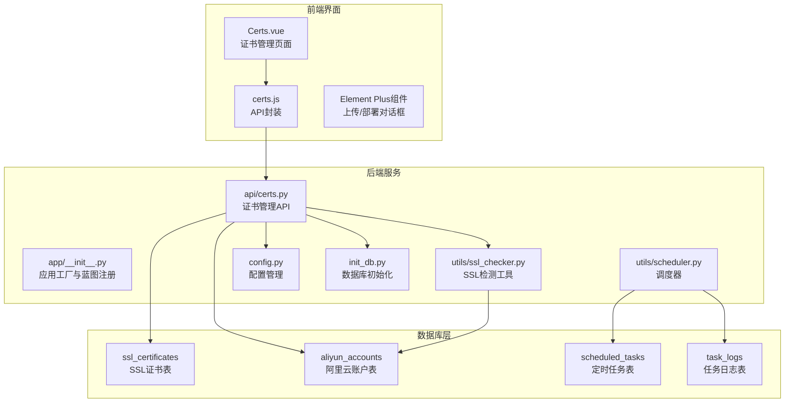

**图表来源**
- [backend/app/__init__.py:37-66](file://backend/app/__init__.py#L37-L66)
- [backend/app/api/certs.py:1-1099](file://backend/app/api/certs.py#L1-L1099)
- [backend/app/utils/ssl_checker.py:1-614](file://backend/app/utils/ssl_checker.py#L1-L614)
- [backend/init_db.py:270-313](file://backend/init_db.py#L270-L313)

## 核心组件

### 升级后的证书数据模型
**主要变化**：从原有的domains_certs表升级为ssl_certificates表，新增证书文件存储、阿里云集成、状态管理等功能。

- **ssl_certificates表**：包含域名、项目名称、证书类型、颁发机构、有效期、剩余天数、状态、来源等字段
- **aliyun_accounts表**：管理阿里云账户配置，支持多账户证书同步
- **索引优化**：为domain、cert_type、expire_time、status等字段建立索引，提升查询性能

### 增强的API功能
- **批量SSL检测**：支持批量在线检测证书有效性
- **阿里云证书同步**：自动从阿里云拉取证书信息和文件，包含下载计数器统计
- **证书文件管理**：支持证书和私钥文件的上传、下载、删除
- **远程部署**：通过SSH协议将证书部署到目标服务器
- **微信通知**：集成企业微信机器人进行到期预警推送

### 完善的前端界面
- **现代化UI**：基于Element Plus的响应式设计
- **文件上传**：支持多种格式的证书文件上传
- **远程部署**：可视化服务器选择和部署配置
- **批量操作**：支持批量检测、批量同步等操作
- **状态可视化**：通过颜色标签直观显示证书状态

**章节来源**
- [backend/init_db.py:270-313](file://backend/init_db.py#L270-L313)
- [backend/app/api/certs.py:1-1099](file://backend/app/api/certs.py#L1-L1099)
- [backend/frontend/src/views/Certs.vue:1-637](file://backend/frontend/src/views/Certs.vue#L1-L637)

## 架构总览
新系统采用分层架构设计，从前端界面到后端服务再到数据库存储形成完整的证书管理体系。

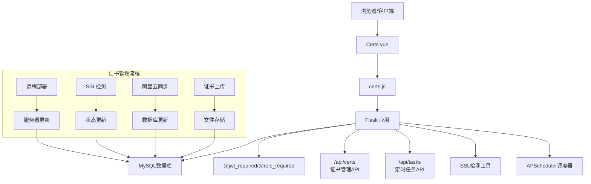

**图表来源**
- [backend/frontend/src/views/Certs.vue:260-637](file://backend/frontend/src/views/Certs.vue#L260-L637)
- [backend/frontend/src/api/certs.js:1-64](file://backend/frontend/src/api/certs.js#L1-L64)
- [backend/app/api/certs.py:298-1099](file://backend/app/api/certs.py#L298-L1099)

## 详细组件分析

### 升级后的证书数据模型

#### ssl_certificates表结构
新表结构相比原有表增加了多项重要字段，支持完整的证书生命周期管理：

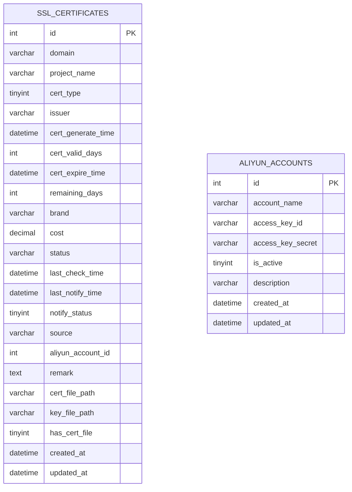

**图表来源**
- [backend/init_db.py:270-313](file://backend/init_db.py#L270-L313)
- [backend/init_db.py:233-246](file://backend/init_db.py#L233-L246)

#### 字段说明与业务含义
- **cert_type**：证书类型（0=自动检测，1=手动录入，2=阿里云证书）
- **remaining_days**：剩余有效天数，用于到期预警计算
- **has_cert_file**：标识是否已上传证书文件
- **cert_file_path/key_file_path**：证书文件存储路径
- **aliyun_account_id**：关联的阿里云账户ID

**章节来源**
- [backend/init_db.py:270-313](file://backend/init_db.py#L270-L313)

### 增强的证书管理API

#### 批量SSL在线检测
新增批量检测功能，支持对多个证书进行并发检测：

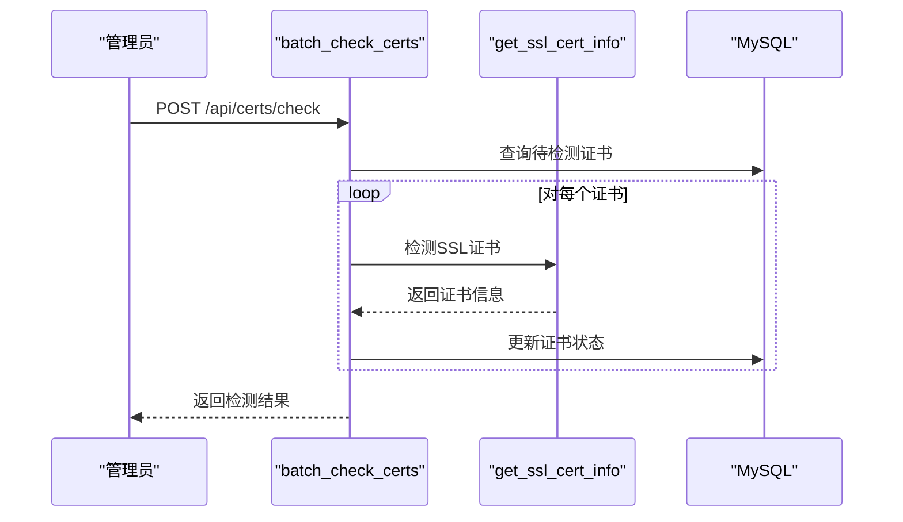

**图表来源**
- [backend/app/api/certs.py:304-427](file://backend/app/api/certs.py#L304-L427)
- [backend/app/utils/ssl_checker.py:48-167](file://backend/app/utils/ssl_checker.py#L48-L167)

#### 阿里云证书同步
支持从阿里云账户自动同步证书信息和文件，包含增强的下载计数器：

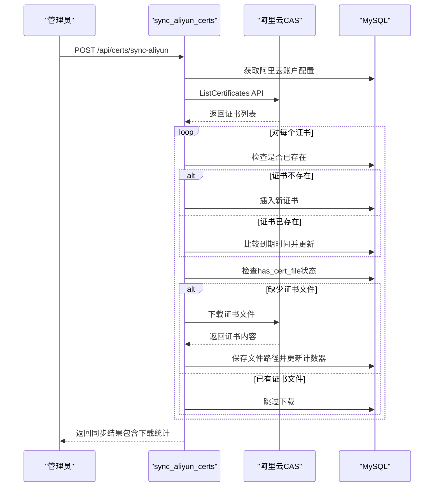

**图表来源**
- [backend/app/api/certs.py:522-739](file://backend/app/api/certs.py#L522-L739)
- [backend/app/utils/ssl_checker.py:540-614](file://backend/app/utils/ssl_checker.py#L540-L614)

#### 证书文件管理
提供完整的证书文件上传、下载、删除功能：

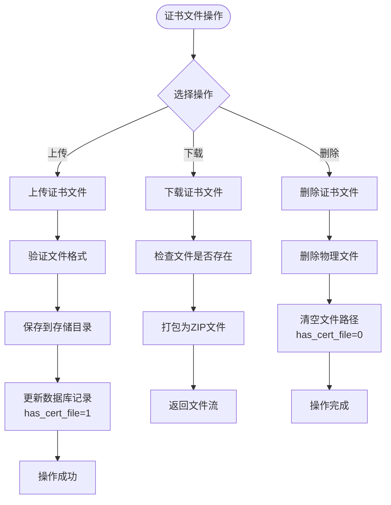

**图表来源**
- [backend/app/api/certs.py:811-1099](file://backend/app/api/certs.py#L811-L1099)

**章节来源**
- [backend/app/api/certs.py:304-1099](file://backend/app/api/certs.py#L304-L1099)

### 完善的前端交互体验

#### 现代化证书管理界面
基于Vue3 Composition API重构的证书管理页面，提供更好的用户体验：

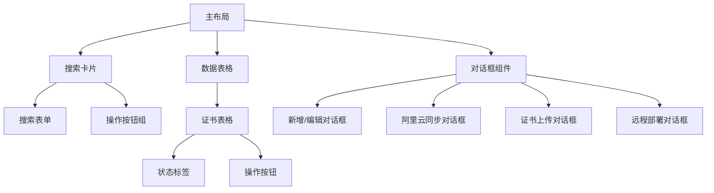

**图表来源**
- [backend/frontend/src/views/Certs.vue:1-200](file://backend/frontend/src/views/Certs.vue#L1-L200)

#### 文件上传与部署流程
提供直观的文件上传和远程部署功能：

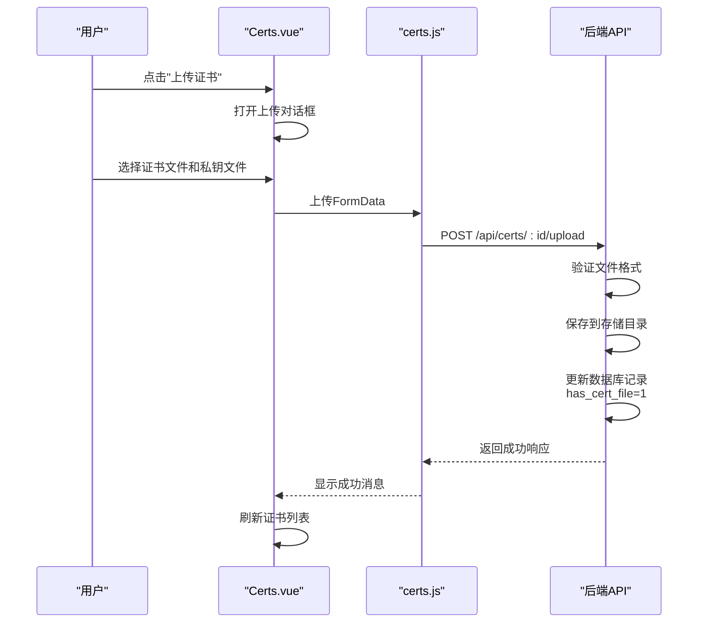

**图表来源**
- [backend/frontend/src/views/Certs.vue:485-515](file://backend/frontend/src/views/Certs.vue#L485-L515)
- [backend/frontend/src/api/certs.js:43-48](file://backend/frontend/src/api/certs.js#L43-L48)

**章节来源**
- [backend/frontend/src/views/Certs.vue:1-637](file://backend/frontend/src/views/Certs.vue#L1-L637)
- [backend/frontend/src/api/certs.js:1-64](file://backend/frontend/src/api/certs.js#L1-L64)

### 增强的监控与告警系统

#### SSL证书监控
集成实时SSL证书监控功能，支持多种检测方式：

| 检测方式 | 技术实现 | 适用场景 |
|---------|----------|----------|
| 在线检测 | OpenSSL/TLS握手 | 实时有效性检查 |
| 批量检测 | 并发连接池 | 大规模证书检查 |
| 阿里云同步 | CAS API | 云端证书管理 |
| 文件验证 | PEM解析 | 本地证书验证 |

#### 微信通知系统
集成企业微信机器人进行证书到期预警：

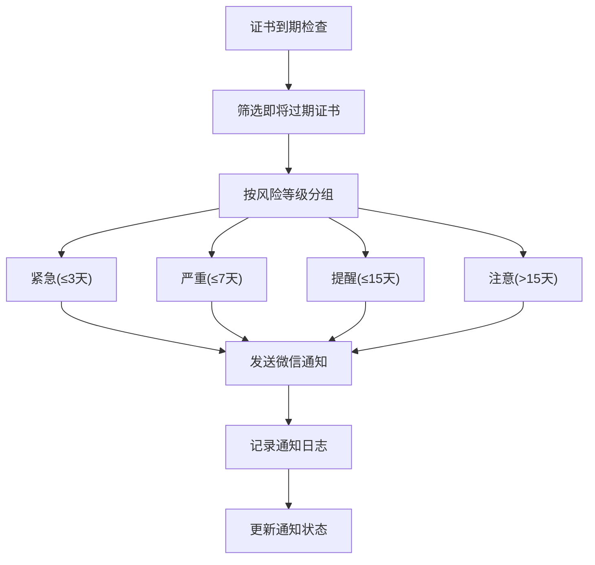

**图表来源**
- [backend/app/utils/ssl_checker.py:305-397](file://backend/app/utils/ssl_checker.py#L305-L397)

**章节来源**
- [backend/app/utils/ssl_checker.py:1-614](file://backend/app/utils/ssl_checker.py#L1-L614)

### 定时任务与自动化运维

#### 调度器增强
APScheduler调度器支持更复杂的任务管理：

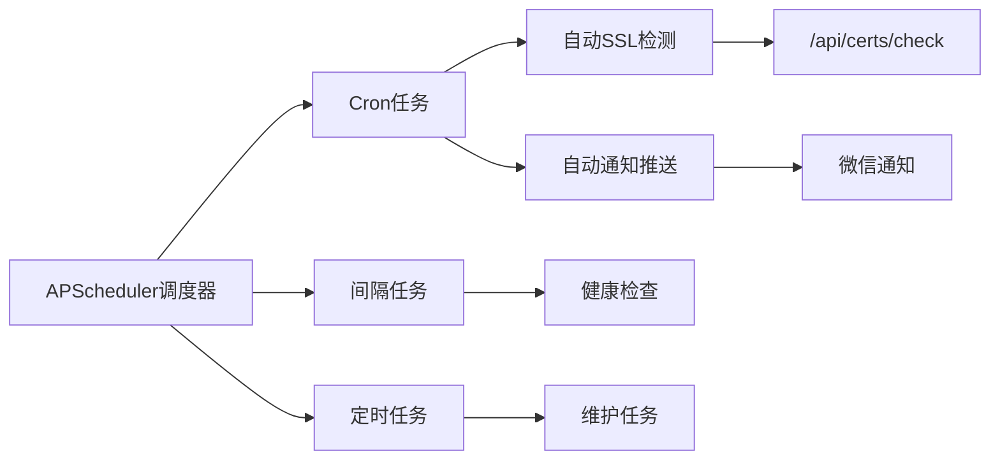

**图表来源**
- [backend/app/utils/scheduler.py:151-200](file://backend/app/utils/scheduler.py#L151-L200)

#### 任务执行流程
定时任务的完整执行生命周期：

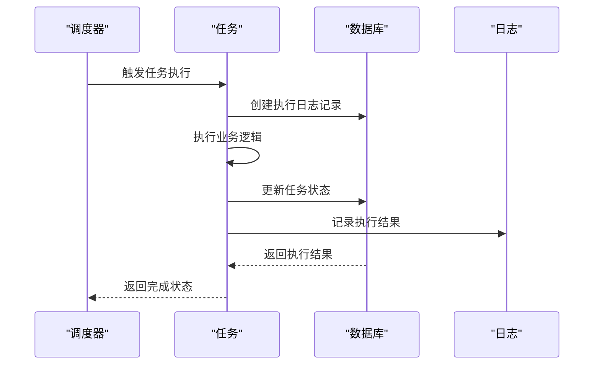

**图表来源**
- [backend/app/utils/scheduler.py:37-149](file://backend/app/utils/scheduler.py#L37-L149)

**章节来源**
- [backend/app/utils/scheduler.py:1-512](file://backend/app/utils/scheduler.py#L1-L512)
- [backend/app/api/tasks.py:1-458](file://backend/app/api/tasks.py#L1-L458)

## 依赖分析

### 外部依赖升级
新版本增强了对外部库的依赖管理：

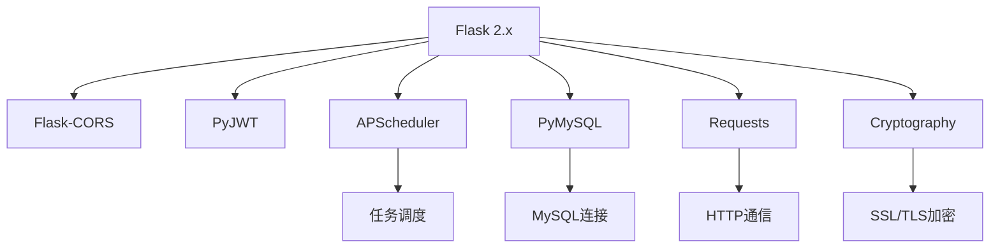

**图表来源**
- [backend/requirements.txt:1-9](file://backend/requirements.txt#L1-L9)

### 内部模块依赖
- **ssl_checker模块**：提供SSL证书检测、阿里云集成、微信通知功能
- **scheduler模块**：负责定时任务的调度和执行
- **config模块**：集中管理应用配置，支持环境变量
- **蓝图注册**：在应用初始化时注册所有API蓝图

**章节来源**
- [backend/app/__init__.py:37-66](file://backend/app/__init__.py#L37-L66)
- [backend/app/config.py:1-38](file://backend/app/config.py#L1-L38)

## 性能考虑

### 数据库性能优化
- **索引策略**：为常用查询字段建立复合索引，提升查询性能
- **连接池**：使用连接池管理数据库连接，减少连接开销
- **分页查询**：默认20条每页，支持大数据量场景
- **缓存策略**：对频繁访问的配置信息进行缓存

### API性能优化
- **批量操作**：支持批量检测和批量同步，减少API调用次数
- **并发处理**：SSL检测使用并发连接池，提升检测效率
- **文件上传**：支持大文件分块上传，避免内存溢出
- **响应压缩**：启用GZIP压缩，减少网络传输

### 前端性能优化
- **虚拟滚动**：大数据量表格使用虚拟滚动，提升渲染性能
- **懒加载**：对话框组件按需加载，减少初始包大小
- **状态缓存**：本地缓存搜索条件和分页状态
- **图片优化**：图标使用SVG格式，提升加载速度

## 故障排查指南

### 常见问题诊断

#### 证书检测失败
- **网络连接**：检查防火墙设置和DNS解析
- **SSL配置**：验证TLS版本兼容性和证书链完整性
- **超时设置**：调整SSL_CHECK_TIMEOUT配置参数
- **代理设置**：配置HTTP代理服务器（如有需要）

#### 阿里云同步异常
- **API凭证**：验证AccessKey ID和Secret的有效性
- **权限配置**：检查RAM权限策略和CAS服务授权
- **网络访问**：确认能够访问阿里云CAS服务端点
- **配额限制**：检查API调用频率限制和配额情况
- **下载失败**：检查download_failed_count统计，验证证书文件格式

#### 文件上传失败
- **文件格式**：确认上传文件为有效的PEM格式
- **存储权限**：检查CERT_FILES_DIR目录的写入权限
- **磁盘空间**：验证服务器磁盘空间充足
- **文件大小**：确认不超过MAX_CONTENT_LENGTH限制

#### 微信通知失败
- **Webhook配置**：验证WECHAT_WEBHOOK_URL配置正确
- **网络连通性**：检查企业微信服务器可达性
- **消息格式**：确认Markdown格式符合企业微信要求
- **重试机制**：查看NOTIFY_MAX_RETRIES配置

**章节来源**
- [backend/app/utils/ssl_checker.py:48-167](file://backend/app/utils/ssl_checker.py#L48-L167)
- [backend/app/config.py:22-38](file://backend/app/config.py#L22-L38)

## 结论
经过全面升级的SSL证书管理系统，在保持原有功能的基础上，新增了完整的证书文件管理、阿里云集成、微信通知等高级功能。新系统采用现代化的技术栈和架构设计，提供了更好的用户体验和更强的扩展能力。

**主要优势**：
- **功能完整**：涵盖证书全生命周期管理的各个环节
- **自动化程度高**：支持批量操作和定时任务，减少人工干预
- **云端集成**：无缝对接阿里云证书服务，提升管理效率
- **监控预警**：实时监控证书状态，及时预警潜在风险
- **安全可靠**：完善的权限控制和审计日志，确保操作安全

**未来发展方向**：
- 集成更多CA提供商的证书管理
- 增加证书自动续期功能
- 扩展多租户支持和权限隔离
- 增强报表统计和分析功能

## 附录

### 最佳实践与合规建议

#### 证书管理最佳实践
- **密钥安全**：私钥采用硬件安全模块(HSM)或加密存储，定期轮换
- **证书链验证**：确保完整的证书链验证，避免中间人攻击
- **有效期管理**：建立证书到期预警机制，提前30天进行续期
- **访问控制**：实施最小权限原则，严格控制证书文件访问权限
- **审计追踪**：完整记录所有证书操作，支持合规性审计

#### 系统部署建议
- **环境隔离**：开发、测试、生产环境分离，配置独立
- **备份策略**：定期备份证书文件和数据库，确保可恢复性
- **监控告警**：建立系统健康监控和异常告警机制
- **性能优化**：根据业务量调整数据库和应用服务器资源配置
- **安全加固**：定期更新依赖库，修复安全漏洞

#### 合规性要求
- **数据保护**：遵守GDPR等数据保护法规，保护证书相关信息
- **审计要求**：满足内部审计和外部合规检查的要求
- **证书政策**：建立企业级证书管理政策和流程规范
- **灾难恢复**：制定证书管理系统的灾难恢复计划
- **培训教育**：定期对相关人员进行证书管理培训