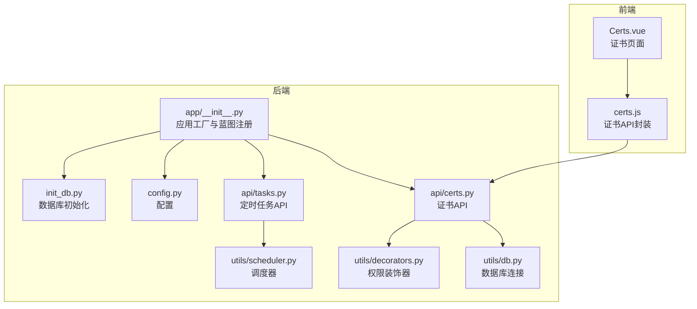
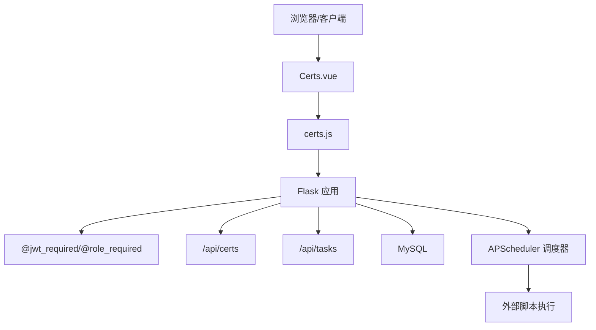
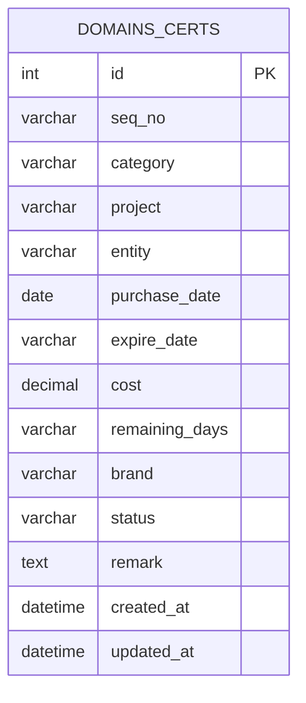
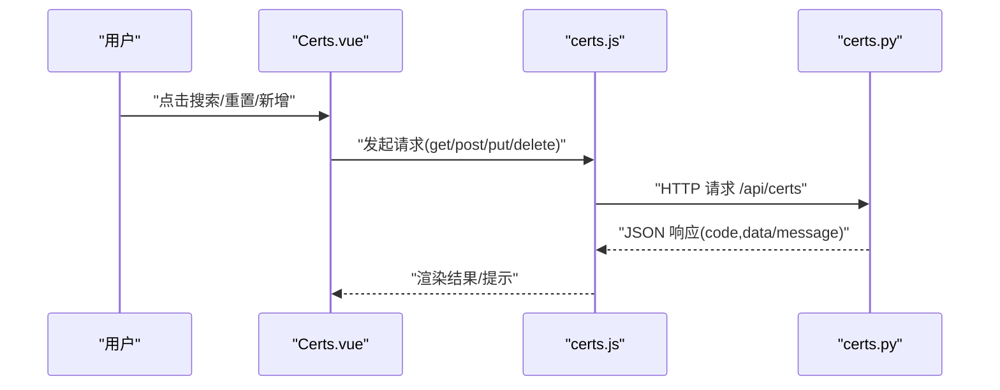
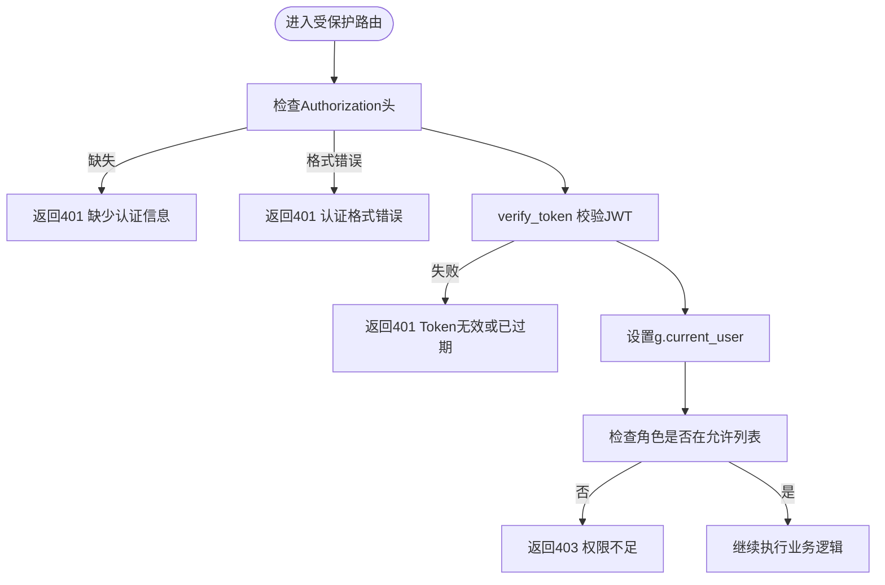
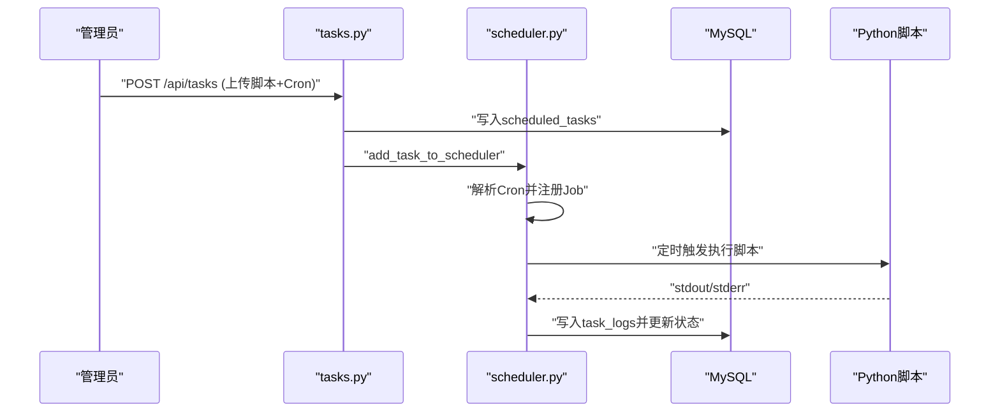
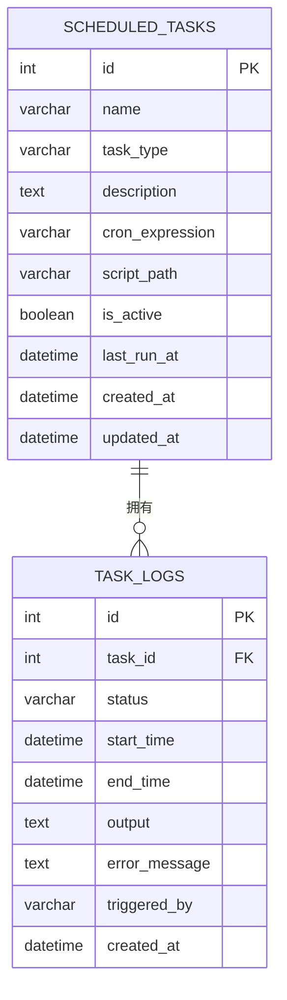
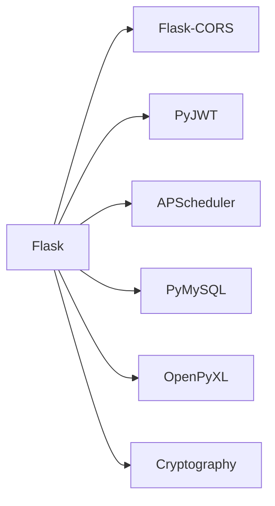

# 证书管理模块

<cite>
**本文档引用的文件**
- [backend/app/api/certs.py](file://backend/app/api/certs.py)
- [backend/frontend/src/api/certs.js](file://backend/frontend/src/api/certs.js)
- [backend/frontend/src/views/Certs.vue](file://backend/frontend/src/views/Certs.vue)
- [backend/backend/app/utils/db.py](file://backend/app/utils/db.py)
- [backend/backend/app/utils/decorators.py](file://backend/app/utils/decorators.py)
- [backend/backend/app/utils/scheduler.py](file://backend/app/utils/scheduler.py)
- [backend/backend/app/api/tasks.py](file://backend/app/api/tasks.py)
- [backend/backend/app/api/records.py](file://backend/app/api/records.py)
- [backend/backend/app/__init__.py](file://backend/app/__init__.py)
- [backend/backend/app/config.py](file://backend/app/config.py)
- [backend/init_db.py](file://init_db.py)
- [backend/import_data.py](file://import_data.py)
- [backend/run.py](file://run.py)
- [backend/requirements.txt](file://requirements.txt)
</cite>

## 目录
1. [简介](#简介)
2. [项目结构](#项目结构)
3. [核心组件](#核心组件)
4. [架构总览](#架构总览)
5. [详细组件分析](#详细组件分析)
6. [依赖分析](#依赖分析)
7. [性能考虑](#性能考虑)
8. [故障排查指南](#故障排查指南)
9. [结论](#结论)
10. [附录](#附录)

## 简介
本文件面向云运维平台的“证书管理模块”，系统化阐述数字证书全生命周期管理能力与实现方案。当前代码库提供了证书基础数据模型、前端展示与交互、后端API接口、权限与认证、以及基于APScheduler的定时任务调度能力。基于现有实现，本文将：
- 明确证书申请、续期、到期预警、撤销等流程的现状与扩展点
- 说明证书上传与验证的实现边界（当前未内置PEM解析、链验证、私钥存储）
- 解释到期时间计算、风险等级评估、批量通知与历史记录追踪的实现现状与建议
- 给出最佳实践与高级功能（自动化运维、批量部署、审计报告）的落地指南

## 项目结构
后端采用Flask微服务架构，通过蓝图组织API；前端使用Vue3 + Element Plus构建管理界面；数据库初始化脚本定义了证书与任务相关的核心表。

**图表来源**
- [backend/app/__init__.py:37-62](file://backend/app/__init__.py#L37-L62)
- [backend/app/api/certs.py:1-145](file://backend/app/api/certs.py#L1-L145)
- [backend/app/api/tasks.py:1-458](file://backend/app/api/tasks.py#L1-L458)
- [backend/app/utils/scheduler.py:1-249](file://backend/app/utils/scheduler.py#L1-L249)
- [backend/app/utils/db.py:1-17](file://backend/app/utils/db.py#L1-L17)
- [backend/app/utils/decorators.py:1-95](file://backend/app/utils/decorators.py#L1-L95)
- [backend/app/config.py:1-21](file://backend/app/config.py#L1-L21)
- [backend/init_db.py:150-263](file://init_db.py#L150-L263)

**章节来源**
- [backend/app/__init__.py:37-62](file://backend/app/__init__.py#L37-L62)
- [backend/app/config.py:1-21](file://backend/app/config.py#L1-L21)
- [backend/init_db.py:150-263](file://init_db.py#L150-L263)

## 核心组件
- 证书数据模型与API
  - 数据表：domains_certs（证书主表），包含编号、分类、项目、主体、购买/到期日期、费用、剩余天数、品牌、状态、备注等字段
  - API：支持分页查询、新增、更新、删除证书记录
- 权限与认证
  - JWT认证装饰器与角色权限装饰器，限制证书管理API的访问范围
- 前端交互
  - Certs.vue提供搜索、新增、编辑、删除等UI能力，调用certs.js封装的REST接口
- 定时任务与调度
  - APscheduler调度器，支持按Cron表达式执行脚本，记录任务日志与状态
- 数据库初始化
  - init_db.py创建证书表、定时任务表、任务日志表等

**章节来源**
- [backend/app/api/certs.py:11-145](file://backend/app/api/certs.py#L11-L145)
- [backend/frontend/src/views/Certs.vue:1-336](file://backend/frontend/src/views/Certs.vue#L1-L336)
- [backend/frontend/src/api/certs.js:1-18](file://backend/frontend/src/api/certs.js#L1-L18)
- [backend/app/utils/decorators.py:9-95](file://backend/app/utils/decorators.py#L9-L95)
- [backend/app/utils/scheduler.py:1-249](file://backend/app/utils/scheduler.py#L1-L249)
- [backend/init_db.py:150-263](file://init_db.py#L150-L263)

## 架构总览
证书管理模块由“前端展示层 → API网关层 → 业务逻辑层 → 数据持久层”构成，配合定时任务实现自动化运维。

**图表来源**
- [backend/frontend/src/views/Certs.vue:170-336](file://backend/frontend/src/views/Certs.vue#L170-L336)
- [backend/frontend/src/api/certs.js:1-18](file://backend/frontend/src/api/certs.js#L1-L18)
- [backend/app/api/certs.py:1-145](file://backend/app/api/certs.py#L1-L145)
- [backend/app/api/tasks.py:1-458](file://backend/app/api/tasks.py#L1-L458)
- [backend/app/utils/scheduler.py:1-249](file://backend/app/utils/scheduler.py#L1-L249)

## 详细组件分析

### 证书数据模型与API
- 数据模型
  - domains_certs：包含证书基本信息、状态与备注，索引覆盖分类与状态，便于查询与筛选
- API能力
  - GET /api/certs：支持按分类与关键词搜索，返回证书列表
  - POST /api/certs：新增证书记录（需管理员/操作员角色）
  - PUT /api/certs/<id>：更新证书记录（需管理员/操作员角色）
  - DELETE /api/certs/<id>：删除证书记录（需管理员/操作员角色）

**图表来源**
- [init_db.py:150-166](file://init_db.py#L150-L166)

**章节来源**
- [backend/app/api/certs.py:11-145](file://backend/app/api/certs.py#L11-L145)
- [backend/init_db.py:150-166](file://init_db.py#L150-L166)

### 前端交互与用户体验
- 搜索与筛选
  - 支持按分类与关键词搜索，关键词匹配项目/主体/品牌
- 表格展示
  - 展示编号、分类、项目、主体、购买/到期日期、费用、剩余天数、品牌、状态、备注
  - 剩余天数与状态以标签形式直观显示
- 操作能力
  - 新增、编辑、删除证书记录，二次确认删除
  - 表单校验确保关键字段必填

**图表来源**
- [backend/frontend/src/views/Certs.vue:210-294](file://backend/frontend/src/views/Certs.vue#L210-L294)
- [backend/frontend/src/api/certs.js:1-18](file://backend/frontend/src/api/certs.js#L1-L18)
- [backend/app/api/certs.py:11-145](file://backend/app/api/certs.py#L11-L145)

**章节来源**
- [backend/frontend/src/views/Certs.vue:1-336](file://backend/frontend/src/views/Certs.vue#L1-L336)
- [backend/frontend/src/api/certs.js:1-18](file://backend/frontend/src/api/certs.js#L1-L18)

### 权限控制与认证
- JWT认证
  - 从Authorization头提取Bearer Token，验证后将用户信息注入g对象
- 角色控制
  - 仅允许admin与operator角色执行证书的新增、更新、删除
- 数据库连接
  - 通过get_db()统一获取连接，支持主机、端口、账号、密码、库名、字符集配置

**图表来源**
- [backend/app/utils/decorators.py:9-95](file://backend/app/utils/decorators.py#L9-L95)
- [backend/app/utils/db.py:1-17](file://backend/app/utils/db.py#L1-L17)

**章节来源**
- [backend/app/utils/decorators.py:9-95](file://backend/app/utils/decorators.py#L9-L95)
- [backend/app/utils/db.py:1-17](file://backend/app/utils/db.py#L1-L17)

### 定时任务与调度（支撑自动化运维）
- 调度器
  - APscheduler后台调度器，支持Cron表达式，独立线程执行脚本
  - 自动记录任务日志、状态、输出与错误信息
- 任务管理API
  - 支持创建、更新、删除、启用/禁用、手动执行任务
  - 支持脚本文件上传与版本化命名
- 任务生命周期
  - 从数据库加载活跃任务，启动调度器；执行时创建日志记录并更新任务状态

**图表来源**
- [backend/app/api/tasks.py:63-136](file://backend/app/api/tasks.py#L63-L136)
- [backend/app/utils/scheduler.py:146-249](file://backend/app/utils/scheduler.py#L146-L249)

**章节来源**
- [backend/app/api/tasks.py:1-458](file://backend/app/api/tasks.py#L1-L458)
- [backend/app/utils/scheduler.py:1-249](file://backend/app/utils/scheduler.py#L1-L249)

### 数据库初始化与表结构
- domains_certs：证书主表，含索引与注释
- scheduled_tasks：定时任务表，含Cron表达式、脚本路径、状态、创建者等
- task_logs：任务执行日志表，记录状态、时间、输出与错误

**图表来源**
- [init_db.py:185-226](file://init_db.py#L185-L226)

**章节来源**
- [init_db.py:150-263](file://init_db.py#L150-L263)

### 证书上传与验证（现状与扩展建议）
- 现状
  - 后端未实现证书文件上传、PEM格式解析、证书链验证、私钥安全存储
  - 前端未提供证书文件上传入口
- 建议扩展
  - 新增证书上传API，接收PFX/PKCS#12或PEM文件
  - 引入证书解析库，提取公钥、序列号、颁发者、有效期、SAN等
  - 实现链验证与信任根校验
  - 私钥采用硬件安全模块(HSM)或加密存储，避免明文落盘
  - 增加证书有效性校验与合规性检查

[本节为概念性扩展说明，不直接分析具体文件，故无“章节来源”]

### 到期预警与风险评估（实现现状与建议）
- 现状
  - 剩余天数字段存在，前端按阈值展示风险标签
  - 未见自动化的到期预警与批量通知机制
- 建议实现
  - 基于APScheduler定期扫描到期日期，生成预警任务
  - 集成邮件/短信/IM通知渠道，支持批量发送
  - 结合risk等级（高/中/低）与业务影响制定处置策略

**章节来源**
- [backend/frontend/src/views/Certs.vue:305-320](file://backend/frontend/src/views/Certs.vue#L305-L320)

### 证书撤销与历史追踪（实现现状与建议）
- 现状
  - domains_certs包含状态字段，前端支持“已注销”状态
  - 未见专门的撤销流程与审计日志
- 建议实现
  - 新增撤销API，记录撤销原因、操作人、时间
  - 引入change_records或专用撤销日志表，追踪每次变更
  - 与CA吊销列表联动（如适用）

**章节来源**
- [backend/app/api/records.py:1-114](file://backend/app/api/records.py#L1-L114)
- [backend/init_db.py:168-182](file://init_db.py#L168-L182)

### 自动化运维与批量部署（实现现状与建议）
- 现状
  - 已具备定时任务框架与脚本执行能力
- 建议实现
  - 开发证书续期脚本模板，支持多CA适配
  - 批量部署：结合任务调度与服务器管理模块，实现跨主机同步
  - 审计报告：导出到期清单、变更记录、任务执行报告

**章节来源**
- [backend/app/api/tasks.py:1-458](file://backend/app/api/tasks.py#L1-L458)
- [backend/app/utils/scheduler.py:1-249](file://backend/app/utils/scheduler.py#L1-L249)

## 依赖分析
- 外部依赖
  - Flask、Flask-CORS、PyMySQL、PyJWT、Werkzeug、APScheduler、OpenPyXL、Cryptography
- 内部依赖
  - API蓝图注册于应用工厂，认证装饰器贯穿证书与任务API
  - 调度器在应用启动时初始化，从数据库加载任务

**图表来源**
- [backend/requirements.txt:1-9](file://backend/requirements.txt#L1-L9)

**章节来源**
- [backend/requirements.txt:1-9](file://backend/requirements.txt#L1-L9)
- [backend/app/__init__.py:37-62](file://backend/app/__init__.py#L37-L62)

## 性能考虑
- 数据库层面
  - domains_certs对category与status建立索引，有利于高频查询
  - 建议对expire_date与remaining_days建立合适索引，优化到期预警扫描
- API层面
  - 分页查询与条件过滤可降低一次性返回数据量
  - 对复杂查询使用LIMIT与索引覆盖
- 调度器层面
  - Cron表达式尽量均匀分布，避免同时触发大量任务
  - 任务执行设置超时与异常处理，防止阻塞调度器

[本节为通用性能建议，不直接分析具体文件，故无“章节来源”]

## 故障排查指南
- 认证失败
  - 检查Authorization头格式是否为Bearer Token
  - 核对JWT是否过期或签名错误
- 权限不足
  - 确认用户角色是否包含admin或operator
- 数据库连接问题
  - 检查DB_HOST/DB_PORT/DB_USER/DB_PASSWORD/DB_NAME配置
- 定时任务执行异常
  - 查看task_logs中的error_message与输出
  - 确认脚本文件存在且可执行

**章节来源**
- [backend/app/utils/decorators.py:20-56](file://backend/app/utils/decorators.py#L20-L56)
- [backend/app/utils/db.py:5-17](file://backend/app/utils/db.py#L5-L17)
- [backend/app/api/tasks.py:423-458](file://backend/app/api/tasks.py#L423-L458)

## 结论
当前证书管理模块提供了证书基础数据管理与前端交互能力，并通过定时任务调度实现了自动化运维的基础框架。为满足生产级需求，建议补充证书文件上传与验证、到期预警与批量通知、撤销流程与审计追踪、以及与CA/信任链的深度集成。在现有APScheduler基础上，可快速扩展证书续期、批量部署与审计报告等高级功能。

## 附录

### 最佳实践与合规建议
- 密钥与证书
  - 优先使用RSA-3072或更高、或ECC-P384及以上曲线
  - 采用SHA-256及以上签名算法
  - 私钥加密存储，定期轮换
- 存储与传输
  - 证书与私钥分离存储，最小权限访问
  - 传输通道使用TLS 1.2+，禁用弱套件
- 运维与合规
  - 建立证书生命周期管理制度，明确申请、部署、续期、撤销流程
  - 定期审计证书有效性与合规性，保留审计日志
  - 与企业安全策略对接，满足内控与监管要求

[本节为通用最佳实践，不直接分析具体文件，故无“章节来源”]