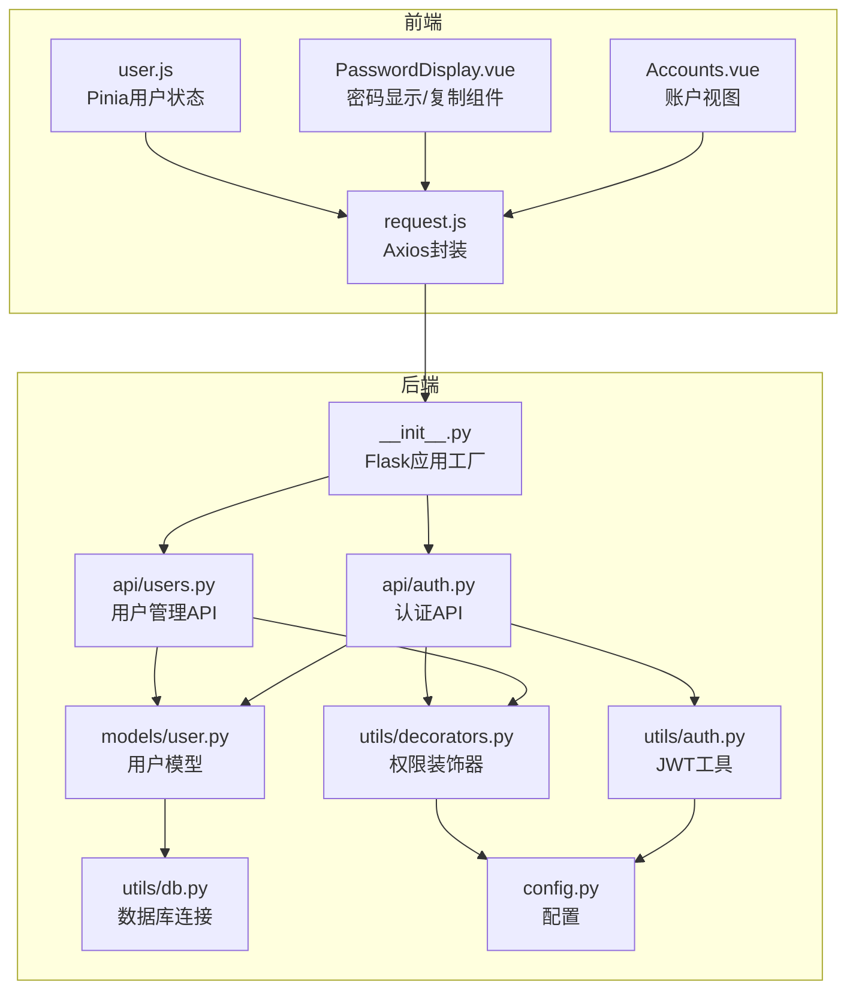
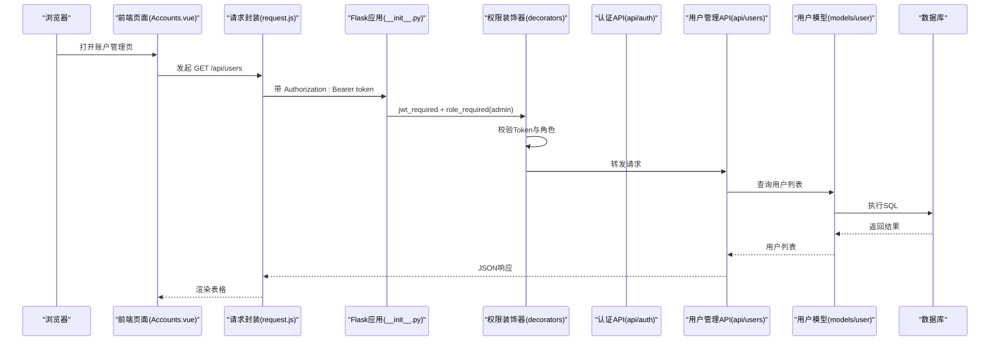
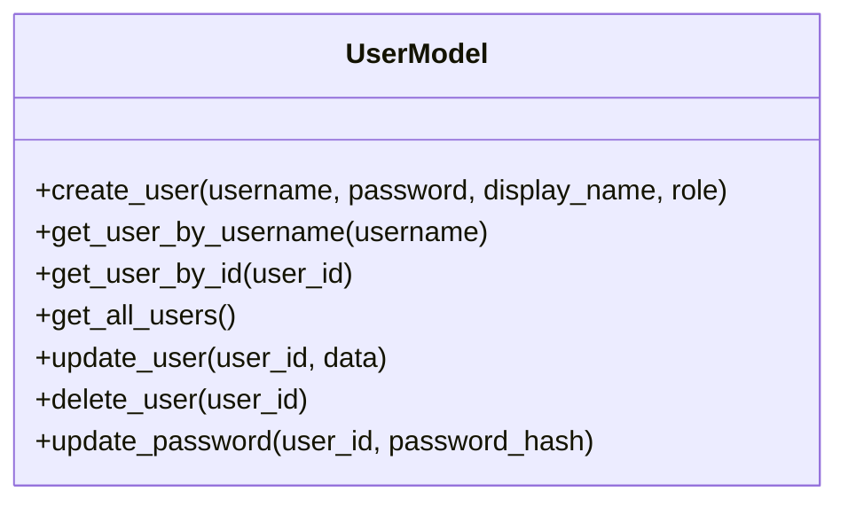
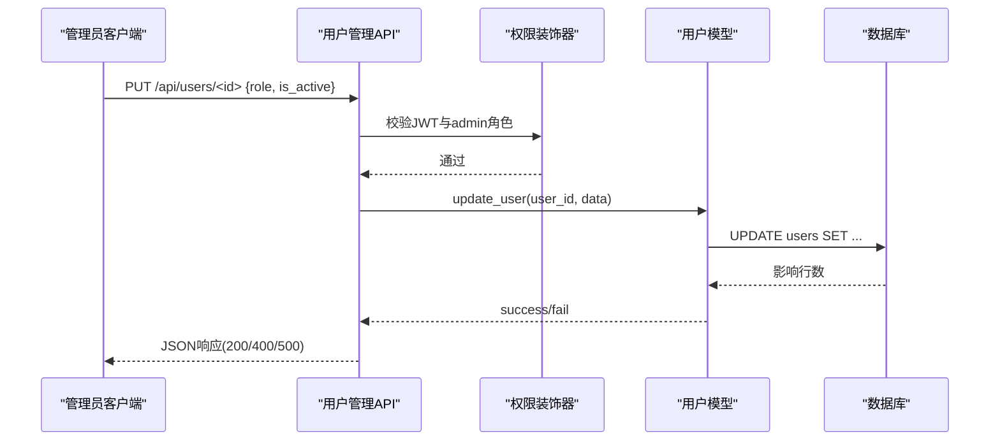
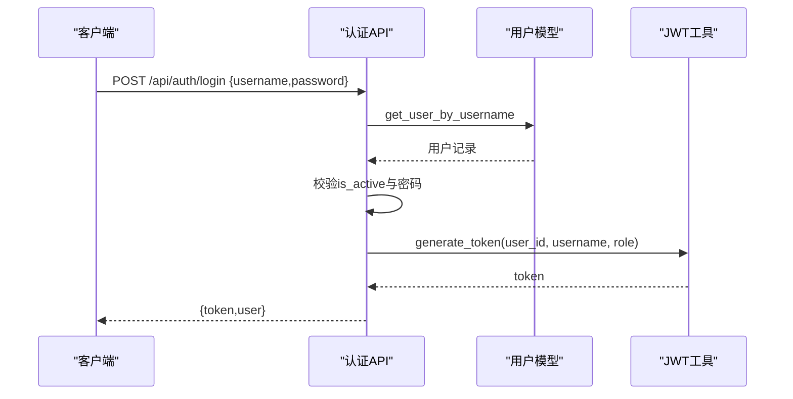
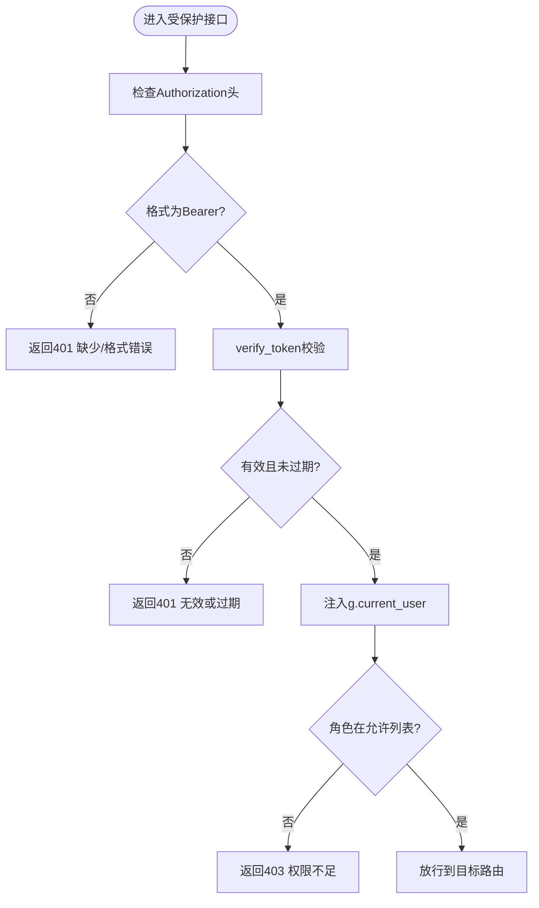
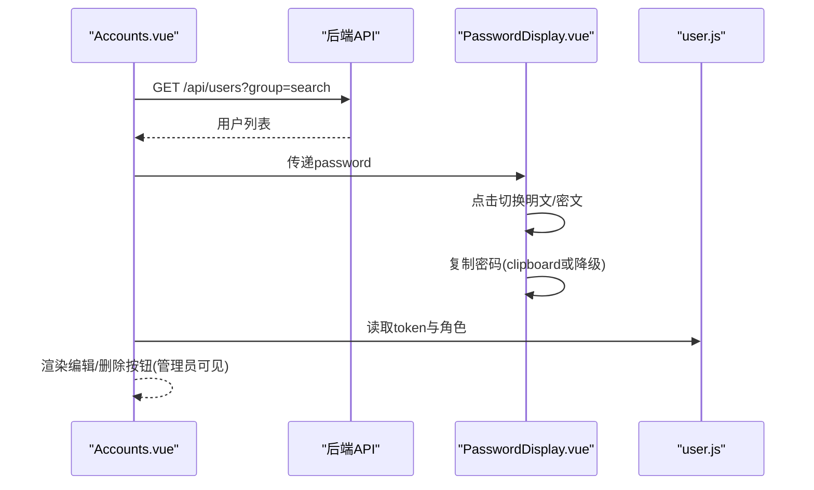
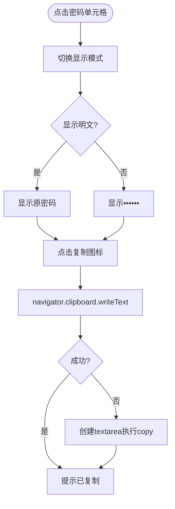
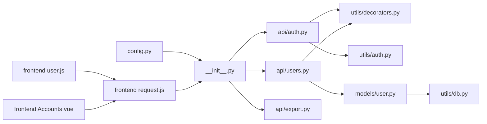

# Web账户管理

<cite>
**本文引用的文件**
- [backend/app/models/user.py](file://backend/app/models/user.py)
- [backend/app/api/users.py](file://backend/app/api/users.py)
- [backend/app/api/auth.py](file://backend/app/api/auth.py)
- [backend/app/utils/auth.py](file://backend/app/utils/auth.py)
- [backend/app/utils/decorators.py](file://backend/app/utils/decorators.py)
- [backend/app/utils/db.py](file://backend/app/utils/db.py)
- [backend/app/config.py](file://backend/app/config.py)
- [backend/app/__init__.py](file://backend/app/__init__.py)
- [frontend/src/views/Accounts.vue](file://frontend/src/views/Accounts.vue)
- [frontend/src/components/PasswordDisplay.vue](file://frontend/src/components/PasswordDisplay.vue)
- [frontend/src/stores/user.js](file://frontend/src/stores/user.js)
- [frontend/src/api/request.js](file://frontend/src/api/request.js)
- [backend/app/api/export.py](file://backend/app/api/export.py)
</cite>

## 目录
1. [简介](#简介)
2. [项目结构](#项目结构)
3. [核心组件](#核心组件)
4. [架构总览](#架构总览)
5. [详细组件分析](#详细组件分析)
6. [依赖分析](#依赖分析)
7. [性能考虑](#性能考虑)
8. [故障排除指南](#故障排除指南)
9. [结论](#结论)
10. [附录](#附录)

## 简介
本文件面向“Web账户管理”功能，系统性梳理账户信息维护、密码安全存储、账户权限管理与状态控制的完整流程；同时覆盖密码显示/隐藏控制、账户批量导出、搜索过滤等前端特性；并给出业务规则、安全策略、合规要求与最佳实践，以及故障排除与性能优化建议。文档严格基于仓库现有源码进行分析与总结。

## 项目结构
该系统采用前后端分离架构：
- 后端基于 Flask，使用蓝图组织 API，统一通过装饰器进行 JWT 认证与角色校验，数据库连接通过工具函数集中管理。
- 前端基于 Vue 3 + Element Plus，使用 Pinia 管理用户状态，Axios 封装请求拦截器统一注入 Token 并处理响应错误。

**图表来源**
- [backend/app/__init__.py:1-60](file://backend/app/__init__.py#L1-L60)
- [backend/app/api/auth.py:1-184](file://backend/app/api/auth.py#L1-L184)
- [backend/app/api/users.py:1-268](file://backend/app/api/users.py#L1-L268)
- [backend/app/models/user.py:1-183](file://backend/app/models/user.py#L1-L183)
- [backend/app/utils/auth.py:1-83](file://backend/app/utils/auth.py#L1-L83)
- [backend/app/utils/decorators.py:1-95](file://backend/app/utils/decorators.py#L1-L95)
- [backend/app/utils/db.py:1-17](file://backend/app/utils/db.py#L1-L17)
- [backend/app/config.py:1-21](file://backend/app/config.py#L1-L21)
- [frontend/src/views/Accounts.vue:1-254](file://frontend/src/views/Accounts.vue#L1-L254)
- [frontend/src/components/PasswordDisplay.vue:1-85](file://frontend/src/components/PasswordDisplay.vue#L1-L85)
- [frontend/src/api/request.js:1-54](file://frontend/src/api/request.js#L1-L54)
- [frontend/src/stores/user.js:1-41](file://frontend/src/stores/user.js#L1-L41)

**章节来源**
- [backend/app/__init__.py:1-60](file://backend/app/__init__.py#L1-L60)
- [frontend/src/views/Accounts.vue:1-254](file://frontend/src/views/Accounts.vue#L1-L254)

## 核心组件
- 用户模型层：负责用户创建、查询、更新、删除与密码更新的数据库操作。
- 用户管理 API：提供用户列表、创建、更新、删除、重置密码等接口，并受管理员权限保护。
- 认证 API：提供登录、获取当前用户资料、修改密码等能力，使用 JWT 进行认证。
- 权限装饰器：统一处理 Bearer Token 的提取、校验与角色授权。
- JWT 工具：生成与验证 JWT，包含过期时间与密钥配置。
- 数据库工具：集中管理数据库连接参数与连接获取。
- 前端账户视图：支持搜索、分组筛选、新增/编辑/删除、密码显示/隐藏与复制。
- 前端密码展示组件：点击切换明文/密文，支持复制到剪贴板。
- 前端请求封装：自动注入 Authorization 头，统一对 401 等错误进行处理。
- 前端用户状态：持久化保存 token 与用户信息，计算登录态与管理员态。

**章节来源**
- [backend/app/models/user.py:1-183](file://backend/app/models/user.py#L1-L183)
- [backend/app/api/users.py:1-268](file://backend/app/api/users.py#L1-L268)
- [backend/app/api/auth.py:1-184](file://backend/app/api/auth.py#L1-L184)
- [backend/app/utils/decorators.py:1-95](file://backend/app/utils/decorators.py#L1-L95)
- [backend/app/utils/auth.py:1-83](file://backend/app/utils/auth.py#L1-L83)
- [backend/app/utils/db.py:1-17](file://backend/app/utils/db.py#L1-L17)
- [frontend/src/views/Accounts.vue:1-254](file://frontend/src/views/Accounts.vue#L1-L254)
- [frontend/src/components/PasswordDisplay.vue:1-85](file://frontend/src/components/PasswordDisplay.vue#L1-L85)
- [frontend/src/api/request.js:1-54](file://frontend/src/api/request.js#L1-L54)
- [frontend/src/stores/user.js:1-41](file://frontend/src/stores/user.js#L1-L41)

## 架构总览
下图展示了从浏览器到后端的典型交互路径，包括认证、权限校验与用户管理操作。

**图表来源**
- [frontend/src/views/Accounts.vue:161-172](file://frontend/src/views/Accounts.vue#L161-L172)
- [frontend/src/api/request.js:14-23](file://frontend/src/api/request.js#L14-L23)
- [backend/app/__init__.py:37-60](file://backend/app/__init__.py#L37-L60)
- [backend/app/utils/decorators.py:9-57](file://backend/app/utils/decorators.py#L9-L57)
- [backend/app/api/users.py:17-31](file://backend/app/api/users.py#L17-L31)
- [backend/app/models/user.py:83-102](file://backend/app/models/user.py#L83-L102)

## 详细组件分析

### 用户模型与数据访问
- 职责：封装用户 CRUD 与密码更新的数据库操作，确保字段白名单更新与事务提交。
- 关键点：
  - 密码以哈希形式存储，不保存明文。
  - 支持按用户名/ID 查询，支持全量列表查询并按创建时间倒序。
  - 更新时仅允许指定字段（显示名、角色、激活状态）。
- 复杂度：单条记录查询/更新为 O(1)，全量查询取决于数据规模。

**图表来源**
- [backend/app/models/user.py:8-183](file://backend/app/models/user.py#L8-L183)

**章节来源**
- [backend/app/models/user.py:8-183](file://backend/app/models/user.py#L8-L183)

### 用户管理 API（管理员）
- 职责：提供用户管理的 REST 接口，受 JWT 与角色双重保护。
- 关键点：
  - 列表查询：GET /api/users
  - 创建用户：POST /api/users（校验必填、角色合法性、密码长度、用户名唯一）
  - 更新用户：PUT /api/users/<id>（字段白名单、角色合法性）
  - 删除用户：DELETE /api/users/<id>（禁止删除自身）
  - 重置密码：PUT /api/users/<id>/reset-password（校验新密码长度）
- 错误码约定：200 成功，400 参数错误/权限不足，401 未认证/被禁用，404 资源不存在，409 冲突（用户名已存在），500 服务器错误。

**图表来源**
- [backend/app/api/users.py:99-164](file://backend/app/api/users.py#L99-L164)
- [backend/app/utils/decorators.py:59-95](file://backend/app/utils/decorators.py#L59-L95)
- [backend/app/models/user.py:105-136](file://backend/app/models/user.py#L105-L136)

**章节来源**
- [backend/app/api/users.py:17-268](file://backend/app/api/users.py#L17-L268)
- [backend/app/utils/decorators.py:9-95](file://backend/app/utils/decorators.py#L9-L95)
- [backend/app/models/user.py:105-136](file://backend/app/models/user.py#L105-L136)

### 认证与密码管理
- 登录：POST /api/auth/login，校验用户是否存在、是否激活、密码正确后签发 JWT。
- 当前用户资料：GET /api/auth/profile，需 JWT。
- 修改密码：PUT /api/auth/password，校验旧密码与新密码长度，更新为哈希值。
- 密码安全：后端使用 Werkzeug 安全哈希，前端不处理密码明文；登录成功后由后端生成 token。

**图表来源**
- [backend/app/api/auth.py:14-83](file://backend/app/api/auth.py#L14-L83)
- [backend/app/models/user.py:39-58](file://backend/app/models/user.py#L39-L58)
- [backend/app/utils/auth.py:11-35](file://backend/app/utils/auth.py#L11-L35)

**章节来源**
- [backend/app/api/auth.py:14-184](file://backend/app/api/auth.py#L14-L184)
- [backend/app/utils/auth.py:11-83](file://backend/app/utils/auth.py#L11-L83)
- [backend/app/models/user.py:39-58](file://backend/app/models/user.py#L39-L58)

### 权限与认证装饰器
- jwt_required：从 Authorization 头解析 Bearer Token，解码并注入 g.current_user。
- role_required：在 jwt_required 之后使用，校验用户角色是否在允许列表中。
- 统一错误码：401 缺少/无效认证，403 权限不足。

**图表来源**
- [backend/app/utils/decorators.py:9-95](file://backend/app/utils/decorators.py#L9-L95)
- [backend/app/utils/auth.py:38-56](file://backend/app/utils/auth.py#L38-L56)

**章节来源**
- [backend/app/utils/decorators.py:9-95](file://backend/app/utils/decorators.py#L9-L95)
- [backend/app/utils/auth.py:38-83](file://backend/app/utils/auth.py#L38-L83)

### 前端账户管理视图与密码显示组件
- 搜索与过滤：支持按分组与关键词搜索，回车触发查询，重置清空条件。
- 表格列：分组、名称、地址（HTTP/HTTPS 自动链接）、用户名、密码（通过组件显示/切换/复制）、备注、操作（编辑/删除）。
- 新增/编辑弹窗：表单校验、提交加载态、成功消息、刷新列表。
- 删除确认：二次确认对话框，删除成功后刷新。
- 密码显示组件：点击切换明文/密文，支持复制到剪贴板（优先 clipboard API，失败则降级方案）。
- 用户状态：Pinia 存储 token 与用户信息，计算登录态与管理员态；退出清理本地存储。

**图表来源**
- [frontend/src/views/Accounts.vue:161-238](file://frontend/src/views/Accounts.vue#L161-L238)
- [frontend/src/components/PasswordDisplay.vue:25-45](file://frontend/src/components/PasswordDisplay.vue#L25-L45)
- [frontend/src/stores/user.js:13-40](file://frontend/src/stores/user.js#L13-L40)

**章节来源**
- [frontend/src/views/Accounts.vue:1-254](file://frontend/src/views/Accounts.vue#L1-L254)
- [frontend/src/components/PasswordDisplay.vue:1-85](file://frontend/src/components/PasswordDisplay.vue#L1-L85)
- [frontend/src/stores/user.js:1-41](file://frontend/src/stores/user.js#L1-L41)

### 密码显示/隐藏与复制流程

**图表来源**
- [frontend/src/components/PasswordDisplay.vue:25-45](file://frontend/src/components/PasswordDisplay.vue#L25-L45)

**章节来源**
- [frontend/src/components/PasswordDisplay.vue:1-85](file://frontend/src/components/PasswordDisplay.vue#L1-L85)

### 账户批量导出（扩展能力）
- 导出接口：GET /api/export/excel，生成包含多个工作表的 Excel 文件（服务器管理、服务管理、应用系统、域名证书）。
- 安全：受 JWT 保护；导出过程中对空值与日期类型进行安全处理。
- 注意：当前仓库未提供“账户资产”专用导出接口，但系统具备通用导出能力，可按需扩展。

**章节来源**
- [backend/app/api/export.py:64-261](file://backend/app/api/export.py#L64-L261)

## 依赖分析
- 后端依赖关系：
  - Flask 应用工厂注册各蓝图，CORS 放通 /api/*。
  - 认证与用户管理均依赖权限装饰器与 JWT 工具。
  - 用户模型依赖数据库工具获取连接。
  - 配置集中于 Config 类，贯穿应用生命周期。
- 前端依赖关系：
  - Axios 封装统一注入 token 并处理 401。
  - Pinia 管理用户状态，持久化至 localStorage。
  - 组件复用 Element Plus 与自定义组件。

**图表来源**
- [backend/app/config.py:1-21](file://backend/app/config.py#L1-L21)
- [backend/app/__init__.py:37-60](file://backend/app/__init__.py#L37-L60)
- [backend/app/api/auth.py:1-184](file://backend/app/api/auth.py#L1-L184)
- [backend/app/api/users.py:1-268](file://backend/app/api/users.py#L1-L268)
- [backend/app/api/export.py:1-261](file://backend/app/api/export.py#L1-L261)
- [backend/app/utils/decorators.py:1-95](file://backend/app/utils/decorators.py#L1-L95)
- [backend/app/utils/auth.py:1-83](file://backend/app/utils/auth.py#L1-L83)
- [backend/app/models/user.py:1-183](file://backend/app/models/user.py#L1-L183)
- [backend/app/utils/db.py:1-17](file://backend/app/utils/db.py#L1-L17)
- [frontend/src/api/request.js:1-54](file://frontend/src/api/request.js#L1-L54)
- [frontend/src/stores/user.js:1-41](file://frontend/src/stores/user.js#L1-L41)
- [frontend/src/views/Accounts.vue:1-254](file://frontend/src/views/Accounts.vue#L1-L254)

**章节来源**
- [backend/app/__init__.py:37-60](file://backend/app/__init__.py#L37-L60)
- [frontend/src/api/request.js:1-54](file://frontend/src/api/request.js#L1-L54)

## 性能考虑
- 数据库查询：
  - 用户列表查询使用 ORDER BY 创建时间倒序，建议在相关列建立索引以提升排序与筛选性能。
  - 单条查询（按用户名/ID）应确保对应索引命中。
- 前端渲染：
  - 大列表场景建议启用虚拟滚动与分页；当前表格为全量一次性渲染，建议结合后端分页接口优化。
- 网络与缓存：
  - Axios 默认超时 15 秒，可根据网络环境调整；避免重复请求相同数据，合理利用本地状态缓存。
- 导出性能：
  - Excel 导出涉及多表写入与样式设置，建议限制导出范围与并发调用，必要时异步处理并在前端轮询结果。

[本节为通用性能建议，无需特定文件引用]

## 故障排除指南
- 登录失败/401：
  - 检查用户名/密码是否正确；确认用户处于激活状态；核对 JWT 密钥与过期时间配置。
  - 参考：[backend/app/api/auth.py:40-62](file://backend/app/api/auth.py#L40-L62)、[backend/app/utils/auth.py:38-56](file://backend/app/utils/auth.py#L38-L56)、[backend/app/config.py:4-7](file://backend/app/config.py#L4-L7)
- 权限不足/403：
  - 确认当前用户角色满足接口所需角色；检查装饰器顺序（先 jwt_required 再 role_required）。
  - 参考：[backend/app/utils/decorators.py:59-95](file://backend/app/utils/decorators.py#L59-L95)
- Token 过期/丢失：
  - 前端响应拦截器会在 401 时清除本地 token 并跳转登录；重新登录获取新 token。
  - 参考：[frontend/src/api/request.js:35-51](file://frontend/src/api/request.js#L35-L51)
- 密码复制失败：
  - 浏览器安全策略限制非 HTTPS 或用户手势外的剪贴板访问；组件已内置降级方案。
  - 参考：[frontend/src/components/PasswordDisplay.vue:29-45](file://frontend/src/components/PasswordDisplay.vue#L29-L45)
- 用户名冲突/409：
  - 创建用户时若用户名已存在会返回 409；请更换用户名后重试。
  - 参考：[backend/app/api/users.py:77-84](file://backend/app/api/users.py#L77-L84)
- 删除自身失败/400：
  - 管理员不可删除当前登录用户；请使用其他管理员账户执行删除。
  - 参考：[backend/app/api/users.py:175-182](file://backend/app/api/users.py#L175-L182)

**章节来源**
- [backend/app/api/auth.py:40-62](file://backend/app/api/auth.py#L40-L62)
- [backend/app/utils/auth.py:38-56](file://backend/app/utils/auth.py#L38-L56)
- [backend/app/config.py:4-7](file://backend/app/config.py#L4-L7)
- [backend/app/utils/decorators.py:59-95](file://backend/app/utils/decorators.py#L59-L95)
- [frontend/src/api/request.js:35-51](file://frontend/src/api/request.js#L35-L51)
- [frontend/src/components/PasswordDisplay.vue:29-45](file://frontend/src/components/PasswordDisplay.vue#L29-L45)
- [backend/app/api/users.py:77-84](file://backend/app/api/users.py#L77-L84)
- [backend/app/api/users.py:175-182](file://backend/app/api/users.py#L175-L182)

## 结论
本系统围绕“账户管理”提供了完整的认证、授权、用户管理与前端交互能力。后端通过装饰器统一处理 JWT 与角色校验，模型层保证密码安全存储与字段白名单更新；前端提供直观的搜索、编辑与密码显示/复制体验。建议后续补充“账户资产”专用导出接口与分页查询，持续优化大列表渲染与导出性能，并强化生产环境密钥与配置管理。

[本节为总结性内容，无需特定文件引用]

## 附录

### 业务规则与合规要点
- 密码策略：新密码长度不少于 6 位；密码以哈希形式存储，不保留明文。
- 角色体系：admin（管理员）、operator（操作员）、viewer（只读），不同角色访问受限。
- 账户状态：is_active 控制是否允许登录。
- 安全传输：生产环境建议启用 HTTPS；JWT 密钥与 Secret Key 必须妥善保管并定期轮换。
- 日志与审计：建议在认证与敏感操作（密码重置、用户删除）处增加审计日志。

[本节为通用合规建议，无需特定文件引用]

### 最佳实践
- 后端：
  - 将数据库凭据与密钥置于环境变量，避免硬编码。
  - 对外暴露的 API 增加速率限制与输入校验。
  - 导出等耗时操作采用异步任务与进度反馈。
- 前端：
  - 本地存储 token 时注意安全上下文（HTTPS、SameSite 策略）。
  - 对大列表使用分页或虚拟滚动，减少 DOM 压力。
  - 统一错误提示与国际化支持。

[本节为通用最佳实践，无需特定文件引用]