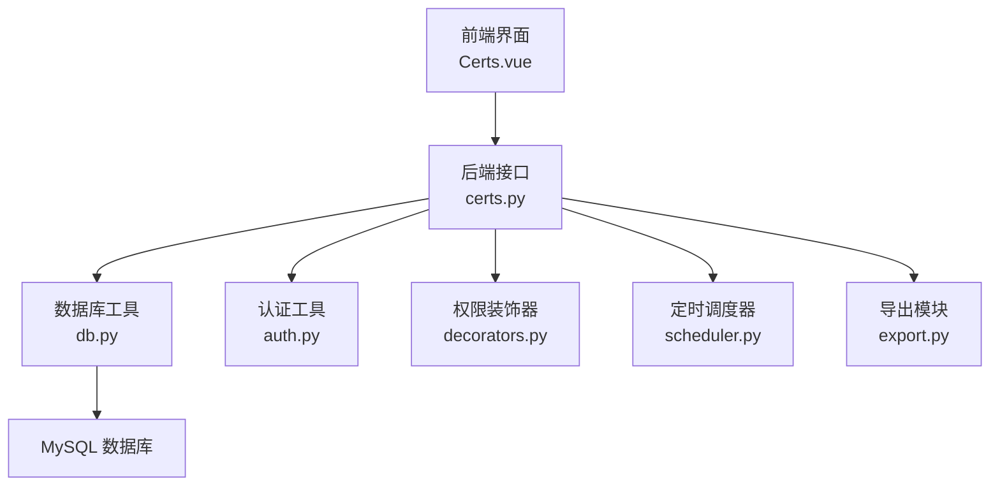
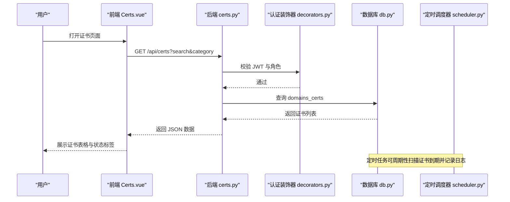
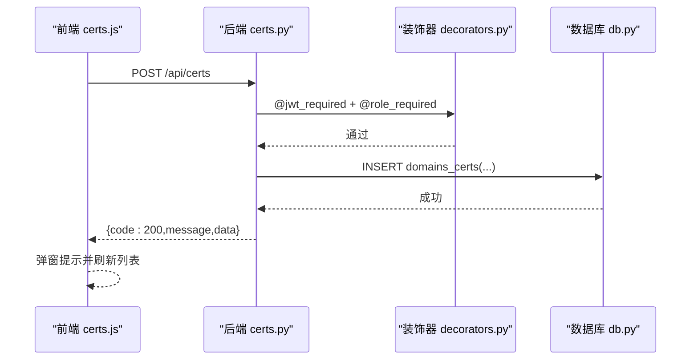
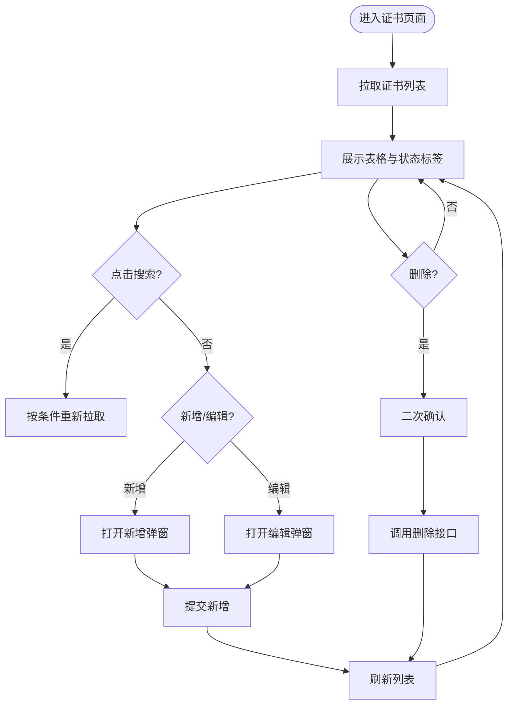
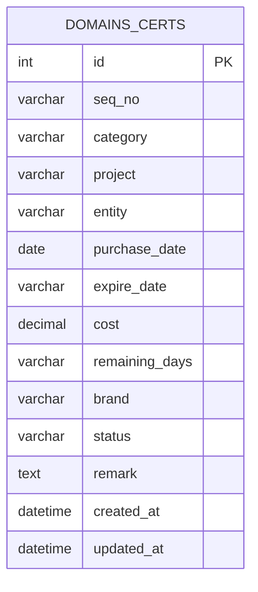
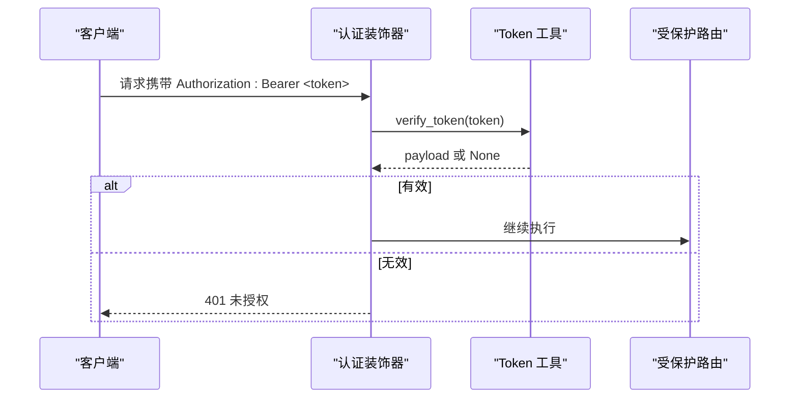
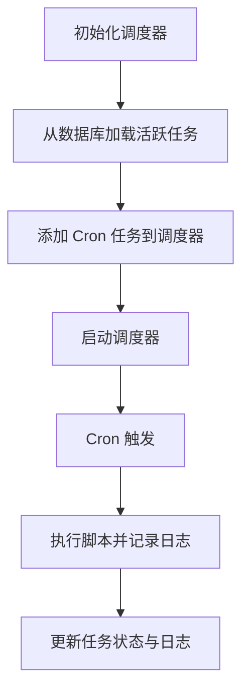
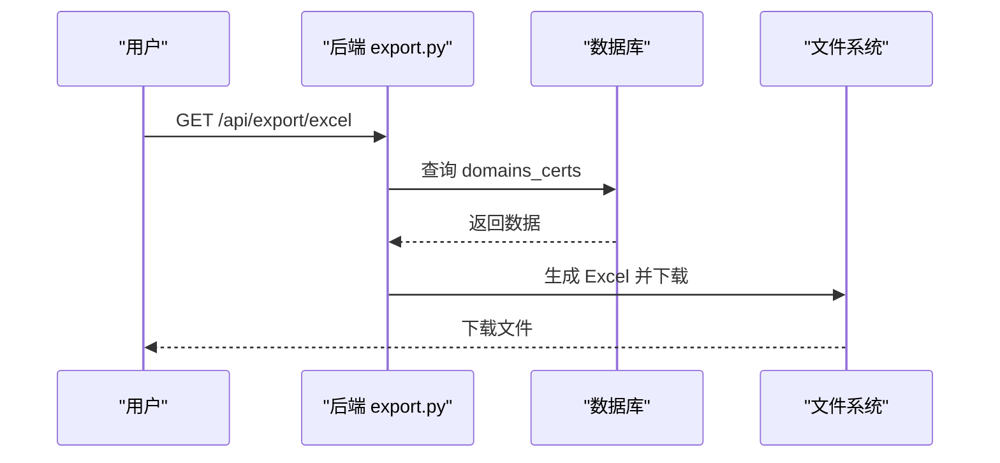
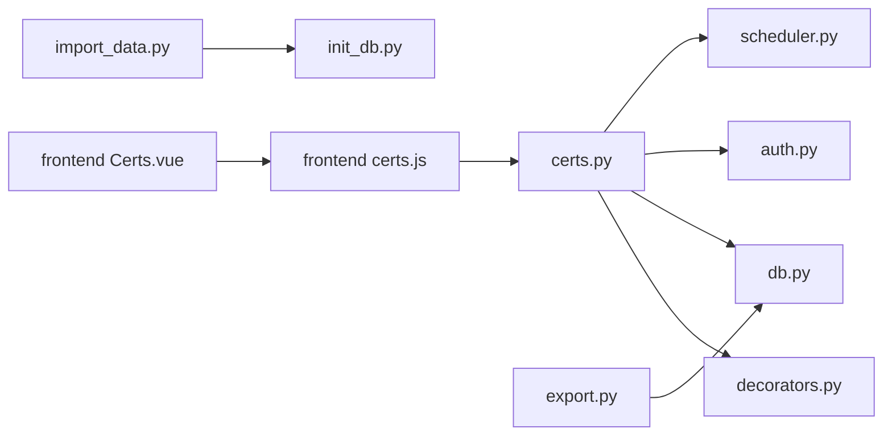

# 域名证书管理

<cite>
**本文引用的文件**
- [backend/app/api/certs.py](file://backend/app/api/certs.py)
- [frontend/src/views/Certs.vue](file://frontend/src/views/Certs.vue)
- [frontend/src/api/certs.js](file://frontend/src/api/certs.js)
- [backend/init_db.py](file://backend/init_db.py)
- [backend/import_data.py](file://backend/import_data.py)
- [backend/app/utils/db.py](file://backend/app/utils/db.py)
- [backend/app/utils/decorators.py](file://backend/app/utils/decorators.py)
- [backend/app/utils/auth.py](file://backend/app/utils/auth.py)
- [backend/app/utils/scheduler.py](file://backend/app/utils/scheduler.py)
- [backend/app/api/export.py](file://backend/app/api/export.py)
- [backend/app/config.py](file://backend/app/config.py)
</cite>

## 目录
1. [简介](#简介)
2. [项目结构](#项目结构)
3. [核心组件](#核心组件)
4. [架构总览](#架构总览)
5. [详细组件分析](#详细组件分析)
6. [依赖分析](#依赖分析)
7. [性能考虑](#性能考虑)
8. [故障排查指南](#故障排查指南)
9. [结论](#结论)
10. [附录](#附录)

## 简介
本项目提供“域名证书资产管理”的专业能力，覆盖证书信息维护、到期日期监控、证书状态跟踪、证书链管理、证书续期提醒等。系统支持证书数据的安全存储、过期预警机制、证书有效性验证、证书导入导出等功能，并提供合规要求、安全最佳实践、自动化监控策略与故障处理流程，以及运维指南与扩展开发建议。

## 项目结构
系统采用前后端分离架构：
- 后端基于 Flask，提供 REST API，负责认证鉴权、数据库访问、定时任务调度与数据导出。
- 前端基于 Vue 3 + Element Plus，提供证书资产的增删改查、搜索筛选、状态标签展示与导入导出交互。
- 数据库采用 MySQL，初始化脚本创建证书资产表及相关的运维数据表。

图表来源
- [backend/app/api/certs.py:1-145](file://backend/app/api/certs.py#L1-L145)
- [backend/app/utils/db.py:1-17](file://backend/app/utils/db.py#L1-L17)
- [backend/app/utils/auth.py:1-83](file://backend/app/utils/auth.py#L1-L83)
- [backend/app/utils/decorators.py:1-95](file://backend/app/utils/decorators.py#L1-L95)
- [backend/app/utils/scheduler.py:1-249](file://backend/app/utils/scheduler.py#L1-L249)
- [backend/app/api/export.py:1-261](file://backend/app/api/export.py#L1-L261)

章节来源
- [backend/app/api/certs.py:1-145](file://backend/app/api/certs.py#L1-L145)
- [frontend/src/views/Certs.vue:1-336](file://frontend/src/views/Certs.vue#L1-L336)
- [backend/init_db.py:111-131](file://backend/init_db.py#L111-L131)

## 核心组件
- 证书资产管理 API：提供证书列表查询、新增、更新、删除等接口，支持按分类与关键词检索。
- 前端证书页面：提供搜索、新增/编辑弹窗、状态标签、操作按钮等交互。
- 数据库层：提供统一数据库连接工具，初始化脚本创建证书资产表与索引。
- 认证与权限：JWT 认证与角色权限控制，确保仅授权用户可进行证书资产变更。
- 定时任务调度：支持基于 Cron 的定时任务，可用于证书到期监控与续期提醒等自动化流程。
- 导出模块：支持将证书资产导出为 Excel 文件，便于审计与归档。

章节来源
- [backend/app/api/certs.py:11-145](file://backend/app/api/certs.py#L11-L145)
- [frontend/src/views/Certs.vue:1-336](file://frontend/src/views/Certs.vue#L1-L336)
- [backend/init_db.py:111-131](file://backend/init_db.py#L111-L131)
- [backend/app/utils/db.py:1-17](file://backend/app/utils/db.py#L1-L17)
- [backend/app/utils/decorators.py:9-95](file://backend/app/utils/decorators.py#L9-L95)
- [backend/app/utils/auth.py:11-83](file://backend/app/utils/auth.py#L11-L83)
- [backend/app/utils/scheduler.py:1-249](file://backend/app/utils/scheduler.py#L1-L249)
- [backend/app/api/export.py:64-261](file://backend/app/api/export.py#L64-L261)

## 架构总览
系统通过前端页面发起请求，后端接口经认证与权限校验后访问数据库，实现证书资产的全生命周期管理；定时任务调度器可按计划执行脚本以实现自动化监控与提醒；导出模块支持将证书资产导出为 Excel 文件。

图表来源
- [frontend/src/views/Certs.vue:214-222](file://frontend/src/views/Certs.vue#L214-L222)
- [backend/app/api/certs.py:11-44](file://backend/app/api/certs.py#L11-L44)
- [backend/app/utils/decorators.py:9-57](file://backend/app/utils/decorators.py#L9-L57)
- [backend/app/utils/db.py:5-17](file://backend/app/utils/db.py#L5-L17)
- [backend/app/utils/scheduler.py:201-249](file://backend/app/utils/scheduler.py#L201-L249)

## 详细组件分析

### 证书资产管理 API
- 接口职责
  - 获取证书列表：支持按分类与关键词检索，返回证书集合。
  - 新增证书：插入证书资产记录，包含编号、分类、项目、主体、购买日期、到期日期、费用、剩余天数、品牌、状态、备注等字段。
  - 更新证书：按需更新指定字段，避免全量覆盖。
  - 删除证书：按 ID 删除证书资产记录。
- 安全与权限
  - 所有接口均需 JWT 认证，且仅允许管理员与操作员角色访问。
- 错误处理
  - 数据库异常时回滚事务并返回错误信息。

图表来源
- [frontend/src/api/certs.js:7-9](file://frontend/src/api/certs.js#L7-L9)
- [backend/app/api/certs.py:46-81](file://backend/app/api/certs.py#L46-L81)
- [backend/app/utils/decorators.py:59-95](file://backend/app/utils/decorators.py#L59-L95)
- [backend/app/utils/db.py:5-17](file://backend/app/utils/db.py#L5-L17)

章节来源
- [backend/app/api/certs.py:11-145](file://backend/app/api/certs.py#L11-L145)
- [backend/app/utils/decorators.py:9-95](file://backend/app/utils/decorators.py#L9-L95)

### 前端证书页面与交互
- 功能特性
  - 搜索区：支持按分类与关键词搜索。
  - 数据表格：展示编号、分类、项目、主体、购买日期、到期日期、费用、剩余天数、品牌、状态、备注等字段。
  - 状态标签：根据剩余天数与状态动态渲染颜色，直观提示风险等级。
  - 新增/编辑弹窗：表单字段覆盖主要业务字段，支持必填校验。
  - 操作按钮：支持编辑与删除，删除前二次确认。
- 数据流
  - 页面挂载时拉取证书列表。
  - 新增/编辑提交后刷新列表。
  - 删除后提示成功并刷新。

图表来源
- [frontend/src/views/Certs.vue:210-294](file://frontend/src/views/Certs.vue#L210-L294)

章节来源
- [frontend/src/views/Certs.vue:1-336](file://frontend/src/views/Certs.vue#L1-L336)
- [frontend/src/api/certs.js:1-18](file://frontend/src/api/certs.js#L1-L18)

### 数据模型与初始化
- 数据表：domains_certs
  - 主要字段：编号、分类、项目、主体、购买日期、到期日期、费用、剩余天数、品牌、状态、备注等。
  - 索引：按分类与状态建立索引，提升查询效率。
- 初始化脚本：创建数据库与表结构，插入默认管理员账户。

图表来源
- [backend/init_db.py:111-131](file://backend/init_db.py#L111-L131)

章节来源
- [backend/init_db.py:111-131](file://backend/init_db.py#L111-L131)

### 认证与权限控制
- JWT 生成与验证：提供生成 Token、验证 Token 的工具函数，支持配置过期时间与密钥。
- 权限装饰器：统一处理 Authorization 头解析、Token 校验与角色检查，确保接口安全访问。

图表来源
- [backend/app/utils/decorators.py:9-57](file://backend/app/utils/decorators.py#L9-L57)
- [backend/app/utils/auth.py:38-56](file://backend/app/utils/auth.py#L38-L56)

章节来源
- [backend/app/utils/auth.py:1-83](file://backend/app/utils/auth.py#L1-L83)
- [backend/app/utils/decorators.py:1-95](file://backend/app/utils/decorators.py#L1-L95)

### 定时任务调度与自动化监控
- 调度器：基于 APScheduler，支持 Cron 表达式，可加载数据库中的定时任务并执行。
- 任务执行：在子线程中执行外部脚本，记录任务日志、状态、输出与错误信息。
- 应用场景：可用于证书到期扫描、续期提醒、健康检查等自动化流程。

图表来源
- [backend/app/utils/scheduler.py:201-249](file://backend/app/utils/scheduler.py#L201-L249)

章节来源
- [backend/app/utils/scheduler.py:1-249](file://backend/app/utils/scheduler.py#L1-L249)

### 导入导出与合规归档
- 导出：支持将证书资产导出为 Excel，包含表头样式、列宽适配与安全值处理。
- 导入：支持从 Excel 导入证书资产，清洗数据并写入数据库。
- 合规：导出文件可用于审计与合规归档，导入流程保证数据一致性。

图表来源
- [backend/app/api/export.py:64-261](file://backend/app/api/export.py#L64-L261)
- [backend/import_data.py:274-321](file://backend/import_data.py#L274-L321)

章节来源
- [backend/app/api/export.py:1-261](file://backend/app/api/export.py#L1-L261)
- [backend/import_data.py:1-325](file://backend/import_data.py#L1-L325)

## 依赖分析
- 组件耦合
  - 证书 API 依赖认证装饰器与数据库工具，保持高内聚低耦合。
  - 前端通过统一 API 模块与后端交互，避免直接依赖具体接口实现。
- 外部依赖
  - Flask、PyMySQL、APScheduler、openpyxl、Element Plus 等。
- 潜在风险
  - 定时任务执行超时与异常需完善日志与告警。
  - 导入导出流程需校验数据完整性与类型转换。

图表来源
- [backend/app/api/certs.py:1-145](file://backend/app/api/certs.py#L1-L145)
- [backend/app/utils/decorators.py:1-95](file://backend/app/utils/decorators.py#L1-L95)
- [backend/app/utils/db.py:1-17](file://backend/app/utils/db.py#L1-L17)
- [backend/app/utils/auth.py:1-83](file://backend/app/utils/auth.py#L1-L83)
- [backend/app/utils/scheduler.py:1-249](file://backend/app/utils/scheduler.py#L1-L249)
- [backend/app/api/export.py:1-261](file://backend/app/api/export.py#L1-L261)
- [backend/import_data.py:1-325](file://backend/import_data.py#L1-L325)
- [frontend/src/api/certs.js:1-18](file://frontend/src/api/certs.js#L1-L18)
- [frontend/src/views/Certs.vue:1-336](file://frontend/src/views/Certs.vue#L1-L336)

## 性能考虑
- 查询优化
  - domains_certs 表已建立分类与状态索引，建议在高频查询字段上保持索引策略。
- 导出性能
  - 导出模块使用内存缓冲与固定列宽策略，建议在大数据量时分页或异步导出。
- 定时任务
  - 任务执行设置超时保护与线程隔离，避免阻塞调度器。
- 前端交互
  - 表格加载使用 Loading 状态，减少重复请求与闪烁。

## 故障排查指南
- 认证失败
  - 确认 Authorization 头格式为 Bearer Token，Token 未过期。
  - 检查 JWT 密钥与过期时间配置。
- 权限不足
  - 确认用户角色包含 admin 或 operator。
- 数据库异常
  - 检查数据库连接参数与网络连通性，查看事务回滚日志。
- 导出失败
  - 检查导出接口异常处理与日志输出。
- 定时任务未执行
  - 检查 Cron 表达式格式与调度器状态，确认脚本路径存在。

章节来源
- [backend/app/utils/decorators.py:20-57](file://backend/app/utils/decorators.py#L20-L57)
- [backend/app/utils/auth.py:38-56](file://backend/app/utils/auth.py#L38-L56)
- [backend/app/utils/db.py:5-17](file://backend/app/utils/db.py#L5-L17)
- [backend/app/api/export.py:256-258](file://backend/app/api/export.py#L256-L258)
- [backend/app/utils/scheduler.py:146-186](file://backend/app/utils/scheduler.py#L146-L186)

## 结论
本系统提供了完整的域名证书资产管理能力，涵盖信息维护、状态跟踪、到期监控、导入导出与自动化调度。通过严格的认证与权限控制、完善的错误处理与日志记录，满足企业级运维与合规需求。建议在生产环境中强化密钥管理、完善告警机制与备份策略，并持续优化查询与导出性能。

## 附录

### 运维指南
- 配置管理
  - 通过环境变量配置数据库与 JWT 参数，避免硬编码。
- 安全最佳实践
  - 定期轮换 JWT 密钥，限制 Token 过期时间，最小化权限授予。
- 自动化监控
  - 使用定时任务扫描证书到期并记录日志，结合告警系统推送通知。
- 数据治理
  - 导入前校验 Excel 数据格式，导出后定期归档至合规存储。

章节来源
- [backend/app/config.py:4-21](file://backend/app/config.py#L4-L21)
- [backend/app/utils/auth.py:11-35](file://backend/app/utils/auth.py#L11-L35)
- [backend/app/utils/scheduler.py:146-186](file://backend/app/utils/scheduler.py#L146-L186)
- [backend/app/api/export.py:64-261](file://backend/app/api/export.py#L64-L261)