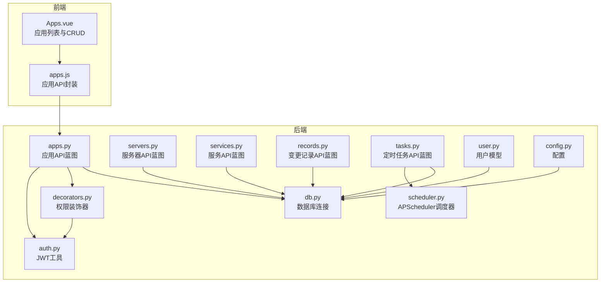
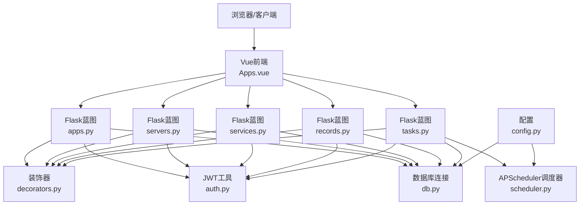
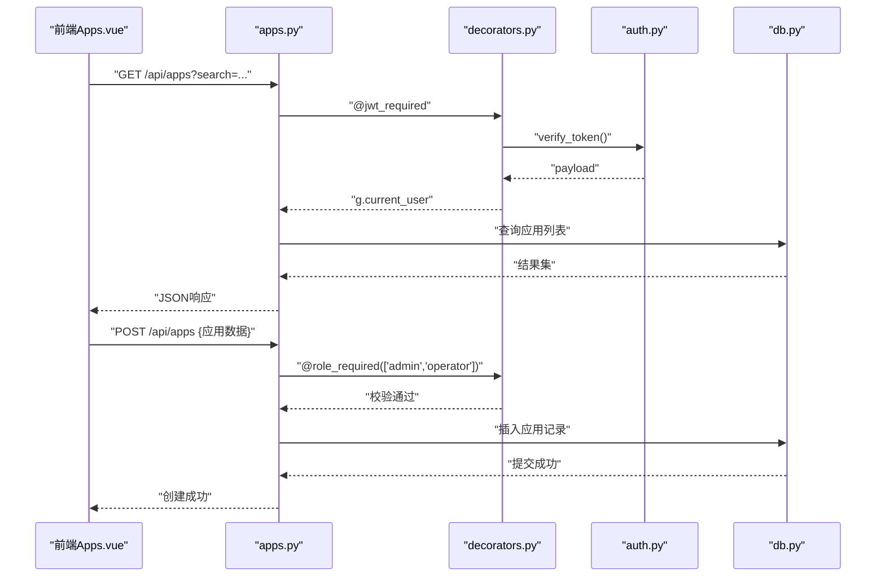
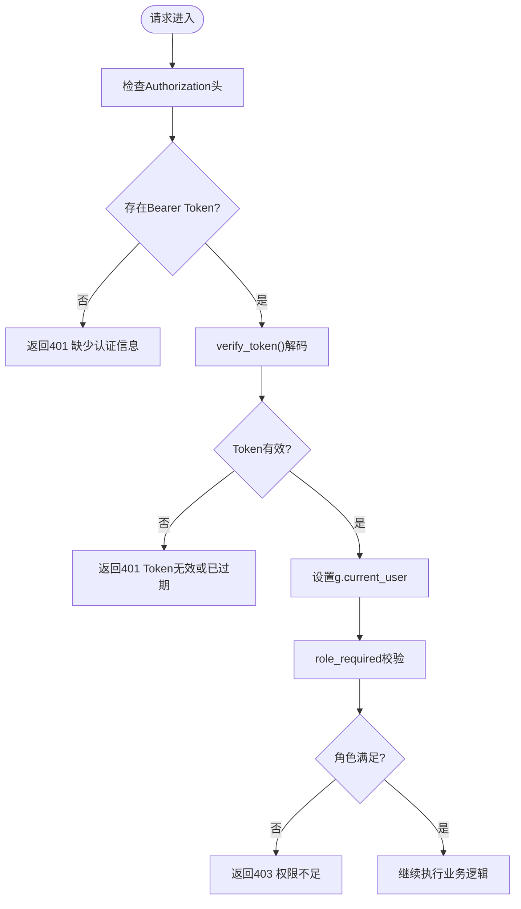
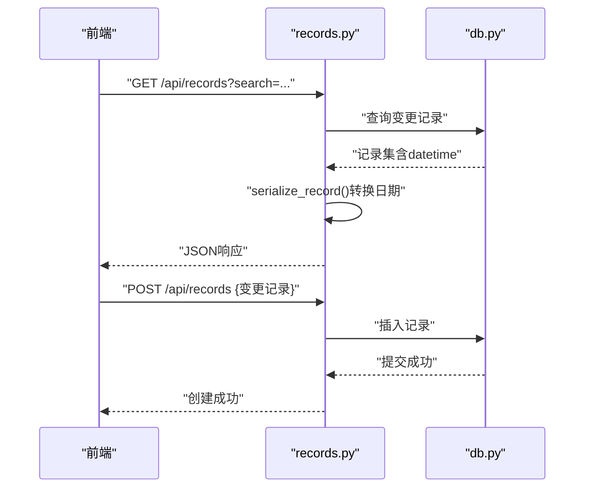
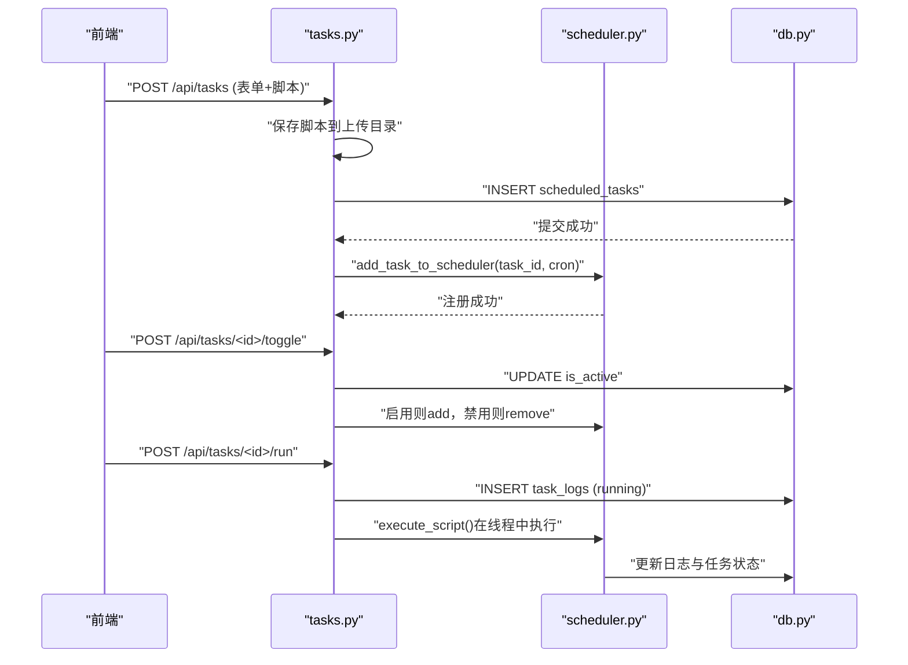
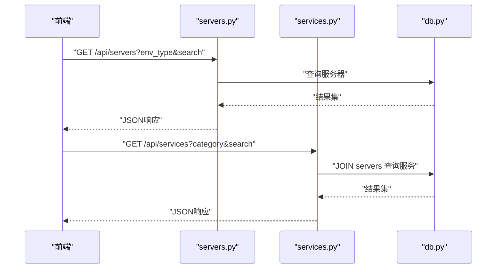
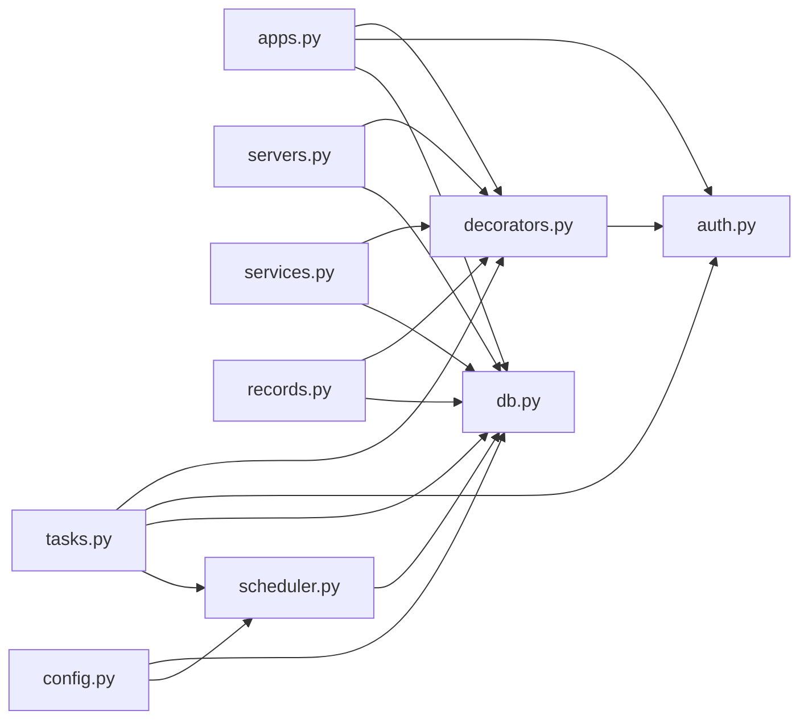

# 应用系统管理

<cite>
**本文引用的文件**
- [apps.py](file://backend/app/api/apps.py)
- [servers.py](file://backend/app/api/servers.py)
- [services.py](file://backend/app/api/services.py)
- [records.py](file://backend/app/api/records.py)
- [tasks.py](file://backend/app/api/tasks.py)
- [db.py](file://backend/app/utils/db.py)
- [decorators.py](file://backend/app/utils/decorators.py)
- [auth.py](file://backend/app/utils/auth.py)
- [scheduler.py](file://backend/app/utils/scheduler.py)
- [config.py](file://backend/app/config.py)
- [user.py](file://backend/app/models/user.py)
- [Apps.vue](file://frontend/src/views/Apps.vue)
- [apps.js](file://frontend/src/api/apps.js)
</cite>

## 目录
1. [简介](#简介)
2. [项目结构](#项目结构)
3. [核心组件](#核心组件)
4. [架构总览](#架构总览)
5. [详细组件分析](#详细组件分析)
6. [依赖分析](#依赖分析)
7. [性能考虑](#性能考虑)
8. [故障排查指南](#故障排查指南)
9. [结论](#结论)
10. [附录](#附录)

## 简介
本文件面向“应用系统管理”功能，系统性梳理应用资产的全生命周期管理能力，包括应用基本信息管理、公司归属标识、访问凭证管理、应用与服务器/服务的关联关系、部署信息跟踪以及变更历史记录等。文档同时覆盖权限控制机制、数据完整性保障、前端交互流程与后端接口实现之间的映射关系，并提供扩展开发建议。

## 项目结构
后端采用 Flask 微服务风格，按功能模块划分蓝图；前端基于 Vue 3 + Element Plus 构建，通过统一请求封装调用后端 API。整体采用前后端分离架构，后端负责数据持久化与业务逻辑，前端负责展示与交互。

图表来源
- [apps.py:1-139](file://backend/app/api/apps.py#L1-L139)
- [servers.py:1-203](file://backend/app/api/servers.py#L1-L203)
- [services.py:1-144](file://backend/app/api/services.py#L1-L144)
- [records.py:1-114](file://backend/app/api/records.py#L1-L114)
- [tasks.py:1-458](file://backend/app/api/tasks.py#L1-L458)
- [db.py:1-17](file://backend/app/utils/db.py#L1-L17)
- [auth.py:1-83](file://backend/app/utils/auth.py#L1-L83)
- [decorators.py:1-95](file://backend/app/utils/decorators.py#L1-L95)
- [scheduler.py:1-249](file://backend/app/utils/scheduler.py#L1-L249)
- [config.py:1-21](file://backend/app/config.py#L1-L21)
- [user.py:1-183](file://backend/app/models/user.py#L1-L183)
- [Apps.vue:1-227](file://frontend/src/views/Apps.vue#L1-L227)
- [apps.js:1-18](file://frontend/src/api/apps.js#L1-L18)

章节来源
- [apps.py:1-139](file://backend/app/api/apps.py#L1-L139)
- [servers.py:1-203](file://backend/app/api/servers.py#L1-L203)
- [services.py:1-144](file://backend/app/api/services.py#L1-L144)
- [records.py:1-114](file://backend/app/api/records.py#L1-L114)
- [tasks.py:1-458](file://backend/app/api/tasks.py#L1-L458)
- [db.py:1-17](file://backend/app/utils/db.py#L1-L17)
- [auth.py:1-83](file://backend/app/utils/auth.py#L1-L83)
- [decorators.py:1-95](file://backend/app/utils/decorators.py#L1-L95)
- [scheduler.py:1-249](file://backend/app/utils/scheduler.py#L1-L249)
- [config.py:1-21](file://backend/app/config.py#L1-L21)
- [user.py:1-183](file://backend/app/models/user.py#L1-L183)
- [Apps.vue:1-227](file://frontend/src/views/Apps.vue#L1-L227)
- [apps.js:1-18](file://frontend/src/api/apps.js#L1-L18)

## 核心组件
- 应用管理 API：提供应用资产的增删改查、搜索过滤、字段级更新等能力，支持序列号、名称、公司、访问地址、登录凭证与备注等字段。
- 权限与认证：基于 JWT 的认证与授权，支持角色校验（admin/operator/viewer），确保敏感操作受控。
- 数据库连接：集中化的数据库连接工厂，支持环境变量注入配置。
- 变更记录：提供变更记录的增删查能力，支持按修改人、地点、内容等维度检索。
- 定时任务：支持脚本型定时任务的创建、启停、手动执行与日志查看，具备脚本文件上传与版本化命名。
- 用户模型：提供用户创建、查询、更新、删除与密码更新等基础能力。
- 前端应用视图：提供应用列表展示、搜索、新增/编辑弹窗、删除确认等交互。

章节来源
- [apps.py:11-139](file://backend/app/api/apps.py#L11-L139)
- [decorators.py:9-95](file://backend/app/utils/decorators.py#L9-L95)
- [db.py:5-17](file://backend/app/utils/db.py#L5-L17)
- [records.py:20-114](file://backend/app/api/records.py#L20-L114)
- [tasks.py:33-458](file://backend/app/api/tasks.py#L33-L458)
- [user.py:8-183](file://backend/app/models/user.py#L8-L183)
- [Apps.vue:101-227](file://frontend/src/views/Apps.vue#L101-L227)

## 架构总览
后端以蓝图形式组织 API，统一通过装饰器进行认证与授权；数据库连接由工具模块提供；定时任务通过 APScheduler 调度器异步执行脚本并记录日志；前端通过封装的 API 模块与后端交互。

图表来源
- [apps.py:1-139](file://backend/app/api/apps.py#L1-L139)
- [servers.py:1-203](file://backend/app/api/servers.py#L1-L203)
- [services.py:1-144](file://backend/app/api/services.py#L1-L144)
- [records.py:1-114](file://backend/app/api/records.py#L1-L114)
- [tasks.py:1-458](file://backend/app/api/tasks.py#L1-L458)
- [decorators.py:1-95](file://backend/app/utils/decorators.py#L1-L95)
- [auth.py:1-83](file://backend/app/utils/auth.py#L1-L83)
- [db.py:1-17](file://backend/app/utils/db.py#L1-L17)
- [scheduler.py:1-249](file://backend/app/utils/scheduler.py#L1-L249)
- [config.py:1-21](file://backend/app/config.py#L1-L21)

## 详细组件分析

### 应用系统管理 API
- 功能要点
  - 列表查询：支持关键词搜索（应用名称、公司、访问地址），排序按主键升序。
  - 新增应用：写入序列号、名称、公司、访问地址、用户名、密码、备注等字段。
  - 更新应用：支持字段级更新（仅传入的字段生效），避免全量覆盖。
  - 删除应用：按主键删除。
  - 权限控制：所有写操作需经 JWT 认证与角色校验（admin/operator）。
- 数据完整性
  - 写操作均在事务内执行，异常时回滚，保证一致性。
  - 返回统一结构（code、message、data），便于前端处理。
- 前后端交互
  - 前端通过封装的 apps.js 调用后端 /api/apps 接口，实现 CRUD 与搜索。

图表来源
- [apps.py:11-139](file://backend/app/api/apps.py#L11-L139)
- [decorators.py:9-95](file://backend/app/utils/decorators.py#L9-L95)
- [auth.py:38-83](file://backend/app/utils/auth.py#L38-L83)
- [db.py:5-17](file://backend/app/utils/db.py#L5-L17)
- [Apps.vue:138-195](file://frontend/src/views/Apps.vue#L138-L195)
- [apps.js:3-17](file://frontend/src/api/apps.js#L3-L17)

章节来源
- [apps.py:11-139](file://backend/app/api/apps.py#L11-L139)
- [Apps.vue:101-227](file://frontend/src/views/Apps.vue#L101-L227)
- [apps.js:1-18](file://frontend/src/api/apps.js#L1-L18)

### 权限控制与认证
- JWT 认证
  - 从 Authorization 头提取 Bearer Token，解码后将用户信息注入 g.current_user。
  - 支持过期与无效 Token 的统一错误处理。
- 角色控制
  - 通过 role_required 装饰器限制写操作的角色范围。
  - 常见场景：应用与服务器/服务的新增/修改/删除需 admin/operator。
- 密码处理
  - 用户模型与认证工具提供密码哈希与校验能力，用于登录与密码更新。

图表来源
- [decorators.py:9-95](file://backend/app/utils/decorators.py#L9-L95)
- [auth.py:38-83](file://backend/app/utils/auth.py#L38-L83)

章节来源
- [decorators.py:9-95](file://backend/app/utils/decorators.py#L9-L95)
- [auth.py:11-83](file://backend/app/utils/auth.py#L11-L83)
- [user.py:8-183](file://backend/app/models/user.py#L8-L183)

### 变更记录管理
- 功能要点
  - 列表查询：支持关键词搜索（修改人、地点、内容），按变更日期与序列号降序排列。
  - 新增记录：写入序列号、变更日期、修改人、地点、内容与备注。
  - 删除记录：按主键删除。
- 数据处理
  - 变更日期为 datetime 对象时，序列化为字符串，便于前端展示。

图表来源
- [records.py:20-114](file://backend/app/api/records.py#L20-L114)
- [db.py:5-17](file://backend/app/utils/db.py#L5-L17)

章节来源
- [records.py:12-114](file://backend/app/api/records.py#L12-L114)

### 定时任务管理
- 功能要点
  - 列表查询：关联查询创建者用户名，按创建时间倒序。
  - 创建任务：接收表单数据与脚本文件（py/sh/sql），保存至上传目录并记录到 scheduled_tasks。
  - 更新任务：支持更换脚本文件，必要时更新调度器。
  - 删除任务：移除调度器、删除脚本文件、清理任务日志与任务记录。
  - 启停任务：切换 is_active 并同步调度器。
  - 手动执行：创建日志记录并在新线程中执行脚本，更新日志与任务状态。
  - 查看日志：按任务 ID 查询最近 50 条日志。
- 调度器集成
  - 使用 APScheduler 的 CronTrigger，支持标准 Cron 表达式。
  - 初始化时从数据库加载活跃任务并启动调度器。
  - 执行脚本时捕获输出与异常，写入 task_logs 与 scheduled_tasks。

图表来源
- [tasks.py:63-458](file://backend/app/api/tasks.py#L63-L458)
- [scheduler.py:146-249](file://backend/app/utils/scheduler.py#L146-L249)
- [db.py:5-17](file://backend/app/utils/db.py#L5-L17)

章节来源
- [tasks.py:18-458](file://backend/app/api/tasks.py#L18-L458)
- [scheduler.py:146-249](file://backend/app/utils/scheduler.py#L146-L249)

### 服务器与服务管理
- 服务器管理
  - 列表查询：支持环境类型过滤与多字段模糊搜索，按环境类型与主键排序。
  - 详情查询：返回服务器信息及关联服务列表。
  - 新增/更新/删除：支持字段级更新，保持与应用管理一致的权限与事务策略。
- 服务管理
  - 列表查询：支持分类与名称/版本搜索，关联服务器信息（环境类型、主机名、内网 IP）。
  - 新增/更新/删除：维护服务与服务器的外键关系。

图表来源
- [servers.py:11-203](file://backend/app/api/servers.py#L11-L203)
- [services.py:11-144](file://backend/app/api/services.py#L11-L144)
- [db.py:5-17](file://backend/app/utils/db.py#L5-L17)

章节来源
- [servers.py:11-203](file://backend/app/api/servers.py#L11-L203)
- [services.py:11-144](file://backend/app/api/services.py#L11-L144)

### 用户模型与密码管理
- 用户模型提供用户创建、查询、更新、删除与密码更新等能力，配合认证工具完成登录与权限控制。

章节来源
- [user.py:8-183](file://backend/app/models/user.py#L8-L183)
- [auth.py:58-83](file://backend/app/utils/auth.py#L58-L83)

## 依赖分析
- 组件耦合
  - API 层依赖装饰器与认证工具，确保统一的权限控制入口。
  - 数据库连接由工具模块集中提供，降低重复配置与连接泄漏风险。
  - 定时任务模块与调度器紧密耦合，但通过配置注入与独立线程执行降低对主线程影响。
- 外部依赖
  - Flask 蓝图组织路由；PyMySQL 连接 MySQL；APScheduler 实现定时任务；Element Plus 作为前端 UI 框架。
- 潜在循环依赖
  - 当前模块间为单向依赖（API -> 工具），未发现循环依赖迹象。

图表来源
- [apps.py:1-139](file://backend/app/api/apps.py#L1-L139)
- [servers.py:1-203](file://backend/app/api/servers.py#L1-L203)
- [services.py:1-144](file://backend/app/api/services.py#L1-L144)
- [records.py:1-114](file://backend/app/api/records.py#L1-L114)
- [tasks.py:1-458](file://backend/app/api/tasks.py#L1-L458)
- [decorators.py:1-95](file://backend/app/utils/decorators.py#L1-L95)
- [auth.py:1-83](file://backend/app/utils/auth.py#L1-L83)
- [db.py:1-17](file://backend/app/utils/db.py#L1-L17)
- [scheduler.py:1-249](file://backend/app/utils/scheduler.py#L1-L249)
- [config.py:1-21](file://backend/app/config.py#L1-L21)

## 性能考虑
- 数据库层
  - 使用 DictCursor 便于字典化读取；建议在高频查询字段上建立索引（如 name、company、access_url、env_type、inner_ip 等）。
  - 事务包裹写操作，减少并发冲突带来的不一致。
- 网络与接口
  - 分页与搜索参数控制返回量，避免一次性传输大量数据。
  - 定时任务执行采用子线程与超时控制，防止阻塞调度器。
- 前端体验
  - 列表加载使用 v-loading，弹窗提交增加按钮 loading，提升用户感知。
  - 搜索支持 Enter 键触发，优化交互效率。

## 故障排查指南
- 认证与权限
  - 401：检查 Authorization 头格式是否为 Bearer Token，确认 Token 未过期。
  - 403：确认用户角色是否满足接口要求（admin/operator/viewer）。
- 数据库异常
  - 写操作失败：查看后端异常处理与回滚逻辑，确认字段类型与约束。
  - 连接问题：核对配置项（DB_HOST/PORT/USER/PASSWORD/NAME）与网络连通性。
- 定时任务
  - 任务未执行：检查 Cron 表达式格式与调度器状态；确认脚本文件存在且可执行。
  - 日志为空：确认任务处于活跃状态且已触发；查看 task_logs 最近记录。
- 前端交互
  - 表格无数据：确认搜索条件与后端分页/排序逻辑匹配。
  - 弹窗提交失败：查看表单校验规则与后端返回的错误信息。

章节来源
- [decorators.py:22-56](file://backend/app/utils/decorators.py#L22-L56)
- [decorators.py:75-91](file://backend/app/utils/decorators.py#L75-L91)
- [db.py:5-17](file://backend/app/utils/db.py#L5-L17)
- [tasks.py:139-306](file://backend/app/api/tasks.py#L139-L306)
- [scheduler.py:146-249](file://backend/app/utils/scheduler.py#L146-L249)
- [Apps.vue:138-207](file://frontend/src/views/Apps.vue#L138-L207)

## 结论
本系统围绕“应用资产”构建了完整的管理闭环：从前端交互到后端 API、认证授权、数据库与定时任务调度协同工作。通过统一的装饰器与工具模块，实现了权限控制与数据一致性保障；通过变更记录与定时任务，提供了可追溯与自动化运维能力。建议在生产环境中进一步完善索引、监控与告警体系，并持续评估扩展性与可观测性需求。

## 附录
- 扩展开发建议
  - 引入分页与排序参数标准化，提升大数据量下的查询性能。
  - 增加审计日志字段（如 created_by/updated_by），强化责任追踪。
  - 对定时任务执行结果进行归档与可视化展示，便于运营分析。
  - 前端引入国际化与主题切换，提升多团队协作体验。
- 关键接口一览
  - 应用管理：GET/POST/PUT/DELETE /api/apps
  - 服务器管理：GET/POST/PUT/DELETE /api/servers
  - 服务管理：GET/POST/PUT/DELETE /api/services
  - 变更记录：GET/POST/DELETE /api/records
  - 定时任务：GET/POST/PUT/DELETE/POST toggle/POST run/GET logs /api/tasks