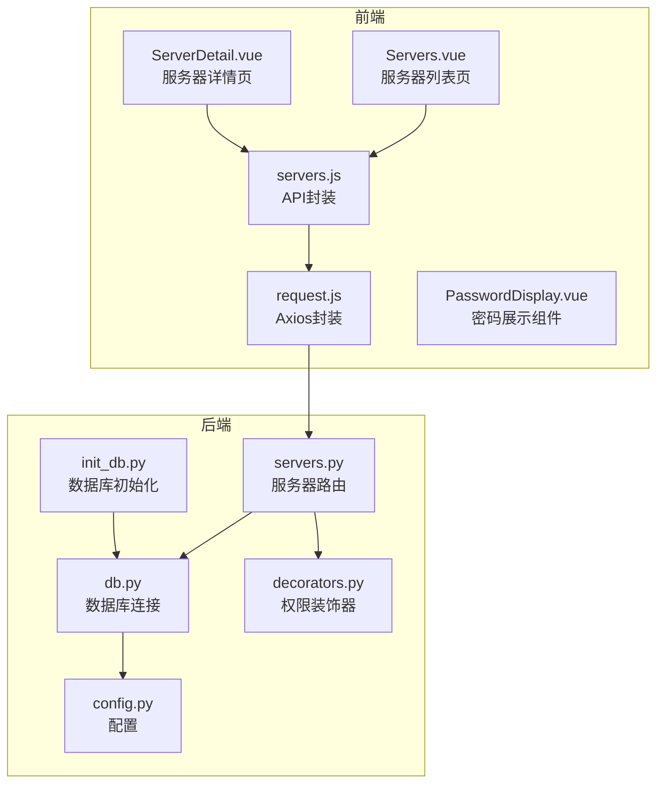
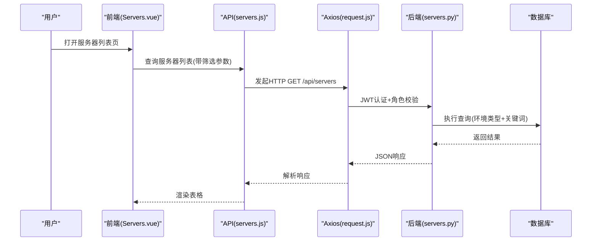
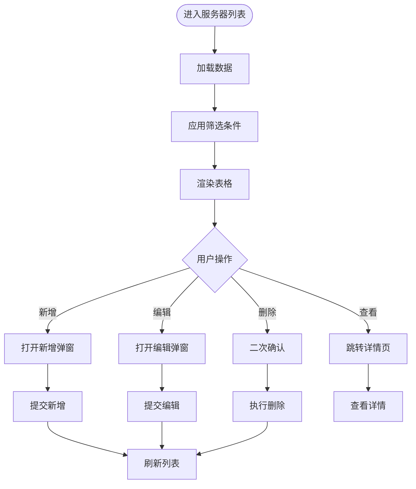
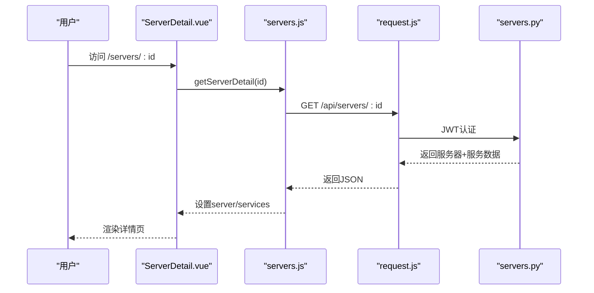
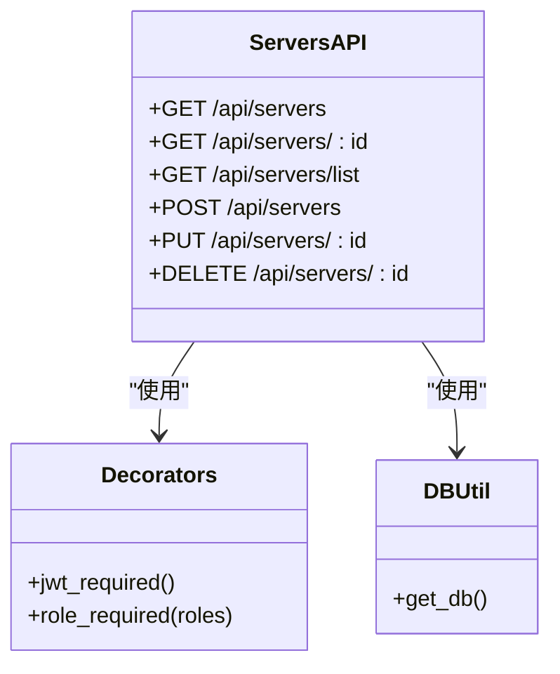
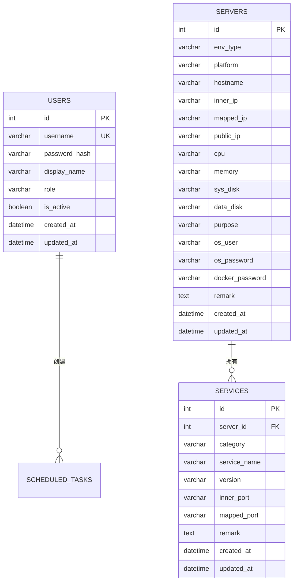
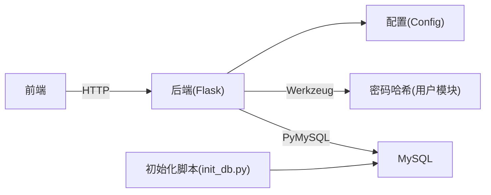

# 服务器管理

<cite>
**本文档引用的文件**
- [backend/app/api/servers.py](file://backend/app/api/servers.py)
- [frontend/src/views/Servers.vue](file://frontend/src/views/Servers.vue)
- [frontend/src/views/ServerDetail.vue](file://frontend/src/views/ServerDetail.vue)
- [frontend/src/api/servers.js](file://frontend/src/api/servers.js)
- [frontend/src/api/request.js](file://frontend/src/api/request.js)
- [frontend/src/components/PasswordDisplay.vue](file://frontend/src/components/PasswordDisplay.vue)
- [backend/app/utils/db.py](file://backend/app/utils/db.py)
- [backend/app/utils/decorators.py](file://backend/app/utils/decorators.py)
- [backend/app/config.py](file://backend/app/config.py)
- [backend/init_db.py](file://backend/init_db.py)
- [backend/run.py](file://backend/run.py)
</cite>

## 目录
1. [简介](#简介)
2. [项目结构](#项目结构)
3. [核心组件](#核心组件)
4. [架构总览](#架构总览)
5. [详细组件分析](#详细组件分析)
6. [依赖关系分析](#依赖关系分析)
7. [性能考虑](#性能考虑)
8. [故障排除指南](#故障排除指南)
9. [结论](#结论)
10. [附录](#附录)

## 简介
本文件面向运维平台的“服务器管理”功能，提供从架构到实现细节的完整说明。系统支持服务器资产的全生命周期管理，包括增删改查、环境类型分类（测试、生产、智慧环保、水电集团）、平台信息、主机名与IP管理、硬件资源配置（CPU、内存、磁盘）、系统用户与密码管理、Docker容器管理等。同时涵盖服务器详情页展示逻辑、数据验证规则、搜索过滤功能以及批量操作支持的现状与扩展建议，并给出最佳实践、安全考虑与性能优化建议。

## 项目结构
后端采用Flask微服务框架，提供RESTful API；前端基于Vue3 + Element Plus构建，通过Axios统一发起HTTP请求。数据库初始化脚本负责创建核心表结构及默认管理员账户。

图表来源
- [frontend/src/views/Servers.vue:1-306](file://frontend/src/views/Servers.vue#L1-L306)
- [frontend/src/views/ServerDetail.vue:1-156](file://frontend/src/views/ServerDetail.vue#L1-L156)
- [frontend/src/api/servers.js:1-26](file://frontend/src/api/servers.js#L1-L26)
- [frontend/src/api/request.js:1-54](file://frontend/src/api/request.js#L1-L54)
- [frontend/src/components/PasswordDisplay.vue:1-85](file://frontend/src/components/PasswordDisplay.vue#L1-L85)
- [backend/app/api/servers.py:1-203](file://backend/app/api/servers.py#L1-L203)
- [backend/app/utils/db.py:1-17](file://backend/app/utils/db.py#L1-L17)
- [backend/app/utils/decorators.py:1-95](file://backend/app/utils/decorators.py#L1-L95)
- [backend/app/config.py:1-21](file://backend/app/config.py#L1-L21)
- [backend/init_db.py:1-210](file://backend/init_db.py#L1-L210)

章节来源
- [backend/app/api/servers.py:11-203](file://backend/app/api/servers.py#L11-L203)
- [frontend/src/views/Servers.vue:1-306](file://frontend/src/views/Servers.vue#L1-L306)
- [frontend/src/views/ServerDetail.vue:1-156](file://frontend/src/views/ServerDetail.vue#L1-L156)
- [frontend/src/api/servers.js:1-26](file://frontend/src/api/servers.js#L1-L26)
- [frontend/src/api/request.js:1-54](file://frontend/src/api/request.js#L1-L54)
- [backend/app/utils/db.py:1-17](file://backend/app/utils/db.py#L1-L17)
- [backend/app/utils/decorators.py:1-95](file://backend/app/utils/decorators.py#L1-L95)
- [backend/app/config.py:1-21](file://backend/app/config.py#L1-L21)
- [backend/init_db.py:1-210](file://backend/init_db.py#L1-L210)

## 核心组件
- 服务器列表页（Servers.vue）
  - 功能：环境类型筛选、关键词搜索（主机名/IP/用途）、新增/编辑/删除操作入口、表格展示。
  - 验证规则：环境类型必填、主机名必填、内网IP必填。
  - 展示：环境类型标签样式区分、固定列操作按钮。
- 服务器详情页（ServerDetail.vue）
  - 功能：展示服务器基础信息与关联服务列表，面包屑导航与返回按钮。
  - 展示：密码字段通过专用组件展示与复制。
- 服务器API封装（servers.js）
  - 功能：封装GET/POST/PUT/DELETE服务器相关接口，供视图层调用。
- Axios请求封装（request.js）
  - 功能：统一设置基础URL、添加JWT Token、统一错误处理与401自动登出。
- 权限控制（decorators.py）
  - 功能：JWT认证与角色权限校验，限制管理员与操作员可执行的写操作。
- 数据库连接（db.py）
  - 功能：从Flask配置读取数据库连接参数，提供统一连接工厂。
- 数据库初始化（init_db.py）
  - 功能：创建用户、服务器、服务、应用系统、域名证书、定时任务、任务日志等表结构，并插入默认管理员账户。

章节来源
- [frontend/src/views/Servers.vue:173-306](file://frontend/src/views/Servers.vue#L173-L306)
- [frontend/src/views/ServerDetail.vue:74-156](file://frontend/src/views/ServerDetail.vue#L74-L156)
- [frontend/src/api/servers.js:1-26](file://frontend/src/api/servers.js#L1-L26)
- [frontend/src/api/request.js:1-54](file://frontend/src/api/request.js#L1-L54)
- [backend/app/utils/decorators.py:9-95](file://backend/app/utils/decorators.py#L9-L95)
- [backend/app/utils/db.py:5-17](file://backend/app/utils/db.py#L5-L17)
- [backend/init_db.py:33-92](file://backend/init_db.py#L33-L92)

## 架构总览
服务器管理采用前后端分离架构：
- 前端负责UI交互、表单验证、路由跳转与状态管理。
- 后端提供RESTful API，进行业务逻辑处理与数据库操作。
- 权限控制通过JWT Token与角色校验保障安全性。
- 数据库通过初始化脚本建立表结构，支持服务器资产与关联服务的存储。

图表来源
- [frontend/src/views/Servers.vue:206-214](file://frontend/src/views/Servers.vue#L206-L214)
- [frontend/src/api/servers.js:3-5](file://frontend/src/api/servers.js#L3-L5)
- [frontend/src/api/request.js:14-34](file://frontend/src/api/request.js#L14-L34)
- [backend/app/api/servers.py:11-43](file://backend/app/api/servers.py#L11-L43)

## 详细组件分析

### 服务器列表页（Servers.vue）
- 搜索与筛选
  - 环境类型选择器：支持测试、生产、智慧环保、水电集团四类。
  - 关键词输入框：支持主机名、内网IP、平台三字段模糊匹配。
  - 搜索按钮与重置按钮：触发查询与清空条件。
- 表格列与展示
  - 固定列：环境类型（带标签样式）、平台、主机名、内网IP、映射IP、CPU、内存、用途。
  - 操作列：查看、编辑、删除。
- 表单与验证
  - 新增/编辑弹窗：包含环境类型、平台、主机名、内网IP、映射IP、公网IP、CPU、内存、系统盘、数据盘、用途、系统用户、系统密码、Docker密码、备注。
  - 表单验证规则：环境类型必填、主机名必填、内网IP必填。
- 交互流程
  - 新增：打开弹窗，填写表单，提交后刷新列表。
  - 编辑：复制当前行数据到表单，提交后刷新列表。
  - 删除：二次确认后调用删除接口，成功后刷新列表。
  - 查看：跳转至详情页。

图表来源
- [frontend/src/views/Servers.vue:202-280](file://frontend/src/views/Servers.vue#L202-L280)

章节来源
- [frontend/src/views/Servers.vue:1-306](file://frontend/src/views/Servers.vue#L1-L306)

### 服务器详情页（ServerDetail.vue）
- 页面结构
  - 面包屑导航与返回按钮。
  - 服务器基本信息卡片：环境类型、平台、主机名、内网IP、映射IP、公网IP、CPU、内存、系统盘、数据盘、用途、系统用户、系统密码、Docker密码、备注。
  - 关联服务列表卡片：展示服务分类、服务名称、版本、内部端口、映射端口、备注。
- 密码展示组件（PasswordDisplay.vue）
  - 点击显示明文或隐藏星号。
  - 支持复制密码到剪贴板（优先使用Clipboard API，失败时降级到textarea选择复制）。
- 数据加载
  - 通过路由参数获取服务器ID，调用详情接口获取服务器与关联服务数据。

图表来源
- [frontend/src/views/ServerDetail.vue:86-102](file://frontend/src/views/ServerDetail.vue#L86-L102)
- [frontend/src/api/servers.js:7-9](file://frontend/src/api/servers.js#L7-L9)
- [frontend/src/api/request.js:26-34](file://frontend/src/api/request.js#L26-L34)
- [backend/app/api/servers.py:46-78](file://backend/app/api/servers.py#L46-L78)

章节来源
- [frontend/src/views/ServerDetail.vue:1-156](file://frontend/src/views/ServerDetail.vue#L1-L156)
- [frontend/src/components/PasswordDisplay.vue:1-85](file://frontend/src/components/PasswordDisplay.vue#L1-L85)

### 后端API（servers.py）
- 接口概览
  - GET /api/servers：分页/筛选获取服务器列表，支持环境类型过滤与关键词模糊搜索。
  - GET /api/servers/<id>：获取服务器详情（含关联服务列表）。
  - GET /api/servers/list：获取所有服务器简要信息（用于下拉框）。
  - POST /api/servers：创建服务器（需管理员或操作员角色）。
  - PUT /api/servers/<id>：更新服务器（需管理员或操作员角色）。
  - DELETE /api/servers/<id>：删除服务器（需管理员或操作员角色）。
- 关键实现要点
  - 查询参数：env_type、search；search支持主机名、内网IP、平台三字段模糊匹配。
  - 关联查询：详情页同时查询服务清单，按分类与服务名排序。
  - 写操作权限：使用JWT认证与角色校验装饰器，限制admin/operator。
  - 错误处理：异常捕获与回滚，返回统一JSON结构。

图表来源
- [backend/app/api/servers.py:11-203](file://backend/app/api/servers.py#L11-L203)
- [backend/app/utils/decorators.py:9-95](file://backend/app/utils/decorators.py#L9-L95)
- [backend/app/utils/db.py:5-17](file://backend/app/utils/db.py#L5-L17)

章节来源
- [backend/app/api/servers.py:1-203](file://backend/app/api/servers.py#L1-L203)

### 数据模型与表结构
- 用户表（users）
  - 字段：id、username、password_hash、display_name、role、is_active、created_at、updated_at。
  - 索引：username、role。
- 服务器台账表（servers）
  - 字段：id、env_type、platform、hostname、inner_ip、mapped_ip、public_ip、cpu、memory、sys_disk、data_disk、purpose、os_user、os_password、docker_password、remark、created_at、updated_at。
  - 索引：env_type、inner_ip。
- 服务清单表（services）
  - 字段：id、server_id、category、service_name、version、inner_port、mapped_port、remark、created_at、updated_at。
  - 外键：server_id -> servers(id)（级联删除）。
  - 索引：server_id、service_name。

图表来源
- [backend/init_db.py:33-92](file://backend/init_db.py#L33-L92)

章节来源
- [backend/init_db.py:33-92](file://backend/init_db.py#L33-L92)

### 权限与安全
- JWT认证
  - 请求头携带Authorization: Bearer <token>。
  - 未提供或格式不正确时返回401。
  - Token无效或过期时返回401。
- 角色权限
  - 写操作（POST/PUT/DELETE）要求admin或operator角色。
  - 读操作（GET）仅需JWT认证。
- 前端拦截
  - 自动注入Authorization头。
  - 401时清除本地token并跳转登录页。

章节来源
- [backend/app/utils/decorators.py:9-95](file://backend/app/utils/decorators.py#L9-L95)
- [frontend/src/api/request.js:14-51](file://frontend/src/api/request.js#L14-L51)

## 依赖关系分析
- 前端依赖
  - Vue3 + Element Plus：组件化UI与表单验证。
  - Axios：统一HTTP请求与拦截器。
  - 路由：Vue Router进行页面跳转。
- 后端依赖
  - Flask：Web框架与蓝图路由。
  - PyMySQL：数据库连接与查询。
  - Werkzeug：密码哈希（用于用户模块，服务器管理未直接使用）。
- 配置与部署
  - 环境变量驱动数据库与Flask运行参数。
  - 初始化脚本一次性创建表结构与默认管理员。

图表来源
- [frontend/src/api/request.js:1-54](file://frontend/src/api/request.js#L1-L54)
- [backend/app/utils/db.py:1-17](file://backend/app/utils/db.py#L1-L17)
- [backend/app/config.py:1-21](file://backend/app/config.py#L1-L21)
- [backend/init_db.py:1-210](file://backend/init_db.py#L1-L210)

章节来源
- [frontend/src/api/request.js:1-54](file://frontend/src/api/request.js#L1-L54)
- [backend/app/utils/db.py:1-17](file://backend/app/utils/db.py#L1-L17)
- [backend/app/config.py:1-21](file://backend/app/config.py#L1-L21)
- [backend/init_db.py:1-210](file://backend/init_db.py#L1-L210)

## 性能考虑
- 数据库索引
  - servers表：env_type、inner_ip建立索引，有利于筛选与模糊查询。
  - services表：server_id、service_name建立索引，提升关联查询效率。
- 查询优化
  - 列表查询使用参数化SQL，避免拼接导致的SQL注入风险。
  - 模糊查询使用LIKE与通配符，建议在高频字段上考虑全文索引或搜索引擎替代。
- 前端优化
  - 表格分页与虚拟滚动（当前未实现）：大数据量时建议分页或虚拟滚动减少DOM压力。
  - 请求缓存：对只读列表数据可增加缓存策略，降低重复请求。
- 后端优化
  - 连接池：当前使用短连接，建议引入连接池以减少连接开销。
  - 批量操作：当前未提供批量删除/更新接口，建议在后续版本增加以提升运维效率。
- 安全加固
  - 敏感字段（密码）仅在详情页展示，且支持复制，建议增加最小权限与审计日志。
  - 建议对写操作增加速率限制与审计记录。

## 故障排除指南
- 登录失效
  - 现象：401未授权，自动跳转登录页。
  - 处理：重新登录获取新Token，确保本地存储存在有效Token。
- 接口报错
  - 现象：统一错误消息提示。
  - 处理：检查网络连通性、后端服务状态、请求头Authorization是否正确。
- 数据库连接失败
  - 现象：后端无法连接数据库。
  - 处理：检查环境变量DB_HOST/DB_PORT/DB_USER/DB_PASSWORD/DB_NAME是否正确。
- 权限不足
  - 现象：403权限不足。
  - 处理：确认当前用户角色是否具备admin或operator权限。
- 服务器不存在
  - 现象：详情页返回404。
  - 处理：确认服务器ID是否存在，或已被删除。

章节来源
- [frontend/src/api/request.js:35-51](file://frontend/src/api/request.js#L35-L51)
- [backend/app/utils/decorators.py:22-56](file://backend/app/utils/decorators.py#L22-L56)
- [backend/app/api/servers.py:57-61](file://backend/app/api/servers.py#L57-L61)
- [backend/app/utils/db.py:5-17](file://backend/app/utils/db.py#L5-L17)

## 结论
服务器管理功能覆盖了从资产录入、查询筛选、详情展示到权限控制的完整闭环。前端通过清晰的表单与交互提升了易用性，后端通过装饰器与参数化查询保障了安全与稳定性。建议在后续版本中补充批量操作、分页与虚拟滚动、连接池与索引优化、敏感字段审计与最小权限策略，以进一步提升用户体验与系统性能。

## 附录

### API定义
- 获取服务器列表
  - 方法：GET
  - 路径：/api/servers
  - 查询参数：env_type（可选）、search（可选）
  - 返回：code、data（服务器列表）
- 获取服务器详情
  - 方法：GET
  - 路径：/api/servers/:id
  - 返回：code、data.server、data.services
- 获取服务器简要列表
  - 方法：GET
  - 路径：/api/servers/list
  - 返回：code、data（id、env_type、hostname、inner_ip）
- 创建服务器
  - 方法：POST
  - 路径：/api/servers
  - 请求体：服务器字段（见表结构）
  - 返回：code、message、data.id
- 更新服务器
  - 方法：PUT
  - 路径：/api/servers/:id
  - 请求体：部分服务器字段
  - 返回：code、message
- 删除服务器
  - 方法：DELETE
  - 路径：/api/servers/:id
  - 返回：code、message

章节来源
- [backend/app/api/servers.py:11-203](file://backend/app/api/servers.py#L11-L203)

### 最佳实践
- 环境类型管理
  - 固化枚举值（测试、生产、智慧环保、水电集团），避免自由文本导致的数据漂移。
- IP管理
  - 建议引入IP段与可用性校验，避免重复与非法地址。
- 硬件资源
  - 建议标准化单位（如CPU核数、内存GB、磁盘GB），便于统计与对比。
- 密码管理
  - 建议集成密码库或密钥管理服务，避免明文存储与传输。
- Docker管理
  - 建议增加容器健康检查与镜像版本追踪，便于排障与升级。
- 批量操作
  - 建议提供批量删除、导出、变更环境类型等能力，提升运维效率。
- 审计与日志
  - 对写操作增加审计日志，记录操作人、时间、变更前后值，便于追溯。

### 安全考虑
- 认证与授权
  - 严格使用JWT与角色校验，禁止未认证与越权访问。
- 数据保护
  - 敏感字段（密码）仅在必要场景展示，支持复制时注意最小暴露范围。
- 输入验证
  - 前端表单验证与后端参数校验双保险，防止脏数据入库。
- 网络安全
  - 生产环境建议HTTPS、白名单访问与WAF防护。

### 性能优化建议
- 数据库层面
  - 为高频查询字段建立合适索引；对大表进行分区或归档。
- 接口层面
  - 引入连接池、缓存热点数据、分页与虚拟滚动。
- 前端层面
  - 减少不必要的重渲染，合理拆分组件；对长列表使用懒加载。
- 运维层面
  - 增加监控与告警，关注慢查询与高延迟接口。