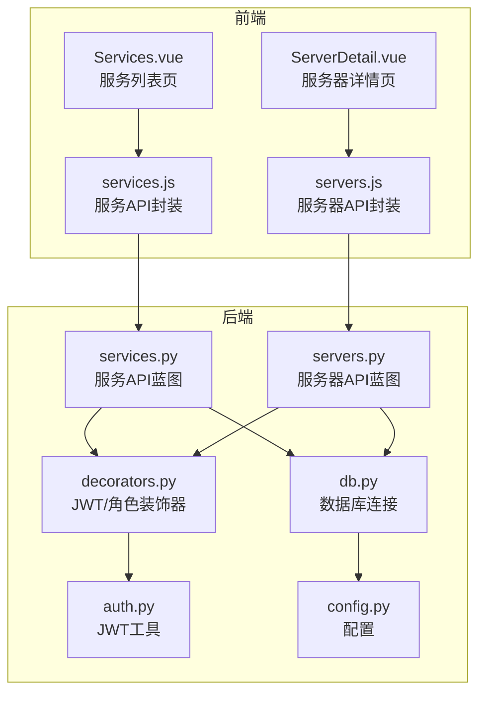
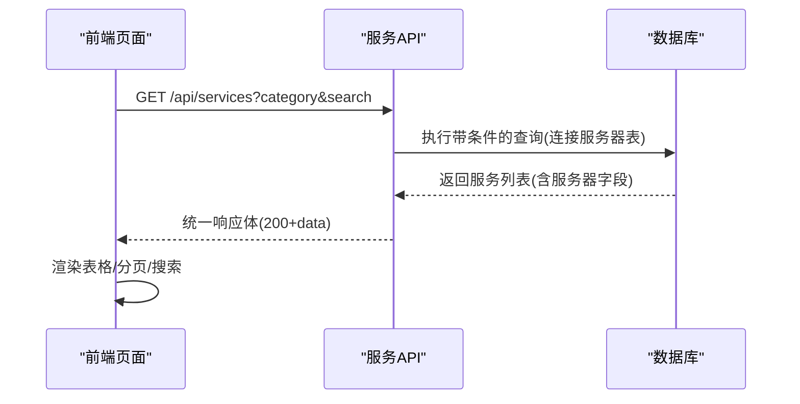
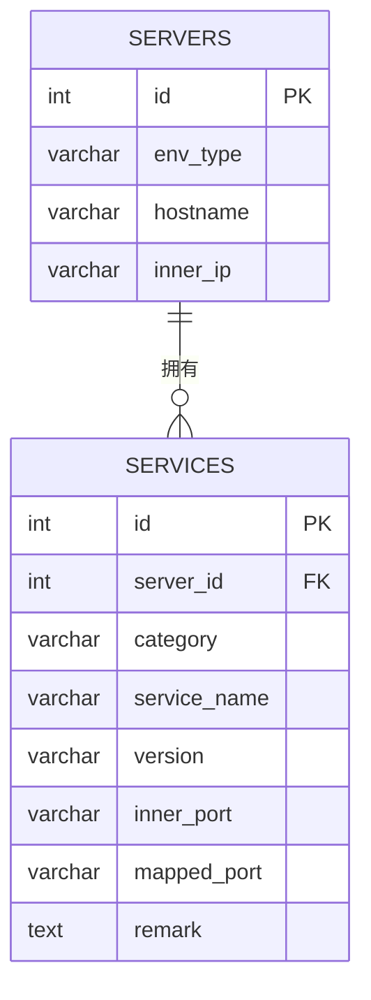
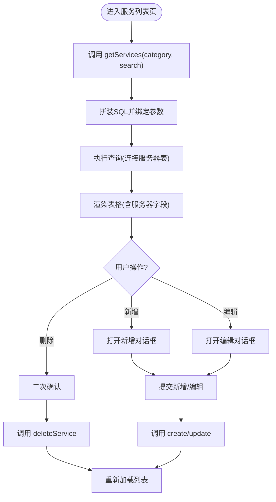
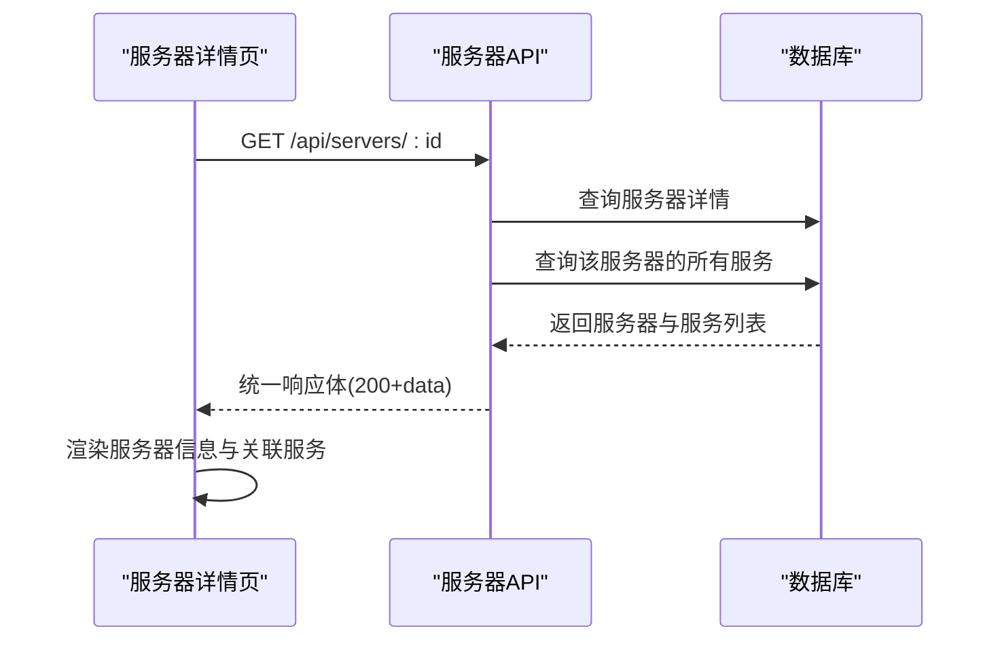
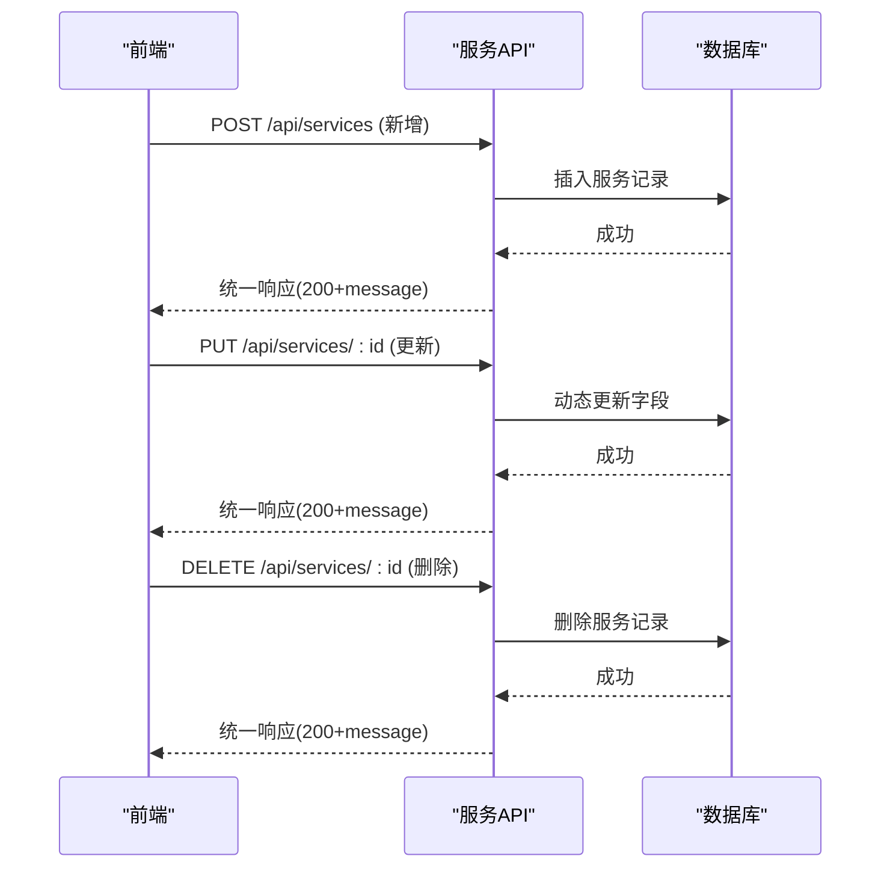
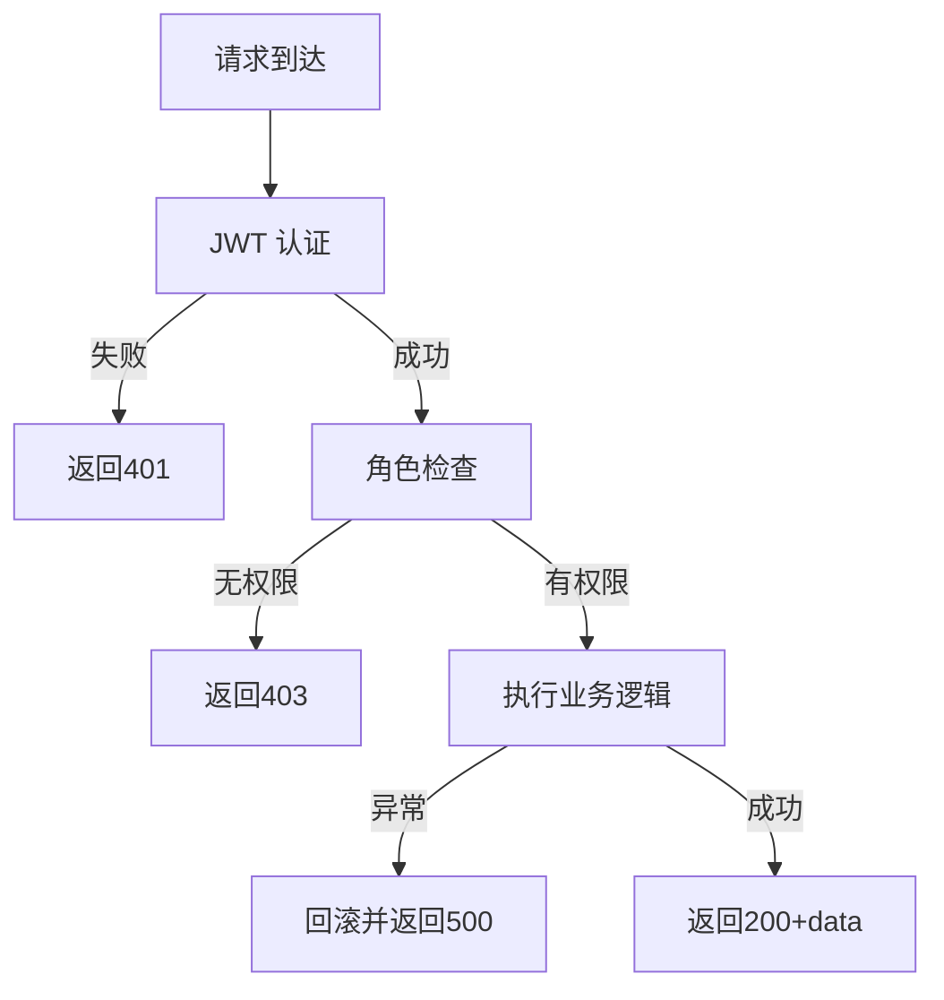
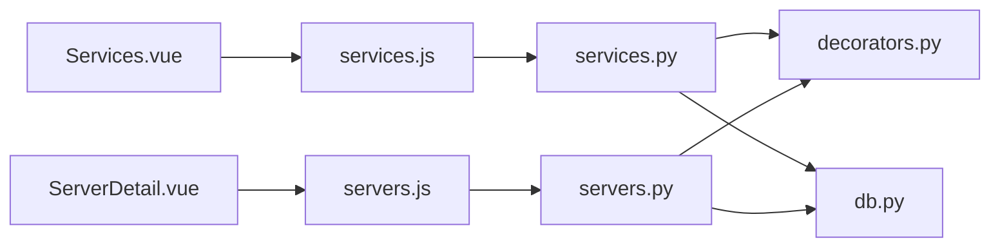

# 服务管理

<cite>
**本文引用的文件**
- [backend/app/api/services.py](file://backend/app/api/services.py)
- [backend/app/api/servers.py](file://backend/app/api/servers.py)
- [backend/init_db.py](file://backend/init_db.py)
- [backend/app/utils/db.py](file://backend/app/utils/db.py)
- [backend/app/utils/decorators.py](file://backend/app/utils/decorators.py)
- [backend/app/utils/auth.py](file://backend/app/utils/auth.py)
- [backend/app/config.py](file://backend/app/config.py)
- [frontend/src/views/Services.vue](file://frontend/src/views/Services.vue)
- [frontend/src/views/ServerDetail.vue](file://frontend/src/views/ServerDetail.vue)
- [frontend/src/api/services.js](file://frontend/src/api/services.js)
- [frontend/src/api/servers.js](file://frontend/src/api/servers.js)
</cite>

## 目录
1. [简介](#简介)
2. [项目结构](#项目结构)
3. [核心组件](#核心组件)
4. [架构总览](#架构总览)
5. [详细组件分析](#详细组件分析)
6. [依赖分析](#依赖分析)
7. [性能考虑](#性能考虑)
8. [故障排查指南](#故障排查指南)
9. [结论](#结论)
10. [附录](#附录)

## 简介
本文件围绕“服务管理”功能进行全面技术文档化，涵盖服务资产的全生命周期管理：服务分类管理、端口映射配置、服务状态监控（概念性说明）、服务依赖关系处理（概念性说明）。重点阐述服务列表展示逻辑、服务详情的关联数据加载、服务配置的动态更新机制，并给出数据模型设计、业务规则约束、操作权限控制与错误处理策略。最后提供实际应用场景与扩展开发指南。

## 项目结构
服务管理功能由前后端协同实现：
- 后端采用 Flask 蓝图组织 API，提供服务与服务器的增删改查接口，并通过装饰器实现 JWT 认证与角色授权。
- 前端基于 Vue 3 + Element Plus，提供服务列表页与服务器详情页，支持服务的新增、编辑、删除与搜索过滤。
- 数据层通过初始化脚本创建服务清单表与服务器表，并建立外键关联。

图表来源
- [frontend/src/views/Services.vue:114-261](file://frontend/src/views/Services.vue#L114-L261)
- [frontend/src/views/ServerDetail.vue:1-156](file://frontend/src/views/ServerDetail.vue#L1-L156)
- [frontend/src/api/services.js:1-18](file://frontend/src/api/services.js#L1-L18)
- [frontend/src/api/servers.js:1-26](file://frontend/src/api/servers.js#L1-L26)
- [backend/app/api/services.py:1-144](file://backend/app/api/services.py#L1-L144)
- [backend/app/api/servers.py:1-203](file://backend/app/api/servers.py#L1-L203)
- [backend/app/utils/db.py:1-17](file://backend/app/utils/db.py#L1-L17)
- [backend/app/utils/decorators.py:1-95](file://backend/app/utils/decorators.py#L1-L95)
- [backend/app/utils/auth.py:1-83](file://backend/app/utils/auth.py#L1-L83)
- [backend/app/config.py:1-21](file://backend/app/config.py#L1-L21)

章节来源
- [backend/app/api/services.py:11-144](file://backend/app/api/services.py#L11-L144)
- [backend/app/api/servers.py:11-203](file://backend/app/api/servers.py#L11-L203)
- [backend/init_db.py:75-92](file://backend/init_db.py#L75-L92)
- [frontend/src/views/Services.vue:114-261](file://frontend/src/views/Services.vue#L114-L261)
- [frontend/src/views/ServerDetail.vue:1-156](file://frontend/src/views/ServerDetail.vue#L1-L156)

## 核心组件
- 服务管理 API 蓝图：提供服务列表查询、创建、更新、删除接口；支持按分类与关键词筛选；返回统一结构。
- 服务器管理 API 蓝图：提供服务器列表、详情（含关联服务）、简要列表等接口。
- 权限控制：JWT 认证与角色授权装饰器，限定管理员与操作员可执行写操作。
- 数据模型：服务清单表与服务器表，服务清单表外键关联服务器表。
- 前端视图：服务列表页负责展示与交互；服务器详情页展示关联服务列表。

章节来源
- [backend/app/api/services.py:11-144](file://backend/app/api/services.py#L11-L144)
- [backend/app/api/servers.py:11-203](file://backend/app/api/servers.py#L11-L203)
- [backend/init_db.py:75-92](file://backend/init_db.py#L75-L92)
- [frontend/src/views/Services.vue:114-261](file://frontend/src/views/Services.vue#L114-L261)
- [frontend/src/views/ServerDetail.vue:1-156](file://frontend/src/views/ServerDetail.vue#L1-L156)

## 架构总览
服务管理的端到端流程如下：
- 前端调用服务 API 获取服务列表，携带分类与关键词参数。
- 后端执行带条件的 SQL 查询，连接服务器表以补充环境类型、主机名、内网 IP 等字段。
- 前端渲染表格并提供新增/编辑/删除入口。
- 服务器详情页通过服务器 API 获取服务器与关联服务列表，用于展示服务归属关系。

图表来源
- [backend/app/api/services.py:11-46](file://backend/app/api/services.py#L11-L46)
- [backend/app/utils/db.py:5-16](file://backend/app/utils/db.py#L5-L16)

章节来源
- [backend/app/api/services.py:11-46](file://backend/app/api/services.py#L11-L46)
- [frontend/src/views/Services.vue:156-173](file://frontend/src/views/Services.vue#L156-L173)

## 详细组件分析

### 数据模型与业务规则
- 服务清单表（services）字段要点：
  - 外键 server_id 引用服务器表 id，删除服务器时级联删除其服务。
  - 分类 category、服务名 service_name、版本 version、内部端口 inner_port、映射端口 mapped_port、备注 remark。
  - 索引覆盖 server_id、service_name，便于快速定位与排序。
- 服务器表（servers）字段要点：
  - 环境类型 env_type、主机名 hostname、内网 IP inner_ip 等。
  - 与服务清单表建立一对多关系。
- 业务规则约束：
  - 服务列表查询支持按分类与关键词模糊匹配。
  - 服务详情页通过服务器 API 展示该服务器下的所有服务。
  - 写操作需具备管理员或操作员角色。

图表来源
- [backend/init_db.py:75-92](file://backend/init_db.py#L75-L92)
- [backend/init_db.py:49-73](file://backend/init_db.py#L49-L73)

章节来源
- [backend/init_db.py:75-92](file://backend/init_db.py#L75-L92)
- [backend/app/api/servers.py:46-78](file://backend/app/api/servers.py#L46-L78)

### 服务列表展示逻辑
- 前端 Services.vue：
  - 提供分类选择与关键词输入，支持回车触发搜索。
  - 调用服务 API 获取数据并渲染表格，包含服务器主机名、内网 IP、环境类型、分类、服务名、版本、内外端口、备注等字段。
  - 支持新增/编辑/删除按钮，删除前二次确认。
- 后端 services.py：
  - 接收 category 与 search 查询参数，构造 SQL 并执行。
  - 连接服务器表以返回服务器 hostname、inner_ip、env_type 字段。
  - 统一返回 code 与 data 结构。

图表来源
- [frontend/src/views/Services.vue:156-235](file://frontend/src/views/Services.vue#L156-L235)
- [backend/app/api/services.py:11-46](file://backend/app/api/services.py#L11-L46)

章节来源
- [frontend/src/views/Services.vue:114-261](file://frontend/src/views/Services.vue#L114-L261)
- [backend/app/api/services.py:11-46](file://backend/app/api/services.py#L11-L46)

### 服务详情的关联数据加载
- 服务器详情页 ServerDetail.vue：
  - 通过路由参数获取服务器 ID，调用服务器详情 API。
  - API 返回服务器基础信息与关联服务列表，前端渲染“关联服务列表”卡片。
- 服务器 API 服务：
  - 查询服务器详情并查询该服务器的所有服务，按分类与服务名排序。

图表来源
- [frontend/src/views/ServerDetail.vue:90-102](file://frontend/src/views/ServerDetail.vue#L90-L102)
- [backend/app/api/servers.py:46-78](file://backend/app/api/servers.py#L46-L78)

章节来源
- [frontend/src/views/ServerDetail.vue:1-156](file://frontend/src/views/ServerDetail.vue#L1-L156)
- [backend/app/api/servers.py:46-78](file://backend/app/api/servers.py#L46-L78)

### 服务配置的动态更新机制
- 新增/编辑：
  - 前端 Services.vue 打开对话框，收集表单数据（所属服务器、分类、服务名、版本、内外端口、备注）。
  - 调用 createService 或 updateService，提交后关闭对话框并刷新列表。
- 删除：
  - 前端弹出二次确认，调用 deleteService，成功后刷新列表。
- 后端：
  - 写操作均受角色装饰器保护，异常时回滚并返回统一错误结构。

图表来源
- [frontend/src/views/Services.vue:191-235](file://frontend/src/views/Services.vue#L191-L235)
- [backend/app/api/services.py:49-144](file://backend/app/api/services.py#L49-L144)

章节来源
- [frontend/src/views/Services.vue:191-235](file://frontend/src/views/Services.vue#L191-L235)
- [backend/app/api/services.py:49-144](file://backend/app/api/services.py#L49-L144)

### 权限控制与错误处理策略
- 权限控制：
  - JWT 认证：从 Authorization 头解析 Bearer Token，校验失败返回 401。
  - 角色授权：仅允许 admin 与 operator 执行写操作（新增/更新/删除），否则返回 403。
- 错误处理：
  - 数据库异常时回滚事务并返回统一错误结构（code 500 + message）。
  - 前端对异常进行捕获与提示，保证用户体验。

图表来源
- [backend/app/utils/decorators.py:9-95](file://backend/app/utils/decorators.py#L9-L95)
- [backend/app/api/services.py:49-144](file://backend/app/api/services.py#L49-L144)

章节来源
- [backend/app/utils/decorators.py:9-95](file://backend/app/utils/decorators.py#L9-L95)
- [backend/app/api/services.py:49-144](file://backend/app/api/services.py#L49-L144)

## 依赖分析
- 组件耦合：
  - 服务 API 依赖数据库连接与权限装饰器；服务器 API 同理。
  - 前端服务列表页依赖服务 API 与服务器 API；服务器详情页依赖服务器 API。
- 外部依赖：
  - Flask、PyMySQL、Element Plus、Vue 3。
- 可能的循环依赖：
  - 当前模块间为单向依赖，无循环风险。

图表来源
- [frontend/src/views/Services.vue:114-261](file://frontend/src/views/Services.vue#L114-L261)
- [frontend/src/views/ServerDetail.vue:1-156](file://frontend/src/views/ServerDetail.vue#L1-L156)
- [frontend/src/api/services.js:1-18](file://frontend/src/api/services.js#L1-L18)
- [frontend/src/api/servers.js:1-26](file://frontend/src/api/servers.js#L1-L26)
- [backend/app/api/services.py:1-144](file://backend/app/api/services.py#L1-L144)
- [backend/app/api/servers.py:1-203](file://backend/app/api/servers.py#L1-L203)
- [backend/app/utils/decorators.py:1-95](file://backend/app/utils/decorators.py#L1-L95)
- [backend/app/utils/db.py:1-17](file://backend/app/utils/db.py#L1-L17)

章节来源
- [backend/app/api/services.py:1-144](file://backend/app/api/services.py#L1-L144)
- [backend/app/api/servers.py:1-203](file://backend/app/api/servers.py#L1-L203)
- [frontend/src/views/Services.vue:114-261](file://frontend/src/views/Services.vue#L114-L261)
- [frontend/src/views/ServerDetail.vue:1-156](file://frontend/src/views/ServerDetail.vue#L1-L156)

## 性能考虑
- 查询优化：
  - 服务列表查询已对 server_id 与 service_name 建立索引，建议在高频搜索场景下保持参数传递，避免全表扫描。
  - SQL 使用连接查询一次性返回所需字段，减少往返次数。
- 前端渲染：
  - 表格使用虚拟滚动与按需加载，避免大数据量时的卡顿。
- 数据库连接：
  - 使用 DictCursor 便于前端直接消费字段名，减少转换成本。
- 可扩展点：
  - 在服务列表页增加分页参数，后端配合 LIMIT/OFFSET 实现分页。
  - 对环境类型与分类字段增加枚举校验，提升一致性。

## 故障排查指南
- 常见问题与定位：
  - 401 未认证：检查请求头 Authorization 是否为 Bearer Token 格式。
  - 403 权限不足：确认当前用户角色是否包含 admin 或 operator。
  - 500 服务器错误：查看后端异常回滚日志，核对请求参数与数据库连接配置。
- 前端提示：
  - 使用 Element Plus 的消息与确认框，确保用户明确操作结果。
- 建议流程：
  - 先检查网络与跨域设置，再核对后端日志，最后复核前端参数与权限。

章节来源
- [backend/app/utils/decorators.py:20-56](file://backend/app/utils/decorators.py#L20-L56)
- [backend/app/api/services.py:72-113](file://backend/app/api/services.py#L72-L113)
- [frontend/src/views/Services.vue:225-235](file://frontend/src/views/Services.vue#L225-L235)

## 结论
服务管理功能通过清晰的前后端职责划分与统一的权限控制，实现了服务资产的可视化与可操作化。数据模型简洁明确，查询与更新路径稳定可靠。后续可在分页、搜索增强、状态监控与依赖关系可视化等方面持续演进。

## 附录

### 实际应用场景
- 运维人员日常巡检：通过服务列表快速定位某分类或关键词的服务，查看其所在服务器与端口映射。
- 服务器迁移与割接：在服务器详情页查看关联服务，评估影响范围。
- 资产盘点与审计：结合环境类型与分类统计，形成资产报表。

### 扩展开发指南
- 新增字段：
  - 在服务清单表增加新字段（如健康状态、负责人），同步更新后端插入/更新逻辑与前端表单。
- 状态监控与依赖：
  - 建议引入状态监控模块与依赖关系表，后端提供状态查询接口，前端在服务详情页展示状态与依赖拓扑。
- 审计与变更：
  - 在服务表上增加变更记录表，记录每次更新的字段差异，便于审计与回溯。