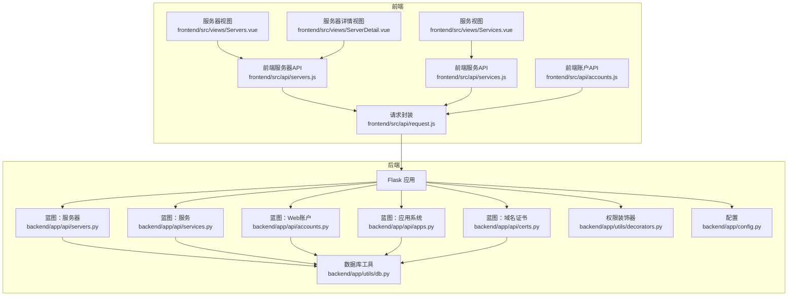
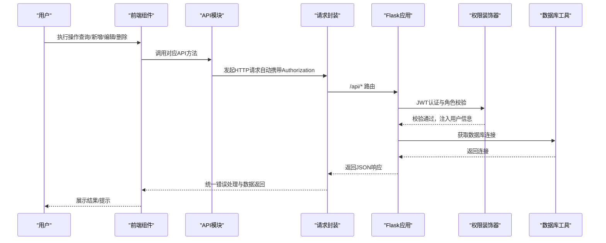
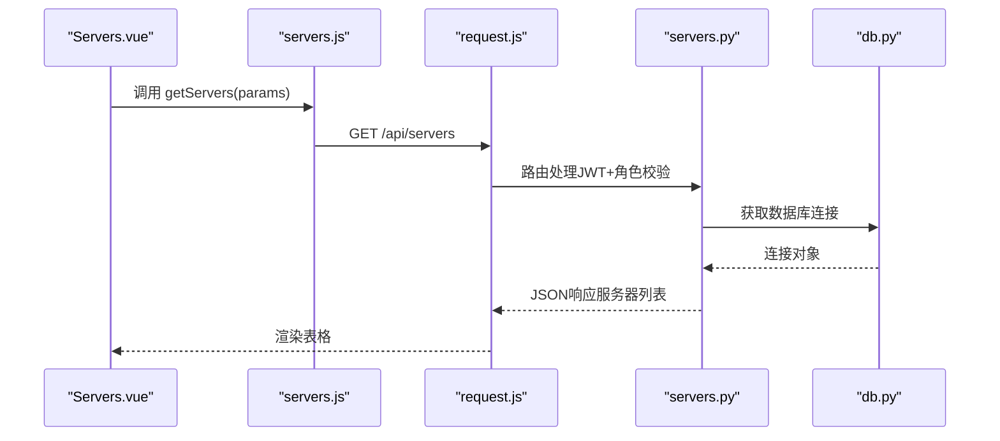
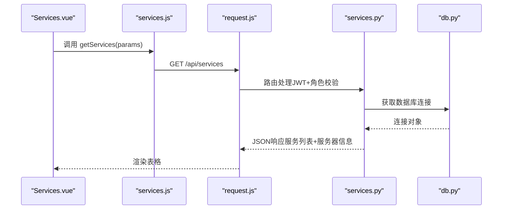
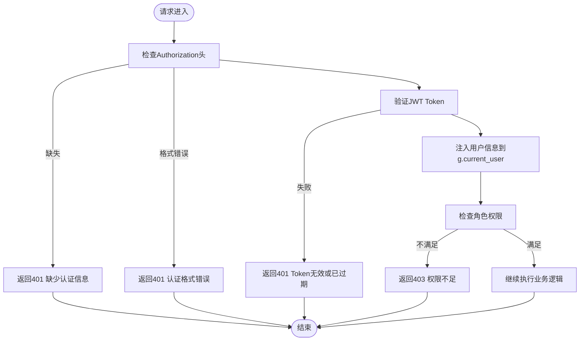
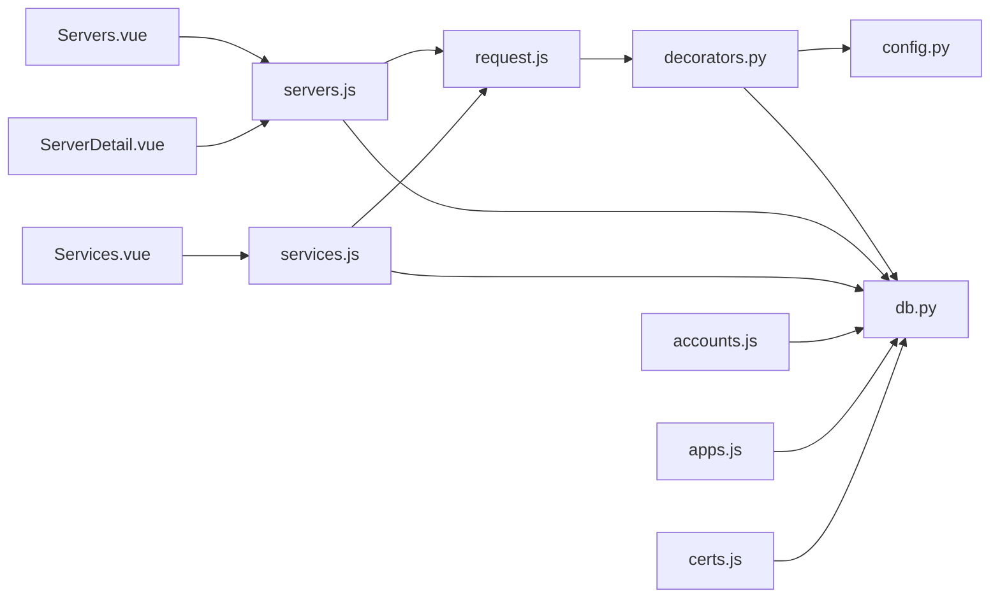

# 资产管理模块

<cite>
**本文档引用的文件**
- [backend/app/api/servers.py](file://backend/app/api/servers.py)
- [backend/app/api/services.py](file://backend/app/api/services.py)
- [backend/app/api/accounts.py](file://backend/app/api/accounts.py)
- [backend/app/api/apps.py](file://backend/app/api/apps.py)
- [backend/app/api/certs.py](file://backend/app/api/certs.py)
- [backend/app/utils/db.py](file://backend/app/utils/db.py)
- [backend/app/utils/decorators.py](file://backend/app/utils/decorators.py)
- [backend/app/config.py](file://backend/app/config.py)
- [frontend/src/api/servers.js](file://frontend/src/api/servers.js)
- [frontend/src/api/services.js](file://frontend/src/api/services.js)
- [frontend/src/api/accounts.js](file://frontend/src/api/accounts.js)
- [frontend/src/api/request.js](file://frontend/src/api/request.js)
- [frontend/src/views/Servers.vue](file://frontend/src/views/Servers.vue)
- [frontend/src/views/ServerDetail.vue](file://frontend/src/views/ServerDetail.vue)
- [frontend/src/views/Services.vue](file://frontend/src/views/Services.vue)
</cite>

## 目录
1. [简介](#简介)
2. [项目结构](#项目结构)
3. [核心组件](#核心组件)
4. [架构总览](#架构总览)
5. [详细组件分析](#详细组件分析)
6. [依赖关系分析](#依赖关系分析)
7. [性能考虑](#性能考虑)
8. [故障排除指南](#故障排除指南)
9. [结论](#结论)
10. [附录](#附录)

## 简介
本文件为资产管理模块的综合技术文档，覆盖服务器管理、服务管理、Web账户管理、应用系统管理和域名证书管理等核心资产类型的管理功能。内容包括各资产的数据模型与字段定义、业务规则与操作流程、增删改查、搜索过滤与排序、详情页展示逻辑、关联关系处理与数据验证机制，并提供最佳实践、性能优化建议与扩展开发指南。

## 项目结构
系统采用前后端分离架构：
- 后端基于 Flask，提供 RESTful API，统一通过装饰器进行 JWT 认证与角色授权控制，数据库连接通过工具函数集中管理。
- 前端基于 Vue 3 + Element Plus，通过封装的 axios 实例统一发起请求，自动注入 Authorization 头部，统一对响应进行错误处理与路由跳转。

**图表来源**
- [frontend/src/api/servers.js:1-26](file://frontend/src/api/servers.js#L1-L26)
- [frontend/src/api/services.js:1-18](file://frontend/src/api/services.js#L1-L18)
- [frontend/src/api/accounts.js:1-18](file://frontend/src/api/accounts.js#L1-L18)
- [frontend/src/api/request.js:1-54](file://frontend/src/api/request.js#L1-L54)
- [frontend/src/views/Servers.vue:1-306](file://frontend/src/views/Servers.vue#L1-L306)
- [frontend/src/views/ServerDetail.vue:1-156](file://frontend/src/views/ServerDetail.vue#L1-L156)
- [frontend/src/views/Services.vue:1-261](file://frontend/src/views/Services.vue#L1-L261)
- [backend/app/api/servers.py:1-203](file://backend/app/api/servers.py#L1-L203)
- [backend/app/api/services.py:1-144](file://backend/app/api/services.py#L1-L144)
- [backend/app/api/accounts.py:1-141](file://backend/app/api/accounts.py#L1-L141)
- [backend/app/api/apps.py:1-141](file://backend/app/api/apps.py#L1-L141)
- [backend/app/api/certs.py:1-145](file://backend/app/api/certs.py#L1-L145)
- [backend/app/utils/db.py:1-17](file://backend/app/utils/db.py#L1-L17)
- [backend/app/utils/decorators.py:1-95](file://backend/app/utils/decorators.py#L1-L95)
- [backend/app/config.py:1-21](file://backend/app/config.py#L1-L21)

**章节来源**
- [backend/app/config.py:1-21](file://backend/app/config.py#L1-L21)
- [backend/app/utils/db.py:1-17](file://backend/app/utils/db.py#L1-L17)
- [backend/app/utils/decorators.py:1-95](file://backend/app/utils/decorators.py#L1-L95)
- [frontend/src/api/request.js:1-54](file://frontend/src/api/request.js#L1-L54)

## 核心组件
本模块围绕五类资产提供统一的 CRUD 能力与前端交互界面：
- 服务器管理：支持按环境类型与多字段模糊搜索，支持简要列表用于下拉选择。
- 服务管理：支持按分类与服务名/版本搜索，显示所属服务器的环境类型与 IP。
- Web账户管理：支持按分组与多字段模糊搜索。
- 应用系统管理：支持按名称/公司/访问信息搜索。
- 域名证书管理：支持按分类与项目/实体搜索。

所有接口均通过 JWT 认证与角色授权装饰器保护，数据库连接通过工具函数集中管理，便于配置与扩展。

**章节来源**
- [backend/app/api/servers.py:11-203](file://backend/app/api/servers.py#L11-L203)
- [backend/app/api/services.py:11-144](file://backend/app/api/services.py#L11-L144)
- [backend/app/api/accounts.py:11-141](file://backend/app/api/accounts.py#L11-L141)
- [backend/app/api/apps.py:11-141](file://backend/app/api/apps.py#L11-L141)
- [backend/app/api/certs.py:11-145](file://backend/app/api/certs.py#L11-L145)
- [backend/app/utils/decorators.py:9-95](file://backend/app/utils/decorators.py#L9-L95)
- [backend/app/utils/db.py:5-17](file://backend/app/utils/db.py#L5-L17)

## 架构总览
资产管理模块遵循“前端组件 + API 蓝图 + 工具层”的分层设计：
- 前端通过 API 模块调用后端接口，统一处理认证与错误。
- 后端蓝图负责路由与业务逻辑，使用装饰器进行安全控制。
- 工具层提供数据库连接与权限校验，配置由后端配置模块集中管理。

**图表来源**
- [frontend/src/views/Servers.vue:206-214](file://frontend/src/views/Servers.vue#L206-L214)
- [frontend/src/api/servers.js:1-26](file://frontend/src/api/servers.js#L1-L26)
- [frontend/src/api/request.js:13-51](file://frontend/src/api/request.js#L13-L51)
- [backend/app/utils/decorators.py:9-56](file://backend/app/utils/decorators.py#L9-L56)
- [backend/app/utils/db.py:5-17](file://backend/app/utils/db.py#L5-L17)

## 详细组件分析

### 服务器管理（Servers）
- 数据模型与字段
  - 字段包括：环境类型、平台、主机名、内网IP、映射IP、公网IP、CPU、内存、系统盘、数据盘、用途、系统用户、系统密码、Docker密码、备注等。
  - 查询支持：按环境类型过滤与多字段模糊搜索（主机名/内网IP/平台）。
  - 排序：按环境类型与ID升序。
  - 详情：返回服务器基础信息及关联服务列表（按分类与服务名排序）。
  - 简要列表：用于下拉选择，返回ID、环境类型、主机名、内网IP。
- 操作流程
  - 新增/更新/删除：需管理员或运维角色；更新支持部分字段动态拼接 SQL。
  - 错误处理：异常时回滚并返回统一错误码与消息。
- 前端交互
  - 支持环境类型筛选与关键词搜索；表格展示关键字段；支持新增/编辑/删除；详情页展示密码字段通过专用组件渲染。
- 安全与验证
  - JWT 认证与角色校验装饰器保护；表单输入有必填项校验。

**图表来源**
- [frontend/src/views/Servers.vue:206-214](file://frontend/src/views/Servers.vue#L206-L214)
- [frontend/src/api/servers.js:3-5](file://frontend/src/api/servers.js#L3-L5)
- [frontend/src/api/request.js:13-34](file://frontend/src/api/request.js#L13-L34)
- [backend/app/api/servers.py:11-43](file://backend/app/api/servers.py#L11-L43)
- [backend/app/utils/db.py:5-17](file://backend/app/utils/db.py#L5-L17)

**章节来源**
- [backend/app/api/servers.py:11-203](file://backend/app/api/servers.py#L11-L203)
- [frontend/src/views/Servers.vue:1-306](file://frontend/src/views/Servers.vue#L1-L306)
- [frontend/src/views/ServerDetail.vue:1-156](file://frontend/src/views/ServerDetail.vue#L1-L156)
- [frontend/src/api/servers.js:1-26](file://frontend/src/api/servers.js#L1-L26)

### 服务管理（Services）
- 数据模型与字段
  - 字段包括：所属服务器ID、分类、服务名称、版本、内部端口、映射端口、备注。
  - 查询支持：按分类与服务名/版本模糊搜索；排序：按服务器环境类型、内网IP、分类、服务名。
- 关联关系
  - 服务与服务器通过 server_id 关联，查询时联表返回服务器主机名、内网IP与环境类型。
- 操作流程
  - 新增/更新/删除：需管理员或运维角色；更新支持部分字段动态拼接 SQL。
- 前端交互
  - 支持分类筛选与关键词搜索；表格展示所属服务器、环境类型、分类、端口等；支持新增/编辑/删除；服务列表联动加载服务器简要列表。

**图表来源**
- [frontend/src/views/Services.vue:156-164](file://frontend/src/views/Services.vue#L156-L164)
- [frontend/src/api/services.js:3-5](file://frontend/src/api/services.js#L3-L5)
- [frontend/src/api/request.js:13-34](file://frontend/src/api/request.js#L13-L34)
- [backend/app/api/services.py:11-46](file://backend/app/api/services.py#L11-L46)
- [backend/app/utils/db.py:5-17](file://backend/app/utils/db.py#L5-L17)

**章节来源**
- [backend/app/api/services.py:11-144](file://backend/app/api/services.py#L11-L144)
- [frontend/src/views/Services.vue:1-261](file://frontend/src/views/Services.vue#L1-L261)
- [frontend/src/api/services.js:1-18](file://frontend/src/api/services.js#L1-L18)

### Web账户管理（Accounts）
- 数据模型与字段
  - 字段包括：分组名称、名称、URL、用户名、密码、备注。
  - 查询支持：按分组与多字段模糊搜索（名称/URL/用户名）。
  - 排序：按分组与名称。
- 操作流程
  - 新增/更新/删除：需管理员或运维角色；更新支持部分字段动态拼接 SQL。
- 前端交互
  - 支持分组筛选与关键词搜索；表格展示关键字段；支持新增/编辑/删除。

**章节来源**
- [backend/app/api/accounts.py:11-141](file://backend/app/api/accounts.py#L11-L141)
- [frontend/src/api/accounts.js:1-18](file://frontend/src/api/accounts.js#L1-L18)

### 应用系统管理（Apps）
- 数据模型与字段
  - 字段包括：顺序号、名称、公司、架构、访问信息、用户名、密码、备注、更新时间、扩展字段1、扩展字段2。
  - 查询支持：按名称/公司/访问信息模糊搜索。
  - 排序：按ID。
- 操作流程
  - 新增/更新/删除：需管理员或运维角色；更新支持部分字段动态拼接 SQL。

**章节来源**
- [backend/app/api/apps.py:11-141](file://backend/app/api/apps.py#L11-L141)

### 域名证书管理（Certs）
- 数据模型与字段
  - 字段包括：顺序号、分类、项目、实体、购买日期、到期日期、成本、剩余天数、品牌、状态、备注。
  - 查询支持：按分类与项目/实体模糊搜索。
  - 排序：按分类与ID。
- 操作流程
  - 新增/更新/删除：需管理员或运维角色；更新支持部分字段动态拼接 SQL。

**章节来源**
- [backend/app/api/certs.py:11-145](file://backend/app/api/certs.py#L11-L145)

### 权限与安全
- JWT 认证装饰器
  - 从 Authorization 头提取 Bearer Token，验证失败返回 401；通过后将用户信息注入 g.current_user。
- 角色授权装饰器
  - 在 @jwt_required 之后使用，校验用户角色是否在允许列表中，否则返回 403。
- 前端统一拦截
  - 自动注入 Authorization 头；响应错误统一处理，401 跳转登录并清理本地存储。

**图表来源**
- [backend/app/utils/decorators.py:9-95](file://backend/app/utils/decorators.py#L9-L95)
- [frontend/src/api/request.js:13-51](file://frontend/src/api/request.js#L13-L51)

**章节来源**
- [backend/app/utils/decorators.py:1-95](file://backend/app/utils/decorators.py#L1-L95)
- [frontend/src/api/request.js:1-54](file://frontend/src/api/request.js#L1-L54)

## 依赖关系分析
- 组件耦合
  - 后端蓝图之间低耦合，各自维护独立的数据模型与路由。
  - 前端 API 模块与视图组件解耦，通过统一请求封装进行通信。
- 外部依赖
  - 数据库：pymysql，通过 DictCursor 返回字典结构，便于前后端统一处理。
  - 配置：集中于配置类，支持环境变量覆盖。
- 可能的循环依赖
  - 当前结构无循环导入风险；若后续扩展可避免在蓝图中直接导入视图。

**图表来源**
- [frontend/src/views/Servers.vue:1-306](file://frontend/src/views/Servers.vue#L1-L306)
- [frontend/src/views/ServerDetail.vue:1-156](file://frontend/src/views/ServerDetail.vue#L1-L156)
- [frontend/src/views/Services.vue:1-261](file://frontend/src/views/Services.vue#L1-L261)
- [frontend/src/api/servers.js:1-26](file://frontend/src/api/servers.js#L1-L26)
- [frontend/src/api/services.js:1-18](file://frontend/src/api/services.js#L1-L18)
- [frontend/src/api/accounts.js:1-18](file://frontend/src/api/accounts.js#L1-L18)
- [frontend/src/api/request.js:1-54](file://frontend/src/api/request.js#L1-L54)
- [backend/app/utils/decorators.py:1-95](file://backend/app/utils/decorators.py#L1-L95)
- [backend/app/config.py:1-21](file://backend/app/config.py#L1-L21)
- [backend/app/utils/db.py:1-17](file://backend/app/utils/db.py#L1-L17)

**章节来源**
- [backend/app/utils/db.py:1-17](file://backend/app/utils/db.py#L1-L17)
- [backend/app/config.py:1-21](file://backend/app/config.py#L1-L21)

## 性能考虑
- 数据库查询
  - 使用参数化查询防止 SQL 注入；对常用过滤字段（如 env_type、category、group_name）建议建立索引以提升搜索性能。
  - 分页与排序：当前接口未实现分页，建议在大数据量场景下增加分页参数（page/size）与索引优化。
- 连接管理
  - 数据库连接在每次请求中创建与关闭，适合小规模应用；高并发场景建议引入连接池与连接复用策略。
- 前端渲染
  - 表格数据量大时启用虚拟滚动与懒加载；对密码字段使用受控组件渲染，避免敏感信息泄露。
- 缓存策略
  - 对只读列表（如服务器简要列表）可考虑短期缓存，减少数据库压力。
- 网络与安全
  - 统一拦截器处理错误与鉴权失效，避免重复请求与无意义的重试。

## 故障排除指南
- 常见错误与处理
  - 401 未认证：检查前端是否正确设置 Authorization 头；确认 Token 格式为 Bearer；检查后端 JWT 密钥配置。
  - 403 权限不足：确认用户角色是否满足接口要求（admin/operator）。
  - 500 服务器内部错误：检查后端异常捕获与回滚逻辑，查看数据库约束与字段类型。
- 日志与监控
  - 建议在装饰器与 API 层添加请求日志与异常堆栈记录，便于定位问题。
- 前端提示
  - 统一使用消息提示组件反馈错误；对 401 自动跳转登录并清理本地存储。

**章节来源**
- [backend/app/utils/decorators.py:20-56](file://backend/app/utils/decorators.py#L20-L56)
- [frontend/src/api/request.js:25-51](file://frontend/src/api/request.js#L25-L51)

## 结论
资产管理模块以清晰的分层设计实现了五大资产类型的统一管理能力，具备完善的认证授权、数据验证与错误处理机制。通过前后端分离与统一请求封装，提升了可维护性与扩展性。建议在后续迭代中引入分页、索引优化、连接池与缓存策略，进一步提升性能与用户体验。

## 附录
- 最佳实践
  - 字段命名与类型：保持前后端一致的字段命名与类型约定；对敏感字段（密码）仅在必要时展示。
  - 搜索策略：优先使用精确匹配字段（如 env_type、category），再使用模糊匹配，避免全表扫描。
  - 批量操作：建议在前端提供批量勾选与批量删除/导出功能，后端提供批量接口。
- 扩展开发指南
  - 新增资产类型：参照现有蓝图结构，定义数据模型、路由、查询条件与排序规则；在前端新增对应视图与 API 模块。
  - 权限控制：在装饰器中增加角色白名单，确保最小权限原则。
  - 数据迁移：提供导入导出接口，支持 CSV/Excel 格式，前端提供上传与进度反馈。