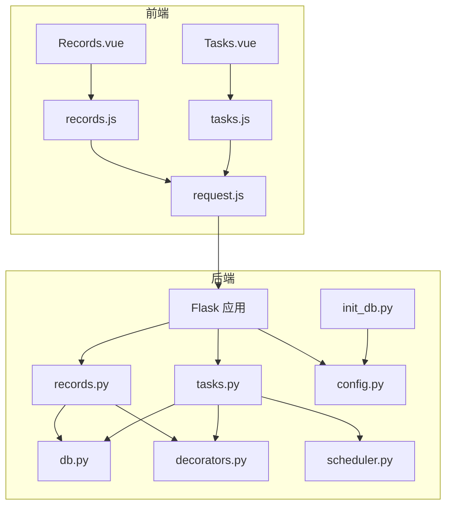
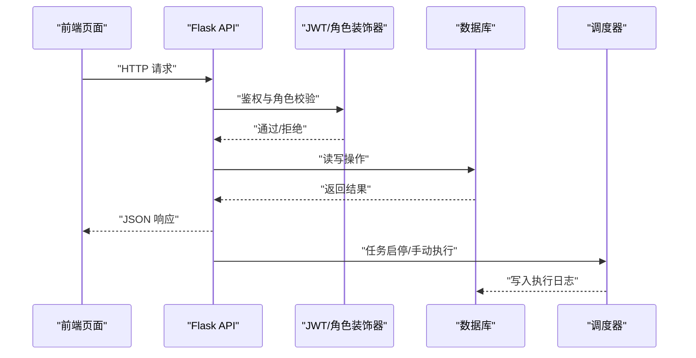
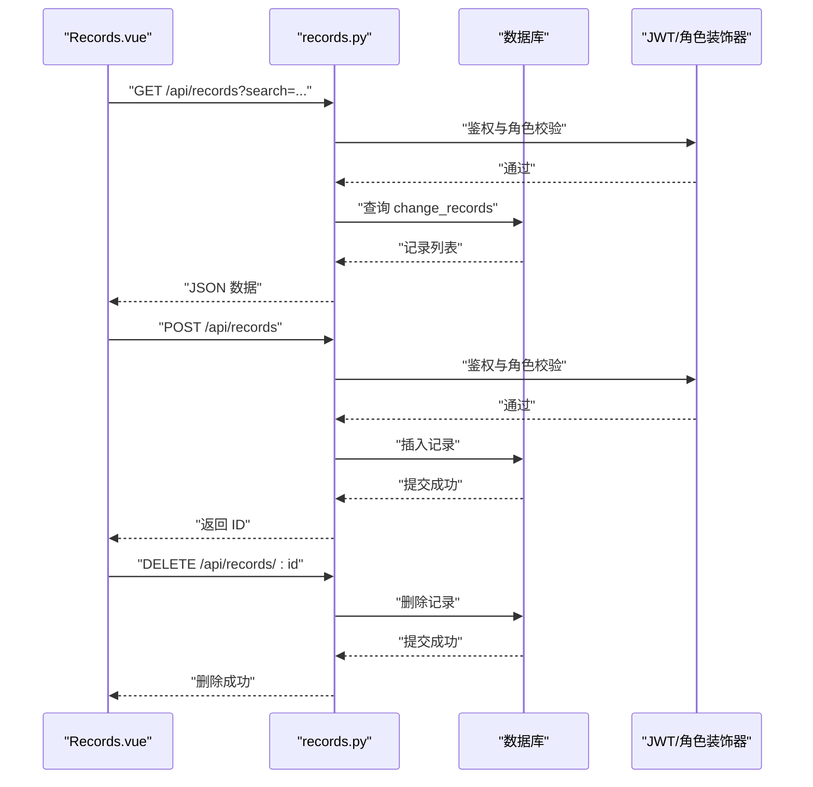
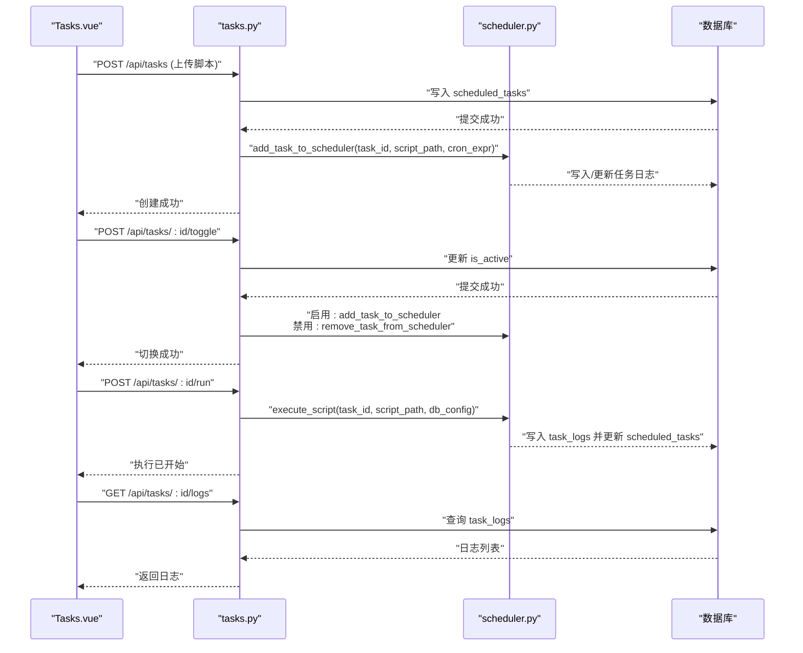
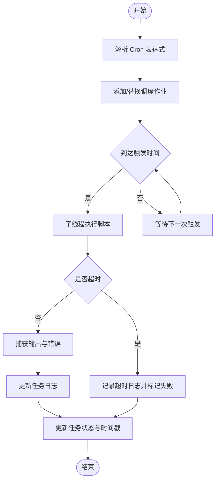
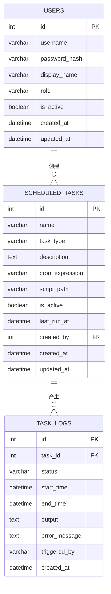
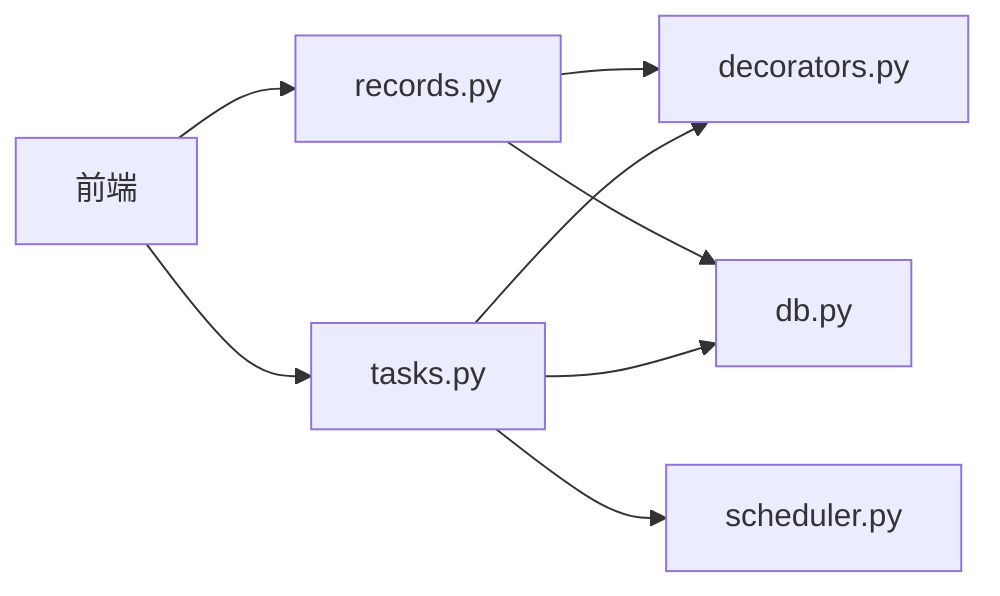

# 运营记录模块

<cite>
**本文档引用的文件**
- [backend/app/api/records.py](file://backend/app/api/records.py)
- [backend/app/api/tasks.py](file://backend/app/api/tasks.py)
- [backend/app/utils/scheduler.py](file://backend/app/utils/scheduler.py)
- [backend/app/utils/db.py](file://backend/app/utils/db.py)
- [backend/app/utils/decorators.py](file://backend/app/utils/decorators.py)
- [backend/init_db.py](file://backend/init_db.py)
- [backend/app/config.py](file://backend/app/config.py)
- [frontend/src/views/Records.vue](file://frontend/src/views/Records.vue)
- [frontend/src/views/Tasks.vue](file://frontend/src/views/Tasks.vue)
- [frontend/src/api/records.js](file://frontend/src/api/records.js)
- [frontend/src/api/tasks.js](file://frontend/src/api/tasks.js)
- [frontend/src/api/request.js](file://frontend/src/api/request.js)
</cite>

## 目录
1. [简介](#简介)
2. [项目结构](#项目结构)
3. [核心组件](#核心组件)
4. [架构总览](#架构总览)
5. [详细组件分析](#详细组件分析)
6. [依赖分析](#依赖分析)
7. [性能考虑](#性能考虑)
8. [故障排查指南](#故障排查指南)
9. [结论](#结论)
10. [附录](#附录)

## 简介
本模块围绕“运营记录”与“定时任务”两大能力展开，提供更新记录的创建、编辑、删除与查询，以及定时任务的配置、调度、执行监控与异常处理。系统通过前后端分离架构实现：前端采用 Vue 3 + Element Plus 构建管理界面；后端基于 Flask 提供 REST API，并使用 APScheduler 实现任务调度；数据库采用 MySQL，通过初始化脚本创建所需表结构。

## 项目结构
- 后端
  - API 层：records.py、tasks.py
  - 工具层：db.py、decorators.py、scheduler.py
  - 配置与初始化：config.py、init_db.py
- 前端
  - 页面视图：Records.vue、Tasks.vue
  - API 封装：records.js、tasks.js、request.js

图表来源
- [backend/app/api/records.py:1-114](file://backend/app/api/records.py#L1-L114)
- [backend/app/api/tasks.py:1-458](file://backend/app/api/tasks.py#L1-L458)
- [backend/app/utils/db.py:1-17](file://backend/app/utils/db.py#L1-L17)
- [backend/app/utils/decorators.py:1-95](file://backend/app/utils/decorators.py#L1-L95)
- [backend/app/utils/scheduler.py:1-249](file://backend/app/utils/scheduler.py#L1-L249)
- [backend/app/config.py:1-21](file://backend/app/config.py#L1-L21)
- [backend/init_db.py:1-230](file://backend/init_db.py#L1-L230)
- [frontend/src/views/Records.vue:1-199](file://frontend/src/views/Records.vue#L1-L199)
- [frontend/src/views/Tasks.vue:1-368](file://frontend/src/views/Tasks.vue#L1-L368)
- [frontend/src/api/records.js:1-14](file://frontend/src/api/records.js#L1-L14)
- [frontend/src/api/tasks.js:1-34](file://frontend/src/api/tasks.js#L1-L34)
- [frontend/src/api/request.js:1-54](file://frontend/src/api/request.js#L1-L54)

章节来源
- [backend/app/api/records.py:1-114](file://backend/app/api/records.py#L1-L114)
- [backend/app/api/tasks.py:1-458](file://backend/app/api/tasks.py#L1-L458)
- [backend/app/utils/db.py:1-17](file://backend/app/utils/db.py#L1-L17)
- [backend/app/utils/decorators.py:1-95](file://backend/app/utils/decorators.py#L1-L95)
- [backend/app/utils/scheduler.py:1-249](file://backend/app/utils/scheduler.py#L1-L249)
- [backend/app/config.py:1-21](file://backend/app/config.py#L1-L21)
- [backend/init_db.py:1-230](file://backend/init_db.py#L1-L230)
- [frontend/src/views/Records.vue:1-199](file://frontend/src/views/Records.vue#L1-L199)
- [frontend/src/views/Tasks.vue:1-368](file://frontend/src/views/Tasks.vue#L1-L368)
- [frontend/src/api/records.js:1-14](file://frontend/src/api/records.js#L1-L14)
- [frontend/src/api/tasks.js:1-34](file://frontend/src/api/tasks.js#L1-L34)
- [frontend/src/api/request.js:1-54](file://frontend/src/api/request.js#L1-L54)

## 核心组件
- 更新记录 API：提供查询、创建、删除接口，支持按关键词检索与按日期倒序排序。
- 定时任务 API：提供任务的增删改查、启停切换、手动执行与日志查询。
- 调度器：基于 APScheduler 的后台调度器，支持 Cron 表达式、超时控制与日志持久化。
- 权限与认证：JWT 认证与角色校验装饰器，确保接口安全。
- 数据库工具：统一的数据库连接获取方法。
- 前端页面与 API 封装：提供可视化的运营记录与任务管理界面。

章节来源
- [backend/app/api/records.py:20-114](file://backend/app/api/records.py#L20-L114)
- [backend/app/api/tasks.py:33-458](file://backend/app/api/tasks.py#L33-L458)
- [backend/app/utils/scheduler.py:14-249](file://backend/app/utils/scheduler.py#L14-L249)
- [backend/app/utils/decorators.py:9-95](file://backend/app/utils/decorators.py#L9-L95)
- [backend/app/utils/db.py:5-17](file://backend/app/utils/db.py#L5-L17)

## 架构总览
系统采用前后端分离架构，前端通过封装的 API 发起请求，后端通过蓝图组织路由，装饰器负责鉴权与权限控制，调度器负责定时任务的执行与日志记录，数据库负责持久化存储。

图表来源
- [frontend/src/api/request.js:1-54](file://frontend/src/api/request.js#L1-L54)
- [backend/app/api/records.py:20-114](file://backend/app/api/records.py#L20-L114)
- [backend/app/api/tasks.py:33-458](file://backend/app/api/tasks.py#L33-L458)
- [backend/app/utils/decorators.py:9-95](file://backend/app/utils/decorators.py#L9-L95)
- [backend/app/utils/scheduler.py:32-144](file://backend/app/utils/scheduler.py#L32-L144)

## 详细组件分析

### 更新记录管理
- 功能范围
  - 查询：支持关键词搜索（修改人、位置、内容），按变更日期与主键倒序排列。
  - 创建：接收编号、日期、修改人、位置、内容、备注等字段，插入数据库并返回自增 ID。
  - 删除：根据记录 ID 删除对应记录。
- 数据模型
  - 表：change_records
  - 字段：id、seq_no、change_date、modifier、location、content、remark、created_at、updated_at
  - 索引：按变更日期与修改人建立索引以优化查询。
- 处理逻辑
  - 查询时对日期字段进行序列化处理，确保前端展示一致。
  - 异常回滚与错误码返回，保证事务一致性。
- 前端交互
  - Records.vue 提供搜索、新增、删除等操作，调用 records.js 封装的 API。

图表来源
- [frontend/src/views/Records.vue:121-183](file://frontend/src/views/Records.vue#L121-L183)
- [frontend/src/api/records.js:1-14](file://frontend/src/api/records.js#L1-L14)
- [backend/app/api/records.py:20-114](file://backend/app/api/records.py#L20-L114)
- [backend/app/utils/decorators.py:9-95](file://backend/app/utils/decorators.py#L9-L95)

章节来源
- [backend/app/api/records.py:20-114](file://backend/app/api/records.py#L20-L114)
- [backend/init_db.py:153-168](file://backend/init_db.py#L153-L168)
- [frontend/src/views/Records.vue:1-199](file://frontend/src/views/Records.vue#L1-L199)
- [frontend/src/api/records.js:1-14](file://frontend/src/api/records.js#L1-L14)

### 定时任务管理
- 功能范围
  - 任务 CRUD：名称、描述、Cron 表达式、脚本文件上传与保存。
  - 启停切换：动态启用/禁用任务，自动同步到调度器。
  - 手动执行：立即在新线程中执行脚本，记录日志与状态。
  - 日志查询：获取任务最近 50 条执行日志。
- 数据模型
  - 表：scheduled_tasks、task_logs
  - scheduled_tasks：id、name、task_type、description、cron_expression、script_path、is_active、last_run_at、created_by、created_at、updated_at
  - task_logs：id、task_id、status、start_time、end_time、output、error_message、triggered_by、created_at
- 调度机制
  - 初始化：从数据库加载所有启用任务，校验脚本文件存在性后加入调度器。
  - 执行：子线程中执行脚本，设置超时时间，记录开始/结束时间、状态、输出与错误。
  - 状态更新：同时更新任务表的 last_status、last_output、last_run_at。
- 前端交互
  - Tasks.vue 提供任务列表、启停开关、手动执行、查看日志、新增/编辑弹窗与文件上传。

图表来源
- [frontend/src/views/Tasks.vue:180-321](file://frontend/src/views/Tasks.vue#L180-L321)
- [frontend/src/api/tasks.js:1-34](file://frontend/src/api/tasks.js#L1-L34)
- [backend/app/api/tasks.py:63-458](file://backend/app/api/tasks.py#L63-L458)
- [backend/app/utils/scheduler.py:32-249](file://backend/app/utils/scheduler.py#L32-L249)
- [backend/init_db.py:170-211](file://backend/init_db.py#L170-L211)

章节来源
- [backend/app/api/tasks.py:33-458](file://backend/app/api/tasks.py#L33-L458)
- [backend/app/utils/scheduler.py:146-249](file://backend/app/utils/scheduler.py#L146-L249)
- [backend/init_db.py:170-211](file://backend/init_db.py#L170-L211)
- [frontend/src/views/Tasks.vue:1-368](file://frontend/src/views/Tasks.vue#L1-L368)
- [frontend/src/api/tasks.js:1-34](file://frontend/src/api/tasks.js#L1-L34)

### 调度器与任务执行流程
- 关键流程
  - 任务添加：解析 Cron 表达式，移除旧任务并新增，支持替换现有作业。
  - 执行回调：在独立线程中执行脚本，捕获 stdout/stderr，设置超时。
  - 日志记录：插入 task_logs，更新 scheduled_tasks 的 last_run_at、last_status、last_output。
  - 错误处理：超时与异常均记录失败状态与错误信息。
- 并发与隔离
  - 每次执行在新线程中进行，避免阻塞调度器主线程。
  - 使用独立数据库连接，避免与主业务连接池冲突。

图表来源
- [backend/app/utils/scheduler.py:146-249](file://backend/app/utils/scheduler.py#L146-L249)

章节来源
- [backend/app/utils/scheduler.py:32-144](file://backend/app/utils/scheduler.py#L32-L144)

### 数据模型设计
- 更新记录表（change_records）
  - 主键：id
  - 关键字段：seq_no、change_date、modifier、location、content、remark
  - 索引：change_date、modifier
- 定时任务表（scheduled_tasks）
  - 主键：id
  - 关键字段：name、task_type、description、cron_expression、script_path、is_active、last_run_at、created_by
  - 外键：created_by -> users(id)
- 任务日志表（task_logs）
  - 主键：id
  - 关键字段：task_id、status、start_time、end_time、output、error_message、triggered_by
  - 外键：task_id -> scheduled_tasks(id)（级联删除）

图表来源
- [backend/init_db.py:153-211](file://backend/init_db.py#L153-L211)

章节来源
- [backend/init_db.py:153-211](file://backend/init_db.py#L153-L211)

## 依赖分析
- 组件耦合
  - API 层依赖装饰器进行鉴权与权限控制，依赖数据库工具获取连接。
  - 任务 API 依赖调度器模块，调度器依赖 APScheduler 与子进程执行。
  - 前端通过统一的请求封装与后端交互，避免直接依赖具体路由。
- 外部依赖
  - Flask、APScheduler、PyMySQL、Axios、Element Plus、Vue 3。
- 循环依赖
  - 当前模块未发现循环导入，职责清晰：API 负责路由与业务编排，工具层负责通用能力，调度器负责异步执行。

图表来源
- [backend/app/api/records.py:1-114](file://backend/app/api/records.py#L1-L114)
- [backend/app/api/tasks.py:1-458](file://backend/app/api/tasks.py#L1-L458)
- [backend/app/utils/decorators.py:1-95](file://backend/app/utils/decorators.py#L1-L95)
- [backend/app/utils/db.py:1-17](file://backend/app/utils/db.py#L1-L17)
- [backend/app/utils/scheduler.py:1-249](file://backend/app/utils/scheduler.py#L1-L249)

章节来源
- [backend/app/api/records.py:1-114](file://backend/app/api/records.py#L1-L114)
- [backend/app/api/tasks.py:1-458](file://backend/app/api/tasks.py#L1-L458)
- [backend/app/utils/decorators.py:1-95](file://backend/app/utils/decorators.py#L1-L95)
- [backend/app/utils/db.py:1-17](file://backend/app/utils/db.py#L1-L17)
- [backend/app/utils/scheduler.py:1-249](file://backend/app/utils/scheduler.py#L1-L249)

## 性能考虑
- 查询优化
  - 更新记录查询按变更日期与主键倒序，配合索引可提升大数据量下的排序效率。
- 并发与隔离
  - 调度执行在独立线程中进行，避免阻塞调度器；每次执行使用独立数据库连接，降低锁竞争。
- 超时与资源
  - 脚本执行设置超时时间，防止长时间占用资源；日志输出截断长度避免过大字段影响性能。
- 前端交互
  - 列表加载使用分页/限制数量策略，日志查询限制最近 50 条，减少一次性传输数据量。

## 故障排查指南
- 认证与权限
  - 缺少 Token 或格式错误：检查请求头 Authorization 是否为 Bearer token。
  - 角色不足：确认用户角色是否包含 admin/operator。
- 数据库连接
  - 连接失败：核对数据库配置项（主机、端口、账号、密码、库名）。
- 任务执行异常
  - 脚本不存在：确认脚本路径与文件存在性。
  - 执行超时：检查脚本逻辑与外部依赖，必要时延长超时阈值。
  - 日志为空：确认任务状态是否为 running，或检查数据库连接与写入逻辑。
- 前端错误处理
  - 统一响应拦截器会提示错误信息并处理 401 登录过期场景，建议结合浏览器开发者工具查看网络请求与响应。

章节来源
- [backend/app/utils/decorators.py:9-95](file://backend/app/utils/decorators.py#L9-L95)
- [backend/app/utils/db.py:5-17](file://backend/app/utils/db.py#L5-L17)
- [backend/app/utils/scheduler.py:99-134](file://backend/app/utils/scheduler.py#L99-L134)
- [frontend/src/api/request.js:25-51](file://frontend/src/api/request.js#L25-L51)

## 结论
运营记录模块通过清晰的 API 设计与完善的权限控制，实现了更新记录的全生命周期管理；定时任务模块借助调度器与日志体系，提供了可靠的自动化执行与可观测性。整体架构具备良好的扩展性与可维护性，适合在生产环境中持续演进。

## 附录
- 配置项参考
  - 数据库：DB_HOST、DB_PORT、DB_USER、DB_PASSWORD、DB_NAME
  - 服务：SECRET_KEY、JWT_SECRET_KEY、JWT_EXPIRATION_HOURS、DEBUG、HOST、PORT
  - 上传：UPLOAD_FOLDER、MAX_CONTENT_LENGTH
- 初始化步骤
  - 执行数据库初始化脚本创建表结构与默认管理员账户。
  - 启动后端服务，前端通过 /api 前缀访问接口。

章节来源
- [backend/app/config.py:4-21](file://backend/app/config.py#L4-L21)
- [backend/init_db.py:22-230](file://backend/init_db.py#L22-L230)