# 阿里云集成系统

<cite>
**本文档引用的文件**
- [backend/app/__init__.py](file://backend/app/__init__.py)
- [backend/app/config.py](file://backend/app/config.py)
- [backend/app/extensions.py](file://backend/app/extensions.py)
- [backend/run.py](file://backend/run.py)
- [backend/app/api/aliyun_accounts.py](file://backend/app/api/aliyun_accounts.py)
- [backend/app/utils/db.py](file://backend/app/utils/db.py)
- [backend/app/utils/scheduler.py](file://backend/app/utils/scheduler.py)
- [backend/app/utils/auth.py](file://backend/app/utils/auth.py)
- [backend/app/utils/ssl_checker.py](file://backend/app/utils/ssl_checker.py)
- [frontend/src/main.js](file://frontend/src/main.js)
- [frontend/src/views/AliyunAccounts.vue](file://frontend/src/views/AliyunAccounts.vue)
- [frontend/src/api/aliyunAccounts.js](file://frontend/src/api/aliyunAccounts.js)
- [docker-compose.yml](file://docker-compose.yml)
- [ssl_cert_monitor/ssl_cert_monitor.py](file://ssl_cert_monitor/ssl_cert_monitor.py)
- [ssl_cert_monitor/requirements.txt](file://ssl_cert_monitor/requirements.txt)
- [ssl_cert_monitor/aliyun_cert.py](file://ssl_cert_monitor/aliyun_cert.py)
</cite>

## 更新摘要
**变更内容**
- 增强了阿里云证书ID提取逻辑的兼容性，支持多种命名规范
- 改进了SDK参数兼容性处理，适配不同版本的阿里云SDK
- 优化了证书下载和解析的健壮性
- 增加了对证书内容属性的多格式匹配支持

## 目录
1. [项目简介](#项目简介)
2. [项目结构](#项目结构)
3. [核心组件](#核心组件)
4. [架构概览](#架构概览)
5. [详细组件分析](#详细组件分析)
6. [依赖关系分析](#依赖关系分析)
7. [性能考虑](#性能考虑)
8. [故障排除指南](#故障排除指南)
9. [结论](#结论)

## 项目简介

阿里云集成系统是一个基于Python Flask和Vue.js开发的运维管理平台，专门用于管理和监控阿里云相关资源。该系统提供了完整的阿里云账户管理、SSL证书监控、域名管理、用户认证等功能，支持Docker容器化部署。

系统的核心特性包括：
- 阿里云账户集中管理
- SSL证书自动检测和预警
- 域名到期提醒机制
- 基于JWT的用户认证
- 定时任务调度系统
- 响应式前端界面

## 项目结构

该项目采用前后端分离的架构设计，主要分为三个部分：

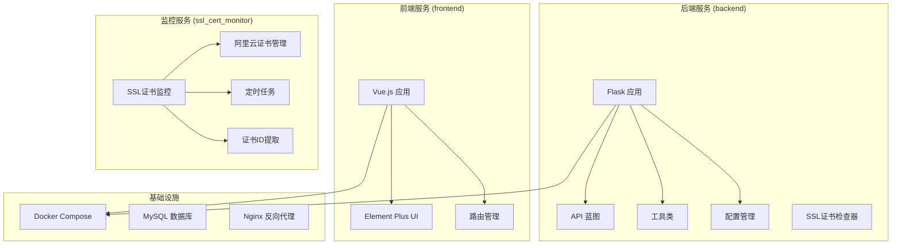

**图表来源**
- [backend/app/__init__.py:1-66](file://backend/app/__init__.py#L1-L66)
- [frontend/src/main.js:1-23](file://frontend/src/main.js#L1-L23)
- [docker-compose.yml:1-75](file://docker-compose.yml#L1-L75)

**章节来源**
- [backend/app/__init__.py:1-66](file://backend/app/__init__.py#L1-L66)
- [frontend/src/main.js:1-23](file://frontend/src/main.js#L1-L23)
- [docker-compose.yml:1-75](file://docker-compose.yml#L1-L75)

## 核心组件

### 后端应用核心组件

系统的核心由以下关键组件构成：

1. **Flask 应用工厂模式** - 提供统一的应用创建和配置管理
2. **API 蓝图系统** - 模块化的API路由管理
3. **数据库连接池** - 基于PyMySQL的数据库连接管理
4. **JWT认证系统** - 基于JSON Web Token的用户身份验证
5. **定时任务调度器** - APScheduler驱动的任务调度系统
6. **阿里云集成模块** - 支持多账户的阿里云资源管理
7. **SSL证书检查器** - 增强的证书ID提取和SDK兼容性处理

### 前端应用核心组件

前端采用现代化的Vue.js技术栈：

1. **Vue 3 + TypeScript** - 现代化的前端框架
2. **Element Plus UI** - 基于Element Design的组件库
3. **Pinia 状态管理** - Vue官方推荐的状态管理方案
4. **Vue Router** - 单页面应用路由管理
5. **响应式布局** - 支持多种设备的自适应界面

**章节来源**
- [backend/app/config.py:1-38](file://backend/app/config.py#L1-L38)
- [backend/app/utils/db.py:1-17](file://backend/app/utils/db.py#L1-L17)
- [backend/app/utils/auth.py:1-83](file://backend/app/utils/auth.py#L1-L83)

## 架构概览

系统采用微服务架构，通过Docker容器化部署，实现了高度的可扩展性和可维护性。

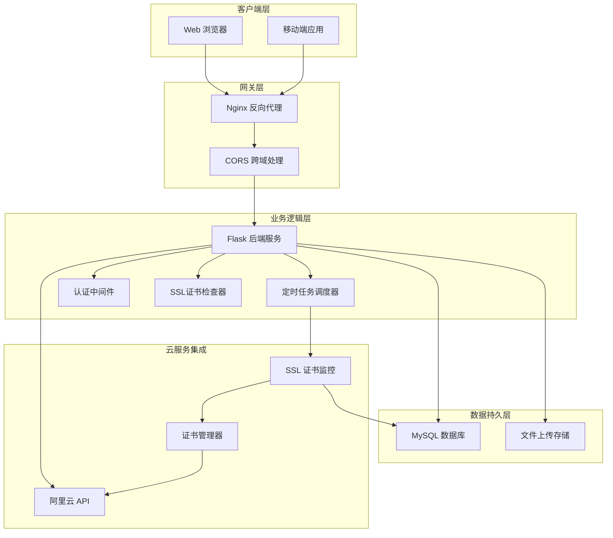

**图表来源**
- [docker-compose.yml:1-75](file://docker-compose.yml#L1-L75)
- [backend/app/__init__.py:1-66](file://backend/app/__init__.py#L1-L66)
- [backend/app/utils/scheduler.py:1-512](file://backend/app/utils/scheduler.py#L1-L512)

## 详细组件分析

### 阿里云账户管理系统

阿里云账户管理是系统的核心功能之一，提供了完整的账户生命周期管理。

#### 数据模型设计

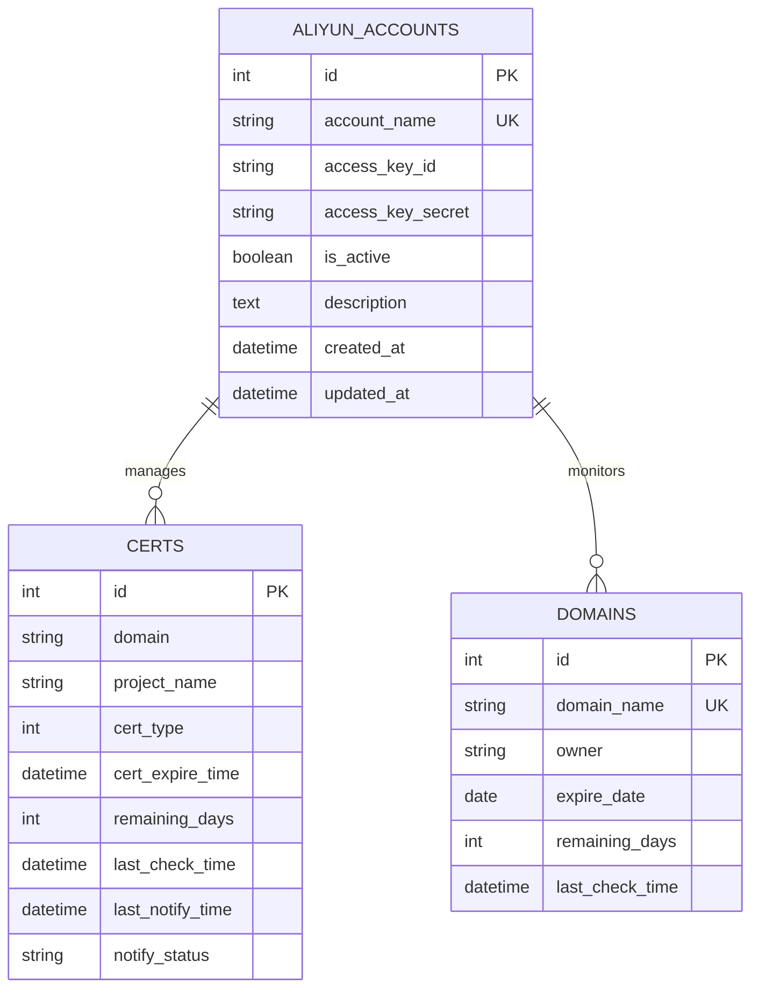

#### API 接口流程

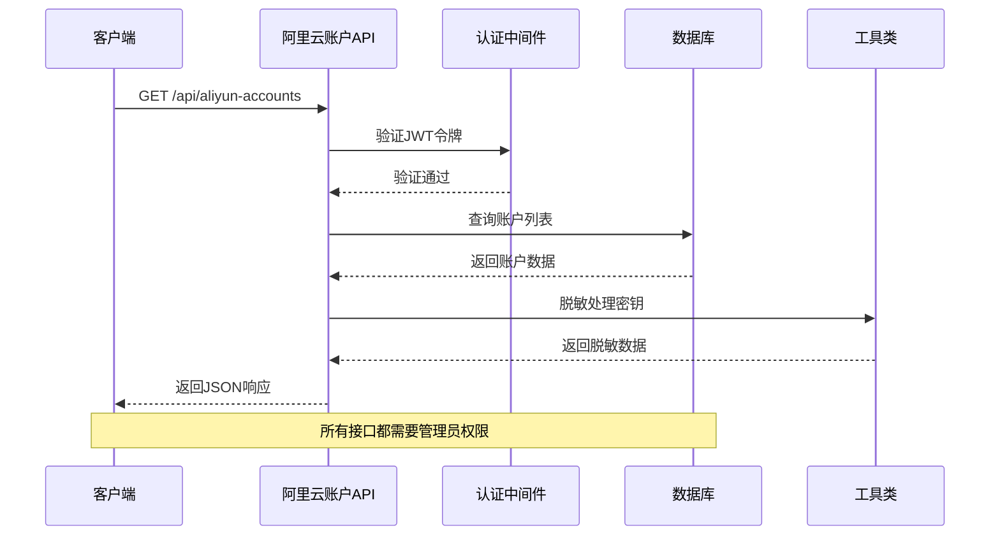

**图表来源**
- [backend/app/api/aliyun_accounts.py:26-57](file://backend/app/api/aliyun_accounts.py#L26-L57)
- [backend/app/utils/auth.py:38-56](file://backend/app/utils/auth.py#L38-L56)

#### 核心功能实现

系统提供了以下核心功能：

1. **账户创建** - 支持批量创建阿里云账户
2. **账户查询** - 提供分页查询和条件筛选
3. **账户更新** - 支持部分字段更新，包含智能密钥处理
4. **账户删除** - 完全删除账户及其关联数据
5. **状态管理** - 支持账户启用/禁用切换

**章节来源**
- [backend/app/api/aliyun_accounts.py:1-257](file://backend/app/api/aliyun_accounts.py#L1-L257)

### SSL证书监控系统

系统集成了SSL证书监控功能，能够自动检测证书有效期并发送预警通知。

#### 监控架构设计

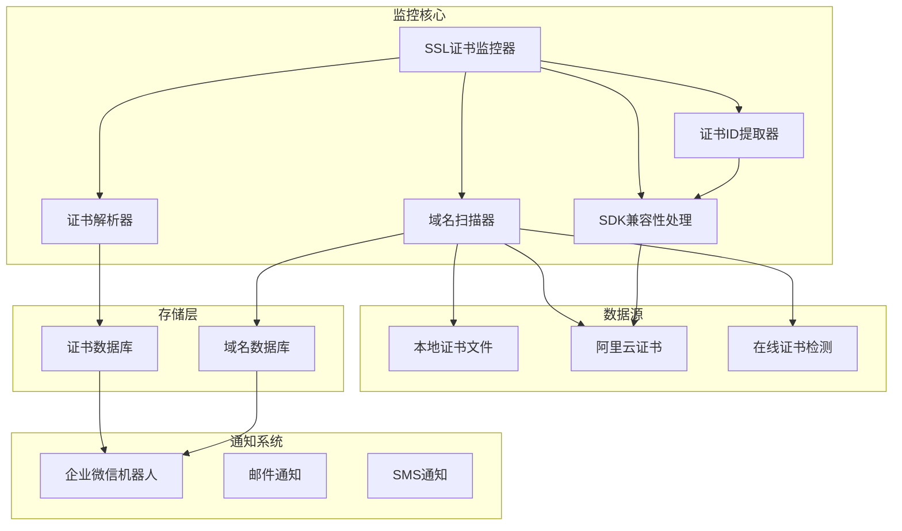

**图表来源**
- [ssl_cert_monitor/ssl_cert_monitor.py:1-800](file://ssl_cert_monitor/ssl_cert_monitor.py#L1-L800)

#### 增强的证书ID提取逻辑

**更新** 系统现在支持多种证书ID提取方式，提高了与不同阿里云SDK版本的兼容性

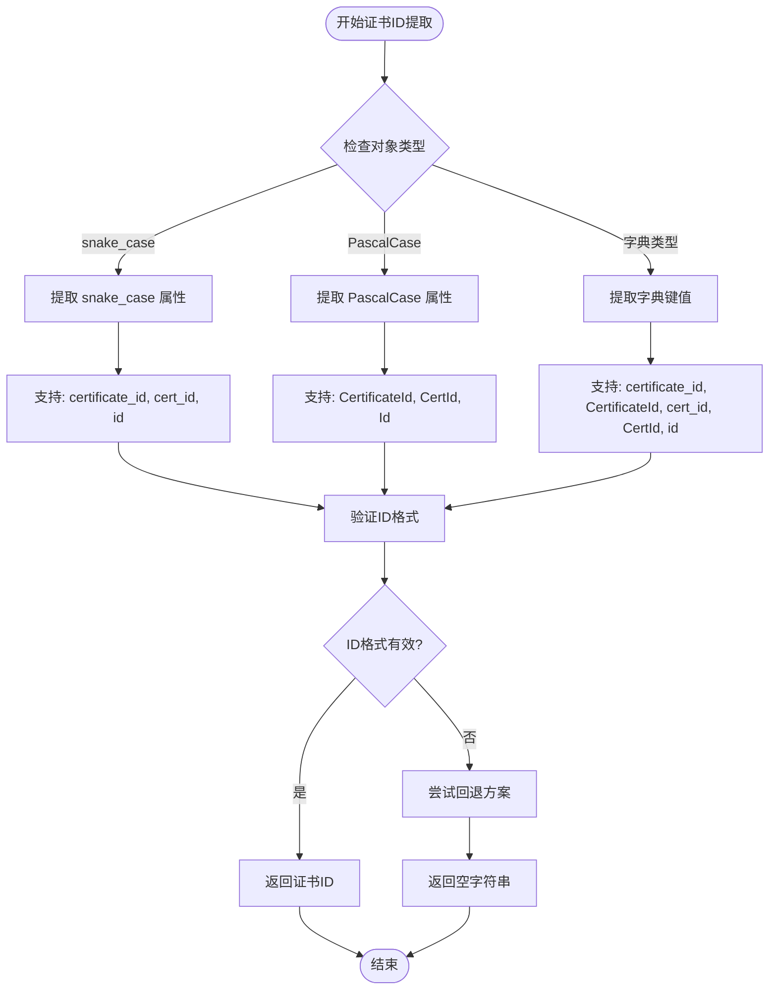

**图表来源**
- [backend/app/utils/ssl_checker.py:238-257](file://backend/app/utils/ssl_checker.py#L238-L257)
- [ssl_cert_monitor/ssl_cert_monitor.py:357-372](file://ssl_cert_monitor/ssl_cert_monitor.py#L357-L372)

#### SDK参数兼容性处理

**更新** 新增了对不同SDK版本参数名的兼容性处理

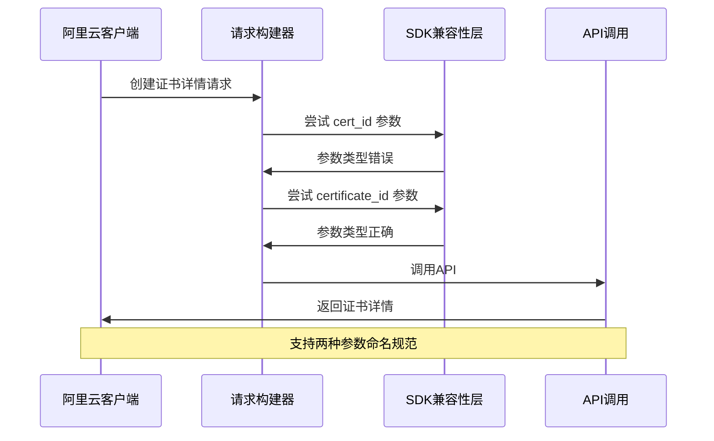

**图表来源**
- [backend/app/utils/ssl_checker.py:527-539](file://backend/app/utils/ssl_checker.py#L527-L539)

#### 证书检测算法

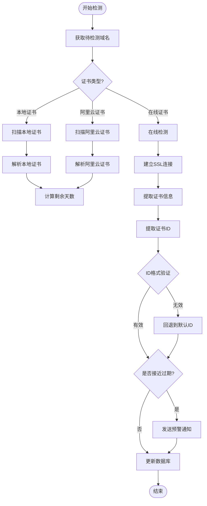

**图表来源**
- [ssl_cert_monitor/ssl_cert_monitor.py:627-711](file://ssl_cert_monitor/ssl_cert_monitor.py#L627-L711)

**章节来源**
- [ssl_cert_monitor/ssl_cert_monitor.py:1-800](file://ssl_cert_monitor/ssl_cert_monitor.py#L1-L800)
- [backend/app/utils/ssl_checker.py:495-614](file://backend/app/utils/ssl_checker.py#L495-L614)

### 定时任务调度系统

系统内置了强大的定时任务调度能力，支持多种类型的自动化任务。

#### 任务调度架构

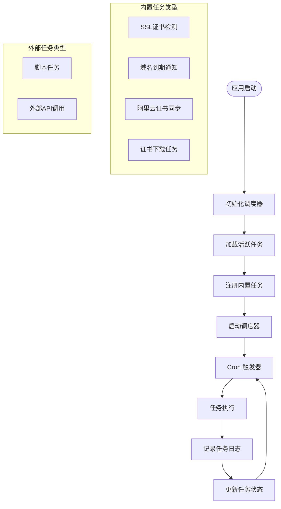

**图表来源**
- [backend/app/utils/scheduler.py:206-315](file://backend/app/utils/scheduler.py#L206-L315)

#### 任务执行流程

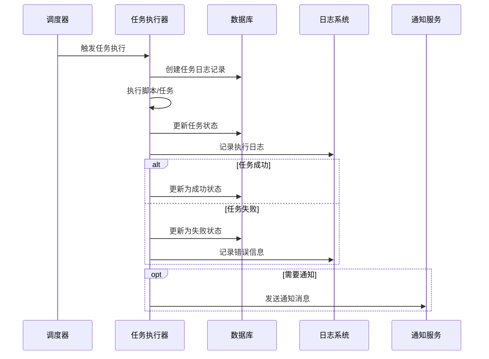

**图表来源**
- [backend/app/utils/scheduler.py:37-149](file://backend/app/utils/scheduler.py#L37-L149)

**章节来源**
- [backend/app/utils/scheduler.py:1-512](file://backend/app/utils/scheduler.py#L1-L512)

### 前端用户界面

前端采用现代化的Vue.js技术栈，提供了直观易用的用户界面。

#### 组件架构设计

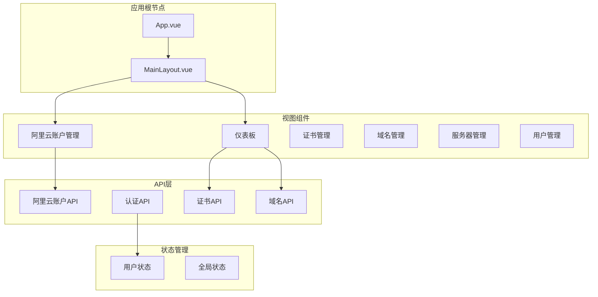

**图表来源**
- [frontend/src/views/AliyunAccounts.vue:1-192](file://frontend/src/views/AliyunAccounts.vue#L1-L192)
- [frontend/src/main.js:1-23](file://frontend/src/main.js#L1-L23)

#### 表单验证流程

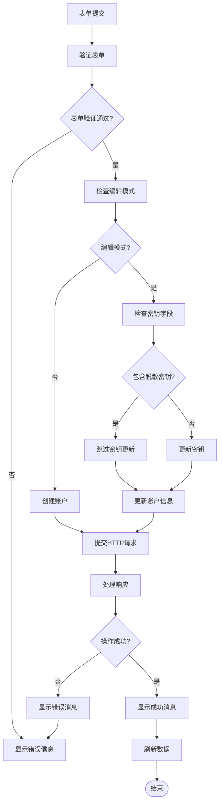

**图表来源**
- [frontend/src/views/AliyunAccounts.vue:132-164](file://frontend/src/views/AliyunAccounts.vue#L132-L164)

**章节来源**
- [frontend/src/views/AliyunAccounts.vue:1-192](file://frontend/src/views/AliyunAccounts.vue#L1-L192)
- [frontend/src/api/aliyunAccounts.js:1-18](file://frontend/src/api/aliyunAccounts.js#L1-L18)

## 依赖关系分析

系统采用了模块化的依赖管理策略，确保各组件之间的松耦合和高内聚。

### 后端依赖关系

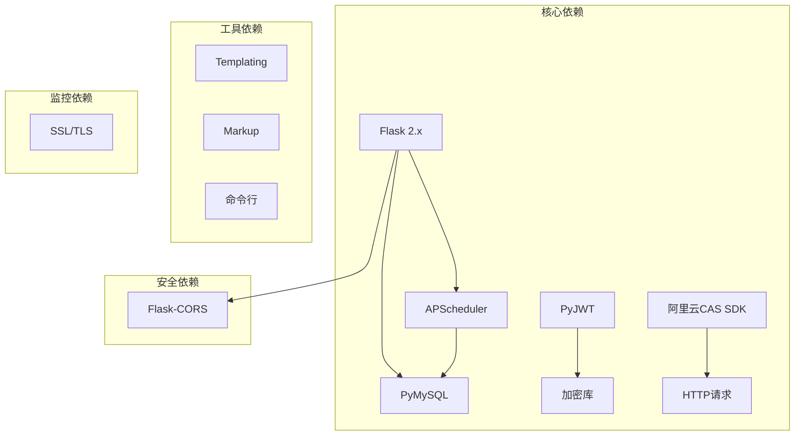

**图表来源**
- [ssl_cert_monitor/requirements.txt:1-14](file://ssl_cert_monitor/requirements.txt#L1-L14)

### 前端依赖关系

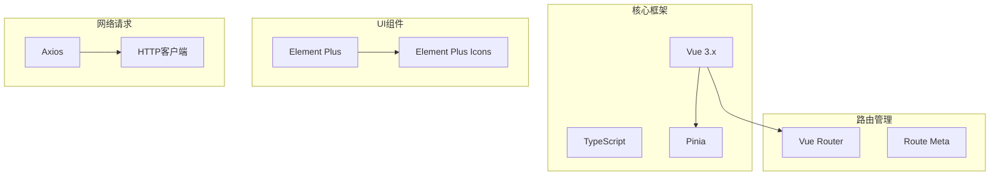

**图表来源**
- [frontend/package.json](file://frontend/package.json)

### 容器化部署架构

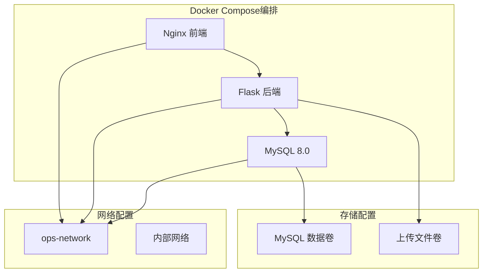

**图表来源**
- [docker-compose.yml:1-75](file://docker-compose.yml#L1-L75)

**章节来源**
- [docker-compose.yml:1-75](file://docker-compose.yml#L1-L75)

## 性能考虑

系统在设计时充分考虑了性能优化和可扩展性要求。

### 数据库性能优化

1. **连接池管理** - 使用PyMySQL的连接池减少连接开销
2. **索引优化** - 关键查询字段建立适当索引
3. **查询优化** - 使用参数化查询防止SQL注入
4. **事务管理** - 合理使用事务保证数据一致性

### 缓存策略

1. **阿里云证书缓存** - 实现5分钟TTL的证书信息缓存
2. **会话缓存** - JWT令牌的短期缓存机制
3. **配置缓存** - 系统配置的内存缓存

### 并发处理

1. **异步任务** - 使用线程池处理耗时任务
2. **非阻塞I/O** - SSL连接的超时控制
3. **负载均衡** - 前后端分离的架构设计

## 故障排除指南

### 常见问题诊断

#### 数据库连接问题

**症状**: 应用启动时报数据库连接错误
**解决方案**:
1. 检查MySQL服务状态
2. 验证数据库凭据配置
3. 确认网络连通性
4. 检查防火墙设置

#### 认证失败问题

**症状**: API请求返回401未授权错误
**解决方案**:
1. 验证JWT令牌有效性
2. 检查令牌过期时间
3. 确认用户角色权限
4. 重新生成访问令牌

#### 定时任务执行失败

**症状**: 任务调度器报错或任务不执行
**解决方案**:
1. 检查任务脚本路径
2. 验证Cron表达式格式
3. 查看任务执行日志
4. 确认任务依赖服务可用

#### 阿里云证书ID提取失败

**症状**: 证书ID提取失败或返回空值
**解决方案**:
1. 检查阿里云SDK版本兼容性
2. 验证证书ID格式（支持多种命名规范）
3. 确认阿里云账户权限配置
4. 查看证书ID提取日志

### 日志分析

系统提供了完善的日志记录机制，便于问题诊断：

1. **应用日志** - Flask应用的详细运行日志
2. **任务日志** - 定时任务的执行状态记录
3. **错误日志** - 异常情况的详细错误信息
4. **访问日志** - API请求的访问记录
5. **证书监控日志** - 证书ID提取和SDK兼容性处理日志

**章节来源**
- [backend/app/utils/scheduler.py:104-139](file://backend/app/utils/scheduler.py#L104-L139)

## 结论

阿里云集成系统是一个功能完整、架构清晰的运维管理平台。系统采用现代化的技术栈和最佳实践，具备以下优势：

1. **模块化设计** - 清晰的组件划分和职责分离
2. **高可用性** - Docker容器化部署和健康检查机制
3. **安全性** - 完善的认证授权和数据保护
4. **可扩展性** - 支持插件化扩展和水平扩展
5. **易维护性** - 完善的文档和监控机制

**更新亮点**:
- **增强的证书ID提取逻辑** - 支持多种命名规范，提高系统兼容性
- **SDK参数兼容性处理** - 适配不同版本的阿里云SDK，提升稳定性
- **健壮的证书下载机制** - 改进的错误处理和回退方案
- **多格式证书内容匹配** - 支持不同的属性命名风格

系统特别适合需要管理多个阿里云账户、监控SSL证书和域名状态的企业级应用场景。通过合理的架构设计和技术选型，为用户提供了一个稳定可靠、功能丰富的运维管理解决方案。